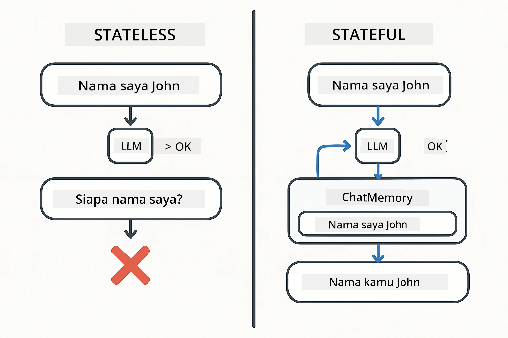
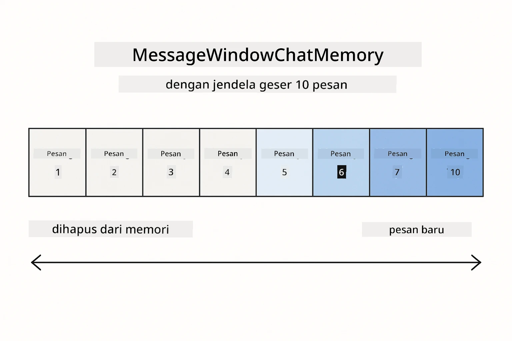
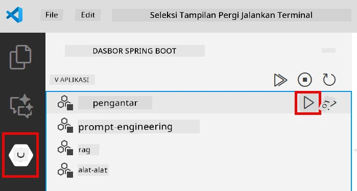
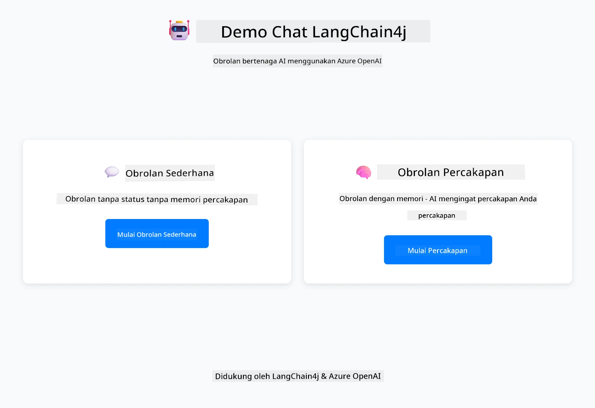
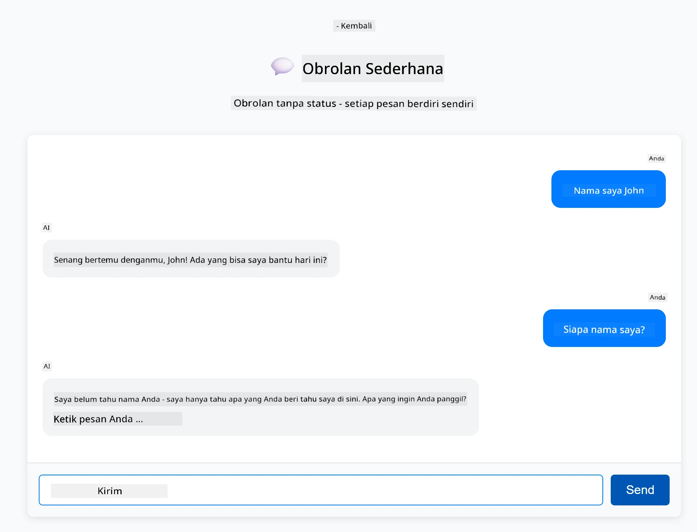
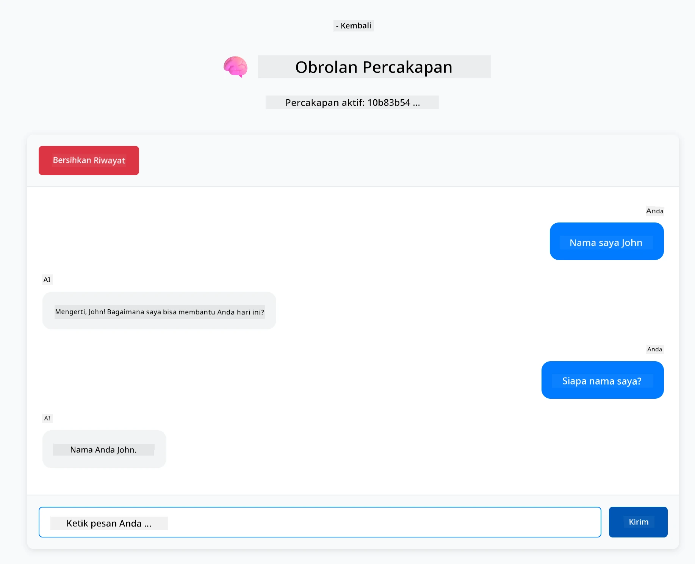

# Modul 01: Memulai dengan LangChain4j

## Daftar Isi

- [Video Walkthrough](#video-walkthrough)
- [Apa yang Akan Anda Pelajari](#apa-yang-akan-anda-pelajari)
- [Prasyarat](#prasyarat)
- [Memahami Masalah Inti](#memahami-masalah-inti)
- [Memahami Token](#memahami-token)
- [Cara Kerja Memori](#cara-kerja-memori)
- [Bagaimana Ini Menggunakan LangChain4j](#bagaimana-ini-menggunakan-langchain4j)
- [Menerapkan Infrastruktur Azure OpenAI](#menerapkan-infrastruktur-azure-openai)
- [Menjalankan Aplikasi Secara Lokal](#menjalankan-aplikasi-secara-lokal)
- [Menggunakan Aplikasi](#menggunakan-aplikasi)
  - [Chat Tanpa Status (Panel Kiri)](#chat-tanpa-status-panel-kiri)
  - [Chat Dengan Status (Panel Kanan)](#chat-dengan-status-panel-kanan)
- [Langkah Selanjutnya](#langkah-selanjutnya)

## Video Walkthrough

Tonton sesi langsung ini yang menjelaskan cara memulai dengan modul ini:

<a href="https://www.youtube.com/live/nl_troDm8rQ?si=6b85S8xGjWnT2fX9"></a>

## Apa yang Akan Anda Pelajari

Ini adalah titik awal Anda dengan LangChain4j dan Azure OpenAI. Kami mulai dengan dasar-dasar dan mulai membangun aplikasi gaya produksi. Modul ini berfokus pada AI percakapan yang mengingat konteks dan mempertahankan status — konsep dasar yang dibangun oleh setiap modul berikutnya.

Kami akan menggunakan GPT-5.2 Azure OpenAI sepanjang panduan ini karena kemampuan penalarannya yang maju membuat perilaku pola yang berbeda lebih jelas. Ketika Anda menambahkan memori, Anda akan melihat perbedaannya dengan jelas. Ini membuat lebih mudah untuk memahami apa yang dibawa setiap komponen ke aplikasi Anda.

Anda akan membangun satu aplikasi yang menunjukkan kedua pola tersebut:

**Chat Tanpa Status** - Setiap permintaan bersifat independen. Model tidak mengingat pesan sebelumnya. Ini adalah titik awal yang paling sederhana.

**Percakapan Dengan Status** - Setiap permintaan mencakup riwayat percakapan. Model mempertahankan konteks di beberapa giliran. Ini yang dibutuhkan aplikasi produksi.

## Prasyarat

- Langganan Azure dengan akses Azure OpenAI
- Java 21, Maven 3.9+
- Azure CLI (https://learn.microsoft.com/en-us/cli/azure/install-azure-cli)
- Azure Developer CLI (azd) (https://learn.microsoft.com/en-us/azure/developer/azure-developer-cli/install-azd)

> **Catatan:** Java, Maven, Azure CLI, dan Azure Developer CLI (azd) telah diinstal sebelumnya di devcontainer yang disediakan.

> **Catatan:** Modul ini menggunakan GPT-5.2 di Azure OpenAI. Penyebaran dikonfigurasi secara otomatis melalui `azd up` - jangan ubah nama model di kode.

## Memahami Masalah Inti

Model bahasa tidak memiliki status. Setiap panggilan API bersifat independen. Jika Anda mengirim "Nama saya John" dan kemudian bertanya "Siapa nama saya?", model tidak tahu Anda baru saja memperkenalkan diri. Model memperlakukan setiap permintaan seolah itu adalah percakapan pertama Anda.

Ini baik untuk tanya jawab sederhana tapi tidak berguna untuk aplikasi nyata. Bot layanan pelanggan perlu mengingat apa yang Anda bilang. Asisten pribadi perlu konteks. Percakapan multi-giliran memerlukan memori.

Diagram berikut membandingkan kedua pendekatan — di kiri, panggilan tanpa status yang melupakan nama Anda; di kanan, panggilan dengan status yang didukung oleh ChatMemory yang mengingatnya.



*Perbedaan antara percakapan tanpa status (panggilan independen) dan dengan status (sadar konteks)*

## Memahami Token

Sebelum masuk ke percakapan, penting untuk memahami token - unit dasar teks yang diproses model bahasa:


*Contoh bagaimana teks dipecah menjadi token - "I love AI!" menjadi 4 unit proses terpisah*

Token adalah cara model AI mengukur dan memproses teks. Kata, tanda baca, dan bahkan spasi bisa menjadi token. Model Anda memiliki batas berapa banyak token yang bisa diproses sekaligus (400.000 untuk GPT-5.2, dengan hingga 272.000 token input dan 128.000 token output). Memahami token membantu Anda mengelola panjang percakapan dan biaya.

## Cara Kerja Memori

Memori chat memecahkan masalah tanpa status dengan mempertahankan riwayat percakapan. Sebelum mengirim permintaan ke model, kerangka kerja menyisipkan pesan relevan sebelumnya. Ketika Anda bertanya "Siapa nama saya?", sistem sebenarnya mengirim seluruh riwayat percakapan, memungkinkan model melihat bahwa Anda sebelumnya berkata "Nama saya John."

LangChain4j menyediakan implementasi memori yang mengelola ini secara otomatis. Anda memilih berapa banyak pesan yang disimpan dan kerangka kerja mengatur jendela konteks. Diagram di bawah menunjukkan bagaimana MessageWindowChatMemory mempertahankan jendela geser dari pesan-pesan terbaru.



*MessageWindowChatMemory mempertahankan jendela geser dari pesan terbaru, secara otomatis menghapus pesan lama*

## Bagaimana Ini Menggunakan LangChain4j

Modul ini mengintegrasikan Spring Boot dan menambahkan memori percakapan. Ini bagaimana komponennya saling melengkapi:

**Dependensi** - Tambahkan dua pustaka LangChain4j:

```xml
<dependency>
    <groupId>dev.langchain4j</groupId>
    <artifactId>langchain4j</artifactId> <!-- Inherited from BOM in root pom.xml -->
</dependency>
<dependency>
    <groupId>dev.langchain4j</groupId>
    <artifactId>langchain4j-open-ai-official</artifactId> <!-- Inherited from BOM in root pom.xml -->
</dependency>
```

**Model Chat** - Konfigurasikan Azure OpenAI sebagai bean Spring ([LangChainConfig.java](../../../01-introduction/src/main/java/com/example/langchain4j/config/LangChainConfig.java)):

```java
@Bean
public OpenAiOfficialChatModel openAiOfficialChatModel() {
    return OpenAiOfficialChatModel.builder()
            .baseUrl(azureEndpoint)
            .apiKey(azureApiKey)
            .modelName(deploymentName)
            .timeout(Duration.ofMinutes(5))
            .maxRetries(3)
            .build();
}
```

Builder membaca kredensial dari variabel lingkungan yang diatur oleh `azd up`. Mengatur `baseUrl` ke endpoint Azure Anda membuat klien OpenAI berfungsi dengan Azure OpenAI.

**Memori Percakapan** - Melacak riwayat chat dengan MessageWindowChatMemory ([ConversationService.java](../../../01-introduction/src/main/java/com/example/langchain4j/service/ConversationService.java)):

```java
ChatMemory memory = MessageWindowChatMemory.withMaxMessages(10);

memory.add(UserMessage.from("My name is John"));
memory.add(AiMessage.from("Nice to meet you, John!"));

memory.add(UserMessage.from("What's my name?"));
AiMessage aiMessage = chatModel.chat(memory.messages()).aiMessage();
memory.add(aiMessage);
```

Buat memori dengan `withMaxMessages(10)` untuk menyimpan 10 pesan terakhir. Tambahkan pesan pengguna dan AI dengan pembungkus bertipe: `UserMessage.from(text)` dan `AiMessage.from(text)`. Ambil riwayat dengan `memory.messages()` dan kirim ke model. Layanan menyimpan instansi memori terpisah per ID percakapan, memungkinkan banyak pengguna chat secara bersamaan.

> **🤖 Coba dengan [GitHub Copilot](https://github.com/features/copilot) Chat:** Buka [`ConversationService.java`](../../../01-introduction/src/main/java/com/example/langchain4j/service/ConversationService.java) dan tanyakan:
> - "Bagaimana MessageWindowChatMemory memutuskan pesan mana yang dihapus saat jendela penuh?"
> - "Bisakah saya mengimplementasikan penyimpanan memori khusus menggunakan database daripada di memori?"
> - "Bagaimana saya menambahkan ringkasan untuk mengompres riwayat percakapan lama?"

Endpoint chat tanpa status melewati memori sepenuhnya - hanya `chatModel.chat(prompt)` seperti pada awal cepat. Endpoint dengan status menambahkan pesan ke memori, mengambil riwayat, dan menyertakan konteks tersebut dengan setiap permintaan. Konfigurasi model sama, pola berbeda.

## Menerapkan Infrastruktur Azure OpenAI

**Bash:**
```bash
cd 01-introduction
azd up  # Pilih langganan dan lokasi (eastus2 direkomendasikan)
```

**PowerShell:**
```powershell
cd 01-introduction
azd up  # Pilih langganan dan lokasi (eastus2 direkomendasikan)
```

> **Catatan:** Jika Anda mengalami kesalahan waktu habis (`RequestConflict: Cannot modify resource ... provisioning state is not terminal`), jalankan saja `azd up` lagi. Sumber daya Azure mungkin masih dalam proses penyediaan di latar belakang, dan mencoba ulang memungkinkan penyebaran selesai setelah sumber daya mencapai status terminal.

Ini akan:
1. Menerapkan sumber daya Azure OpenAI dengan model GPT-5.2 dan text-embedding-3-small
2. Secara otomatis menghasilkan file `.env` di root proyek dengan kredensial
3. Mengatur semua variabel lingkungan yang diperlukan

**Mengalami masalah penyebaran?** Lihat [README Infrastruktur](infra/README.md) untuk pemecahan masalah mendetail termasuk konflik nama subdomain, langkah penyebaran manual di Portal Azure, dan panduan konfigurasi model.

**Verifikasi penyebaran berhasil:**

**Bash:**
```bash
cat ../.env  # Harus menunjukkan AZURE_OPENAI_ENDPOINT, API_KEY, dll.
```

**PowerShell:**
```powershell
Get-Content ..\.env  # Harus menampilkan AZURE_OPENAI_ENDPOINT, API_KEY, dll.
```

> **Catatan:** Perintah `azd up` secara otomatis menghasilkan file `.env`. Jika Anda perlu memperbaruinya nanti, Anda bisa mengedit file `.env` secara manual atau menghasilkannya ulang dengan menjalankan:
>
> **Bash:**
> ```bash
> cd ..
> bash .azd-env.sh
> ```
>
> **PowerShell:**
> ```powershell
> cd ..
> .\.azd-env.ps1
> ```

## Menjalankan Aplikasi Secara Lokal

**Verifikasi penyebaran:**

Pastikan file `.env` ada di direktori root dengan kredensial Azure. Jalankan ini dari direktori modul (`01-introduction/`):

**Bash:**
```bash
cat ../.env  # Harus menampilkan AZURE_OPENAI_ENDPOINT, API_KEY, DEPLOYMENT
```

**PowerShell:**
```powershell
Get-Content ..\.env  # Harus menunjukkan AZURE_OPENAI_ENDPOINT, API_KEY, DEPLOYMENT
```

**Mulai aplikasi:**

**Opsi 1: Menggunakan Spring Boot Dashboard (Disarankan untuk pengguna VS Code)**

Dev container mencakup ekstensi Spring Boot Dashboard, yang menyediakan antarmuka visual untuk mengelola semua aplikasi Spring Boot. Anda dapat menemukannya di Bilah Aktivitas di sisi kiri VS Code (cari ikon Spring Boot).

Dari Spring Boot Dashboard, Anda dapat:
- Melihat semua aplikasi Spring Boot yang tersedia di workspace
- Mulai/berhenti aplikasi dengan satu klik
- Melihat log aplikasi secara real-time
- Memantau status aplikasi

Cukup klik tombol main di sebelah "introduction" untuk memulai modul ini, atau mulai semua modul sekaligus.



*Spring Boot Dashboard di VS Code — mulai, hentikan, dan pantau semua modul dari satu tempat*

**Opsi 2: Menggunakan skrip shell**

Mulai semua aplikasi web (modul 01-04):

**Bash:**
```bash
cd ..  # Dari direktori root
./start-all.sh
```

**PowerShell:**
```powershell
cd ..  # Dari direktori root
.\start-all.ps1
```

Atau mulai hanya modul ini:

**Bash:**
```bash
cd 01-introduction
./start.sh
```

**PowerShell:**
```powershell
cd 01-introduction
.\start.ps1
```

Kedua skrip secara otomatis memuat variabel lingkungan dari file `.env` root dan akan membangun JAR jika belum ada.

> **Catatan:** Jika Anda lebih suka membangun semua modul secara manual sebelum memulai:
>
> **Bash:**
> ```bash
> cd ..  # Go to root directory
> mvn clean package -DskipTests
> ```
>
> **PowerShell:**
> ```powershell
> cd ..  # Go to root directory
> mvn clean package -DskipTests
> ```

Buka http://localhost:8080 di browser Anda.

**Untuk menghentikan:**

**Bash:**
```bash
./stop.sh  # Hanya modul ini
# Atau
cd .. && ./stop-all.sh  # Semua modul
```

**PowerShell:**
```powershell
.\stop.ps1  # Hanya modul ini
# Atau
cd ..; .\stop-all.ps1  # Semua modul
```

## Menggunakan Aplikasi

Aplikasi menyediakan antarmuka web dengan dua implementasi chat berdampingan.



*Dashboard menunjukkan opsi Simple Chat (tanpa status) dan Conversational Chat (dengan status)*

### Chat Tanpa Status (Panel Kiri)

Coba ini dulu. Tanyakan "Nama saya John" dan kemudian langsung tanya "Siapa nama saya?" Model tidak akan mengingat karena setiap pesan bersifat independen. Ini menunjukkan masalah inti dari integrasi model bahasa dasar - tidak ada konteks percakapan.



*AI tidak mengingat nama Anda dari pesan sebelumnya*

### Chat Dengan Status (Panel Kanan)

Sekarang coba urutan yang sama di sini. Tanyakan "Nama saya John" dan kemudian "Siapa nama saya?" Kali ini diingat. Bedanya adalah MessageWindowChatMemory - ini mempertahankan riwayat percakapan dan memasukkannya dengan setiap permintaan. Inilah cara kerja AI percakapan produksi.



*AI mengingat nama Anda dari percakapan sebelumnya*

Kedua panel menggunakan model GPT-5.2 yang sama. Satu-satunya perbedaan adalah memori. Ini membuat jelas apa yang dibawa memori ke aplikasi Anda dan mengapa itu penting untuk kasus penggunaan nyata.

## Langkah Selanjutnya

**Modul Berikutnya:** [02-prompt-engineering - Rekayasa Prompt dengan GPT-5.2](../02-prompt-engineering/README.md)

---

**Navigasi:** [← Kembali ke Utama](../README.md) | [Berikutnya: Modul 02 - Rekayasa Prompt →](../02-prompt-engineering/README.md)

---

<!-- CO-OP TRANSLATOR DISCLAIMER START -->
**Penafian**:
Dokumen ini telah diterjemahkan menggunakan layanan terjemahan AI [Co-op Translator](https://github.com/Azure/co-op-translator). Meskipun kami berupaya untuk mencapai akurasi, harap diketahui bahwa terjemahan otomatis mungkin mengandung kesalahan atau ketidakakuratan. Dokumen asli dalam bahasa aslinya harus dianggap sebagai sumber yang sah. Untuk informasi penting, disarankan menggunakan terjemahan profesional oleh manusia. Kami tidak bertanggung jawab atas kesalahpahaman atau penafsiran yang keliru yang timbul dari penggunaan terjemahan ini.
<!-- CO-OP TRANSLATOR DISCLAIMER END -->