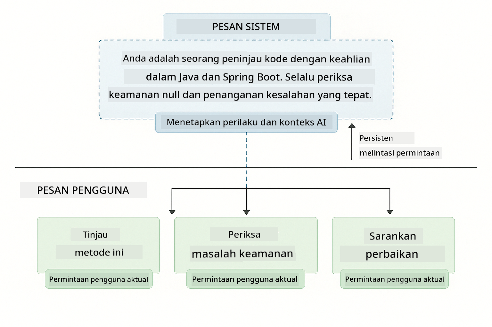
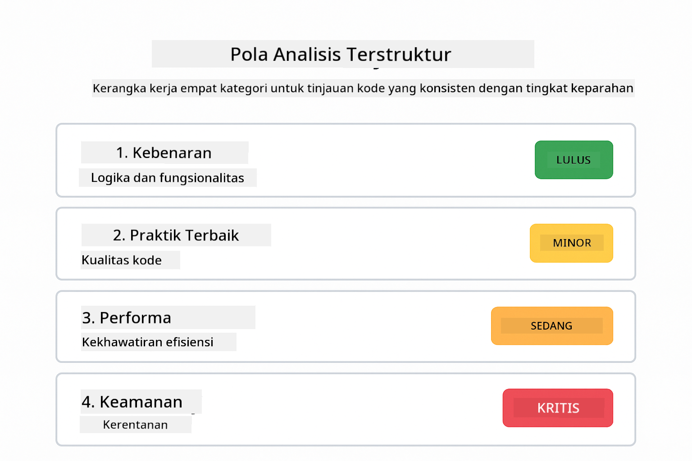
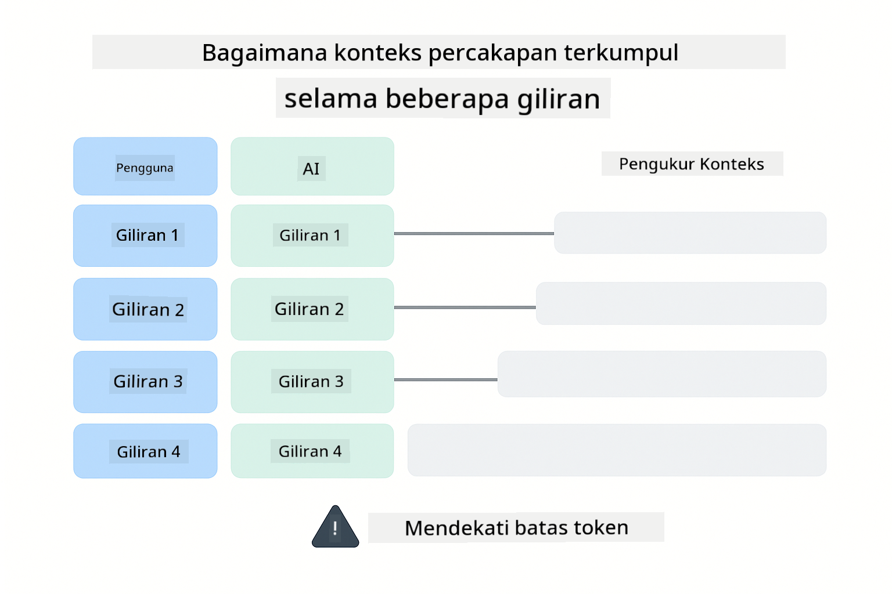
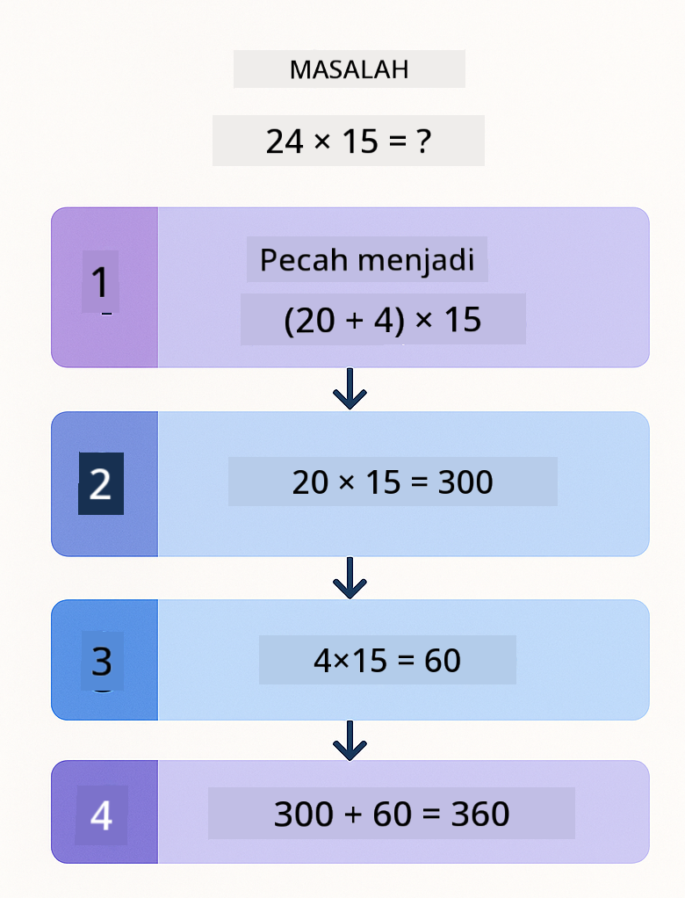
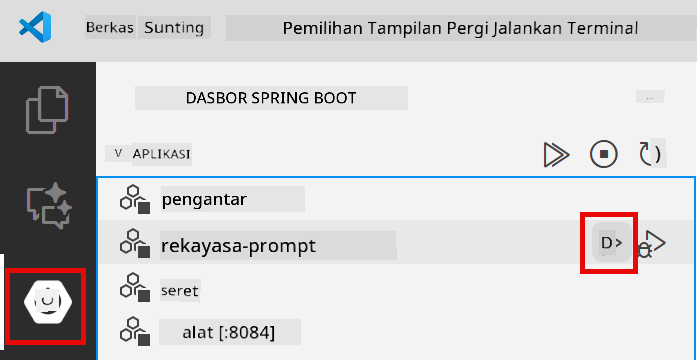
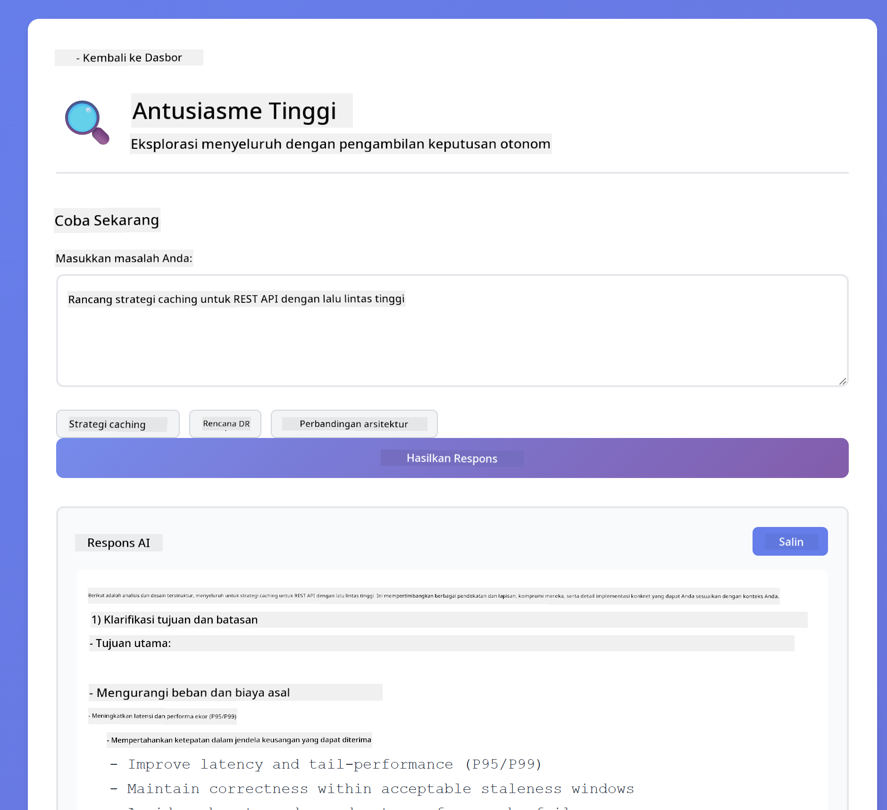
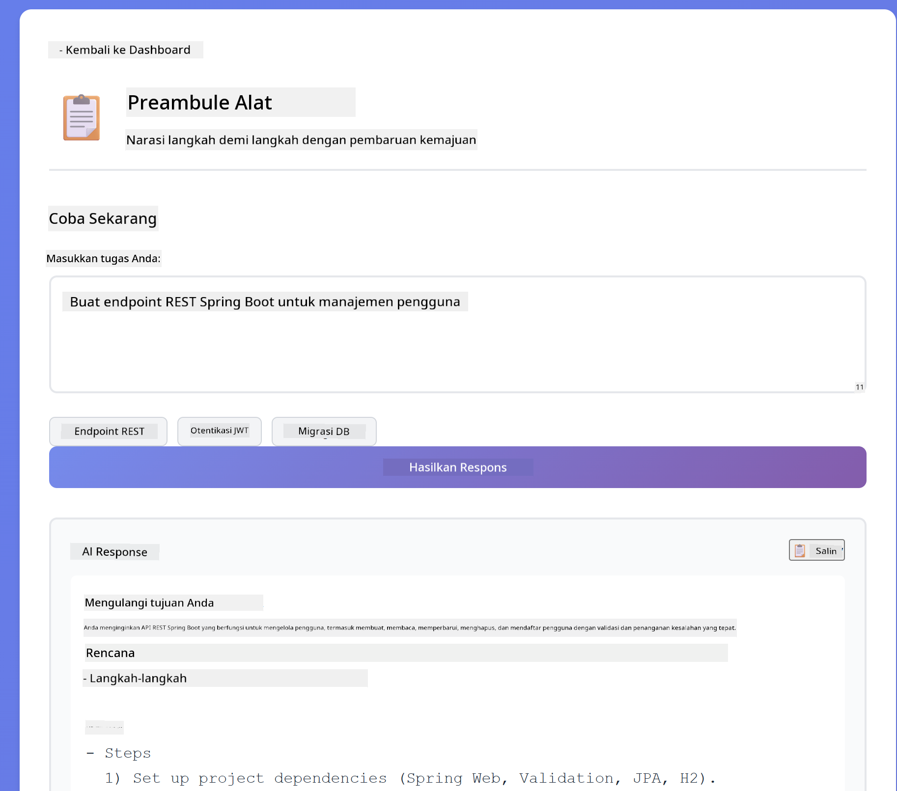
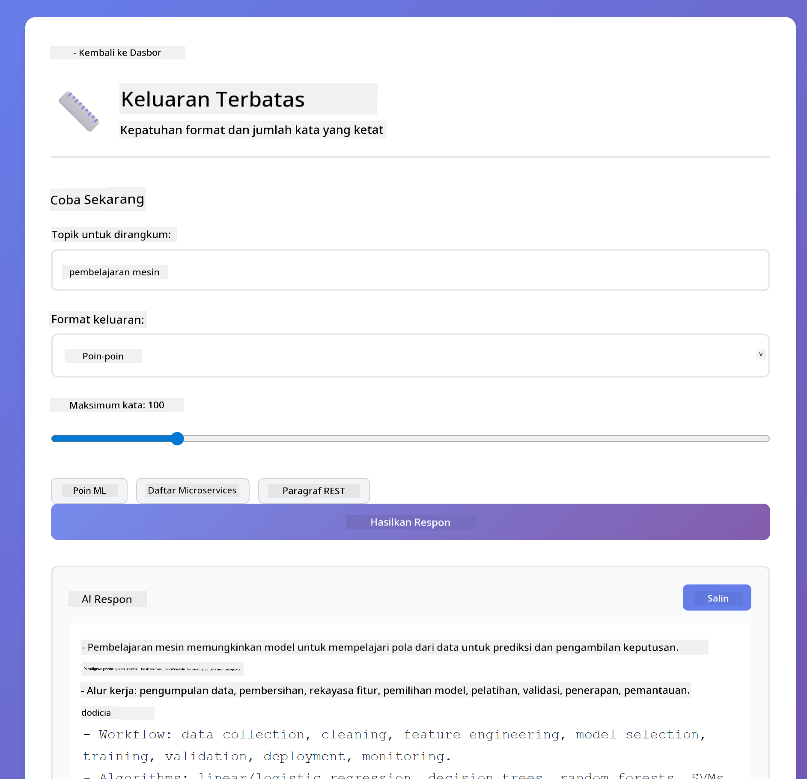

<!--
CO_OP_TRANSLATOR_METADATA:
{
  "original_hash": "8d787826cad7e92bf5cdbd116b1e6116",
  "translation_date": "2025-12-13T16:18:02+00:00",
  "source_file": "02-prompt-engineering/README.md",
  "language_code": "id"
}
-->
# Modul 02: Rekayasa Prompt dengan GPT-5

## Daftar Isi

- [Apa yang Akan Anda Pelajari](../../../02-prompt-engineering)
- [Prasyarat](../../../02-prompt-engineering)
- [Memahami Rekayasa Prompt](../../../02-prompt-engineering)
- [Bagaimana Ini Menggunakan LangChain4j](../../../02-prompt-engineering)
- [Pola Inti](../../../02-prompt-engineering)
- [Menggunakan Sumber Daya Azure yang Ada](../../../02-prompt-engineering)
- [Tangkapan Layar Aplikasi](../../../02-prompt-engineering)
- [Menjelajahi Pola](../../../02-prompt-engineering)
  - [Rendah vs Tinggi Keinginan](../../../02-prompt-engineering)
  - [Eksekusi Tugas (Preambul Alat)](../../../02-prompt-engineering)
  - [Kode yang Merefleksikan Diri](../../../02-prompt-engineering)
  - [Analisis Terstruktur](../../../02-prompt-engineering)
  - [Obrolan Multi-Turn](../../../02-prompt-engineering)
  - [Penalaran Langkah demi Langkah](../../../02-prompt-engineering)
  - [Output Terbatas](../../../02-prompt-engineering)
- [Apa yang Sebenarnya Anda Pelajari](../../../02-prompt-engineering)
- [Langkah Selanjutnya](../../../02-prompt-engineering)

## Apa yang Akan Anda Pelajari

Di modul sebelumnya, Anda melihat bagaimana memori memungkinkan AI percakapan dan menggunakan Model GitHub untuk interaksi dasar. Sekarang kita akan fokus pada bagaimana Anda mengajukan pertanyaan - prompt itu sendiri - menggunakan GPT-5 dari Azure OpenAI. Cara Anda menyusun prompt secara dramatis memengaruhi kualitas respons yang Anda dapatkan.

Kita akan menggunakan GPT-5 karena memperkenalkan kontrol penalaran - Anda dapat memberi tahu model seberapa banyak berpikir sebelum menjawab. Ini membuat berbagai strategi prompt menjadi lebih jelas dan membantu Anda memahami kapan menggunakan setiap pendekatan. Kita juga akan mendapat manfaat dari batasan rate Azure yang lebih sedikit untuk GPT-5 dibandingkan Model GitHub.

## Prasyarat

- Menyelesaikan Modul 01 (sumber daya Azure OpenAI sudah diterapkan)
- File `.env` di direktori root dengan kredensial Azure (dibuat oleh `azd up` di Modul 01)

> **Catatan:** Jika Anda belum menyelesaikan Modul 01, ikuti instruksi penerapan di sana terlebih dahulu.

## Memahami Rekayasa Prompt

Rekayasa prompt adalah tentang merancang teks input yang secara konsisten memberikan hasil yang Anda butuhkan. Ini bukan hanya tentang mengajukan pertanyaan - ini tentang menyusun permintaan sehingga model memahami dengan tepat apa yang Anda inginkan dan bagaimana menyampaikannya.

Pikirkan seperti memberi instruksi kepada rekan kerja. "Perbaiki bug" itu samar. "Perbaiki pengecualian null pointer di UserService.java baris 45 dengan menambahkan pemeriksaan null" itu spesifik. Model bahasa bekerja dengan cara yang sama - spesifikasi dan struktur sangat penting.

## Bagaimana Ini Menggunakan LangChain4j

Modul ini menunjukkan pola prompt lanjutan menggunakan fondasi LangChain4j yang sama dari modul sebelumnya, dengan fokus pada struktur prompt dan kontrol penalaran.


*Bagaimana LangChain4j menghubungkan prompt Anda ke Azure OpenAI GPT-5*

**Dependensi** - Modul 02 menggunakan dependensi langchain4j berikut yang didefinisikan di `pom.xml`:
```xml
<dependency>
    <groupId>dev.langchain4j</groupId>
    <artifactId>langchain4j</artifactId> <!-- Inherited from BOM in root pom.xml -->
</dependency>
<dependency>
    <groupId>dev.langchain4j</groupId>
    <artifactId>langchain4j-open-ai-official</artifactId> <!-- Inherited from BOM in root pom.xml -->
</dependency>
```

**Konfigurasi OpenAiOfficialChatModel** - [LangChainConfig.java](../../../02-prompt-engineering/src/main/java/com/example/langchain4j/prompts/config/LangChainConfig.java)

Model chat dikonfigurasi secara manual sebagai bean Spring menggunakan klien OpenAI Official, yang mendukung endpoint Azure OpenAI. Perbedaan utama dari Modul 01 adalah bagaimana kita menyusun prompt yang dikirim ke `chatModel.chat()`, bukan pengaturan model itu sendiri.

**Pesan Sistem dan Pengguna** - [Gpt5PromptService.java](../../../02-prompt-engineering/src/main/java/com/example/langchain4j/prompts/service/Gpt5PromptService.java)

LangChain4j memisahkan tipe pesan untuk kejelasan. `SystemMessage` mengatur perilaku dan konteks AI (seperti "Anda adalah peninjau kode"), sementara `UserMessage` berisi permintaan sebenarnya. Pemisahan ini memungkinkan Anda mempertahankan perilaku AI yang konsisten di berbagai kueri pengguna.

```java
SystemMessage systemMsg = SystemMessage.from(
    "You are a helpful Java programming expert."
);

UserMessage userMsg = UserMessage.from(
    "Explain what a List is in Java"
);

String response = chatModel.chat(systemMsg, userMsg);
```



*SystemMessage menyediakan konteks yang persisten sementara UserMessages berisi permintaan individual*

**MessageWindowChatMemory untuk Multi-Turn** - Untuk pola percakapan multi-turn, kita menggunakan kembali `MessageWindowChatMemory` dari Modul 01. Setiap sesi mendapatkan instance memori sendiri yang disimpan dalam `Map<String, ChatMemory>`, memungkinkan beberapa percakapan bersamaan tanpa pencampuran konteks.

**Template Prompt** - Fokus utama di sini adalah rekayasa prompt, bukan API LangChain4j baru. Setiap pola (keinginan rendah, keinginan tinggi, eksekusi tugas, dll.) menggunakan metode `chatModel.chat(prompt)` yang sama tetapi dengan string prompt yang disusun dengan hati-hati. Tag XML, instruksi, dan format semuanya bagian dari teks prompt, bukan fitur LangChain4j.

**Kontrol Penalaran** - Upaya penalaran GPT-5 dikontrol melalui instruksi prompt seperti "maksimum 2 langkah penalaran" atau "jelajahi secara menyeluruh". Ini adalah teknik rekayasa prompt, bukan konfigurasi LangChain4j. Perpustakaan hanya menyampaikan prompt Anda ke model.

Inti yang perlu diingat: LangChain4j menyediakan infrastruktur (koneksi model melalui [LangChainConfig.java](../../../02-prompt-engineering/src/main/java/com/example/langchain4j/prompts/config/LangChainConfig.java), memori, penanganan pesan melalui [Gpt5PromptService.java](../../../02-prompt-engineering/src/main/java/com/example/langchain4j/prompts/service/Gpt5PromptService.java)), sementara modul ini mengajarkan Anda cara membuat prompt efektif dalam infrastruktur tersebut.

## Pola Inti

Tidak semua masalah membutuhkan pendekatan yang sama. Beberapa pertanyaan membutuhkan jawaban cepat, yang lain membutuhkan pemikiran mendalam. Beberapa membutuhkan penalaran yang terlihat, yang lain hanya hasil. Modul ini mencakup delapan pola prompt - masing-masing dioptimalkan untuk skenario berbeda. Anda akan bereksperimen dengan semuanya untuk belajar kapan setiap pendekatan paling efektif.


*Gambaran umum delapan pola rekayasa prompt dan kasus penggunaannya*


*Pendekatan penalaran keinginan rendah (cepat, langsung) vs keinginan tinggi (menyeluruh, eksploratif)*

**Keinginan Rendah (Cepat & Fokus)** - Untuk pertanyaan sederhana di mana Anda menginginkan jawaban cepat dan langsung. Model melakukan penalaran minimal - maksimum 2 langkah. Gunakan ini untuk perhitungan, pencarian, atau pertanyaan langsung.

```java
String prompt = """
    <reasoning_effort>low</reasoning_effort>
    <instruction>maximum 2 reasoning steps</instruction>
    
    What is 15% of 200?
    """;

String response = chatModel.chat(prompt);
```

> 💡 **Jelajahi dengan GitHub Copilot:** Buka [`Gpt5PromptService.java`](../../../02-prompt-engineering/src/main/java/com/example/langchain4j/prompts/service/Gpt5PromptService.java) dan tanyakan:
> - "Apa perbedaan antara pola prompt keinginan rendah dan keinginan tinggi?"
> - "Bagaimana tag XML dalam prompt membantu menyusun respons AI?"
> - "Kapan saya harus menggunakan pola refleksi diri vs instruksi langsung?"

**Keinginan Tinggi (Mendalam & Menyeluruh)** - Untuk masalah kompleks di mana Anda menginginkan analisis komprehensif. Model menjelajah secara menyeluruh dan menunjukkan penalaran rinci. Gunakan ini untuk desain sistem, keputusan arsitektur, atau riset kompleks.

```java
String prompt = """
    <reasoning_effort>high</reasoning_effort>
    <instruction>explore thoroughly, show detailed reasoning</instruction>
    
    Design a caching strategy for a high-traffic REST API.
    """;

String response = chatModel.chat(prompt);
```

**Eksekusi Tugas (Progres Langkah demi Langkah)** - Untuk alur kerja multi-langkah. Model memberikan rencana di awal, menceritakan setiap langkah saat bekerja, lalu memberikan ringkasan. Gunakan ini untuk migrasi, implementasi, atau proses multi-langkah apa pun.

```java
String prompt = """
    <task>Create a REST endpoint for user registration</task>
    <preamble>Provide an upfront plan</preamble>
    <narration>Narrate each step as you work</narration>
    <summary>Summarize what was accomplished</summary>
    """;

String response = chatModel.chat(prompt);
```

Prompt Chain-of-Thought secara eksplisit meminta model untuk menunjukkan proses penalarannya, meningkatkan akurasi untuk tugas kompleks. Pemecahan langkah demi langkah membantu manusia dan AI memahami logika.

> **🤖 Coba dengan Chat [GitHub Copilot](https://github.com/features/copilot):** Tanyakan tentang pola ini:
> - "Bagaimana saya menyesuaikan pola eksekusi tugas untuk operasi yang berjalan lama?"
> - "Apa praktik terbaik untuk menyusun preambul alat dalam aplikasi produksi?"
> - "Bagaimana saya menangkap dan menampilkan pembaruan progres menengah di UI?"


*Rencana → Eksekusi → Ringkas alur kerja untuk tugas multi-langkah*

**Kode yang Merefleksikan Diri** - Untuk menghasilkan kode berkualitas produksi. Model menghasilkan kode, memeriksanya terhadap kriteria kualitas, dan memperbaikinya secara iteratif. Gunakan ini saat membangun fitur atau layanan baru.

```java
String prompt = """
    <task>Create an email validation service</task>
    <quality_criteria>
    - Correct logic and error handling
    - Best practices (clean code, proper naming)
    - Performance optimization
    - Security considerations
    </quality_criteria>
    <instruction>Generate code, evaluate against criteria, improve iteratively</instruction>
    """;

String response = chatModel.chat(prompt);
```


*Loop perbaikan iteratif - buat, evaluasi, identifikasi masalah, perbaiki, ulangi*

**Analisis Terstruktur** - Untuk evaluasi yang konsisten. Model meninjau kode menggunakan kerangka kerja tetap (kebenaran, praktik, performa, keamanan). Gunakan ini untuk tinjauan kode atau penilaian kualitas.

```java
String prompt = """
    <code>
    public List getUsers() {
        return database.query("SELECT * FROM users");
    }
    </code>
    
    <framework>
    Evaluate using these categories:
    1. Correctness - Logic and functionality
    2. Best Practices - Code quality
    3. Performance - Efficiency concerns
    4. Security - Vulnerabilities
    </framework>
    """;

String response = chatModel.chat(prompt);
```

> **🤖 Coba dengan Chat [GitHub Copilot](https://github.com/features/copilot):** Tanyakan tentang analisis terstruktur:
> - "Bagaimana saya menyesuaikan kerangka analisis untuk berbagai jenis tinjauan kode?"
> - "Apa cara terbaik untuk mengurai dan menindaklanjuti output terstruktur secara programatik?"
> - "Bagaimana saya memastikan tingkat keparahan konsisten di berbagai sesi tinjauan?"



*Kerangka kerja empat kategori untuk tinjauan kode konsisten dengan tingkat keparahan*

**Obrolan Multi-Turn** - Untuk percakapan yang membutuhkan konteks. Model mengingat pesan sebelumnya dan membangun dari sana. Gunakan ini untuk sesi bantuan interaktif atau tanya jawab kompleks.

```java
ChatMemory memory = MessageWindowChatMemory.withMaxMessages(10);

memory.add(UserMessage.from("What is Spring Boot?"));
AiMessage aiMessage1 = chatModel.chat(memory.messages()).aiMessage();
memory.add(aiMessage1);

memory.add(UserMessage.from("Show me an example"));
AiMessage aiMessage2 = chatModel.chat(memory.messages()).aiMessage();
memory.add(aiMessage2);
```



*Bagaimana konteks percakapan terakumulasi selama beberapa putaran hingga mencapai batas token*

**Penalaran Langkah demi Langkah** - Untuk masalah yang membutuhkan logika yang terlihat. Model menunjukkan penalaran eksplisit untuk setiap langkah. Gunakan ini untuk masalah matematika, teka-teki logika, atau saat Anda perlu memahami proses berpikir.

```java
String prompt = """
    <instruction>Show your reasoning step-by-step</instruction>
    
    If a train travels 120 km in 2 hours, then stops for 30 minutes,
    then travels another 90 km in 1.5 hours, what is the average speed
    for the entire journey including the stop?
    """;

String response = chatModel.chat(prompt);
```



*Memecah masalah menjadi langkah logis eksplisit*

**Output Terbatas** - Untuk respons dengan persyaratan format spesifik. Model mengikuti aturan format dan panjang secara ketat. Gunakan ini untuk ringkasan atau saat Anda membutuhkan struktur output yang tepat.

```java
String prompt = """
    <constraints>
    - Exactly 100 words
    - Bullet point format
    - Technical terms only
    </constraints>
    
    Summarize the key concepts of machine learning.
    """;

String response = chatModel.chat(prompt);
```


*Menegakkan persyaratan format, panjang, dan struktur spesifik*

## Menggunakan Sumber Daya Azure yang Ada

**Verifikasi penerapan:**

Pastikan file `.env` ada di direktori root dengan kredensial Azure (dibuat selama Modul 01):
```bash
cat ../.env  # Harus menampilkan AZURE_OPENAI_ENDPOINT, API_KEY, DEPLOYMENT
```

**Mulai aplikasi:**

> **Catatan:** Jika Anda sudah memulai semua aplikasi menggunakan `./start-all.sh` dari Modul 01, modul ini sudah berjalan di port 8083. Anda dapat melewati perintah mulai di bawah dan langsung ke http://localhost:8083.

**Opsi 1: Menggunakan Spring Boot Dashboard (Direkomendasikan untuk pengguna VS Code)**

Kontainer dev menyertakan ekstensi Spring Boot Dashboard, yang menyediakan antarmuka visual untuk mengelola semua aplikasi Spring Boot. Anda dapat menemukannya di Bilah Aktivitas di sisi kiri VS Code (cari ikon Spring Boot).

Dari Spring Boot Dashboard, Anda dapat:
- Melihat semua aplikasi Spring Boot yang tersedia di workspace
- Memulai/menghentikan aplikasi dengan satu klik
- Melihat log aplikasi secara real-time
- Memantau status aplikasi

Cukup klik tombol play di sebelah "prompt-engineering" untuk memulai modul ini, atau mulai semua modul sekaligus.



**Opsi 2: Menggunakan skrip shell**

Mulai semua aplikasi web (modul 01-04):

**Bash:**
```bash
cd ..  # Dari direktori root
./start-all.sh
```

**PowerShell:**
```powershell
cd ..  # Dari direktori root
.\start-all.ps1
```

Atau mulai hanya modul ini:

**Bash:**
```bash
cd 02-prompt-engineering
./start.sh
```

**PowerShell:**
```powershell
cd 02-prompt-engineering
.\start.ps1
```

Kedua skrip secara otomatis memuat variabel lingkungan dari file `.env` root dan akan membangun JAR jika belum ada.

> **Catatan:** Jika Anda lebih suka membangun semua modul secara manual sebelum memulai:
>
> **Bash:**
> ```bash
> cd ..  # Go to root directory
> mvn clean package -DskipTests
> ```
>
> **PowerShell:**
> ```powershell
> cd ..  # Go to root directory
> mvn clean package -DskipTests
> ```

Buka http://localhost:8083 di browser Anda.

**Untuk menghentikan:**

**Bash:**
```bash
./stop.sh  # Hanya modul ini
# Atau
cd .. && ./stop-all.sh  # Semua modul
```

**PowerShell:**
```powershell
.\stop.ps1  # Hanya modul ini
# Atau
cd ..; .\stop-all.ps1  # Semua modul
```

## Tangkapan Layar Aplikasi


*Dashboard utama yang menampilkan semua 8 pola rekayasa prompt dengan karakteristik dan kasus penggunaannya*

## Menjelajahi Pola

Antarmuka web memungkinkan Anda bereksperimen dengan berbagai strategi prompt. Setiap pola menyelesaikan masalah berbeda - coba untuk melihat kapan setiap pendekatan paling efektif.

### Rendah vs Tinggi Keinginan

Ajukan pertanyaan sederhana seperti "Berapa 15% dari 200?" menggunakan Keinginan Rendah. Anda akan mendapatkan jawaban langsung dan instan. Sekarang ajukan sesuatu yang kompleks seperti "Rancang strategi caching untuk API dengan lalu lintas tinggi" menggunakan Keinginan Tinggi. Perhatikan bagaimana model melambat dan memberikan penalaran rinci. Model sama, struktur pertanyaan sama - tapi prompt memberi tahu seberapa banyak berpikir yang harus dilakukan.


*Perhitungan cepat dengan penalaran minimal*



*Strategi caching komprehensif (2.8MB)*

### Eksekusi Tugas (Preambul Alat)

Alur kerja multi-langkah mendapat manfaat dari perencanaan awal dan narasi kemajuan. Model menguraikan apa yang akan dilakukan, menceritakan setiap langkah, lalu meringkas hasilnya.



*Membuat endpoint REST dengan narasi langkah demi langkah (3.9MB)*

### Kode yang Merefleksikan Diri

Coba "Buat layanan validasi email". Alih-alih hanya menghasilkan kode dan berhenti, model menghasilkan, mengevaluasi berdasarkan kriteria kualitas, mengidentifikasi kelemahan, dan memperbaiki. Anda akan melihat iterasi sampai kode memenuhi standar produksi.


*Layanan validasi email lengkap (5.2MB)*

### Analisis Terstruktur

Tinjauan kode membutuhkan kerangka evaluasi yang konsisten. Model menganalisis kode menggunakan kategori tetap (kebenaran, praktik, performa, keamanan) dengan tingkat keparahan.


*Tinjauan kode berbasis kerangka kerja*

### Obrolan Multi-Turn

Tanyakan "Apa itu Spring Boot?" lalu langsung lanjutkan dengan "Tunjukkan saya contoh". Model mengingat pertanyaan pertama Anda dan memberikan contoh Spring Boot secara spesifik. Tanpa memori, pertanyaan kedua itu akan terlalu samar.


*Pelestarian konteks antar pertanyaan*

### Penalaran Langkah demi Langkah

Pilih masalah matematika dan coba dengan Penalaran Langkah demi Langkah dan Antusiasme Rendah. Antusiasme rendah hanya memberikan jawaban - cepat tapi tidak transparan. Penalaran langkah demi langkah menunjukkan setiap perhitungan dan keputusan.


*Masalah matematika dengan langkah eksplisit*

### Output Terbatas

Saat Anda membutuhkan format atau jumlah kata tertentu, pola ini menegakkan kepatuhan ketat. Coba buat ringkasan dengan tepat 100 kata dalam format poin-poin.



*Ringkasan pembelajaran mesin dengan kontrol format*

## Apa yang Sebenarnya Anda Pelajari

**Upaya Penalaran Mengubah Segalanya**

GPT-5 memungkinkan Anda mengontrol upaya komputasi melalui prompt Anda. Upaya rendah berarti respons cepat dengan eksplorasi minimal. Upaya tinggi berarti model meluangkan waktu untuk berpikir mendalam. Anda belajar menyesuaikan upaya dengan kompleksitas tugas - jangan buang waktu pada pertanyaan sederhana, tapi juga jangan terburu-buru pada keputusan kompleks.

**Struktur Membimbing Perilaku**

Perhatikan tag XML dalam prompt? Mereka bukan hiasan. Model mengikuti instruksi terstruktur lebih andal daripada teks bebas. Saat Anda membutuhkan proses multi-langkah atau logika kompleks, struktur membantu model melacak posisinya dan apa yang berikutnya.


*Anatomi prompt yang terstruktur dengan baik dengan bagian jelas dan organisasi gaya XML*

**Kualitas Melalui Evaluasi Diri**

Pola refleksi diri bekerja dengan membuat kriteria kualitas menjadi eksplisit. Alih-alih berharap model "melakukannya dengan benar", Anda memberitahunya persis apa arti "benar": logika yang tepat, penanganan kesalahan, performa, keamanan. Model kemudian dapat mengevaluasi outputnya sendiri dan memperbaiki. Ini mengubah pembuatan kode dari lotere menjadi proses.

**Konteks Itu Terbatas**

Percakapan multi-turn bekerja dengan menyertakan riwayat pesan pada setiap permintaan. Tapi ada batas - setiap model memiliki jumlah token maksimum. Saat percakapan bertambah, Anda perlu strategi untuk menjaga konteks relevan tanpa melewati batas itu. Modul ini menunjukkan cara kerja memori; nanti Anda akan belajar kapan meringkas, kapan melupakan, dan kapan mengambil kembali.

## Langkah Selanjutnya

**Modul Berikutnya:** [03-rag - RAG (Retrieval-Augmented Generation)](../03-rag/README.md)

---

**Navigasi:** [← Sebelumnya: Modul 01 - Pengantar](../01-introduction/README.md) | [Kembali ke Utama](../README.md) | [Berikutnya: Modul 03 - RAG →](../03-rag/README.md)

---

<!-- CO-OP TRANSLATOR DISCLAIMER START -->
**Penafian**:  
Dokumen ini telah diterjemahkan menggunakan layanan terjemahan AI [Co-op Translator](https://github.com/Azure/co-op-translator). Meskipun kami berupaya untuk mencapai akurasi, harap diingat bahwa terjemahan otomatis mungkin mengandung kesalahan atau ketidakakuratan. Dokumen asli dalam bahasa aslinya harus dianggap sebagai sumber yang sahih. Untuk informasi penting, disarankan menggunakan terjemahan profesional oleh manusia. Kami tidak bertanggung jawab atas kesalahpahaman atau penafsiran yang keliru yang timbul dari penggunaan terjemahan ini.
<!-- CO-OP TRANSLATOR DISCLAIMER END -->