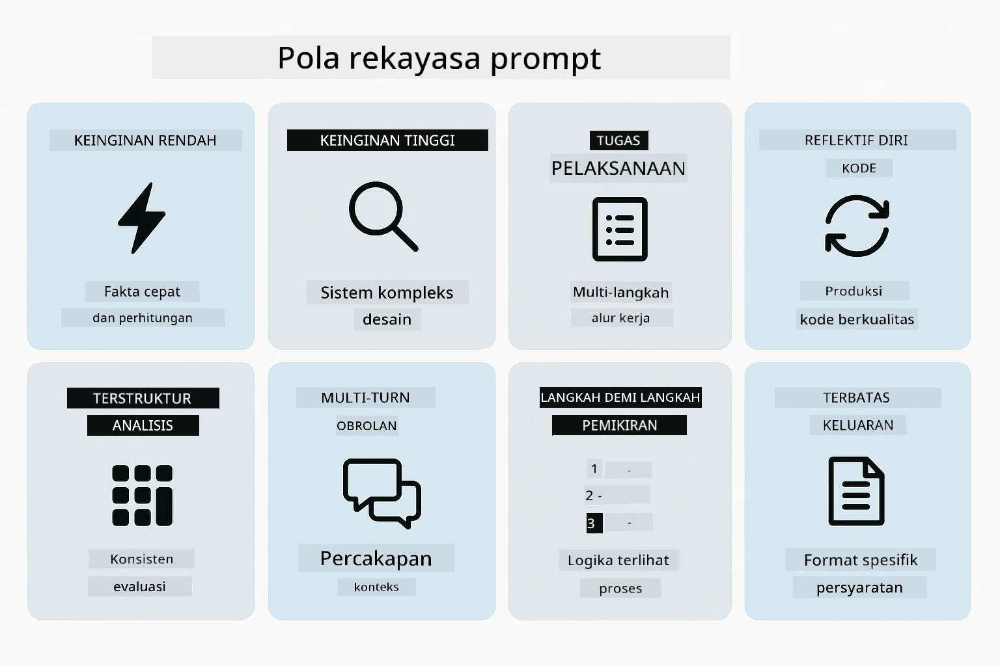
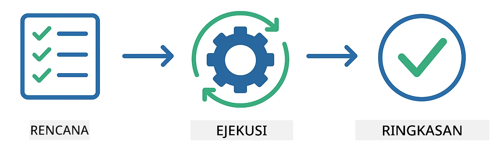
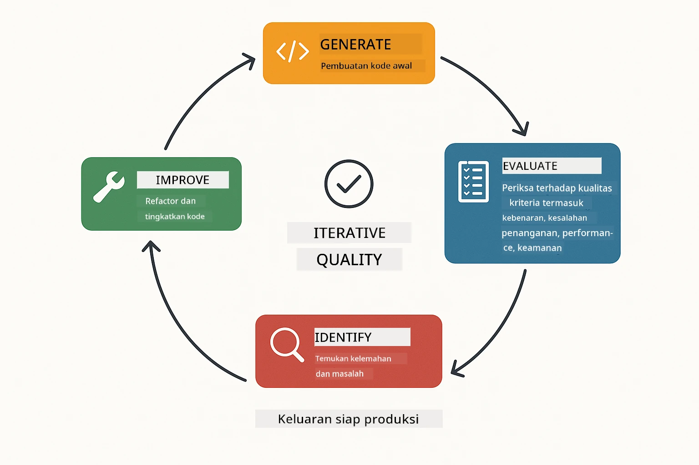
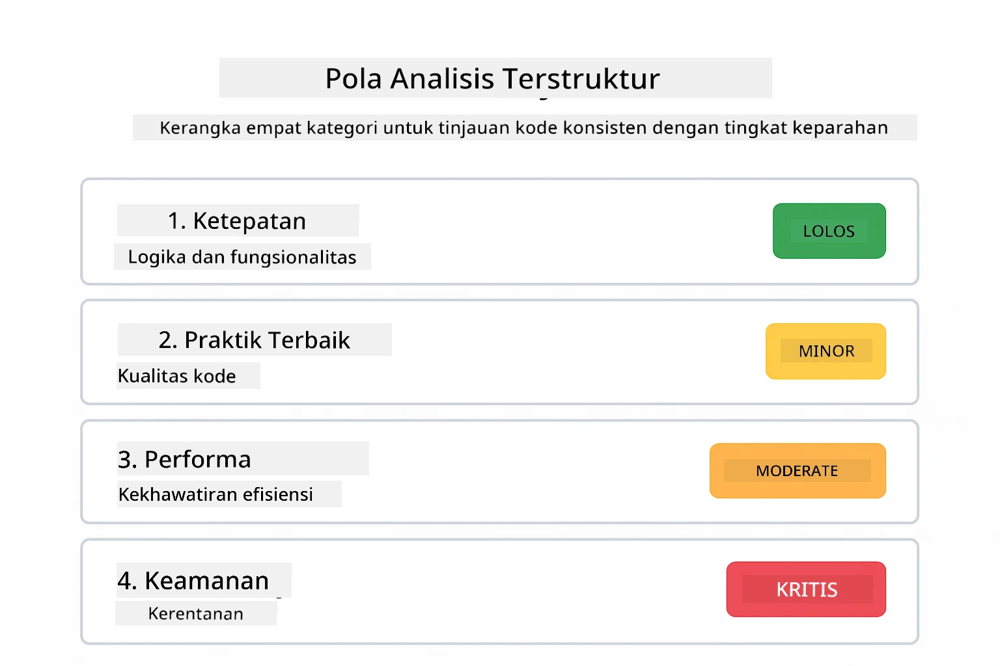
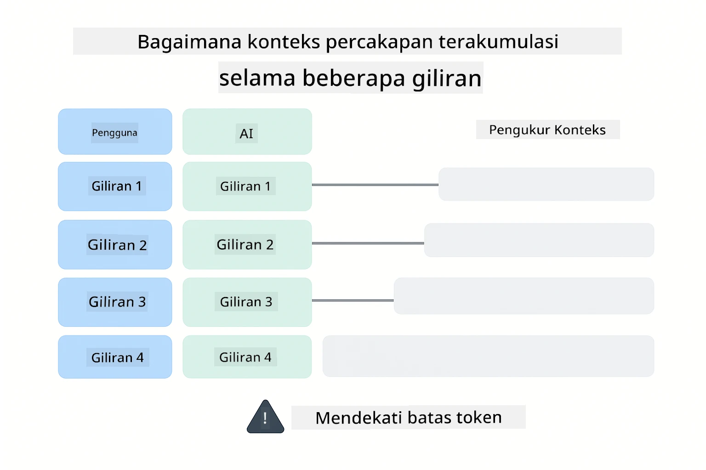
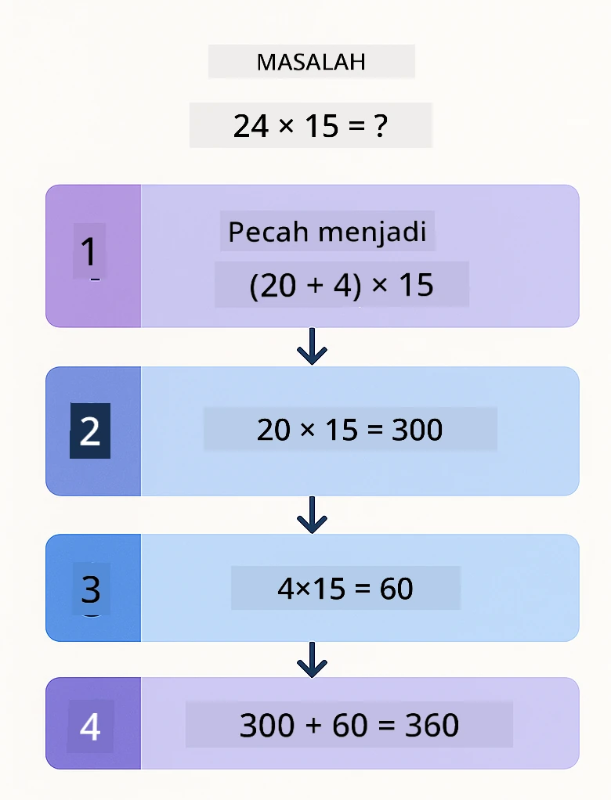
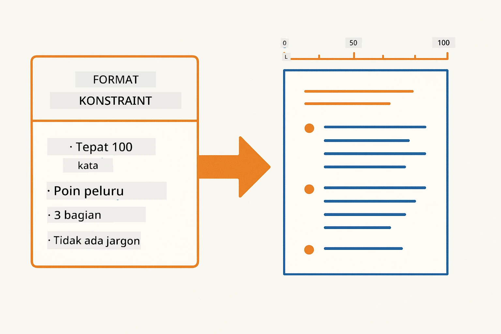
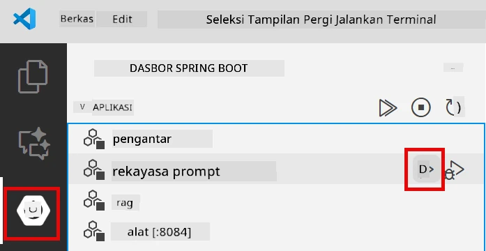
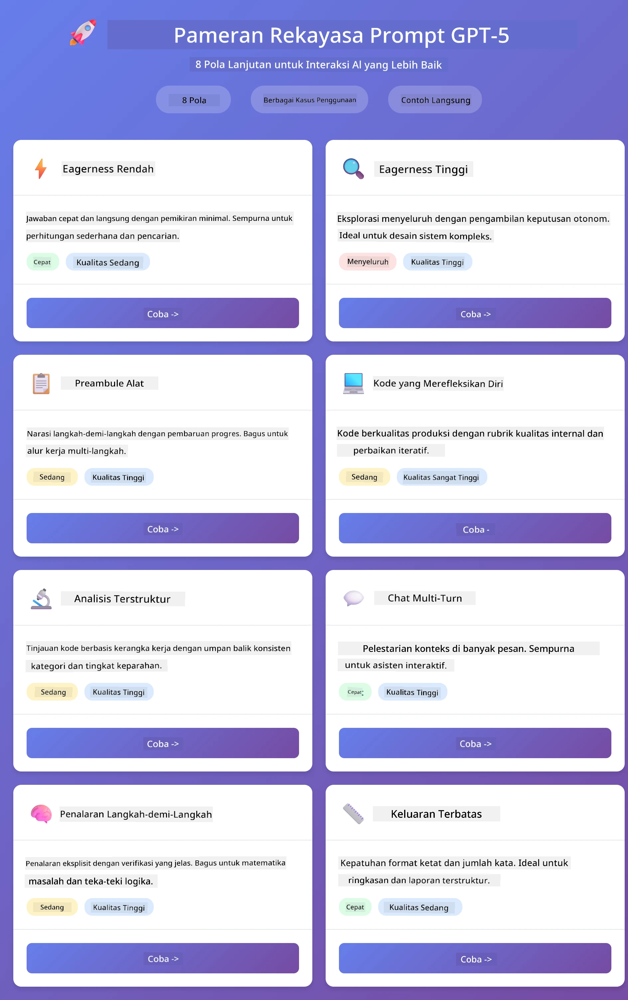
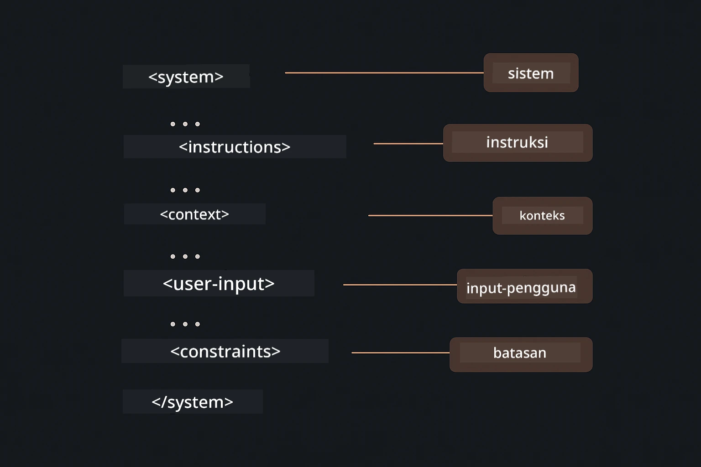

# Modul 02: Rekayasa Prompt dengan GPT-5.2

## Daftar Isi

- [Video Walkthrough](#video-walkthrough)
- [Apa yang Akan Anda Pelajari](#apa-yang-akan-anda-pelajari)
- [Prasyarat](#prasyarat)
- [Memahami Rekayasa Prompt](#memahami-rekayasa-prompt)
- [Dasar-dasar Rekayasa Prompt](#dasar-dasar-rekayasa-prompt)
  - [Zero-Shot Prompting](#zero-shot-prompting)
  - [Few-Shot Prompting](#few-shot-prompting)
  - [Chain of Thought](#chain-of-thought)
  - [Role-Based Prompting](#role-based-prompting)
  - [Prompt Templates](#prompt-templates)
- [Pola Lanjutan](#pola-lanjutan)
- [Jalankan Aplikasi](#jalankan-aplikasi)
- [Screenshot Aplikasi](#tangkapan-layar-aplikasi)
- [Menjelajahi Pola-pola](#menjelajahi-pola)
  - [Eagerness Rendah vs Tinggi](#low-vs-high-eagerness)
  - [Eksekusi Tugas (Preambel Alat)](#task-execution-tool-preambles)
  - [Kode Reflektif Diri](#self-reflecting-code)
  - [Analisis Terstruktur](#structured-analysis)
  - [Obrolan Multi-Turn](#multi-turn-chat)
  - [Penalaran Langkah demi Langkah](#step-by-step-reasoning)
  - [Output Terbatas](#constrained-output)
- [Apa yang Sebenarnya Anda Pelajari](#apa-yang-sebenarnya-anda-pelajari)
- [Langkah Berikutnya](#langkah-berikutnya)

## Video Walkthrough

Tonton sesi langsung ini yang menjelaskan bagaimana memulai dengan modul ini:

<a href="https://www.youtube.com/live/PJ6aBaE6bog?si=LDshyBrTRodP-wke"></a>

## Apa yang Akan Anda Pelajari

Diagram berikut memberikan gambaran tentang topik dan keterampilan utama yang akan Anda kembangkan di modul ini — dari teknik penyempurnaan prompt hingga alur kerja langkah demi langkah yang akan Anda ikuti.


Di modul sebelumnya, Anda melihat bagaimana memori memungkinkan AI percakapan dengan Azure OpenAI. Sekarang kita akan fokus pada bagaimana Anda mengajukan pertanyaan — prompt itu sendiri — menggunakan GPT-5.2 dari Azure OpenAI. Cara Anda menyusun prompt sangat memengaruhi kualitas jawaban yang Anda dapatkan. Kita mulai dengan tinjauan teknik prompting dasar, lalu berlanjut ke delapan pola lanjutan yang memanfaatkan sepenuhnya kemampuan GPT-5.2.

Kita akan menggunakan GPT-5.2 karena ia memperkenalkan kontrol penalaran - Anda dapat memberi tahu model seberapa banyak berpikir sebelum menjawab. Ini membuat berbagai strategi prompting lebih jelas dan membantu Anda memahami kapan menggunakan pendekatan yang mana.

## Prasyarat

- Telah menyelesaikan Modul 01 (sumber daya Azure OpenAI telah dideploy)
- File `.env` di direktori root dengan kredensial Azure (dibuat oleh `azd up` di Modul 01)

> **Catatan:** Jika Anda belum menyelesaikan Modul 01, ikuti instruksi penyebaran di sana terlebih dahulu.

## Memahami Rekayasa Prompt

Pada dasarnya, rekayasa prompt adalah perbedaan antara instruksi yang samar dan yang spesifik, seperti yang diilustrasikan pada perbandingan di bawah ini.


Rekayasa prompt adalah tentang merancang teks input yang secara konsisten memberikan hasil yang Anda butuhkan. Ini bukan hanya tentang mengajukan pertanyaan - ini tentang menyusun permintaan agar model memahami dengan tepat apa yang Anda inginkan dan bagaimana cara menyampaikannya.

Bayangkan seperti memberikan instruksi ke rekan kerja. "Perbaiki bug" itu samar. "Perbaiki null pointer exception di UserService.java baris 45 dengan menambahkan pengecekan null" itu spesifik. Model bahasa bekerja dengan cara yang sama - spesifik dan struktur sangat penting.

Diagram di bawah ini menunjukkan bagaimana LangChain4j masuk ke dalam gambar ini — menghubungkan pola prompt Anda ke model melalui blok bangunan SystemMessage dan UserMessage.


LangChain4j menyediakan infrastruktur — koneksi model, memori, dan jenis pesan — sementara pola prompt hanyalah teks yang disusun dengan cermat yang Anda kirimkan melalui infrastruktur itu. Blok bangunan kunci adalah `SystemMessage` (yang mengatur perilaku dan peran AI) dan `UserMessage` (yang membawa permintaan Anda yang sebenarnya).

## Dasar-dasar Rekayasa Prompt

Lima teknik inti yang ditunjukkan di bawah ini membentuk dasar rekayasa prompt yang efektif. Masing-masing menangani aspek berbeda dari cara Anda berkomunikasi dengan model bahasa.


Sebelum menyelami pola-pola lanjutan di modul ini, mari kita tinjau lima teknik prompting dasar. Ini adalah blok bangunan yang harus diketahui setiap insinyur prompt.

### Zero-Shot Prompting

Pendekatan paling sederhana: berikan model instruksi langsung tanpa contoh. Model sepenuhnya mengandalkan pelatihannya untuk memahami dan menjalankan tugas tersebut. Ini bekerja baik untuk permintaan yang langsung di mana perilaku yang diharapkan jelas.


*Instruksi langsung tanpa contoh — model menyimpulkan tugas hanya dari instruksi*

```java
String prompt = "Classify this sentiment: 'I absolutely loved the movie!'";
String response = model.chat(prompt);
// Respons: "Positif"
```

**Kapan digunakan:** Klasifikasi sederhana, pertanyaan langsung, terjemahan, atau tugas apa pun yang dapat ditangani model tanpa panduan tambahan.

### Few-Shot Prompting

Berikan contoh-contoh yang menunjukkan pola yang Anda ingin model ikuti. Model belajar format input-output yang diharapkan dari contoh Anda dan menerapkannya ke input baru. Ini secara dramatis meningkatkan konsistensi untuk tugas yang format atau perilakunya tidak jelas.


*Belajar dari contoh — model mengidentifikasi pola dan menerapkannya ke input baru*

```java
String prompt = """
    Classify the sentiment as positive, negative, or neutral.
    
    Examples:
    Text: "This product exceeded my expectations!" → Positive
    Text: "It's okay, nothing special." → Neutral
    Text: "Waste of money, very disappointed." → Negative
    
    Now classify this:
    Text: "Best purchase I've made all year!"
    """;
String response = model.chat(prompt);
```

**Kapan digunakan:** Klasifikasi khusus, format konsisten, tugas spesifik domain, atau ketika hasil zero-shot tidak konsisten.

### Chain of Thought

Minta model menunjukkan penalarannya langkah demi langkah. Alih-alih langsung memberikan jawaban, model memecah masalah dan mengerjakan setiap bagian secara eksplisit. Ini meningkatkan akurasi pada masalah matematika, logika, dan penalaran multi-langkah.


*Penalaran langkah demi langkah — memecah masalah kompleks menjadi langkah logis yang eksplisit*

```java
String prompt = """
    Problem: A store has 15 apples. They sell 8 apples and then 
    receive a shipment of 12 more apples. How many apples do they have now?
    
    Let's solve this step-by-step:
    """;
String response = model.chat(prompt);
// Model menunjukkan: 15 - 8 = 7, kemudian 7 + 12 = 19 apel
```

**Kapan digunakan:** Masalah matematika, teka-teki logika, debugging, atau tugas apa pun di mana menunjukkan proses penalaran meningkatkan akurasi dan kepercayaan.

### Role-Based Prompting

Tetapkan persona atau peran untuk AI sebelum mengajukan pertanyaan Anda. Ini memberikan konteks yang membentuk nada, kedalaman, dan fokus jawaban. "Arsitek perangkat lunak" memberikan nasihat berbeda dari "pengembang junior" atau "auditor keamanan".


*Menetapkan konteks dan persona — pertanyaan yang sama mendapat jawaban berbeda tergantung pada peran yang diberikan*

```java
String prompt = """
    You are an experienced software architect reviewing code.
    Provide a brief code review for this function:
    
    def calculate_total(items):
        total = 0
        for item in items:
            total = total + item['price']
        return total
    """;
String response = model.chat(prompt);
```

**Kapan digunakan:** Review kode, pengajaran, analisis spesifik domain, atau saat Anda membutuhkan jawaban yang disesuaikan dengan tingkat keahlian atau perspektif tertentu.

### Prompt Templates

Buat prompt yang dapat digunakan ulang dengan placeholder variabel. Alih-alih menulis prompt baru setiap kali, definisikan template sekali dan isi dengan nilai berbeda. Kelas `PromptTemplate` dari LangChain4j memudahkan ini dengan sintaks `{{variable}}`.


*Prompt yang dapat digunakan ulang dengan placeholder variabel — satu template, banyak penggunaan*

```java
PromptTemplate template = PromptTemplate.from(
    "What's the best time to visit {{destination}} for {{activity}}?"
);

Prompt prompt = template.apply(Map.of(
    "destination", "Paris",
    "activity", "sightseeing"
));

String response = model.chat(prompt.text());
```

**Kapan digunakan:** Pertanyaan berulang dengan input berbeda, pemrosesan batch, membangun workflow AI yang dapat digunakan ulang, atau skenario apa pun di mana struktur prompt tetap sama tetapi datanya berubah.

---

Lima dasar ini memberi Anda alat yang kuat untuk sebagian besar tugas prompting. Sisa modul ini membangun di atasnya dengan **delapan pola lanjutan** yang memanfaatkan kontrol penalaran, evaluasi diri, dan kemampuan output terstruktur GPT-5.2.

## Pola Lanjutan

Setelah memahami dasar, mari beralih ke delapan pola lanjutan yang membuat modul ini unik. Tidak semua masalah memerlukan pendekatan yang sama. Beberapa pertanyaan perlu jawaban cepat, beberapa perlu pemikiran mendalam. Ada yang perlu penalaran yang terlihat, ada yang hanya perlu hasil. Setiap pola di bawah ini dioptimalkan untuk skenario berbeda — dan kontrol penalaran GPT-5.2 membuat perbedaan itu semakin nyata.



*Gambaran delapan pola rekayasa prompt dan kasus penggunaannya*

GPT-5.2 menambahkan dimensi lain ke pola-pola ini: *kontrol penalaran*. Slider di bawah ini menunjukkan bagaimana Anda dapat menyesuaikan usaha berpikir model — dari jawaban cepat dan langsung hingga analisis mendalam dan menyeluruh.


*Kontrol penalaran GPT-5.2 memungkinkan Anda menentukan seberapa banyak model harus berpikir — dari jawaban cepat langsung hingga eksplorasi yang mendalam*

**Eagerness Rendah (Cepat & Fokus)** - Untuk pertanyaan sederhana di mana Anda menginginkan jawaban cepat dan langsung. Model melakukan penalaran minimal - maksimum 2 langkah. Gunakan ini untuk perhitungan, pencarian, atau pertanyaan yang langsung.

```java
String prompt = """
    <context_gathering>
    - Search depth: very low
    - Bias strongly towards providing a correct answer as quickly as possible
    - Usually, this means an absolute maximum of 2 reasoning steps
    - If you think you need more time, state what you know and what's uncertain
    </context_gathering>
    
    Problem: What is 15% of 200?
    
    Provide your answer:
    """;

String response = chatModel.chat(prompt);
```

> 💡 **Jelajahi dengan GitHub Copilot:** Buka [`Gpt5PromptService.java`](../../../02-prompt-engineering/src/main/java/com/example/langchain4j/prompts/service/Gpt5PromptService.java) dan tanyakan:
> - "Apa perbedaan antara pola eagerness rendah dan eagerness tinggi?"
> - "Bagaimana tag XML dalam prompt membantu menyusun jawaban AI?"
> - "Kapan saya harus menggunakan pola refleksi diri vs instruksi langsung?"

**Eagerness Tinggi (Mendalam & Menyeluruh)** - Untuk masalah kompleks di mana Anda menginginkan analisis komprehensif. Model mengeksplorasi secara menyeluruh dan menunjukkan penalaran terperinci. Gunakan ini untuk desain sistem, keputusan arsitektur, atau riset kompleks.

```java
String prompt = """
    Analyze this problem thoroughly and provide a comprehensive solution.
    Consider multiple approaches, trade-offs, and important details.
    Show your analysis and reasoning in your response.
    
    Problem: Design a caching strategy for a high-traffic REST API.
    """;

String response = chatModel.chat(prompt);
```

**Eksekusi Tugas (Kemajuan Langkah demi Langkah)** - Untuk alur kerja multi-langkah. Model memberikan rencana di awal, menjelaskan setiap langkah saat bekerja, lalu memberi ringkasan. Gunakan ini untuk migrasi, implementasi, atau proses multi-langkah apa pun.

```java
String prompt = """
    <task_execution>
    1. First, briefly restate the user's goal in a friendly way
    
    2. Create a step-by-step plan:
       - List all steps needed
       - Identify potential challenges
       - Outline success criteria
    
    3. Execute each step:
       - Narrate what you're doing
       - Show progress clearly
       - Handle any issues that arise
    
    4. Summarize:
       - What was completed
       - Any important notes
       - Next steps if applicable
    </task_execution>
    
    <tool_preambles>
    - Always begin by rephrasing the user's goal clearly
    - Outline your plan before executing
    - Narrate each step as you go
    - Finish with a distinct summary
    </tool_preambles>
    
    Task: Create a REST endpoint for user registration
    
    Begin execution:
    """;

String response = chatModel.chat(prompt);
```

Chain-of-Thought prompting secara eksplisit meminta model menunjukkan proses penalarannya, meningkatkan akurasi untuk tugas kompleks. Pemecahan langkah demi langkah membantu manusia dan AI memahami logika.

> **🤖 Coba dengan Obrolan [GitHub Copilot](https://github.com/features/copilot):** Tanyakan tentang pola ini:
> - "Bagaimana saya menyesuaikan pola eksekusi tugas untuk operasi yang berjalan lama?"
> - "Apa praktik terbaik untuk menyusun preambel alat dalam aplikasi produksi?"
> - "Bagaimana cara menangkap dan menampilkan pembaruan kemajuan antara dalam UI?"

Diagram di bawah ini menggambarkan alur kerja Plan → Execute → Summarize ini.



*Alur kerja Plan → Execute → Summarize untuk tugas multi-langkah*

**Kode Reflektif Diri** - Untuk menghasilkan kode berkualitas produksi. Model menghasilkan kode sesuai standar produksi dengan penanganan kesalahan yang sesuai. Gunakan ini saat membangun fitur atau layanan baru.

```java
String prompt = """
    Generate Java code with production-quality standards: Create an email validation service
    Keep it simple and include basic error handling.
    """;

String response = chatModel.chat(prompt);
```

Diagram di bawah ini menunjukkan siklus perbaikan iteratif — menghasilkan, mengevaluasi, mengidentifikasi kelemahan, dan menyempurnakan sampai kode memenuhi standar produksi.



*Siklus perbaikan iteratif - menghasilkan, mengevaluasi, identifikasi masalah, perbaiki, ulangi*

**Analisis Terstruktur** - Untuk evaluasi yang konsisten. Model meninjau kode menggunakan kerangka kerja tetap (kebenaran, praktik, performa, keamanan, pemeliharaan). Gunakan ini untuk review kode atau penilaian kualitas.

```java
String prompt = """
    <analysis_framework>
    You are an expert code reviewer. Analyze the code for:
    
    1. Correctness
       - Does it work as intended?
       - Are there logical errors?
    
    2. Best Practices
       - Follows language conventions?
       - Appropriate design patterns?
    
    3. Performance
       - Any inefficiencies?
       - Scalability concerns?
    
    4. Security
       - Potential vulnerabilities?
       - Input validation?
    
    5. Maintainability
       - Code clarity?
       - Documentation?
    
    <output_format>
    Provide your analysis in this structure:
    - Summary: One-sentence overall assessment
    - Strengths: 2-3 positive points
    - Issues: List any problems found with severity (High/Medium/Low)
    - Recommendations: Specific improvements
    </output_format>
    </analysis_framework>
    
    Code to analyze:
    ```
    public List getUsers() {
        return database.query("SELECT * FROM users");
    }
    ```
    Provide your structured analysis:
    """;

String response = chatModel.chat(prompt);
```

> **🤖 Coba dengan Obrolan [GitHub Copilot](https://github.com/features/copilot):** Tanyakan tentang analisis terstruktur:
> - "Bagaimana saya dapat menyesuaikan kerangka analisis untuk jenis review kode yang berbeda?"
> - "Apa cara terbaik untuk mengurai dan menangani output terstruktur secara programatik?"
> - "Bagaimana saya memastikan tingkat keparahan konsisten di berbagai sesi review?"

Diagram berikut menunjukkan bagaimana kerangka kerja terstruktur ini mengorganisasikan review kode ke dalam kategori konsisten dengan tingkat keparahan.



*Kerangka kerja untuk review kode yang konsisten dengan tingkat keparahan*

**Obrolan Multi-Turn** - Untuk percakapan yang membutuhkan konteks. Model mengingat pesan sebelumnya dan membangun dari situ. Gunakan ini untuk sesi bantuan interaktif atau tanya jawab kompleks.

```java
ChatMemory memory = MessageWindowChatMemory.withMaxMessages(10);

memory.add(UserMessage.from("What is Spring Boot?"));
AiMessage aiMessage1 = chatModel.chat(memory.messages()).aiMessage();
memory.add(aiMessage1);

memory.add(UserMessage.from("Show me an example"));
AiMessage aiMessage2 = chatModel.chat(memory.messages()).aiMessage();
memory.add(aiMessage2);
```

Diagram di bawah memvisualisasikan bagaimana konteks percakapan terkumpul dengan setiap giliran dan bagaimana hal itu terkait dengan batas token model.



*Bagaimana konteks percakapan terkumpul selama beberapa giliran hingga mencapai batas token*

**Penalaran Langkah demi Langkah** - Untuk masalah yang memerlukan logika yang terlihat. Model menunjukkan penalaran eksplisit untuk setiap langkah. Gunakan ini untuk masalah matematika, teka-teki logika, atau saat Anda perlu memahami proses pemikiran.

```java
String prompt = """
    <instruction>Show your reasoning step-by-step</instruction>
    
    If a train travels 120 km in 2 hours, then stops for 30 minutes,
    then travels another 90 km in 1.5 hours, what is the average speed
    for the entire journey including the stop?
    """;

String response = chatModel.chat(prompt);
```

Diagram di bawah ini mengilustrasikan bagaimana model memecah masalah menjadi langkah logis bernomor yang eksplisit.


*Memecah masalah menjadi langkah-langkah logis yang eksplisit*

**Output Terbatas** - Untuk respons dengan persyaratan format tertentu. Model secara ketat mengikuti aturan format dan panjang. Gunakan ini untuk ringkasan atau saat Anda membutuhkan struktur output yang tepat.

```java
String prompt = """
    <constraints>
    - Exactly 100 words
    - Bullet point format
    - Technical terms only
    </constraints>
    
    Summarize the key concepts of machine learning.
    """;

String response = chatModel.chat(prompt);
```

Diagram berikut menunjukkan bagaimana batasan membimbing model untuk menghasilkan output yang secara ketat mematuhi persyaratan format dan panjang Anda.



*Memaksakan persyaratan format, panjang, dan struktur tertentu*

## Jalankan Aplikasi

**Verifikasi deployment:**

Pastikan file `.env` ada di direktori root dengan kredensial Azure (dibuat selama Modul 01). Jalankan ini dari direktori modul (`02-prompt-engineering/`):

**Bash:**
```bash
cat ../.env  # Harus menampilkan AZURE_OPENAI_ENDPOINT, API_KEY, DEPLOYMENT
```

**PowerShell:**
```powershell
Get-Content ..\.env  # Harus menampilkan AZURE_OPENAI_ENDPOINT, API_KEY, DEPLOYMENT
```

**Mulai aplikasi:**

> **Catatan:** Jika Anda sudah memulai semua aplikasi menggunakan `./start-all.sh` dari direktori root (seperti yang dijelaskan di Modul 01), modul ini sudah berjalan di port 8083. Anda dapat melewati perintah mulai di bawah dan langsung menuju http://localhost:8083.

**Opsi 1: Menggunakan Spring Boot Dashboard (Direkomendasikan untuk pengguna VS Code)**

Kontainer dev sudah menyertakan ekstensi Spring Boot Dashboard, yang menyediakan antarmuka visual untuk mengelola semua aplikasi Spring Boot. Anda dapat menemukannya di Activity Bar di sisi kiri VS Code (cari ikon Spring Boot).

Dari Spring Boot Dashboard, Anda dapat:
- Melihat semua aplikasi Spring Boot yang tersedia di workspace
- Memulai/mengehentikan aplikasi dengan satu klik
- Melihat log aplikasi secara real-time
- Memantau status aplikasi

Cukup klik tombol play di samping "prompt-engineering" untuk memulai modul ini, atau mulai semua modul sekaligus.



*Spring Boot Dashboard di VS Code — mulai, hentikan, dan pantau semua modul dari satu tempat*

**Opsi 2: Menggunakan skrip shell**

Mulai semua aplikasi web (modul 01-04):

**Bash:**
```bash
cd ..  # Dari direktori root
./start-all.sh
```

**PowerShell:**
```powershell
cd ..  # Dari direktori root
.\start-all.ps1
```

Atau mulai hanya modul ini:

**Bash:**
```bash
cd 02-prompt-engineering
./start.sh
```

**PowerShell:**
```powershell
cd 02-prompt-engineering
.\start.ps1
```

Kedua skrip secara otomatis memuat variabel lingkungan dari file `.env` root dan akan membangun JAR jika belum ada.

> **Catatan:** Jika Anda lebih suka membangun semua modul secara manual sebelum memulai:
>
> **Bash:**
> ```bash
> cd ..  # Go to root directory
> mvn clean package -DskipTests
> ```
>
> **PowerShell:**
> ```powershell
> cd ..  # Go to root directory
> mvn clean package -DskipTests
> ```

Buka http://localhost:8083 di browser Anda.

**Untuk menghentikan:**

**Bash:**
```bash
./stop.sh  # Modul ini saja
# Atau
cd .. && ./stop-all.sh  # Semua modul
```

**PowerShell:**
```powershell
.\stop.ps1  # Hanya modul ini
# Atau
cd ..; .\stop-all.ps1  # Semua modul
```

## Tangkapan Layar Aplikasi

Berikut adalah antarmuka utama modul rekayasa prompt, tempat Anda dapat bereksperimen dengan delapan pola secara berdampingan.



*Dashboard utama menampilkan semua 8 pola rekayasa prompt dengan karakteristik dan kasus penggunaannya*

## Menjelajahi Pola

Antarmuka web memungkinkan Anda bereksperimen dengan berbagai strategi prompt. Setiap pola memecahkan masalah berbeda - coba untuk melihat kapan tiap pendekatan efektif.

> **Catatan: Streaming vs Non-Streaming** — Setiap halaman pola menawarkan dua tombol: **🔴 Stream Response (Live)** dan opsi **Non-streaming**. Streaming menggunakan Server-Sent Events (SSE) untuk menampilkan token secara real-time saat model menghasilkan, sehingga Anda melihat kemajuan segera. Opsi non-streaming menunggu seluruh respons sebelum menampilkannya. Untuk prompt yang memicu penalaran mendalam (misal, High Eagerness, Self-Reflecting Code), panggilan non-streaming bisa memakan waktu lama — terkadang menit — tanpa umpan balik terlihat. **Gunakan streaming saat bereksperimen dengan prompt kompleks** agar Anda bisa melihat model bekerja dan menghindari kesan request timeout.
>
> **Catatan: Kebutuhan Browser** — Fitur streaming menggunakan Fetch Streams API (`response.body.getReader()`) yang membutuhkan browser penuh (Chrome, Edge, Firefox, Safari). Fitur ini **tidak** bekerja di Simple Browser bawaan VS Code, karena webview-nya tidak mendukung ReadableStream API. Jika menggunakan Simple Browser, tombol non-streaming tetap bekerja normal — hanya tombol streaming yang terpengaruh. Buka `http://localhost:8083` di browser eksternal untuk pengalaman lengkap.

### Low vs High Eagerness

Tanyakan pertanyaan sederhana seperti "What is 15% of 200?" menggunakan Low Eagerness. Anda akan mendapatkan jawaban langsung dan cepat. Sekarang tanyakan hal rumit seperti "Design a caching strategy for a high-traffic API" menggunakan High Eagerness. Klik **🔴 Stream Response (Live)** dan saksikan penalaran rinci model muncul token demi token. Model sama, struktur pertanyaan sama - tapi prompt memberi tahu seberapa banyak pemikiran yang harus dilakukan.

### Task Execution (Tool Preambles)

Alur kerja multi-langkah mendapat manfaat dari perencanaan awal dan penceritaan kemajuan. Model menguraikan apa yang akan dilakukan, menceritakan setiap langkah, lalu merangkum hasil.

### Self-Reflecting Code

Coba "Create an email validation service". Alih-alih hanya menghasilkan kode dan berhenti, model menghasilkan, mengevaluasi berdasarkan kriteria kualitas, mengidentifikasi kelemahan, dan memperbaiki. Anda akan melihat iterasi hingga kode memenuhi standar produksi.

### Structured Analysis

Review kode membutuhkan kerangka evaluasi yang konsisten. Model menganalisis kode menggunakan kategori tetap (kebenaran, praktik, performa, keamanan) dengan tingkat keparahan.

### Multi-Turn Chat

Tanyakan "What is Spring Boot?" lalu segera tindak lanjuti dengan "Show me an example". Model mengingat pertanyaan pertama dan memberikan contoh Spring Boot khusus. Tanpa memori, pertanyaan kedua terlalu ambigu.

### Step-by-Step Reasoning

Pilih masalah matematika dan coba dengan Step-by-Step Reasoning dan Low Eagerness. Low eagerness hanya memberi jawaban - cepat tapi tidak transparan. Langkah demi langkah menunjukkan setiap perhitungan dan keputusan.

### Constrained Output

Saat Anda membutuhkan format atau jumlah kata tertentu, pola ini menegakkan kepatuhan ketat. Coba buat ringkasan dengan tepat 100 kata dalam format poin-poin.

## Apa yang Sebenarnya Anda Pelajari

**Usaha Penalaran Mengubah Segalanya**

GPT-5.2 memungkinkan Anda mengontrol usaha komputasi lewat prompt. Usaha rendah berarti respons cepat dengan eksplorasi minimal. Usaha tinggi berarti model meluangkan waktu untuk berpikir mendalam. Anda belajar mencocokkan usaha dengan kompleksitas tugas - jangan buang waktu untuk pertanyaan sederhana, tapi jangan terburu-buru pada keputusan rumit.

**Struktur Membimbing Perilaku**

Perhatikan tag XML dalam prompt? Mereka bukan hiasan. Model mengikuti instruksi terstruktur lebih dapat diandalkan daripada teks bebas. Saat Anda butuh proses multi-langkah atau logika kompleks, struktur membantu model melacak posisi dan langkah selanjutnya. Diagram di bawah memecah prompt terstruktur dengan tag seperti `<system>`, `<instructions>`, `<context>`, `<user-input>`, dan `<constraints>` yang mengorganisasi instruksi Anda menjadi bagian jelas.



*Anatomi prompt terstruktur dengan bagian jelas dan organisasi gaya XML*

**Kualitas Melalui Evaluasi Diri**

Pola self-reflecting bekerja dengan membuat kriteria kualitas eksplisit. Alih-alih berharap model "melakukannya dengan benar", Anda memberitahu persis apa arti "benar": logika benar, penanganan error, performa, keamanan. Model kemudian bisa mengevaluasi output sendiri dan memperbaiki. Ini mengubah pembuatan kode dari keberuntungan menjadi proses.

**Konteks Itu Terbatas**

Percakapan multi-giliran bekerja dengan menyertakan riwayat pesan pada setiap permintaan. Tapi ada batas - setiap model punya maksimum token. Saat percakapan bertambah, Anda perlu strategi menjaga konteks relevan tanpa melewati batas itu. Modul ini menunjukkan cara kerja memori; nanti Anda akan belajar kapan merangkum, kapan melupakan, dan kapan mengambil kembali.

## Langkah Berikutnya

**Modul Berikutnya:** [03-rag - RAG (Retrieval-Augmented Generation)](../03-rag/README.md)

---

**Navigasi:** [← Sebelumnya: Modul 01 - Pendahuluan](../01-introduction/README.md) | [Kembali ke Utama](../README.md) | [Berikutnya: Modul 03 - RAG →](../03-rag/README.md)

---

<!-- CO-OP TRANSLATOR DISCLAIMER START -->
**Penafian**:
Dokumen ini telah diterjemahkan menggunakan layanan terjemahan AI [Co-op Translator](https://github.com/Azure/co-op-translator). Meskipun kami berupaya untuk mencapai akurasi, harap diketahui bahwa terjemahan otomatis mungkin mengandung kesalahan atau ketidakakuratan. Dokumen asli dalam bahasa aslinya harus dianggap sebagai sumber yang sah. Untuk informasi penting, disarankan menggunakan terjemahan profesional oleh manusia. Kami tidak bertanggung jawab atas kesalahpahaman atau penafsiran yang keliru yang timbul dari penggunaan terjemahan ini.
<!-- CO-OP TRANSLATOR DISCLAIMER END -->