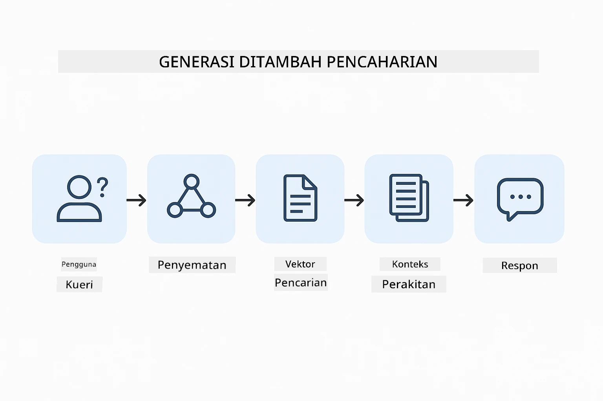
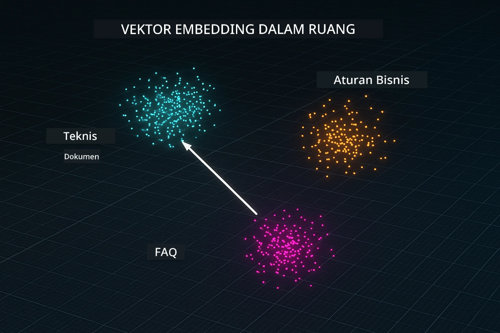
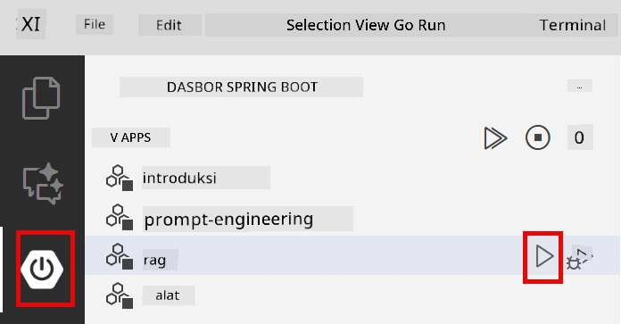
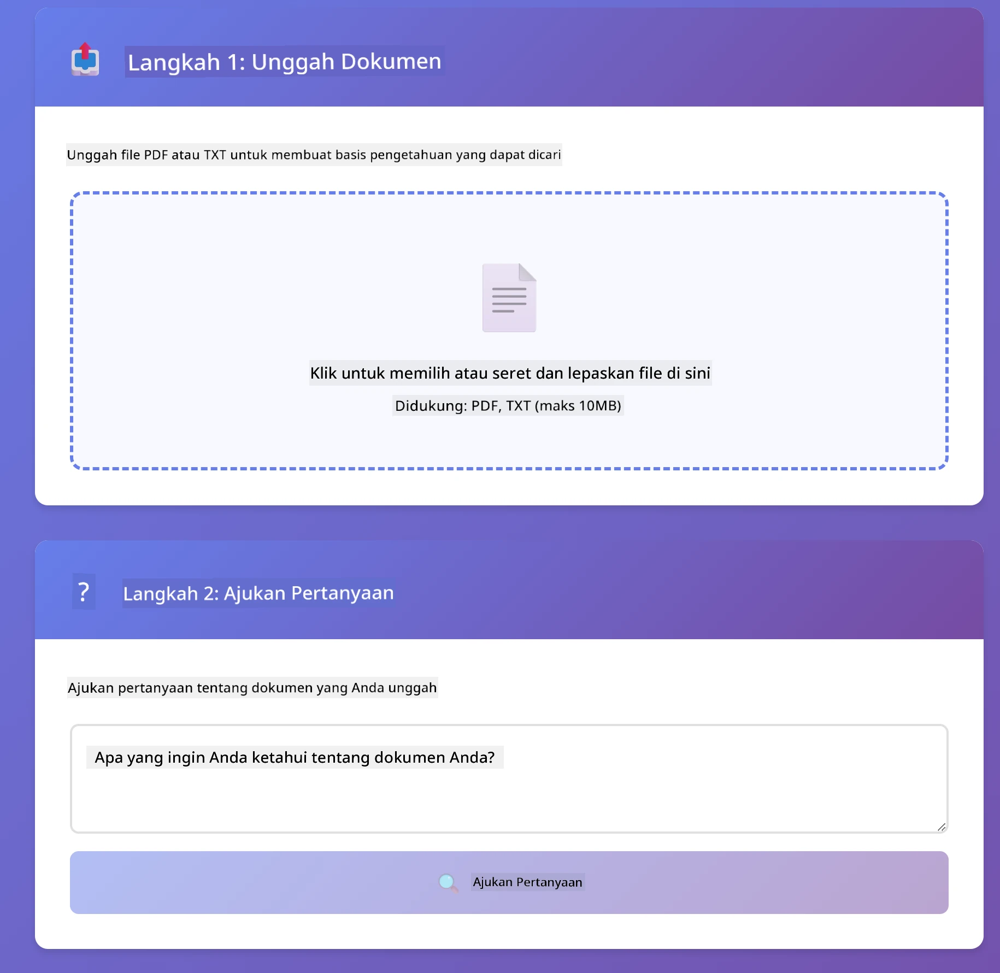
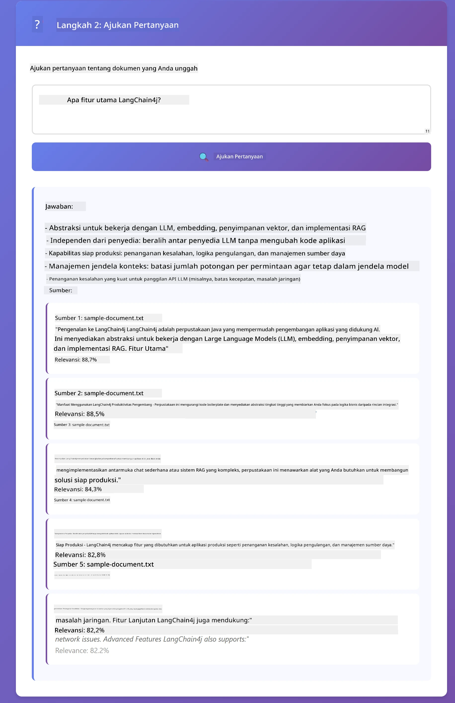

# Modul 03: RAG (Retrieval-Augmented Generation)

## Daftar Isi

- [Apa yang Akan Anda Pelajari](../../../03-rag)
- [Prasyarat](../../../03-rag)
- [Memahami RAG](../../../03-rag)
- [Cara Kerjanya](../../../03-rag)
  - [Pemrosesan Dokumen](../../../03-rag)
  - [Membuat Embedding](../../../03-rag)
  - [Pencarian Semantik](../../../03-rag)
  - [Pembuatan Jawaban](../../../03-rag)
- [Menjalankan Aplikasi](../../../03-rag)
- [Menggunakan Aplikasi](../../../03-rag)
  - [Unggah Dokumen](../../../03-rag)
  - [Ajukan Pertanyaan](../../../03-rag)
  - [Periksa Referensi Sumber](../../../03-rag)
  - [Bereksperimen dengan Pertanyaan](../../../03-rag)
- [Konsep Kunci](../../../03-rag)
  - [Strategi Pemotongan](../../../03-rag)
  - [Skor Kemiripan](../../../03-rag)
  - [Penyimpanan dalam Memori](../../../03-rag)
  - [Manajemen Jendela Konteks](../../../03-rag)
- [Kapan RAG Penting](../../../03-rag)
- [Langkah Berikutnya](../../../03-rag)

## Apa yang Akan Anda Pelajari

Pada modul sebelumnya, Anda belajar cara berkomunikasi dengan AI dan menyusun prompt dengan efektif. Namun ada batasan mendasar: model bahasa hanya tahu apa yang mereka pelajari selama pelatihan. Mereka tidak dapat menjawab pertanyaan tentang kebijakan perusahaan Anda, dokumentasi proyek Anda, atau informasi apa pun yang tidak diajarkan kepada mereka.

RAG (Retrieval-Augmented Generation) memecahkan masalah ini. Alih-alih mencoba mengajarkan model informasi Anda (yang mahal dan tidak praktis), Anda memberinya kemampuan untuk mencari dalam dokumen Anda. Ketika seseorang mengajukan pertanyaan, sistem menemukan informasi yang relevan dan menyertakannya dalam prompt. Model kemudian menjawab berdasarkan konteks yang diambil tersebut.

Anggaplah RAG sebagai memberikan model sebuah perpustakaan referensi. Ketika Anda mengajukan pertanyaan, sistem:

1. **Pertanyaan Pengguna** - Anda mengajukan pertanyaan  
2. **Embedding** - Mengubah pertanyaan Anda menjadi vektor  
3. **Pencarian Vektor** - Menemukan potongan dokumen yang mirip  
4. **Penyusunan Konteks** - Menambah potongan relevan ke dalam prompt  
5. **Respon** - LLM menghasilkan jawaban berdasarkan konteks  

Ini membuat jawaban model berlandaskan data aktual Anda daripada hanya mengandalkan pengetahuan latihannya atau mengarang jawaban.



*Alur kerja RAG - dari pertanyaan pengguna ke pencarian semantik hingga pembuatan jawaban kontekstual*

## Prasyarat

- Modul 01 telah selesai (Sumber daya Azure OpenAI sudah diterapkan)  
- File `.env` di direktori root dengan kredensial Azure (dibuat oleh `azd up` di Modul 01)  

> **Catatan:** Jika Anda belum menyelesaikan Modul 01, ikuti instruksi penerapannya terlebih dahulu.

## Cara Kerjanya

### Pemrosesan Dokumen

[DocumentService.java](../../../03-rag/src/main/java/com/example/langchain4j/rag/service/DocumentService.java)

Saat Anda mengunggah dokumen, sistem memecahnya menjadi potongan-potongan - bagian yang lebih kecil yang muat dengan nyaman di jendela konteks model. Potongan-potongan ini sedikit tumpang tindih agar konteks di batas tidak hilang.

```java
Document document = FileSystemDocumentLoader.loadDocument("sample-document.txt");

DocumentSplitter splitter = DocumentSplitters
    .recursive(300, 30, new OpenAiTokenizer());

List<TextSegment> segments = splitter.split(document);
```
  
> **🤖 Coba dengan [GitHub Copilot](https://github.com/features/copilot) Chat:** Buka [`DocumentService.java`](../../../03-rag/src/main/java/com/example/langchain4j/rag/service/DocumentService.java) dan tanyakan:  
> - "Bagaimana LangChain4j memecah dokumen menjadi potongan dan mengapa tumpang tindih penting?"  
> - "Berapa ukuran potongan optimal untuk berbagai jenis dokumen dan kenapa?"  
> - "Bagaimana cara menangani dokumen dalam berbagai bahasa atau dengan format khusus?"

### Membuat Embedding

[LangChainRagConfig.java](../../../03-rag/src/main/java/com/example/langchain4j/rag/config/LangChainRagConfig.java)

Setiap potongan diubah menjadi representasi numerik yang disebut embedding - pada dasarnya sidik jari matematis yang menangkap arti teks. Teks yang mirip menghasilkan embedding yang mirip.

```java
@Bean
public EmbeddingModel embeddingModel() {
    return OpenAiOfficialEmbeddingModel.builder()
        .baseUrl(azureOpenAiEndpoint)
        .apiKey(azureOpenAiKey)
        .modelName(azureEmbeddingDeploymentName)
        .build();
}

EmbeddingStore<TextSegment> embeddingStore = 
    new InMemoryEmbeddingStore<>();
```
  


*Dokumen direpresentasikan sebagai vektor dalam ruang embedding - konten yang mirip dikelompokkan bersama*

### Pencarian Semantik

[RagService.java](../../../03-rag/src/main/java/com/example/langchain4j/rag/service/RagService.java)

Saat Anda mengajukan pertanyaan, pertanyaan Anda juga menjadi embedding. Sistem membandingkan embedding pertanyaan Anda dengan embedding semua potongan dokumen. Sistem menemukan potongan dengan makna yang paling mirip - bukan hanya kata kunci yang cocok, tapi kemiripan semantik sebenarnya.

```java
Embedding queryEmbedding = embeddingModel.embed(question).content();

List<EmbeddingMatch<TextSegment>> matches = 
    embeddingStore.findRelevant(queryEmbedding, 5, 0.7);

for (EmbeddingMatch<TextSegment> match : matches) {
    String relevantText = match.embedded().text();
    double score = match.score();
}
```
  
> **🤖 Coba dengan [GitHub Copilot](https://github.com/features/copilot) Chat:** Buka [`RagService.java`](../../../03-rag/src/main/java/com/example/langchain4j/rag/service/RagService.java) dan tanyakan:  
> - "Bagaimana pencarian kemiripan bekerja dengan embedding dan apa yang menentukan skor?"  
> - "Berapa ambang batas kemiripan yang harus saya gunakan dan bagaimana pengaruhnya ke hasil?"  
> - "Bagaimana menangani kasus saat tidak ditemukan dokumen relevan?"

### Pembuatan Jawaban

[RagService.java](../../../03-rag/src/main/java/com/example/langchain4j/rag/service/RagService.java)

Potongan yang paling relevan disertakan dalam prompt untuk model. Model membaca potongan spesifik itu dan menjawab pertanyaan Anda berdasarkan informasi tersebut. Ini mencegah halusinasi — model hanya bisa menjawab dari apa yang ada di depannya.

## Menjalankan Aplikasi

**Verifikasi penerapan:**  

Pastikan file `.env` ada di direktori root dengan kredensial Azure (dibuat selama Modul 01):  
```bash
cat ../.env  # Harus menampilkan AZURE_OPENAI_ENDPOINT, API_KEY, DEPLOYMENT
```
  
**Mulai aplikasi:**  

> **Catatan:** Jika Anda sudah memulai semua aplikasi menggunakan `./start-all.sh` dari Modul 01, modul ini sudah berjalan di port 8081. Anda dapat melewati perintah mulai di bawah dan langsung membuka http://localhost:8081.

**Opsi 1: Menggunakan Spring Boot Dashboard (Direkomendasikan untuk pengguna VS Code)**  

Kontainer pengembangan termasuk ekstensi Spring Boot Dashboard, yang menyediakan antarmuka visual untuk mengelola semua aplikasi Spring Boot. Anda dapat menemukannya di Bar Aktivitas di sisi kiri VS Code (cari ikon Spring Boot).

Dari Spring Boot Dashboard, Anda dapat:  
- Melihat semua aplikasi Spring Boot yang tersedia di workspace  
- Memulai/menghentikan aplikasi dengan satu klik  
- Melihat log aplikasi secara real-time  
- Memantau status aplikasi  

Cukup klik tombol play di sebelah "rag" untuk memulai modul ini, atau mulai semua modul sekaligus.



**Opsi 2: Menggunakan skrip shell**  

Mulai semua aplikasi web (modul 01-04):

**Bash:**  
```bash
cd ..  # Dari direktori root
./start-all.sh
```
  
**PowerShell:**  
```powershell
cd ..  # Dari direktori root
.\start-all.ps1
```
  
Atau mulai hanya modul ini:

**Bash:**  
```bash
cd 03-rag
./start.sh
```
  
**PowerShell:**  
```powershell
cd 03-rag
.\start.ps1
```
  
Kedua skrip otomatis memuat variabel lingkungan dari file `.env` root dan akan membangun JAR jika belum ada.

> **Catatan:** Jika Anda ingin membangun semua modul secara manual sebelum mulai:  
>  
> **Bash:**  
> ```bash
> cd ..  # Go to root directory
> mvn clean package -DskipTests
> ```
>  
> **PowerShell:**  
> ```powershell
> cd ..  # Go to root directory
> mvn clean package -DskipTests
> ```
  
Buka http://localhost:8081 di peramban Anda.

**Untuk berhenti:**  

**Bash:**  
```bash
./stop.sh  # Modul ini saja
# Atau
cd .. && ./stop-all.sh  # Semua modul
```
  
**PowerShell:**  
```powershell
.\stop.ps1  # Modul ini saja
# Atau
cd ..; .\stop-all.ps1  # Semua modul
```
  
## Menggunakan Aplikasi

Aplikasi menyediakan antarmuka web untuk mengunggah dokumen dan mengajukan pertanyaan.

<a href="images/rag-homepage.png"></a>

*Antarmuka aplikasi RAG - unggah dokumen dan ajukan pertanyaan*

### Unggah Dokumen

Mulailah dengan mengunggah dokumen - berkas TXT paling cocok untuk pengujian. Sebuah `sample-document.txt` disediakan di direktori ini yang berisi informasi tentang fitur LangChain4j, implementasi RAG, dan praktik terbaik - sempurna untuk menguji sistem.

Sistem memproses dokumen Anda, memecahnya menjadi potongan-potongan, dan membuat embedding untuk setiap potongan. Ini terjadi secara otomatis saat Anda mengunggah.

### Ajukan Pertanyaan

Sekarang ajukan pertanyaan spesifik tentang isi dokumen. Cobalah hal faktual yang jelas tertulis dalam dokumen. Sistem mencari potongan relevan, menyertakannya dalam prompt, dan menghasilkan jawaban.

### Periksa Referensi Sumber

Perhatikan setiap jawaban menyertakan referensi sumber dengan skor kemiripan. Skor ini (0 sampai 1) menunjukkan seberapa relevan setiap potongan terhadap pertanyaan Anda. Skor lebih tinggi berarti kecocokan lebih baik. Ini memungkinkan Anda memverifikasi jawaban terhadap bahan sumber.

<a href="images/rag-query-results.png"></a>

*Hasil query menunjukkan jawaban dengan referensi sumber dan skor relevansi*

### Bereksperimen dengan Pertanyaan

Coba berbagai jenis pertanyaan:  
- Fakta spesifik: "Apa topik utama?"  
- Perbandingan: "Apa perbedaan antara X dan Y?"  
- Ringkasan: "Ringkas poin utama tentang Z"

Perhatikan bagaimana skor relevansi berubah berdasarkan seberapa baik pertanyaan Anda cocok dengan isi dokumen.

## Konsep Kunci

### Strategi Pemotongan

Dokumen dipotong menjadi potongan berukuran 300 token dengan tumpang tindih 30 token. Keseimbangan ini memastikan setiap potongan memiliki konteks yang cukup bermakna sambil tetap cukup kecil agar beberapa potongan bisa dimasukkan dalam sebuah prompt.

### Skor Kemiripan

Skor berkisar dari 0 sampai 1:  
- 0.7-1.0: Sangat relevan, cocok persis  
- 0.5-0.7: Relevan, konteks bagus  
- Di bawah 0.5: Disaring, terlalu tidak mirip  

Sistem hanya mengambil potongan di atas ambang minimum untuk memastikan kualitas.

### Penyimpanan dalam Memori

Modul ini menggunakan penyimpanan dalam memori untuk kesederhanaan. Saat Anda memulai ulang aplikasi, dokumen yang diunggah hilang. Sistem produksi menggunakan database vektor persisten seperti Qdrant atau Azure AI Search.

### Manajemen Jendela Konteks

Setiap model memiliki jendela konteks maksimal. Anda tidak bisa memasukkan setiap potongan dari dokumen besar. Sistem mengambil N potongan yang paling relevan (default 5) untuk tetap dalam batas sambil menyediakan konteks cukup untuk jawaban akurat.

## Kapan RAG Penting

**Gunakan RAG ketika:**  
- Menjawab pertanyaan tentang dokumen milik sendiri  
- Informasi sering berubah (kebijakan, harga, spesifikasi)  
- Akurasi membutuhkan atribusi sumber  
- Konten terlalu besar untuk dimasukkan dalam satu prompt  
- Anda membutuhkan jawaban yang dapat diverifikasi dan berlandaskan sumber  

**Jangan gunakan RAG ketika:**  
- Pertanyaan memerlukan pengetahuan umum yang sudah dimiliki model  
- Data waktu nyata dibutuhkan (RAG bekerja pada dokumen yang diunggah)  
- Konten cukup kecil untuk disertakan langsung dalam prompt  

## Langkah Berikutnya

**Modul Selanjutnya:** [04-tools - AI Agents with Tools](../04-tools/README.md)

---

**Navigasi:** [← Sebelumnya: Modul 02 - Prompt Engineering](../02-prompt-engineering/README.md) | [Kembali ke Utama](../README.md) | [Selanjutnya: Modul 04 - Tools →](../04-tools/README.md)

---

<!-- CO-OP TRANSLATOR DISCLAIMER START -->
**Penafian**:  
Dokumen ini telah diterjemahkan menggunakan layanan terjemahan AI [Co-op Translator](https://github.com/Azure/co-op-translator). Meskipun kami berusaha untuk akurasi, harap diingat bahwa terjemahan otomatis mungkin mengandung kesalahan atau ketidakakuratan. Dokumen asli dalam bahasa aslinya harus dianggap sebagai sumber yang sah. Untuk informasi penting, disarankan menggunakan jasa terjemahan profesional oleh manusia. Kami tidak bertanggung jawab atas kesalahpahaman atau salah tafsir yang timbul dari penggunaan terjemahan ini.
<!-- CO-OP TRANSLATOR DISCLAIMER END -->