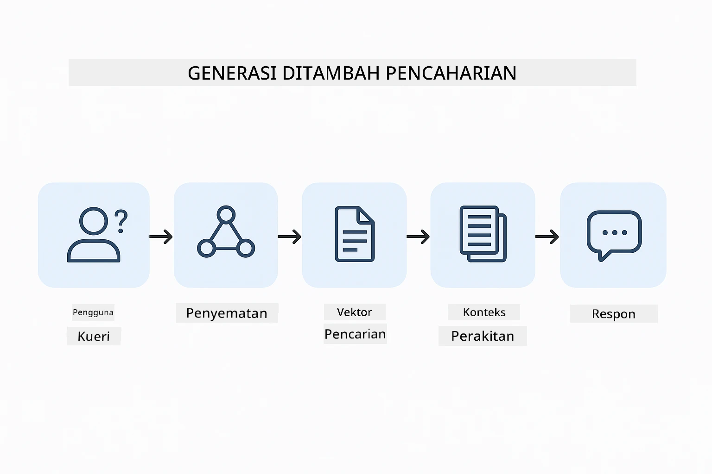
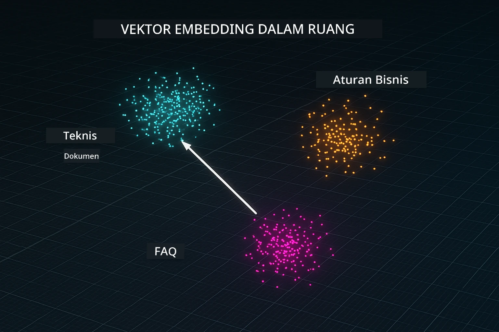
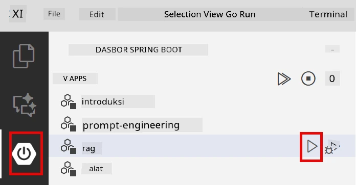
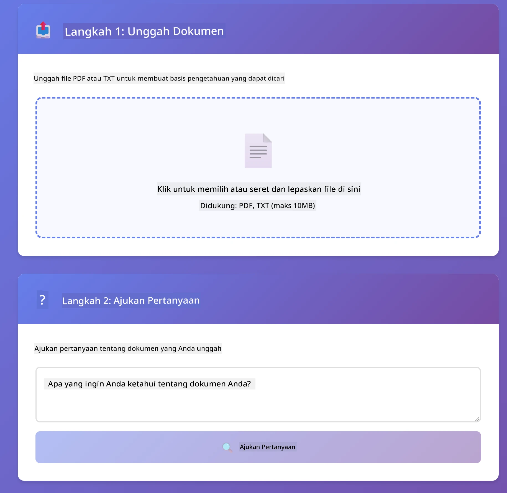
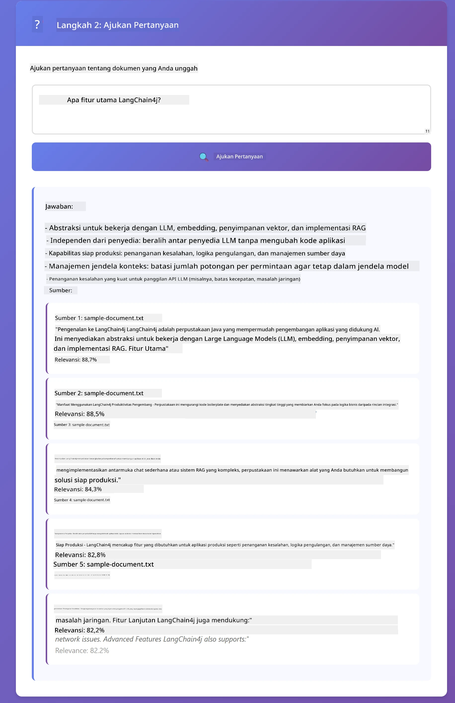

# Modul 03: RAG (Retrieval-Augmented Generation)

## Daftar Isi

- [Video Walkthrough](#video-walkthrough)
- [Apa yang Akan Anda Pelajari](#apa-yang-akan-anda-pelajari)
- [Prasyarat](#prasyarat)
- [Memahami RAG](#memahami-rag)
  - [Pendekatan RAG Mana yang Digunakan Tutorial Ini?](#pendekatan-rag-mana-yang-digunakan-tutorial-ini)
- [Cara Kerjanya](#cara-kerjanya)
  - [Pemrosesan Dokumen](#pemrosesan-dokumen)
  - [Membuat Embedding](#membuat-embedding)
  - [Pencarian Semantik](#pencarian-semantik)
  - [Pembuatan Jawaban](#pembuatan-jawaban)
- [Jalankan Aplikasi](#menjalankan-aplikasi)
- [Menggunakan Aplikasi](#menggunakan-aplikasi)
  - [Unggah Dokumen](#unggah-dokumen)
  - [Ajukan Pertanyaan](#ajukan-pertanyaan)
  - [Periksa Referensi Sumber](#periksa-referensi-sumber)
  - [Bereksperimen dengan Pertanyaan](#bereksperimen-dengan-pertanyaan)
- [Konsep Utama](#konsep-utama)
  - [Strategi Pemotongan](#strategi-pemecahan-potongan)
  - [Skor Kemiripan](#skor-kesamaan)
  - [Penyimpanan dalam Memori](#penyimpanan-dalam-memori)
  - [Manajemen Jendela Konteks](#manajemen-jendela-konteks)
- [Kapan RAG Penting](#kapan-rag-penting)
- [Langkah Berikutnya](#langkah-selanjutnya)

## Video Walkthrough

Tonton sesi langsung ini yang menjelaskan cara memulai dengan modul ini:

<a href="https://www.youtube.com/watch?v=_olq75ZH_eY"></a>

## Apa yang Akan Anda Pelajari

Dalam modul sebelumnya, Anda belajar bagaimana melakukan percakapan dengan AI dan menyusun prompt Anda secara efektif. Namun ada keterbatasan mendasar: model bahasa hanya tahu apa yang mereka pelajari selama pelatihan. Mereka tidak bisa menjawab pertanyaan tentang kebijakan perusahaan Anda, dokumentasi proyek Anda, atau informasi apa pun yang tidak mereka latih.

RAG (Retrieval-Augmented Generation) memecahkan masalah ini. Alih-alih mencoba mengajarkan model informasi Anda (yang mahal dan tidak praktis), Anda memberinya kemampuan untuk mencari melalui dokumen Anda. Ketika seseorang mengajukan pertanyaan, sistem menemukan informasi yang relevan dan memasukkannya ke dalam prompt. Model kemudian menjawab berdasarkan konteks yang diambil tersebut.

Pikirkan RAG sebagai memberikan model sebuah perpustakaan referensi. Ketika Anda mengajukan pertanyaan, sistem:

1. **Query Pengguna** - Anda mengajukan pertanyaan  
2. **Embedding** - Mengubah pertanyaan Anda menjadi vektor  
3. **Pencarian Vektor** - Menemukan potongan dokumen yang mirip  
4. **Perakitan Konteks** - Menambahkan potongan relevan ke dalam prompt  
5. **Respons** - LLM menghasilkan jawaban berdasarkan konteks tersebut  

Ini membuat jawaban model berlandaskan data nyata Anda, bukan hanya mengandalkan pengetahuan pelatihannya atau mengarang jawaban.

## Prasyarat

- Telah menyelesaikan [Modul 01 - Pengantar](../01-introduction/README.md) (sumber daya Azure OpenAI telah dikerahkan, termasuk model embedding `text-embedding-3-small`)  
- File `.env` di direktori root dengan kredensial Azure (dibuat oleh `azd up` di Modul 01)  

> **Catatan:** Jika Anda belum menyelesaikan Modul 01, ikuti petunjuk penyebaran di sana terlebih dahulu. Perintah `azd up` mengerahkan model GPT chat dan model embedding yang digunakan modul ini.

## Memahami RAG

Diagram di bawah ini menggambarkan konsep inti: alih-alih hanya mengandalkan data pelatihan model, RAG memberinya perpustakaan referensi dokumen Anda untuk dikonsultasikan sebelum membuat setiap jawaban.


*Diagram ini menunjukkan perbedaan antara LLM standar (yang menebak dari data pelatihan) dan LLM yang diperkuat RAG (yang berkonsultasi dengan dokumen Anda terlebih dahulu).*

Berikut bagaimana bagian-bagian tersebut terhubung end-to-end. Pertanyaan pengguna mengalir melalui empat tahap — embedding, pencarian vektor, perakitan konteks, dan pembuatan jawaban — masing-masing membangun dari tahap sebelumnya:



*Diagram ini menunjukkan pipeline RAG end-to-end — query pengguna mengalir melalui embedding, pencarian vektor, perakitan konteks, dan pembuatan jawaban.*

Sisa modul ini menjelaskan setiap tahap secara detail, dengan kode yang dapat Anda jalankan dan modifikasi.

### Pendekatan RAG Mana yang Digunakan Tutorial Ini?

LangChain4j menawarkan tiga cara mengimplementasikan RAG, masing-masing dengan tingkat abstraksi yang berbeda. Diagram di bawah membandingkan mereka berdampingan:


*Diagram ini membandingkan tiga pendekatan LangChain4j RAG — Easy, Native, dan Advanced — menunjukkan komponen utama mereka dan kapan harus menggunakan masing-masing.*

| Pendekatan | Fungsi | Perdagangan |
|---|---|---|
| **Easy RAG** | Menghubungkan semuanya secara otomatis lewat `AiServices` dan `ContentRetriever`. Anda hanya memberi anotasi pada interface, memasang retriever, dan LangChain4j mengelola embedding, pencarian, dan perakitan prompt di balik layar. | Kode minim, tapi Anda tidak melihat apa yang terjadi di tiap langkah. |
| **Native RAG** | Anda memanggil model embedding, mencari di penyimpanan, membangun prompt, dan menghasilkan jawaban sendiri — satu langkah eksplisit tiap waktu. | Lebih banyak kode, tapi setiap tahap terlihat dan bisa dimodifikasi. |
| **Advanced RAG** | Menggunakan framework `RetrievalAugmentor` dengan transformer query yang bisa disambungkan, router, re-ranker, dan injector konten untuk pipeline produksi. | Fleksibilitas maksimum, tapi jauh lebih kompleks. |

**Tutorial ini menggunakan pendekatan Native.** Setiap langkah pipeline RAG — embedding query, mencari di penyimpanan vektor, merakit konteks, dan membuat jawaban — dituliskan secara eksplisit di [`RagService.java`](../../../03-rag/src/main/java/com/example/langchain4j/rag/service/RagService.java). Ini disengaja: sebagai sumber belajar, lebih penting Anda melihat dan memahami setiap tahap daripada kode dipersingkat. Setelah Anda nyaman dengan bagaimana bagian-bagian berfungsi bersama, Anda bisa pindah ke Easy RAG untuk prototipe cepat atau Advanced RAG untuk sistem produksi.

> **💡 Ingin tahu tentang Easy RAG?** LangChain4j juga menyediakan pendekatan *Easy RAG* di mana `AiServices` dan `ContentRetriever` menangani embedding, pencarian, dan perakitan prompt otomatis. Modul ini mengambil jalur yang lebih eksplisit — membuka pipeline itu agar Anda bisa melihat dan mengontrol tiap tahap sendiri.

Diagram di bawah mengilustrasikan pipeline Easy RAG. Perhatikan bagaimana `AiServices` dan `EmbeddingStoreContentRetriever` menyembunyikan seluruh kompleksitas — Anda memuat dokumen, memasang retriever, dan mendapatkan jawaban. Pendekatan Native dalam modul ini membuka tiap langkah tersembunyi tersebut:


*Diagram ini menunjukkan pipeline Easy RAG. Bandingkan dengan pendekatan Native yang digunakan modul ini: Easy RAG menyembunyikan embedding, pengambilan, dan perakitan prompt lewat `AiServices` dan `ContentRetriever` — Anda memuat dokumen, memasang retriever, dan mendapat jawaban. Pendekatan Native memecah pipeline itu sehingga Anda panggil tiap tahap (embed, search, assemble context, generate) sendiri, memberikan visibilitas dan kontrol penuh.*

## Cara Kerjanya

Pipeline RAG dalam modul ini terbagi menjadi empat tahap yang dijalankan berurutan setiap kali pengguna mengajukan pertanyaan. Pertama, dokumen yang diunggah **diparsing dan dipotong** menjadi bagian-bagian yang mudah dikelola. Potongan-potongan itu kemudian dikonversi menjadi **embedding vektor** dan disimpan agar bisa dibandingkan secara matematis. Ketika query datang, sistem melakukan **pencarian semantik** untuk menemukan potongan paling relevan, dan akhirnya melewatkannya sebagai konteks ke LLM untuk **pembuatan jawaban**. Bagian-bagian di bawah ini menjelaskan tiap tahap dengan kode dan diagram nyata. Mari kita lihat langkah pertama.

### Pemrosesan Dokumen

[DocumentService.java](../../../03-rag/src/main/java/com/example/langchain4j/rag/service/DocumentService.java)

Ketika Anda mengunggah dokumen, sistem memparsingnya (PDF atau teks biasa), menambahkan metadata seperti nama file, lalu memecahnya menjadi potongan—bagian kecil yang muat dengan nyaman di jendela konteks model. Potongan-potongan ini saling tumpang tindih sedikit sehingga konteks di batas potongan tidak hilang.

```java
// Parse file yang diunggah dan bungkus dalam Dokumen LangChain4j
Document document = Document.from(content, metadata);

// Pisahkan menjadi potongan 300-token dengan tumpang tindih 30-token
DocumentSplitter splitter = DocumentSplitters
    .recursive(300, 30);

List<TextSegment> segments = splitter.split(document);
```
  
Diagram di bawah menunjukkan cara kerjanya secara visual. Perhatikan bagaimana tiap potongan berbagi beberapa token dengan tetangganya — tumpang tindih 30 token menjamin tidak ada konteks penting yang hilang di antara celah-celah:


*Diagram ini menunjukkan dokumen dipotong menjadi potongan 300 token dengan tumpang tindih 30 token, menjaga konteks di batas potongan.*

> **🤖 Coba dengan [GitHub Copilot](https://github.com/features/copilot) Chat:** Buka [`DocumentService.java`](../../../03-rag/src/main/java/com/example/langchain4j/rag/service/DocumentService.java) dan tanya:  
> - "Bagaimana LangChain4j memotong dokumen menjadi potongan dan mengapa tumpang tindih itu penting?"  
> - "Berapa ukuran potongan optimal untuk berbagai tipe dokumen dan mengapa?"  
> - "Bagaimana saya menangani dokumen berbahasa ganda atau dengan format khusus?"

### Membuat Embedding

[LangChainRagConfig.java](../../../03-rag/src/main/java/com/example/langchain4j/rag/config/LangChainRagConfig.java)

Setiap potongan diubah menjadi representasi numerik yang disebut embedding—pada dasarnya pengubah makna menjadi angka. Model embedding tidak "cerdas" seperti model chat; ia tidak bisa mengikuti instruksi, bernalar, atau menjawab pertanyaan. Yang bisa ia lakukan adalah memetakan teks ke ruang matematis di mana makna serupa berdekatan — "mobil" dekat dengan "automobile," "kebijakan pengembalian dana" dekat dengan "kembalikan uang saya." Anggap model chat seperti seseorang yang bisa diajak bicara; model embedding adalah sistem pengarsipan yang sangat baik.

Diagram di bawah memvisualisasikan konsep ini — teks masuk, vektor numerik keluar, dan makna serupa menghasilkan vektor yang berdekatan:


*Diagram ini menunjukkan bagaimana model embedding mengubah teks menjadi vektor numerik, menempatkan makna serupa — seperti "mobil" dan "automobile" — berdekatan dalam ruang vektor.*

```java
@Bean
public EmbeddingModel embeddingModel() {
    return OpenAiOfficialEmbeddingModel.builder()
        .baseUrl(azureOpenAiEndpoint)
        .apiKey(azureOpenAiKey)
        .modelName(azureEmbeddingDeploymentName)
        .build();
}

EmbeddingStore<TextSegment> embeddingStore = 
    new InMemoryEmbeddingStore<>();
```
  
Diagram kelas di bawah menunjukkan dua aliran terpisah dalam pipeline RAG dan kelas LangChain4j yang mengimplementasikannya. Aliran **ingest** (dijalankan sekali saat upload) memecah dokumen, membangun embedding potongan, dan menyimpannya lewat `.addAll()`. Aliran **query** (dijalankan setiap kali pengguna bertanya) membangun embedding pertanyaan, mencari di store lewat `.search()`, dan melewatkan konteks yang cocok ke model chat. Kedua aliran bertemu di interface bersama `EmbeddingStore<TextSegment>`:


*Diagram ini menunjukkan dua aliran dalam pipeline RAG — ingest dan query — dan bagaimana mereka terhubung melalui EmbeddingStore bersama.*

Setelah embedding tersimpan, konten serupa secara alami mengelompok bersama dalam ruang vektor. Visualisasi di bawah menunjukkan dokumen tentang topik terkait menjadi titik-titik yang berdekatan, yang membuat pencarian semantik menjadi mungkin:



*Visualisasi ini menunjukkan bagaimana dokumen terkait mengelompok bersama dalam ruang vektor 3D, dengan topik seperti Dokumen Teknis, Aturan Bisnis, dan FAQ membentuk kelompok terpisah.*

Ketika pengguna melakukan pencarian, sistem mengikuti empat langkah: buat embedding dokumen sekali, buat embedding query untuk tiap pencarian, bandingkan vektor query terhadap semua vektor yang tersimpan menggunakan cosine similarity, dan kembalikan top-K potongan dengan skor tertinggi. Diagram di bawah menjelaskan tiap langkah dan kelas LangChain4j terkait:


*Diagram ini menunjukkan proses pencarian embedding empat langkah: buat embedding dokumen, buat embedding query, bandingkan vektor dengan cosine similarity, dan kembalikan hasil top-K.*

### Pencarian Semantik

[RagService.java](../../../03-rag/src/main/java/com/example/langchain4j/rag/service/RagService.java)

Ketika Anda mengajukan pertanyaan, pertanyaan Anda juga diubah menjadi embedding. Sistem membandingkan embedding pertanyaan Anda dengan embedding semua potongan dokumen. Ia menemukan potongan dengan makna paling mirip — bukan hanya mencocokkan kata kunci, tetapi kesamaan semantik sesungguhnya.

```java
Embedding queryEmbedding = embeddingModel.embed(question).content();

EmbeddingSearchRequest searchRequest = EmbeddingSearchRequest.builder()
    .queryEmbedding(queryEmbedding)
    .maxResults(5)
    .minScore(0.5)
    .build();

EmbeddingSearchResult<TextSegment> searchResult = embeddingStore.search(searchRequest);
List<EmbeddingMatch<TextSegment>> matches = searchResult.matches();

for (EmbeddingMatch<TextSegment> match : matches) {
    String relevantText = match.embedded().text();
    double score = match.score();
}
```
  
Diagram di bawah membandingkan pencarian semantik dengan pencarian kata kunci tradisional. Pencarian kata kunci untuk "kendaraan" melewatkan potongan tentang "mobil dan truk," tapi pencarian semantik memahami mereka berarti hal yang sama dan mengembalikannya sebagai kecocokan dengan skor tinggi:


*Diagram ini membandingkan pencarian berbasis kata kunci dengan pencarian semantik, menunjukkan bagaimana pencarian semantik mengambil konten yang secara konseptual terkait walaupun kata kunci tepat berbeda.*

Di belakang layar, kemiripan diukur menggunakan cosine similarity — pada dasarnya menanyakan "apakah dua panah ini menunjuk ke arah yang sama?" Dua potongan bisa menggunakan kata-kata yang sangat berbeda, tapi jika maknanya sama, vektor mereka menunjuk ke arah yang sama dan skornya mendekati 1.0:


*Diagram ini menggambarkan kesamaan kosinus sebagai sudut antara vektor embedding — vektor yang lebih sejajar mendapatkan skor mendekati 1.0, yang menunjukkan kesamaan semantik yang lebih tinggi.*

> **🤖 Coba dengan [GitHub Copilot](https://github.com/features/copilot) Chat:** Buka [`RagService.java`](../../../03-rag/src/main/java/com/example/langchain4j/rag/service/RagService.java) dan tanyakan:
> - "Bagaimana pencarian kesamaan bekerja dengan embeddings dan apa yang menentukan skornya?"
> - "Ambang kesamaan berapa yang harus saya gunakan dan bagaimana pengaruhnya terhadap hasil?"
> - "Bagaimana saya menangani kasus ketika tidak ada dokumen relevan yang ditemukan?"

### Pembuatan Jawaban

[RagService.java](../../../03-rag/src/main/java/com/example/langchain4j/rag/service/RagService.java)

Potongan paling relevan disusun menjadi sebuah prompt terstruktur yang mencakup instruksi eksplisit, konteks yang diambil, dan pertanyaan pengguna. Model membaca potongan-potongan tertentu tersebut dan menjawab berdasarkan informasi itu — model hanya dapat menggunakan apa yang ada di depannya, sehingga mencegah halusinasi.

```java
String context = matches.stream()
    .map(match -> match.embedded().text())
    .collect(Collectors.joining("\n\n"));

String prompt = String.format("""
    Answer the question based on the following context.
    If the answer cannot be found in the context, say so.

    Context:
    %s

    Question: %s

    Answer:""", context, request.question());

String answer = chatModel.chat(prompt);
```

Diagram di bawah menunjukkan proses penyusunan ini — potongan dengan skor tertinggi dari langkah pencarian disuntikkan ke dalam template prompt, dan `OpenAiOfficialChatModel` menghasilkan jawaban yang berlandaskan:


*Diagram ini menunjukkan bagaimana potongan dengan skor tertinggi disusun menjadi prompt terstruktur, memungkinkan model menghasilkan jawaban yang berlandaskan data Anda.*

## Menjalankan Aplikasi

**Verifikasi penerapan:**

Pastikan file `.env` ada di direktori root dengan kredensial Azure (dibuat saat Modul 01). Jalankan dari direktori modul (`03-rag/`):

**Bash:**
```bash
cat ../.env  # Harus menampilkan AZURE_OPENAI_ENDPOINT, API_KEY, DEPLOYMENT
```

**PowerShell:**
```powershell
Get-Content ..\.env  # Harus menampilkan AZURE_OPENAI_ENDPOINT, API_KEY, DEPLOYMENT
```

**Mulai aplikasi:**

> **Catatan:** Jika Anda sudah memulai semua aplikasi menggunakan `./start-all.sh` dari direktori root (seperti dijelaskan di Modul 01), modul ini sudah berjalan di port 8081. Anda bisa melewati perintah mulai di bawah dan langsung ke http://localhost:8081.

**Opsi 1: Menggunakan Spring Boot Dashboard (Disarankan untuk pengguna VS Code)**

Container dev menyertakan ekstensi Spring Boot Dashboard, yang menyediakan antarmuka visual untuk mengelola semua aplikasi Spring Boot. Anda dapat menemukannya di Bilah Aktivitas di sebelah kiri VS Code (cari ikon Spring Boot).

Dari Spring Boot Dashboard, Anda dapat:
- Melihat semua aplikasi Spring Boot yang tersedia di workspace
- Memulai/menghentikan aplikasi dengan sekali klik
- Melihat log aplikasi secara real-time
- Memantau status aplikasi

Cukup klik tombol play di samping "rag" untuk memulai modul ini, atau mulai semua modul sekaligus.



*Tangkapan layar ini menunjukkan Spring Boot Dashboard di VS Code, tempat Anda bisa memulai, menghentikan, dan memantau aplikasi secara visual.*

**Opsi 2: Menggunakan skrip shell**

Mulai semua aplikasi web (modul 01-04):

**Bash:**
```bash
cd ..  # Dari direktori root
./start-all.sh
```

**PowerShell:**
```powershell
cd ..  # Dari direktori root
.\start-all.ps1
```

Atau hanya mulai modul ini:

**Bash:**
```bash
cd 03-rag
./start.sh
```

**PowerShell:**
```powershell
cd 03-rag
.\start.ps1
```

Kedua skrip secara otomatis memuat variabel lingkungan dari file `.env` root dan akan membangun JAR jika belum ada.

> **Catatan:** Jika Anda lebih suka membangun semua modul secara manual sebelum memulai:
>
> **Bash:**
> ```bash
> cd ..  # Go to root directory
> mvn clean package -DskipTests
> ```
>
> **PowerShell:**
> ```powershell
> cd ..  # Go to root directory
> mvn clean package -DskipTests
> ```

Buka http://localhost:8081 di peramban Anda.

**Untuk menghentikan:**

**Bash:**
```bash
./stop.sh  # Hanya modul ini
# Atau
cd .. && ./stop-all.sh  # Semua modul
```

**PowerShell:**
```powershell
.\stop.ps1  # Hanya modul ini
# Atau
cd ..; .\stop-all.ps1  # Semua modul
```

## Menggunakan Aplikasi

Aplikasi menyediakan antarmuka web untuk unggah dokumen dan bertanya.

<a href="images/rag-homepage.png"></a>

*Tangkapan layar ini menunjukkan antarmuka aplikasi RAG tempat Anda mengunggah dokumen dan mengajukan pertanyaan.*

### Unggah Dokumen

Mulailah dengan mengunggah dokumen — file TXT paling ideal untuk pengujian. Sebuah `sample-document.txt` disediakan di direktori ini yang memuat informasi tentang fitur LangChain4j, implementasi RAG, dan praktik terbaik — sangat cocok untuk menguji sistem.

Sistem memproses dokumen Anda, memecahnya menjadi potongan-potongan, dan membuat embeddings untuk setiap potongan. Ini terjadi otomatis saat Anda unggah.

### Ajukan Pertanyaan

Sekarang ajukan pertanyaan spesifik tentang konten dokumen. Cobalah sesuatu yang faktual dan jelas disebutkan dalam dokumen. Sistem mencari potongan relevan, memasukkannya ke dalam prompt, dan menghasilkan jawaban.

### Periksa Referensi Sumber

Perhatikan setiap jawaban menyertakan referensi sumber dengan skor kesamaan. Skor ini (0 sampai 1) menunjukkan tingkat relevansi potongan terhadap pertanyaan Anda. Skor lebih tinggi berarti kecocokan lebih baik. Ini memungkinkan Anda memverifikasi jawaban sesuai sumber aslinya.

<a href="images/rag-query-results.png"></a>

*Tangkapan layar ini menunjukkan hasil query dengan jawaban yang dihasilkan, referensi sumber, dan skor relevansi untuk setiap potongan yang diambil.*

### Bereksperimen dengan Pertanyaan

Coba berbagai jenis pertanyaan:
- Fakta spesifik: "Apa topik utama?"
- Perbandingan: "Apa beda antara X dan Y?"
- Ringkasan: "Ringkas poin-poin kunci tentang Z"

Perhatikan bagaimana skor relevansi berubah berdasarkan seberapa baik pertanyaan Anda cocok dengan konten dokumen.

## Konsep Utama

### Strategi Pemecahan Potongan

Dokumen dibagi menjadi potongan 300 token dengan tumpang tindih 30 token. Keseimbangan ini memastikan setiap potongan memiliki cukup konteks untuk bermakna sambil tetap cukup kecil agar bisa menyertakan beberapa potongan dalam sebuah prompt.

### Skor Kesamaan

Setiap potongan yang diambil disertai dengan skor kesamaan antara 0 dan 1 yang menunjukkan seberapa dekat kecocokannya dengan pertanyaan pengguna. Diagram di bawah memvisualisasikan rentang skor dan bagaimana sistem menggunakannya untuk menyaring hasil:


*Diagram ini menunjukkan rentang skor dari 0 sampai 1, dengan ambang minimum 0,5 yang menyaring potongan yang tidak relevan.*

Skor berkisar antara 0 sampai 1:
- 0,7-1,0: Sangat relevan, cocok tepat
- 0,5-0,7: Relevan, konteks baik
- Di bawah 0,5: Disaring, terlalu tidak mirip

Sistem hanya mengambil potongan di atas ambang minimum untuk menjamin kualitas.

Embedding bekerja baik saat makna terklaster secara bersih, tetapi memiliki titik buta. Diagram di bawah menunjukkan mode kegagalan umum — potongan terlalu besar menghasilkan vektor yang kabur, potongan terlalu kecil kurang konteks, istilah ambigu menunjuk ke beberapa klaster, dan pencarian cocok tepat (ID, nomor bagian) sama sekali tidak berfungsi dengan embedding:


*Diagram ini menunjukkan mode kegagalan embedding yang umum: potongan terlalu besar, potongan terlalu kecil, istilah ambigu yang menunjuk ke beberapa klaster, dan pencarian cocok tepat seperti ID.*

### Penyimpanan Dalam Memori

Modul ini menggunakan penyimpanan dalam memori untuk kesederhanaan. Ketika Anda memulai ulang aplikasi, dokumen yang diunggah hilang. Sistem produksi menggunakan database vektor persisten seperti Qdrant atau Azure AI Search.

### Manajemen Jendela Konteks

Setiap model memiliki jendela konteks maksimum. Anda tidak bisa menyertakan semua potongan dari dokumen besar. Sistem mengambil N potongan paling relevan teratas (default 5) agar tetap dalam batas sambil menyediakan konteks cukup untuk jawaban akurat.

## Kapan RAG Penting

RAG tidak selalu menjadi pendekatan yang tepat. Panduan keputusan di bawah membantu Anda menentukan kapan RAG memberikan nilai tambah dibandingkan pendekatan yang lebih sederhana — seperti memasukkan konten langsung ke prompt atau mengandalkan pengetahuan bawaan model:


*Diagram ini menunjukkan panduan keputusan kapan RAG memberikan nilai tambah dan kapan pendekatan sederhana sudah cukup.*

## Langkah Selanjutnya

**Modul Berikutnya:** [04-tools - Agen AI dengan Alat](../04-tools/README.md)

---

**Navigasi:** [← Sebelumnya: Modul 02 - Prompt Engineering](../02-prompt-engineering/README.md) | [Kembali ke Utama](../README.md) | [Berikutnya: Modul 04 - Tools →](../04-tools/README.md)

---

<!-- CO-OP TRANSLATOR DISCLAIMER START -->
**Penafian**:
Dokumen ini telah diterjemahkan menggunakan layanan terjemahan AI [Co-op Translator](https://github.com/Azure/co-op-translator). Meskipun kami berupaya untuk mencapai akurasi, harap diketahui bahwa terjemahan otomatis mungkin mengandung kesalahan atau ketidakakuratan. Dokumen asli dalam bahasa aslinya harus dianggap sebagai sumber yang sah. Untuk informasi penting, disarankan menggunakan terjemahan profesional oleh manusia. Kami tidak bertanggung jawab atas kesalahpahaman atau penafsiran yang keliru yang timbul dari penggunaan terjemahan ini.
<!-- CO-OP TRANSLATOR DISCLAIMER END -->