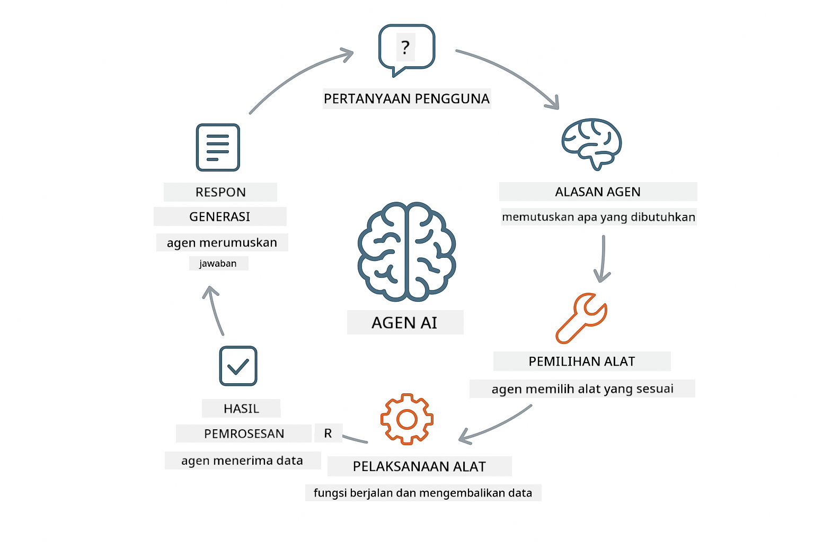
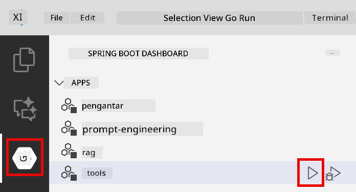

<!--
CO_OP_TRANSLATOR_METADATA:
{
  "original_hash": "13ec450c12cdd1a863baa2b778f27cd7",
  "translation_date": "2025-12-31T03:02:30+00:00",
  "source_file": "04-tools/README.md",
  "language_code": "id"
}
-->
# Module 04: Agen AI dengan Alat

## Table of Contents

- [What You'll Learn](../../../04-tools)
- [Prerequisites](../../../04-tools)
- [Understanding AI Agents with Tools](../../../04-tools)
- [How Tool Calling Works](../../../04-tools)
  - [Tool Definitions](../../../04-tools)
  - [Decision Making](../../../04-tools)
  - [Execution](../../../04-tools)
  - [Response Generation](../../../04-tools)
- [Tool Chaining](../../../04-tools)
- [Run the Application](../../../04-tools)
- [Using the Application](../../../04-tools)
  - [Try Simple Tool Usage](../../../04-tools)
  - [Test Tool Chaining](../../../04-tools)
  - [See Conversation Flow](../../../04-tools)
  - [Observe the Reasoning](../../../04-tools)
  - [Experiment with Different Requests](../../../04-tools)
- [Key Concepts](../../../04-tools)
  - [ReAct Pattern (Reasoning and Acting)](../../../04-tools)
  - [Tool Descriptions Matter](../../../04-tools)
  - [Session Management](../../../04-tools)
  - [Error Handling](../../../04-tools)
- [Available Tools](../../../04-tools)
- [When to Use Tool-Based Agents](../../../04-tools)
- [Next Steps](../../../04-tools)

## What You'll Learn

Sejauh ini, Anda telah belajar bagaimana melakukan percakapan dengan AI, menyusun prompt secara efektif, dan mengaitkan respons dengan dokumen Anda. Namun masih ada batasan mendasar: model bahasa hanya bisa menghasilkan teks. Mereka tidak bisa memeriksa cuaca, melakukan perhitungan, mengquery basis data, atau berinteraksi dengan sistem eksternal.

Alat mengubah hal ini. Dengan memberikan model akses ke fungsi yang dapat dipanggil, Anda mengubahnya dari generator teks menjadi agen yang dapat mengambil tindakan. Model memutuskan kapan ia membutuhkan alat, alat mana yang digunakan, dan parameter apa yang dikirim. Kode Anda mengeksekusi fungsi dan mengembalikan hasil. Model menggabungkan hasil itu ke dalam responsnya.

## Prerequisites

- Menyelesaikan Module 01 (sumber daya Azure OpenAI dideploy)
- File `.env` di direktori root dengan kredensial Azure (dibuat oleh `azd up` di Module 01)

> **Note:** Jika Anda belum menyelesaikan Module 01, ikuti instruksi deployment di sana terlebih dahulu.

## Understanding AI Agents with Tools

> **📝 Note:** Istilah "agents" dalam modul ini merujuk pada asisten AI yang ditingkatkan dengan kemampuan pemanggilan alat. Ini berbeda dari pola **Agentic AI** (agen otonom dengan perencanaan, memori, dan penalaran multi-langkah) yang akan kita bahas di [Module 05: MCP](../05-mcp/README.md).

Agen AI dengan alat mengikuti pola penalaran dan tindakan (ReAct):

1. Pengguna mengajukan pertanyaan
2. Agen menganalisis apa yang perlu diketahuinya
3. Agen memutuskan apakah dia membutuhkan alat untuk menjawab
4. Jika ya, agen memanggil alat yang sesuai dengan parameter yang benar
5. Alat mengeksekusi dan mengembalikan data
6. Agen menggabungkan hasil dan memberikan jawaban akhir



*Pola ReAct - bagaimana agen AI bergantian antara menalar dan bertindak untuk menyelesaikan masalah*

Ini terjadi secara otomatis. Anda mendefinisikan alat dan deskripsinya. Model menangani pengambilan keputusan tentang kapan dan bagaimana menggunakannya.

## How Tool Calling Works

**Tool Definitions** - [WeatherTool.java](../../../04-tools/src/main/java/com/example/langchain4j/agents/tools/WeatherTool.java) | [TemperatureTool.java](../../../04-tools/src/main/java/com/example/langchain4j/agents/tools/TemperatureTool.java)

Anda mendefinisikan fungsi dengan deskripsi yang jelas dan spesifikasi parameter. Model melihat deskripsi ini dalam system prompt dan memahami apa yang dilakukan setiap alat.

```java
@Component
public class WeatherTool {
    
    @Tool("Get the current weather for a location")
    public String getCurrentWeather(@P("Location name") String location) {
        // Logika pencarian cuaca Anda
        return "Weather in " + location + ": 22°C, cloudy";
    }
}

@AiService
public interface Assistant {
    String chat(@MemoryId String sessionId, @UserMessage String message);
}

// Assistant secara otomatis dikonfigurasi oleh Spring Boot dengan:
// - bean ChatModel
// - Semua metode @Tool dari kelas @Component
// - ChatMemoryProvider untuk manajemen sesi
```

> **🤖 Try with [GitHub Copilot](https://github.com/features/copilot) Chat:** Open [`WeatherTool.java`](../../../04-tools/src/main/java/com/example/langchain4j/agents/tools/WeatherTool.java) and ask:
> - "Bagaimana saya mengintegrasikan API cuaca nyata seperti OpenWeatherMap alih-alih data tiruan?"
> - "Apa yang membuat deskripsi alat yang baik sehingga membantu AI menggunakannya dengan benar?"
> - "Bagaimana saya menangani error API dan batasan rate dalam implementasi alat?"

**Decision Making**

Ketika pengguna bertanya "What's the weather in Seattle?", model mengenali bahwa ia membutuhkan alat cuaca. Ia menghasilkan pemanggilan fungsi dengan parameter lokasi diatur ke "Seattle".

**Execution** - [AgentService.java](../../../04-tools/src/main/java/com/example/langchain4j/agents/service/AgentService.java)

Spring Boot meng-autowire antarmuka deklaratif `@AiService` dengan semua alat yang terdaftar, dan LangChain4j mengeksekusi pemanggilan alat secara otomatis.

> **🤖 Try with [GitHub Copilot](https://github.com/features/copilot) Chat:** Open [`AgentService.java`](../../../04-tools/src/main/java/com/example/langchain4j/agents/service/AgentService.java) and ask:
> - "Bagaimana pola ReAct bekerja dan mengapa efektif untuk agen AI?"
> - "Bagaimana agen memutuskan alat mana yang digunakan dan dalam urutan apa?"
> - "Apa yang terjadi jika eksekusi alat gagal - bagaimana saya harus menangani error secara tangguh?"

**Response Generation**

Model menerima data cuaca dan memformatnya menjadi respons bahasa alami untuk pengguna.

### Why Use Declarative AI Services?

Modul ini menggunakan integrasi Spring Boot LangChain4j dengan antarmuka deklaratif `@AiService`:

- **Spring Boot auto-wiring** - ChatModel dan alat diinject secara otomatis
- **@MemoryId pattern** - Manajemen memori berbasis sesi otomatis
- **Single instance** - Asisten dibuat sekali dan digunakan ulang untuk kinerja lebih baik
- **Type-safe execution** - Metode Java dipanggil langsung dengan konversi tipe
- **Multi-turn orchestration** - Menangani chaining alat secara otomatis
- **Zero boilerplate** - Tidak ada pemanggilan manual AiServices.builder() atau HashMap memori

Pendekatan alternatif (manual `AiServices.builder()`) membutuhkan lebih banyak kode dan kehilangan keuntungan integrasi Spring Boot.

## Tool Chaining

**Tool Chaining** - AI mungkin memanggil beberapa alat secara berurutan. Tanyakan "What's the weather in Seattle and should I bring an umbrella?" dan saksikan ia menggabungkan `getCurrentWeather` dengan penalaran tentang perlengkapan hujan.

<a href="images/tool-chaining.png"></a>

*Panggilan alat berurutan - keluaran satu alat memberi masukan ke keputusan berikutnya*

**Graceful Failures** - Minta cuaca di kota yang tidak ada di data tiruan. Alat mengembalikan pesan error, dan AI menjelaskan bahwa ia tidak bisa membantu. Alat gagal dengan aman.

Ini terjadi dalam satu giliran percakapan. Agen mengorkestrasi beberapa pemanggilan alat secara otonom.

## Run the Application

**Verify deployment:**

Pastikan file `.env` ada di direktori root dengan kredensial Azure (dibuat selama Module 01):
```bash
cat ../.env  # Harus menampilkan AZURE_OPENAI_ENDPOINT, API_KEY, DEPLOYMENT
```

**Start the application:**

> **Note:** Jika Anda sudah memulai semua aplikasi menggunakan `./start-all.sh` dari Module 01, modul ini sudah berjalan di port 8084. Anda dapat melewatkan perintah start di bawah dan langsung ke http://localhost:8084.

**Option 1: Using Spring Boot Dashboard (Recommended for VS Code users)**

Dev container menyertakan ekstensi Spring Boot Dashboard, yang menyediakan antarmuka visual untuk mengelola semua aplikasi Spring Boot. Anda dapat menemukannya di Activity Bar di sebelah kiri VS Code (cari ikon Spring Boot).

Dari Spring Boot Dashboard, Anda dapat:
- Melihat semua aplikasi Spring Boot yang tersedia di workspace
- Memulai/stop aplikasi dengan satu klik
- Melihat log aplikasi secara real-time
- Memantau status aplikasi

Cukup klik tombol play di sebelah "tools" untuk memulai modul ini, atau mulai semua modul sekaligus.



**Option 2: Using shell scripts**

Mulai semua aplikasi web (module 01-04):

**Bash:**
```bash
cd ..  # Dari direktori root
./start-all.sh
```

**PowerShell:**
```powershell
cd ..  # Dari direktori root
.\start-all.ps1
```

Atau mulai hanya modul ini:

**Bash:**
```bash
cd 04-tools
./start.sh
```

**PowerShell:**
```powershell
cd 04-tools
.\start.ps1
```

Kedua skrip otomatis memuat variabel lingkungan dari file `.env` root dan akan membangun JAR jika belum ada.

> **Note:** Jika Anda lebih suka membangun semua modul secara manual sebelum memulai:
>
> **Bash:**
> ```bash
> cd ..  # Go to root directory
> mvn clean package -DskipTests
> ```
>
> **PowerShell:**
> ```powershell
> cd ..  # Go to root directory
> mvn clean package -DskipTests
> ```

Buka http://localhost:8084 di browser Anda.

**To stop:**

**Bash:**
```bash
./stop.sh  # Hanya modul ini
# Atau
cd .. && ./stop-all.sh  # Semua modul
```

**PowerShell:**
```powershell
.\stop.ps1  # Hanya modul ini
# Atau
cd ..; .\stop-all.ps1  # Semua modul
```

## Using the Application

Aplikasi menyediakan antarmuka web di mana Anda dapat berinteraksi dengan agen AI yang memiliki akses ke alat cuaca dan konversi suhu.

<a href="images/tools-homepage.png"></a>

*Antarmuka AI Agent Tools - contoh cepat dan antarmuka chat untuk berinteraksi dengan alat*

**Try Simple Tool Usage**

Mulailah dengan permintaan sederhana: "Convert 100 degrees Fahrenheit to Celsius". Agen mengenali bahwa ia membutuhkan alat konversi suhu, memanggilnya dengan parameter yang tepat, dan mengembalikan hasil. Perhatikan betapa alami rasanya — Anda tidak menentukan alat mana yang digunakan atau bagaimana memanggilnya.

**Test Tool Chaining**

Sekarang coba sesuatu yang lebih kompleks: "What's the weather in Seattle and convert it to Fahrenheit?" Saksikan agen bekerja melalui langkah-langkah ini. Pertama ia mendapatkan cuaca (yang mengembalikan Celsius), mengenali bahwa perlu mengonversi ke Fahrenheit, memanggil alat konversi, dan menggabungkan kedua hasil menjadi satu respons.

**See Conversation Flow**

Antarmuka chat mempertahankan riwayat percakapan, memungkinkan Anda melakukan interaksi multi-giliran. Anda dapat melihat semua kueri dan respons sebelumnya, membuatnya mudah untuk melacak percakapan dan memahami bagaimana agen membangun konteks selama beberapa pertukaran.

<a href="images/tools-conversation-demo.png"></a>

*Percakapan multi-giliran menunjukkan konversi sederhana, pencarian cuaca, dan chaining alat*

**Experiment with Different Requests**

Coba berbagai kombinasi:
- Pencarian cuaca: "What's the weather in Tokyo?"
- Konversi suhu: "What is 25°C in Kelvin?"
- Kueri gabungan: "Check the weather in Paris and tell me if it's above 20°C"

Perhatikan bagaimana agen menginterpretasikan bahasa alami dan memetakan ke pemanggilan alat yang sesuai.

## Key Concepts

**ReAct Pattern (Reasoning and Acting)**

Agen bergantian antara menalar (memutuskan apa yang harus dilakukan) dan bertindak (menggunakan alat). Pola ini memungkinkan pemecahan masalah secara otonom daripada sekadar menanggapi instruksi.

**Tool Descriptions Matter**

Kualitas deskripsi alat Anda secara langsung memengaruhi seberapa baik agen menggunakannya. Deskripsi yang jelas dan spesifik membantu model memahami kapan dan bagaimana memanggil setiap alat.

**Session Management**

Annotasi `@MemoryId` memungkinkan manajemen memori berbasis sesi secara otomatis. Setiap ID sesi mendapatkan instans `ChatMemory` sendiri yang dikelola oleh bean `ChatMemoryProvider`, menghilangkan kebutuhan pelacakan memori manual.

**Error Handling**

Alat bisa gagal - API timeout, parameter mungkin tidak valid, layanan eksternal turun. Agen produksi membutuhkan penanganan error sehingga model dapat menjelaskan masalah atau mencoba alternatif.

## Available Tools

**Weather Tools** (data tiruan untuk demonstrasi):
- Mendapatkan cuaca saat ini untuk suatu lokasi
- Mendapatkan prakiraan beberapa hari

**Temperature Conversion Tools**:
- Celsius ke Fahrenheit
- Fahrenheit ke Celsius
- Celsius ke Kelvin
- Kelvin ke Celsius
- Fahrenheit ke Kelvin
- Kelvin ke Fahrenheit

Ini adalah contoh sederhana, tetapi pola ini dapat diperluas ke fungsi apa pun: query basis data, panggilan API, perhitungan, operasi berkas, atau perintah sistem.

## When to Use Tool-Based Agents

**Gunakan alat ketika:**
- Menjawab membutuhkan data waktu-nyata (cuaca, harga saham, inventaris)
- Anda perlu melakukan perhitungan di luar matematika sederhana
- Mengakses basis data atau API
- Mengambil tindakan (mengirim email, membuat tiket, memperbarui catatan)
- Menggabungkan beberapa sumber data

**Jangan gunakan alat ketika:**
- Pertanyaan dapat dijawab dari pengetahuan umum
- Respons murni bersifat percakapan
- Latensi alat akan membuat pengalaman menjadi terlalu lambat

## Next Steps

**Next Module:** [05-mcp - Model Context Protocol (MCP)](../05-mcp/README.md)

---

**Navigation:** [← Previous: Module 03 - RAG](../03-rag/README.md) | [Back to Main](../README.md) | [Next: Module 05 - MCP →](../05-mcp/README.md)

---

<!-- CO-OP TRANSLATOR DISCLAIMER START -->
**Penafian**:
Dokumen ini telah diterjemahkan menggunakan layanan terjemahan AI [Co-op Translator](https://github.com/Azure/co-op-translator). Meskipun kami berupaya untuk mencapai ketepatan, harap diingat bahwa terjemahan otomatis mungkin mengandung kesalahan atau ketidakakuratan. Dokumen asli dalam bahasa aslinya harus dianggap sebagai sumber yang menjadi acuan. Untuk informasi yang bersifat penting, disarankan menggunakan terjemahan profesional oleh penerjemah manusia. Kami tidak bertanggung jawab atas kesalahpahaman atau penafsiran yang keliru yang timbul dari penggunaan terjemahan ini.
<!-- CO-OP TRANSLATOR DISCLAIMER END -->