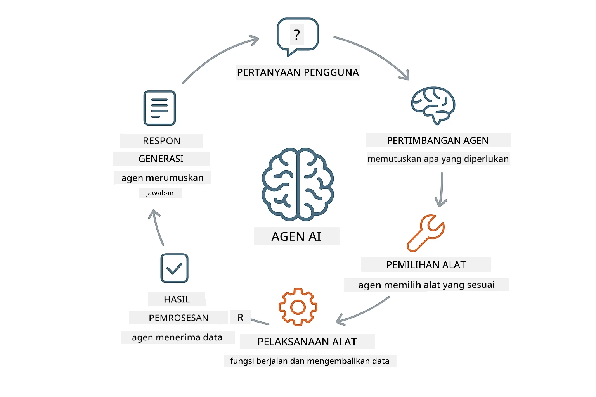
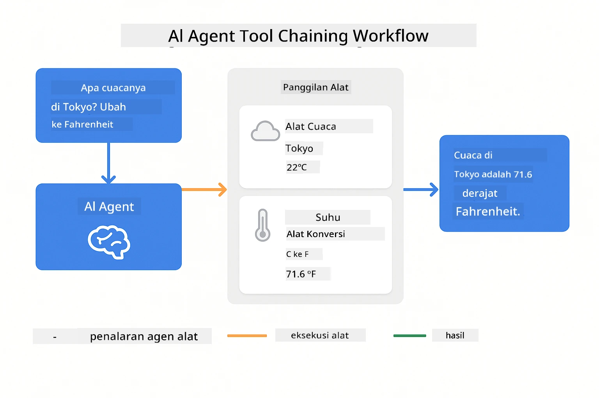
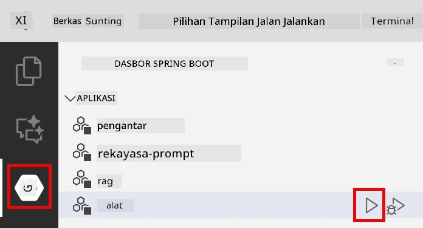
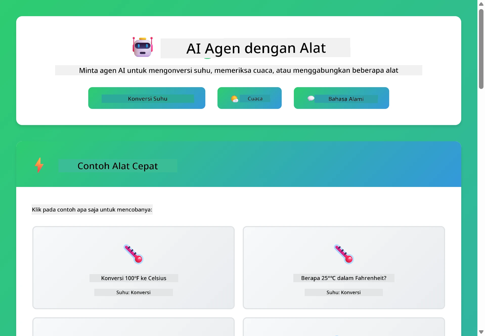
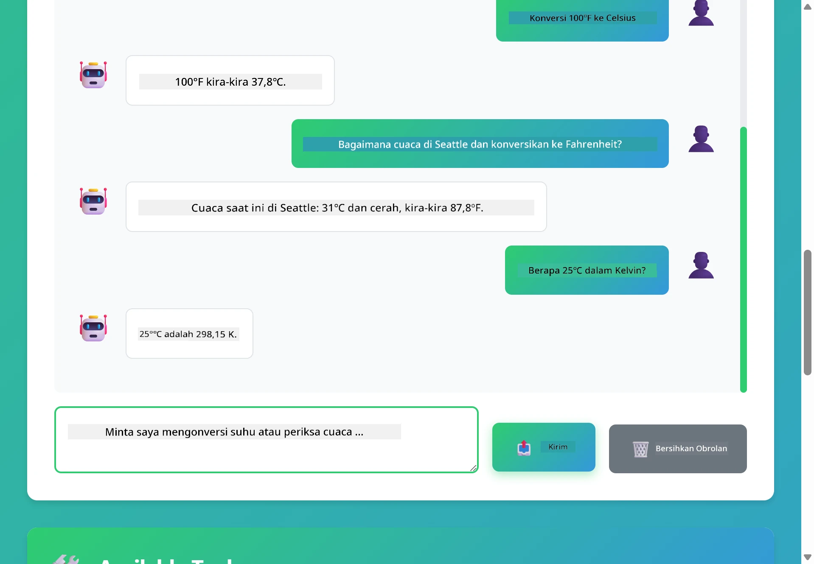

<!--
CO_OP_TRANSLATOR_METADATA:
{
  "original_hash": "844788938b26242f3cc54ce0d0951bea",
  "translation_date": "2026-01-06T00:22:47+00:00",
  "source_file": "04-tools/README.md",
  "language_code": "id"
}
-->
# Modul 04: Agen AI dengan Alat

## Daftar Isi

- [Apa yang Akan Anda Pelajari](../../../04-tools)
- [Prasyarat](../../../04-tools)
- [Memahami Agen AI dengan Alat](../../../04-tools)
- [Bagaimana Pemanggilan Alat Bekerja](../../../04-tools)
  - [Definisi Alat](../../../04-tools)
  - [Pengambilan Keputusan](../../../04-tools)
  - [Eksekusi](../../../04-tools)
  - [Pembuatan Respons](../../../04-tools)
- [Rangkaian Alat](../../../04-tools)
- [Menjalankan Aplikasi](../../../04-tools)
- [Menggunakan Aplikasi](../../../04-tools)
  - [Coba Penggunaan Alat Sederhana](../../../04-tools)
  - [Uji Rangkaian Alat](../../../04-tools)
  - [Lihat Alur Percakapan](../../../04-tools)
  - [Bereksperimen dengan Permintaan Berbeda](../../../04-tools)
- [Konsep Utama](../../../04-tools)
  - [Pola ReAct (Penalaran dan Bertindak)](../../../04-tools)
  - [Deskripsi Alat Penting](../../../04-tools)
  - [Manajemen Sesi](../../../04-tools)
  - [Penanganan Kesalahan](../../../04-tools)
- [Alat yang Tersedia](../../../04-tools)
- [Kapan Menggunakan Agen Berbasis Alat](../../../04-tools)
- [Langkah Selanjutnya](../../../04-tools)

## Apa yang Akan Anda Pelajari

Sampai saat ini, Anda telah belajar cara berinteraksi dengan AI, menyusun prompt secara efektif, dan mendasarkan respons pada dokumen Anda. Namun masih ada keterbatasan mendasar: model bahasa hanya bisa menghasilkan teks. Mereka tidak bisa memeriksa cuaca, melakukan perhitungan, mengquery basis data, atau berinteraksi dengan sistem eksternal.

Alat mengubah ini. Dengan memberikan akses fungsi yang dapat dipanggil oleh model, Anda mengubahnya dari generator teks menjadi agen yang dapat mengambil tindakan. Model memutuskan kapan membutuhkan alat, alat mana yang digunakan, dan parameter apa yang diberikan. Kode Anda mengeksekusi fungsi dan mengembalikan hasilnya. Model memasukkan hasil itu ke dalam responsnya.

## Prasyarat

- Menyelesaikan Modul 01 (sumber daya Azure OpenAI sudah diterapkan)
- File `.env` di direktori root dengan kredensial Azure (dibuat oleh `azd up` di Modul 01)

> **Catatan:** Jika Anda belum menyelesaikan Modul 01, ikuti instruksi penerapan di sana terlebih dahulu.

## Memahami Agen AI dengan Alat

> **📝 Catatan:** Istilah "agen" di modul ini merujuk pada asisten AI yang diperkuat dengan kemampuan pemanggilan alat. Ini berbeda dengan pola **Agentic AI** (agen otonom dengan perencanaan, memori, dan penalaran multi-langkah) yang akan kita bahas di [Modul 05: MCP](../05-mcp/README.md).

Agen AI dengan alat mengikuti pola penalaran dan bertindak (ReAct):

1. Pengguna mengajukan pertanyaan
2. Agen merenungkan apa yang perlu diketahuinya
3. Agen memutuskan apakah membutuhkan alat untuk menjawab
4. Jika ya, agen memanggil alat yang sesuai dengan parameter yang benar
5. Alat mengeksekusi dan mengembalikan data
6. Agen menggabungkan hasil dan memberikan jawaban akhir



*Pola ReAct - bagaimana agen AI bergantian antara menalar dan bertindak untuk memecahkan masalah*

Ini terjadi secara otomatis. Anda mendefinisikan alat dan deskripsinya. Model menangani pengambilan keputusan kapan dan bagaimana menggunakannya.

## Bagaimana Pemanggilan Alat Bekerja

### Definisi Alat

[WeatherTool.java](../../../04-tools/src/main/java/com/example/langchain4j/agents/tools/WeatherTool.java) | [TemperatureTool.java](../../../04-tools/src/main/java/com/example/langchain4j/agents/tools/TemperatureTool.java)

Anda mendefinisikan fungsi dengan deskripsi yang jelas dan spesifikasi parameter. Model melihat deskripsi ini dalam prompt sistem dan memahami apa yang dilakukan setiap alat.

```java
@Component
public class WeatherTool {
    
    @Tool("Get the current weather for a location")
    public String getCurrentWeather(@P("Location name") String location) {
        // Logika pencarian cuaca Anda
        return "Weather in " + location + ": 22°C, cloudy";
    }
}

@AiService
public interface Assistant {
    String chat(@MemoryId String sessionId, @UserMessage String message);
}

// Asisten secara otomatis dihubungkan oleh Spring Boot dengan:
// - Bean ChatModel
// - Semua metode @Tool dari kelas @Component
// - ChatMemoryProvider untuk manajemen sesi
```

> **🤖 Coba dengan [GitHub Copilot](https://github.com/features/copilot) Chat:** Buka [`WeatherTool.java`](../../../04-tools/src/main/java/com/example/langchain4j/agents/tools/WeatherTool.java) dan tanyakan:
> - "Bagaimana saya mengintegrasikan API cuaca nyata seperti OpenWeatherMap daripada data tiruan?"
> - "Apa yang membuat deskripsi alat yang baik sehingga membantu AI menggunakannya dengan benar?"
> - "Bagaimana menangani kesalahan API dan batas laju dalam implementasi alat?"

### Pengambilan Keputusan

Ketika pengguna bertanya "Bagaimana cuaca di Seattle?", model mengenali bahwa ia memerlukan alat cuaca. Model membuat panggilan fungsi dengan parameter lokasi diatur ke "Seattle".

### Eksekusi

[AgentService.java](../../../04-tools/src/main/java/com/example/langchain4j/agents/service/AgentService.java)

Spring Boot otomatis menghubungkan interface deklaratif `@AiService` dengan semua alat yang terdaftar, dan LangChain4j mengeksekusi pemanggilan alat secara otomatis.

> **🤖 Coba dengan [GitHub Copilot](https://github.com/features/copilot) Chat:** Buka [`AgentService.java`](../../../04-tools/src/main/java/com/example/langchain4j/agents/service/AgentService.java) dan tanyakan:
> - "Bagaimana pola ReAct bekerja dan mengapa efektif untuk agen AI?"
> - "Bagaimana agen memutuskan alat mana yang digunakan dan dalam urutan apa?"
> - "Apa yang terjadi jika eksekusi alat gagal - bagaimana saya harus menangani kesalahan dengan kuat?"

### Pembuatan Respons

Model menerima data cuaca dan memformatnya menjadi respons bahasa alami bagi pengguna.

### Mengapa Menggunakan Layanan AI Deklaratif?

Modul ini menggunakan integrasi LangChain4j dengan Spring Boot melalui interface deklaratif `@AiService`:

- **Spring Boot auto-wiring** - Model percakapan dan alat disuntikkan otomatis
- **Pola @MemoryId** - Manajemen memori berbasis sesi otomatis
- **Instance tunggal** - Asisten dibuat sekali dan digunakan ulang untuk performa lebih baik
- **Eksekusi tipe-aman** - Metode Java dipanggil langsung dengan konversi tipe
- **Orkestrasi multi-putaran** - Menangani rantai alat secara otomatis
- **Tanpa boilerplate** - Tidak perlu pemanggilan manual AiServices.builder() atau HashMap memori

Pendekatan alternatif (manual `AiServices.builder()`) memerlukan lebih banyak kode dan kehilangan manfaat integrasi Spring Boot.

## Rangkaian Alat

**Rangkaian Alat** - AI mungkin memanggil beberapa alat secara berurutan. Tanyakan "Bagaimana cuaca di Seattle dan apakah saya harus membawa payung?" dan lihat bagaimana ia menggabungkan `getCurrentWeather` dengan penalaran tentang perlengkapan hujan.

<a href="images/tool-chaining.png"></a>

*Panggilan alat berurutan - keluaran alat satu menjadi masukan keputusan berikutnya*

**Kegagalan yang Halus** - Mintalah cuaca di kota yang tidak ada di data tiruan. Alat mengembalikan pesan kesalahan, dan AI menjelaskan tidak bisa membantu. Alat gagal dengan aman.

Ini terjadi dalam satu putaran percakapan. Agen mengorkestrasi beberapa panggilan alat secara otonom.

## Menjalankan Aplikasi

**Verifikasi penerapan:**

Pastikan file `.env` ada di direktori root dengan kredensial Azure (dibuat selama Modul 01):
```bash
cat ../.env  # Harus menampilkan AZURE_OPENAI_ENDPOINT, API_KEY, DEPLOYMENT
```

**Mulai aplikasi:**

> **Catatan:** Jika Anda sudah menjalankan semua aplikasi dengan `./start-all.sh` dari Modul 01, modul ini sudah berjalan di port 8084. Anda bisa melewatkan perintah mulai di bawah dan langsung buka http://localhost:8084.

**Opsi 1: Menggunakan Spring Boot Dashboard (Direkomendasikan untuk pengguna VS Code)**

Kontainer dev menyertakan ekstensi Spring Boot Dashboard, yang menyediakan antarmuka visual untuk mengelola semua aplikasi Spring Boot. Anda dapat menemukannya di Bar Aktivitas di sisi kiri VS Code (cari ikon Spring Boot).

Dari Spring Boot Dashboard, Anda dapat:
- Melihat semua aplikasi Spring Boot yang tersedia di workspace
- Memulai/menhentikan aplikasi dengan satu klik
- Melihat log aplikasi secara real-time
- Memantau status aplikasi

Klik tombol play di sebelah "tools" untuk memulai modul ini, atau mulai semua modul sekaligus.



**Opsi 2: Menggunakan skrip shell**

Mulai semua aplikasi web (modul 01-04):

**Bash:**
```bash
cd ..  # Dari direktori root
./start-all.sh
```

**PowerShell:**
```powershell
cd ..  # Dari direktori root
.\start-all.ps1
```

Atau mulai hanya modul ini:

**Bash:**
```bash
cd 04-tools
./start.sh
```

**PowerShell:**
```powershell
cd 04-tools
.\start.ps1
```

Kedua skrip secara otomatis memuat variabel lingkungan dari file `.env` root dan akan membangun JAR jika belum ada.

> **Catatan:** Jika mau membangun semua modul secara manual sebelum mulai:
>
> **Bash:**
> ```bash
> cd ..  # Go to root directory
> mvn clean package -DskipTests
> ```

> **PowerShell:**
> ```powershell
> cd ..  # Go to root directory
> mvn clean package -DskipTests
> ```

Buka http://localhost:8084 di browser Anda.

**Untuk menghentikan:**

**Bash:**
```bash
./stop.sh  # Hanya modul ini
# Atau
cd .. && ./stop-all.sh  # Semua modul
```

**PowerShell:**
```powershell
.\stop.ps1  # Hanya modul ini
# Atau
cd ..; .\stop-all.ps1  # Semua modul
```

## Menggunakan Aplikasi

Aplikasi menyediakan antarmuka web di mana Anda dapat berinteraksi dengan agen AI yang memiliki akses ke alat cuaca dan konversi suhu.

<a href="images/tools-homepage.png"></a>

*Antarmuka Alat Agen AI - contoh cepat dan antarmuka obrolan untuk berinteraksi dengan alat*

### Coba Penggunaan Alat Sederhana

Mulailah dengan permintaan langsung: "Konversi 100 derajat Fahrenheit ke Celsius". Agen mengenali bahwa ia membutuhkan alat konversi suhu, memanggilnya dengan parameter yang tepat, dan mengembalikan hasil. Perhatikan betapa alami rasanya - Anda tidak perlu menyebutkan alat mana yang digunakan atau cara memanggilnya.

### Uji Rangkaian Alat

Sekarang coba sesuatu yang lebih kompleks: "Bagaimana cuaca di Seattle dan konversikan ke Fahrenheit?" Saksikan agen bekerja langkah demi langkah. Ia pertama mendapat info cuaca (dengan hasil Celsius), mengenali perlu konversi ke Fahrenheit, memanggil alat konversi, dan menggabungkan hasilnya menjadi satu respons.

### Lihat Alur Percakapan

Antarmuka chat mempertahankan riwayat percakapan, memungkinkan Anda melakukan interaksi multi-putaran. Anda bisa melihat semua pertanyaan dan respons sebelumnya, memudahkan melacak percakapan dan memahami bagaimana agen membangun konteks dari berbagai pertukaran.

<a href="images/tools-conversation-demo.png"></a>

*Percakapan multi-putaran menunjukkan konversi sederhana, pencarian cuaca, dan rangkaian alat*

### Bereksperimen dengan Permintaan Berbeda

Coba berbagai kombinasi:
- Pencarian cuaca: "Bagaimana cuaca di Tokyo?"
- Konversi suhu: "Berapa 25°C dalam Kelvin?"
- Kuiri gabungan: "Cek cuaca di Paris dan beri tahu apakah di atas 20°C"

Perhatikan bagaimana agen menginterpretasi bahasa alami dan memetakannya ke panggilan alat yang tepat.

## Konsep Utama

### Pola ReAct (Penalaran dan Bertindak)

Agen bergantian antara penalaran (memutuskan apa yang harus dilakukan) dan bertindak (menggunakan alat). Pola ini memungkinkan pemecahan masalah secara otonom ketimbang hanya menanggapi instruksi.

### Deskripsi Alat Penting

Kualitas deskripsi alat sangat memengaruhi bagaimana agen menggunakannya. Deskripsi yang jelas dan spesifik membantu model memahami kapan dan bagaimana memanggil tiap alat.

### Manajemen Sesi

Anotasi `@MemoryId` memungkinkan manajemen memori berbasis sesi otomatis. Setiap ID sesi mendapat instance `ChatMemory` yang dikelola oleh bean `ChatMemoryProvider`, menghilangkan kebutuhan pelacakan memori manual.

### Penanganan Kesalahan

Alat bisa gagal - API bisa timeout, parameter mungkin tidak valid, layanan eksternal bisa mati. Agen produksi perlu penanganan kesalahan supaya model dapat menjelaskan masalah atau mencoba alternatif.

## Alat yang Tersedia

**Alat Cuaca** (data tiruan untuk demonstrasi):
- Mendapatkan cuaca saat ini untuk lokasi
- Mendapatkan prakiraan multi-hari

**Alat Konversi Suhu**:
- Celsius ke Fahrenheit
- Fahrenheit ke Celsius
- Celsius ke Kelvin
- Kelvin ke Celsius
- Fahrenheit ke Kelvin
- Kelvin ke Fahrenheit

Ini contoh sederhana, tapi pola ini dapat diperluas ke fungsi apa saja: query database, panggilan API, perhitungan, operasi berkas, atau perintah sistem.

## Kapan Menggunakan Agen Berbasis Alat

**Gunakan alat ketika:**
- Jawaban memerlukan data waktu nyata (cuaca, harga saham, inventaris)
- Perlu melakukan perhitungan selain matematika sederhana
- Mengakses basis data atau API
- Mengambil tindakan (mengirim email, membuat tiket, memperbarui catatan)
- Menggabungkan beberapa sumber data

**Jangan gunakan alat ketika:**
- Pertanyaan bisa dijawab dari pengetahuan umum
- Respons hanya bersifat percakapan
- Latensi alat membuat pengalaman terlalu lambat

## Langkah Selanjutnya

**Modul Berikutnya:** [05-mcp - Model Context Protocol (MCP)](../05-mcp/README.md)

---

**Navigasi:** [← Sebelumnya: Modul 03 - RAG](../03-rag/README.md) | [Kembali ke Utama](../README.md) | [Berikutnya: Modul 05 - MCP →](../05-mcp/README.md)

---

<!-- CO-OP TRANSLATOR DISCLAIMER START -->
**Penafian**:  
Dokumen ini telah diterjemahkan menggunakan layanan terjemahan AI [Co-op Translator](https://github.com/Azure/co-op-translator). Meskipun kami berusaha untuk memberikan hasil yang akurat, harap diketahui bahwa terjemahan otomatis dapat mengandung kesalahan atau ketidakakuratan. Dokumen asli dalam bahasa aslinya harus dianggap sebagai sumber otoritatif. Untuk informasi penting, disarankan menggunakan terjemahan profesional oleh manusia. Kami tidak bertanggung jawab atas kesalahpahaman atau salah penafsiran yang timbul dari penggunaan terjemahan ini.
<!-- CO-OP TRANSLATOR DISCLAIMER END -->