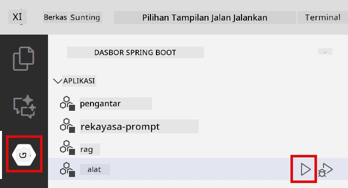
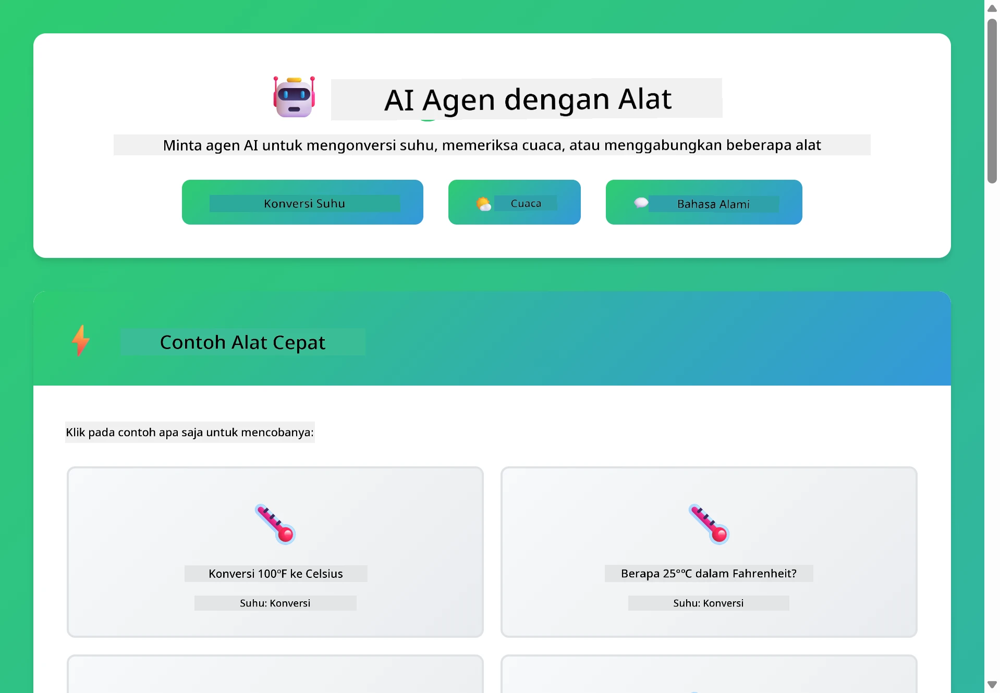
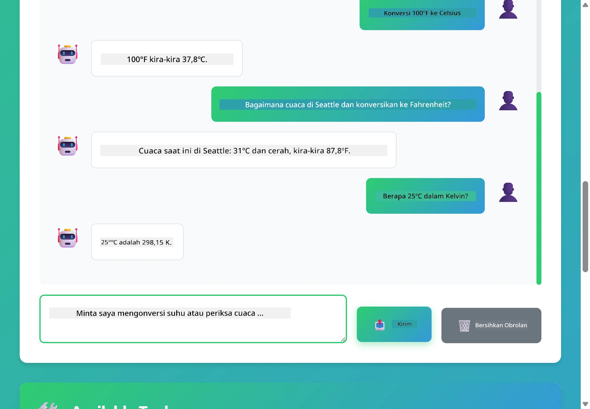

# Modul 04: Agen AI dengan Alat

## Daftar Isi

- [Video Penjelasan](#video-penjelasan)
- [Apa yang Akan Anda Pelajari](#apa-yang-akan-anda-pelajari)
- [Prasyarat](#prasyarat)
- [Memahami Agen AI dengan Alat](#memahami-agen-ai-dengan-alat)
- [Cara Kerja Pemanggilan Alat](#cara-kerja-pemanggilan-alat)
  - [Definisi Alat](#definisi-alat)
  - [Pengambilan Keputusan](#pengambilan-keputusan)
  - [Eksekusi](#eksekusi)
  - [Pembuatan Respons](#pembuatan-respons)
  - [Arsitektur: Spring Boot Auto-Wiring](#arsitektur-spring-boot-auto-wiring)
- [Rangkaian Alat](#rangkaian-alat)
- [Jalankan Aplikasi](#jalankan-aplikasi)
- [Menggunakan Aplikasi](#menggunakan-aplikasi)
  - [Coba Penggunaan Alat Sederhana](#coba-penggunaan-alat-sederhana)
  - [Uji Rangkaian Alat](#uji-rangkaian-alat)
  - [Lihat Alur Percakapan](#lihat-alur-percakapan)
  - [Eksperimen dengan Permintaan Berbeda](#eksperimen-dengan-permintaan-berbeda)
- [Konsep Kunci](#konsep-kunci)
  - [Pola ReAct (Reasoning and Acting)](#pola-react-penalaran-dan-bertindak)
  - [Deskripsi Alat itu Penting](#deskripsi-alat-penting)
  - [Manajemen Sesi](#manajemen-sesi)
  - [Penanganan Kesalahan](#penanganan-error)
- [Alat yang Tersedia](#alat-yang-tersedia)
- [Kapan Menggunakan Agen Berbasis Alat](#kapan-menggunakan-agen-berbasis-alat)
- [Alat vs RAG](#alat-vs-rag)
- [Langkah Berikutnya](#langkah-berikutnya)

## Video Penjelasan

Tonton sesi langsung ini yang menjelaskan cara memulai dengan modul ini:

<a href="https://www.youtube.com/watch?v=O_J30kZc0rw"></a>

## Apa yang Akan Anda Pelajari

Sampai saat ini, Anda telah belajar cara berkomunikasi dengan AI, menyusun prompt secara efektif, dan menghubungkan respons dengan dokumen Anda. Namun masih ada keterbatasan mendasar: model bahasa hanya dapat menghasilkan teks. Mereka tidak dapat memeriksa cuaca, melakukan perhitungan, mengquery basis data, atau berinteraksi dengan sistem eksternal.

Alat mengubah ini. Dengan memberikan model akses ke fungsi yang dapat dipanggilnya, Anda mengubahnya dari generator teks menjadi agen yang dapat melakukan tindakan. Model memutuskan kapan membutuhkan alat, alat mana yang digunakan, dan parameter apa yang diberikan. Kode Anda mengeksekusi fungsi tersebut dan mengembalikan hasilnya. Model menggabungkan hasil tersebut ke dalam responsnya.

## Prasyarat

- Menyelesaikan [Modul 01 - Pengenalan](../01-introduction/README.md) (sumber daya Azure OpenAI sudah diterapkan)
- Disarankan telah menyelesaikan modul sebelumnya (modul ini mengacu pada [konsep RAG dari Modul 03](../03-rag/README.md) dalam perbandingan Alat vs RAG)
- File `.env` di direktori root dengan kredensial Azure (dibuat oleh `azd up` di Modul 01)

> **Catatan:** Jika Anda belum menyelesaikan Modul 01, ikuti instruksi penerapan di sana terlebih dahulu.

## Memahami Agen AI dengan Alat

> **📝 Catatan:** Istilah "agen" dalam modul ini merujuk pada asisten AI yang ditingkatkan dengan kemampuan pemanggilan alat. Ini berbeda dengan pola **Agentic AI** (agen otonom dengan perencanaan, memori, dan penalaran multi-langkah) yang akan kami bahas di [Modul 05: MCP](../05-mcp/README.md).

Tanpa alat, model bahasa hanya dapat menghasilkan teks dari data pelatihannya. Tanyakan tentang cuaca terkini, dan dia harus menebak. Berikan alat, dan model dapat memanggil API cuaca, melakukan perhitungan, atau mengquery basis data — lalu memasukkan hasil nyata itu ke dalam responsnya.


*Tanpa alat model hanya bisa menebak — dengan alat model dapat memanggil API, melakukan perhitungan, dan mengembalikan data waktu nyata.*

Agen AI dengan alat mengikuti pola **Reasoning and Acting (ReAct)**. Model tidak hanya merespons — ia berpikir tentang apa yang dibutuhkannya, bertindak dengan memanggil alat, mengamati hasilnya, lalu memutuskan apakah perlu bertindak lagi atau memberikan jawaban akhir:

1. **Reason** — Agen menganalisis pertanyaan pengguna dan menentukan informasi yang dibutuhkan
2. **Act** — Agen memilih alat yang tepat, menghasilkan parameter yang benar, dan memanggilnya
3. **Observe** — Agen menerima keluaran alat dan mengevaluasi hasilnya
4. **Repeat or Respond** — Jika data lebih dibutuhkan, agen mengulangi; jika tidak, menyusun jawaban dalam bahasa alami


*Siklus ReAct — agen berpikir tentang apa yang harus dilakukan, bertindak dengan memanggil alat, mengamati hasilnya, dan mengulangi sampai dapat memberikan jawaban akhir.*

Ini terjadi secara otomatis. Anda mendefinisikan alat dan deskripsinya. Model yang menangani pengambilan keputusan tentang kapan dan bagaimana menggunakannya.

## Cara Kerja Pemanggilan Alat

### Definisi Alat

[WeatherTool.java](../../../04-tools/src/main/java/com/example/langchain4j/agents/tools/WeatherTool.java) | [TemperatureTool.java](../../../04-tools/src/main/java/com/example/langchain4j/agents/tools/TemperatureTool.java)

Anda mendefinisikan fungsi dengan deskripsi jelas dan spesifikasi parameter. Model melihat deskripsi ini dalam sistem prompt-nya dan mengerti apa fungsi tiap alat.

```java
@Component
public class WeatherTool {
    
    @Tool("Get the current weather for a location")
    public String getCurrentWeather(@P("Location name") String location) {
        // Logika pencarian cuaca Anda
        return "Weather in " + location + ": 22°C, cloudy";
    }
}

@AiService
public interface Assistant {
    String chat(@MemoryId String sessionId, @UserMessage String message);
}

// Asisten secara otomatis terhubung oleh Spring Boot dengan:
// - Bean ChatModel
// - Semua metode @Tool dari kelas @Component
// - ChatMemoryProvider untuk manajemen sesi
```
  
Diagram di bawah ini memecah setiap anotasi dan menunjukkan bagaimana setiap bagian membantu AI memahami kapan memanggil alat dan argumen apa yang harus dikirim:


*Anatomi definisi alat — @Tool memberitahu AI kapan menggunakannya, @P mendeskripsikan tiap parameter, dan @AiService menghubungkan semuanya saat startup.*

> **🤖 Coba dengan [GitHub Copilot](https://github.com/features/copilot) Chat:** Buka [`WeatherTool.java`](../../../04-tools/src/main/java/com/example/langchain4j/agents/tools/WeatherTool.java) dan tanyakan:  
> - "Bagaimana saya mengintegrasikan API cuaca nyata seperti OpenWeatherMap alih-alih data tiruan?"  
> - "Apa yang membuat deskripsi alat yang bagus agar AI menggunakannya dengan benar?"  
> - "Bagaimana menangani kesalahan API dan batas panggilan dalam implementasi alat?"

### Pengambilan Keputusan

Ketika pengguna bertanya "Bagaimana cuaca di Seattle?", model tidak memilih alat secara acak. Ia membandingkan niat pengguna dengan setiap deskripsi alat yang tersedia, memberikan skor relevansi, lalu memilih yang paling sesuai. Model kemudian membuat panggilan fungsi terstruktur dengan parameter yang benar — dalam kasus ini, mengatur `location` ke `"Seattle"`.

Jika tidak ada alat yang cocok dengan permintaan pengguna, model kembali menjawab berdasarkan pengetahuannya sendiri. Jika ada beberapa alat yang cocok, ia memilih yang paling spesifik.


*Model mengevaluasi setiap alat yang tersedia terhadap niat pengguna dan memilih yang paling tepat — ini sebabnya menulis deskripsi alat yang jelas dan spesifik penting.*

### Eksekusi

[AgentService.java](../../../04-tools/src/main/java/com/example/langchain4j/agents/service/AgentService.java)

Spring Boot secara otomatis menghubungkan interface deklaratif `@AiService` dengan semua alat yang terdaftar, dan LangChain4j mengeksekusi panggilan alat secara otomatis. Di balik layar, panggilan alat lengkap melalui enam tahap — dari pertanyaan bahasa alami pengguna hingga jawaban dalam bahasa alami kembali:


*Alur ujung ke ujung — pengguna menanyakan pertanyaan, model memilih alat, LangChain4j mengeksekusi, dan model menggabungkan hasilnya menjadi respons alami.*

Di balik layar, `AiServices` menjalankan loop pemanggilan alat yang sama untuk alat apa pun — di sini digambarkan dengan kalkulator sederhana. Diagram urutan di bawah menunjukkan persis apa yang terjadi:


*Loop pemanggilan alat — `AiServices` mengirim pesan dan skema alat ke LLM, LLM membalas dengan panggilan fungsi seperti `add(42, 58)`, LangChain4j mengeksekusi metode `Calculator` secara lokal, dan memberikan hasil kembali untuk jawaban akhir.*

> **🤖 Coba dengan [GitHub Copilot](https://github.com/features/copilot) Chat:** Buka [`AgentService.java`](../../../04-tools/src/main/java/com/example/langchain4j/agents/service/AgentService.java) dan tanyakan:  
> - "Bagaimana pola ReAct bekerja dan mengapa efektif untuk agen AI?"  
> - "Bagaimana agen memutuskan alat mana yang digunakan dan dalam urutan apa?"  
> - "Apa yang terjadi jika eksekusi alat gagal - bagaimana cara menangani kesalahan dengan kuat?"

### Pembuatan Respons

Model menerima data cuaca dan memformatnya menjadi jawaban bahasa alami untuk pengguna.

### Arsitektur: Spring Boot Auto-Wiring

Modul ini menggunakan integrasi Spring Boot LangChain4j dengan interface deklaratif `@AiService`. Saat startup, Spring Boot menemukan setiap `@Component` yang berisi metode `@Tool`, bean `ChatModel` Anda, dan `ChatMemoryProvider` — lalu menghubungkan semuanya menjadi interface `Assistant` tunggal tanpa kode boilerplate.


*Interface @AiService mengikat ChatModel, komponen alat, dan penyedia memori — Spring Boot menangani penghubungan semuanya secara otomatis.*

Berikut siklus hidup permintaan lengkap dalam diagram urutan — dari permintaan HTTP melalui controller, service, dan proxy auto-wired, sampai eksekusi alat dan kembali:


*Siklus hidup permintaan Spring Boot lengkap — permintaan HTTP mengalir melalui controller dan service ke proxy Assistant auto-wired, yang mengorkestrasi LLM dan pemanggilan alat secara otomatis.*

Manfaat utama pendekatan ini:

- **Spring Boot auto-wiring** — ChatModel dan alat disuntikkan otomatis  
- **Pola @MemoryId** — Manajemen memori berbasis sesi otomatis  
- **Instansi tunggal** — Assistant dibuat sekali dan digunakan ulang untuk performa baik  
- **Eksekusi tipe-safenya** — Metode Java dipanggil langsung dengan konversi tipe  
- **Orkestrasi multi-langkah** — Menangani rangkaian alat secara otomatis  
- **Nol boilerplate** — Tanpa panggilan manual `AiServices.builder()` atau HashMap memori  

Pendekatan alternatif (manual `AiServices.builder()`) memerlukan kode lebih banyak dan kehilangan manfaat integrasi Spring Boot.

## Rangkaian Alat

**Rangkaian Alat** — Kekuatan sebenarnya dari agen berbasis alat terlihat saat satu pertanyaan memerlukan banyak alat. Tanyakan "Bagaimana cuaca di Seattle dalam Fahrenheit?" dan agen secara otomatis menghubungkan dua alat: pertama memanggil `getCurrentWeather` untuk mendapatkan suhu dalam Celsius, kemudian meneruskan nilai itu ke `celsiusToFahrenheit` untuk konversi — semua dalam satu putaran percakapan.


*Rangkaian alat dalam aksi — agen memanggil getCurrentWeather terlebih dahulu, lalu memasukkan hasil Celsius ke celsiusToFahrenheit, dan memberi jawaban gabungan.*

**Kegagalan yang Elegan** — Minta cuaca di kota yang tidak ada dalam data tiruan. Alat mengembalikan pesan kesalahan, dan AI menjelaskan bahwa ia tidak bisa membantu daripada aplikasi langsung crash. Alat gagal dengan aman. Diagram di bawah membandingkan dua pendekatan — dengan penanganan kesalahan yang tepat, agen menangkap pengecualian dan menjawab dengan penjelasan yang membantu, sedangkan tanpa itu aplikasi langsung crash:


*Saat alat gagal, agen menangkap kesalahan dan merespons dengan penjelasan yang membantu daripada mengalami crash.*

Ini terjadi dalam satu putaran percakapan. Agen mengorkestrasi banyak panggilan alat secara mandiri.

## Jalankan Aplikasi

**Verifikasi penerapan:**

Pastikan file `.env` ada di direktori root dengan kredensial Azure (dibuat selama Modul 01). Jalankan ini dari direktori modul (`04-tools/`):

**Bash:**  
```bash
cat ../.env  # Harus menampilkan AZURE_OPENAI_ENDPOINT, API_KEY, DEPLOYMENT
```
  
**PowerShell:**  
```powershell
Get-Content ..\.env  # Harus menampilkan AZURE_OPENAI_ENDPOINT, API_KEY, DEPLOYMENT
```
  
**Mulai aplikasi:**

> **Catatan:** Jika Anda sudah memulai semua aplikasi menggunakan `./start-all.sh` dari direktori root (seperti dijelaskan di Modul 01), modul ini sudah berjalan pada port 8084. Anda dapat melewati perintah mulai di bawah dan langsung buka http://localhost:8084.

**Opsi 1: Menggunakan Spring Boot Dashboard (Direkomendasikan untuk pengguna VS Code)**

Kontainer pengembangan mencakup ekstensi Spring Boot Dashboard, yang menyediakan antarmuka visual untuk mengelola semua aplikasi Spring Boot. Anda dapat menemukannya di Activity Bar di sisi kiri VS Code (cari ikon Spring Boot).

Dari Spring Boot Dashboard, Anda bisa:  
- Melihat semua aplikasi Spring Boot yang tersedia di workspace  
- Memulai/menyerahkan aplikasi dengan satu klik  
- Melihat log aplikasi secara real-time  
- Memantau status aplikasi

Cukup klik tombol putar di sebelah "tools" untuk memulai modul ini, atau mulai semua modul sekaligus.

Berikut tampilan Spring Boot Dashboard di VS Code:


*Spring Boot Dashboard di VS Code — mulai, berhenti, dan monitor semua modul dari satu tempat*

**Opsi 2: Menggunakan skrip shell**

Mulai semua aplikasi web (modul 01-04):

**Bash:**
```bash
cd ..  # Dari direktori root
./start-all.sh
```

**PowerShell:**
```powershell
cd ..  # Dari direktori root
.\start-all.ps1
```

Atau mulai hanya modul ini:

**Bash:**
```bash
cd 04-tools
./start.sh
```

**PowerShell:**
```powershell
cd 04-tools
.\start.ps1
```

Kedua skrip secara otomatis memuat variabel lingkungan dari file `.env` di root dan akan membangun JAR jika belum ada.

> **Catatan:** Jika Anda lebih suka membangun semua modul secara manual sebelum memulai:
>
> **Bash:**
> ```bash
> cd ..  # Go to root directory
> mvn clean package -DskipTests
> ```
>
> **PowerShell:**
> ```powershell
> cd ..  # Go to root directory
> mvn clean package -DskipTests
> ```

Buka http://localhost:8084 di browser Anda.

**Untuk berhenti:**

**Bash:**
```bash
./stop.sh  # Modul ini saja
# Atau
cd .. && ./stop-all.sh  # Semua modul
```

**PowerShell:**
```powershell
.\stop.ps1  # Hanya modul ini
# Atau
cd ..; .\stop-all.ps1  # Semua modul
```

## Menggunakan Aplikasi

Aplikasi menyediakan antarmuka web di mana Anda dapat berinteraksi dengan agen AI yang memiliki akses ke alat cuaca dan konversi suhu. Berikut tampilan antarmukanya — termasuk contoh cepat dan panel obrolan untuk mengirim permintaan:

<a href="images/tools-homepage.png"></a>

*Antarmuka Alat Agen AI - contoh cepat dan antarmuka obrolan untuk berinteraksi dengan alat*

### Coba Penggunaan Alat Sederhana

Mulai dengan permintaan sederhana: "Konversi 100 derajat Fahrenheit ke Celsius". Agen mengenali bahwa ia memerlukan alat konversi suhu, memanggilnya dengan parameter yang tepat, dan mengembalikan hasilnya. Perhatikan betapa alami cara ini - Anda tidak perlu menentukan alat mana yang digunakan atau bagaimana memanggilnya.

### Uji Rangkaian Alat

Sekarang coba sesuatu yang lebih kompleks: "Bagaimana cuaca di Seattle dan konversikan ke Fahrenheit?" Saksikan bagaimana agen mengerjakan ini dalam beberapa langkah. Pertama mengambil cuaca (yang mengembalikan dalam Celsius), mengenali perlu mengonversi ke Fahrenheit, memanggil alat konversi, dan menggabungkan kedua hasil menjadi satu respons.

### Lihat Alur Percakapan

Antarmuka obrolan menyimpan riwayat percakapan, memungkinkan Anda melakukan interaksi berputar-putar. Anda bisa melihat semua pertanyaan dan jawaban sebelumnya, membuatnya mudah melacak percakapan dan memahami bagaimana agen membangun konteks selama beberapa pertukaran.

<a href="images/tools-conversation-demo.png"></a>

*Percakapan multi-putar yang menunjukkan konversi sederhana, pencarian cuaca, dan rangkaian alat*

### Eksperimen dengan Permintaan Berbeda

Coba berbagai kombinasi:
- Pencarian cuaca: "Bagaimana cuaca di Tokyo?"
- Konversi suhu: "Berapa 25°C dalam Kelvin?"
- Pertanyaan gabungan: "Periksa cuaca di Paris dan beri tahu jika di atas 20°C"

Perhatikan bagaimana agen mengartikan bahasa alami dan memetakan ke panggilan alat yang sesuai.

## Konsep Kunci

### Pola ReAct (Penalaran dan Bertindak)

Agen bergantian antara penalaran (memutuskan apa yang harus dilakukan) dan bertindak (menggunakan alat). Pola ini memungkinkan pemecahan masalah secara mandiri daripada hanya merespon instruksi.

### Deskripsi Alat Penting

Kualitas deskripsi alat Anda langsung memengaruhi seberapa baik agen menggunakannya. Deskripsi yang jelas dan spesifik membantu model memahami kapan dan bagaimana memanggil setiap alat.

### Manajemen Sesi

Anotasi `@MemoryId` memungkinkan manajemen memori berbasis sesi secara otomatis. Setiap ID sesi mendapatkan instansi `ChatMemory` yang dikelola oleh bean `ChatMemoryProvider`, sehingga banyak pengguna dapat berinteraksi dengan agen secara bersamaan tanpa percakapan tercampur. Diagram berikut menunjukkan bagaimana banyak pengguna diarahkan ke penyimpanan memori terisolasi berdasarkan ID sesi mereka:


*Setiap ID sesi memetakan ke riwayat percakapan yang terisolasi — pengguna tidak pernah melihat pesan satu sama lain.*

### Penanganan Error

Alat dapat gagal — API timeout, parameter mungkin tidak valid, layanan eksternal mati. Agen produksi memerlukan penanganan error agar model dapat menjelaskan masalah atau mencoba alternatif daripada aplikasi keseluruhan crash. Ketika alat melempar pengecualian, LangChain4j menangkapnya dan mengirim pesan error kembali ke model, yang kemudian dapat menjelaskan masalah dalam bahasa alami.

## Alat yang Tersedia

Diagram di bawah ini menunjukkan ekosistem luas alat yang dapat Anda bangun. Modul ini menampilkan alat cuaca dan suhu, tetapi pola `@Tool` yang sama berlaku untuk metode Java manapun — dari kueri database hingga pemrosesan pembayaran.


*Metode Java manapun yang dianotasi dengan @Tool tersedia untuk AI — pola ini meluas ke database, API, email, operasi file, dan lainnya.*

## Kapan Menggunakan Agen Berbasis Alat

Tidak semua permintaan membutuhkan alat. Keputusan tergantung apakah AI perlu berinteraksi dengan sistem eksternal atau dapat menjawab dari pengetahuannya sendiri. Panduan berikut merangkum kapan alat memberikan nilai dan kapan tidak diperlukan:


*Panduan singkat — alat untuk data real-time, kalkulasi, dan aksi; pengetahuan umum dan tugas kreatif tidak membutuhkannya.*

## Alat vs RAG

Modul 03 dan 04 sama-sama memperluas kemampuan AI, tetapi dengan cara fundamental yang berbeda. RAG memberi model akses ke **pengetahuan** dengan mengambil dokumen. Alat memberi model kemampuan untuk mengambil **aksi** dengan memanggil fungsi. Diagram berikut membandingkan kedua pendekatan — dari cara kerja setiap alur hingga trade-off di antara keduanya:


*RAG mengambil informasi dari dokumen statis — Alat menjalankan aksi dan mengambil data dinamis real-time. Banyak sistem produksi menggabungkan keduanya.*

Dalam praktiknya, banyak sistem produksi menggabungkan kedua pendekatan: RAG untuk mendasari jawaban dalam dokumentasi Anda, dan Alat untuk mengambil data langsung atau melakukan operasi.

## Langkah Berikutnya

**Modul Berikutnya:** [05-mcp - Model Context Protocol (MCP)](../05-mcp/README.md)

---

**Navigasi:** [← Sebelumnya: Modul 03 - RAG](../03-rag/README.md) | [Kembali ke Beranda](../README.md) | [Selanjutnya: Modul 05 - MCP →](../05-mcp/README.md)

---

<!-- CO-OP TRANSLATOR DISCLAIMER START -->
**Penafian**:
Dokumen ini telah diterjemahkan menggunakan layanan terjemahan AI [Co-op Translator](https://github.com/Azure/co-op-translator). Meskipun kami berupaya untuk mencapai akurasi, harap diketahui bahwa terjemahan otomatis mungkin mengandung kesalahan atau ketidakakuratan. Dokumen asli dalam bahasa aslinya harus dianggap sebagai sumber yang sah. Untuk informasi penting, disarankan menggunakan terjemahan profesional oleh manusia. Kami tidak bertanggung jawab atas kesalahpahaman atau penafsiran yang keliru yang timbul dari penggunaan terjemahan ini.
<!-- CO-OP TRANSLATOR DISCLAIMER END -->