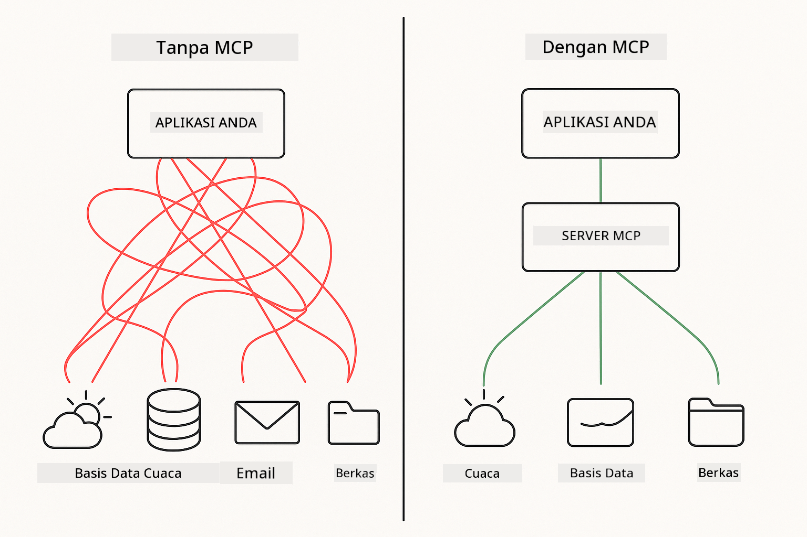
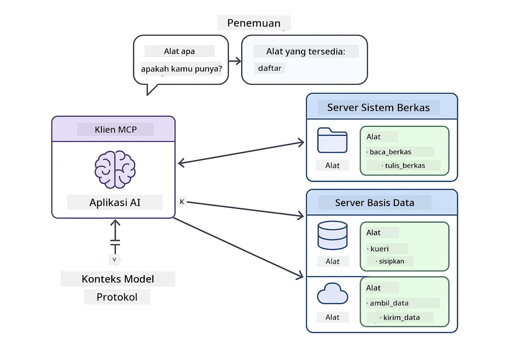

<!--
CO_OP_TRANSLATOR_METADATA:
{
  "original_hash": "c25ec1f10ef156c53e190cdf8b0711ab",
  "translation_date": "2025-12-13T17:59:47+00:00",
  "source_file": "05-mcp/README.md",
  "language_code": "id"
}
-->
# Modul 05: Model Context Protocol (MCP)

## Daftar Isi

- [Apa yang Akan Anda Pelajari](../../../05-mcp)
- [Memahami MCP](../../../05-mcp)
- [Cara Kerja MCP](../../../05-mcp)
  - [Arsitektur Server-Klien](../../../05-mcp)
  - [Penemuan Alat](../../../05-mcp)
  - [Mekanisme Transport](../../../05-mcp)
- [Prasyarat](../../../05-mcp)
- [Apa yang Dicakup Modul Ini](../../../05-mcp)
- [Mulai Cepat](../../../05-mcp)
  - [Contoh 1: Kalkulator Jarak Jauh (Streamable HTTP)](../../../05-mcp)
  - [Contoh 2: Operasi Berkas (Stdio)](../../../05-mcp)
  - [Contoh 3: Analisis Git (Docker)](../../../05-mcp)
- [Konsep Kunci](../../../05-mcp)
  - [Pemilihan Transport](../../../05-mcp)
  - [Penemuan Alat](../../../05-mcp)
  - [Manajemen Sesi](../../../05-mcp)
  - [Pertimbangan Lintas Platform](../../../05-mcp)
- [Kapan Menggunakan MCP](../../../05-mcp)
- [Ekosistem MCP](../../../05-mcp)
- [Selamat!](../../../05-mcp)
  - [Apa Selanjutnya?](../../../05-mcp)
- [Pemecahan Masalah](../../../05-mcp)

## Apa yang Akan Anda Pelajari

Anda telah membangun AI percakapan, menguasai prompt, mendasarkan respons pada dokumen, dan membuat agen dengan alat. Namun semua alat itu dibuat khusus untuk aplikasi spesifik Anda. Bagaimana jika Anda bisa memberikan AI Anda akses ke ekosistem alat standar yang bisa dibuat dan dibagikan siapa saja?

Model Context Protocol (MCP) menyediakan tepat itu - cara standar bagi aplikasi AI untuk menemukan dan menggunakan alat eksternal. Alih-alih menulis integrasi khusus untuk setiap sumber data atau layanan, Anda terhubung ke server MCP yang mengekspos kapabilitas mereka dalam format yang konsisten. Agen AI Anda kemudian dapat menemukan dan menggunakan alat ini secara otomatis.



*Sebelum MCP: Integrasi titik-ke-titik yang kompleks. Setelah MCP: Satu protokol, kemungkinan tak terbatas.*

## Memahami MCP

MCP memecahkan masalah mendasar dalam pengembangan AI: setiap integrasi adalah khusus. Ingin mengakses GitHub? Kode khusus. Ingin membaca berkas? Kode khusus. Ingin mengquery database? Kode khusus. Dan tidak ada integrasi ini yang bekerja dengan aplikasi AI lain.

MCP menstandarisasi ini. Server MCP mengekspos alat dengan deskripsi dan skema yang jelas. Klien MCP mana pun dapat terhubung, menemukan alat yang tersedia, dan menggunakannya. Bangun sekali, gunakan di mana saja.



*Arsitektur Model Context Protocol - penemuan dan eksekusi alat yang distandarisasi*

## Cara Kerja MCP

**Arsitektur Server-Klien**

MCP menggunakan model klien-server. Server menyediakan alat - membaca berkas, mengquery database, memanggil API. Klien (aplikasi AI Anda) terhubung ke server dan menggunakan alat mereka.

**Penemuan Alat**

Saat klien Anda terhubung ke server MCP, ia bertanya "Alat apa yang Anda miliki?" Server merespons dengan daftar alat yang tersedia, masing-masing dengan deskripsi dan skema parameter. Agen AI Anda kemudian dapat memutuskan alat mana yang akan digunakan berdasarkan permintaan pengguna.

**Mekanisme Transport**

MCP mendefinisikan dua mekanisme transport: HTTP untuk server jarak jauh, Stdio untuk proses lokal (termasuk kontainer Docker):


*Mekanisme transport MCP: HTTP untuk server jarak jauh, Stdio untuk proses lokal (termasuk kontainer Docker)*

**Streamable HTTP** - [StreamableHttpDemo.java](../../../05-mcp/src/main/java/com/example/langchain4j/mcp/StreamableHttpDemo.java)

Untuk server jarak jauh. Aplikasi Anda membuat permintaan HTTP ke server yang berjalan di jaringan. Menggunakan Server-Sent Events untuk komunikasi real-time.

```java
McpTransport httpTransport = new StreamableHttpMcpTransport.Builder()
    .url("http://localhost:3001/mcp")
    .timeout(Duration.ofSeconds(60))
    .logRequests(true)
    .logResponses(true)
    .build();
```

> **🤖 Coba dengan [GitHub Copilot](https://github.com/features/copilot) Chat:** Buka [`StreamableHttpDemo.java`](../../../05-mcp/src/main/java/com/example/langchain4j/mcp/StreamableHttpDemo.java) dan tanyakan:
> - "Bagaimana MCP berbeda dari integrasi alat langsung seperti di Modul 04?"
> - "Apa manfaat menggunakan MCP untuk berbagi alat antar aplikasi?"
> - "Bagaimana saya menangani kegagalan koneksi atau timeout ke server MCP?"

**Stdio** - [StdioTransportDemo.java](../../../05-mcp/src/main/java/com/example/langchain4j/mcp/StdioTransportDemo.java)

Untuk proses lokal. Aplikasi Anda menjalankan server sebagai subprocess dan berkomunikasi melalui input/output standar. Berguna untuk akses sistem berkas atau alat baris perintah.

```java
McpTransport stdioTransport = new StdioMcpTransport.Builder()
    .command(List.of(
        npmCmd, "exec",
        "@modelcontextprotocol/server-filesystem@0.6.2",
        resourcesDir
    ))
    .logEvents(false)
    .build();
```

> **🤖 Coba dengan [GitHub Copilot](https://github.com/features/copilot) Chat:** Buka [`StdioTransportDemo.java`](../../../05-mcp/src/main/java/com/example/langchain4j/mcp/StdioTransportDemo.java) dan tanyakan:
> - "Bagaimana transport Stdio bekerja dan kapan saya harus menggunakannya dibanding HTTP?"
> - "Bagaimana LangChain4j mengelola siklus hidup proses server MCP yang dijalankan?"
> - "Apa implikasi keamanan memberikan AI akses ke sistem berkas?"

**Docker (menggunakan Stdio)** - [GitRepositoryAnalyzer.java](../../../05-mcp/src/main/java/com/example/langchain4j/mcp/GitRepositoryAnalyzer.java)

Untuk layanan terkontainerisasi. Menggunakan transport stdio untuk berkomunikasi dengan kontainer Docker melalui `docker run`. Baik untuk dependensi kompleks atau lingkungan terisolasi.

```java
McpTransport dockerTransport = new StdioMcpTransport.Builder()
    .command(List.of(
        "docker", "run",
        "-e", "GITHUB_PERSONAL_ACCESS_TOKEN=" + System.getenv("GITHUB_TOKEN"),
        "-v", volumeMapping,
        "-i", "mcp/git"
    ))
    .logEvents(true)
    .build();
```

> **🤖 Coba dengan [GitHub Copilot](https://github.com/features/copilot) Chat:** Buka [`GitRepositoryAnalyzer.java`](../../../05-mcp/src/main/java/com/example/langchain4j/mcp/GitRepositoryAnalyzer.java) dan tanyakan:
> - "Bagaimana transport Docker mengisolasi server MCP dan apa manfaatnya?"
> - "Bagaimana saya mengonfigurasi volume mount untuk berbagi data antara host dan kontainer MCP?"
> - "Apa praktik terbaik mengelola siklus hidup server MCP berbasis Docker di produksi?"

## Menjalankan Contoh

### Prasyarat

- Java 21+, Maven 3.9+
- Node.js 16+ dan npm (untuk server MCP)
- **Docker Desktop** - Harus **BERJALAN** untuk Contoh 3 (tidak hanya terpasang)
- Token Akses Pribadi GitHub dikonfigurasi di file `.env` (dari Modul 00)

> **Catatan:** Jika Anda belum mengatur token GitHub Anda, lihat [Modul 00 - Mulai Cepat](../00-quick-start/README.md) untuk petunjuk.

> **⚠️ Pengguna Docker:** Sebelum menjalankan Contoh 3, pastikan Docker Desktop berjalan dengan `docker ps`. Jika Anda melihat kesalahan koneksi, mulai Docker Desktop dan tunggu sekitar 30 detik untuk inisialisasi.

## Mulai Cepat

**Menggunakan VS Code:** Klik kanan pada file demo mana pun di Explorer dan pilih **"Run Java"**, atau gunakan konfigurasi peluncuran dari panel Run and Debug (pastikan Anda sudah menambahkan token ke file `.env` terlebih dahulu).

**Menggunakan Maven:** Alternatifnya, Anda dapat menjalankan dari baris perintah dengan contoh di bawah.

**⚠️ Penting:** Beberapa contoh memiliki prasyarat (seperti memulai server MCP atau membangun image Docker). Periksa persyaratan setiap contoh sebelum menjalankan.

### Contoh 1: Kalkulator Jarak Jauh (Streamable HTTP)

Ini mendemonstrasikan integrasi alat berbasis jaringan.

**⚠️ Prasyarat:** Anda harus memulai server MCP terlebih dahulu (lihat Terminal 1 di bawah).

**Terminal 1 - Mulai server MCP:**

**Bash:**
```bash
git clone https://github.com/modelcontextprotocol/servers.git
cd servers/src/everything
npm install
node dist/streamableHttp.js
```

**PowerShell:**
```powershell
git clone https://github.com/modelcontextprotocol/servers.git
cd servers/src/everything
npm install
node dist/streamableHttp.js
```

**Terminal 2 - Jalankan contoh:**

**Menggunakan VS Code:** Klik kanan pada `StreamableHttpDemo.java` dan pilih **"Run Java"**.

**Menggunakan Maven:**

**Bash:**
```bash
export GITHUB_TOKEN=your_token_here
cd 05-mcp
mvn compile exec:java -Dexec.mainClass=com.example.langchain4j.mcp.StreamableHttpDemo
```

**PowerShell:**
```powershell
$env:GITHUB_TOKEN=your_token_here
cd 05-mcp
mvn --% compile exec:java -Dexec.mainClass=com.example.langchain4j.mcp.StreamableHttpDemo
```

Amati agen menemukan alat yang tersedia, lalu gunakan kalkulator untuk melakukan penjumlahan.

### Contoh 2: Operasi Berkas (Stdio)

Ini mendemonstrasikan alat berbasis subprocess lokal.

**✅ Tidak perlu prasyarat** - server MCP dijalankan otomatis.

**Menggunakan VS Code:** Klik kanan pada `StdioTransportDemo.java` dan pilih **"Run Java"**.

**Menggunakan Maven:**

**Bash:**
```bash
export GITHUB_TOKEN=your_token_here
cd 05-mcp
mvn compile exec:java -Dexec.mainClass=com.example.langchain4j.mcp.StdioTransportDemo
```

**PowerShell:**
```powershell
$env:GITHUB_TOKEN=your_token_here
cd 05-mcp
mvn --% compile exec:java -Dexec.mainClass=com.example.langchain4j.mcp.StdioTransportDemo
```

Aplikasi menjalankan server MCP sistem berkas secara otomatis dan membaca berkas lokal. Perhatikan bagaimana manajemen subprocess ditangani untuk Anda.

**Output yang diharapkan:**
```
Assistant response: The content of the file is "Kaboom!".
```

### Contoh 3: Analisis Git (Docker)

Ini mendemonstrasikan server alat terkontainerisasi.

**⚠️ Prasyarat:** 
1. **Docker Desktop harus BERJALAN** (tidak hanya terpasang)
2. **Pengguna Windows:** Mode WSL 2 direkomendasikan (Pengaturan Docker Desktop → General → "Use the WSL 2 based engine"). Mode Hyper-V memerlukan konfigurasi berbagi berkas manual.
3. Anda harus membangun image Docker terlebih dahulu (lihat Terminal 1 di bawah)

**Verifikasi Docker berjalan:**

**Bash:**
```bash
docker ps  # Harus menampilkan daftar kontainer, bukan kesalahan
```

**PowerShell:**
```powershell
docker ps  # Harus menampilkan daftar kontainer, bukan kesalahan
```

Jika Anda melihat kesalahan seperti "Cannot connect to Docker daemon" atau "The system cannot find the file specified", mulai Docker Desktop dan tunggu inisialisasi (~30 detik).

**Pemecahan Masalah:**
- Jika AI melaporkan repositori kosong atau tidak ada berkas, volume mount (`-v`) tidak berfungsi.
- **Pengguna Windows Hyper-V:** Tambahkan direktori proyek ke Pengaturan Docker Desktop → Resources → File sharing, lalu restart Docker Desktop.
- **Solusi yang direkomendasikan:** Beralih ke mode WSL 2 untuk berbagi berkas otomatis (Pengaturan → General → aktifkan "Use the WSL 2 based engine").

**Terminal 1 - Bangun image Docker:**

**Bash:**
```bash
cd servers/src/git
docker build -t mcp/git .
```

**PowerShell:**
```powershell
cd servers/src/git
docker build -t mcp/git .
```

**Terminal 2 - Jalankan analyzer:**

**Menggunakan VS Code:** Klik kanan pada `GitRepositoryAnalyzer.java` dan pilih **"Run Java"**.

**Menggunakan Maven:**

**Bash:**
```bash
export GITHUB_TOKEN=your_token_here
cd 05-mcp
mvn compile exec:java -Dexec.mainClass=com.example.langchain4j.mcp.GitRepositoryAnalyzer
```

**PowerShell:**
```powershell
$env:GITHUB_TOKEN=your_token_here
cd 05-mcp
mvn --% compile exec:java -Dexec.mainClass=com.example.langchain4j.mcp.GitRepositoryAnalyzer
```

Aplikasi meluncurkan kontainer Docker, memasang repositori Anda, dan menganalisis struktur serta isi repositori melalui agen AI.

## Konsep Kunci

**Pemilihan Transport**

Pilih berdasarkan lokasi alat Anda:
- Layanan jarak jauh → Streamable HTTP
- Sistem berkas lokal → Stdio
- Dependensi kompleks → Docker

**Penemuan Alat**

Klien MCP secara otomatis menemukan alat yang tersedia saat terhubung. Agen AI Anda melihat deskripsi alat dan memutuskan mana yang digunakan berdasarkan permintaan pengguna.

**Manajemen Sesi**

Transport Streamable HTTP mempertahankan sesi, memungkinkan interaksi stateful dengan server jarak jauh. Transport Stdio dan Docker biasanya stateless.

**Pertimbangan Lintas Platform**

Contoh menangani perbedaan platform secara otomatis (perbedaan perintah Windows vs Unix, konversi path untuk Docker). Ini penting untuk deployment produksi di berbagai lingkungan.

## Kapan Menggunakan MCP

**Gunakan MCP ketika:**
- Anda ingin memanfaatkan ekosistem alat yang sudah ada
- Membangun alat yang akan digunakan banyak aplikasi
- Mengintegrasikan layanan pihak ketiga dengan protokol standar
- Anda perlu mengganti implementasi alat tanpa mengubah kode

**Gunakan alat khusus (Modul 04) ketika:**
- Membangun fungsi aplikasi spesifik
- Performa sangat penting (MCP menambah overhead)
- Alat Anda sederhana dan tidak akan digunakan ulang
- Anda perlu kontrol penuh atas eksekusi


## Ekosistem MCP

Model Context Protocol adalah standar terbuka dengan ekosistem yang berkembang:

- Server MCP resmi untuk tugas umum (sistem berkas, Git, database)
- Server kontribusi komunitas untuk berbagai layanan
- Deskripsi dan skema alat yang distandarisasi
- Kompatibilitas lintas framework (bekerja dengan klien MCP mana pun)

Standarisasi ini berarti alat yang dibuat untuk satu aplikasi AI bekerja dengan aplikasi lain, menciptakan ekosistem kapabilitas bersama.

## Selamat!

Anda telah menyelesaikan kursus LangChain4j untuk Pemula. Anda telah belajar:

- Cara membangun AI percakapan dengan memori (Modul 01)
- Pola rekayasa prompt untuk berbagai tugas (Modul 02)
- Mendasarkan respons pada dokumen dengan RAG (Modul 03)
- Membuat agen AI dengan alat khusus (Modul 04)
- Mengintegrasikan alat standar melalui MCP (Modul 05)

Anda sekarang memiliki dasar untuk membangun aplikasi AI produksi. Konsep yang Anda pelajari berlaku tanpa tergantung framework atau model spesifik - ini pola fundamental dalam rekayasa AI.

### Apa Selanjutnya?

Setelah menyelesaikan modul, jelajahi [Panduan Pengujian](../docs/TESTING.md) untuk melihat konsep pengujian LangChain4j dalam praktik.

**Sumber Resmi:**
- [Dokumentasi LangChain4j](https://docs.langchain4j.dev/) - Panduan lengkap dan referensi API
- [LangChain4j GitHub](https://github.com/langchain4j/langchain4j) - Kode sumber dan contoh
- [Tutorial LangChain4j](https://docs.langchain4j.dev/tutorials/) - Tutorial langkah demi langkah untuk berbagai kasus penggunaan

Terima kasih telah menyelesaikan kursus ini!

---

**Navigasi:** [← Sebelumnya: Modul 04 - Alat](../04-tools/README.md) | [Kembali ke Utama](../README.md)

---

## Pemecahan Masalah

### Sintaks Perintah Maven di PowerShell
**Masalah**: Perintah Maven gagal dengan error `Unknown lifecycle phase ".mainClass=..."`

**Penyebab**: PowerShell mengartikan `=` sebagai operator penugasan variabel, sehingga merusak sintaks properti Maven

**Solusi**: Gunakan operator stop-parsing `--%` sebelum perintah Maven:

**PowerShell:**
```powershell
mvn --% compile exec:java -Dexec.mainClass=com.example.langchain4j.mcp.StreamableHttpDemo
```

**Bash:**
```bash
mvn compile exec:java -Dexec.mainClass=com.example.langchain4j.mcp.StreamableHttpDemo
```

Operator `--%` memberitahu PowerShell untuk meneruskan semua argumen yang tersisa secara literal ke Maven tanpa interpretasi.

### Masalah Koneksi Docker

**Masalah**: Perintah Docker gagal dengan "Cannot connect to Docker daemon" atau "The system cannot find the file specified"

**Penyebab**: Docker Desktop tidak berjalan atau belum sepenuhnya diinisialisasi

**Solusi**: 
1. Mulai Docker Desktop
2. Tunggu sekitar 30 detik untuk inisialisasi penuh
3. Verifikasi dengan `docker ps` (seharusnya menampilkan daftar container, bukan error)
4. Kemudian jalankan contoh Anda

### Mount Volume Docker di Windows

**Masalah**: Analyzer repositori Git melaporkan repositori kosong atau tidak ada file

**Penyebab**: Mount volume (`-v`) tidak berfungsi karena konfigurasi berbagi file

**Solusi**:
- **Direkomendasikan:** Beralih ke mode WSL 2 (Pengaturan Docker Desktop → General → "Use the WSL 2 based engine")
- **Alternatif (Hyper-V):** Tambahkan direktori proyek ke Pengaturan Docker Desktop → Resources → File sharing, lalu restart Docker Desktop

---

<!-- CO-OP TRANSLATOR DISCLAIMER START -->
**Penafian**:  
Dokumen ini telah diterjemahkan menggunakan layanan terjemahan AI [Co-op Translator](https://github.com/Azure/co-op-translator). Meskipun kami berupaya untuk mencapai akurasi, harap diingat bahwa terjemahan otomatis mungkin mengandung kesalahan atau ketidakakuratan. Dokumen asli dalam bahasa aslinya harus dianggap sebagai sumber yang sahih. Untuk informasi penting, disarankan menggunakan terjemahan profesional oleh manusia. Kami tidak bertanggung jawab atas kesalahpahaman atau salah tafsir yang timbul dari penggunaan terjemahan ini.
<!-- CO-OP TRANSLATOR DISCLAIMER END -->