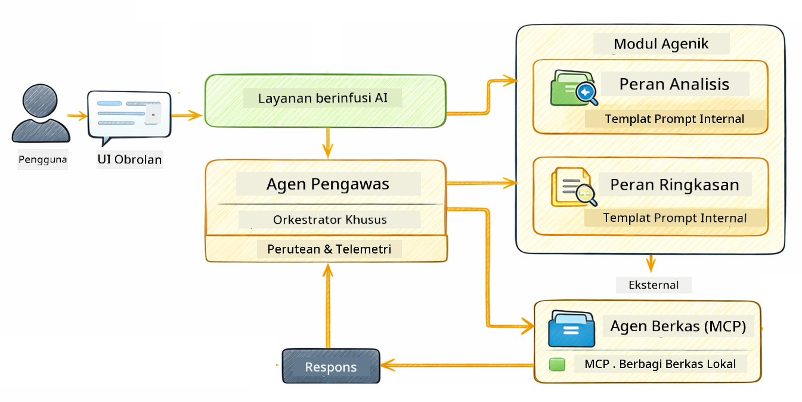

<!--
CO_OP_TRANSLATOR_METADATA:
{
  "original_hash": "f89f4c106d110e4943c055dd1a2f1dff",
  "translation_date": "2025-12-31T02:59:50+00:00",
  "source_file": "05-mcp/README.md",
  "language_code": "id"
}
-->
# Module 05: Model Context Protocol (MCP)

## Table of Contents

- [What You'll Learn](../../../05-mcp)
- [What is MCP?](../../../05-mcp)
- [How MCP Works](../../../05-mcp)
- [The Agentic Module](../../../05-mcp)
- [Running the Examples](../../../05-mcp)
  - [Prerequisites](../../../05-mcp)
- [Quick Start](../../../05-mcp)
  - [File Operations (Stdio)](../../../05-mcp)
  - [Supervisor Agent](../../../05-mcp)
    - [Understanding the Output](../../../05-mcp)
    - [Explanation of Agentic Module Features](../../../05-mcp)
- [Key Concepts](../../../05-mcp)
- [Congratulations!](../../../05-mcp)
  - [What's Next?](../../../05-mcp)

## What You'll Learn

Anda telah membangun AI percakapan, menguasai prompt, membumikan respons dalam dokumen, dan membuat agen dengan alat. Namun semua alat itu dibuat khusus untuk aplikasi Anda. Bagaimana jika Anda dapat memberi AI akses ke ekosistem alat standar yang bisa dibuat dan dibagikan siapa saja? Dalam modul ini, Anda akan belajar cara melakukan hal itu dengan Model Context Protocol (MCP) dan modul agentic LangChain4j. Kami pertama-tama menampilkan pembaca file MCP sederhana dan kemudian menunjukkan bagaimana itu mudah diintegrasikan ke dalam alur kerja agentic tingkat lanjut menggunakan pola Supervisor Agent.

## What is MCP?

Model Context Protocol (MCP) memberikan tepat itu - cara standar bagi aplikasi AI untuk menemukan dan menggunakan alat eksternal. Alih-alih menulis integrasi khusus untuk setiap sumber data atau layanan, Anda menghubungkan ke server MCP yang mengekspos kapabilitas mereka dalam format yang konsisten. Agen AI Anda kemudian dapat menemukan dan menggunakan alat-alat ini secara otomatis.


*Sebelum MCP: Integrasi titik-ke-titik yang kompleks. Setelah MCP: Satu protokol, kemungkinan tak terbatas.*

MCP memecahkan masalah mendasar dalam pengembangan AI: setiap integrasi bersifat kustom. Ingin mengakses GitHub? Kode khusus. Ingin membaca file? Kode khusus. Ingin mengkueri basis data? Kode khusus. Dan tak satu pun dari integrasi ini bekerja dengan aplikasi AI lainnya.

MCP menstandarisasi ini. Server MCP mengekspos alat dengan deskripsi dan skema parameter yang jelas. Klien MCP mana pun dapat terhubung, menemukan alat yang tersedia, dan menggunakannya. Bangun sekali, gunakan di mana-mana.


*Arsitektur Model Context Protocol - penemuan dan eksekusi alat yang distandarisasi*

## How MCP Works

**Server-Client Architecture**

MCP menggunakan model klien-server. Server menyediakan alat - membaca file, mengkueri basis data, memanggil API. Klien (aplikasi AI Anda) terhubung ke server dan menggunakan alat-alatnya.

Untuk menggunakan MCP dengan LangChain4j, tambahkan dependensi Maven ini:

```xml
<dependency>
    <groupId>dev.langchain4j</groupId>
    <artifactId>langchain4j-mcp</artifactId>
    <version>${langchain4j.version}</version>
</dependency>
```

**Tool Discovery**

Saat klien Anda terhubung ke server MCP, ia menanyakan "Alat apa yang kamu miliki?" Server merespons dengan daftar alat yang tersedia, masing-masing dengan deskripsi dan skema parameter. Agen AI Anda kemudian dapat memutuskan alat mana yang akan digunakan berdasarkan permintaan pengguna.

**Transport Mechanisms**

MCP mendukung berbagai mekanisme transport. Modul ini menunjukkan transport Stdio untuk proses lokal:


*Mekanisme transport MCP: HTTP untuk server jarak jauh, Stdio untuk proses lokal*

**Stdio** - [StdioTransportDemo.java](../../../05-mcp/src/main/java/com/example/langchain4j/mcp/StdioTransportDemo.java)

Untuk proses lokal. Aplikasi Anda membuat server sebagai subprocess dan berkomunikasi melalui standard input/output. Berguna untuk akses filesystem atau alat baris perintah.

```java
McpTransport stdioTransport = new StdioMcpTransport.Builder()
    .command(List.of(
        npmCmd, "exec",
        "@modelcontextprotocol/server-filesystem@2025.12.18",
        resourcesDir
    ))
    .logEvents(false)
    .build();
```

> **🤖 Coba dengan [GitHub Copilot](https://github.com/features/copilot) Chat:** Buka [`StdioTransportDemo.java`](../../../05-mcp/src/main/java/com/example/langchain4j/mcp/StdioTransportDemo.java) dan tanyakan:
> - "Bagaimana transport Stdio bekerja dan kapan saya harus menggunakannya dibandingkan HTTP?"
> - "Bagaimana LangChain4j mengelola siklus hidup proses server MCP yang dibuat?"
> - "Apa implikasi keamanan dari memberi AI akses ke sistem file?"

## The Agentic Module

Sementara MCP menyediakan alat yang distandarisasi, modul **agentic** LangChain4j menyediakan cara deklaratif untuk membangun agen yang mengorkestrasi alat-alat tersebut. Anotasi `@Agent` dan `AgenticServices` memungkinkan Anda mendefinisikan perilaku agen melalui antarmuka daripada kode imperatif.

Dalam modul ini, Anda akan mengeksplor pola **Supervisor Agent** — pendekatan AI agentic tingkat lanjut di mana agen "supervisor" memutuskan secara dinamis sub-agen mana yang akan dipanggil berdasarkan permintaan pengguna. Kami akan menggabungkan kedua konsep dengan memberi salah satu sub-agen kami kemampuan akses file berbasis MCP.

Untuk menggunakan modul agentic, tambahkan dependensi Maven ini:

```xml
<dependency>
    <groupId>dev.langchain4j</groupId>
    <artifactId>langchain4j-agentic</artifactId>
    <version>${langchain4j.mcp.version}</version>
</dependency>
```

> **⚠️ Eksperimental:** Modul `langchain4j-agentic` bersifat **eksperimental** dan dapat berubah. Cara stabil membangun asisten AI tetap `langchain4j-core` dengan alat kustom (Module 04).

## Running the Examples

### Prerequisites

- Java 21+, Maven 3.9+
- Node.js 16+ dan npm (untuk server MCP)
- Variabel lingkungan dikonfigurasi di file `.env` (dari direktori root):
  - **Untuk StdioTransportDemo:** `GITHUB_TOKEN` (GitHub Personal Access Token)
  - **Untuk SupervisorAgentDemo:** `AZURE_OPENAI_ENDPOINT`, `AZURE_OPENAI_API_KEY`, `AZURE_OPENAI_DEPLOYMENT` (sama seperti Modules 01-04)

> **Catatan:** Jika Anda belum mengatur variabel lingkungan, lihat [Module 00 - Quick Start](../00-quick-start/README.md) untuk instruksi, atau salin `.env.example` ke `.env` di direktori root dan isi nilainya.

## Quick Start

**Menggunakan VS Code:** Cukup klik kanan pada file demo apa saja di Explorer dan pilih **"Run Java"**, atau gunakan konfigurasi peluncuran dari panel Run and Debug (pastikan Anda telah menambahkan token ke file `.env` terlebih dahulu).

**Menggunakan Maven:** Sebagai alternatif, Anda dapat menjalankan dari baris perintah dengan contoh di bawah.

### File Operations (Stdio)

Ini mendemonstrasikan alat berbasis subprocess lokal.

**✅ Tidak perlu prasyarat** - server MCP akan dibuat secara otomatis.

**Menggunakan VS Code:** Klik kanan pada `StdioTransportDemo.java` dan pilih **"Run Java"**.

**Menggunakan Maven:**

**Bash:**
```bash
export GITHUB_TOKEN=your_token_here
cd 05-mcp
mvn compile exec:java -Dexec.mainClass=com.example.langchain4j.mcp.StdioTransportDemo
```

**PowerShell:**
```powershell
$env:GITHUB_TOKEN=your_token_here
cd 05-mcp
mvn --% compile exec:java -Dexec.mainClass=com.example.langchain4j.mcp.StdioTransportDemo
```

Aplikasi membuat server MCP filesystem secara otomatis dan membaca file lokal. Perhatikan bagaimana manajemen subprocess ditangani untuk Anda.

**Output yang diharapkan:**
```
Assistant response: The file provides an overview of LangChain4j, an open-source Java library
for integrating Large Language Models (LLMs) into Java applications...
```

### Supervisor Agent




Pola **Supervisor Agent** adalah bentuk AI agentic yang **fleksibel**. Berbeda dengan alur kerja deterministik (berurutan, loop, paralel), Supervisor menggunakan LLM untuk memutuskan secara otonom agen mana yang dipanggil berdasarkan permintaan pengguna.

**Menggabungkan Supervisor dengan MCP:** Dalam contoh ini, kami memberi `FileAgent` akses ke alat sistem file MCP melalui `toolProvider(mcpToolProvider)`. Ketika pengguna meminta untuk "membaca dan menganalisis file," Supervisor menganalisis permintaan dan menghasilkan rencana eksekusi. Ia kemudian mengarahkan permintaan ke `FileAgent`, yang menggunakan alat MCP `read_file` untuk mengambil konten. Supervisor meneruskan konten itu ke `AnalysisAgent` untuk interpretasi, dan opsional memanggil `SummaryAgent` untuk meringkas hasil.

Ini menunjukkan bagaimana alat MCP terintegrasi mulus ke dalam alur kerja agentic — Supervisor tidak perlu tahu *bagaimana* file dibaca, hanya bahwa `FileAgent` dapat melakukannya. Supervisor beradaptasi secara dinamis terhadap berbagai jenis permintaan dan mengembalikan baik respons agen terakhir atau ringkasan dari semua operasi.

**Menggunakan Skrip Mulai (Direkomendasikan):**

Skrip mulai memuat variabel lingkungan dari file `.env` root secara otomatis:

**Bash:**
```bash
cd 05-mcp
chmod +x start.sh
./start.sh
```

**PowerShell:**
```powershell
cd 05-mcp
.\start.ps1
```

**Menggunakan VS Code:** Klik kanan pada `SupervisorAgentDemo.java` dan pilih **"Run Java"** (pastikan file `.env` Anda dikonfigurasi).

**Bagaimana Supervisor Bekerja:**

```java
// Definisikan beberapa agen dengan kemampuan spesifik
FileAgent fileAgent = AgenticServices.agentBuilder(FileAgent.class)
        .chatModel(model)
        .toolProvider(mcpToolProvider)  // Memiliki alat MCP untuk operasi berkas
        .build();

AnalysisAgent analysisAgent = AgenticServices.agentBuilder(AnalysisAgent.class)
        .chatModel(model)
        .build();

SummaryAgent summaryAgent = AgenticServices.agentBuilder(SummaryAgent.class)
        .chatModel(model)
        .build();

// Buat Supervisor yang mengoordinasikan agen-agen ini
SupervisorAgent supervisor = AgenticServices.supervisorBuilder()
        .chatModel(model)  // Model "perencana"
        .subAgents(fileAgent, analysisAgent, summaryAgent)
        .responseStrategy(SupervisorResponseStrategy.SUMMARY)
        .build();

// Supervisor secara otonom memutuskan agen mana yang akan dipanggil
// Cukup berikan permintaan dalam bahasa alami - LLM merencanakan pelaksanaannya
String response = supervisor.invoke("Read the file at /path/file.txt and analyze it");
```

Lihat [SupervisorAgentDemo.java](../../../05-mcp/src/main/java/com/example/langchain4j/mcp/SupervisorAgentDemo.java) untuk implementasi lengkapnya.

> **🤖 Coba dengan [GitHub Copilot](https://github.com/features/copilot) Chat:** Buka [`SupervisorAgentDemo.java`](../../../05-mcp/src/main/java/com/example/langchain4j/mcp/SupervisorAgentDemo.java) dan tanyakan:
> - "Bagaimana Supervisor memutuskan agen mana yang harus dipanggil?"
> - "Apa perbedaan antara pola Supervisor dan pola alur kerja Berurutan?"
> - "Bagaimana saya dapat menyesuaikan perilaku perencanaan Supervisor?"

#### Understanding the Output

Saat Anda menjalankan demo, Anda akan melihat walkthrough terstruktur tentang bagaimana Supervisor mengorkestrasi beberapa agen. Berikut arti tiap bagian:

```
======================================================================
  SUPERVISOR AGENT DEMO
======================================================================

This demo shows how a Supervisor Agent orchestrates multiple specialized agents.
The Supervisor uses an LLM to decide which agent to call based on the task.
```

**Header** memperkenalkan demo dan menjelaskan konsep inti: Supervisor menggunakan LLM (bukan aturan yang dikodekan) untuk memutuskan agen mana yang akan dipanggil.

```
--- AVAILABLE AGENTS -------------------------------------------------
  [FILE]     FileAgent     - Reads files using MCP filesystem tools
  [ANALYZE]  AnalysisAgent - Analyzes content for structure, tone, and themes
  [SUMMARY]  SummaryAgent  - Creates concise summaries of content
```

**Available Agents** menunjukkan tiga agen khusus yang dapat dipilih Supervisor. Setiap agen memiliki kapabilitas spesifik:
- **FileAgent** dapat membaca file menggunakan alat MCP (kapabilitas eksternal)
- **AnalysisAgent** menganalisis konten (kapabilitas murni LLM)
- **SummaryAgent** membuat ringkasan (kapabilitas murni LLM)

```
--- USER REQUEST -----------------------------------------------------
  "Read the file at .../file.txt and analyze what it's about"
```

**User Request** menunjukkan apa yang diminta. Supervisor harus mengurai ini dan memutuskan agen mana yang akan dipanggil.

```
--- SUPERVISOR ORCHESTRATION -----------------------------------------
  The Supervisor will now decide which agents to invoke and in what order...

  +-- STEP 1: Supervisor chose -> FileAgent (reading file via MCP)
  |
  |   Input: .../file.txt
  |
  |   Result: LangChain4j is an open-source Java library designed to simplify...
  +-- [OK] FileAgent (reading file via MCP) completed

  +-- STEP 2: Supervisor chose -> AnalysisAgent (analyzing content)
  |
  |   Input: LangChain4j is an open-source Java library...
  |
  |   Result: Structure: The content is organized into clear paragraphs that int...
  +-- [OK] AnalysisAgent (analyzing content) completed
```

**Supervisor Orchestration** adalah tempat terjadinya keajaiban. Perhatikan bagaimana:
1. Supervisor **memilih FileAgent terlebih dahulu** karena permintaan menyebut "baca file"
2. FileAgent menggunakan alat MCP `read_file` untuk mengambil isi file
3. Supervisor kemudian **memilih AnalysisAgent** dan meneruskan isi file kepadanya
4. AnalysisAgent menganalisis struktur, nada, dan tema

Perhatikan Supervisor membuat keputusan ini **secara otonom** berdasarkan permintaan pengguna — tidak ada alur kerja yang dikodekan!

**Final Response** adalah jawaban sintetis dari Supervisor, menggabungkan keluaran dari semua agen yang dipanggil. Contoh menampilkan scope agentic yang menunjukkan ringkasan dan hasil analisis yang disimpan oleh setiap agen.

```
--- FINAL RESPONSE ---------------------------------------------------
I read the contents of the file and analyzed its structure, tone, and key themes.
The file introduces LangChain4j as an open-source Java library for integrating
large language models...

--- AGENTIC SCOPE (Shared Memory) ------------------------------------
  Agents store their results in a shared scope for other agents to use:
  * summary: LangChain4j is an open-source Java library...
  * analysis: Structure: The content is organized into clear paragraphs that in...
```

### Explanation of Agentic Module Features

Contoh ini menunjukkan beberapa fitur lanjutan dari modul agentic. Mari lihat lebih dekat Agentic Scope dan Agent Listeners.

**Agentic Scope** menunjukkan memori bersama di mana agen menyimpan hasil mereka menggunakan `@Agent(outputKey="...")`. Ini memungkinkan:
- Agen berikutnya mengakses keluaran agen sebelumnya
- Supervisor mensintesis respons akhir
- Anda memeriksa apa yang dihasilkan masing-masing agen

```java
ResultWithAgenticScope<String> result = supervisor.invokeWithAgenticScope(request);
AgenticScope scope = result.agenticScope();
String story = scope.readState("story");
List<AgentInvocation> history = scope.agentInvocations("analysisAgent");
```

**Agent Listeners** memungkinkan pemantauan dan debugging eksekusi agen. Output langkah-demi-langkah yang Anda lihat dalam demo berasal dari AgentListener yang menempel pada setiap pemanggilan agen:
- **beforeAgentInvocation** - Dipanggil ketika Supervisor memilih agen, memungkinkan Anda melihat agen mana yang dipilih dan mengapa
- **afterAgentInvocation** - Dipanggil ketika agen selesai, menunjukkan hasilnya
- **inheritedBySubagents** - Ketika true, listener memantau semua agen dalam hierarki

```java
AgentListener monitor = new AgentListener() {
    private int step = 0;
    
    @Override
    public void beforeAgentInvocation(AgentRequest request) {
        step++;
        System.out.println("  +-- STEP " + step + ": " + request.agentName());
    }
    
    @Override
    public void afterAgentInvocation(AgentResponse response) {
        System.out.println("  +-- [OK] " + response.agentName() + " completed");
    }
    
    @Override
    public boolean inheritedBySubagents() {
        return true; // Sebarkan ke semua sub-agen
    }
};
```

Selain pola Supervisor, modul `langchain4j-agentic` menyediakan beberapa pola dan fitur alur kerja yang kuat:

| Pattern | Description | Use Case |
|---------|-------------|----------|
| **Berurutan** | Eksekusi agen secara berurutan, keluaran mengalir ke selanjutnya | Pipeline: riset → analisis → laporan |
| **Paralel** | Menjalankan agen secara bersamaan | Tugas independen: cuaca + berita + saham |
| **Perulangan** | Iterasi sampai kondisi terpenuhi | Penilaian kualitas: perbaiki sampai skor ≥ 0.8 |
| **Kondisional** | Mengarahkan berdasarkan kondisi | Klasifikasi → arahkan ke agen spesialis |
| **Manusia-dalam-Lingkaran** | Menambahkan titik pemeriksaan manusia | Alur kerja persetujuan, tinjauan konten |

## Key Concepts

**MCP** ideal ketika Anda ingin memanfaatkan ekosistem alat yang sudah ada, membangun alat yang bisa dibagikan oleh banyak aplikasi, mengintegrasikan layanan pihak ketiga dengan protokol standar, atau mengganti implementasi alat tanpa mengubah kode.

**Modul Agentic** bekerja paling baik ketika Anda menginginkan definisi agen deklaratif dengan anotasi `@Agent`, membutuhkan orkestrasi alur kerja (berurutan, loop, paralel), lebih menyukai desain agen berbasis antarmuka daripada kode imperatif, atau menggabungkan beberapa agen yang berbagi keluaran melalui `outputKey`.

**Pola Supervisor Agent** unggul ketika alur kerja tidak dapat diprediksi sebelumnya dan Anda ingin LLM yang memutuskan, ketika Anda memiliki beberapa agen khusus yang perlu orkestrasi dinamis, ketika membangun sistem percakapan yang mengarahkan ke berbagai kapabilitas, atau ketika Anda menginginkan perilaku agen yang paling fleksibel dan adaptif.

## Congratulations!

Anda telah menyelesaikan kursus LangChain4j for Beginners. Anda telah mempelajari:

- Cara membangun AI percakapan dengan memori (Module 01)
- Pola rekayasa prompt untuk berbagai tugas (Module 02)
- Membumikan respons dalam dokumen Anda dengan RAG (Module 03)
- Membuat agen AI dasar (asisten) dengan alat kustom (Module 04)
- Mengintegrasikan alat terstandarisasi dengan modul LangChain4j MCP dan Agentic (Module 05)

### Apa Selanjutnya?

Setelah menyelesaikan modul-modul, jelajahi [Panduan Pengujian](../docs/TESTING.md) untuk melihat konsep pengujian LangChain4j dalam praktik.

**Sumber Resmi:**
- [Dokumentasi LangChain4j](https://docs.langchain4j.dev/) - Panduan komprehensif dan referensi API
- [GitHub LangChain4j](https://github.com/langchain4j/langchain4j) - Kode sumber dan contoh
- [Tutorial LangChain4j](https://docs.langchain4j.dev/tutorials/) - Tutorial langkah demi langkah untuk berbagai kasus penggunaan

Terima kasih telah menyelesaikan kursus ini!

---

**Navigasi:** [← Sebelumnya: Modul 04 - Alat](../04-tools/README.md) | [Kembali ke Beranda](../README.md)

---

<!-- CO-OP TRANSLATOR DISCLAIMER START -->
Penafian:
Dokumen ini telah diterjemahkan menggunakan layanan terjemahan AI [Co-op Translator](https://github.com/Azure/co-op-translator). Meskipun kami berupaya mencapai ketepatan, harap diperhatikan bahwa terjemahan otomatis mungkin mengandung kesalahan atau ketidakakuratan. Dokumen asli dalam bahasa aslinya harus dianggap sebagai sumber yang berwenang. Untuk informasi penting, disarankan menggunakan terjemahan profesional oleh manusia. Kami tidak bertanggung jawab atas kesalahpahaman atau penafsiran yang keliru yang timbul dari penggunaan terjemahan ini.
<!-- CO-OP TRANSLATOR DISCLAIMER END -->