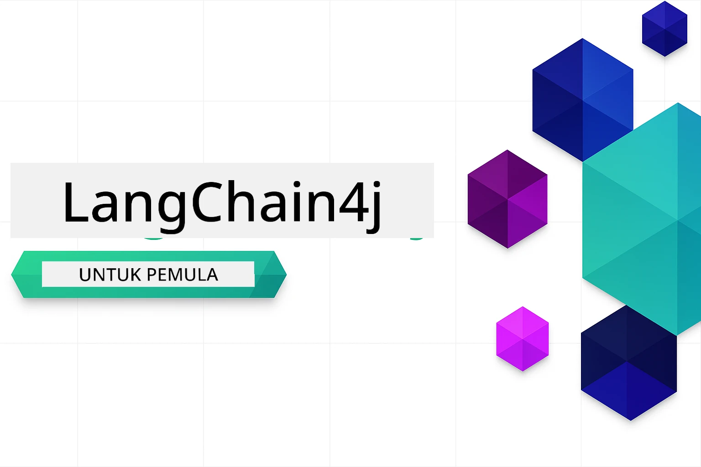

<!--
CO_OP_TRANSLATOR_METADATA:
{
  "original_hash": "6a3bd54fc243ce3dc79d18848d2b5413",
  "translation_date": "2026-01-06T00:18:35+00:00",
  "source_file": "README.md",
  "language_code": "id"
}
-->


### 🌐 Dukungan Multi-Bahasa

#### Didukung melalui GitHub Action (Otomatis & Selalu Terbaru)

<!-- CO-OP TRANSLATOR LANGUAGES TABLE START -->
[Arabic](../ar/README.md) | [Bengali](../bn/README.md) | [Bulgarian](../bg/README.md) | [Burmese (Myanmar)](../my/README.md) | [Chinese (Simplified)](../zh/README.md) | [Chinese (Traditional, Hong Kong)](../hk/README.md) | [Chinese (Traditional, Macau)](../mo/README.md) | [Chinese (Traditional, Taiwan)](../tw/README.md) | [Croatian](../hr/README.md) | [Czech](../cs/README.md) | [Danish](../da/README.md) | [Dutch](../nl/README.md) | [Estonian](../et/README.md) | [Finnish](../fi/README.md) | [French](../fr/README.md) | [German](../de/README.md) | [Greek](../el/README.md) | [Hebrew](../he/README.md) | [Hindi](../hi/README.md) | [Hungarian](../hu/README.md) | [Indonesian](./README.md) | [Italian](../it/README.md) | [Japanese](../ja/README.md) | [Kannada](../kn/README.md) | [Korean](../ko/README.md) | [Lithuanian](../lt/README.md) | [Malay](../ms/README.md) | [Malayalam](../ml/README.md) | [Marathi](../mr/README.md) | [Nepali](../ne/README.md) | [Nigerian Pidgin](../pcm/README.md) | [Norwegian](../no/README.md) | [Persian (Farsi)](../fa/README.md) | [Polish](../pl/README.md) | [Portuguese (Brazil)](../br/README.md) | [Portuguese (Portugal)](../pt/README.md) | [Punjabi (Gurmukhi)](../pa/README.md) | [Romanian](../ro/README.md) | [Russian](../ru/README.md) | [Serbian (Cyrillic)](../sr/README.md) | [Slovak](../sk/README.md) | [Slovenian](../sl/README.md) | [Spanish](../es/README.md) | [Swahili](../sw/README.md) | [Swedish](../sv/README.md) | [Tagalog (Filipino)](../tl/README.md) | [Tamil](../ta/README.md) | [Telugu](../te/README.md) | [Thai](../th/README.md) | [Turkish](../tr/README.md) | [Ukrainian](../uk/README.md) | [Urdu](../ur/README.md) | [Vietnamese](../vi/README.md)

> **Ingin Mengkloning Secara Lokal?**

> Repositori ini mencakup lebih dari 50 terjemahan bahasa yang secara signifikan meningkatkan ukuran unduhan. Untuk mengkloning tanpa terjemahan, gunakan sparse checkout:
> ```bash
> git clone --filter=blob:none --sparse https://github.com/microsoft/LangChain4j-for-Beginners.git
> cd LangChain4j-for-Beginners
> git sparse-checkout set --no-cone '/*' '!translations' '!translated_images'
> ```
> Ini memberi Anda semua yang Anda butuhkan untuk menyelesaikan kursus dengan unduhan yang jauh lebih cepat.
<!-- CO-OP TRANSLATOR LANGUAGES TABLE END -->

# LangChain4j untuk Pemula

Sebuah kursus untuk membangun aplikasi AI dengan LangChain4j dan Azure OpenAI GPT-5, mulai dari chat dasar hingga agen AI.

**Baru mengenal LangChain4j?** Lihat [Glosarium](docs/GLOSSARY.md) untuk definisi istilah dan konsep utama.

## Daftar Isi

1. [Mulai Cepat](00-quick-start/README.md) - Mulailah dengan LangChain4j
2. [Pengenalan](01-introduction/README.md) - Pelajari dasar-dasar LangChain4j
3. [Rekayasa Prompt](02-prompt-engineering/README.md) - Kuasai desain prompt yang efektif
4. [RAG (Generasi dengan Pengambilan Informasi)](03-rag/README.md) - Bangun sistem cerdas berbasis pengetahuan
5. [Alat](04-tools/README.md) - Integrasikan alat eksternal dan asisten sederhana
6. [MCP (Protokol Konteks Model)](05-mcp/README.md) - Bekerja dengan Protokol Konteks Model (MCP) dan modul Agentic
---

## Jalur Pembelajaran

> **Mulai Cepat**

1. Fork repositori ini ke akun GitHub Anda
2. Klik **Code** → tab **Codespaces** → **...** → **Baru dengan opsi...**
3. Gunakan pengaturan default – ini akan memilih container Pengembangan yang dibuat untuk kursus ini
4. Klik **Buat codespace**
5. Tunggu 5-10 menit hingga lingkungan siap digunakan
6. Langsung menuju ke [Mulai Cepat](./00-quick-start/README.md) untuk memulai!

> **Ingin Mengkloning Secara Lokal?**
>
> Repositori ini mencakup lebih dari 50 terjemahan bahasa yang secara signifikan meningkatkan ukuran unduhan. Untuk mengkloning tanpa terjemahan, gunakan sparse checkout:
> ```bash
> git clone --filter=blob:none --sparse https://github.com/microsoft/LangChain4j-for-Beginners.git
> cd LangChain4j-for-Beginners
> git sparse-checkout set --no-cone '/*' '!translations' '!translated_images'
> ```
> Ini memberi Anda semua yang Anda butuhkan untuk menyelesaikan kursus dengan unduhan yang jauh lebih cepat.

Setelah menyelesaikan modul, jelajahi [Panduan Pengujian](docs/TESTING.md) untuk melihat konsep pengujian LangChain4j dalam praktik.

> **Catatan:** Pelatihan ini menggunakan GitHub Models dan Azure OpenAI. Modul [Mulai Cepat](00-quick-start/README.md) menggunakan GitHub Models (tidak memerlukan langganan Azure), sementara modul 1-5 menggunakan Azure OpenAI.


## Belajar dengan GitHub Copilot

Untuk memulai pemrograman dengan cepat, buka proyek ini di GitHub Codespace atau IDE lokal Anda dengan devcontainer yang disediakan. Devcontainer yang digunakan dalam kursus ini sudah dikonfigurasi dengan GitHub Copilot untuk pemrograman pasangan AI.

Setiap contoh kode mencakup pertanyaan yang disarankan yang dapat Anda tanyakan kepada GitHub Copilot untuk memperdalam pemahaman Anda. Cari petunjuk 💡/🤖 di:

- **Header file Java** - Pertanyaan spesifik untuk setiap contoh
- **README modul** - Petunjuk eksplorasi setelah contoh kode

**Cara menggunakan:** Buka file kode mana pun dan tanyakan pertanyaan yang disarankan ke Copilot. Ia memiliki konteks penuh dari basis kode dan dapat menjelaskan, memperluas, serta menyarankan alternatif.

Ingin belajar lebih lanjut? Lihat [Copilot untuk Pemrograman Pasangan AI](https://aka.ms/GitHubCopilotAI).


## Sumber Daya Tambahan

<!-- CO-OP TRANSLATOR OTHER COURSES START -->
### LangChain
[](https://aka.ms/langchain4j-for-beginners)
[](https://aka.ms/langchainjs-for-beginners?WT.mc_id=m365-94501-dwahlin)

---

### Azure / Edge / MCP / Agen
[](https://github.com/microsoft/AZD-for-beginners?WT.mc_id=academic-105485-koreyst)
[](https://github.com/microsoft/edgeai-for-beginners?WT.mc_id=academic-105485-koreyst)
[](https://github.com/microsoft/mcp-for-beginners?WT.mc_id=academic-105485-koreyst)
[](https://github.com/microsoft/ai-agents-for-beginners?WT.mc_id=academic-105485-koreyst)

---
 
### Seri AI Generatif
[](https://github.com/microsoft/generative-ai-for-beginners?WT.mc_id=academic-105485-koreyst)
[-9333EA?style=for-the-badge&labelColor=E5E7EB&color=9333EA)](https://github.com/microsoft/Generative-AI-for-beginners-dotnet?WT.mc_id=academic-105485-koreyst)
[-C084FC?style=for-the-badge&labelColor=E5E7EB&color=C084FC)](https://github.com/microsoft/generative-ai-for-beginners-java?WT.mc_id=academic-105485-koreyst)
[-E879F9?style=for-the-badge&labelColor=E5E7EB&color=E879F9)](https://github.com/microsoft/generative-ai-with-javascript?WT.mc_id=academic-105485-koreyst)

---
 
### Pembelajaran Inti
[](https://aka.ms/ml-beginners?WT.mc_id=academic-105485-koreyst)
[](https://aka.ms/datascience-beginners?WT.mc_id=academic-105485-koreyst)
[](https://aka.ms/ai-beginners?WT.mc_id=academic-105485-koreyst)
[](https://github.com/microsoft/Security-101?WT.mc_id=academic-96948-sayoung)
[](https://aka.ms/webdev-beginners?WT.mc_id=academic-105485-koreyst)
[](https://aka.ms/iot-beginners?WT.mc_id=academic-105485-koreyst)
[](https://github.com/microsoft/xr-development-for-beginners?WT.mc_id=academic-105485-koreyst)

---
 
### Seri Copilot
[](https://aka.ms/GitHubCopilotAI?WT.mc_id=academic-105485-koreyst)
[](https://github.com/microsoft/mastering-github-copilot-for-dotnet-csharp-developers?WT.mc_id=academic-105485-koreyst)
[](https://github.com/microsoft/CopilotAdventures?WT.mc_id=academic-105485-koreyst)
<!-- CO-OP TRANSLATOR OTHER COURSES END -->

## Mendapatkan Bantuan

Jika Anda mengalami kesulitan atau memiliki pertanyaan tentang membangun aplikasi AI, bergabunglah:

[](https://aka.ms/foundry/discord)

Jika Anda memiliki masukan produk atau menemukan kesalahan saat membangun, kunjungi:

[](https://aka.ms/foundry/forum)

## Lisensi

Lisensi MIT - Lihat file [LICENSE](../../LICENSE) untuk detail.

---

<!-- CO-OP TRANSLATOR DISCLAIMER START -->
**Penafian**:  
Dokumen ini telah diterjemahkan menggunakan layanan terjemahan AI [Co-op Translator](https://github.com/Azure/co-op-translator). Meskipun kami berupaya mencapai akurasi, harap diketahui bahwa terjemahan otomatis mungkin mengandung kesalahan atau ketidakakuratan. Dokumen asli dalam bahasa aslinya harus dianggap sebagai sumber yang sahih. Untuk informasi penting, disarankan menggunakan terjemahan profesional oleh manusia. Kami tidak bertanggung jawab atas kesalahpahaman atau kesalahan tafsir yang timbul dari penggunaan terjemahan ini.
<!-- CO-OP TRANSLATOR DISCLAIMER END -->