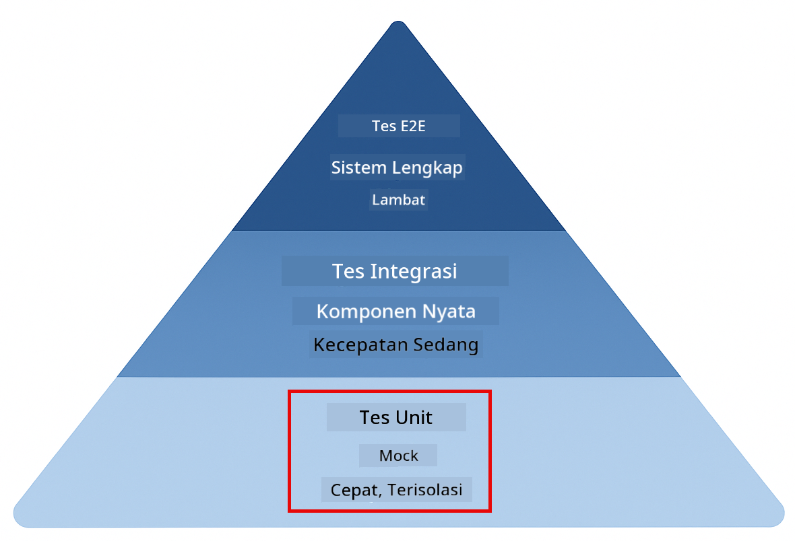
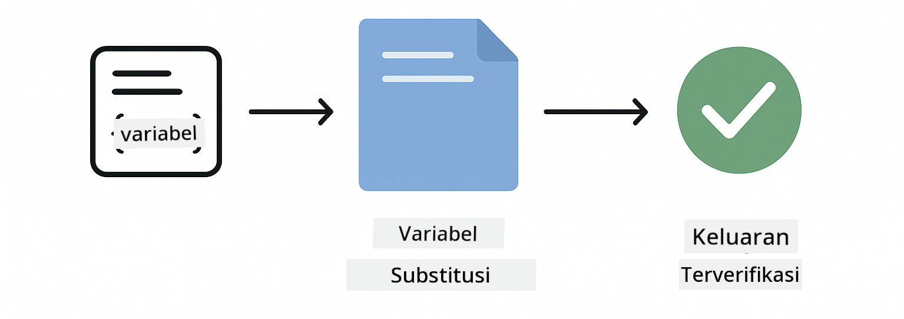
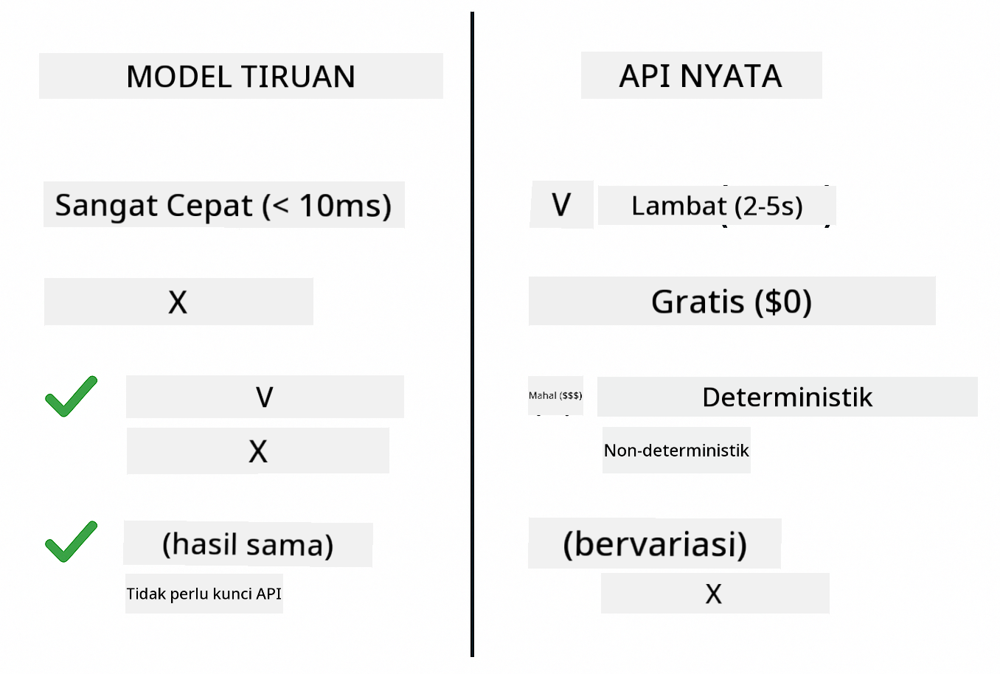
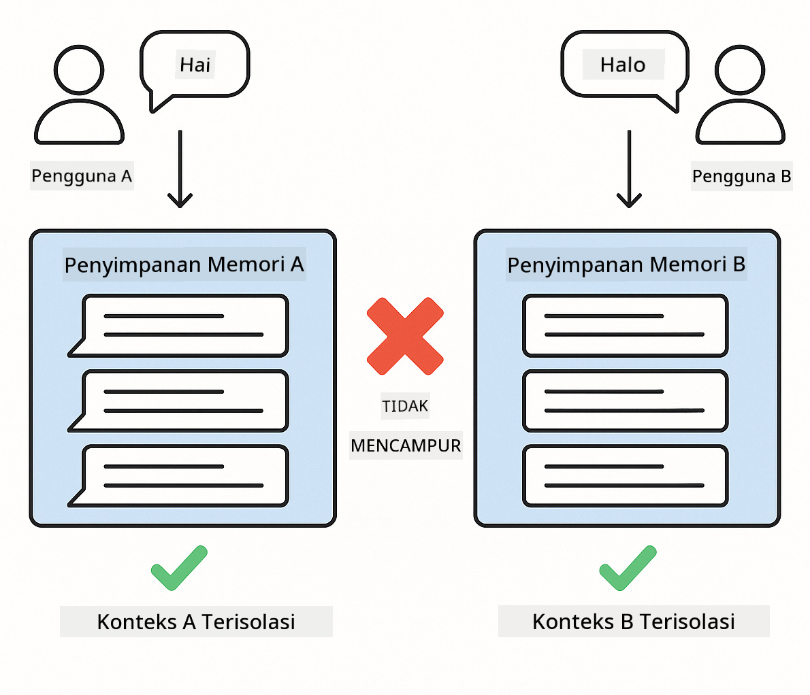

<!--
CO_OP_TRANSLATOR_METADATA:
{
  "original_hash": "ed93b3c14d58734ac10162967da958c1",
  "translation_date": "2025-12-31T03:06:44+00:00",
  "source_file": "docs/TESTING.md",
  "language_code": "id"
}
-->
# Menguji Aplikasi LangChain4j

## Daftar Isi

- [Mulai Cepat](../../../docs)
- [Apa yang Dicakup oleh Tes](../../../docs)
- [Menjalankan Tes](../../../docs)
- [Menjalankan Tes di VS Code](../../../docs)
- [Pola Pengujian](../../../docs)
- [Filosofi Pengujian](../../../docs)
- [Langkah Selanjutnya](../../../docs)

Panduan ini memandu Anda melalui tes yang menunjukkan cara menguji aplikasi AI tanpa memerlukan kunci API atau layanan eksternal.

## Mulai Cepat

Jalankan semua tes dengan satu perintah:

**Bash:**
```bash
mvn test
```

**PowerShell:**
```powershell
mvn --% test
```


*Eksekusi tes yang berhasil menampilkan semua tes lulus tanpa kegagalan*

## Apa yang Dicakup oleh Tes

Kursus ini berfokus pada **unit tests** yang dijalankan secara lokal. Setiap tes menunjukkan konsep LangChain4j tertentu secara terisolasi.



*piramida pengujian yang menunjukkan keseimbangan antara unit tests (cepat, terisolasi), integration tests (komponen nyata), dan end-to-end tests. Pelatihan ini mencakup unit testing.*

| Modul | Tes | Fokus | Berkas Kunci |
|--------|-------|-------|-----------|
| **00 - Mulai Cepat** | 6 | Template prompt dan substitusi variabel | `SimpleQuickStartTest.java` |
| **01 - Pengenalan** | 8 | Memori percakapan dan obrolan yang menyimpan status | `SimpleConversationTest.java` |
| **02 - Rekayasa Prompt** | 12 | Pola GPT-5, tingkat antusiasme, output terstruktur | `SimpleGpt5PromptTest.java` |
| **03 - RAG** | 10 | Ingest dokumen, embeddings, pencarian kesamaan | `DocumentServiceTest.java` |
| **04 - Tools** | 12 | Pemanggilan fungsi dan penggabungan tools | `SimpleToolsTest.java` |
| **05 - MCP** | 8 | Model Context Protocol dengan transport stdio | `SimpleMcpTest.java` |

## Menjalankan Tes

**Jalankan semua tes dari root:**

**Bash:**
```bash
mvn test
```

**PowerShell:**
```powershell
mvn --% test
```

**Jalankan tes untuk modul tertentu:**

**Bash:**
```bash
cd 01-introduction && mvn test
# Atau dari root
mvn test -pl 01-introduction
```

**PowerShell:**
```powershell
cd 01-introduction; mvn --% test
# Atau dari root
mvn --% test -pl 01-introduction
```

**Jalankan satu kelas tes:**

**Bash:**
```bash
mvn test -Dtest=SimpleConversationTest
```

**PowerShell:**
```powershell
mvn --% test -Dtest=SimpleConversationTest
```

**Jalankan metode tes tertentu:**

**Bash:**
```bash
mvn test -Dtest=SimpleConversationTest#harus mempertahankan riwayat percakapan
```

**PowerShell:**
```powershell
mvn --% test -Dtest=SimpleConversationTest#harus mempertahankan riwayat percakapan
```

## Menjalankan Tes di VS Code

Jika Anda menggunakan Visual Studio Code, Test Explorer menyediakan antarmuka grafis untuk menjalankan dan men-debug tes.


*Penjelajah Tes VS Code yang menampilkan pohon tes dengan semua kelas tes Java dan metode tes individu*

**Untuk menjalankan tes di VS Code:**

1. Buka Test Explorer dengan mengklik ikon labu percobaan di Activity Bar
2. Perluas pohon tes untuk melihat semua modul dan kelas tes
3. Klik tombol putar di samping tes mana pun untuk menjalankannya secara individual
4. Klik "Run All Tests" untuk mengeksekusi seluruh rangkaian
5. Klik kanan pada tes mana pun dan pilih "Debug Test" untuk mengatur breakpoint dan langkah melalui kode

Test Explorer menunjukkan tanda centang hijau untuk tes yang lulus dan memberikan pesan kegagalan terperinci saat tes gagal.

## Pola Pengujian

### Pola 1: Menguji Template Prompt

Pola paling sederhana menguji template prompt tanpa memanggil model AI apa pun. Anda memverifikasi bahwa substitusi variabel bekerja dengan benar dan prompt diformat seperti yang diharapkan.



*Pengujian template prompt yang menunjukkan alur substitusi variabel: template dengan placeholder → nilai diterapkan → output terformat diverifikasi*

```java
@Test
@DisplayName("Should format prompt template with variables")
void testPromptTemplateFormatting() {
    PromptTemplate template = PromptTemplate.from(
        "Best time to visit {{destination}} for {{activity}}?"
    );
    
    Prompt prompt = template.apply(Map.of(
        "destination", "Paris",
        "activity", "sightseeing"
    ));
    
    assertThat(prompt.text()).isEqualTo("Best time to visit Paris for sightseeing?");
}
```

Tes ini berada di `00-quick-start/src/test/java/com/example/langchain4j/quickstart/SimpleQuickStartTest.java`.

**Jalankan:**

**Bash:**
```bash
cd 00-quick-start && mvn test -Dtest=SimpleQuickStartTest#pengujian pemformatan template prompt
```

**PowerShell:**
```powershell
cd 00-quick-start; mvn --% test -Dtest=SimpleQuickStartTest#Pengujian pemformatan template prompt
```

### Pola 2: Memalsukan Model Bahasa

Saat menguji logika percakapan, gunakan Mockito untuk membuat model palsu yang mengembalikan respons yang telah ditentukan. Ini membuat tes cepat, gratis, dan deterministik.



*Perbandingan yang menunjukkan mengapa mock lebih disukai untuk pengujian: mereka cepat, gratis, deterministik, dan tidak memerlukan kunci API*

```java
@ExtendWith(MockitoExtension.class)
class SimpleConversationTest {
    
    private ConversationService conversationService;
    
    @Mock
    private OpenAiOfficialChatModel mockChatModel;
    
    @BeforeEach
    void setUp() {
        ChatResponse mockResponse = ChatResponse.builder()
            .aiMessage(AiMessage.from("This is a test response"))
            .build();
        when(mockChatModel.chat(anyList())).thenReturn(mockResponse);
        
        conversationService = new ConversationService(mockChatModel);
    }
    
    @Test
    void shouldMaintainConversationHistory() {
        String conversationId = conversationService.startConversation();
        
        ChatResponse mockResponse1 = ChatResponse.builder()
            .aiMessage(AiMessage.from("Response 1"))
            .build();
        ChatResponse mockResponse2 = ChatResponse.builder()
            .aiMessage(AiMessage.from("Response 2"))
            .build();
        ChatResponse mockResponse3 = ChatResponse.builder()
            .aiMessage(AiMessage.from("Response 3"))
            .build();
        
        when(mockChatModel.chat(anyList()))
            .thenReturn(mockResponse1)
            .thenReturn(mockResponse2)
            .thenReturn(mockResponse3);

        conversationService.chat(conversationId, "First message");
        conversationService.chat(conversationId, "Second message");
        conversationService.chat(conversationId, "Third message");

        List<ChatMessage> history = conversationService.getHistory(conversationId);
        assertThat(history).hasSize(6); // 3 pesan pengguna + 3 pesan AI
    }
}
```

Pola ini muncul di `01-introduction/src/test/java/com/example/langchain4j/service/SimpleConversationTest.java`. Mock memastikan perilaku yang konsisten sehingga Anda dapat memverifikasi pengelolaan memori bekerja dengan benar.

### Pola 3: Menguji Isolasi Percakapan

Memori percakapan harus menjaga pengguna ganda terpisah. Tes ini memverifikasi bahwa percakapan tidak mencampur konteks.



*Pengujian isolasi percakapan yang menunjukkan penyimpanan memori terpisah untuk pengguna berbeda untuk mencegah pencampuran konteks*

```java
@Test
void shouldIsolateConversationsByid() {
    String conv1 = conversationService.startConversation();
    String conv2 = conversationService.startConversation();
    
    ChatResponse mockResponse = ChatResponse.builder()
        .aiMessage(AiMessage.from("Response"))
        .build();
    when(mockChatModel.chat(anyList())).thenReturn(mockResponse);

    conversationService.chat(conv1, "Message for conversation 1");
    conversationService.chat(conv2, "Message for conversation 2");

    List<ChatMessage> history1 = conversationService.getHistory(conv1);
    List<ChatMessage> history2 = conversationService.getHistory(conv2);
    
    assertThat(history1).hasSize(2);
    assertThat(history2).hasSize(2);
}
```

Setiap percakapan mempertahankan riwayat independennya sendiri. Di sistem produksi, isolasi ini penting untuk aplikasi multi-pengguna.

### Pola 4: Menguji Tools Secara Mandiri

Tools adalah fungsi yang dapat dipanggil oleh AI. Uji mereka langsung untuk memastikan mereka bekerja dengan benar terlepas dari keputusan AI.


*Pengujian tools secara mandiri yang menunjukkan eksekusi tool palsu tanpa panggilan AI untuk memverifikasi logika bisnis*

```java
@Test
void shouldConvertCelsiusToFahrenheit() {
    TemperatureTool tempTool = new TemperatureTool();
    String result = tempTool.celsiusToFahrenheit(25.0);
    assertThat(result).containsPattern("77[.,]0°F");
}

@Test
void shouldDemonstrateToolChaining() {
    WeatherTool weatherTool = new WeatherTool();
    TemperatureTool tempTool = new TemperatureTool();

    String weatherResult = weatherTool.getCurrentWeather("Seattle");
    assertThat(weatherResult).containsPattern("\\d+°C");

    String conversionResult = tempTool.celsiusToFahrenheit(22.0);
    assertThat(conversionResult).containsPattern("71[.,]6°F");
}
```

Tes-tes ini dari `04-tools/src/test/java/com/example/langchain4j/agents/tools/SimpleToolsTest.java` memvalidasi logika tool tanpa keterlibatan AI. Contoh chaining menunjukkan bagaimana output satu tool menjadi input bagi tool lain.

### Pola 5: Pengujian RAG Dalam Memori

Sistem RAG biasanya memerlukan basis data vektor dan layanan embedding. Pola dalam-memori memungkinkan Anda menguji seluruh pipeline tanpa ketergantungan eksternal.


*Alur kerja pengujian RAG dalam memori yang menunjukkan parsing dokumen, penyimpanan embedding, dan pencarian kesamaan tanpa memerlukan database*

```java
@Test
void testProcessTextDocument() {
    String content = "This is a test document.\nIt has multiple lines.";
    InputStream inputStream = new ByteArrayInputStream(content.getBytes(StandardCharsets.UTF_8));
    
    DocumentService.ProcessedDocument result = 
        documentService.processDocument(inputStream, "test.txt");

    assertNotNull(result);
    assertTrue(result.segments().size() > 0);
    assertEquals("test.txt", result.segments().get(0).metadata().getString("filename"));
}
```

Tes ini dari `03-rag/src/test/java/com/example/langchain4j/rag/service/DocumentServiceTest.java` membuat dokumen di memori dan memverifikasi chunking serta penanganan metadata.

### Pola 6: Pengujian Integrasi MCP

Modul MCP menguji integrasi Model Context Protocol menggunakan transport stdio. Tes-tes ini memverifikasi bahwa aplikasi Anda dapat memanggil dan berkomunikasi dengan server MCP sebagai subprocess.

Tes di `05-mcp/src/test/java/com/example/langchain4j/mcp/SimpleMcpTest.java` memvalidasi perilaku klien MCP.

**Jalankan mereka:**

**Bash:**
```bash
cd 05-mcp && mvn test
```

**PowerShell:**
```powershell
cd 05-mcp; mvn --% test
```

## Filosofi Pengujian

Ujilah kode Anda, bukan AI. Tes Anda harus memvalidasi kode yang Anda tulis dengan memeriksa bagaimana prompt dibuat, bagaimana memori dikelola, dan bagaimana tools dieksekusi. Respons AI bervariasi dan seharusnya bukan bagian dari assertion tes. Tanyakan pada diri Anda apakah template prompt Anda menggantikan variabel dengan benar, bukan apakah AI memberikan jawaban yang benar.

Gunakan mock untuk model bahasa. Mereka adalah dependensi eksternal yang lambat, mahal, dan tidak deterministik. Memalsukan membuat tes cepat dengan milidetik alih-alih detik, gratis tanpa biaya API, dan deterministik dengan hasil yang sama setiap kali.

Jaga agar tes independen. Setiap tes harus menyiapkan datanya sendiri, tidak bergantung pada tes lain, dan membersihkan setelah dirinya sendiri. Tes harus lulus terlepas dari urutan eksekusi.

Uji kasus tepi di luar jalur bahagia. Coba input kosong, input sangat besar, karakter khusus, parameter tidak valid, dan kondisi batas. Ini sering mengungkap bug yang tidak terlihat pada penggunaan normal.

Gunakan nama yang deskriptif. Bandingkan `shouldMaintainConversationHistoryAcrossMultipleMessages()` dengan `test1()`. Yang pertama memberi tahu Anda persis apa yang diuji, membuat debug kegagalan jauh lebih mudah.

## Langkah Selanjutnya

Sekarang setelah Anda memahami pola pengujian, selami lebih dalam setiap modul:

- **[00 - Mulai Cepat](../00-quick-start/README.md)** - Mulai dengan dasar-dasar template prompt
- **[01 - Pengenalan](../01-introduction/README.md)** - Pelajari pengelolaan memori percakapan
- **[02 - Rekayasa Prompt](../02-prompt-engineering/README.md)** - Kuasai pola prompting GPT-5
- **[03 - RAG](../03-rag/README.md)** - Bangun sistem retrieval-augmented generation
- **[04 - Tools](../04-tools/README.md)** - Terapkan pemanggilan fungsi dan rantai tools
- **[05 - MCP](../05-mcp/README.md)** - Integrasikan Model Context Protocol

README masing-masing modul menyediakan penjelasan rinci tentang konsep yang diuji di sini.

---

**Navigasi:** [← Kembali ke Utama](../README.md)

---

<!-- CO-OP TRANSLATOR DISCLAIMER START -->
Penafian:
Dokumen ini telah diterjemahkan menggunakan layanan terjemahan AI [Co-op Translator](https://github.com/Azure/co-op-translator). Meskipun kami berupaya mencapai ketepatan, harap diketahui bahwa terjemahan otomatis mungkin mengandung kesalahan atau ketidakakuratan. Dokumen asli dalam bahasa aslinya harus dianggap sebagai sumber otoritatif. Untuk informasi yang bersifat kritis, disarankan menggunakan terjemahan profesional oleh penerjemah manusia. Kami tidak bertanggung jawab atas kesalahpahaman atau salah tafsir yang timbul dari penggunaan terjemahan ini.
<!-- CO-OP TRANSLATOR DISCLAIMER END -->