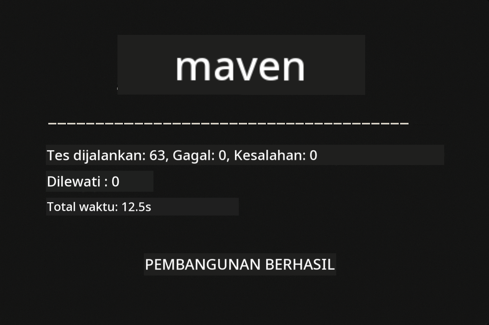
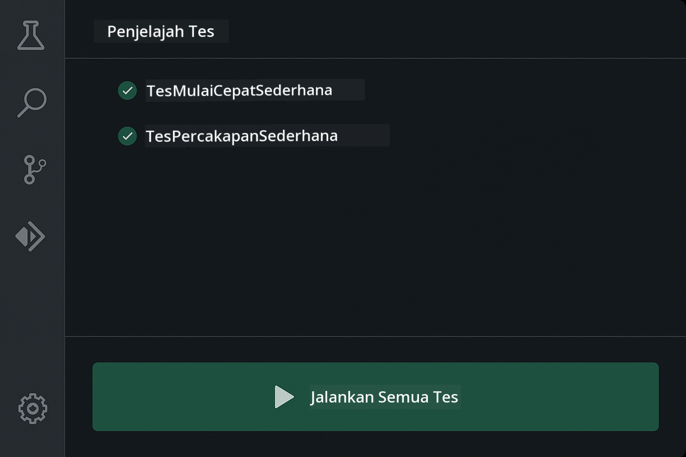
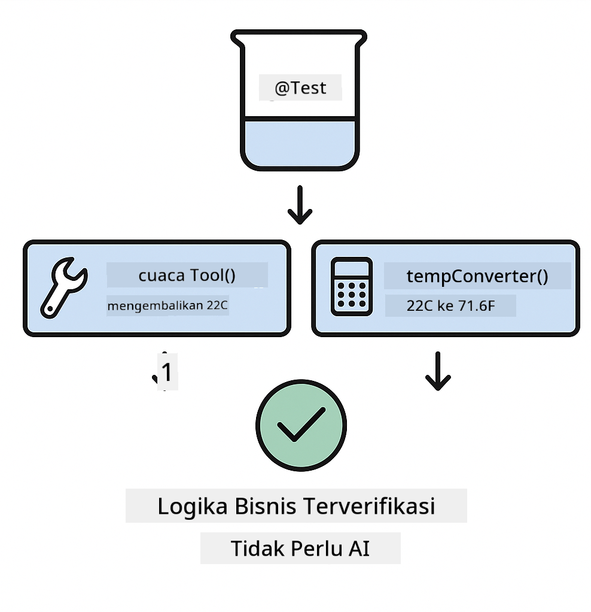
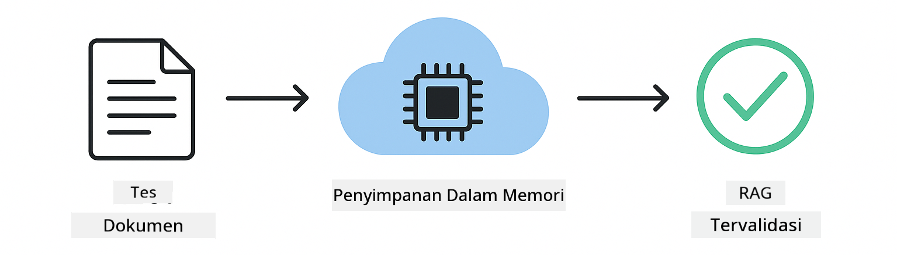

<!--
CO_OP_TRANSLATOR_METADATA:
{
  "original_hash": "b975537560c404d5f254331832811e78",
  "translation_date": "2025-12-13T21:14:18+00:00",
  "source_file": "docs/TESTING.md",
  "language_code": "id"
}
-->
# Menguji Aplikasi LangChain4j

## Daftar Isi

- [Mulai Cepat](../../../docs)
- [Apa yang Dicakup oleh Tes](../../../docs)
- [Menjalankan Tes](../../../docs)
- [Menjalankan Tes di VS Code](../../../docs)
- [Pola Pengujian](../../../docs)
- [Filosofi Pengujian](../../../docs)
- [Langkah Selanjutnya](../../../docs)

Panduan ini memandu Anda melalui tes yang menunjukkan cara menguji aplikasi AI tanpa memerlukan kunci API atau layanan eksternal.

## Mulai Cepat

Jalankan semua tes dengan satu perintah:

**Bash:**
```bash
mvn test
```

**PowerShell:**
```powershell
mvn --% test
```



*Eksekusi tes berhasil menunjukkan semua tes lulus tanpa kegagalan*

## Apa yang Dicakup oleh Tes

Kursus ini berfokus pada **unit test** yang dijalankan secara lokal. Setiap tes menunjukkan konsep LangChain4j tertentu secara terpisah.


*Piramida pengujian yang menunjukkan keseimbangan antara unit test (cepat, terisolasi), integration test (komponen nyata), dan end-to-end test (sistem penuh dengan Docker). Pelatihan ini mencakup pengujian unit.*

| Modul | Tes | Fokus | File Utama |
|--------|-------|-------|-----------|
| **00 - Mulai Cepat** | 6 | Template prompt dan substitusi variabel | `SimpleQuickStartTest.java` |
| **01 - Pengenalan** | 8 | Memori percakapan dan chat stateful | `SimpleConversationTest.java` |
| **02 - Rekayasa Prompt** | 12 | Pola GPT-5, tingkat antusiasme, output terstruktur | `SimpleGpt5PromptTest.java` |
| **03 - RAG** | 10 | Pengambilan dokumen, embedding, pencarian kemiripan | `DocumentServiceTest.java` |
| **04 - Alat** | 12 | Pemanggilan fungsi dan rantai alat | `SimpleToolsTest.java` |
| **05 - MCP** | 15 | Model Context Protocol dengan Docker | `SimpleMcpTest.java`, `McpDockerTransportTest.java` |

## Menjalankan Tes

**Jalankan semua tes dari root:**

**Bash:**
```bash
mvn test
```

**PowerShell:**
```powershell
mvn --% test
```

**Jalankan tes untuk modul tertentu:**

**Bash:**
```bash
cd 01-introduction && mvn test
# Atau dari root
mvn test -pl 01-introduction
```

**PowerShell:**
```powershell
cd 01-introduction; mvn --% test
# Atau dari root
mvn --% test -pl 01-introduction
```

**Jalankan satu kelas tes:**

**Bash:**
```bash
mvn test -Dtest=SimpleConversationTest
```

**PowerShell:**
```powershell
mvn --% test -Dtest=SimpleConversationTest
```

**Jalankan metode tes tertentu:**

**Bash:**
```bash
mvn test -Dtest=SimpleConversationTest#harusMempertahankanRiwayatPercakapan
```

**PowerShell:**
```powershell
mvn --% test -Dtest=SimpleConversationTest#harusMempertahankanRiwayatPercakapan
```

## Menjalankan Tes di VS Code

Jika Anda menggunakan Visual Studio Code, Test Explorer menyediakan antarmuka grafis untuk menjalankan dan men-debug tes.



*VS Code Test Explorer menampilkan pohon tes dengan semua kelas tes Java dan metode tes individual*

**Untuk menjalankan tes di VS Code:**

1. Buka Test Explorer dengan mengklik ikon tabung reaksi di Activity Bar
2. Perluas pohon tes untuk melihat semua modul dan kelas tes
3. Klik tombol play di samping tes mana pun untuk menjalankannya secara individual
4. Klik "Run All Tests" untuk menjalankan seluruh suite
5. Klik kanan tes mana pun dan pilih "Debug Test" untuk menetapkan breakpoint dan menelusuri kode

Test Explorer menampilkan tanda centang hijau untuk tes yang lulus dan memberikan pesan kegagalan rinci saat tes gagal.

## Pola Pengujian


*Enam pola pengujian untuk aplikasi LangChain4j: template prompt, mocking model, isolasi percakapan, pengujian alat, RAG in-memory, dan integrasi Docker*

### Pola 1: Menguji Template Prompt

Pola paling sederhana menguji template prompt tanpa memanggil model AI apa pun. Anda memverifikasi bahwa substitusi variabel bekerja dengan benar dan prompt diformat sesuai harapan.


*Pengujian template prompt menunjukkan alur substitusi variabel: template dengan placeholder → nilai diterapkan → output diformat diverifikasi*

```java
@Test
@DisplayName("Should format prompt template with variables")
void testPromptTemplateFormatting() {
    PromptTemplate template = PromptTemplate.from(
        "Best time to visit {{destination}} for {{activity}}?"
    );
    
    Prompt prompt = template.apply(Map.of(
        "destination", "Paris",
        "activity", "sightseeing"
    ));
    
    assertThat(prompt.text()).isEqualTo("Best time to visit Paris for sightseeing?");
}
```

Tes ini berada di `00-quick-start/src/test/java/com/example/langchain4j/quickstart/SimpleQuickStartTest.java`.

**Jalankan:**

**Bash:**
```bash
cd 00-quick-start && mvn test -Dtest=SimpleQuickStartTest#pengujianFormatTemplatePrompt
```

**PowerShell:**
```powershell
cd 00-quick-start; mvn --% test -Dtest=SimpleQuickStartTest#pengujianFormatTemplatePrompt
```

### Pola 2: Mocking Model Bahasa

Saat menguji logika percakapan, gunakan Mockito untuk membuat model palsu yang mengembalikan respons yang telah ditentukan. Ini membuat tes cepat, gratis, dan deterministik.


*Perbandingan yang menunjukkan mengapa mock lebih disukai untuk pengujian: cepat, gratis, deterministik, dan tidak memerlukan kunci API*

```java
@ExtendWith(MockitoExtension.class)
class SimpleConversationTest {
    
    private ConversationService conversationService;
    
    @Mock
    private OpenAiOfficialChatModel mockChatModel;
    
    @BeforeEach
    void setUp() {
        ChatResponse mockResponse = ChatResponse.builder()
            .aiMessage(AiMessage.from("This is a test response"))
            .build();
        when(mockChatModel.chat(anyList())).thenReturn(mockResponse);
        
        conversationService = new ConversationService(mockChatModel);
    }
    
    @Test
    void shouldMaintainConversationHistory() {
        String conversationId = conversationService.startConversation();
        
        ChatResponse mockResponse1 = ChatResponse.builder()
            .aiMessage(AiMessage.from("Response 1"))
            .build();
        ChatResponse mockResponse2 = ChatResponse.builder()
            .aiMessage(AiMessage.from("Response 2"))
            .build();
        ChatResponse mockResponse3 = ChatResponse.builder()
            .aiMessage(AiMessage.from("Response 3"))
            .build();
        
        when(mockChatModel.chat(anyList()))
            .thenReturn(mockResponse1)
            .thenReturn(mockResponse2)
            .thenReturn(mockResponse3);

        conversationService.chat(conversationId, "First message");
        conversationService.chat(conversationId, "Second message");
        conversationService.chat(conversationId, "Third message");

        List<ChatMessage> history = conversationService.getHistory(conversationId);
        assertThat(history).hasSize(6); // 3 pesan pengguna + 3 pesan AI
    }
}
```

Pola ini muncul di `01-introduction/src/test/java/com/example/langchain4j/service/SimpleConversationTest.java`. Mock memastikan perilaku konsisten sehingga Anda dapat memverifikasi manajemen memori bekerja dengan benar.

### Pola 3: Menguji Isolasi Percakapan

Memori percakapan harus menjaga pengguna yang berbeda tetap terpisah. Tes ini memverifikasi bahwa percakapan tidak mencampur konteks.


*Pengujian isolasi percakapan menunjukkan penyimpanan memori terpisah untuk pengguna berbeda agar mencegah pencampuran konteks*

```java
@Test
void shouldIsolateConversationsByid() {
    String conv1 = conversationService.startConversation();
    String conv2 = conversationService.startConversation();
    
    ChatResponse mockResponse = ChatResponse.builder()
        .aiMessage(AiMessage.from("Response"))
        .build();
    when(mockChatModel.chat(anyList())).thenReturn(mockResponse);

    conversationService.chat(conv1, "Message for conversation 1");
    conversationService.chat(conv2, "Message for conversation 2");

    List<ChatMessage> history1 = conversationService.getHistory(conv1);
    List<ChatMessage> history2 = conversationService.getHistory(conv2);
    
    assertThat(history1).hasSize(2);
    assertThat(history2).hasSize(2);
}
```

Setiap percakapan mempertahankan riwayatnya sendiri yang independen. Dalam sistem produksi, isolasi ini sangat penting untuk aplikasi multi-pengguna.

### Pola 4: Menguji Alat Secara Mandiri

Alat adalah fungsi yang dapat dipanggil AI. Uji langsung untuk memastikan mereka bekerja dengan benar tanpa bergantung pada keputusan AI.



*Pengujian alat secara mandiri menunjukkan eksekusi alat mock tanpa panggilan AI untuk memverifikasi logika bisnis*

```java
@Test
void shouldConvertCelsiusToFahrenheit() {
    TemperatureTool tempTool = new TemperatureTool();
    String result = tempTool.celsiusToFahrenheit(25.0);
    assertThat(result).containsPattern("77[.,]0°F");
}

@Test
void shouldDemonstrateToolChaining() {
    WeatherTool weatherTool = new WeatherTool();
    TemperatureTool tempTool = new TemperatureTool();

    String weatherResult = weatherTool.getCurrentWeather("Seattle");
    assertThat(weatherResult).containsPattern("\\d+°C");

    String conversionResult = tempTool.celsiusToFahrenheit(22.0);
    assertThat(conversionResult).containsPattern("71[.,]6°F");
}
```

Tes ini dari `04-tools/src/test/java/com/example/langchain4j/agents/tools/SimpleToolsTest.java` memvalidasi logika alat tanpa keterlibatan AI. Contoh chaining menunjukkan bagaimana output satu alat menjadi input alat lain.

### Pola 5: Pengujian RAG In-Memory

Sistem RAG biasanya memerlukan database vektor dan layanan embedding. Pola in-memory memungkinkan Anda menguji seluruh pipeline tanpa ketergantungan eksternal.



*Alur kerja pengujian RAG in-memory menunjukkan parsing dokumen, penyimpanan embedding, dan pencarian kemiripan tanpa memerlukan database*

```java
@Test
void testProcessTextDocument() {
    String content = "This is a test document.\nIt has multiple lines.";
    InputStream inputStream = new ByteArrayInputStream(content.getBytes(StandardCharsets.UTF_8));
    
    DocumentService.ProcessedDocument result = 
        documentService.processDocument(inputStream, "test.txt");

    assertNotNull(result);
    assertTrue(result.segments().size() > 0);
    assertEquals("test.txt", result.segments().get(0).metadata().getString("filename"));
}
```

Tes ini dari `03-rag/src/test/java/com/example/langchain4j/rag/service/DocumentServiceTest.java` membuat dokumen di memori dan memverifikasi chunking serta penanganan metadata.

### Pola 6: Pengujian Integrasi dengan Docker

Beberapa fitur memerlukan infrastruktur nyata. Modul MCP menggunakan Testcontainers untuk menjalankan container Docker untuk pengujian integrasi. Ini memvalidasi kode Anda bekerja dengan layanan nyata sambil menjaga isolasi tes.


*Pengujian integrasi MCP dengan Testcontainers menunjukkan siklus hidup container otomatis: mulai, eksekusi tes, berhenti, dan pembersihan*

Tes di `05-mcp/src/test/java/com/example/langchain4j/mcp/McpDockerTransportTest.java` memerlukan Docker berjalan.

**Jalankan:**

**Bash:**
```bash
cd 05-mcp && mvn test
```

**PowerShell:**
```powershell
cd 05-mcp; mvn --% test
```

## Filosofi Pengujian

Uji kode Anda, bukan AI. Tes Anda harus memvalidasi kode yang Anda tulis dengan memeriksa bagaimana prompt dibangun, bagaimana memori dikelola, dan bagaimana alat dijalankan. Respons AI bervariasi dan tidak boleh menjadi bagian dari asersi tes. Tanyakan pada diri Anda apakah template prompt Anda menggantikan variabel dengan benar, bukan apakah AI memberikan jawaban yang benar.

Gunakan mock untuk model bahasa. Mereka adalah dependensi eksternal yang lambat, mahal, dan tidak deterministik. Mocking membuat tes cepat dengan milidetik bukan detik, gratis tanpa biaya API, dan deterministik dengan hasil yang sama setiap kali.

Jaga tes tetap independen. Setiap tes harus menyiapkan data sendiri, tidak bergantung pada tes lain, dan membersihkan setelah selesai. Tes harus lulus tanpa memandang urutan eksekusi.

Uji kasus tepi di luar jalur bahagia. Coba input kosong, input sangat besar, karakter khusus, parameter tidak valid, dan kondisi batas. Ini sering mengungkap bug yang tidak terlihat pada penggunaan normal.

Gunakan nama yang deskriptif. Bandingkan `shouldMaintainConversationHistoryAcrossMultipleMessages()` dengan `test1()`. Yang pertama memberi tahu Anda persis apa yang diuji, membuat debugging kegagalan jauh lebih mudah.

## Langkah Selanjutnya

Sekarang setelah Anda memahami pola pengujian, pelajari lebih dalam setiap modul:

- **[00 - Mulai Cepat](../00-quick-start/README.md)** - Mulai dengan dasar template prompt
- **[01 - Pengenalan](../01-introduction/README.md)** - Pelajari manajemen memori percakapan
- **[02 - Rekayasa Prompt](../02/prompt-engineering/README.md)** - Kuasai pola prompting GPT-5
- **[03 - RAG](../03-rag/README.md)** - Bangun sistem retrieval-augmented generation
- **[04 - Alat](../04-tools/README.md)** - Implementasikan pemanggilan fungsi dan rantai alat
- **[05 - MCP](../05-mcp/README.md)** - Integrasikan Model Context Protocol dengan Docker

README setiap modul menyediakan penjelasan rinci tentang konsep yang diuji di sini.

---

**Navigasi:** [← Kembali ke Utama](../README.md)

---

<!-- CO-OP TRANSLATOR DISCLAIMER START -->
**Penafian**:  
Dokumen ini telah diterjemahkan menggunakan layanan terjemahan AI [Co-op Translator](https://github.com/Azure/co-op-translator). Meskipun kami berusaha untuk akurasi, harap diingat bahwa terjemahan otomatis mungkin mengandung kesalahan atau ketidakakuratan. Dokumen asli dalam bahasa aslinya harus dianggap sebagai sumber yang sahih. Untuk informasi penting, disarankan menggunakan terjemahan profesional oleh manusia. Kami tidak bertanggung jawab atas kesalahpahaman atau salah tafsir yang timbul dari penggunaan terjemahan ini.
<!-- CO-OP TRANSLATOR DISCLAIMER END -->