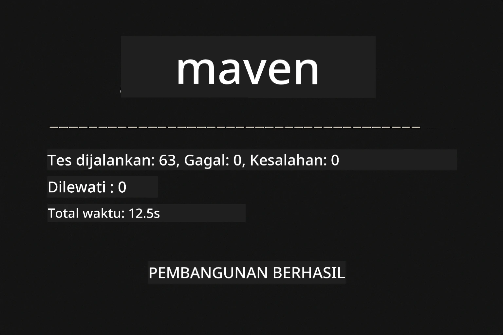
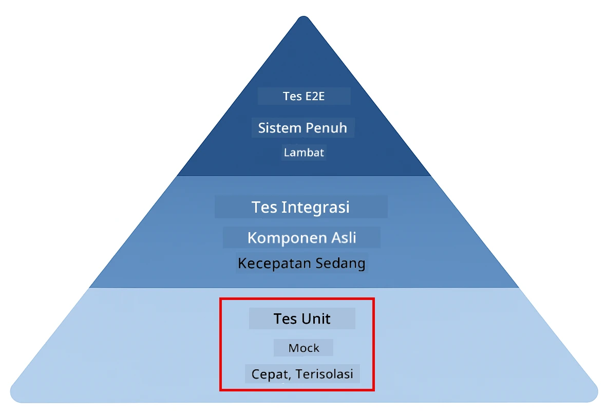
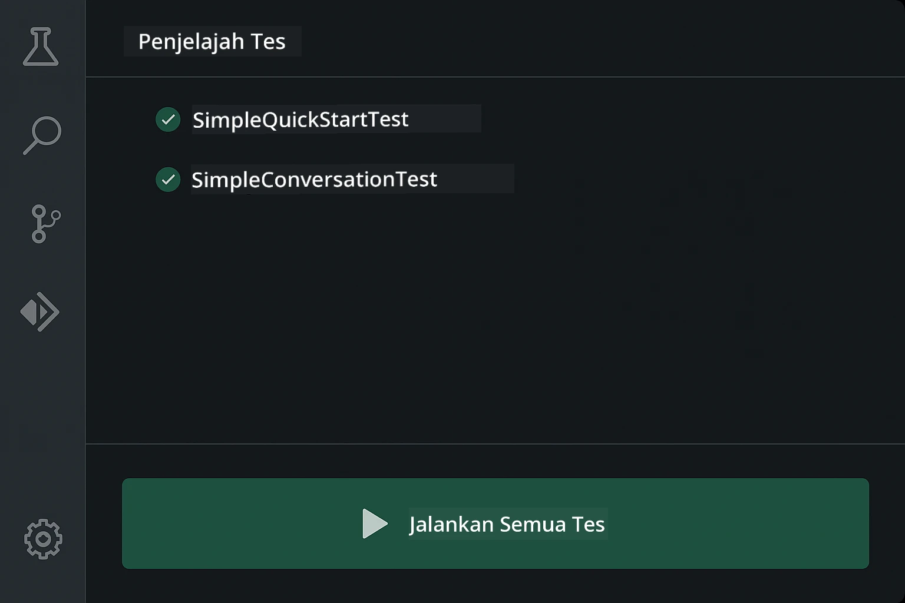
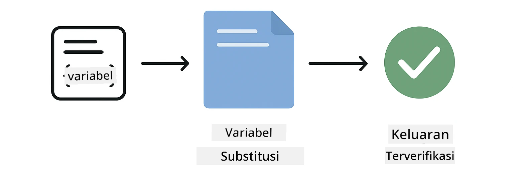
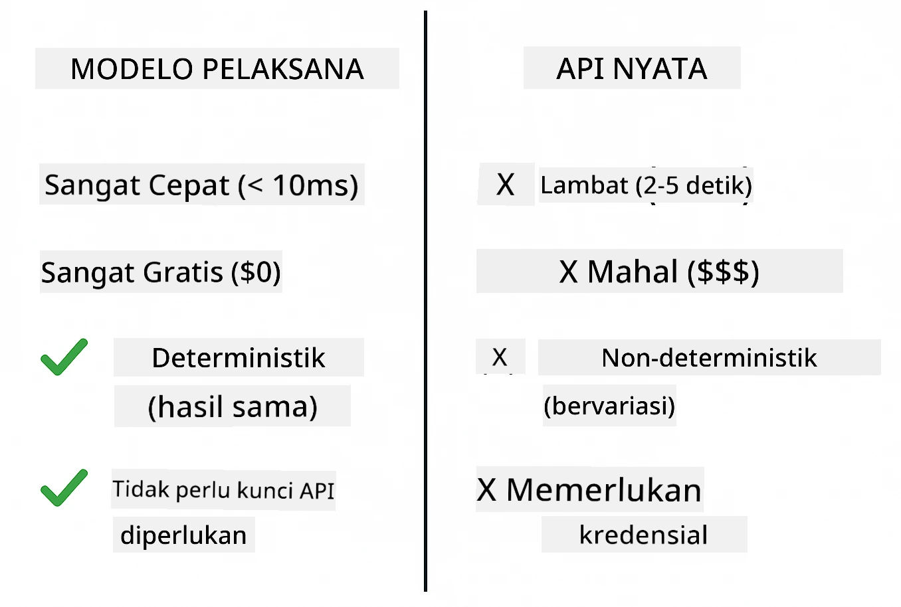
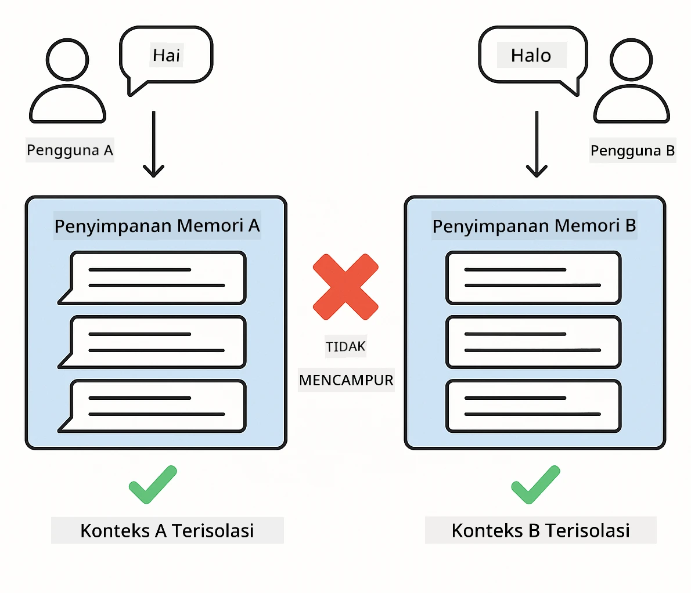
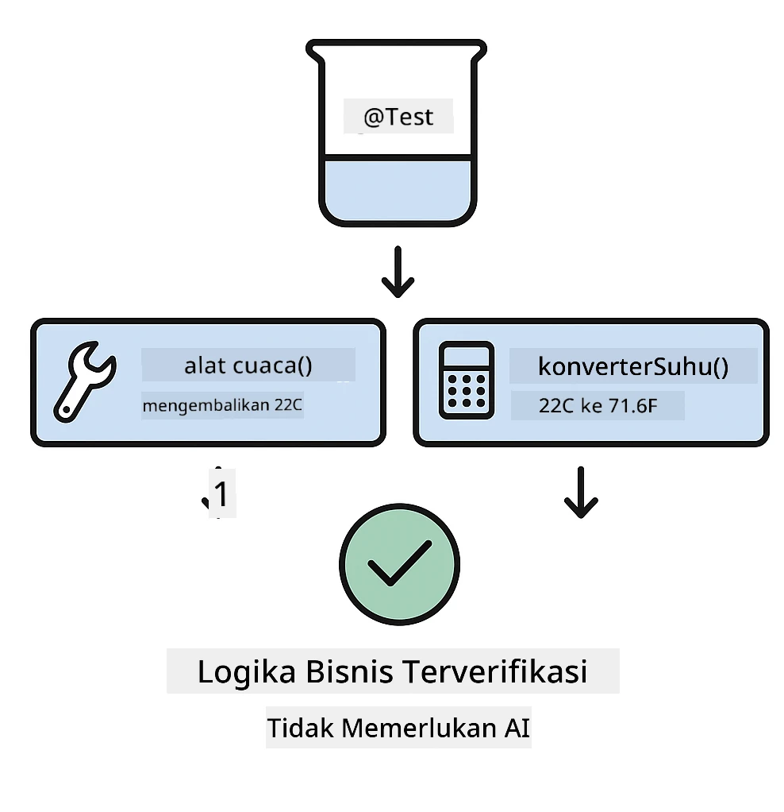
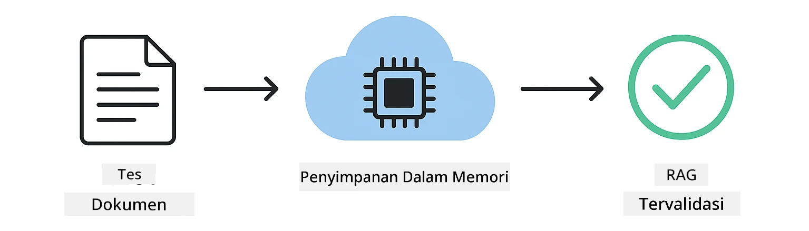

# Menguji Aplikasi LangChain4j

## Daftar Isi

- [Mulai Cepat](#mulai-cepat)
- [Apa yang Diuji oleh Tes](#apa-yang-diuji-oleh-tes)
- [Menjalankan Tes](#menjalankan-tes)
- [Menjalankan Tes di VS Code](#menjalankan-tes-di-vs-code)
- [Polapola Pengujian](#polapola-pengujian)
- [Filosofi Pengujian](#filosofi-pengujian)
- [Langkah Selanjutnya](#langkah-selanjutnya)

Panduan ini memandu Anda melalui tes yang menunjukkan cara menguji aplikasi AI tanpa membutuhkan kunci API atau layanan eksternal.

## Mulai Cepat

Jalankan semua tes dengan satu perintah:

**Bash:**
```bash
mvn test
```

**PowerShell:**
```powershell
mvn --% test
```

Saat semua tes berhasil, Anda akan melihat keluaran seperti tangkapan layar di bawah — tes berjalan tanpa kegagalan.



*Eksekusi tes yang berhasil menunjukkan semua tes lulus tanpa kegagalan*

## Apa yang Diuji oleh Tes

Kursus ini fokus pada **unit test** yang dijalankan secara lokal. Setiap tes menunjukkan konsep LangChain4j tertentu secara terpisah. Piramida pengujian di bawah ini menunjukkan tempat unit test — mereka membentuk fondasi yang cepat dan dapat diandalkan yang membangun strategi pengujian Anda.



*Piramida pengujian menunjukkan keseimbangan antara unit test (cepat, terisolasi), integration test (komponen nyata), dan end-to-end test. Pelatihan ini mencakup pengujian unit.*

| Modul | Tes | Fokus | Berkas Kunci |
|--------|-------|-------|--------------|
| **01 - Pengenalan** | 8 | Memori percakapan dan obrolan dengan status | `SimpleConversationTest.java` |
| **02 - Rekayasa Prompt** | 12 | Polapola GPT-5.2, tingkat keinginan, output terstruktur | `SimpleGpt5PromptTest.java` |
| **03 - RAG** | 10 | Pengambilan dokumen, embeddings, pencarian kemiripan | `DocumentServiceTest.java` |
| **04 - Alat** | 12 | Pemanggilan fungsi dan rantai alat | `SimpleToolsTest.java` |
| **05 - MCP** | 8 | Model Context Protocol dengan transport stdio | `SimpleMcpTest.java` |

## Menjalankan Tes

**Jalankan semua tes dari root:**

**Bash:**
```bash
mvn test
```

**PowerShell:**
```powershell
mvn --% test
```

**Jalankan tes untuk modul tertentu:**

**Bash:**
```bash
cd 01-introduction && mvn test
# Atau dari root
mvn test -pl 01-introduction
```

**PowerShell:**
```powershell
cd 01-introduction; mvn --% test
# Atau dari root
mvn --% test -pl 01-introduction
```

**Jalankan satu kelas tes:**

**Bash:**
```bash
mvn test -Dtest=SimpleConversationTest
```

**PowerShell:**
```powershell
mvn --% test -Dtest=SimpleConversationTest
```

**Jalankan metode tes tertentu:**

**Bash:**
```bash
mvn test -Dtest=SimpleConversationTest#harusMempertahankanRiwayatPercakapan
```

**PowerShell:**
```powershell
mvn --% test -Dtest=SimpleConversationTest#harusMempertahankanRiwayatPercakapan
```

## Menjalankan Tes di VS Code

Jika Anda menggunakan Visual Studio Code, Test Explorer menyediakan antarmuka grafis untuk menjalankan dan debug tes.



*VS Code Test Explorer menampilkan pohon tes dengan semua kelas tes Java dan metode tes individu*

**Untuk menjalankan tes di VS Code:**

1. Buka Test Explorer dengan mengklik ikon tabung di Bar Aktivitas
2. Perluas pohon tes untuk melihat semua modul dan kelas tes
3. Klik tombol putar di samping tes apa pun untuk menjalankannya secara individual
4. Klik "Run All Tests" untuk menjalankan seluruh rangkaian
5. Klik kanan tes mana pun dan pilih "Debug Test" untuk menetapkan breakpoint dan menelusuri kode

Test Explorer menunjukkan tanda centang hijau untuk tes yang berhasil dan memberikan pesan kegagalan rinci ketika tes gagal.

## Polapola Pengujian

### Polapola 1: Menguji Template Prompt

Polapola paling sederhana menguji template prompt tanpa memanggil model AI apapun. Anda memverifikasi bahwa penggantian variabel bekerja dengan benar dan prompt diformat sesuai yang diharapkan.



*Pengujian template prompt menunjukkan alur penggantian variabel: template dengan placeholder → nilai diterapkan → output yang diformat diverifikasi*

```java
@Test
@DisplayName("Should format prompt template with variables")
void testPromptTemplateFormatting() {
    PromptTemplate template = PromptTemplate.from(
        "Best time to visit {{destination}} for {{activity}}?"
    );
    
    Prompt prompt = template.apply(Map.of(
        "destination", "Paris",
        "activity", "sightseeing"
    ));
    
    assertThat(prompt.text()).isEqualTo("Best time to visit Paris for sightseeing?");
}
```

Polapola ini memverifikasi bahwa penggantian variabel bekerja dengan benar dan prompt diformat sesuai harapan — tanpa kunci API atau pemanggilan model.

### Polapola 2: Mocking Model Bahasa

Saat menguji logika percakapan, gunakan Mockito untuk membuat model palsu yang mengembalikan respons yang telah ditentukan. Ini membuat tes cepat, gratis, dan deterministik.



*Perbandingan yang menunjukkan alasan mock lebih disukai untuk pengujian: cepat, gratis, deterministik, dan tidak membutuhkan kunci API*

```java
@ExtendWith(MockitoExtension.class)
class SimpleConversationTest {
    
    private ConversationService conversationService;
    
    @Mock
    private OpenAiOfficialChatModel mockChatModel;
    
    @BeforeEach
    void setUp() {
        ChatResponse mockResponse = ChatResponse.builder()
            .aiMessage(AiMessage.from("This is a test response"))
            .build();
        when(mockChatModel.chat(anyList())).thenReturn(mockResponse);
        
        conversationService = new ConversationService(mockChatModel);
    }
    
    @Test
    void shouldMaintainConversationHistory() {
        String conversationId = conversationService.startConversation();
        
        ChatResponse mockResponse1 = ChatResponse.builder()
            .aiMessage(AiMessage.from("Response 1"))
            .build();
        ChatResponse mockResponse2 = ChatResponse.builder()
            .aiMessage(AiMessage.from("Response 2"))
            .build();
        ChatResponse mockResponse3 = ChatResponse.builder()
            .aiMessage(AiMessage.from("Response 3"))
            .build();
        
        when(mockChatModel.chat(anyList()))
            .thenReturn(mockResponse1)
            .thenReturn(mockResponse2)
            .thenReturn(mockResponse3);

        conversationService.chat(conversationId, "First message");
        conversationService.chat(conversationId, "Second message");
        conversationService.chat(conversationId, "Third message");

        List<ChatMessage> history = conversationService.getHistory(conversationId);
        assertThat(history).hasSize(6); // 3 pesan pengguna + 3 pesan AI
    }
}
```

Polapola ini muncul di `01-introduction/src/test/java/com/example/langchain4j/service/SimpleConversationTest.java`. Mock memastikan perilaku konsisten sehingga Anda dapat memverifikasi pengelolaan memori bekerja dengan benar.

### Polapola 3: Menguji Isolasi Percakapan

Memori percakapan harus menjaga beberapa pengguna terpisah. Tes ini memverifikasi bahwa percakapan tidak mencampurkan konteks.



*Pengujian isolasi percakapan menunjukkan penyimpanan memori terpisah untuk pengguna berbeda agar mencegah pencampuran konteks*

```java
@Test
void shouldIsolateConversationsByid() {
    String conv1 = conversationService.startConversation();
    String conv2 = conversationService.startConversation();
    
    ChatResponse mockResponse = ChatResponse.builder()
        .aiMessage(AiMessage.from("Response"))
        .build();
    when(mockChatModel.chat(anyList())).thenReturn(mockResponse);

    conversationService.chat(conv1, "Message for conversation 1");
    conversationService.chat(conv2, "Message for conversation 2");

    List<ChatMessage> history1 = conversationService.getHistory(conv1);
    List<ChatMessage> history2 = conversationService.getHistory(conv2);
    
    assertThat(history1).hasSize(2);
    assertThat(history2).hasSize(2);
}
```

Setiap percakapan mempertahankan riwayat independennya sendiri. Dalam sistem produksi, isolasi ini penting untuk aplikasi multi-pengguna.

### Polapola 4: Menguji Alat Secara Mandiri

Alat adalah fungsi yang dapat dipanggil AI. Uji alat tersebut langsung untuk memastikan mereka bekerja dengan benar terlepas dari keputusan AI.



*Pengujian alat secara mandiri menunjukkan eksekusi alat mock tanpa panggilan AI untuk memverifikasi logika bisnis*

```java
@Test
void shouldConvertCelsiusToFahrenheit() {
    TemperatureTool tempTool = new TemperatureTool();
    String result = tempTool.celsiusToFahrenheit(25.0);
    assertThat(result).containsPattern("77[.,]0°F");
}

@Test
void shouldDemonstrateToolChaining() {
    WeatherTool weatherTool = new WeatherTool();
    TemperatureTool tempTool = new TemperatureTool();

    String weatherResult = weatherTool.getCurrentWeather("Seattle");
    assertThat(weatherResult).containsPattern("\\d+°C");

    String conversionResult = tempTool.celsiusToFahrenheit(22.0);
    assertThat(conversionResult).containsPattern("71[.,]6°F");
}
```

Tes ini dari `04-tools/src/test/java/com/example/langchain4j/agents/tools/SimpleToolsTest.java` memvalidasi logika alat tanpa keterlibatan AI. Contoh chaining menunjukkan bagaimana output satu alat menjadi input alat lain.

### Polapola 5: Pengujian RAG Dalam Memori

Sistem RAG secara tradisional memerlukan database vektor dan layanan embedding. Polapola dalam memori memungkinkan Anda menguji seluruh pipeline tanpa ketergantungan eksternal.



*Alur kerja pengujian RAG dalam memori memperlihatkan parsing dokumen, penyimpanan embedding, dan pencarian kemiripan tanpa memerlukan database*

```java
@Test
void testProcessTextDocument() {
    String content = "This is a test document.\nIt has multiple lines.";
    InputStream inputStream = new ByteArrayInputStream(content.getBytes(StandardCharsets.UTF_8));
    
    DocumentService.ProcessedDocument result = 
        documentService.processDocument(inputStream, "test.txt");

    assertNotNull(result);
    assertTrue(result.segments().size() > 0);
    assertEquals("test.txt", result.segments().get(0).metadata().getString("filename"));
}
```

Tes ini dari `03-rag/src/test/java/com/example/langchain4j/rag/service/DocumentServiceTest.java` membuat dokumen dalam memori dan memverifikasi teknik pemecahan dan penanganan metadata.

### Polapola 6: Pengujian Integrasi MCP

Modul MCP menguji integrasi Model Context Protocol menggunakan transport stdio. Tes ini memverifikasi aplikasi Anda dapat menjalankan dan berkomunikasi dengan server MCP sebagai subprocess.

Tes di `05-mcp/src/test/java/com/example/langchain4j/mcp/SimpleMcpTest.java` memvalidasi perilaku klien MCP.

**Jalankan:**

**Bash:**
```bash
cd 05-mcp && mvn test
```

**PowerShell:**
```powershell
cd 05-mcp; mvn --% test
```

## Filosofi Pengujian

Uji kode Anda, bukan AI. Tes Anda harus memverifikasi kode yang Anda tulis dengan memeriksa bagaimana prompt dibangun, bagaimana memori dikelola, dan bagaimana alat dijalankan. Respons AI bervariasi dan tidak seharusnya menjadi bagian dari asersi tes. Tanyakan pada diri sendiri apakah template prompt Anda mengganti variabel dengan benar, bukan apakah AI memberikan jawaban yang tepat.

Gunakan mock untuk model bahasa. Mereka adalah dependensi eksternal yang lambat, mahal, dan tidak deterministik. Mock membuat tes cepat dengan millisecond bukan detik, gratis tanpa biaya API, dan deterministik dengan hasil yang sama setiap kali.

Jaga tes agar mandiri. Setiap tes harus menyiapkan data sendiri, tidak bergantung pada tes lain, dan membersihkan dirinya sendiri. Tes harus berhasil terlepas dari urutan eksekusi.

Uji kasus tepi di luar jalur senang. Coba input kosong, input sangat besar, karakter khusus, parameter tidak valid, dan kondisi batas. Ini sering mengungkap bug yang tidak diketahui dalam penggunaan normal.

Gunakan nama deskriptif. Bandingkan `shouldMaintainConversationHistoryAcrossMultipleMessages()` dengan `test1()`. Yang pertama memberi tahu Anda tepat apa yang diuji, membuat debugging kegagalan jauh lebih mudah.

## Langkah Selanjutnya

Sekarang Anda memahami pola pengujian, dalami setiap modul:

- **[01 - Pengenalan](../01-introduction/README.md)** - Pelajari manajemen memori percakapan
- **[02 - Rekayasa Prompt](../02/prompt-engineering/README.md)** - Kuasai polapola prompting GPT-5.2
- **[03 - RAG](../03-rag/README.md)** - Bangun sistem retrieval-augmented generation
- **[04 - Alat](../04-tools/README.md)** - Implementasikan pemanggilan fungsi dan rantai alat
- **[05 - MCP](../05-mcp/README.md)** - Integrasikan Model Context Protocol

README setiap modul menyediakan penjelasan terperinci tentang konsep yang diuji di sini.

---

**Navigasi:** [← Kembali ke Utama](../README.md)

---

<!-- CO-OP TRANSLATOR DISCLAIMER START -->
**Penafian**:
Dokumen ini telah diterjemahkan menggunakan layanan terjemahan AI [Co-op Translator](https://github.com/Azure/co-op-translator). Meskipun kami berupaya untuk mencapai akurasi, harap diketahui bahwa terjemahan otomatis mungkin mengandung kesalahan atau ketidakakuratan. Dokumen asli dalam bahasa aslinya harus dianggap sebagai sumber yang sah. Untuk informasi penting, disarankan menggunakan terjemahan profesional oleh manusia. Kami tidak bertanggung jawab atas kesalahpahaman atau penafsiran yang keliru yang timbul dari penggunaan terjemahan ini.
<!-- CO-OP TRANSLATOR DISCLAIMER END -->