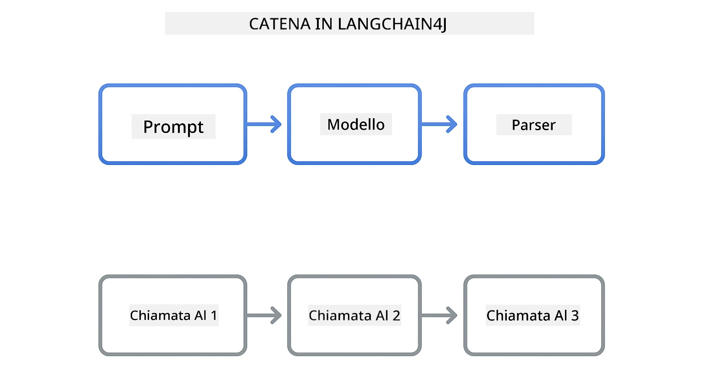
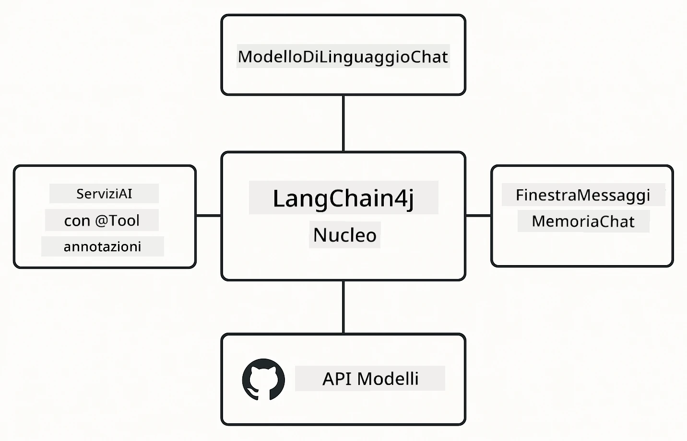

# Modulo 00: Avvio Rapido

## Indice

- [Introduzione](../../../00-quick-start)
- [Cos'è LangChain4j?](../../../00-quick-start)
- [Dipendenze di LangChain4j](../../../00-quick-start)
- [Prerequisiti](../../../00-quick-start)
- [Configurazione](../../../00-quick-start)
  - [1. Ottieni il tuo Token GitHub](../../../00-quick-start)
  - [2. Imposta il tuo Token](../../../00-quick-start)
- [Esegui gli Esempi](../../../00-quick-start)
  - [1. Chat di Base](../../../00-quick-start)
  - [2. Pattern di Prompt](../../../00-quick-start)
  - [3. Chiamata di Funzioni](../../../00-quick-start)
  - [4. Q&A con Documenti (RAG)](../../../00-quick-start)
  - [5. AI Responsabile](../../../00-quick-start)
- [Cosa Mostra Ogni Esempio](../../../00-quick-start)
- [Prossimi Passi](../../../00-quick-start)
- [Risoluzione Problemi](../../../00-quick-start)

## Introduzione

Questo avvio rapido è pensato per farti iniziare con LangChain4j il più velocemente possibile. Copre le basi assolute per costruire applicazioni AI con LangChain4j e GitHub Models. Nei moduli successivi userai Azure OpenAI con LangChain4j per costruire applicazioni più avanzate.

## Cos'è LangChain4j?

LangChain4j è una libreria Java che semplifica la costruzione di applicazioni alimentate da AI. Invece di gestire client HTTP e parsing JSON, lavori con API Java pulite.

La "catena" in LangChain si riferisce alla concatenazione di più componenti: potresti concatenare un prompt a un modello, a un parser, o concatenare più chiamate AI in cui l’output dell’una diventa l’input della successiva. Questo avvio rapido si concentra sulle fondamenta prima di esplorare catene più complesse.



*Concatenazione di componenti in LangChain4j - blocchi costitutivi che si collegano per creare potenti flussi di lavoro AI*

Useremo tre componenti core:

**ChatLanguageModel** - L’interfaccia per le interazioni con il modello AI. Chiama `model.chat("prompt")` e ottieni una stringa di risposta. Usiano `OpenAiOfficialChatModel` che funziona con endpoint compatibili OpenAI come GitHub Models.

**AiServices** - Crea interfacce di servizio AI tipizzate. Definisci metodi, annotali con `@Tool` e LangChain4j gestisce l’orchestrazione. L’AI chiama automaticamente i tuoi metodi Java quando necessario.

**MessageWindowChatMemory** - Mantiene la cronologia della conversazione. Senza questo, ogni richiesta è indipendente. Con esso, l’AI ricorda i messaggi precedenti e mantiene il contesto su più turni.



*Architettura di LangChain4j - componenti core che lavorano insieme per potenziare le tue applicazioni AI*

## Dipendenze di LangChain4j

Questo avvio rapido usa due dipendenze Maven nel file [`pom.xml`](../../../00-quick-start/pom.xml):

```xml
<!-- Core LangChain4j library -->
<dependency>
    <groupId>dev.langchain4j</groupId>
    <artifactId>langchain4j</artifactId> <!-- Inherited from BOM in root pom.xml -->
</dependency>

<!-- OpenAI integration (works with GitHub Models) -->
<dependency>
    <groupId>dev.langchain4j</groupId>
    <artifactId>langchain4j-open-ai-official</artifactId> <!-- Inherited from BOM in root pom.xml -->
</dependency>
```

Il modulo `langchain4j-open-ai-official` fornisce la classe `OpenAiOfficialChatModel` che si collega ad API compatibili OpenAI. GitHub Models usa lo stesso formato API, quindi non è necessario un adattatore speciale - basta puntare l’URL base a `https://models.github.ai/inference`.

## Prerequisiti

**Usi il Dev Container?** Java e Maven sono già installati. Ti serve solo un Token di Accesso Personale GitHub.

**Sviluppo Locale:**
- Java 21+, Maven 3.9+
- Token di Accesso Personale GitHub (istruzioni sotto)

> **Nota:** Questo modulo usa `gpt-4.1-nano` di GitHub Models. Non modificare il nome del modello nel codice - è configurato per funzionare con i modelli disponibili su GitHub.

## Configurazione

### 1. Ottieni il tuo Token GitHub

1. Vai su [Impostazioni GitHub → Token di Accesso Personale](https://github.com/settings/personal-access-tokens)
2. Clicca su "Genera nuovo token"
3. Dai un nome descrittivo (es. "LangChain4j Demo")
4. Imposta la scadenza (7 giorni consigliati)
5. Sotto "Permessi account", trova "Models" e imposta su "Solamente lettura"
6. Clicca su "Genera token"
7. Copia e salva il token - non lo vedrai più

### 2. Imposta il tuo Token

**Opzione 1: Usando VS Code (Consigliato)**

Se usi VS Code, aggiungi il tuo token nel file `.env` nella root del progetto:

Se il file `.env` non esiste, copia `.env.example` in `.env` o crea un nuovo file `.env` nella root del progetto.

**Esempio di file `.env`:**
```bash
# In /workspaces/LangChain4j-for-Beginners/.env
GITHUB_TOKEN=your_token_here
```

Poi puoi semplicemente cliccare con il tasto destro su qualsiasi file demo (es. `BasicChatDemo.java`) nell’Explorer e selezionare **"Run Java"** oppure usare le configurazioni di avvio nel pannello Esegui e Debug.

**Opzione 2: Usando il Terminale**

Imposta il token come variabile d’ambiente:

**Bash:**
```bash
export GITHUB_TOKEN=your_token_here
```

**PowerShell:**
```powershell
$env:GITHUB_TOKEN=your_token_here
```

## Esegui gli Esempi

**Usando VS Code:** Semplicemente clicca con il tasto destro su un file demo nell’Explorer e seleziona **"Run Java"**, oppure usa le configurazioni di avvio nel pannello Esegui e Debug (assicurati prima di aver aggiunto il token nel file `.env`).

**Usando Maven:** In alternativa, puoi lanciare dalla riga di comando:

### 1. Chat di Base

**Bash:**
```bash
mvn compile exec:java -Dexec.mainClass=com.example.langchain4j.quickstart.BasicChatDemo
```

**PowerShell:**
```powershell
mvn --% compile exec:java -Dexec.mainClass=com.example.langchain4j.quickstart.BasicChatDemo
```

### 2. Pattern di Prompt

**Bash:**
```bash
mvn compile exec:java -Dexec.mainClass=com.example.langchain4j.quickstart.PromptEngineeringDemo
```

**PowerShell:**
```powershell
mvn --% compile exec:java -Dexec.mainClass=com.example.langchain4j.quickstart.PromptEngineeringDemo
```

Mostra zero-shot, few-shot, catena di ragionamento e prompt basati sul ruolo.

### 3. Chiamata di Funzioni

**Bash:**
```bash
mvn compile exec:java -Dexec.mainClass=com.example.langchain4j.quickstart.ToolIntegrationDemo
```

**PowerShell:**
```powershell
mvn --% compile exec:java -Dexec.mainClass=com.example.langchain4j.quickstart.ToolIntegrationDemo
```

L’AI chiama automaticamente i tuoi metodi Java quando necessario.

### 4. Q&A con Documenti (RAG)

**Bash:**
```bash
mvn compile exec:java -Dexec.mainClass=com.example.langchain4j.quickstart.SimpleReaderDemo
```

**PowerShell:**
```powershell
mvn --% compile exec:java -Dexec.mainClass=com.example.langchain4j.quickstart.SimpleReaderDemo
```

Fai domande sul contenuto di `document.txt`.

### 5. AI Responsabile

**Bash:**
```bash
mvn compile exec:java -Dexec.mainClass=com.example.langchain4j.quickstart.ResponsibleAIDemo
```

**PowerShell:**
```powershell
mvn --% compile exec:java -Dexec.mainClass=com.example.langchain4j.quickstart.ResponsibleAIDemo
```

Vedi come i filtri di sicurezza AI bloccano contenuti dannosi.

## Cosa Mostra Ogni Esempio

**Chat di Base** - [BasicChatDemo.java](../../../00-quick-start/src/main/java/com/example/langchain4j/quickstart/BasicChatDemo.java)

Inizia qui per vedere LangChain4j nella sua forma più semplice. Creerai un `OpenAiOfficialChatModel`, invierai un prompt con `.chat()` e riceverai una risposta. Questo dimostra la base: come inizializzare modelli con endpoint personalizzati e chiavi API. Una volta capito questo schema, tutto il resto si costruisce sopra.

```java
ChatLanguageModel model = OpenAiOfficialChatModel.builder()
    .baseUrl("https://models.github.ai/inference")
    .apiKey(System.getenv("GITHUB_TOKEN"))
    .modelName("gpt-4.1-nano")
    .build();

String response = model.chat("What is LangChain4j?");
System.out.println(response);
```

> **🤖 Prova con la chat di [GitHub Copilot](https://github.com/features/copilot):** Apri [`BasicChatDemo.java`](../../../00-quick-start/src/main/java/com/example/langchain4j/quickstart/BasicChatDemo.java) e chiedi:
> - "Come passo da GitHub Models a Azure OpenAI in questo codice?"
> - "Quali altri parametri posso configurare in OpenAiOfficialChatModel.builder()?"
> - "Come aggiungo risposte in streaming invece di aspettare la risposta completa?"

**Prompt Engineering** - [PromptEngineeringDemo.java](../../../00-quick-start/src/main/java/com/example/langchain4j/quickstart/PromptEngineeringDemo.java)

Ora che sai come parlare con un modello, esploriamo cosa gli dici. Questa demo usa la stessa configurazione, ma mostra quattro diversi pattern di prompt. Prova prompt zero-shot per istruzioni dirette, few-shot che apprendono dagli esempi, catene di pensiero che mostrano i passi del ragionamento e prompt basati sul ruolo che impostano il contesto. Vedrai come lo stesso modello dia risultati molto diversi a seconda di come formuli la richiesta.

```java
PromptTemplate template = PromptTemplate.from(
    "What's the best time to visit {{destination}} for {{activity}}?"
);

Prompt prompt = template.apply(Map.of(
    "destination", "Paris",
    "activity", "sightseeing"
));

String response = model.chat(prompt.text());
```

> **🤖 Prova con la chat di [GitHub Copilot](https://github.com/features/copilot):** Apri [`PromptEngineeringDemo.java`](../../../00-quick-start/src/main/java/com/example/langchain4j/quickstart/PromptEngineeringDemo.java) e chiedi:
> - "Qual è la differenza tra prompt zero-shot e few-shot, e quando usarli?"
> - "Come influisce il parametro temperature sulle risposte del modello?"
> - "Quali tecniche esistono per evitare attacchi di prompt injection in produzione?"
> - "Come posso creare oggetti PromptTemplate riutilizzabili per pattern comuni?"

**Integrazione di Strumenti** - [ToolIntegrationDemo.java](../../../00-quick-start/src/main/java/com/example/langchain4j/quickstart/ToolIntegrationDemo.java)

Qui LangChain4j diventa potente. Userai `AiServices` per creare un assistente AI che può chiamare i tuoi metodi Java. Basta annotare i metodi con `@Tool("descrizione")` e LangChain4j gestisce il resto - l’AI decide automaticamente quando usare ogni strumento in base a ciò che chiede l’utente. Questo dimostra la chiamata di funzioni, una tecnica chiave per costruire AI capaci di agire, non solo rispondere.

```java
@Tool("Performs addition of two numeric values")
public double add(double a, double b) {
    return a + b;
}

MathAssistant assistant = AiServices.create(MathAssistant.class, model);
String response = assistant.chat("What is 25 plus 17?");
```

> **🤖 Prova con la chat di [GitHub Copilot](https://github.com/features/copilot):** Apri [`ToolIntegrationDemo.java`](../../../00-quick-start/src/main/java/com/example/langchain4j/quickstart/ToolIntegrationDemo.java) e chiedi:
> - "Come funziona l’annotazione @Tool e cosa fa LangChain4j dietro le quinte?"
> - "L’AI può chiamare più strumenti in sequenza per risolvere problemi complessi?"
> - "Cosa succede se uno strumento lancia un’eccezione - come gestisco gli errori?"
> - "Come integrerei una vera API invece di questo esempio di calcolatrice?"

**Q&A con Documenti (RAG)** - [SimpleReaderDemo.java](../../../00-quick-start/src/main/java/com/example/langchain4j/quickstart/SimpleReaderDemo.java)

Qui vedi le basi della RAG (retrieval-augmented generation). Invece di affidarsi ai dati di training del modello, carichi contenuti dal file [`document.txt`](../../../00-quick-start/document.txt) e li includi nel prompt. L’AI risponde basandosi sul tuo documento, non sulla sua conoscenza generale. Questo è il primo passo per costruire sistemi che lavorano con i propri dati.

```java
Document document = FileSystemDocumentLoader.loadDocument("document.txt");
String content = document.text();

String prompt = "Based on this document: " + content + 
                "\nQuestion: What is the main topic?";
String response = model.chat(prompt);
```

> **Nota:** Questo approccio semplice carica l’intero documento nel prompt. Per file grandi (>10KB), supererai i limiti di contesto. Il Modulo 03 tratta chunking e ricerca vettoriale per sistemi RAG di produzione.

> **🤖 Prova con la chat di [GitHub Copilot](https://github.com/features/copilot):** Apri [`SimpleReaderDemo.java`](../../../00-quick-start/src/main/java/com/example/langchain4j/quickstart/SimpleReaderDemo.java) e chiedi:
> - "Come la RAG previene le allucinazioni AI rispetto all’uso dei dati di training del modello?"
> - "Qual è la differenza tra questo approccio semplice e l’uso di embedding vettoriali per il retrieval?"
> - "Come scalerei questo per gestire più documenti o basi di conoscenza più grandi?"
> - "Quali sono le best practice per strutturare il prompt affinché l’AI usi solo il contesto fornito?"

**AI Responsabile** - [ResponsibleAIDemo.java](../../../00-quick-start/src/main/java/com/example/langchain4j/quickstart/ResponsibleAIDemo.java)

Costruisci la sicurezza AI con difesa in profondità. Questa demo mostra due livelli di protezione che lavorano insieme:

**Parte 1: Guardrails di Input di LangChain4j** - Blocca prompt pericolosi prima che raggiungano il LLM. Crea guardrails personalizzati che controllano parole chiave o pattern proibiti. Questi girano nel tuo codice, quindi sono veloci e gratuiti.

```java
class DangerousContentGuardrail implements InputGuardrail {
    @Override
    public InputGuardrailResult validate(UserMessage userMessage) {
        String text = userMessage.singleText().toLowerCase();
        if (text.contains("explosives")) {
            return fatal("Blocked: contains prohibited keyword");
        }
        return success();
    }
}
```

**Parte 2: Filtri di Sicurezza del Provider** - GitHub Models ha filtri integrati che intercettano ciò che i tuoi guardrails potrebbero non vedere. Vedrai blocchi severi (errori HTTP 400) per violazioni gravi e rifiuti soft dove l’AI declina cortesemente.

> **🤖 Prova con la chat di [GitHub Copilot](https://github.com/features/copilot):** Apri [`ResponsibleAIDemo.java`](../../../00-quick-start/src/main/java/com/example/langchain4j/quickstart/ResponsibleAIDemo.java) e chiedi:
> - "Cos’è InputGuardrail e come creo il mio?"
> - "Qual è la differenza tra un blocco severo e un rifiuto soft?"
> - "Perché usare sia guardrails che filtri del provider insieme?"

## Prossimi Passi

**Prossimo Modulo:** [01-introduzione - Iniziare con LangChain4j e gpt-5 su Azure](../01-introduction/README.md)

---

**Navigazione:** [← Torna a Principale](../README.md) | [Prossimo: Modulo 01 - Introduzione →](../01-introduction/README.md)

---

## Risoluzione Problemi

### Primo Build Maven

**Problema**: La prima esecuzione di `mvn clean compile` o `mvn package` richiede molto tempo (10-15 minuti)

**Causa**: Maven deve scaricare tutte le dipendenze di progetto (Spring Boot, librerie LangChain4j, SDK Azure, ecc.) alla prima build.

**Soluzione**: Comportamento normale. Le build successive saranno molto più veloci perché le dipendenze sono in cache locale. Il tempo di download dipende dalla velocità della tua rete.

### Sintassi Comando Maven in PowerShell

**Problema**: I comandi Maven falliscono con errore `Unknown lifecycle phase ".mainClass=..."`

**Causa**: PowerShell interpreta `=` come operatore di assegnazione variabile, non rispettando la sintassi delle proprietà Maven.
**Soluzione**: Usa l'operatore di stop-parsing `--%` prima del comando Maven:

**PowerShell:**
```powershell
mvn --% compile exec:java -Dexec.mainClass=com.example.langchain4j.quickstart.BasicChatDemo
```

**Bash:**
```bash
mvn compile exec:java -Dexec.mainClass=com.example.langchain4j.quickstart.BasicChatDemo
```

L'operatore `--%` dice a PowerShell di passare tutti gli argomenti rimanenti letteralmente a Maven senza interpretazione.

### Visualizzazione Emoji in Windows PowerShell

**Problema**: Le risposte AI mostrano caratteri errati (es. `????` o `â??`) invece delle emoji in PowerShell

**Causa**: La codifica predefinita di PowerShell non supporta le emoji UTF-8

**Soluzione**: Esegui questo comando prima di avviare le applicazioni Java:
```cmd
chcp 65001
```

Questo forza la codifica UTF-8 nel terminale. In alternativa, usa Windows Terminal che ha un miglior supporto Unicode.

### Debug delle Chiamate API

**Problema**: Errori di autenticazione, limiti di velocità o risposte inaspettate dal modello AI

**Soluzione**: Gli esempi includono `.logRequests(true)` e `.logResponses(true)` per mostrare le chiamate API nella console. Questo aiuta a risolvere errori di autenticazione, limiti di velocità o risposte inaspettate. Rimuovi queste opzioni in produzione per ridurre il rumore di log.

---

<!-- CO-OP TRANSLATOR DISCLAIMER START -->
**Disclaimer**:  
Questo documento è stato tradotto utilizzando il servizio di traduzione automatica AI [Co-op Translator](https://github.com/Azure/co-op-translator). Pur impegnandoci per garantire l’accuratezza, si prega di notare che le traduzioni automatiche possono contenere errori o inesattezze. Il documento originale nella lingua di origine deve essere considerato la fonte autorevole. Per informazioni critiche, si raccomanda una traduzione professionale effettuata da un esperto umano. Non ci assumiamo alcuna responsabilità per eventuali incomprensioni o interpretazioni errate derivanti dall’uso di questa traduzione.
<!-- CO-OP TRANSLATOR DISCLAIMER END -->