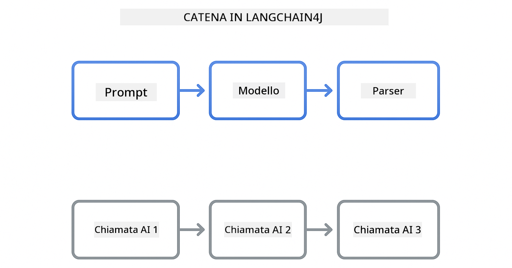

<!--
CO_OP_TRANSLATOR_METADATA:
{
  "original_hash": "377b3e3e6f8d02965bf0fbbc9ccb45c5",
  "translation_date": "2025-12-13T14:52:35+00:00",
  "source_file": "00-quick-start/README.md",
  "language_code": "it"
}
-->
# Module 00: Quick Start

## Table of Contents

- [Introduzione](../../../00-quick-start)
- [Cos'è LangChain4j?](../../../00-quick-start)
- [Dipendenze di LangChain4j](../../../00-quick-start)
- [Prerequisiti](../../../00-quick-start)
- [Configurazione](../../../00-quick-start)
  - [1. Ottieni il tuo token GitHub](../../../00-quick-start)
  - [2. Imposta il tuo token](../../../00-quick-start)
- [Esegui gli esempi](../../../00-quick-start)
  - [1. Chat di base](../../../00-quick-start)
  - [2. Pattern di prompt](../../../00-quick-start)
  - [3. Chiamata di funzioni](../../../00-quick-start)
  - [4. Domande e risposte su documenti (RAG)](../../../00-quick-start)
- [Cosa mostra ogni esempio](../../../00-quick-start)
- [Passi successivi](../../../00-quick-start)
- [Risoluzione dei problemi](../../../00-quick-start)

## Introduzione

Questo quickstart è pensato per farti iniziare a usare LangChain4j il più rapidamente possibile. Copre le basi assolute per costruire applicazioni AI con LangChain4j e GitHub Models. Nei moduli successivi userai Azure OpenAI con LangChain4j per costruire applicazioni più avanzate.

## Cos'è LangChain4j?

LangChain4j è una libreria Java che semplifica la costruzione di applicazioni potenziate dall'AI. Invece di gestire client HTTP e parsing JSON, lavori con API Java pulite.

La "catena" in LangChain si riferisce al concatenare insieme più componenti - potresti concatenare un prompt a un modello a un parser, o concatenare più chiamate AI dove un output alimenta il successivo input. Questo quick start si concentra sui fondamenti prima di esplorare catene più complesse.



*Concatenamento di componenti in LangChain4j - i blocchi costitutivi si connettono per creare potenti flussi di lavoro AI*

Useremo tre componenti principali:

**ChatLanguageModel** - L'interfaccia per le interazioni con il modello AI. Chiama `model.chat("prompt")` e ottieni una stringa di risposta. Usiamo `OpenAiOfficialChatModel` che funziona con endpoint compatibili OpenAI come GitHub Models.

**AiServices** - Crea interfacce di servizio AI tipizzate. Definisci metodi, annotali con `@Tool`, e LangChain4j gestisce l'orchestrazione. L'AI chiama automaticamente i tuoi metodi Java quando necessario.

**MessageWindowChatMemory** - Mantiene la cronologia della conversazione. Senza questo, ogni richiesta è indipendente. Con esso, l'AI ricorda i messaggi precedenti e mantiene il contesto su più turni.


*Architettura di LangChain4j - componenti principali che lavorano insieme per alimentare le tue applicazioni AI*

## Dipendenze di LangChain4j

Questo quick start usa due dipendenze Maven nel [`pom.xml`](../../../00-quick-start/pom.xml):

```xml
<!-- Core LangChain4j library -->
<dependency>
    <groupId>dev.langchain4j</groupId>
    <artifactId>langchain4j</artifactId> <!-- Inherited from BOM in root pom.xml -->
</dependency>

<!-- OpenAI integration (works with GitHub Models) -->
<dependency>
    <groupId>dev.langchain4j</groupId>
    <artifactId>langchain4j-open-ai-official</artifactId> <!-- Inherited from BOM in root pom.xml -->
</dependency>
```

Il modulo `langchain4j-open-ai-official` fornisce la classe `OpenAiOfficialChatModel` che si connette alle API compatibili OpenAI. GitHub Models usa lo stesso formato API, quindi non serve un adattatore speciale - basta puntare l'URL base a `https://models.github.ai/inference`.

## Prerequisiti

**Usi il Dev Container?** Java e Maven sono già installati. Ti serve solo un token di accesso personale GitHub.

**Sviluppo locale:**
- Java 21+, Maven 3.9+
- Token di accesso personale GitHub (istruzioni sotto)

> **Nota:** Questo modulo usa `gpt-4.1-nano` da GitHub Models. Non modificare il nome del modello nel codice - è configurato per funzionare con i modelli disponibili su GitHub.

## Configurazione

### 1. Ottieni il tuo token GitHub

1. Vai su [Impostazioni GitHub → Token di accesso personale](https://github.com/settings/personal-access-tokens)
2. Clicca su "Genera nuovo token"
3. Imposta un nome descrittivo (es. "LangChain4j Demo")
4. Imposta la scadenza (7 giorni consigliati)
5. Sotto "Permessi account", trova "Models" e imposta su "Sola lettura"
6. Clicca su "Genera token"
7. Copia e salva il token - non lo vedrai più

### 2. Imposta il tuo token

**Opzione 1: Usare VS Code (Consigliato)**

Se usi VS Code, aggiungi il token al file `.env` nella radice del progetto:

Se il file `.env` non esiste, copia `.env.example` in `.env` o crea un nuovo file `.env` nella radice del progetto.

**Esempio di file `.env`:**
```bash
# In /workspaces/LangChain4j-for-Beginners/.env
GITHUB_TOKEN=your_token_here
```

Poi puoi semplicemente cliccare con il tasto destro su qualsiasi file demo (es. `BasicChatDemo.java`) nell'Explorer e selezionare **"Run Java"** oppure usare le configurazioni di avvio dal pannello Run and Debug.

**Opzione 2: Usare il Terminale**

Imposta il token come variabile d'ambiente:

**Bash:**
```bash
export GITHUB_TOKEN=your_token_here
```

**PowerShell:**
```powershell
$env:GITHUB_TOKEN=your_token_here
```

## Esegui gli esempi

**Usando VS Code:** Basta cliccare con il tasto destro su un file demo nell'Explorer e selezionare **"Run Java"**, oppure usare le configurazioni di avvio dal pannello Run and Debug (assicurati di aver prima aggiunto il token al file `.env`).

**Usando Maven:** In alternativa, puoi eseguire da linea di comando:

### 1. Chat di base

**Bash:**
```bash
mvn compile exec:java -Dexec.mainClass=com.example.langchain4j.quickstart.BasicChatDemo
```

**PowerShell:**
```powershell
mvn --% compile exec:java -Dexec.mainClass=com.example.langchain4j.quickstart.BasicChatDemo
```

### 2. Pattern di prompt

**Bash:**
```bash
mvn compile exec:java -Dexec.mainClass=com.example.langchain4j.quickstart.PromptEngineeringDemo
```

**PowerShell:**
```powershell
mvn --% compile exec:java -Dexec.mainClass=com.example.langchain4j.quickstart.PromptEngineeringDemo
```

Mostra zero-shot, few-shot, chain-of-thought e prompt basati su ruoli.

### 3. Chiamata di funzioni

**Bash:**
```bash
mvn compile exec:java -Dexec.mainClass=com.example.langchain4j.quickstart.ToolIntegrationDemo
```

**PowerShell:**
```powershell
mvn --% compile exec:java -Dexec.mainClass=com.example.langchain4j.quickstart.ToolIntegrationDemo
```

L'AI chiama automaticamente i tuoi metodi Java quando necessario.

### 4. Domande e risposte su documenti (RAG)

**Bash:**
```bash
mvn compile exec:java -Dexec.mainClass=com.example.langchain4j.quickstart.SimpleReaderDemo
```

**PowerShell:**
```powershell
mvn --% compile exec:java -Dexec.mainClass=com.example.langchain4j.quickstart.SimpleReaderDemo
```

Fai domande sul contenuto di `document.txt`.

## Cosa mostra ogni esempio

**Chat di base** - [BasicChatDemo.java](../../../00-quick-start/src/main/java/com/example/langchain4j/quickstart/BasicChatDemo.java)

Inizia qui per vedere LangChain4j nella sua forma più semplice. Creerai un `OpenAiOfficialChatModel`, invierai un prompt con `.chat()`, e riceverai una risposta. Questo dimostra le basi: come inizializzare modelli con endpoint personalizzati e chiavi API. Una volta compreso questo schema, tutto il resto si basa su di esso.

```java
ChatLanguageModel model = OpenAiOfficialChatModel.builder()
    .baseUrl("https://models.github.ai/inference")
    .apiKey(System.getenv("GITHUB_TOKEN"))
    .modelName("gpt-4.1-nano")
    .build();

String response = model.chat("What is LangChain4j?");
System.out.println(response);
```

> **🤖 Prova con [GitHub Copilot](https://github.com/features/copilot) Chat:** Apri [`BasicChatDemo.java`](../../../00-quick-start/src/main/java/com/example/langchain4j/quickstart/BasicChatDemo.java) e chiedi:
> - "Come posso passare da GitHub Models a Azure OpenAI in questo codice?"
> - "Quali altri parametri posso configurare in OpenAiOfficialChatModel.builder()?"
> - "Come aggiungo risposte in streaming invece di aspettare la risposta completa?"

**Prompt Engineering** - [PromptEngineeringDemo.java](../../../00-quick-start/src/main/java/com/example/langchain4j/quickstart/PromptEngineeringDemo.java)

Ora che sai come parlare a un modello, esploriamo cosa gli dici. Questa demo usa la stessa configurazione modello ma mostra quattro pattern di prompt diversi. Prova prompt zero-shot per istruzioni dirette, few-shot che imparano dagli esempi, chain-of-thought che rivelano i passaggi di ragionamento, e prompt basati su ruoli che impostano il contesto. Vedrai come lo stesso modello dia risultati molto diversi a seconda di come formuli la richiesta.

```java
PromptTemplate template = PromptTemplate.from(
    "What's the best time to visit {{destination}} for {{activity}}?"
);

Prompt prompt = template.apply(Map.of(
    "destination", "Paris",
    "activity", "sightseeing"
));

String response = model.chat(prompt.text());
```

> **🤖 Prova con [GitHub Copilot](https://github.com/features/copilot) Chat:** Apri [`PromptEngineeringDemo.java`](../../../00-quick-start/src/main/java/com/example/langchain4j/quickstart/PromptEngineeringDemo.java) e chiedi:
> - "Qual è la differenza tra zero-shot e few-shot prompting, e quando dovrei usare ciascuno?"
> - "Come influisce il parametro temperatura sulle risposte del modello?"
> - "Quali sono alcune tecniche per prevenire attacchi di prompt injection in produzione?"
> - "Come posso creare oggetti PromptTemplate riutilizzabili per pattern comuni?"

**Integrazione di strumenti** - [ToolIntegrationDemo.java](../../../00-quick-start/src/main/java/com/example/langchain4j/quickstart/ToolIntegrationDemo.java)

Qui LangChain4j diventa potente. Userai `AiServices` per creare un assistente AI che può chiamare i tuoi metodi Java. Basta annotare i metodi con `@Tool("descrizione")` e LangChain4j gestisce il resto - l'AI decide automaticamente quando usare ogni strumento in base a cosa chiede l'utente. Questo dimostra la chiamata di funzioni, una tecnica chiave per costruire AI che può agire, non solo rispondere a domande.

```java
@Tool("Performs addition of two numeric values")
public double add(double a, double b) {
    return a + b;
}

MathAssistant assistant = AiServices.create(MathAssistant.class, model);
String response = assistant.chat("What is 25 plus 17?");
```

> **🤖 Prova con [GitHub Copilot](https://github.com/features/copilot) Chat:** Apri [`ToolIntegrationDemo.java`](../../../00-quick-start/src/main/java/com/example/langchain4j/quickstart/ToolIntegrationDemo.java) e chiedi:
> - "Come funziona l'annotazione @Tool e cosa fa LangChain4j dietro le quinte?"
> - "L'AI può chiamare più strumenti in sequenza per risolvere problemi complessi?"
> - "Cosa succede se uno strumento genera un'eccezione - come gestisco gli errori?"
> - "Come integrerei una vera API invece di questo esempio di calcolatrice?"

**Domande e risposte su documenti (RAG)** - [SimpleReaderDemo.java](../../../00-quick-start/src/main/java/com/example/langchain4j/quickstart/SimpleReaderDemo.java)

Qui vedrai le basi di RAG (retrieval-augmented generation). Invece di affidarti ai dati di addestramento del modello, carichi contenuti da [`document.txt`](../../../00-quick-start/document.txt) e li includi nel prompt. L'AI risponde basandosi sul tuo documento, non sulla sua conoscenza generale. Questo è il primo passo per costruire sistemi che possono lavorare con i tuoi dati.

```java
Document document = FileSystemDocumentLoader.loadDocument("document.txt");
String content = document.text();

String prompt = "Based on this document: " + content + 
                "\nQuestion: What is the main topic?";
String response = model.chat(prompt);
```

> **Nota:** Questo approccio semplice carica l'intero documento nel prompt. Per file grandi (>10KB), supererai i limiti di contesto. Il Modulo 03 copre chunking e ricerca vettoriale per sistemi RAG di produzione.

> **🤖 Prova con [GitHub Copilot](https://github.com/features/copilot) Chat:** Apri [`SimpleReaderDemo.java`](../../../00-quick-start/src/main/java/com/example/langchain4j/quickstart/SimpleReaderDemo.java) e chiedi:
> - "Come RAG previene le allucinazioni AI rispetto all'uso dei dati di addestramento del modello?"
> - "Qual è la differenza tra questo approccio semplice e l'uso di embedding vettoriali per il recupero?"
> - "Come scalerei questo per gestire più documenti o basi di conoscenza più grandi?"
> - "Quali sono le best practice per strutturare il prompt per assicurare che l'AI usi solo il contesto fornito?"

## Debugging

Gli esempi includono `.logRequests(true)` e `.logResponses(true)` per mostrare le chiamate API in console. Questo aiuta a risolvere errori di autenticazione, limiti di velocità o risposte inattese. Rimuovi questi flag in produzione per ridurre il rumore nei log.

## Passi successivi

**Modulo successivo:** [01-introduction - Iniziare con LangChain4j e gpt-5 su Azure](../01-introduction/README.md)

---

**Navigazione:** [← Torna al principale](../README.md) | [Successivo: Modulo 01 - Introduzione →](../01-introduction/README.md)

---

## Risoluzione dei problemi

### Prima compilazione Maven

**Problema**: Il primo `mvn clean compile` o `mvn package` impiega molto tempo (10-15 minuti)

**Causa**: Maven deve scaricare tutte le dipendenze del progetto (Spring Boot, librerie LangChain4j, SDK Azure, ecc.) alla prima compilazione.

**Soluzione**: Questo è comportamento normale. Le compilazioni successive saranno molto più veloci perché le dipendenze sono memorizzate in cache localmente. Il tempo di download dipende dalla velocità della tua rete.

### Sintassi comando Maven in PowerShell

**Problema**: I comandi Maven falliscono con errore `Unknown lifecycle phase ".mainClass=..."`

**Causa**: PowerShell interpreta `=` come operatore di assegnazione variabile, rompendo la sintassi delle proprietà Maven

**Soluzione**: Usa l'operatore stop-parsing `--%` prima del comando Maven:

**PowerShell:**
```powershell
mvn --% compile exec:java -Dexec.mainClass=com.example.langchain4j.quickstart.BasicChatDemo
```

**Bash:**
```bash
mvn compile exec:java -Dexec.mainClass=com.example.langchain4j.quickstart.BasicChatDemo
```

L'operatore `--%` dice a PowerShell di passare tutti gli argomenti rimanenti letteralmente a Maven senza interpretarli.

### Visualizzazione emoji in Windows PowerShell

**Problema**: Le risposte AI mostrano caratteri strani (es. `????` o `â??`) invece delle emoji in PowerShell

**Causa**: La codifica predefinita di PowerShell non supporta le emoji UTF-8

**Soluzione**: Esegui questo comando prima di eseguire applicazioni Java:
```cmd
chcp 65001
```

Questo forza la codifica UTF-8 nel terminale. In alternativa, usa Windows Terminal che ha un supporto Unicode migliore.

---

<!-- CO-OP TRANSLATOR DISCLAIMER START -->
**Disclaimer**:  
Questo documento è stato tradotto utilizzando il servizio di traduzione automatica [Co-op Translator](https://github.com/Azure/co-op-translator). Pur impegnandoci per garantire l’accuratezza, si prega di notare che le traduzioni automatiche possono contenere errori o imprecisioni. Il documento originale nella sua lingua nativa deve essere considerato la fonte autorevole. Per informazioni critiche, si raccomanda una traduzione professionale effettuata da un umano. Non ci assumiamo alcuna responsabilità per eventuali malintesi o interpretazioni errate derivanti dall’uso di questa traduzione.
<!-- CO-OP TRANSLATOR DISCLAIMER END -->