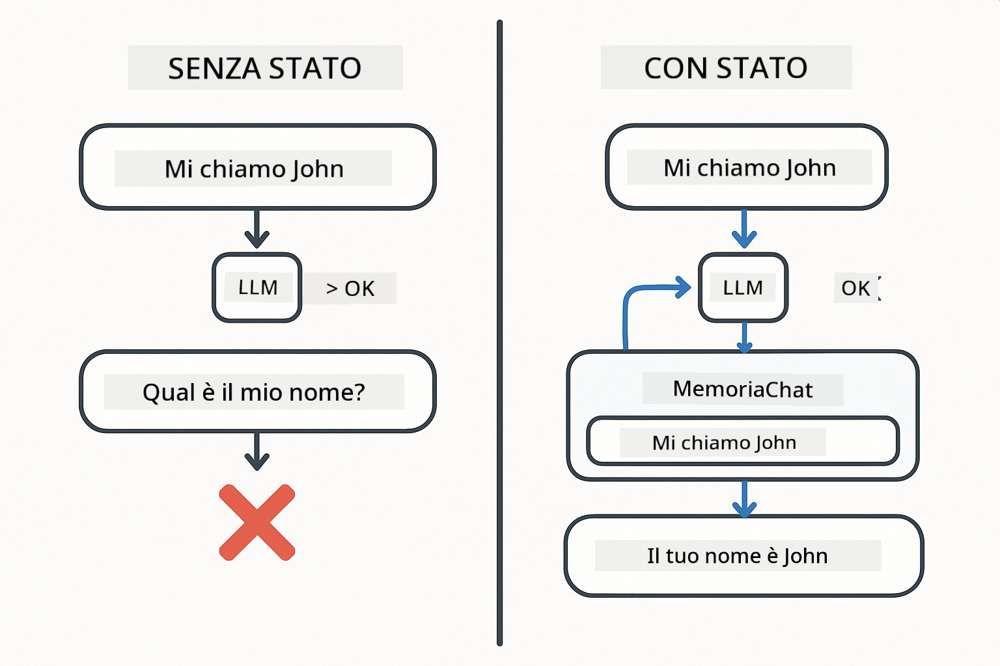
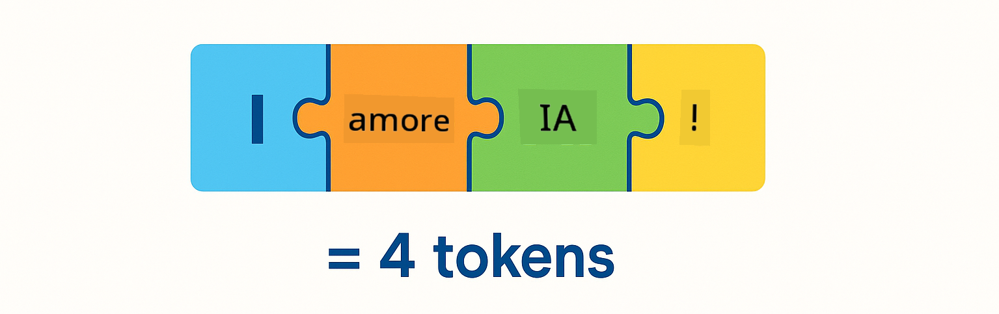
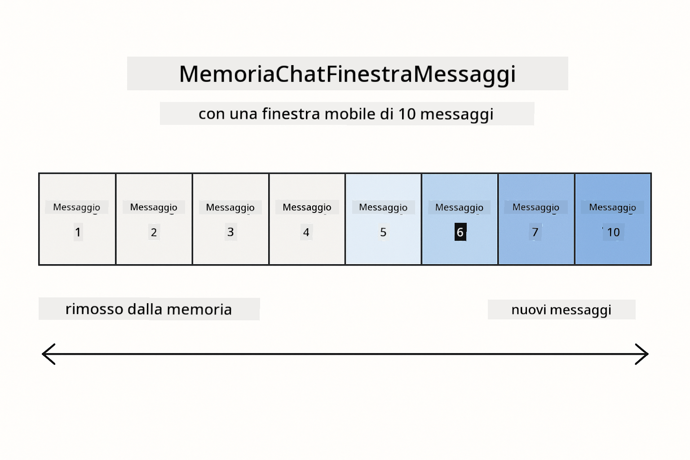
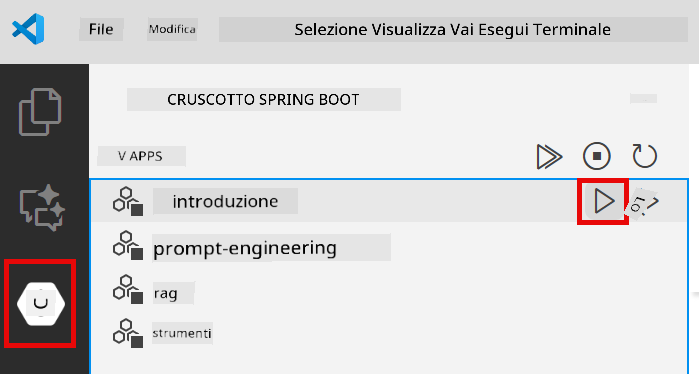
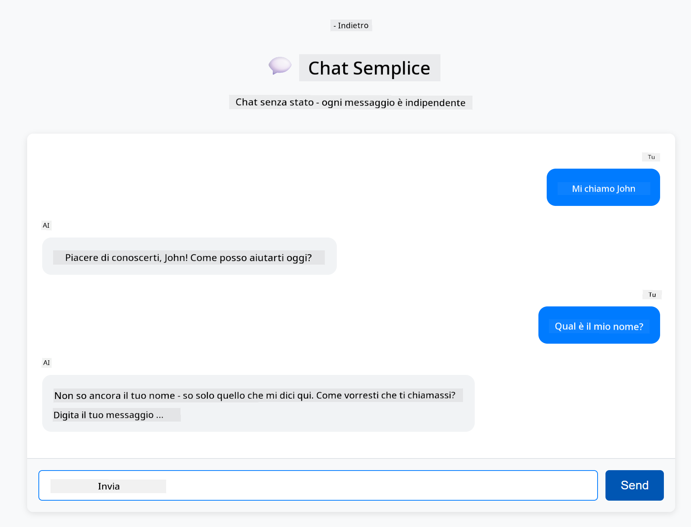
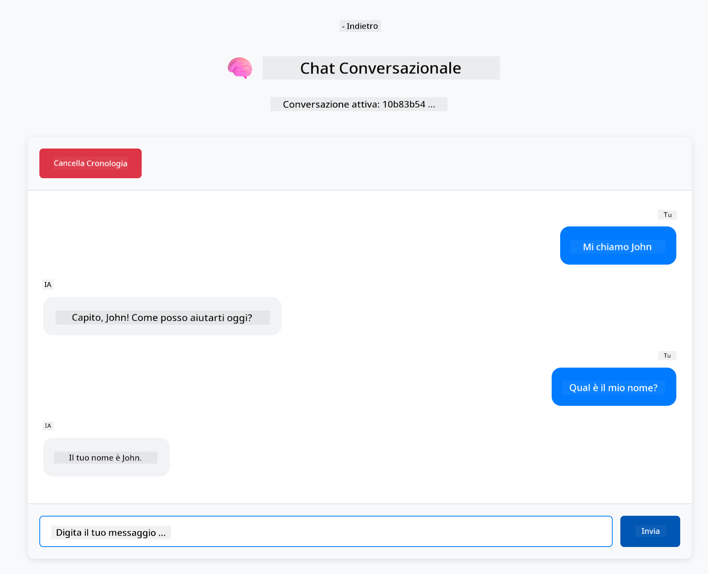

<!--
CO_OP_TRANSLATOR_METADATA:
{
  "original_hash": "c3e07ca58d0b8a3f47d3bf5728541e0a",
  "translation_date": "2025-12-13T13:32:06+00:00",
  "source_file": "01-introduction/README.md",
  "language_code": "it"
}
-->
# Modulo 01: Iniziare con LangChain4j

## Indice

- [Cosa Imparerai](../../../01-introduction)
- [Prerequisiti](../../../01-introduction)
- [Comprendere il Problema Principale](../../../01-introduction)
- [Comprendere i Token](../../../01-introduction)
- [Come Funziona la Memoria](../../../01-introduction)
- [Come Questo Usa LangChain4j](../../../01-introduction)
- [Distribuire l'Infrastruttura Azure OpenAI](../../../01-introduction)
- [Eseguire l'Applicazione Localmente](../../../01-introduction)
- [Usare l'Applicazione](../../../01-introduction)
  - [Chat Stateless (Pannello Sinistro)](../../../01-introduction)
  - [Chat Stateful (Pannello Destro)](../../../01-introduction)
- [Passi Successivi](../../../01-introduction)

## Cosa Imparerai

Se hai completato il quick start, hai visto come inviare prompt e ricevere risposte. Questa è la base, ma le applicazioni reali necessitano di più. Questo modulo ti insegna come costruire un'IA conversazionale che ricorda il contesto e mantiene lo stato - la differenza tra una demo occasionale e un'applicazione pronta per la produzione.

Useremo GPT-5 di Azure OpenAI in tutta questa guida perché le sue capacità avanzate di ragionamento rendono più evidenti i comportamenti dei diversi pattern. Quando aggiungi la memoria, vedrai chiaramente la differenza. Questo rende più facile capire cosa ogni componente apporta alla tua applicazione.

Costruirai un'applicazione che dimostra entrambi i pattern:

**Chat Stateless** - Ogni richiesta è indipendente. Il modello non ha memoria dei messaggi precedenti. Questo è il pattern che hai usato nel quick start.

**Conversazione Stateful** - Ogni richiesta include la cronologia della conversazione. Il modello mantiene il contesto attraverso più turni. Questo è ciò che richiedono le applicazioni di produzione.

## Prerequisiti

- Sottoscrizione Azure con accesso a Azure OpenAI
- Java 21, Maven 3.9+
- Azure CLI (https://learn.microsoft.com/en-us/cli/azure/install-azure-cli)
- Azure Developer CLI (azd) (https://learn.microsoft.com/en-us/azure/developer/azure-developer-cli/install-azd)

> **Nota:** Java, Maven, Azure CLI e Azure Developer CLI (azd) sono preinstallati nel devcontainer fornito.

> **Nota:** Questo modulo usa GPT-5 su Azure OpenAI. Il deployment è configurato automaticamente tramite `azd up` - non modificare il nome del modello nel codice.

## Comprendere il Problema Principale

I modelli linguistici sono stateless. Ogni chiamata API è indipendente. Se invii "Mi chiamo John" e poi chiedi "Come mi chiamo?", il modello non ha idea che ti sei appena presentato. Tratta ogni richiesta come se fosse la prima conversazione che hai mai avuto.

Questo va bene per semplici Q&A ma è inutile per applicazioni reali. I bot di assistenza clienti devono ricordare cosa gli hai detto. Gli assistenti personali necessitano di contesto. Qualsiasi conversazione a più turni richiede memoria.



*La differenza tra conversazioni stateless (chiamate indipendenti) e stateful (consapevoli del contesto)*

## Comprendere i Token

Prima di immergerci nelle conversazioni, è importante capire i token - le unità base di testo che i modelli linguistici elaborano:



*Esempio di come il testo viene suddiviso in token - "I love AI!" diventa 4 unità di elaborazione separate*

I token sono come i modelli AI misurano ed elaborano il testo. Parole, punteggiatura e persino spazi possono essere token. Il tuo modello ha un limite su quanti token può elaborare contemporaneamente (400.000 per GPT-5, con fino a 272.000 token in input e 128.000 in output). Capire i token ti aiuta a gestire la lunghezza della conversazione e i costi.

## Come Funziona la Memoria

La memoria della chat risolve il problema stateless mantenendo la cronologia della conversazione. Prima di inviare la tua richiesta al modello, il framework antepone i messaggi precedenti rilevanti. Quando chiedi "Come mi chiamo?", il sistema invia in realtà l'intera cronologia della conversazione, permettendo al modello di vedere che hai detto "Mi chiamo John" in precedenza.

LangChain4j fornisce implementazioni di memoria che gestiscono questo automaticamente. Scegli quanti messaggi mantenere e il framework gestisce la finestra di contesto.



*MessageWindowChatMemory mantiene una finestra scorrevole dei messaggi recenti, eliminando automaticamente quelli più vecchi*

## Come Questo Usa LangChain4j

Questo modulo estende il quick start integrando Spring Boot e aggiungendo la memoria della conversazione. Ecco come si collegano i pezzi:

**Dipendenze** - Aggiungi due librerie LangChain4j:

```xml
<dependency>
    <groupId>dev.langchain4j</groupId>
    <artifactId>langchain4j</artifactId> <!-- Inherited from BOM in root pom.xml -->
</dependency>
<dependency>
    <groupId>dev.langchain4j</groupId>
    <artifactId>langchain4j-open-ai-official</artifactId> <!-- Inherited from BOM in root pom.xml -->
</dependency>
```

**Modello Chat** - Configura Azure OpenAI come bean Spring ([LangChainConfig.java](../../../01-introduction/src/main/java/com/example/langchain4j/config/LangChainConfig.java)):

```java
@Bean
public OpenAiOfficialChatModel openAiOfficialChatModel() {
    return OpenAiOfficialChatModel.builder()
            .baseUrl(azureEndpoint)
            .apiKey(azureApiKey)
            .modelName(deploymentName)
            .timeout(Duration.ofMinutes(5))
            .maxRetries(3)
            .build();
}
```

Il builder legge le credenziali dalle variabili d'ambiente impostate da `azd up`. Impostare `baseUrl` al tuo endpoint Azure fa funzionare il client OpenAI con Azure OpenAI.

**Memoria della Conversazione** - Traccia la cronologia chat con MessageWindowChatMemory ([ConversationService.java](../../../01-introduction/src/main/java/com/example/langchain4j/service/ConversationService.java)):

```java
ChatMemory memory = MessageWindowChatMemory.withMaxMessages(10);

memory.add(UserMessage.from("My name is John"));
memory.add(AiMessage.from("Nice to meet you, John!"));

memory.add(UserMessage.from("What's my name?"));
AiMessage aiMessage = chatModel.chat(memory.messages()).aiMessage();
memory.add(aiMessage);
```

Crea la memoria con `withMaxMessages(10)` per mantenere gli ultimi 10 messaggi. Aggiungi messaggi utente e AI con wrapper tipizzati: `UserMessage.from(text)` e `AiMessage.from(text)`. Recupera la cronologia con `memory.messages()` e inviala al modello. Il servizio memorizza istanze di memoria separate per ID conversazione, permettendo a più utenti di chattare simultaneamente.

> **🤖 Prova con [GitHub Copilot](https://github.com/features/copilot) Chat:** Apri [`ConversationService.java`](../../../01-introduction/src/main/java/com/example/langchain4j/service/ConversationService.java) e chiedi:
> - "Come decide MessageWindowChatMemory quali messaggi eliminare quando la finestra è piena?"
> - "Posso implementare una memorizzazione personalizzata usando un database invece della memoria in RAM?"
> - "Come potrei aggiungere un riassunto per comprimere la cronologia della conversazione vecchia?"

L'endpoint chat stateless salta completamente la memoria - solo `chatModel.chat(prompt)` come nel quick start. L'endpoint stateful aggiunge messaggi alla memoria, recupera la cronologia e include quel contesto in ogni richiesta. Stessa configurazione modello, pattern diversi.

## Distribuire l'Infrastruttura Azure OpenAI

**Bash:**
```bash
cd 01-introduction
azd up  # Seleziona l'abbonamento e la posizione (consigliato eastus2)
```

**PowerShell:**
```powershell
cd 01-introduction
azd up  # Seleziona l'abbonamento e la posizione (consigliato eastus2)
```

> **Nota:** Se incontri un errore di timeout (`RequestConflict: Cannot modify resource ... provisioning state is not terminal`), esegui semplicemente di nuovo `azd up`. Le risorse Azure potrebbero essere ancora in fase di provisioning in background, e riprovare permette al deployment di completarsi una volta che le risorse raggiungono uno stato terminale.

Questo farà:
1. Distribuire la risorsa Azure OpenAI con modelli GPT-5 e text-embedding-3-small
2. Generare automaticamente il file `.env` nella radice del progetto con le credenziali
3. Configurare tutte le variabili d'ambiente richieste

**Problemi con il deployment?** Consulta il [README dell'Infrastruttura](infra/README.md) per una risoluzione dettagliata dei problemi, inclusi conflitti di nomi di sottodomini, passaggi manuali per il deployment tramite Azure Portal e guida alla configurazione del modello.

**Verifica che il deployment sia riuscito:**

**Bash:**
```bash
cat ../.env  # Dovrebbe mostrare AZURE_OPENAI_ENDPOINT, API_KEY, ecc.
```

**PowerShell:**
```powershell
Get-Content ..\.env  # Dovrebbe mostrare AZURE_OPENAI_ENDPOINT, API_KEY, ecc.
```

> **Nota:** Il comando `azd up` genera automaticamente il file `.env`. Se devi aggiornarlo in seguito, puoi modificare manualmente il file `.env` oppure rigenerarlo eseguendo:
>
> **Bash:**
> ```bash
> cd ..
> bash .azd-env.sh
> ```
>
> **PowerShell:**
> ```powershell
> cd ..
> .\.azd-env.ps1
> ```

## Eseguire l'Applicazione Localmente

**Verifica il deployment:**

Assicurati che il file `.env` esista nella directory radice con le credenziali Azure:

**Bash:**
```bash
cat ../.env  # Dovrebbe mostrare AZURE_OPENAI_ENDPOINT, API_KEY, DEPLOYMENT
```

**PowerShell:**
```powershell
Get-Content ..\.env  # Dovrebbe mostrare AZURE_OPENAI_ENDPOINT, API_KEY, DEPLOYMENT
```

**Avvia le applicazioni:**

**Opzione 1: Usare Spring Boot Dashboard (Consigliato per utenti VS Code)**

Il dev container include l'estensione Spring Boot Dashboard, che fornisce un'interfaccia visiva per gestire tutte le applicazioni Spring Boot. Puoi trovarla nella Activity Bar sul lato sinistro di VS Code (cerca l'icona Spring Boot).

Dal Spring Boot Dashboard puoi:
- Vedere tutte le applicazioni Spring Boot disponibili nell'area di lavoro
- Avviare/fermare le applicazioni con un solo clic
- Visualizzare i log delle applicazioni in tempo reale
- Monitorare lo stato delle applicazioni

Clicca semplicemente il pulsante play accanto a "introduction" per avviare questo modulo, oppure avvia tutti i moduli insieme.



**Opzione 2: Usare script shell**

Avvia tutte le applicazioni web (moduli 01-04):

**Bash:**
```bash
cd ..  # Dalla directory principale
./start-all.sh
```

**PowerShell:**
```powershell
cd ..  # Dalla directory principale
.\start-all.ps1
```

Oppure avvia solo questo modulo:

**Bash:**
```bash
cd 01-introduction
./start.sh
```

**PowerShell:**
```powershell
cd 01-introduction
.\start.ps1
```

Entrambi gli script caricano automaticamente le variabili d'ambiente dal file `.env` nella radice e compileranno i JAR se non esistono.

> **Nota:** Se preferisci compilare manualmente tutti i moduli prima di avviare:
>
> **Bash:**
> ```bash
> cd ..  # Go to root directory
> mvn clean package -DskipTests
> ```
>
> **PowerShell:**
> ```powershell
> cd ..  # Go to root directory
> mvn clean package -DskipTests
> ```

Apri http://localhost:8080 nel tuo browser.

**Per fermare:**

**Bash:**
```bash
./stop.sh  # Solo questo modulo
# O
cd .. && ./stop-all.sh  # Tutti i moduli
```

**PowerShell:**
```powershell
.\stop.ps1  # Solo questo modulo
# O
cd ..; .\stop-all.ps1  # Tutti i moduli
```

## Usare l'Applicazione

L'applicazione fornisce un'interfaccia web con due implementazioni di chat affiancate.


*Dashboard che mostra sia l'opzione Simple Chat (stateless) che Conversational Chat (stateful)*

### Chat Stateless (Pannello Sinistro)

Prova prima questa. Chiedi "Mi chiamo John" e poi subito dopo "Come mi chiamo?" Il modello non ricorderà perché ogni messaggio è indipendente. Questo dimostra il problema principale con l'integrazione base del modello linguistico - nessun contesto di conversazione.



*L'IA non ricorda il tuo nome dal messaggio precedente*

### Chat Stateful (Pannello Destro)

Ora prova la stessa sequenza qui. Chiedi "Mi chiamo John" e poi "Come mi chiamo?" Questa volta lo ricorda. La differenza è MessageWindowChatMemory - mantiene la cronologia della conversazione e la include in ogni richiesta. Questo è come funziona l'IA conversazionale in produzione.



*L'IA ricorda il tuo nome detto in precedenza nella conversazione*

Entrambi i pannelli usano lo stesso modello GPT-5. L'unica differenza è la memoria. Questo rende chiaro cosa la memoria apporta alla tua applicazione e perché è essenziale per casi d'uso reali.

## Passi Successivi

**Modulo Successivo:** [02-prompt-engineering - Prompt Engineering con GPT-5](../02-prompt-engineering/README.md)

---

**Navigazione:** [← Precedente: Modulo 00 - Quick Start](../00-quick-start/README.md) | [Torna al Principale](../README.md) | [Successivo: Modulo 02 - Prompt Engineering →](../02-prompt-engineering/README.md)

---

<!-- CO-OP TRANSLATOR DISCLAIMER START -->
**Disclaimer**:  
Questo documento è stato tradotto utilizzando il servizio di traduzione automatica [Co-op Translator](https://github.com/Azure/co-op-translator). Pur impegnandoci per garantire l’accuratezza, si prega di notare che le traduzioni automatiche possono contenere errori o imprecisioni. Il documento originale nella sua lingua nativa deve essere considerato la fonte autorevole. Per informazioni critiche, si raccomanda una traduzione professionale effettuata da un umano. Non ci assumiamo alcuna responsabilità per eventuali malintesi o interpretazioni errate derivanti dall’uso di questa traduzione.
<!-- CO-OP TRANSLATOR DISCLAIMER END -->