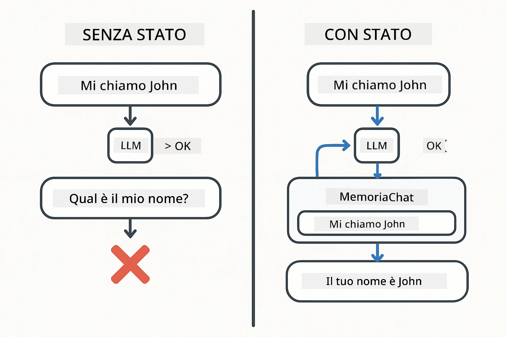
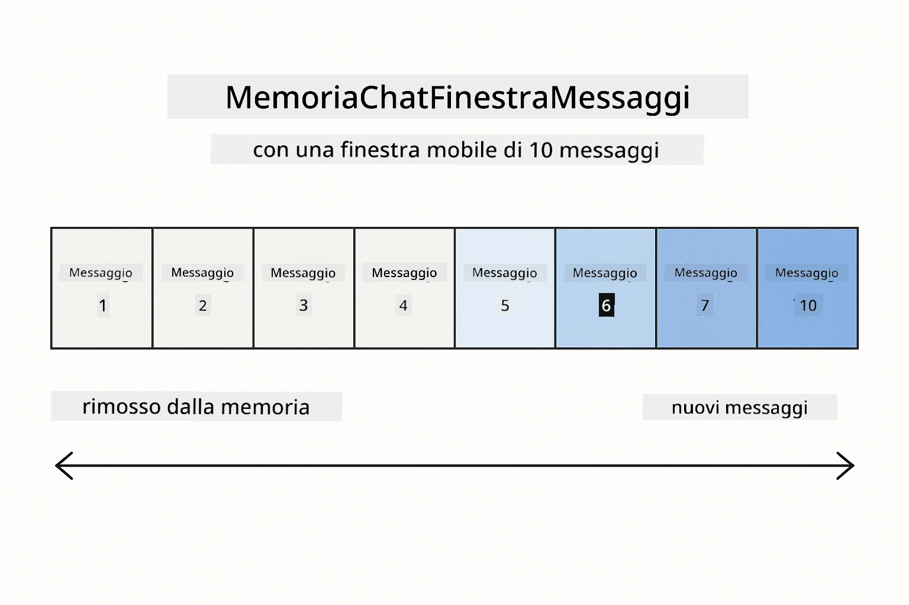
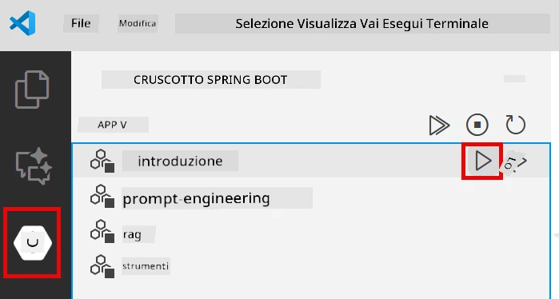
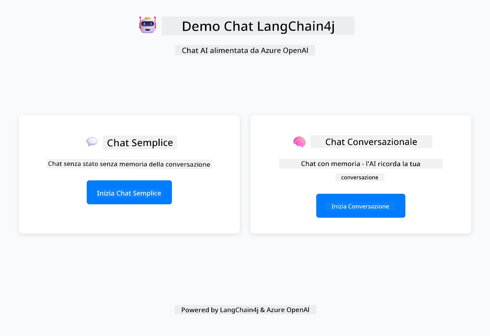
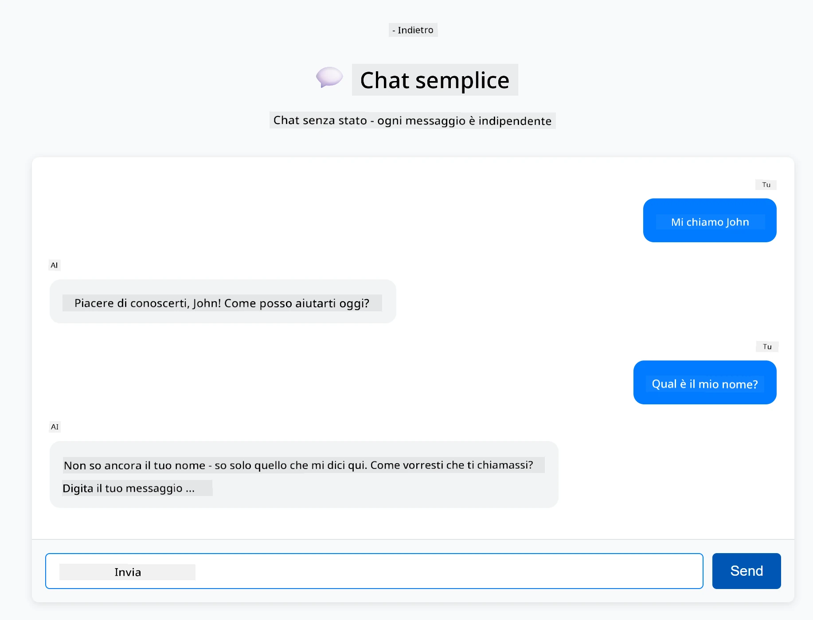
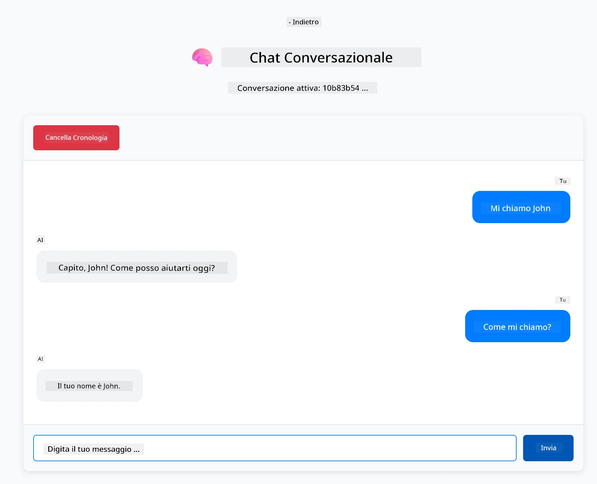

# Modulo 01: Iniziare con LangChain4j

## Indice

- [Video Dimostrativo](#video-dimostrativo)
- [Cosa Imparerai](#cosa-imparerai)
- [Prerequisiti](#prerequisiti)
- [Comprendere il Problema Centrale](#comprendere-il-problema-centrale)
- [Comprendere i Token](#comprendere-i-token)
- [Come Funziona la Memoria](#come-funziona-la-memoria)
- [Come Questo Usa LangChain4j](#come-questo-usa-langchain4j)
- [Distribuire l'Infrastruttura Azure OpenAI](#distribuire-linfrastruttura-azure-openai)
- [Eseguire l'Applicazione Localmente](#eseguire-lapplicazione-localmente)
- [Usare l'Applicazione](#usare-lapplicazione)
  - [Chat Stateless (Pannello Sinistro)](#chat-stateless-pannello-sinistro)
  - [Chat Stateful (Pannello Destro)](#chat-stateful-pannello-destro)
- [Passi Successivi](#passi-successivi)

## Video Dimostrativo

Guarda questa sessione live che spiega come iniziare con questo modulo:

<a href="https://www.youtube.com/live/nl_troDm8rQ?si=6b85S8xGjWnT2fX9"></a>

## Cosa Imparerai

Questo è il tuo punto di partenza con LangChain4j e Azure OpenAI. Iniziamo con i fondamenti e cominciamo a costruire applicazioni in stile produzione. Questo modulo si concentra sull'intelligenza artificiale conversazionale che ricorda il contesto e mantiene lo stato — i concetti fondamentali su cui si basano tutti i moduli successivi.

Useremo GPT-5.2 di Azure OpenAI per tutta la guida perché le sue capacità avanzate di ragionamento rendono più evidente il comportamento dei diversi pattern. Quando aggiungi la memoria, vedrai chiaramente la differenza. Questo rende più facile capire cosa ogni componente porta alla tua applicazione.

Costruirai un’applicazione che dimostra entrambi i pattern:

**Chat Stateless** - Ogni richiesta è indipendente. Il modello non ha memoria dei messaggi precedenti. Questo è il punto di partenza più semplice.

**Conversazione Stateful** - Ogni richiesta include la cronologia della conversazione. Il modello mantiene il contesto su più turni. Questo è ciò di cui hanno bisogno le applicazioni di produzione.

## Prerequisiti

- Sottoscrizione Azure con accesso Azure OpenAI
- Java 21, Maven 3.9+
- Azure CLI (https://learn.microsoft.com/en-us/cli/azure/install-azure-cli)
- Azure Developer CLI (azd) (https://learn.microsoft.com/en-us/azure/developer/azure-developer-cli/install-azd)

> **Nota:** Java, Maven, Azure CLI e Azure Developer CLI (azd) sono preinstallati nel devcontainer fornito.

> **Nota:** Questo modulo usa GPT-5.2 su Azure OpenAI. Il deployment è configurato automaticamente tramite `azd up` - non modificare il nome del modello nel codice.

## Comprendere il Problema Centrale

I modelli di linguaggio sono stateless. Ogni chiamata API è indipendente. Se invii "Mi chiamo John" e poi chiedi "Come mi chiamo?", il modello non ha idea che ti sei appena presentato. Tratta ogni richiesta come se fosse la prima conversazione che hai mai avuto.

Questo va bene per semplici Q&A ma è inutile per applicazioni reali. I bot di assistenza clienti devono ricordare cosa hai detto. Gli assistenti personali hanno bisogno di contesto. Qualsiasi conversazione multi-turno richiede memoria.

Il diagramma seguente contrappone i due approcci — a sinistra, una chiamata stateless che dimentica il tuo nome; a destra, una chiamata stateful supportata da ChatMemory che lo ricorda.



*La differenza tra conversazioni stateless (chiamate indipendenti) e stateful (consapevoli del contesto)*

## Comprendere i Token

Prima di immergerci nelle conversazioni, è importante capire i token - le unità base di testo che i modelli di linguaggio elaborano:


*Esempio di come il testo viene suddiviso in token - "I love AI!" diventa 4 unità di elaborazione separate*

I token sono come i modelli AI misurano ed elaborano il testo. Parole, punteggiatura e perfino spazi possono essere token. Il tuo modello ha un limite di quanti token può elaborare contemporaneamente (400.000 per GPT-5.2, con fino a 272.000 token in input e 128.000 in output). Capire i token ti aiuta a gestire la lunghezza della conversazione e i costi.

## Come Funziona la Memoria

La memoria chat risolve il problema stateless mantenendo la cronologia della conversazione. Prima di inviare la tua richiesta al modello, il framework antepone i messaggi precedenti rilevanti. Quando chiedi "Come mi chiamo?", il sistema invia in realtà tutta la cronologia della conversazione, permettendo al modello di vedere che prima hai detto "Mi chiamo John."

LangChain4j fornisce implementazioni di memoria che gestiscono questo automaticamente. Tu scegli quanti messaggi conservare e il framework gestisce la finestra di contesto. Il diagramma sotto mostra come MessageWindowChatMemory mantiene una finestra scorrevole dei messaggi recenti.



*MessageWindowChatMemory mantiene una finestra scorrevole dei messaggi recenti, scartando automaticamente quelli più vecchi*

## Come Questo Usa LangChain4j

Questo modulo integra Spring Boot e aggiunge la memoria conversazionale. Ecco come si incastrano i componenti:

**Dipendenze** - Aggiungi due librerie LangChain4j:

```xml
<dependency>
    <groupId>dev.langchain4j</groupId>
    <artifactId>langchain4j</artifactId> <!-- Inherited from BOM in root pom.xml -->
</dependency>
<dependency>
    <groupId>dev.langchain4j</groupId>
    <artifactId>langchain4j-open-ai-official</artifactId> <!-- Inherited from BOM in root pom.xml -->
</dependency>
```

**Modello Chat** - Configura Azure OpenAI come bean Spring ([LangChainConfig.java](../../../01-introduction/src/main/java/com/example/langchain4j/config/LangChainConfig.java)):

```java
@Bean
public OpenAiOfficialChatModel openAiOfficialChatModel() {
    return OpenAiOfficialChatModel.builder()
            .baseUrl(azureEndpoint)
            .apiKey(azureApiKey)
            .modelName(deploymentName)
            .timeout(Duration.ofMinutes(5))
            .maxRetries(3)
            .build();
}
```

Il builder legge le credenziali dalle variabili d'ambiente impostate da `azd up`. Impostare `baseUrl` al tuo endpoint Azure permette al client OpenAI di funzionare con Azure OpenAI.

**Memoria Conversazione** - Traccia la cronologia chat con MessageWindowChatMemory ([ConversationService.java](../../../01-introduction/src/main/java/com/example/langchain4j/service/ConversationService.java)):

```java
ChatMemory memory = MessageWindowChatMemory.withMaxMessages(10);

memory.add(UserMessage.from("My name is John"));
memory.add(AiMessage.from("Nice to meet you, John!"));

memory.add(UserMessage.from("What's my name?"));
AiMessage aiMessage = chatModel.chat(memory.messages()).aiMessage();
memory.add(aiMessage);
```

Crea la memoria con `withMaxMessages(10)` per conservare gli ultimi 10 messaggi. Aggiungi messaggi utente e AI con wrapper tipizzati: `UserMessage.from(text)` e `AiMessage.from(text)`. Recupera la cronologia con `memory.messages()` e inviala al modello. Il servizio conserva istanze di memoria separate per ogni ID conversazione, permettendo a più utenti di chattare contemporaneamente.

> **🤖 Prova con [GitHub Copilot](https://github.com/features/copilot) Chat:** Apri [`ConversationService.java`](../../../01-introduction/src/main/java/com/example/langchain4j/service/ConversationService.java) e chiedi:
> - "Come decide MessageWindowChatMemory quali messaggi scartare quando la finestra è piena?"
> - "Posso implementare uno storage di memoria personalizzato usando un database invece della memoria in RAM?"
> - "Come potrei aggiungere il sommario per comprimere la vecchia cronologia della conversazione?"

L’endpoint chat stateless salta completamente la memoria — usa solo `chatModel.chat(prompt)` come nel quick start. L’endpoint stateful aggiunge messaggi alla memoria, recupera la cronologia e include quel contesto ad ogni richiesta. Stessa configurazione modello, pattern diversi.

## Distribuire l'Infrastruttura Azure OpenAI

**Bash:**
```bash
cd 01-introduction
azd up  # Seleziona sottoscrizione e posizione (eastus2 consigliato)
```

**PowerShell:**
```powershell
cd 01-introduction
azd up  # Seleziona sottoscrizione e posizione (consigliato eastus2)
```

> **Nota:** Se incontri un errore di timeout (`RequestConflict: Cannot modify resource ... provisioning state is not terminal`), esegui semplicemente di nuovo `azd up`. Le risorse Azure potrebbero ancora essere in fase di provisioning in background, e riprovare permette al deployment di completarsi una volta che le risorse raggiungono uno stato terminale.

Questo farà:
1. Distribuire la risorsa Azure OpenAI con modelli GPT-5.2 e text-embedding-3-small
2. Generare automaticamente il file `.env` nella radice del progetto con le credenziali
3. Configurare tutte le variabili d’ambiente richieste

**Hai problemi con il deployment?** Consulta il [README Infrastruttura](infra/README.md) per la risoluzione dettagliata dei problemi, inclusi conflitti di nome del sottodominio, passaggi manuali di deployment da Azure Portal e consigli per la configurazione del modello.

**Verifica che il deployment sia riuscito:**

**Bash:**
```bash
cat ../.env  # Dovrebbe mostrare AZURE_OPENAI_ENDPOINT, API_KEY, ecc.
```

**PowerShell:**
```powershell
Get-Content ..\.env  # Dovrebbe mostrare AZURE_OPENAI_ENDPOINT, API_KEY, ecc.
```

> **Nota:** Il comando `azd up` genera automaticamente il file `.env`. Se devi aggiornarlo in seguito, puoi modificare manualmente il file `.env` oppure rigenerarlo eseguendo:
>
> **Bash:**
> ```bash
> cd ..
> bash .azd-env.sh
> ```
>
> **PowerShell:**
> ```powershell
> cd ..
> .\.azd-env.ps1
> ```

## Eseguire l'Applicazione Localmente

**Verifica il deployment:**

Assicurati che il file `.env` esista nella directory radice con le credenziali Azure. Esegui questo dal modulo (`01-introduction/`):

**Bash:**
```bash
cat ../.env  # Dovrebbe mostrare AZURE_OPENAI_ENDPOINT, API_KEY, DEPLOYMENT
```

**PowerShell:**
```powershell
Get-Content ..\.env  # Dovrebbe mostrare AZURE_OPENAI_ENDPOINT, API_KEY, DEPLOYMENT
```

**Avvia le applicazioni:**

**Opzione 1: Usare Spring Boot Dashboard (Raccomandato per utenti VS Code)**

Il dev container include l’estensione Spring Boot Dashboard, che offre un’interfaccia visiva per gestire tutte le applicazioni Spring Boot. La trovi nella Activity Bar a sinistra di VS Code (cerca l’icona Spring Boot).

Dal Spring Boot Dashboard puoi:
- Vedere tutte le applicazioni Spring Boot disponibili nell’area di lavoro
- Avviare/arrestare applicazioni con un solo click
- Visualizzare i log in tempo reale
- Monitorare lo stato delle applicazioni

Basta cliccare sul pulsante play accanto a "introduction" per avviare questo modulo, o avviare tutti i moduli contemporaneamente.



*Spring Boot Dashboard in VS Code — avvia, ferma e monitora tutti i moduli da un unico posto*

**Opzione 2: Usare script shell**

Avvia tutte le applicazioni web (moduli 01-04):

**Bash:**
```bash
cd ..  # Dalla directory radice
./start-all.sh
```

**PowerShell:**
```powershell
cd ..  # Dalla directory radice
.\start-all.ps1
```

Oppure avvia solo questo modulo:

**Bash:**
```bash
cd 01-introduction
./start.sh
```

**PowerShell:**
```powershell
cd 01-introduction
.\start.ps1
```

Entrambi gli script caricano automaticamente le variabili d’ambiente dal file `.env` radice e compileranno i JAR se non esistono.

> **Nota:** Se preferisci compilare manualmente tutti i moduli prima di avviare:
>
> **Bash:**
> ```bash
> cd ..  # Go to root directory
> mvn clean package -DskipTests
> ```
>
> **PowerShell:**
> ```powershell
> cd ..  # Go to root directory
> mvn clean package -DskipTests
> ```

Apri http://localhost:8080 nel tuo browser.

**Per fermare:**

**Bash:**
```bash
./stop.sh  # Solo questo modulo
# Oppure
cd .. && ./stop-all.sh  # Tutti i moduli
```

**PowerShell:**
```powershell
.\stop.ps1  # Solo questo modulo
# O
cd ..; .\stop-all.ps1  # Tutti i moduli
```

## Usare l'Applicazione

L'applicazione fornisce un’interfaccia web con due implementazioni di chat affiancate.



*Dashboard che mostra le opzioni di Simple Chat (stateless) e Conversational Chat (stateful)*

### Chat Stateless (Pannello Sinistro)

Prova prima questa. Chiedi "Mi chiamo John" e poi subito dopo chiedi "Come mi chiamo?" Il modello non ricorderà perché ogni messaggio è indipendente. Questo dimostra il problema centrale dell’integrazione basica del modello di linguaggio - nessun contesto conversazionale.



*L'AI non ricorda il tuo nome dal messaggio precedente*

### Chat Stateful (Pannello Destro)

Ora prova la stessa sequenza qui. Chiedi "Mi chiamo John" e poi "Come mi chiamo?" Questa volta lo ricorda. La differenza è MessageWindowChatMemory - mantiene la cronologia della conversazione e la include in ogni richiesta. Così funziona l’intelligenza artificiale conversazionale in produzione.



*L'AI ricorda il tuo nome detto in precedenza nella conversazione*

Entrambi i pannelli usano lo stesso modello GPT-5.2. L’unica differenza è la memoria. Questo rende chiaro cosa la memoria porta alla tua applicazione e perché è fondamentale per casi d’uso reali.

## Passi Successivi

**Modulo Successivo:** [02-prompt-engineering - Ingegneria del Prompt con GPT-5.2](../02-prompt-engineering/README.md)

---

**Navigazione:** [← Torna al Principale](../README.md) | [Avanti: Modulo 02 - Ingegneria del Prompt →](../02-prompt-engineering/README.md)

---

<!-- CO-OP TRANSLATOR DISCLAIMER START -->
**Disclaimer**:
Questo documento è stato tradotto utilizzando il servizio di traduzione AI [Co-op Translator](https://github.com/Azure/co-op-translator). Sebbene ci impegniamo per garantire la precisione, si prega di notare che le traduzioni automatizzate possono contenere errori o imprecisioni. Il documento originale nella sua lingua nativa deve essere considerato la fonte autorevole. Per informazioni critiche, si raccomanda una traduzione professionale effettuata da un essere umano. Non siamo responsabili per eventuali malintesi o interpretazioni errate derivanti dall’uso di questa traduzione.
<!-- CO-OP TRANSLATOR DISCLAIMER END -->