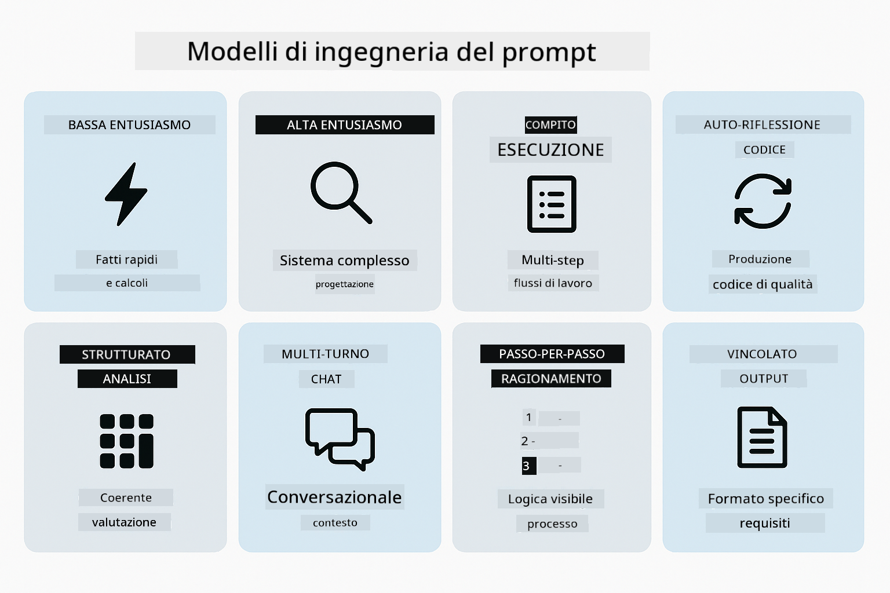
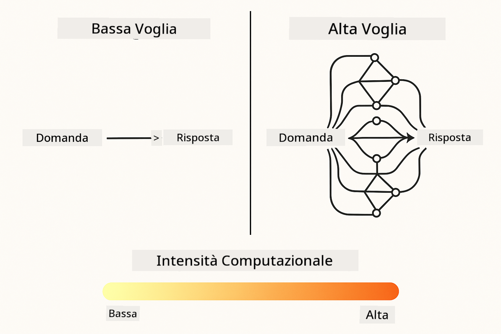
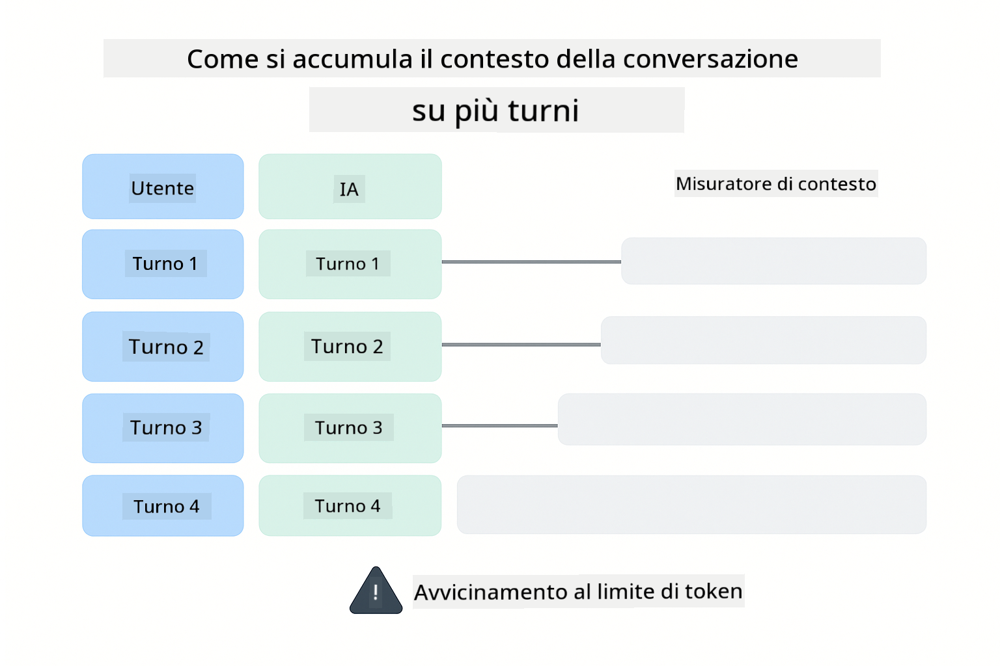
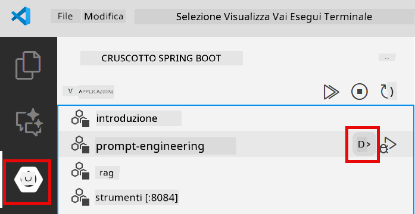
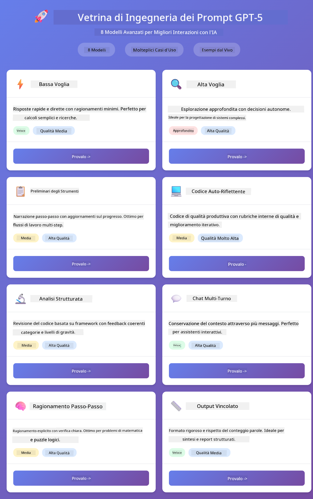
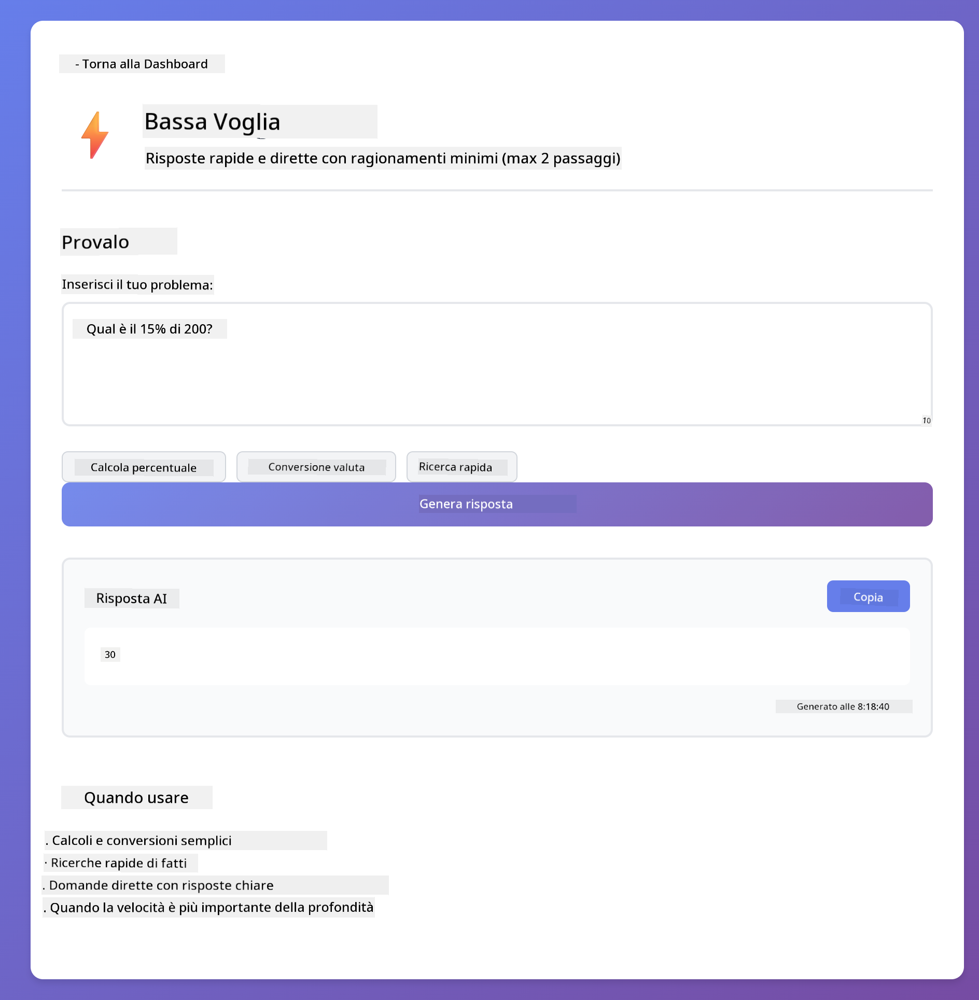
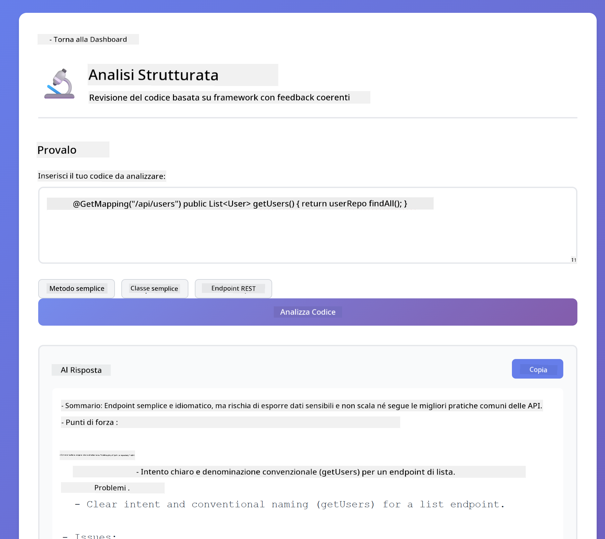
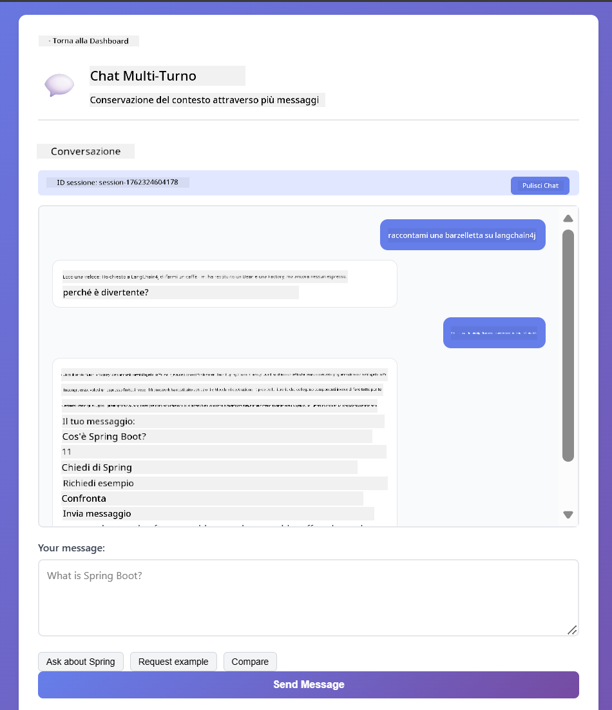
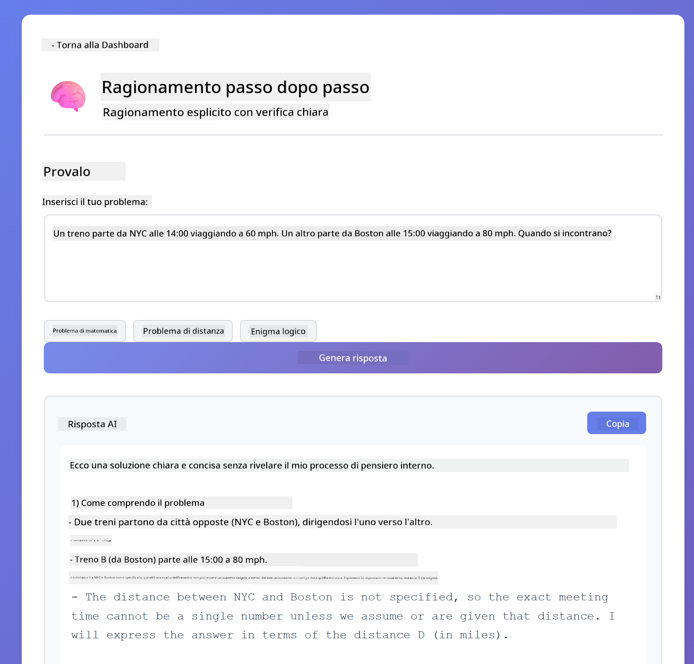
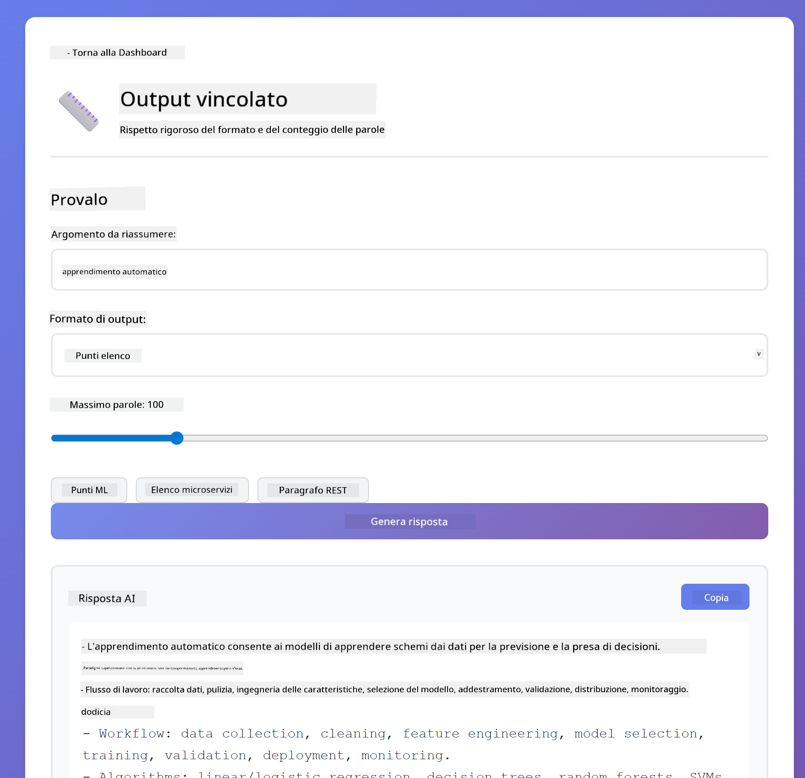

<!--
CO_OP_TRANSLATOR_METADATA:
{
  "original_hash": "8d787826cad7e92bf5cdbd116b1e6116",
  "translation_date": "2025-12-13T16:05:27+00:00",
  "source_file": "02-prompt-engineering/README.md",
  "language_code": "it"
}
-->
# Modulo 02: Prompt Engineering con GPT-5

## Indice

- [Cosa Imparerai](../../../02-prompt-engineering)
- [Prerequisiti](../../../02-prompt-engineering)
- [Comprendere il Prompt Engineering](../../../02-prompt-engineering)
- [Come Questo Usa LangChain4j](../../../02-prompt-engineering)
- [I Pattern Principali](../../../02-prompt-engineering)
- [Utilizzo delle Risorse Azure Esistenti](../../../02-prompt-engineering)
- [Screenshot dell'Applicazione](../../../02-prompt-engineering)
- [Esplorare i Pattern](../../../02-prompt-engineering)
  - [Bassa vs Alta Voglia](../../../02-prompt-engineering)
  - [Esecuzione di Compiti (Preamboli degli Strumenti)](../../../02-prompt-engineering)
  - [Codice Auto-Riflettente](../../../02-prompt-engineering)
  - [Analisi Strutturata](../../../02-prompt-engineering)
  - [Chat Multi-Turno](../../../02-prompt-engineering)
  - [Ragionamento Passo-Passo](../../../02-prompt-engineering)
  - [Output Vincolato](../../../02-prompt-engineering)
- [Cosa Stai Davvero Imparando](../../../02-prompt-engineering)
- [Prossimi Passi](../../../02-prompt-engineering)

## Cosa Imparerai

Nel modulo precedente, hai visto come la memoria abilita l'IA conversazionale e hai utilizzato i Modelli GitHub per interazioni di base. Ora ci concentreremo su come porre domande - i prompt stessi - usando GPT-5 di Azure OpenAI. Il modo in cui strutturi i tuoi prompt influisce drasticamente sulla qualità delle risposte che ottieni.

Useremo GPT-5 perché introduce il controllo del ragionamento - puoi dire al modello quanto deve pensare prima di rispondere. Questo rende più evidenti le diverse strategie di prompting e ti aiuta a capire quando usare ogni approccio. Beneficeremo anche dei limiti di velocità più bassi di Azure per GPT-5 rispetto ai Modelli GitHub.

## Prerequisiti

- Completato il Modulo 01 (risorse Azure OpenAI distribuite)
- File `.env` nella directory radice con le credenziali Azure (creato da `azd up` nel Modulo 01)

> **Nota:** Se non hai completato il Modulo 01, segui prima le istruzioni di distribuzione lì.

## Comprendere il Prompt Engineering

Il prompt engineering riguarda la progettazione del testo di input che ti consente di ottenere costantemente i risultati di cui hai bisogno. Non si tratta solo di fare domande - si tratta di strutturare le richieste in modo che il modello capisca esattamente cosa vuoi e come fornirlo.

Pensalo come dare istruzioni a un collega. "Correggi il bug" è vago. "Correggi l'eccezione null pointer in UserService.java riga 45 aggiungendo un controllo null" è specifico. I modelli linguistici funzionano allo stesso modo - specificità e struttura contano.

## Come Questo Usa LangChain4j

Questo modulo dimostra pattern avanzati di prompting usando la stessa base LangChain4j dei moduli precedenti, con un focus sulla struttura del prompt e il controllo del ragionamento.


*Come LangChain4j collega i tuoi prompt a Azure OpenAI GPT-5*

**Dipendenze** - Il Modulo 02 usa le seguenti dipendenze langchain4j definite in `pom.xml`:
```xml
<dependency>
    <groupId>dev.langchain4j</groupId>
    <artifactId>langchain4j</artifactId> <!-- Inherited from BOM in root pom.xml -->
</dependency>
<dependency>
    <groupId>dev.langchain4j</groupId>
    <artifactId>langchain4j-open-ai-official</artifactId> <!-- Inherited from BOM in root pom.xml -->
</dependency>
```

**Configurazione OpenAiOfficialChatModel** - [LangChainConfig.java](../../../02-prompt-engineering/src/main/java/com/example/langchain4j/prompts/config/LangChainConfig.java)

Il modello chat è configurato manualmente come bean Spring usando il client ufficiale OpenAI, che supporta gli endpoint Azure OpenAI. La differenza chiave rispetto al Modulo 01 è come strutturiamo i prompt inviati a `chatModel.chat()`, non la configurazione del modello stessa.

**Messaggi di Sistema e Utente** - [Gpt5PromptService.java](../../../02-prompt-engineering/src/main/java/com/example/langchain4j/prompts/service/Gpt5PromptService.java)

LangChain4j separa i tipi di messaggi per chiarezza. `SystemMessage` imposta il comportamento e il contesto dell'IA (come "Sei un revisore di codice"), mentre `UserMessage` contiene la richiesta vera e propria. Questa separazione ti permette di mantenere un comportamento AI coerente tra diverse query utente.

```java
SystemMessage systemMsg = SystemMessage.from(
    "You are a helpful Java programming expert."
);

UserMessage userMsg = UserMessage.from(
    "Explain what a List is in Java"
);

String response = chatModel.chat(systemMsg, userMsg);
```


*SystemMessage fornisce un contesto persistente mentre UserMessages contengono richieste individuali*

**MessageWindowChatMemory per Multi-Turno** - Per il pattern di conversazione multi-turno, riutilizziamo `MessageWindowChatMemory` dal Modulo 01. Ogni sessione ha la propria istanza di memoria memorizzata in una `Map<String, ChatMemory>`, permettendo conversazioni concorrenti multiple senza mescolare i contesti.

**Template di Prompt** - Il vero focus qui è il prompt engineering, non nuove API LangChain4j. Ogni pattern (bassa voglia, alta voglia, esecuzione di compiti, ecc.) usa lo stesso metodo `chatModel.chat(prompt)` ma con stringhe di prompt strutturate con cura. I tag XML, le istruzioni e la formattazione fanno tutti parte del testo del prompt, non di funzionalità LangChain4j.

**Controllo del Ragionamento** - Lo sforzo di ragionamento di GPT-5 è controllato tramite istruzioni nel prompt come "massimo 2 passaggi di ragionamento" o "esplora a fondo". Queste sono tecniche di prompt engineering, non configurazioni LangChain4j. La libreria semplicemente consegna i tuoi prompt al modello.

La conclusione chiave: LangChain4j fornisce l'infrastruttura (connessione modello via [LangChainConfig.java](../../../02-prompt-engineering/src/main/java/com/example/langchain4j/prompts/config/LangChainConfig.java), memoria, gestione messaggi via [Gpt5PromptService.java](../../../02-prompt-engineering/src/main/java/com/example/langchain4j/prompts/service/Gpt5PromptService.java)), mentre questo modulo ti insegna come creare prompt efficaci all'interno di quell'infrastruttura.

## I Pattern Principali

Non tutti i problemi richiedono lo stesso approccio. Alcune domande necessitano risposte rapide, altre un pensiero profondo. Alcune richiedono ragionamento visibile, altre solo risultati. Questo modulo copre otto pattern di prompting - ognuno ottimizzato per scenari diversi. Sperimenterai tutti per imparare quando funziona meglio ogni approccio.



*Panoramica degli otto pattern di prompt engineering e i loro casi d'uso*



*Bassa voglia (veloce, diretto) vs Alta voglia (approfondito, esplorativo) approcci di ragionamento*

**Bassa Voglia (Veloce & Mirato)** - Per domande semplici dove vuoi risposte rapide e dirette. Il modello fa un ragionamento minimo - massimo 2 passaggi. Usalo per calcoli, ricerche o domande dirette.

```java
String prompt = """
    <reasoning_effort>low</reasoning_effort>
    <instruction>maximum 2 reasoning steps</instruction>
    
    What is 15% of 200?
    """;

String response = chatModel.chat(prompt);
```

> 💡 **Esplora con GitHub Copilot:** Apri [`Gpt5PromptService.java`](../../../02-prompt-engineering/src/main/java/com/example/langchain4j/prompts/service/Gpt5PromptService.java) e chiedi:
> - "Qual è la differenza tra i pattern di prompting a bassa voglia e alta voglia?"
> - "Come aiutano i tag XML nei prompt a strutturare la risposta dell'IA?"
> - "Quando dovrei usare pattern di auto-riflessione rispetto a istruzioni dirette?"

**Alta Voglia (Profondo & Approfondito)** - Per problemi complessi dove vuoi un'analisi completa. Il modello esplora a fondo e mostra un ragionamento dettagliato. Usalo per progettazione di sistemi, decisioni architetturali o ricerche complesse.

```java
String prompt = """
    <reasoning_effort>high</reasoning_effort>
    <instruction>explore thoroughly, show detailed reasoning</instruction>
    
    Design a caching strategy for a high-traffic REST API.
    """;

String response = chatModel.chat(prompt);
```

**Esecuzione di Compiti (Progresso Passo-Passo)** - Per flussi di lavoro multi-step. Il modello fornisce un piano iniziale, narra ogni passo mentre lavora, poi dà un riepilogo. Usalo per migrazioni, implementazioni o qualsiasi processo multi-step.

```java
String prompt = """
    <task>Create a REST endpoint for user registration</task>
    <preamble>Provide an upfront plan</preamble>
    <narration>Narrate each step as you work</narration>
    <summary>Summarize what was accomplished</summary>
    """;

String response = chatModel.chat(prompt);
```

Il prompting Chain-of-Thought chiede esplicitamente al modello di mostrare il processo di ragionamento, migliorando l'accuratezza per compiti complessi. La scomposizione passo-passo aiuta sia gli umani che l'IA a capire la logica.

> **🤖 Prova con la Chat di [GitHub Copilot](https://github.com/features/copilot):** Chiedi di questo pattern:
> - "Come adatterei il pattern di esecuzione di compiti per operazioni di lunga durata?"
> - "Quali sono le best practice per strutturare i preamboli degli strumenti in applicazioni di produzione?"
> - "Come posso catturare e mostrare aggiornamenti di progresso intermedi in un'interfaccia utente?"


*Flusso di lavoro Pianifica → Esegui → Riepiloga per compiti multi-step*

**Codice Auto-Riflettente** - Per generare codice di qualità produzione. Il modello genera codice, lo verifica rispetto a criteri di qualità e lo migliora iterativamente. Usalo quando costruisci nuove funzionalità o servizi.

```java
String prompt = """
    <task>Create an email validation service</task>
    <quality_criteria>
    - Correct logic and error handling
    - Best practices (clean code, proper naming)
    - Performance optimization
    - Security considerations
    </quality_criteria>
    <instruction>Generate code, evaluate against criteria, improve iteratively</instruction>
    """;

String response = chatModel.chat(prompt);
```


*Ciclo di miglioramento iterativo - genera, valuta, identifica problemi, migliora, ripeti*

**Analisi Strutturata** - Per valutazioni coerenti. Il modello rivede il codice usando un framework fisso (correttezza, pratiche, prestazioni, sicurezza). Usalo per revisioni di codice o valutazioni di qualità.

```java
String prompt = """
    <code>
    public List getUsers() {
        return database.query("SELECT * FROM users");
    }
    </code>
    
    <framework>
    Evaluate using these categories:
    1. Correctness - Logic and functionality
    2. Best Practices - Code quality
    3. Performance - Efficiency concerns
    4. Security - Vulnerabilities
    </framework>
    """;

String response = chatModel.chat(prompt);
```

> **🤖 Prova con la Chat di [GitHub Copilot](https://github.com/features/copilot):** Chiedi dell'analisi strutturata:
> - "Come posso personalizzare il framework di analisi per diversi tipi di revisioni di codice?"
> - "Qual è il modo migliore per analizzare e agire su output strutturati programmaticamente?"
> - "Come garantisco livelli di severità coerenti tra diverse sessioni di revisione?"


*Framework a quattro categorie per revisioni di codice coerenti con livelli di severità*

**Chat Multi-Turno** - Per conversazioni che necessitano contesto. Il modello ricorda i messaggi precedenti e costruisce su di essi. Usalo per sessioni di aiuto interattive o Q&A complesse.

```java
ChatMemory memory = MessageWindowChatMemory.withMaxMessages(10);

memory.add(UserMessage.from("What is Spring Boot?"));
AiMessage aiMessage1 = chatModel.chat(memory.messages()).aiMessage();
memory.add(aiMessage1);

memory.add(UserMessage.from("Show me an example"));
AiMessage aiMessage2 = chatModel.chat(memory.messages()).aiMessage();
memory.add(aiMessage2);
```



*Come il contesto della conversazione si accumula su più turni fino a raggiungere il limite di token*

**Ragionamento Passo-Passo** - Per problemi che richiedono logica visibile. Il modello mostra ragionamenti espliciti per ogni passo. Usalo per problemi matematici, puzzle logici o quando devi capire il processo di pensiero.

```java
String prompt = """
    <instruction>Show your reasoning step-by-step</instruction>
    
    If a train travels 120 km in 2 hours, then stops for 30 minutes,
    then travels another 90 km in 1.5 hours, what is the average speed
    for the entire journey including the stop?
    """;

String response = chatModel.chat(prompt);
```


*Scomposizione dei problemi in passi logici espliciti*

**Output Vincolato** - Per risposte con requisiti di formato specifici. Il modello segue rigorosamente regole di formato e lunghezza. Usalo per riepiloghi o quando ti serve una struttura di output precisa.

```java
String prompt = """
    <constraints>
    - Exactly 100 words
    - Bullet point format
    - Technical terms only
    </constraints>
    
    Summarize the key concepts of machine learning.
    """;

String response = chatModel.chat(prompt);
```


*Applicazione di requisiti specifici di formato, lunghezza e struttura*

## Utilizzo delle Risorse Azure Esistenti

**Verifica distribuzione:**

Assicurati che il file `.env` esista nella directory radice con le credenziali Azure (creato durante il Modulo 01):
```bash
cat ../.env  # Dovrebbe mostrare AZURE_OPENAI_ENDPOINT, API_KEY, DEPLOYMENT
```

**Avvia l'applicazione:**

> **Nota:** Se hai già avviato tutte le applicazioni usando `./start-all.sh` dal Modulo 01, questo modulo è già in esecuzione sulla porta 8083. Puoi saltare i comandi di avvio qui sotto e andare direttamente a http://localhost:8083.

**Opzione 1: Usare Spring Boot Dashboard (Consigliato per utenti VS Code)**

Il container di sviluppo include l'estensione Spring Boot Dashboard, che fornisce un'interfaccia visiva per gestire tutte le applicazioni Spring Boot. La trovi nella Activity Bar a sinistra di VS Code (cerca l'icona Spring Boot).

Dal Spring Boot Dashboard puoi:
- Vedere tutte le applicazioni Spring Boot disponibili nello spazio di lavoro
- Avviare/fermare le applicazioni con un clic
- Visualizzare i log delle applicazioni in tempo reale
- Monitorare lo stato delle applicazioni

Clicca semplicemente il pulsante play accanto a "prompt-engineering" per avviare questo modulo, o avvia tutti i moduli insieme.



**Opzione 2: Usare script shell**

Avvia tutte le applicazioni web (moduli 01-04):

**Bash:**
```bash
cd ..  # Dalla directory radice
./start-all.sh
```

**PowerShell:**
```powershell
cd ..  # Dalla directory principale
.\start-all.ps1
```

Oppure avvia solo questo modulo:

**Bash:**
```bash
cd 02-prompt-engineering
./start.sh
```

**PowerShell:**
```powershell
cd 02-prompt-engineering
.\start.ps1
```

Entrambi gli script caricano automaticamente le variabili d'ambiente dal file `.env` radice e compileranno i JAR se non esistono.

> **Nota:** Se preferisci compilare manualmente tutti i moduli prima di avviare:
>
> **Bash:**
> ```bash
> cd ..  # Go to root directory
> mvn clean package -DskipTests
> ```
>
> **PowerShell:**
> ```powershell
> cd ..  # Go to root directory
> mvn clean package -DskipTests
> ```

Apri http://localhost:8083 nel tuo browser.

**Per fermare:**

**Bash:**
```bash
./stop.sh  # Solo questo modulo
# O
cd .. && ./stop-all.sh  # Tutti i moduli
```

**PowerShell:**
```powershell
.\stop.ps1  # Solo questo modulo
# O
cd ..; .\stop-all.ps1  # Tutti i moduli
```

## Screenshot dell'Applicazione



*La dashboard principale che mostra tutti gli 8 pattern di prompt engineering con le loro caratteristiche e casi d'uso*

## Esplorare i Pattern

L'interfaccia web ti permette di sperimentare con diverse strategie di prompting. Ogni pattern risolve problemi diversi - provali per vedere quando ogni approccio funziona meglio.

### Bassa vs Alta Voglia

Fai una domanda semplice come "Qual è il 15% di 200?" usando Bassa Voglia. Otterrai una risposta istantanea e diretta. Ora chiedi qualcosa di complesso come "Progetta una strategia di caching per un'API ad alto traffico" usando Alta Voglia. Guarda come il modello rallenta e fornisce un ragionamento dettagliato. Stesso modello, stessa struttura di domanda - ma il prompt gli dice quanto deve pensare.


*Calcolo rapido con ragionamento minimo*


*Strategia di caching completa (2.8MB)*

### Esecuzione del Compito (Preamboli degli Strumenti)

I flussi di lavoro multi-step beneficiano di una pianificazione anticipata e di una narrazione del progresso. Il modello delinea cosa farà, narra ogni passaggio, poi riassume i risultati.


*Creazione di un endpoint REST con narrazione passo-passo (3.9MB)*

### Codice Auto-Riflettente

Prova "Crea un servizio di validazione email". Invece di generare solo codice e fermarsi, il modello genera, valuta secondo criteri di qualità, identifica debolezze e migliora. Vedrai iterare finché il codice non raggiunge standard di produzione.


*Servizio completo di validazione email (5.2MB)*

### Analisi Strutturata

Le revisioni del codice necessitano di quadri di valutazione coerenti. Il modello analizza il codice usando categorie fisse (correttezza, pratiche, prestazioni, sicurezza) con livelli di gravità.



*Revisione del codice basata su framework*

### Chat Multi-Turno

Chiedi "Cos'è Spring Boot?" poi subito dopo "Fammi vedere un esempio". Il modello ricorda la tua prima domanda e ti fornisce un esempio specifico di Spring Boot. Senza memoria, quella seconda domanda sarebbe troppo vaga.



*Preservazione del contesto tra le domande*

### Ragionamento Passo-Passo

Scegli un problema di matematica e prova sia il Ragionamento Passo-Passo che Bassa Prontezza. La bassa prontezza ti dà solo la risposta - veloce ma opaca. Il passo-passo ti mostra ogni calcolo e decisione.



*Problema matematico con passaggi espliciti*

### Output Vincolato

Quando hai bisogno di formati specifici o conteggi di parole, questo schema impone un’aderenza rigorosa. Prova a generare un riassunto con esattamente 100 parole in formato elenco puntato.



*Riassunto di machine learning con controllo del formato*

## Cosa Stai Davvero Imparando

**Lo Sforzo di Ragionamento Cambia Tutto**

GPT-5 ti permette di controllare lo sforzo computazionale tramite i tuoi prompt. Basso sforzo significa risposte rapide con esplorazione minima. Alto sforzo significa che il modello prende tempo per pensare a fondo. Stai imparando a far corrispondere lo sforzo alla complessità del compito - non sprecare tempo su domande semplici, ma non affrettare nemmeno decisioni complesse.

**La Struttura Guida il Comportamento**

Noti i tag XML nei prompt? Non sono decorativi. I modelli seguono istruzioni strutturate più affidabilmente del testo libero. Quando hai bisogno di processi multi-step o logica complessa, la struttura aiuta il modello a tracciare dove si trova e cosa viene dopo.


*Anatomia di un prompt ben strutturato con sezioni chiare e organizzazione in stile XML*

**Qualità Attraverso l’Auto-Valutazione**

Gli schemi auto-riflettenti funzionano rendendo espliciti i criteri di qualità. Invece di sperare che il modello "faccia bene", gli dici esattamente cosa significa "bene": logica corretta, gestione degli errori, prestazioni, sicurezza. Il modello può quindi valutare il proprio output e migliorare. Questo trasforma la generazione di codice da una lotteria a un processo.

**Il Contesto È Finito**

Le conversazioni multi-turno funzionano includendo la cronologia dei messaggi ad ogni richiesta. Ma c’è un limite - ogni modello ha un conteggio massimo di token. Man mano che le conversazioni crescono, avrai bisogno di strategie per mantenere il contesto rilevante senza superare quel limite. Questo modulo ti mostra come funziona la memoria; più avanti imparerai quando riassumere, quando dimenticare e quando recuperare.

## Passi Successivi

**Modulo Successivo:** [03-rag - RAG (Retrieval-Augmented Generation)](../03-rag/README.md)

---

**Navigazione:** [← Precedente: Modulo 01 - Introduzione](../01-introduction/README.md) | [Torna al Principale](../README.md) | [Successivo: Modulo 03 - RAG →](../03-rag/README.md)

---

<!-- CO-OP TRANSLATOR DISCLAIMER START -->
**Disclaimer**:  
Questo documento è stato tradotto utilizzando il servizio di traduzione automatica [Co-op Translator](https://github.com/Azure/co-op-translator). Pur impegnandoci per garantire l’accuratezza, si prega di notare che le traduzioni automatiche possono contenere errori o imprecisioni. Il documento originale nella sua lingua nativa deve essere considerato la fonte autorevole. Per informazioni critiche, si raccomanda una traduzione professionale effettuata da un umano. Non ci assumiamo alcuna responsabilità per eventuali malintesi o interpretazioni errate derivanti dall’uso di questa traduzione.
<!-- CO-OP TRANSLATOR DISCLAIMER END -->