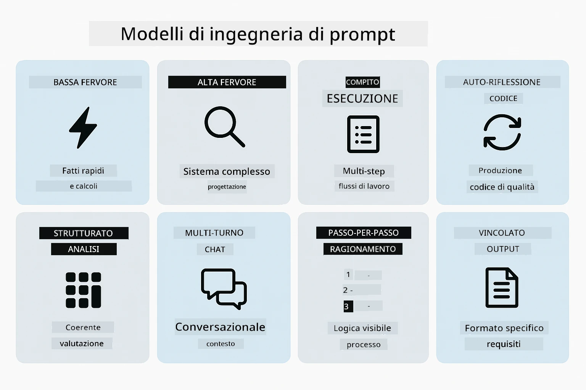
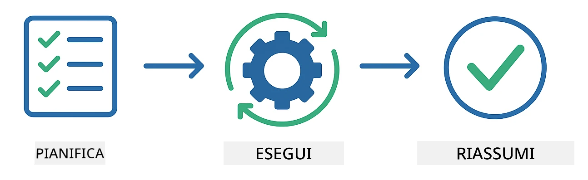
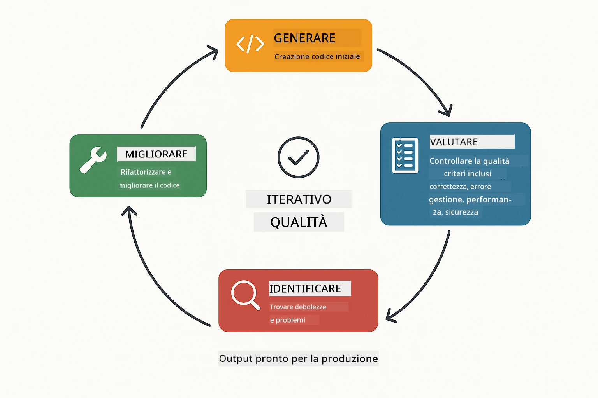
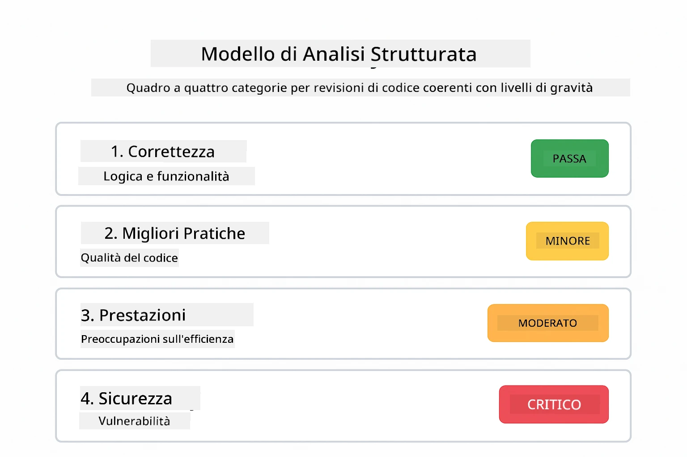
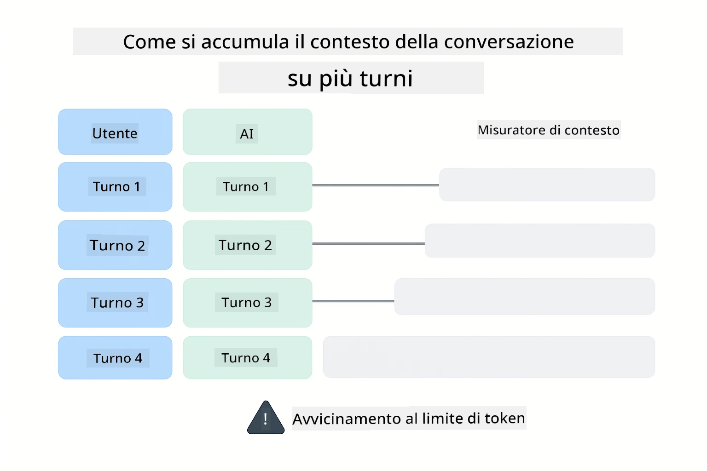
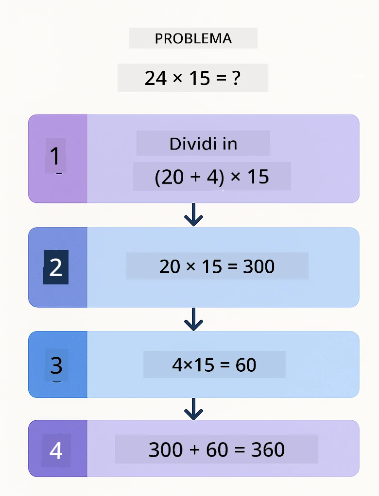
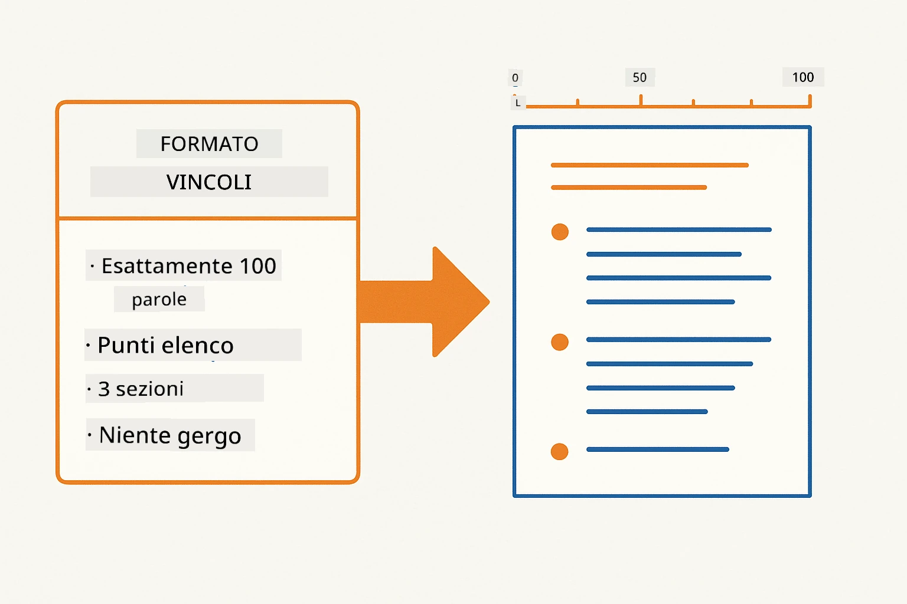
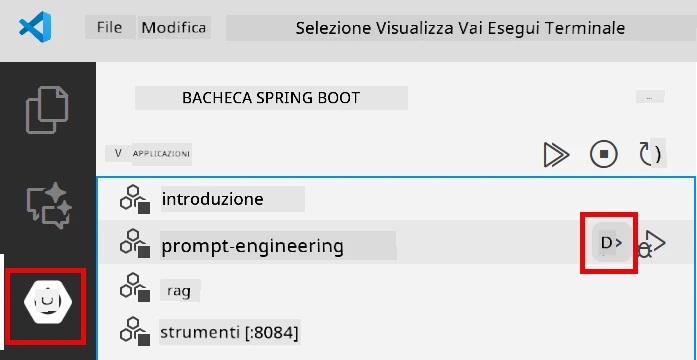
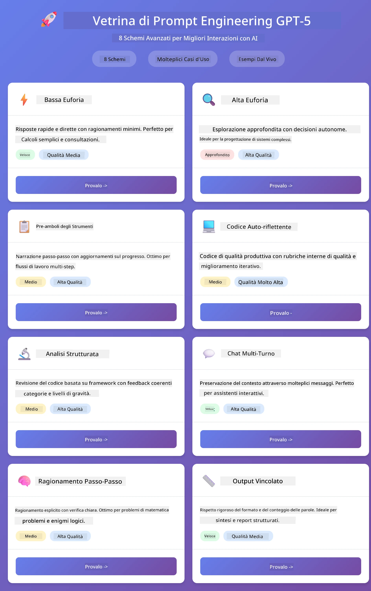
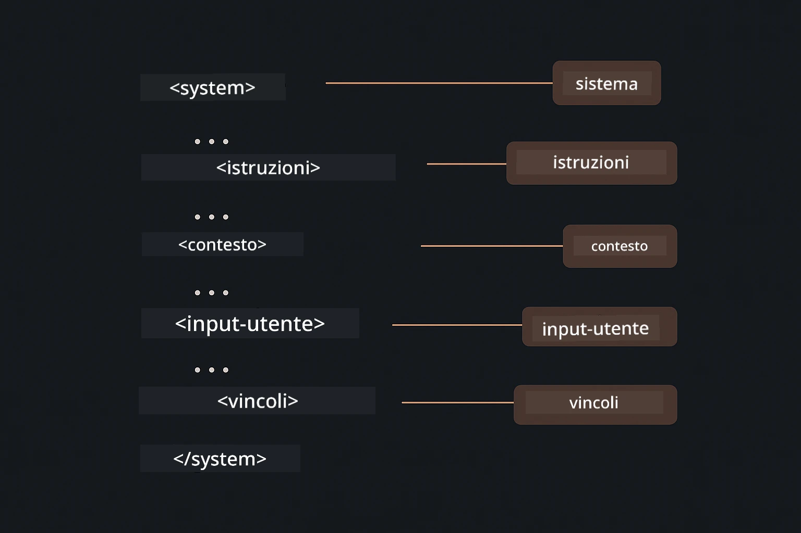

# Modulo 02: Ingegneria dei Prompt con GPT-5.2

## Indice

- [Video Guida](#video-guida)
- [Cosa Imparerai](#cosa-imparerai)
- [Prerequisiti](#prerequisiti)
- [Comprendere l'Ingegneria dei Prompt](#comprendere-lingegneria-dei-prompt)
- [Fondamenti dell'Ingegneria dei Prompt](#fondamenti-dellingegneria-dei-prompt)
  - [Zero-Shot Prompting](#zero-shot-prompting)
  - [Few-Shot Prompting](#few-shot-prompting)
  - [Chain of Thought](#chain-of-thought)
  - [Role-Based Prompting](#role-based-prompting)
  - [Prompt Templates](#prompt-templates)
- [Pattern Avanzati](#pattern-avanzati)
- [Esegui l'Applicazione](#esegui-lapplicazione)
- [Screenshot dell'Applicazione](#screenshot-dellapplicazione)
- [Esplorando i Pattern](#esplorare-i-pattern)
  - [Bassa contro Alta Voglia](#bassa-vs-alta-propensione)
  - [Esecuzione di Compiti (Preamboli degli Strumenti)](#esecuzione-di-attività-pre-amboli-per-gli-strumenti)
  - [Codice Auto-Riflettente](#codice-auto-riflessivo)
  - [Analisi Strutturata](#analisi-strutturata)
  - [Chat Multi-Turno](#chat-multi-turno)
  - [Ragionamento Passo-Passo](#ragionamento-passo-passo)
  - [Output Vincolato](#output-vincolato)
- [Cosa Stai Davvero Imparando](#cosa-impari-veramente)
- [Prossimi Passi](#prossimi-passi)

## Video Guida

Guarda questa sessione live che spiega come iniziare con questo modulo:

<a href="https://www.youtube.com/live/PJ6aBaE6bog?si=LDshyBrTRodP-wke"></a>

## Cosa Imparerai

Il diagramma seguente offre una panoramica degli argomenti chiave e delle competenze che svilupperai in questo modulo — dalle tecniche di raffinamento del prompt fino al flusso di lavoro passo-passo che seguirai.


Nel modulo precedente hai visto come la memoria abilita l'AI conversazionale con Azure OpenAI. Ora ci concentreremo su come formulare le domande — i prompt stessi — usando GPT-5.2 di Azure OpenAI. Il modo in cui strutturi i prompt influisce dramaticamente sulla qualità delle risposte che ottieni. Iniziamo con una revisione delle tecniche fondamentali di prompting, per poi passare a otto pattern avanzati che sfruttano appieno le capacità di GPT-5.2.

Useremo GPT-5.2 perché introduce il controllo del ragionamento — puoi indicare al modello quanta riflessione fare prima di rispondere. Questo rende più evidenti le diverse strategie di prompting e ti aiuta a capire quando usare ciascun approccio.

## Prerequisiti

- Completato il Modulo 01 (risorse Azure OpenAI distribuite)
- File `.env` nella directory root con credenziali Azure (creato da `azd up` nel Modulo 01)

> **Nota:** Se non hai completato il Modulo 01, segui prima le istruzioni di deployment lì.

## Comprendere l'Ingegneria dei Prompt

Alla base, l'ingegneria dei prompt è la differenza tra istruzioni vaghe e istruzioni precise, come illustra il confronto sottostante.


L'ingegneria dei prompt consiste nel progettare testi di input che ottengano costantemente i risultati desiderati. Non si tratta solo di fare domande — ma di strutturare le richieste in modo che il modello capisca esattamente cosa vuoi e come fornirlo.

Pensa a quando dai istruzioni a un collega. "Sistema il bug" è vago. "Sistema l'eccezione null pointer in UserService.java alla riga 45 aggiungendo un controllo null" è specifico. I modelli linguistici funzionano allo stesso modo — la specificità e la struttura contano.

Il diagramma qui sotto mostra come LangChain4j si inserisce in questo contesto — collegando i tuoi pattern di prompt al modello tramite i blocchi costitutivi SystemMessage e UserMessage.


LangChain4j fornisce l'infrastruttura — connessioni al modello, memoria e tipi di messaggi — mentre i pattern di prompt sono semplicemente testo strutturato inviato attraverso quell'infrastruttura. I blocchi chiave sono `SystemMessage` (che imposta il comportamento e il ruolo dell'AI) e `UserMessage` (che veicola la tua richiesta reale).

## Fondamenti dell'Ingegneria dei Prompt

Le cinque tecniche di base mostrate qui sotto costituiscono la base dell'ingegneria dei prompt efficace. Ognuna affronta un aspetto diverso di come comunichi con i modelli linguistici.


Prima di immergerci nei pattern avanzati di questo modulo, diamo una revisione a cinque tecniche fondamentali di prompting. Questi sono i mattoni che ogni ingegnere di prompt dovrebbe conoscere.

### Zero-Shot Prompting

L'approccio più semplice: dare al modello un’istruzione diretta senza esempi. Il modello si basa interamente sul suo training per comprendere ed eseguire il compito. Funziona bene per richieste semplici dove il comportamento atteso è ovvio.


*Istruzione diretta senza esempi — il modello deduce il compito solo dall’istruzione*

```java
String prompt = "Classify this sentiment: 'I absolutely loved the movie!'";
String response = model.chat(prompt);
// Risposta: "Positivo"
```

**Quando usarlo:** Classificazioni semplici, domande dirette, traduzioni o qualsiasi compito che il modello può gestire senza guida aggiuntiva.

### Few-Shot Prompting

Fornire esempi che mostrino il pattern che vuoi il modello segua. Il modello assimila il formato input-output atteso dagli esempi e lo applica a nuovi input. Questo migliora drasticamente la coerenza per compiti dove il formato o comportamento desiderato non è ovvio.


*Apprendimento dagli esempi — il modello identifica il pattern e lo applica a nuovi input*

```java
String prompt = """
    Classify the sentiment as positive, negative, or neutral.
    
    Examples:
    Text: "This product exceeded my expectations!" → Positive
    Text: "It's okay, nothing special." → Neutral
    Text: "Waste of money, very disappointed." → Negative
    
    Now classify this:
    Text: "Best purchase I've made all year!"
    """;
String response = model.chat(prompt);
```

**Quando usarlo:** Classificazioni personalizzate, formattazioni consistenti, compiti specifici di dominio, o quando i risultati zero-shot sono incoerenti.

### Chain of Thought

Chiedi al modello di mostrare il suo ragionamento passo-passo. Invece di saltare direttamente alla risposta, il modello scompone il problema e lavora esplicitamente su ogni parte. Questo migliora l'accuratezza in matematica, logica e ragionamenti multi-step.


*Ragionamento passo-passo — scomporre problemi complessi in passi logici espliciti*

```java
String prompt = """
    Problem: A store has 15 apples. They sell 8 apples and then 
    receive a shipment of 12 more apples. How many apples do they have now?
    
    Let's solve this step-by-step:
    """;
String response = model.chat(prompt);
// Il modello mostra: 15 - 8 = 7, poi 7 + 12 = 19 mele
```

**Quando usarlo:** Problemi di matematica, giochi di logica, debugging o qualsiasi compito dove mostrare il processo di ragionamento migliora accuratezza e fiducia.

### Role-Based Prompting

Imposta una persona o un ruolo per l'AI prima di fare la domanda. Questo fornisce contesto che modella il tono, la profondità e il focus della risposta. Un "architetto software" dà consigli diversi rispetto a un "developer junior" o un "auditor di sicurezza".


*Impostare contesto e persona — la stessa domanda riceve risposte diverse in base al ruolo assegnato*

```java
String prompt = """
    You are an experienced software architect reviewing code.
    Provide a brief code review for this function:
    
    def calculate_total(items):
        total = 0
        for item in items:
            total = total + item['price']
        return total
    """;
String response = model.chat(prompt);
```

**Quando usarlo:** Code review, tutoring, analisi specifiche di dominio, o quando hai bisogno di risposte su misura per un livello di competenza o prospettiva particolari.

### Prompt Templates

Crea prompt riutilizzabili con segnaposti variabili. Invece di scrivere un prompt nuovo ogni volta, definisci un template una volta sola e riempi con valori diversi. La classe `PromptTemplate` di LangChain4j rende facile questo con la sintassi `{{variable}}`.


*Prompt riutilizzabili con segnaposti variabili — un template, molteplici usi*

```java
PromptTemplate template = PromptTemplate.from(
    "What's the best time to visit {{destination}} for {{activity}}?"
);

Prompt prompt = template.apply(Map.of(
    "destination", "Paris",
    "activity", "sightseeing"
));

String response = model.chat(prompt.text());
```

**Quando usarlo:** Query ripetute con input diversi, elaborazioni batch, costruzione di workflow AI riutilizzabili, o ogni scenario dove la struttura del prompt resta la stessa ma cambiano i dati.

---

Questi cinque fondamenti ti danno un kit solido per la maggior parte dei compiti di prompting. Il resto di questo modulo si basa su di essi con **otto pattern avanzati** che sfruttano il controllo del ragionamento, l’auto-valutazione e le capacità di output strutturato di GPT-5.2.

## Pattern Avanzati

Con i fondamenti coperti, passiamo agli otto pattern avanzati che rendono questo modulo unico. Non tutti i problemi necessitano dello stesso approccio. Alcune domande richiedono risposte rapide, altre pensiero profondo. Alcune vogliono ragionamenti visibili, altre solo i risultati. Ogni pattern qui sotto è ottimizzato per uno scenario diverso — e il controllo del ragionamento di GPT-5.2 rende le differenze ancora più marcate.



*Panoramica degli otto pattern di ingegneria dei prompt e i loro casi d’uso*

GPT-5.2 aggiunge un’altra dimensione a questi pattern: *il controllo del ragionamento*. Il cursore qui sotto mostra come puoi regolare lo sforzo di pensiero del modello — da risposte rapide e dirette a analisi profonde e complete.


*Il controllo del ragionamento di GPT-5.2 ti permette di specificare quanta riflessione il modello deve fare — da risposte rapide a esplorazioni profonde*

**Bassa Voglia (Veloce & Focalizzato)** - Per domande semplici dove vuoi risposte veloci e dirette. Il modello esegue un ragionamento minimo - massimo 2 passi. Usa questo per calcoli, ricerche, o domande immediate.

```java
String prompt = """
    <context_gathering>
    - Search depth: very low
    - Bias strongly towards providing a correct answer as quickly as possible
    - Usually, this means an absolute maximum of 2 reasoning steps
    - If you think you need more time, state what you know and what's uncertain
    </context_gathering>
    
    Problem: What is 15% of 200?
    
    Provide your answer:
    """;

String response = chatModel.chat(prompt);
```

> 💡 **Esplora con GitHub Copilot:** Apri [`Gpt5PromptService.java`](../../../02-prompt-engineering/src/main/java/com/example/langchain4j/prompts/service/Gpt5PromptService.java) e chiedi:
> - "Qual è la differenza tra pattern di bassa voglia e alta voglia nei prompting?"
> - "Come aiutano i tag XML nei prompt a strutturare la risposta dell’AI?"
> - "Quando dovrei usare pattern di auto-riflessione vs istruzioni dirette?"

**Alta Voglia (Profondo & Completo)** - Per problemi complessi dove vuoi un’analisi esaustiva. Il modello esplora a fondo e mostra un ragionamento dettagliato. Usa questo per progettazione di sistemi, decisioni architetturali, o ricerche complesse.

```java
String prompt = """
    Analyze this problem thoroughly and provide a comprehensive solution.
    Consider multiple approaches, trade-offs, and important details.
    Show your analysis and reasoning in your response.
    
    Problem: Design a caching strategy for a high-traffic REST API.
    """;

String response = chatModel.chat(prompt);
```

**Esecuzione di Compiti (Progresso Passo-Passo)** - Per workflow multi-step. Il modello fornisce un piano iniziale, narra ogni passo mentre lavora, poi dà un riepilogo. Usa questo per migrazioni, implementazioni o qualsiasi processo a più fasi.

```java
String prompt = """
    <task_execution>
    1. First, briefly restate the user's goal in a friendly way
    
    2. Create a step-by-step plan:
       - List all steps needed
       - Identify potential challenges
       - Outline success criteria
    
    3. Execute each step:
       - Narrate what you're doing
       - Show progress clearly
       - Handle any issues that arise
    
    4. Summarize:
       - What was completed
       - Any important notes
       - Next steps if applicable
    </task_execution>
    
    <tool_preambles>
    - Always begin by rephrasing the user's goal clearly
    - Outline your plan before executing
    - Narrate each step as you go
    - Finish with a distinct summary
    </tool_preambles>
    
    Task: Create a REST endpoint for user registration
    
    Begin execution:
    """;

String response = chatModel.chat(prompt);
```

Il prompting Chain-of-Thought chiede esplicitamente al modello di mostrare il processo di ragionamento, migliorando l’accuratezza per compiti complessi. La scomposizione passo-passo aiuta sia gli umani che l’AI a capire la logica.

> **🤖 Prova con la Chat di [GitHub Copilot](https://github.com/features/copilot):** Chiedi di questo pattern:
> - "Come adattare il pattern di esecuzione di compiti per operazioni a lunga durata?"
> - "Quali sono le best practice per strutturare i preamboli degli strumenti in applicazioni di produzione?"
> - "Come catturare e mostrare aggiornamenti intermedi di progresso in un’interfaccia utente?"

Il diagramma qui sotto illustra questo flusso Plan → Execute → Summarize.



*Flusso Plan → Execute → Summarize per compiti multi-step*

**Codice Auto-Riflettente** - Per generare codice di qualità produzione. Il modello genera codice secondo standard produttivi con gestione appropriata degli errori. Usa questo quando costruisci nuove funzionalità o servizi.

```java
String prompt = """
    Generate Java code with production-quality standards: Create an email validation service
    Keep it simple and include basic error handling.
    """;

String response = chatModel.chat(prompt);
```

Il diagramma qui sotto mostra questo ciclo iterativo di miglioramento — genera, valuta, individua punti deboli e affina finché il codice raggiunge gli standard produttivi.



*Ciclo iterativo di miglioramento – genera, valuta, individua problemi, migliora, ripeti*

**Analisi Strutturata** - Per valutazioni consistenti. Il modello revisiona codice usando un framework fisso (correttezza, pratiche, performance, sicurezza, manutenibilità). Usa questo per code review o valutazioni di qualità.

```java
String prompt = """
    <analysis_framework>
    You are an expert code reviewer. Analyze the code for:
    
    1. Correctness
       - Does it work as intended?
       - Are there logical errors?
    
    2. Best Practices
       - Follows language conventions?
       - Appropriate design patterns?
    
    3. Performance
       - Any inefficiencies?
       - Scalability concerns?
    
    4. Security
       - Potential vulnerabilities?
       - Input validation?
    
    5. Maintainability
       - Code clarity?
       - Documentation?
    
    <output_format>
    Provide your analysis in this structure:
    - Summary: One-sentence overall assessment
    - Strengths: 2-3 positive points
    - Issues: List any problems found with severity (High/Medium/Low)
    - Recommendations: Specific improvements
    </output_format>
    </analysis_framework>
    
    Code to analyze:
    ```
    public List getUsers() {
        return database.query("SELECT * FROM users");
    }
    ```
    Provide your structured analysis:
    """;

String response = chatModel.chat(prompt);
```

> **🤖 Prova con la Chat di [GitHub Copilot](https://github.com/features/copilot):** Chiedi dell’analisi strutturata:
> - "Come personalizzare il framework di analisi per diversi tipi di code review?"
> - "Qual è il modo migliore per analizzare e agire su output strutturato programmaticamente?"
> - "Come garantire livelli di severità coerenti tra diverse sessioni di revisione?"

Il diagramma seguente mostra come questo framework strutturato organizza una code review in categorie consistenti con livelli di severità.



*Framework per code review coerenti con livelli di severità*

**Chat Multi-Turno** - Per conversazioni che necessitano di contesto. Il modello ricorda i messaggi precedenti e costruisce sopra di essi. Usa questo per sessioni di aiuto interattive o Q&A complessi.

```java
ChatMemory memory = MessageWindowChatMemory.withMaxMessages(10);

memory.add(UserMessage.from("What is Spring Boot?"));
AiMessage aiMessage1 = chatModel.chat(memory.messages()).aiMessage();
memory.add(aiMessage1);

memory.add(UserMessage.from("Show me an example"));
AiMessage aiMessage2 = chatModel.chat(memory.messages()).aiMessage();
memory.add(aiMessage2);
```

Il diagramma qui sotto visualizza come il contesto della conversazione si accumula ad ogni turno e come questo si rapporta al limite di token del modello.



*Come il contesto della conversazione si accumula su più turni fino a raggiungere il limite di token*

**Ragionamento Passo-Passo** - Per problemi che richiedono logica visibile. Il modello mostra ragionamenti espliciti per ciascun passo. Usa questo per problemi di matematica, rompicapi logici, o quando serve comprendere il processo di pensiero.

```java
String prompt = """
    <instruction>Show your reasoning step-by-step</instruction>
    
    If a train travels 120 km in 2 hours, then stops for 30 minutes,
    then travels another 90 km in 1.5 hours, what is the average speed
    for the entire journey including the stop?
    """;

String response = chatModel.chat(prompt);
```

Il diagramma qui sotto illustra come il modello suddivide i problemi in passi logici numerati ed espliciti.


*Suddividere i problemi in passaggi logici espliciti*

**Output vincolato** - Per risposte con requisiti di formato specifici. Il modello segue rigorosamente le regole di formato e lunghezza. Usalo per riepiloghi o quando hai bisogno di una struttura di output precisa.

```java
String prompt = """
    <constraints>
    - Exactly 100 words
    - Bullet point format
    - Technical terms only
    </constraints>
    
    Summarize the key concepts of machine learning.
    """;

String response = chatModel.chat(prompt);
```

Il diagramma seguente mostra come i vincoli guidano il modello a produrre un output che aderisce rigorosamente ai tuoi requisiti di formato e lunghezza.



*Applicare requisiti specifici di formato, lunghezza e struttura*

## Esegui l'Applicazione

**Verifica il deployment:**

Assicurati che il file `.env` esista nella directory principale con le credenziali di Azure (create durante il Modulo 01). Esegui questo dalla directory del modulo (`02-prompt-engineering/`):

**Bash:**
```bash
cat ../.env  # Dovrebbe mostrare AZURE_OPENAI_ENDPOINT, API_KEY, DEPLOYMENT
```

**PowerShell:**
```powershell
Get-Content ..\.env  # Dovrebbe mostrare AZURE_OPENAI_ENDPOINT, API_KEY, DEPLOYMENT
```

**Avvia l'applicazione:**

> **Nota:** Se hai già avviato tutte le applicazioni usando `./start-all.sh` dalla directory principale (come descritto nel Modulo 01), questo modulo è già in esecuzione sulla porta 8083. Puoi saltare i comandi di avvio seguenti e andare direttamente a http://localhost:8083.

**Opzione 1: Usare Spring Boot Dashboard (Consigliato per utenti VS Code)**

Il container di sviluppo include l'estensione Spring Boot Dashboard, che fornisce un'interfaccia visuale per gestire tutte le applicazioni Spring Boot. Puoi trovarla nella Activity Bar sul lato sinistro di VS Code (cerca l'icona Spring Boot).

Dal Spring Boot Dashboard puoi:
- Vedere tutte le applicazioni Spring Boot disponibili nell'area di lavoro
- Avviare/fermare applicazioni con un solo clic
- Visualizzare i log dell'applicazione in tempo reale
- Monitorare lo stato dell'applicazione

Clicca semplicemente il pulsante play accanto a "prompt-engineering" per avviare questo modulo, oppure avvia tutti i moduli insieme.



*Il Spring Boot Dashboard in VS Code — avvia, ferma e monitora tutti i moduli da un unico posto*

**Opzione 2: Usare gli script shell**

Avvia tutte le applicazioni web (moduli 01-04):

**Bash:**
```bash
cd ..  # Dalla directory radice
./start-all.sh
```

**PowerShell:**
```powershell
cd ..  # Dalla directory principale
.\start-all.ps1
```

Oppure avvia solo questo modulo:

**Bash:**
```bash
cd 02-prompt-engineering
./start.sh
```

**PowerShell:**
```powershell
cd 02-prompt-engineering
.\start.ps1
```

Entrambi gli script caricano automaticamente le variabili d'ambiente dal file `.env` nella root e compileranno i JAR se non esistono.

> **Nota:** Se preferisci compilare manualmente tutti i moduli prima di avviare:
>
> **Bash:**
> ```bash
> cd ..  # Go to root directory
> mvn clean package -DskipTests
> ```
>
> **PowerShell:**
> ```powershell
> cd ..  # Go to root directory
> mvn clean package -DskipTests
> ```

Apri http://localhost:8083 nel tuo browser.

**Per fermare:**

**Bash:**
```bash
./stop.sh  # Solo questo modulo
# O
cd .. && ./stop-all.sh  # Tutti i moduli
```

**PowerShell:**
```powershell
.\stop.ps1  # Solo questo modulo
# O
cd ..; .\stop-all.ps1  # Tutti i moduli
```

## Screenshot dell'Applicazione

Ecco l'interfaccia principale del modulo di prompt engineering, dove puoi sperimentare con tutti e otto i pattern fianco a fianco.



*La dashboard principale che mostra tutti e 8 i pattern di prompt engineering con le loro caratteristiche e casi d'uso*

## Esplorare i Pattern

L'interfaccia web ti permette di sperimentare diverse strategie di prompting. Ogni pattern risolve problemi differenti - prova a vedere quando ogni approccio dà il meglio.

> **Nota: Streaming vs Non-Streaming** — Ogni pagina di pattern offre due pulsanti: **🔴 Stream Response (Live)** e una opzione **Non-streaming**. Lo streaming utilizza Server-Sent Events (SSE) per mostrare i token in tempo reale mentre il modello li genera, così vedi il progresso immediatamente. L'opzione non-streaming aspetta l'intera risposta prima di mostrarla. Per prompt che richiedono ragionamenti profondi (es. High Eagerness, Self-Reflecting Code), la chiamata non-streaming può richiedere molto tempo — a volte minuti — senza feedback visibile. **Usa lo streaming quando sperimenti con prompt complessi** così puoi vedere il modello in azione ed evitare l'impressione che la richiesta sia scaduta.
>
> **Nota: Requisiti Browser** — La funzionalità di streaming usa Fetch Streams API (`response.body.getReader()`) che richiede un browser completo (Chrome, Edge, Firefox, Safari). Non funziona nel Simple Browser integrato di VS Code, poiché la sua webview non supporta ReadableStream API. Se usi Simple Browser, i pulsanti non-streaming funzionano normalmente — solo quelli streaming sono influenzati. Apri `http://localhost:8083` in un browser esterno per l'esperienza completa.

### Bassa vs Alta Propensione

Fai una domanda semplice come "Qual è il 15% di 200?" usando Bassa Propensione. Otterrai una risposta istantanea e diretta. Ora chiedi qualcosa di complesso come "Progetta una strategia di caching per un'API ad alto traffico" usando Alta Propensione. Clicca **🔴 Stream Response (Live)** e guarda il ragionamento dettagliato del modello apparire token per token. Stesso modello, stessa struttura di domanda - ma il prompt indica quanto pensiero attivare.

### Esecuzione di Attività (Pre-amboli per gli Strumenti)

I workflow a più fasi beneficiano di una pianificazione anticipata e narrazione del progresso. Il modello descrive cosa farà, narra ogni passaggio, poi riassume i risultati.

### Codice Auto-Riflessivo

Prova "Crea un servizio di validazione email". Invece di generare solo codice e fermarsi, il modello genera, valuta secondo criteri di qualità, identifica debolezze e migliora. Vedrai iterare finché il codice non raggiunge standard di produzione.

### Analisi Strutturata

Le revisioni del codice necessitano di framework di valutazione coerenti. Il modello analizza il codice usando categorie fisse (correttezza, pratiche, performance, sicurezza) con livelli di gravità.

### Chat Multi-turno

Chiedi "Cos'è Spring Boot?" e subito dopo "Mostrami un esempio". Il modello ricorda la prima domanda e ti dà un esempio specifico di Spring Boot. Senza memoria, la seconda domanda sarebbe troppo vaga.

### Ragionamento Passo-Passo

Scegli un problema matematico e prova sia il Ragionamento Passo-Passo che la Bassa Propensione. La bassa propensione dà solo la risposta - veloce ma opaca. Il passo-passo mostra ogni calcolo e decisione.

### Output Vincolato

Quando necessiti formati specifici o conti parole precisi, questo pattern fa rispettare questi limiti rigorosi. Prova a generare un riepilogo con esattamente 100 parole in formato elenco puntato.

## Cosa Impari Veramente

**Lo Sforzo di Ragionamento Cambia Tutto**

GPT-5.2 ti permette di controllare lo sforzo computazionale tramite i prompt. Poco sforzo significa risposte rapide con esplorazione minima. Alto sforzo significa che il modello impiega tempo per riflettere in profondità. Stai imparando ad abbinare lo sforzo alla complessità del compito - non sprecare tempo con domande semplici, ma non affrettare nemmeno decisioni complesse.

**La Struttura Guida il Comportamento**

Hai notato i tag XML nei prompt? Non sono decorativi. I modelli seguono istruzioni strutturate in modo più affidabile rispetto al testo libero. Quando ti servono processi multi-step o logica complessa, la struttura aiuta il modello a sapere dove si trova e cosa viene dopo. Il diagramma qui sotto scompone un prompt ben strutturato, mostrando come tag come `<system>`, `<instructions>`, `<context>`, `<user-input>`, e `<constraints>` organizzano le istruzioni in sezioni chiare.



*Anatomia di un prompt ben strutturato con sezioni chiare e organizzazione in stile XML*

**Qualità Tramite Auto-Valutazione**

I pattern auto-riflessivi funzionano rendendo espliciti i criteri di qualità. Invece di sperare che il modello "faccia bene", gli dici esattamente cosa significa "bene": logica corretta, gestione errori, performance, sicurezza. Il modello può quindi valutare il proprio output e migliorare. Questo trasforma la generazione di codice da una lotteria a un processo.

**Il Contesto è Finito**

Le conversazioni multi-turno funzionano includendo la cronologia dei messaggi ad ogni richiesta. Ma c'è un limite - ogni modello ha un massimo di token. Man mano che le conversazioni crescono, ti serviranno strategie per mantenere il contesto rilevante senza superare quel limite. Questo modulo ti mostra come funziona la memoria; più avanti imparerai quando riassumere, quando dimenticare e quando recuperare.

## Prossimi Passi

**Prossimo Modulo:** [03-rag - RAG (Retrieval-Augmented Generation)](../03-rag/README.md)

---

**Navigazione:** [← Precedente: Modulo 01 - Introduzione](../01-introduction/README.md) | [Torna al Principale](../README.md) | [Successivo: Modulo 03 - RAG →](../03-rag/README.md)

---

<!-- CO-OP TRANSLATOR DISCLAIMER START -->
**Disclaimer**:
Questo documento è stato tradotto utilizzando il servizio di traduzione AI [Co-op Translator](https://github.com/Azure/co-op-translator). Sebbene ci impegniamo per garantire la precisione, si prega di notare che le traduzioni automatizzate possono contenere errori o imprecisioni. Il documento originale nella sua lingua nativa deve essere considerato la fonte autorevole. Per informazioni critiche, si raccomanda una traduzione professionale effettuata da un essere umano. Non siamo responsabili per eventuali malintesi o interpretazioni errate derivanti dall’uso di questa traduzione.
<!-- CO-OP TRANSLATOR DISCLAIMER END -->