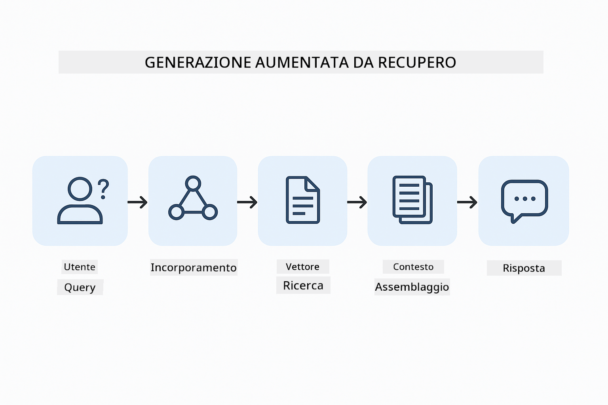
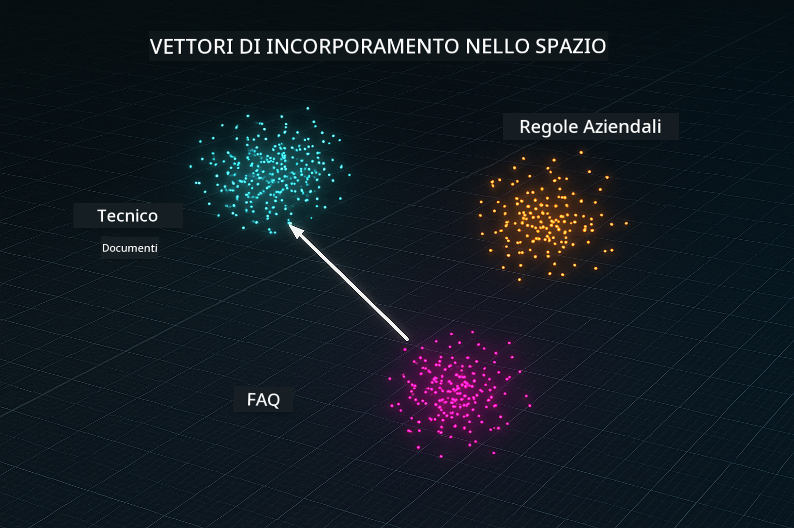
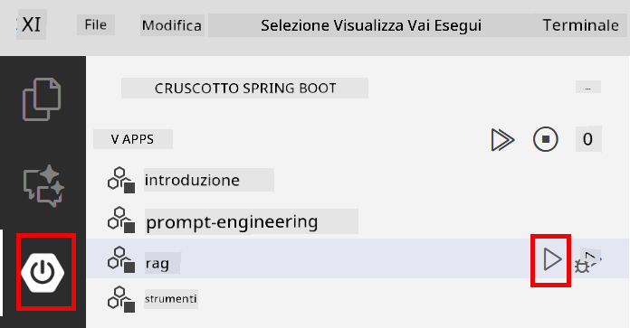

<!--
CO_OP_TRANSLATOR_METADATA:
{
  "original_hash": "f538a51cfd13147d40d84e936a0f485c",
  "translation_date": "2025-12-13T17:00:13+00:00",
  "source_file": "03-rag/README.md",
  "language_code": "it"
}
-->
# Modulo 03: RAG (Generazione Aumentata da Recupero)

## Indice

- [Cosa Imparerai](../../../03-rag)
- [Prerequisiti](../../../03-rag)
- [Comprendere RAG](../../../03-rag)
- [Come Funziona](../../../03-rag)
  - [Elaborazione dei Documenti](../../../03-rag)
  - [Creazione di Embedding](../../../03-rag)
  - [Ricerca Semantica](../../../03-rag)
  - [Generazione delle Risposte](../../../03-rag)
- [Esegui l'Applicazione](../../../03-rag)
- [Utilizzo dell'Applicazione](../../../03-rag)
  - [Carica un Documento](../../../03-rag)
  - [Fai Domande](../../../03-rag)
  - [Controlla i Riferimenti alle Fonti](../../../03-rag)
  - [Sperimenta con le Domande](../../../03-rag)
- [Concetti Chiave](../../../03-rag)
  - [Strategia di Suddivisione](../../../03-rag)
  - [Punteggi di Similarità](../../../03-rag)
  - [Memorizzazione in Memoria](../../../03-rag)
  - [Gestione della Finestra di Contesto](../../../03-rag)
- [Quando RAG è Importante](../../../03-rag)
- [Prossimi Passi](../../../03-rag)

## Cosa Imparerai

Nei moduli precedenti, hai imparato come avere conversazioni con l'IA e strutturare efficacemente i tuoi prompt. Ma c'è una limitazione fondamentale: i modelli linguistici conoscono solo ciò che hanno appreso durante l'addestramento. Non possono rispondere a domande sulle politiche della tua azienda, sulla documentazione del tuo progetto o su qualsiasi informazione su cui non sono stati addestrati.

RAG (Generazione Aumentata da Recupero) risolve questo problema. Invece di cercare di insegnare al modello le tue informazioni (cosa costosa e poco pratica), gli dai la capacità di cercare tra i tuoi documenti. Quando qualcuno fa una domanda, il sistema trova informazioni rilevanti e le include nel prompt. Il modello risponde quindi basandosi su quel contesto recuperato.

Pensa a RAG come a fornire al modello una biblioteca di riferimento. Quando fai una domanda, il sistema:

1. **Query Utente** - Fai una domanda  
2. **Embedding** - Converte la tua domanda in un vettore  
3. **Ricerca Vettoriale** - Trova i frammenti di documento simili  
4. **Assemblaggio del Contesto** - Aggiunge i frammenti rilevanti al prompt  
5. **Risposta** - LLM genera una risposta basata sul contesto  

Questo ancoraggio delle risposte del modello ai tuoi dati reali evita di affidarsi solo alla conoscenza di addestramento o di inventare risposte.



*Flusso di lavoro RAG - dalla query utente alla ricerca semantica fino alla generazione della risposta contestuale*

## Prerequisiti

- Completato il Modulo 01 (risorse Azure OpenAI distribuite)  
- File `.env` nella directory principale con le credenziali Azure (creato da `azd up` nel Modulo 01)  

> **Nota:** Se non hai completato il Modulo 01, segui prima le istruzioni di distribuzione lì.

## Come Funziona

**Elaborazione dei Documenti** - [DocumentService.java](../../../03-rag/src/main/java/com/example/langchain4j/rag/service/DocumentService.java)

Quando carichi un documento, il sistema lo suddivide in frammenti - pezzi più piccoli che si adattano comodamente alla finestra di contesto del modello. Questi frammenti si sovrappongono leggermente per non perdere il contesto ai confini.

```java
Document document = FileSystemDocumentLoader.loadDocument("sample-document.txt");

DocumentSplitter splitter = DocumentSplitters
    .recursive(300, 30, new OpenAiTokenizer());

List<TextSegment> segments = splitter.split(document);
```
  
> **🤖 Prova con [GitHub Copilot](https://github.com/features/copilot) Chat:** Apri [`DocumentService.java`](../../../03-rag/src/main/java/com/example/langchain4j/rag/service/DocumentService.java) e chiedi:  
> - "Come LangChain4j suddivide i documenti in frammenti e perché la sovrapposizione è importante?"  
> - "Qual è la dimensione ottimale dei frammenti per diversi tipi di documento e perché?"  
> - "Come gestisco documenti in più lingue o con formattazioni speciali?"

**Creazione di Embedding** - [LangChainRagConfig.java](../../../03-rag/src/main/java/com/example/langchain4j/rag/config/LangChainRagConfig.java)

Ogni frammento viene convertito in una rappresentazione numerica chiamata embedding - essenzialmente un'impronta matematica che cattura il significato del testo. Testi simili producono embedding simili.

```java
@Bean
public EmbeddingModel embeddingModel() {
    return OpenAiOfficialEmbeddingModel.builder()
        .baseUrl(azureOpenAiEndpoint)
        .apiKey(azureOpenAiKey)
        .modelName(azureEmbeddingDeploymentName)
        .build();
}

EmbeddingStore<TextSegment> embeddingStore = 
    new InMemoryEmbeddingStore<>();
```
  


*Documenti rappresentati come vettori nello spazio degli embedding - contenuti simili si raggruppano*

**Ricerca Semantica** - [RagService.java](../../../03-rag/src/main/java/com/example/langchain4j/rag/service/RagService.java)

Quando fai una domanda, anche la tua domanda diventa un embedding. Il sistema confronta l'embedding della tua domanda con tutti gli embedding dei frammenti di documento. Trova i frammenti con i significati più simili - non solo parole chiave corrispondenti, ma vera similarità semantica.

```java
Embedding queryEmbedding = embeddingModel.embed(question).content();

List<EmbeddingMatch<TextSegment>> matches = 
    embeddingStore.findRelevant(queryEmbedding, 5, 0.7);

for (EmbeddingMatch<TextSegment> match : matches) {
    String relevantText = match.embedded().text();
    double score = match.score();
}
```
  
> **🤖 Prova con [GitHub Copilot](https://github.com/features/copilot) Chat:** Apri [`RagService.java`](../../../03-rag/src/main/java/com/example/langchain4j/rag/service/RagService.java) e chiedi:  
> - "Come funziona la ricerca di similarità con gli embedding e cosa determina il punteggio?"  
> - "Quale soglia di similarità dovrei usare e come influisce sui risultati?"  
> - "Come gestisco i casi in cui non si trovano documenti rilevanti?"

**Generazione delle Risposte** - [RagService.java](../../../03-rag/src/main/java/com/example/langchain4j/rag/service/RagService.java)

I frammenti più rilevanti vengono inclusi nel prompt per il modello. Il modello legge quei frammenti specifici e risponde alla tua domanda basandosi su quelle informazioni. Questo previene le allucinazioni - il modello può rispondere solo da ciò che ha davanti.

## Esegui l'Applicazione

**Verifica la distribuzione:**

Assicurati che il file `.env` esista nella directory principale con le credenziali Azure (creato durante il Modulo 01):  
```bash
cat ../.env  # Dovrebbe mostrare AZURE_OPENAI_ENDPOINT, API_KEY, DEPLOYMENT
```
  
**Avvia l'applicazione:**

> **Nota:** Se hai già avviato tutte le applicazioni usando `./start-all.sh` dal Modulo 01, questo modulo è già in esecuzione sulla porta 8081. Puoi saltare i comandi di avvio qui sotto e andare direttamente a http://localhost:8081.

**Opzione 1: Usare Spring Boot Dashboard (consigliato per utenti VS Code)**

Il contenitore di sviluppo include l'estensione Spring Boot Dashboard, che fornisce un'interfaccia visiva per gestire tutte le applicazioni Spring Boot. La trovi nella barra attività a sinistra di VS Code (cerca l'icona Spring Boot).

Dal Spring Boot Dashboard puoi:  
- Vedere tutte le applicazioni Spring Boot disponibili nello spazio di lavoro  
- Avviare/fermare le applicazioni con un clic  
- Visualizzare i log delle applicazioni in tempo reale  
- Monitorare lo stato delle applicazioni  

Clicca semplicemente il pulsante play accanto a "rag" per avviare questo modulo, oppure avvia tutti i moduli insieme.



**Opzione 2: Usare script shell**

Avvia tutte le applicazioni web (moduli 01-04):

**Bash:**  
```bash
cd ..  # Dalla directory principale
./start-all.sh
```
  
**PowerShell:**  
```powershell
cd ..  # Dalla directory principale
.\start-all.ps1
```
  
Oppure avvia solo questo modulo:

**Bash:**  
```bash
cd 03-rag
./start.sh
```
  
**PowerShell:**  
```powershell
cd 03-rag
.\start.ps1
```
  
Entrambi gli script caricano automaticamente le variabili d'ambiente dal file `.env` nella root e compileranno i JAR se non esistono.

> **Nota:** Se preferisci compilare manualmente tutti i moduli prima di avviare:  
>  
> **Bash:**  
> ```bash
> cd ..  # Go to root directory
> mvn clean package -DskipTests
> ```
>  
> **PowerShell:**  
> ```powershell
> cd ..  # Go to root directory
> mvn clean package -DskipTests
> ```
  
Apri http://localhost:8081 nel tuo browser.

**Per fermare:**

**Bash:**  
```bash
./stop.sh  # Solo questo modulo
# O
cd .. && ./stop-all.sh  # Tutti i moduli
```
  
**PowerShell:**  
```powershell
.\stop.ps1  # Solo questo modulo
# O
cd ..; .\stop-all.ps1  # Tutti i moduli
```
  
## Utilizzo dell'Applicazione

L'applicazione fornisce un'interfaccia web per il caricamento dei documenti e per porre domande.

<a href="images/rag-homepage.png"></a>

*Interfaccia dell'applicazione RAG - carica documenti e poni domande*

**Carica un Documento**

Inizia caricando un documento - i file TXT funzionano meglio per i test. In questa directory è fornito un `sample-document.txt` che contiene informazioni sulle funzionalità di LangChain4j, l'implementazione RAG e le best practice - perfetto per testare il sistema.

Il sistema elabora il tuo documento, lo suddivide in frammenti e crea embedding per ciascun frammento. Questo avviene automaticamente al caricamento.

**Fai Domande**

Ora poni domande specifiche sul contenuto del documento. Prova qualcosa di fattuale che sia chiaramente indicato nel documento. Il sistema cerca i frammenti rilevanti, li include nel prompt e genera una risposta.

**Controlla i Riferimenti alle Fonti**

Nota che ogni risposta include riferimenti alle fonti con punteggi di similarità. Questi punteggi (da 0 a 1) mostrano quanto ogni frammento fosse rilevante per la tua domanda. Punteggi più alti significano corrispondenze migliori. Questo ti permette di verificare la risposta rispetto al materiale di origine.

<a href="images/rag-query-results.png"></a>

*Risultati della query che mostrano la risposta con riferimenti alle fonti e punteggi di rilevanza*

**Sperimenta con le Domande**

Prova diversi tipi di domande:  
- Fatti specifici: "Qual è l'argomento principale?"  
- Confronti: "Qual è la differenza tra X e Y?"  
- Riepiloghi: "Riassumi i punti chiave su Z"  

Osserva come i punteggi di rilevanza cambiano in base a quanto bene la tua domanda corrisponde al contenuto del documento.

## Concetti Chiave

**Strategia di Suddivisione**

I documenti sono suddivisi in frammenti da 300 token con 30 token di sovrapposizione. Questo equilibrio garantisce che ogni frammento abbia abbastanza contesto per essere significativo, rimanendo abbastanza piccolo da includere più frammenti in un prompt.

**Punteggi di Similarità**

I punteggi variano da 0 a 1:  
- 0.7-1.0: Altamente rilevante, corrispondenza esatta  
- 0.5-0.7: Rilevante, buon contesto  
- Sotto 0.5: Filtrato, troppo dissimile  

Il sistema recupera solo i frammenti sopra la soglia minima per garantire qualità.

**Memorizzazione in Memoria**

Questo modulo usa la memorizzazione in memoria per semplicità. Quando riavvii l'applicazione, i documenti caricati vengono persi. I sistemi di produzione usano database vettoriali persistenti come Qdrant o Azure AI Search.

**Gestione della Finestra di Contesto**

Ogni modello ha una finestra di contesto massima. Non puoi includere ogni frammento di un documento grande. Il sistema recupera i primi N frammenti più rilevanti (default 5) per rimanere entro i limiti fornendo abbastanza contesto per risposte accurate.

## Quando RAG è Importante

**Usa RAG quando:**  
- Devi rispondere a domande su documenti proprietari  
- Le informazioni cambiano frequentemente (politiche, prezzi, specifiche)  
- L'accuratezza richiede attribuzione della fonte  
- Il contenuto è troppo grande per stare in un singolo prompt  
- Hai bisogno di risposte verificabili e fondate

**Non usare RAG quando:**  
- Le domande richiedono conoscenze generali che il modello già possiede  
- Serve dati in tempo reale (RAG funziona su documenti caricati)  
- Il contenuto è abbastanza piccolo da includere direttamente nei prompt

## Prossimi Passi

**Prossimo Modulo:** [04-tools - Agenti AI con Strumenti](../04-tools/README.md)

---

**Navigazione:** [← Precedente: Modulo 02 - Prompt Engineering](../02-prompt-engineering/README.md) | [Torna al Principale](../README.md) | [Successivo: Modulo 04 - Tools →](../04-tools/README.md)

---

<!-- CO-OP TRANSLATOR DISCLAIMER START -->
**Disclaimer**:  
Questo documento è stato tradotto utilizzando il servizio di traduzione automatica [Co-op Translator](https://github.com/Azure/co-op-translator). Pur impegnandoci per garantire l’accuratezza, si prega di notare che le traduzioni automatiche possono contenere errori o imprecisioni. Il documento originale nella sua lingua nativa deve essere considerato la fonte autorevole. Per informazioni critiche, si raccomanda una traduzione professionale effettuata da un traduttore umano. Non ci assumiamo alcuna responsabilità per eventuali malintesi o interpretazioni errate derivanti dall’uso di questa traduzione.
<!-- CO-OP TRANSLATOR DISCLAIMER END -->