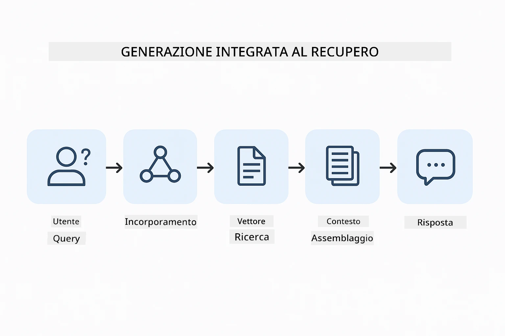
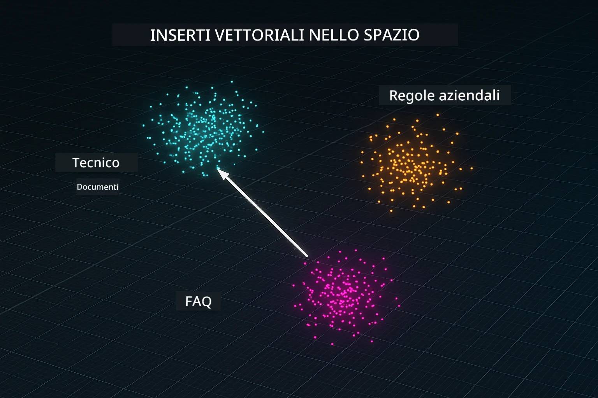
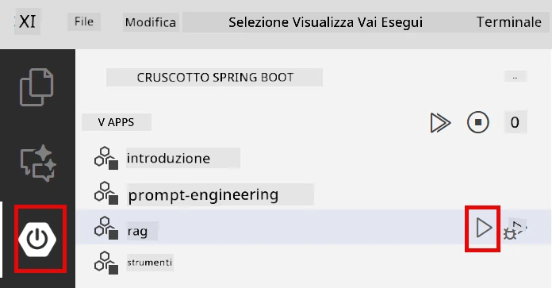
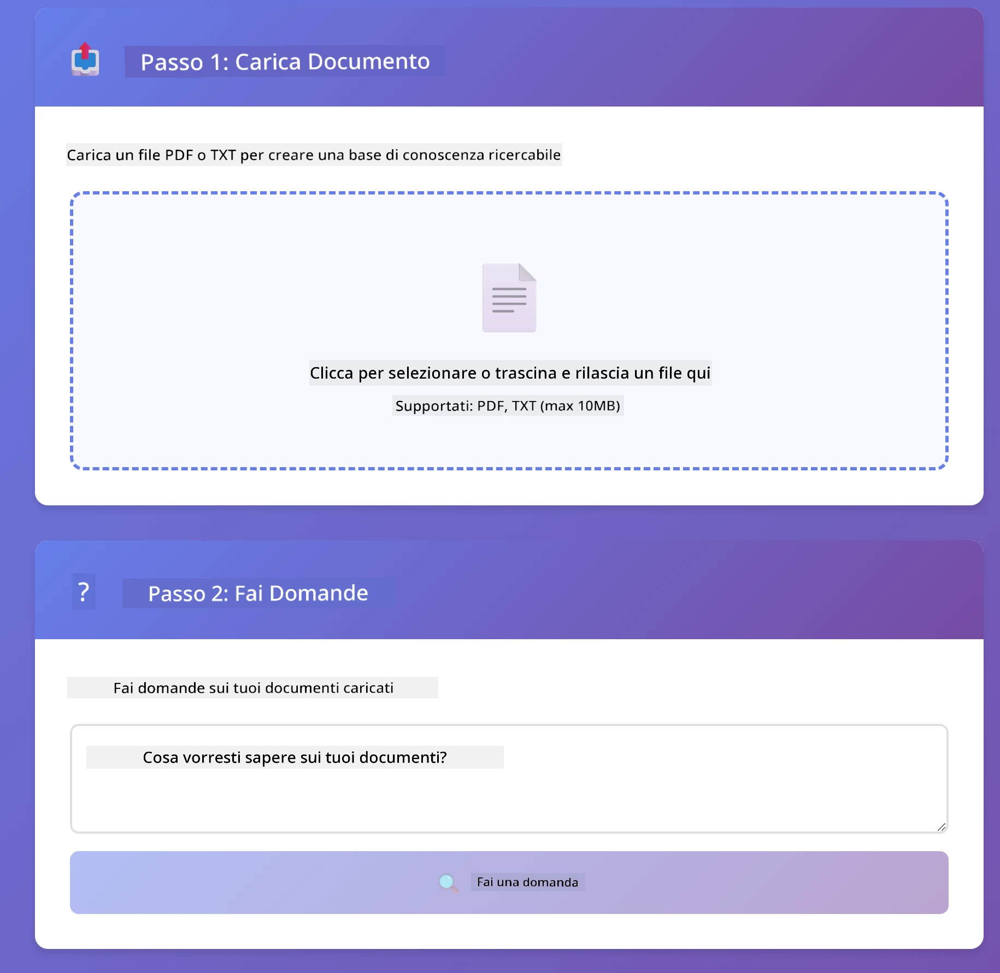
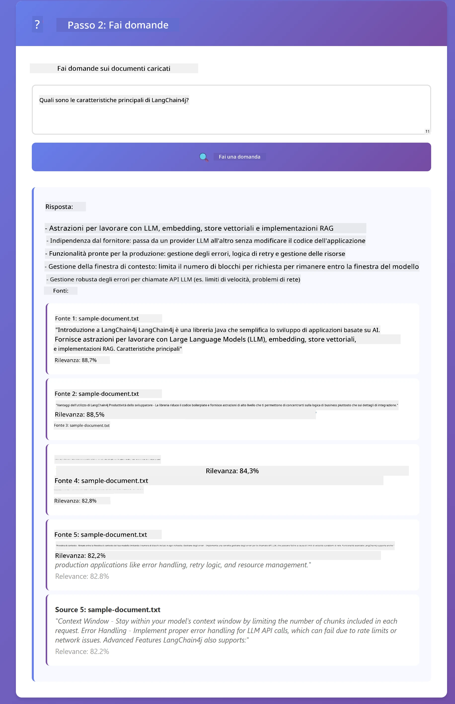

# Modulo 03: RAG (Generazione Potenziata da Recupero)

## Indice

- [Guida Video](#guida-video)
- [Cosa Imparerai](#cosa-imparerai)
- [Prerequisiti](#prerequisiti)
- [Comprendere RAG](#comprendere-rag)
  - [Quale approccio RAG utilizza questo tutorial?](#quale-approccio-rag-utilizza-questo-tutorial)
- [Come Funziona](#come-funziona)
  - [Elaborazione del Documento](#elaborazione-del-documento)
  - [Creazione degli Embedding](#creazione-degli-embedding)
  - [Ricerca Semantica](#ricerca-semantica)
  - [Generazione della Risposta](#generazione-della-risposta)
- [Esecuzione dell’Applicazione](#esegui-lapplicazione)
- [Utilizzo dell’Applicazione](#usare-lapplicazione)
  - [Caricare un Documento](#carica-un-documento)
  - [Porre Domande](#fai-domande)
  - [Verificare le Riferimenti alle Fonti](#controlla-i-riferimenti-delle-fonti)
  - [Sperimentare con le Domande](#sperimenta-con-le-domande)
- [Concetti Chiave](#concetti-chiave)
  - [Strategia di Suddivisione in Chunk](#strategia-di-suddivisione-in-chunk)
  - [Punteggi di Similarità](#punteggi-di-similarità)
  - [Memorizzazione In-Memory](#storage-in-memoria)
  - [Gestione della Finestra di Contesto](#gestione-della-finestra-di-contesto)
- [Quando RAG è Importante](#quando-rag-conta)
- [Passi Successivi](#passaggi-successivi)

## Guida Video

Guarda questa sessione live che spiega come iniziare con questo modulo:

<a href="https://www.youtube.com/watch?v=_olq75ZH_eY"></a>

## Cosa Imparerai

Nei moduli precedenti, hai imparato come avere conversazioni con l’AI e strutturare efficacemente i tuoi prompt. Ma c’è una limitazione fondamentale: i modelli linguistici conoscono solo ciò che hanno appreso durante l’addestramento. Non possono rispondere a domande sulle politiche della tua azienda, sulla documentazione del tuo progetto o su qualsiasi informazione su cui non sono stati addestrati.

RAG (Generazione Potenziata da Recupero) risolve questo problema. Invece di cercare di insegnare al modello le tue informazioni (cosa costosa e poco pratica), gli dai la capacità di cercare tra i tuoi documenti. Quando qualcuno fa una domanda, il sistema trova informazioni rilevanti e le include nel prompt. Il modello risponde quindi basandosi su quel contesto recuperato.

Pensa a RAG come a fornire al modello una biblioteca di riferimento. Quando chiedi una domanda, il sistema:

1. **Query Utente** - Fai una domanda  
2. **Embedding** - Converte la tua domanda in un vettore  
3. **Ricerca Vettoriale** - Trova chunk di documento simili  
4. **Assemblaggio del Contesto** - Aggiunge chunk rilevanti al prompt  
5. **Risposta** - LLM genera una risposta basata sul contesto  

Questo radica le risposte del modello nei tuoi dati reali invece di affidarsi solo alla conoscenza dell'addestramento o di inventare risposte.

## Prerequisiti

- Completato il [Modulo 01 - Introduzione](../01-introduction/README.md) (risorse Azure OpenAI distribuite, incluso il modello di embedding `text-embedding-3-small`)  
- File `.env` nella directory root con le credenziali Azure (creato da `azd up` nel Modulo 01)

> **Nota:** Se non hai completato il Modulo 01, segui prima lì le istruzioni di distribuzione. Il comando `azd up` distribuisce sia il modello GPT chat sia il modello di embedding usato in questo modulo.

## Comprendere RAG

Il diagramma qui sotto illustra il concetto principale: invece di affidarsi solo ai dati di addestramento del modello, RAG gli fornisce una biblioteca di riferimento dei tuoi documenti da consultare prima di generare ogni risposta.


*Questo diagramma mostra la differenza tra un LLM standard (che indovina dai dati di addestramento) e un LLM potenziato con RAG (che consulta prima i tuoi documenti).*

Ecco come si connettono i pezzi end-to-end. La domanda di un utente passa attraverso quattro fasi — embedding, ricerca vettoriale, assemblaggio del contesto, e generazione della risposta — ognuna si basa sulla precedente:



*Questo diagramma mostra il flusso completo RAG — una query utente attraversa embedding, ricerca vettoriale, assemblaggio del contesto, e generazione della risposta.*

Il resto di questo modulo percorre ogni fase in dettaglio, con codice che puoi eseguire e modificare.

### Quale approccio RAG utilizza questo tutorial?

LangChain4j offre tre modi per implementare RAG, ognuno con un diverso livello di astrazione. Il diagramma seguente li confronta fianco a fianco:


*Questo diagramma confronta i tre approcci RAG di LangChain4j — Easy, Native, e Advanced — mostrando i loro componenti chiave e quando usarli.*

| Approccio | Cosa Fa | Compromesso |
|---|---|---|
| **Easy RAG** | Collega tutto automaticamente tramite `AiServices` e `ContentRetriever`. Annoti un’interfaccia, alleghi un retriever, e LangChain4j gestisce embedding, ricerca e assemblaggio del prompt dietro le quinte. | Minimo codice, ma non vedi cosa succede in ogni passaggio. |
| **Native RAG** | Chiami direttamente il modello di embedding, cerchi nel magazzino, costruisci il prompt e generi la risposta — un passo esplicito alla volta. | Più codice, ma ogni fase è visibile e modificabile. |
| **Advanced RAG** | Usa il framework `RetrievalAugmentor` con trasformatori di query pluggabili, router, riordinatori e iniettori di contenuti per pipeline di livello produzione. | Massima flessibilità, ma complessità significativamente maggiore. |

**Questo tutorial usa l’approccio Native.** Ogni fase della pipeline RAG — embedding della query, ricerca nel vector store, assemblaggio del contesto, e generazione della risposta — è esplicitamente scritta in [`RagService.java`](../../../03-rag/src/main/java/com/example/langchain4j/rag/service/RagService.java). Questo è intenzionale: come risorsa didattica, è più importante che tu veda e capisca ogni fase piuttosto che ridurre al minimo il codice. Quando sarai a tuo agio con come i pezzi si incastrano, potrai passare a Easy RAG per prototipi rapidi o Advanced RAG per sistemi di produzione.

> **💡 Curioso su Easy RAG?** LangChain4j offre anche un approccio *Easy RAG* dove `AiServices` e un `ContentRetriever` gestiscono automaticamente embedding, ricerca e assemblaggio del prompt. Questo modulo prende la strada più esplicita — aprendo quella pipeline così puoi vedere e controllare ogni fase.

Il diagramma qui sotto mostra la pipeline Easy RAG. Nota come `AiServices` e `EmbeddingStoreContentRetriever` nascondono tutta la complessità — carichi un documento, alleghi un retriever, e ottieni risposte. L’approccio Native in questo modulo apre ognuno di quei passaggi nascosti:


*Questo diagramma mostra la pipeline Easy RAG. Confrontala con l’approccio Native usato in questo modulo: Easy RAG nasconde embedding, recupero e assemblaggio del prompt dietro `AiServices` e `ContentRetriever` — carichi un documento, alleghi un retriever e ottieni risposte. L’approccio Native in questo modulo apre quella pipeline così chiami ogni fase (embed, ricerca, assemblaggio contesto, generazione) tu stesso, dandoti piena visibilità e controllo.*

## Come Funziona

La pipeline RAG in questo modulo si scompone in quattro fasi eseguite in sequenza ogni volta che un utente fa una domanda. Prima, un documento caricato viene **analizzato e suddiviso in chunk** in parti gestibili. Quei chunk vengono poi convertiti in **embedding vettoriali** e memorizzati così da poter essere confrontati matematicamente. Quando arriva una query, il sistema esegue una **ricerca semantica** per trovare i chunk più rilevanti, e infine li passa come contesto al LLM per la **generazione della risposta**. Le sezioni qui sotto illustrano ogni fase con il codice reale e diagrammi. Guardiamo il primo passo.

### Elaborazione del Documento

[DocumentService.java](../../../03-rag/src/main/java/com/example/langchain4j/rag/service/DocumentService.java)

Quando carichi un documento, il sistema lo analizza (PDF o testo semplice), allega i metadati come il nome file, e poi lo suddivide in chunk — parti più piccole che si adattano comodamente nella finestra di contesto del modello. Questi chunk si sovrappongono leggermente così non perdi contesto ai confini.

```java
// Analizza il file caricato e incapsulalo in un Document di LangChain4j
Document document = Document.from(content, metadata);

// Dividi in blocchi di 300 token con una sovrapposizione di 30 token
DocumentSplitter splitter = DocumentSplitters
    .recursive(300, 30);

List<TextSegment> segments = splitter.split(document);
```

Il diagramma qui sotto mostra come funziona visivamente. Nota come ogni chunk condivide alcuni token con i vicini — la sovrapposizione di 30 token assicura che nessun contesto importante cada tra le crepe:


*Questo diagramma mostra un documento suddiviso in chunk di 300 token con sovrapposizione di 30 token, preservando il contesto ai confini dei chunk.*

> **🤖 Prova con [GitHub Copilot](https://github.com/features/copilot) Chat:** Apri [`DocumentService.java`](../../../03-rag/src/main/java/com/example/langchain4j/rag/service/DocumentService.java) e chiedi:  
> - "Come divide LangChain4j i documenti in chunk e perché la sovrapposizione è importante?"  
> - "Qual è la dimensione ottimale dei chunk per diversi tipi di documento e perché?"  
> - "Come gestisco documenti in più lingue o con formattazioni speciali?"

### Creazione degli Embedding

[LangChainRagConfig.java](../../../03-rag/src/main/java/com/example/langchain4j/rag/config/LangChainRagConfig.java)

Ogni chunk viene convertito in una rappresentazione numerica chiamata embedding — essenzialmente un convertitore da significato a numeri. Il modello di embedding non è "intelligente" come un modello chat; non può seguire istruzioni, ragionare o rispondere a domande. Quello che può fare è mappare il testo in uno spazio matematico dove significati simili si trovano vicini — “auto” vicino a “automobile,” “politica di rimborso” vicino a “restituisci i miei soldi.” Pensa a un modello chat come a una persona con cui puoi parlare; un modello di embedding è un sistema di archiviazione ultra efficiente.

Il diagramma qui sotto visualizza questo concetto — entra testo, escono vettori numerici, e significati simili producono vettori vicini:


*Questo diagramma mostra come un modello di embedding converte testo in vettori numerici, collocando significati simili — come "auto" e "automobile" — vicini nello spazio vettoriale.*

```java
@Bean
public EmbeddingModel embeddingModel() {
    return OpenAiOfficialEmbeddingModel.builder()
        .baseUrl(azureOpenAiEndpoint)
        .apiKey(azureOpenAiKey)
        .modelName(azureEmbeddingDeploymentName)
        .build();
}

EmbeddingStore<TextSegment> embeddingStore = 
    new InMemoryEmbeddingStore<>();
```

Il diagramma delle classi qui sotto mostra i due flussi separati in una pipeline RAG e le classi di LangChain4j che li implementano. Il **flusso di ingestione** (eseguito una volta al caricamento) divide il documento, crea gli embedding dei chunk, e li memorizza tramite `.addAll()`. Il **flusso di query** (eseguito ogni volta che un utente fa una domanda) crea l’embedding della domanda, cerca nel magazzino con `.search()`, e passa il contesto corrispondente al modello chat. Entrambi i flussi si incontrano nell’interfaccia condivisa `EmbeddingStore<TextSegment>`:


*Questo diagramma mostra i due flussi in una pipeline RAG — ingestione e query — e come si connettono tramite un EmbeddingStore condiviso.*

Una volta memorizzati gli embedding, contenuti simili naturalmente si raggruppano insieme nello spazio vettoriale. La visualizzazione qui sotto mostra come documenti su temi affini finiscono come punti vicini, il che rende possibile la ricerca semantica:



*Questa visualizzazione mostra come documenti correlati si raggruppano nello spazio vettoriale 3D, con temi come Documentazione Tecnica, Regole Aziendali e FAQ che formano gruppi distinti.*

Quando un utente cerca, il sistema segue quattro passaggi: crea embedding dei documenti una volta, crea embedding della query a ogni ricerca, confronta il vettore della query con tutti i vettori memorizzati usando la similarità del coseno, e restituisce i top-K chunk con punteggio più alto. Il diagramma qui sotto descrive ogni passaggio e le classi LangChain4j coinvolte:


*Questo diagramma mostra il processo in quattro fasi della ricerca con embedding: crea embedding dei documenti, crea embedding della query, confronta vettori con similarità del coseno, e restituisce i migliori risultati.*

### Ricerca Semantica

[RagService.java](../../../03-rag/src/main/java/com/example/langchain4j/rag/service/RagService.java)

Quando fai una domanda, anche la tua domanda diventa un embedding. Il sistema confronta l’embedding della tua domanda con gli embedding di tutti i chunk di documento. Trova i chunk con i significati più simili - non solo parole chiave corrispondenti, ma vera somiglianza semantica.

```java
Embedding queryEmbedding = embeddingModel.embed(question).content();

EmbeddingSearchRequest searchRequest = EmbeddingSearchRequest.builder()
    .queryEmbedding(queryEmbedding)
    .maxResults(5)
    .minScore(0.5)
    .build();

EmbeddingSearchResult<TextSegment> searchResult = embeddingStore.search(searchRequest);
List<EmbeddingMatch<TextSegment>> matches = searchResult.matches();

for (EmbeddingMatch<TextSegment> match : matches) {
    String relevantText = match.embedded().text();
    double score = match.score();
}
```

Il diagramma qui sotto contrappone la ricerca semantica alla ricerca tradizionale basata su parole chiave. Una ricerca per parola chiave “veicolo” perde un chunk su “auto e camion,” ma la ricerca semantica capisce che significano la stessa cosa e lo restituisce come risultato con punteggio alto:


*Questo diagramma confronta la ricerca basata su parole chiave con la ricerca semantica, mostrando come la ricerca semantica recupera contenuti concettualmente correlati anche quando le parole chiave esatte differiscono.*

Nel dettaglio, la similarità si misura usando la similarità del coseno — in pratica, si chiede “queste due frecce puntano nella stessa direzione?” Due chunk possono usare parole completamente diverse, ma se significano la stessa cosa i loro vettori puntano nella stessa direzione e hanno un punteggio vicino a 1.0:


*Questo diagramma illustra la similarità del coseno come l'angolo tra vettori di embedding — vettori più allineati ottengono un punteggio più vicino a 1.0, indicando una maggiore similarità semantica.*

> **🤖 Prova con [GitHub Copilot](https://github.com/features/copilot) Chat:** Apri [`RagService.java`](../../../03-rag/src/main/java/com/example/langchain4j/rag/service/RagService.java) e chiedi:
> - "Come funziona la ricerca di similarità con gli embeddings e cosa determina il punteggio?"
> - "Quale soglia di similarità dovrei usare e come influisce sui risultati?"
> - "Come gestisco i casi in cui non vengono trovati documenti rilevanti?"

### Generazione della risposta

[RagService.java](../../../03-rag/src/main/java/com/example/langchain4j/rag/service/RagService.java)

I chunk più rilevanti vengono assemblati in un prompt strutturato che include istruzioni esplicite, il contesto recuperato e la domanda dell'utente. Il modello legge quei chunk specifici e risponde basandosi su quelle informazioni — può usare solo ciò che ha davanti, il che previene allucinazioni.

```java
String context = matches.stream()
    .map(match -> match.embedded().text())
    .collect(Collectors.joining("\n\n"));

String prompt = String.format("""
    Answer the question based on the following context.
    If the answer cannot be found in the context, say so.

    Context:
    %s

    Question: %s

    Answer:""", context, request.question());

String answer = chatModel.chat(prompt);
```

Il diagramma seguente mostra questo assemblaggio in azione — i chunk con il punteggio più alto dalla fase di ricerca vengono inseriti nel modello di prompt, e `OpenAiOfficialChatModel` genera una risposta fondata:


*Questo diagramma mostra come i chunk con il punteggio più alto vengono assemblati in un prompt strutturato, permettendo al modello di generare una risposta fondata sui tuoi dati.*

## Esegui l'applicazione

**Verifica il deployment:**

Assicurati che il file `.env` esista nella directory principale con le credenziali Azure (creato durante il Modulo 01). Esegui questo dal modulo directory (`03-rag/`):

**Bash:**
```bash
cat ../.env  # Deve mostrare AZURE_OPENAI_ENDPOINT, API_KEY, DEPLOYMENT
```

**PowerShell:**
```powershell
Get-Content ..\.env  # Dovrebbe mostrare AZURE_OPENAI_ENDPOINT, API_KEY, DEPLOYMENT
```

**Avvia l'applicazione:**

> **Nota:** Se hai già avviato tutte le applicazioni usando `./start-all.sh` dalla directory principale (come descritto nel Modulo 01), questo modulo è già in esecuzione sulla porta 8081. Puoi saltare i comandi di avvio qui sotto e andare direttamente a http://localhost:8081.

**Opzione 1: Usare Spring Boot Dashboard (Consigliato per utenti VS Code)**

Il container di sviluppo include l'estensione Spring Boot Dashboard, che fornisce un'interfaccia visiva per gestire tutte le applicazioni Spring Boot. La trovi nella Activity Bar a sinistra di VS Code (cerca l'icona Spring Boot).

Dal Spring Boot Dashboard puoi:
- Vedere tutte le applicazioni Spring Boot disponibili nell'area di lavoro
- Avviare/fermare applicazioni con un click
- Visualizzare i log applicazione in tempo reale
- Monitorare lo stato dell'applicazione

Clicca semplicemente il pulsante play accanto a "rag" per avviare questo modulo, oppure avvia tutti i moduli insieme.



*Questo screenshot mostra il Spring Boot Dashboard in VS Code, dove puoi avviare, fermare e monitorare le applicazioni visivamente.*

**Opzione 2: Usare script shell**

Avvia tutte le web app (moduli 01-04):

**Bash:**
```bash
cd ..  # Dalla directory radice
./start-all.sh
```

**PowerShell:**
```powershell
cd ..  # Dalla directory principale
.\start-all.ps1
```

Oppure avvia solo questo modulo:

**Bash:**
```bash
cd 03-rag
./start.sh
```

**PowerShell:**
```powershell
cd 03-rag
.\start.ps1
```

Entrambi gli script caricano automaticamente le variabili d'ambiente dal file `.env` nella root e compileranno i JAR se non esistono.

> **Nota:** Se preferisci compilare manualmente tutti i moduli prima di avviare:
>
> **Bash:**
> ```bash
> cd ..  # Go to root directory
> mvn clean package -DskipTests
> ```
>
> **PowerShell:**
> ```powershell
> cd ..  # Go to root directory
> mvn clean package -DskipTests
> ```

Apri http://localhost:8081 nel tuo browser.

**Per fermare:**

**Bash:**
```bash
./stop.sh  # Solo questo modulo
# Oppure
cd .. && ./stop-all.sh  # Tutti i moduli
```

**PowerShell:**
```powershell
.\stop.ps1  # Solo questo modulo
# Oppure
cd ..; .\stop-all.ps1  # Tutti i moduli
```

## Usare l'applicazione

L'applicazione fornisce un'interfaccia web per caricare documenti e fare domande.

<a href="images/rag-homepage.png"></a>

*Questo screenshot mostra l'interfaccia dell'applicazione RAG dove carichi documenti e fai domande.*

### Carica un documento

Inizia caricando un documento - i file TXT sono ideali per i test. Un `sample-document.txt` è fornito in questa directory e contiene informazioni sulle funzionalità di LangChain4j, l'implementazione RAG e le best practice - perfetto per testare il sistema.

Il sistema processa il tuo documento, lo suddivide in chunk e crea gli embedding per ogni chunk. Questo avviene automaticamente durante il caricamento.

### Fai domande

Ora poni domande specifiche sul contenuto del documento. Prova qualcosa di fattuale e chiaramente espresso nel documento. Il sistema cerca i chunk rilevanti, li include nel prompt e genera una risposta.

### Controlla i riferimenti delle fonti

Nota che ogni risposta include riferimenti alle fonti con punteggi di similarità. Questi punteggi (da 0 a 1) mostrano quanto ogni chunk era rilevante per la tua domanda. Punteggi più alti indicano corrispondenze migliori. Questo ti permette di verificare la risposta rispetto al materiale di origine.

<a href="images/rag-query-results.png"></a>

*Questo screenshot mostra i risultati della query con la risposta generata, i riferimenti alle fonti e i punteggi di rilevanza per ogni chunk recuperato.*

### Sperimenta con le domande

Prova diversi tipi di domande:
- Fatti specifici: "Qual è l'argomento principale?"
- Confronti: "Qual è la differenza tra X e Y?"
- Sommari: "Riassumi i punti chiave su Z"

Guarda come cambiano i punteggi di rilevanza in base a quanto la tua domanda corrisponde al contenuto del documento.

## Concetti chiave

### Strategia di suddivisione in chunk

I documenti vengono suddivisi in chunk da 300 token con 30 token di sovrapposizione. Questo equilibrio garantisce che ogni chunk abbia abbastanza contesto per essere significativo e allo stesso tempo rimanga abbastanza piccolo da includere più chunk in un prompt.

### Punteggi di similarità

Ogni chunk recuperato ha un punteggio di similarità che va da 0 a 1 e indica quanto corrisponde alla domanda dell'utente. Il diagramma seguente visualizza gli intervalli dei punteggi e come il sistema li usa per filtrare i risultati:


*Questo diagramma mostra gli intervalli di punteggio da 0 a 1, con una soglia minima di 0.5 che filtra i chunk non rilevanti.*

I punteggi vanno da 0 a 1:
- 0.7-1.0: Altamente rilevante, corrispondenza esatta
- 0.5-0.7: Rilevante, buon contesto
- Sotto 0.5: Filtrato, troppo dissimile

Il sistema recupera solo i chunk sopra la soglia minima per garantire qualità.

Gli embeddings funzionano bene quando il significato forma cluster chiari, ma hanno punti ciechi. Il diagramma sotto mostra i comuni modi di fallimento — chunk troppo grandi producono vettori confusi, chunk troppo piccoli mancano di contesto, termini ambigui puntano a più cluster, e ricerche di corrispondenza esatta (ID, numeri di parte) non funzionano affatto con gli embeddings:


*Questo diagramma mostra i comuni errori degli embedding: chunk troppo grandi, chunk troppo piccoli, termini ambigui che puntano a più cluster, e ricerche di corrispondenza esatta come ID.*

### Storage in memoria

Questo modulo usa storage in memoria per semplicità. Quando riavvii l'applicazione, i documenti caricati vengono persi. I sistemi di produzione usano database vettoriali persistenti come Qdrant o Azure AI Search.

### Gestione della finestra di contesto

Ogni modello ha una finestra di contesto massima. Non puoi includere ogni chunk di un documento grande. Il sistema recupera i primi N chunk più rilevanti (default 5) per rimanere entro i limiti pur fornendo abbastanza contesto per risposte accurate.

## Quando RAG conta

RAG non è sempre l'approccio giusto. La guida alla decisione qui sotto ti aiuta a determinare quando RAG aggiunge valore rispetto a quando approcci più semplici — come includere il contenuto direttamente nel prompt o affidarsi alla conoscenza incorporata del modello — sono sufficienti:


*Questo diagramma mostra una guida alla decisione per quando RAG aggiunge valore rispetto a quando approcci più semplici sono sufficienti.*

## Passaggi successivi

**Prossimo Modulo:** [04-tools - Agenti AI con Tool](../04-tools/README.md)

---

**Navigazione:** [← Precedente: Modulo 02 - Ingegneria del Prompt](../02-prompt-engineering/README.md) | [Torna al Principale](../README.md) | [Successivo: Modulo 04 - Tools →](../04-tools/README.md)

---

<!-- CO-OP TRANSLATOR DISCLAIMER START -->
**Disclaimer**:
Questo documento è stato tradotto utilizzando il servizio di traduzione AI [Co-op Translator](https://github.com/Azure/co-op-translator). Sebbene ci impegniamo per garantire la precisione, si prega di notare che le traduzioni automatizzate possono contenere errori o imprecisioni. Il documento originale nella sua lingua nativa deve essere considerato la fonte autorevole. Per informazioni critiche, si raccomanda una traduzione professionale effettuata da un essere umano. Non siamo responsabili per eventuali malintesi o interpretazioni errate derivanti dall’uso di questa traduzione.
<!-- CO-OP TRANSLATOR DISCLAIMER END -->