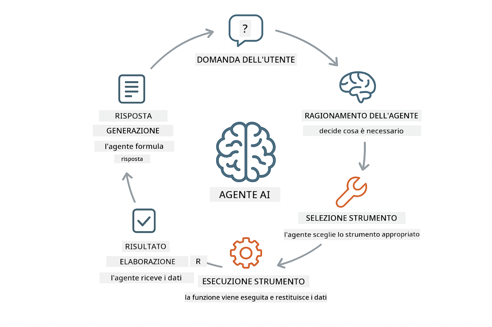
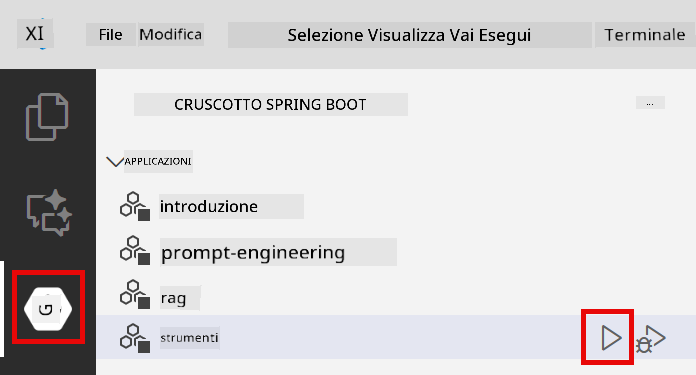
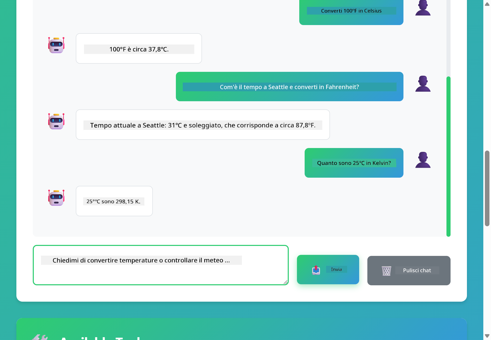

<!--
CO_OP_TRANSLATOR_METADATA:
{
  "original_hash": "13ec450c12cdd1a863baa2b778f27cd7",
  "translation_date": "2025-12-31T00:08:09+00:00",
  "source_file": "04-tools/README.md",
  "language_code": "it"
}
-->
# Module 04: Agenti AI con Strumenti

## Table of Contents

- [Cosa imparerai](../../../04-tools)
- [Prerequisiti](../../../04-tools)
- [Comprendere gli agenti AI con strumenti](../../../04-tools)
- [Come funziona l'invocazione di strumenti](../../../04-tools)
  - [Definizioni degli strumenti](../../../04-tools)
  - [Decisione](../../../04-tools)
  - [Esecuzione](../../../04-tools)
  - [Generazione della risposta](../../../04-tools)
- [Catena di strumenti](../../../04-tools)
- [Esegui l'applicazione](../../../04-tools)
- [Usare l'applicazione](../../../04-tools)
  - [Prova l'uso semplice degli strumenti](../../../04-tools)
  - [Testa la catena di strumenti](../../../04-tools)
  - [Vedi il flusso della conversazione](../../../04-tools)
  - [Osserva il ragionamento](../../../04-tools)
  - [Sperimenta con richieste diverse](../../../04-tools)
- [Concetti chiave](../../../04-tools)
  - [Pattern ReAct (Ragionamento e Azione)](../../../04-tools)
  - [Le descrizioni degli strumenti sono importanti](../../../04-tools)
  - [Gestione delle sessioni](../../../04-tools)
  - [Gestione degli errori](../../../04-tools)
- [Strumenti disponibili](../../../04-tools)
- [Quando usare agenti basati su strumenti](../../../04-tools)
- [Passi successivi](../../../04-tools)

## What You'll Learn

Finora hai imparato come avere conversazioni con l'AI, strutturare i prompt in modo efficace e ancorare le risposte ai tuoi documenti. Ma c'è ancora un limite fondamentale: i modelli di linguaggio possono solo generare testo. Non possono controllare il meteo, eseguire calcoli, interrogare database o interagire con sistemi esterni.

Gli strumenti cambiano questo. Dando al modello accesso a funzioni che può chiamare, lo trasformi da generatore di testo a agente che può compiere azioni. Il modello decide quando ha bisogno di uno strumento, quale strumento usare e quali parametri passare. Il tuo codice esegue la funzione e restituisce il risultato. Il modello incorpora quel risultato nella sua risposta.

## Prerequisites

- Completato Module 01 (risorse Azure OpenAI distribuite)
- File `.env` nella directory root con le credenziali Azure (creato da `azd up` in Module 01)

> **Nota:** Se non hai completato Module 01, segui prima le istruzioni di deployment lì.

## Understanding AI Agents with Tools

> **📝 Nota:** Il termine "agenti" in questo modulo si riferisce ad assistenti AI potenziati con capacità di chiamata strumenti. Questo è diverso dai pattern di **Agentic AI** (agenti autonomi con pianificazione, memoria e ragionamento multi-step) che tratteremo in [Module 05: MCP](../05-mcp/README.md).

Un agente AI con strumenti segue un pattern di ragionamento e azione (ReAct):

1. L'utente pone una domanda
2. L'agente ragiona su ciò che deve sapere
3. L'agente decide se ha bisogno di uno strumento per rispondere
4. Se sì, l'agente chiama lo strumento appropriato con i parametri corretti
5. Lo strumento esegue e restituisce i dati
6. L'agente incorpora il risultato e fornisce la risposta finale



*Il pattern ReAct - come gli agenti AI alternano ragionamento e azione per risolvere problemi*

Questo accade automaticamente. Definisci gli strumenti e le loro descrizioni. Il modello gestisce il processo decisionale su quando e come usarli.

## How Tool Calling Works

**Tool Definitions** - [WeatherTool.java](../../../04-tools/src/main/java/com/example/langchain4j/agents/tools/WeatherTool.java) | [TemperatureTool.java](../../../04-tools/src/main/java/com/example/langchain4j/agents/tools/TemperatureTool.java)

Definisci funzioni con descrizioni chiare e specifiche dei parametri. Il modello vede queste descrizioni nel suo system prompt e capisce cosa fa ciascuno strumento.

```java
@Component
public class WeatherTool {
    
    @Tool("Get the current weather for a location")
    public String getCurrentWeather(@P("Location name") String location) {
        // La logica per la ricerca del meteo
        return "Weather in " + location + ": 22°C, cloudy";
    }
}

@AiService
public interface Assistant {
    String chat(@MemoryId String sessionId, @UserMessage String message);
}

// Assistant è iniettato automaticamente da Spring Boot con:
// - bean ChatModel
// - Tutti i metodi @Tool dalle classi @Component
// - ChatMemoryProvider per la gestione delle sessioni
```

> **🤖 Prova con [GitHub Copilot](https://github.com/features/copilot) Chat:** Apri [`WeatherTool.java`](../../../04-tools/src/main/java/com/example/langchain4j/agents/tools/WeatherTool.java) e chiedi:
> - "How would I integrate a real weather API like OpenWeatherMap instead of mock data?"
> - "What makes a good tool description that helps the AI use it correctly?"
> - "How do I handle API errors and rate limits in tool implementations?"

**Decision Making**

Quando un utente chiede "What's the weather in Seattle?", il modello riconosce che ha bisogno dello weather tool. Genera una chiamata di funzione con il parametro location impostato su "Seattle".

**Execution** - [AgentService.java](../../../04-tools/src/main/java/com/example/langchain4j/agents/service/AgentService.java)

Spring Boot auto-wires l'interfaccia dichiarativa `@AiService` con tutti gli strumenti registrati, e LangChain4j esegue automaticamente le chiamate agli strumenti.

> **🤖 Prova con [GitHub Copilot](https://github.com/features/copilot) Chat:** Apri [`AgentService.java`](../../../04-tools/src/main/java/com/example/langchain4j/agents/service/AgentService.java) e chiedi:
> - "How does the ReAct pattern work and why is it effective for AI agents?"
> - "How does the agent decide which tool to use and in what order?"
> - "What happens if a tool execution fails - how should I handle errors robustly?"

**Response Generation**

Il modello riceve i dati meteo e li formatta in una risposta in linguaggio naturale per l'utente.

### Why Use Declarative AI Services?

Questo modulo utilizza l'integrazione Spring Boot di LangChain4j con interfacce dichiarative `@AiService`:

- **Spring Boot auto-wiring** - ChatModel e strumenti iniettati automaticamente
- **@MemoryId pattern** - Gestione automatica della memoria basata sulla sessione
- **Istanza singola** - Assistente creato una sola volta e riutilizzato per migliori prestazioni
- **Esecuzione type-safe** - Metodi Java chiamati direttamente con conversione di tipo
- **Orchestrazione multi-turn** - Gestisce automaticamente la catena di strumenti
- **Zero boilerplate** - Nessuna chiamata manuale AiServices.builder() o HashMap di memory

Approcci alternativi (manuale `AiServices.builder()`) richiedono più codice e non beneficiano dell'integrazione con Spring Boot.

## Tool Chaining

**Tool Chaining** - L'AI potrebbe chiamare più strumenti in sequenza. Chiedi "What's the weather in Seattle and should I bring an umbrella?" e osserva come concatena `getCurrentWeather` con il ragionamento sull'equipaggiamento per la pioggia.

<a href="images/tool-chaining.png"></a>

*Chiamate strumentali sequenziali - l'output di uno strumento nutre la decisione successiva*

**Graceful Failures** - Chiedi il meteo per una città che non è presente nei dati mock. Lo strumento restituisce un messaggio di errore e l'AI spiega che non può aiutare. Gli strumenti falliscono in modo sicuro.

Questo avviene in un singolo turno di conversazione. L'agente orchestra più chiamate agli strumenti autonomamente.

## Run the Application

**Verifica il deployment:**

Assicurati che il file `.env` esista nella directory root con le credenziali Azure (creato durante Module 01):
```bash
cat ../.env  # Dovrebbe mostrare AZURE_OPENAI_ENDPOINT, API_KEY, DEPLOYMENT
```

**Avvia l'applicazione:**

> **Nota:** Se hai già avviato tutte le applicazioni usando `./start-all.sh` da Module 01, questo modulo è già in esecuzione sulla porta 8084. Puoi saltare i comandi di avvio qui sotto e andare direttamente su http://localhost:8084.

**Opzione 1: Usare Spring Boot Dashboard (consigliato per utenti VS Code)**

Il dev container include l'estensione Spring Boot Dashboard, che fornisce un'interfaccia visiva per gestire tutte le applicazioni Spring Boot. La trovi nella Activity Bar sul lato sinistro di VS Code (cerca l'icona Spring Boot).

Dalla Spring Boot Dashboard, puoi:
- Vedere tutte le applicazioni Spring Boot disponibili nello workspace
- Avviare/fermare le applicazioni con un singolo clic
- Visualizzare i log dell'applicazione in tempo reale
- Monitorare lo stato delle applicazioni

Basta cliccare il pulsante play accanto a "tools" per avviare questo modulo, o avviare tutti i moduli contemporaneamente.



**Opzione 2: Usare script shell**

Avvia tutte le applicazioni web (modules 01-04):

**Bash:**
```bash
cd ..  # Dalla directory principale
./start-all.sh
```

**PowerShell:**
```powershell
cd ..  # Dalla directory principale
.\start-all.ps1
```

Oppure avvia solo questo modulo:

**Bash:**
```bash
cd 04-tools
./start.sh
```

**PowerShell:**
```powershell
cd 04-tools
.\start.ps1
```

Entrambi gli script caricano automaticamente le variabili d'ambiente dal file `.env` nella root e compileranno i JAR se non esistono.

> **Nota:** Se preferisci costruire manualmente tutti i moduli prima di avviare:
>
> **Bash:**
> ```bash
> cd ..  # Go to root directory
> mvn clean package -DskipTests
> ```
>
> **PowerShell:**
> ```powershell
> cd ..  # Go to root directory
> mvn clean package -DskipTests
> ```

Apri http://localhost:8084 nel tuo browser.

**Per fermare:**

**Bash:**
```bash
./stop.sh  # Solo questo modulo
# O
cd .. && ./stop-all.sh  # Tutti i moduli
```

**PowerShell:**
```powershell
.\stop.ps1  # Solo questo modulo
# O
cd ..; .\stop-all.ps1  # Tutti i moduli
```

## Using the Application

L'applicazione fornisce un'interfaccia web dove puoi interagire con un agente AI che ha accesso agli strumenti di meteo e conversione della temperatura.

<a href="images/tools-homepage.png"></a>

*L'interfaccia AI Agent Tools - esempi rapidi e interfaccia chat per interagire con gli strumenti*

**Prova l'uso semplice degli strumenti**

Inizia con una richiesta semplice: "Convert 100 degrees Fahrenheit to Celsius". L'agente riconosce che ha bisogno dello strumento di conversione della temperatura, lo chiama con i parametri corretti e restituisce il risultato. Nota quanto sia naturale - non hai specificato quale strumento usare o come chiamarlo.

**Testa la catena di strumenti**

Ora prova qualcosa di più complesso: "What's the weather in Seattle and convert it to Fahrenheit?" Guarda l'agente lavorare per passi. Prima ottiene il meteo (che restituisce i valori in Celsius), riconosce che deve convertire in Fahrenheit, chiama lo strumento di conversione e combina entrambi i risultati in una sola risposta.

**Vedi il flusso della conversazione**

L'interfaccia di chat mantiene la cronologia della conversazione, permettendoti di avere interazioni multi-turn. Puoi vedere tutte le query e risposte precedenti, rendendo facile tracciare la conversazione e capire come l'agente costruisce il contesto su più scambi.

<a href="images/tools-conversation-demo.png"></a>

*Conversazione multi-turn che mostra conversioni semplici, ricerche meteo e catena di strumenti*

**Sperimenta con richieste diverse**

Prova varie combinazioni:
- Ricerche meteo: "What's the weather in Tokyo?"
- Conversioni di temperatura: "What is 25°C in Kelvin?"
- Query combinate: "Check the weather in Paris and tell me if it's above 20°C"

Nota come l'agente interpreta il linguaggio naturale e lo mappa a chiamate appropriate agli strumenti.

## Key Concepts

**ReAct Pattern (Reasoning and Acting)**

L'agente alterna tra ragionamento (decidere cosa fare) e azione (usare strumenti). Questo pattern consente la risoluzione autonoma dei problemi invece di limitarsi a rispondere a istruzioni.

**Tool Descriptions Matter**

La qualità delle descrizioni dei tuoi strumenti influenza direttamente quanto bene l'agente li usa. Descrizioni chiare e specifiche aiutano il modello a capire quando e come chiamare ciascuno strumento.

**Session Management**

L'annotazione `@MemoryId` abilita la gestione automatica della memoria basata sulla sessione. Ogni session ID riceve la propria istanza `ChatMemory` gestita dal bean `ChatMemoryProvider`, eliminando la necessità di tracciare manualmente la memoria.

**Error Handling**

Gli strumenti possono fallire - le API vanno in timeout, i parametri potrebbero essere invalidi, i servizi esterni possono cadere. Gli agenti di produzione necessitano di gestione degli errori in modo che il modello possa spiegare i problemi o provare alternative.

## Available Tools

**Weather Tools** (dati mock per dimostrazione):
- Get current weather for a location
- Get multi-day forecast

**Temperature Conversion Tools**:
- Celsius to Fahrenheit
- Fahrenheit to Celsius
- Celsius to Kelvin
- Kelvin to Celsius
- Fahrenheit to Kelvin
- Kelvin to Fahrenheit

Questi sono esempi semplici, ma il pattern si estende a qualsiasi funzione: query a database, chiamate API, calcoli, operazioni su file o comandi di sistema.

## When to Use Tool-Based Agents

**Usa strumenti quando:**
- Rispondere richiede dati in tempo reale (meteo, prezzi azionari, inventario)
- Devi eseguire calcoli oltre la matematica semplice
- Accedere a database o API
- Compire azioni (inviare email, creare ticket, aggiornare record)
- Combinare più fonti di dati

**Non usare strumenti quando:**
- Le domande possono essere risposte con conoscenza generale
- La risposta è puramente conversazionale
- La latenza degli strumenti renderebbe l'esperienza troppo lenta

## Next Steps

**Modulo successivo:** [05-mcp - Model Context Protocol (MCP)](../05-mcp/README.md)

---

**Navigazione:** [← Precedente: Module 03 - RAG](../03-rag/README.md) | [Torna al principale](../README.md) | [Successivo: Module 05 - MCP →](../05-mcp/README.md)

---

<!-- CO-OP TRANSLATOR DISCLAIMER START -->
Esclusione di responsabilità:
Questo documento è stato tradotto utilizzando il servizio di traduzione automatica [Co-op Translator](https://github.com/Azure/co-op-translator). Pur impegnandoci per l'accuratezza, si prega di notare che le traduzioni automatizzate possono contenere errori o imprecisioni. Il documento originale nella sua lingua nativa deve essere considerato la fonte autorevole. Per informazioni critiche, si raccomanda una traduzione professionale effettuata da un traduttore umano. Non siamo responsabili per eventuali incomprensioni o interpretazioni errate derivanti dall'uso di questa traduzione.
<!-- CO-OP TRANSLATOR DISCLAIMER END -->