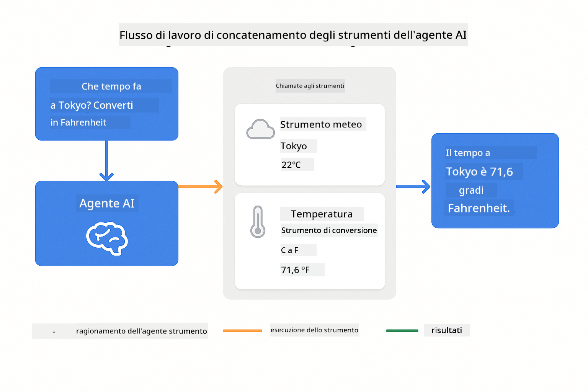
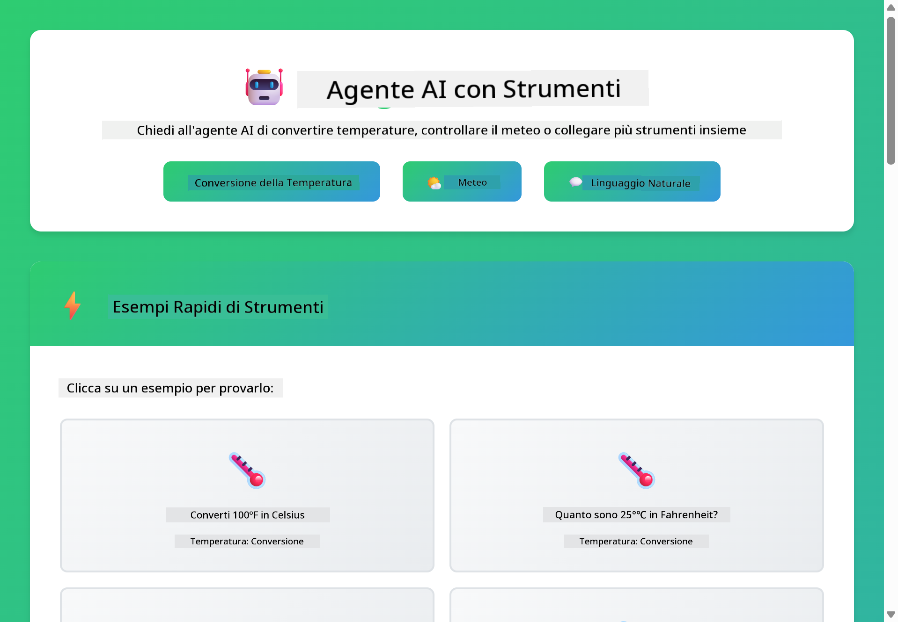

<!--
CO_OP_TRANSLATOR_METADATA:
{
  "original_hash": "aa23f106e7f53270924c9dd39c629004",
  "translation_date": "2025-12-13T18:50:33+00:00",
  "source_file": "04-tools/README.md",
  "language_code": "it"
}
-->
# Modulo 04: Agenti AI con Strumenti

## Indice

- [Cosa Imparerai](../../../04-tools)
- [Prerequisiti](../../../04-tools)
- [Comprendere gli Agenti AI con Strumenti](../../../04-tools)
- [Come Funziona la Chiamata agli Strumenti](../../../04-tools)
  - [Definizioni degli Strumenti](../../../04-tools)
  - [Processo Decisionale](../../../04-tools)
  - [Esecuzione](../../../04-tools)
  - [Generazione della Risposta](../../../04-tools)
- [Catena di Strumenti](../../../04-tools)
- [Esegui l'Applicazione](../../../04-tools)
- [Usare l'Applicazione](../../../04-tools)
  - [Prova l'Uso Semplice degli Strumenti](../../../04-tools)
  - [Testa la Catena di Strumenti](../../../04-tools)
  - [Vedi il Flusso della Conversazione](../../../04-tools)
  - [Osserva il Ragionamento](../../../04-tools)
  - [Sperimenta con Richieste Diverse](../../../04-tools)
- [Concetti Chiave](../../../04-tools)
  - [Pattern ReAct (Ragionare e Agire)](../../../04-tools)
  - [Le Descrizioni degli Strumenti Contano](../../../04-tools)
  - [Gestione della Sessione](../../../04-tools)
  - [Gestione degli Errori](../../../04-tools)
- [Strumenti Disponibili](../../../04-tools)
- [Quando Usare Agenti Basati su Strumenti](../../../04-tools)
- [Prossimi Passi](../../../04-tools)

## Cosa Imparerai

Finora, hai imparato come avere conversazioni con l'AI, strutturare efficacemente i prompt e ancorare le risposte ai tuoi documenti. Ma c'è ancora una limitazione fondamentale: i modelli di linguaggio possono solo generare testo. Non possono controllare il meteo, eseguire calcoli, interrogare database o interagire con sistemi esterni.

Gli strumenti cambiano questo. Dando al modello accesso a funzioni che può chiamare, lo trasformi da generatore di testo a un agente che può compiere azioni. Il modello decide quando ha bisogno di uno strumento, quale strumento usare e quali parametri passare. Il tuo codice esegue la funzione e restituisce il risultato. Il modello incorpora quel risultato nella sua risposta.

## Prerequisiti

- Completato il Modulo 01 (risorse Azure OpenAI distribuite)
- File `.env` nella directory principale con le credenziali Azure (creato da `azd up` nel Modulo 01)

> **Nota:** Se non hai completato il Modulo 01, segui prima le istruzioni di distribuzione lì.

## Comprendere gli Agenti AI con Strumenti

Un agente AI con strumenti segue un pattern di ragionamento e azione (ReAct):

1. L'utente fa una domanda
2. L'agente ragiona su cosa deve sapere
3. L'agente decide se ha bisogno di uno strumento per rispondere
4. Se sì, l'agente chiama lo strumento appropriato con i parametri corretti
5. Lo strumento esegue e restituisce i dati
6. L'agente incorpora il risultato e fornisce la risposta finale


*Il pattern ReAct - come gli agenti AI alternano ragionamento e azione per risolvere problemi*

Questo avviene automaticamente. Definisci gli strumenti e le loro descrizioni. Il modello gestisce il processo decisionale su quando e come usarli.

## Come Funziona la Chiamata agli Strumenti

**Definizioni degli Strumenti** - [WeatherTool.java](../../../04-tools/src/main/java/com/example/langchain4j/agents/tools/WeatherTool.java) | [TemperatureTool.java](../../../04-tools/src/main/java/com/example/langchain4j/agents/tools/TemperatureTool.java)

Definisci funzioni con descrizioni chiare e specifiche dei parametri. Il modello vede queste descrizioni nel suo prompt di sistema e capisce cosa fa ogni strumento.

```java
@Component
public class WeatherTool {
    
    @Tool("Get the current weather for a location")
    public String getCurrentWeather(@P("Location name") String location) {
        // La tua logica di ricerca meteo
        return "Weather in " + location + ": 22°C, cloudy";
    }
}

@AiService
public interface Assistant {
    String chat(@MemoryId String sessionId, @UserMessage String message);
}

// Assistant è automaticamente collegato da Spring Boot con:
// - Bean ChatModel
// - Tutti i metodi @Tool dalle classi @Component
// - ChatMemoryProvider per la gestione della sessione
```

> **🤖 Prova con la Chat di [GitHub Copilot](https://github.com/features/copilot):** Apri [`WeatherTool.java`](../../../04-tools/src/main/java/com/example/langchain4j/agents/tools/WeatherTool.java) e chiedi:
> - "Come integrerei una vera API meteo come OpenWeatherMap invece di dati mock?"
> - "Cosa rende una buona descrizione dello strumento che aiuta l'AI a usarlo correttamente?"
> - "Come gestisco errori API e limiti di chiamata nelle implementazioni degli strumenti?"

**Processo Decisionale**

Quando un utente chiede "Com'è il meteo a Seattle?", il modello riconosce che ha bisogno dello strumento meteo. Genera una chiamata di funzione con il parametro location impostato su "Seattle".

**Esecuzione** - [AgentService.java](../../../04-tools/src/main/java/com/example/langchain4j/agents/service/AgentService.java)

Spring Boot inietta automaticamente l'interfaccia dichiarativa `@AiService` con tutti gli strumenti registrati, e LangChain4j esegue automaticamente le chiamate agli strumenti.

> **🤖 Prova con la Chat di [GitHub Copilot](https://github.com/features/copilot):** Apri [`AgentService.java`](../../../04-tools/src/main/java/com/example/langchain4j/agents/service/AgentService.java) e chiedi:
> - "Come funziona il pattern ReAct e perché è efficace per gli agenti AI?"
> - "Come decide l'agente quale strumento usare e in quale ordine?"
> - "Cosa succede se l'esecuzione di uno strumento fallisce - come gestire robustamente gli errori?"

**Generazione della Risposta**

Il modello riceve i dati meteo e li formatta in una risposta in linguaggio naturale per l'utente.

### Perché Usare Servizi AI Dichiarativi?

Questo modulo usa l'integrazione Spring Boot di LangChain4j con interfacce dichiarative `@AiService`:

- **Iniezione automatica Spring Boot** - ChatModel e strumenti iniettati automaticamente
- **Pattern @MemoryId** - Gestione automatica della memoria basata sulla sessione
- **Istanza singola** - Assistente creato una volta e riutilizzato per migliori prestazioni
- **Esecuzione type-safe** - Metodi Java chiamati direttamente con conversione di tipo
- **Orchestrazione multi-turno** - Gestisce automaticamente la catena di strumenti
- **Zero boilerplate** - Nessuna chiamata manuale a AiServices.builder() o HashMap di memoria

Approcci alternativi (manuale `AiServices.builder()`) richiedono più codice e perdono i benefici dell'integrazione Spring Boot.

## Catena di Strumenti

**Catena di Strumenti** - L'AI può chiamare più strumenti in sequenza. Chiedi "Com'è il meteo a Seattle e dovrei portare un ombrello?" e guarda come concatena `getCurrentWeather` con un ragionamento sull'abbigliamento per la pioggia.

<a href="images/tool-chaining.png"></a>

*Chiamate sequenziali agli strumenti - l'output di uno alimenta la decisione successiva*

**Fallimenti Gestiti con Grazia** - Chiedi il meteo in una città non presente nei dati mock. Lo strumento restituisce un messaggio di errore e l'AI spiega che non può aiutare. Gli strumenti falliscono in modo sicuro.

Questo avviene in un singolo turno di conversazione. L'agente orchestra autonomamente più chiamate agli strumenti.

## Esegui l'Applicazione

**Verifica la distribuzione:**

Assicurati che il file `.env` esista nella directory principale con le credenziali Azure (creato durante il Modulo 01):
```bash
cat ../.env  # Dovrebbe mostrare AZURE_OPENAI_ENDPOINT, API_KEY, DEPLOYMENT
```

**Avvia l'applicazione:**

> **Nota:** Se hai già avviato tutte le applicazioni usando `./start-all.sh` dal Modulo 01, questo modulo è già in esecuzione sulla porta 8084. Puoi saltare i comandi di avvio qui sotto e andare direttamente a http://localhost:8084.

**Opzione 1: Usare Spring Boot Dashboard (Consigliato per utenti VS Code)**

Il container di sviluppo include l'estensione Spring Boot Dashboard, che fornisce un'interfaccia visiva per gestire tutte le applicazioni Spring Boot. La trovi nella Activity Bar a sinistra di VS Code (cerca l'icona Spring Boot).

Dal Spring Boot Dashboard puoi:
- Vedere tutte le applicazioni Spring Boot disponibili nello spazio di lavoro
- Avviare/fermare le applicazioni con un clic
- Visualizzare i log delle applicazioni in tempo reale
- Monitorare lo stato delle applicazioni

Clicca semplicemente il pulsante play accanto a "tools" per avviare questo modulo, o avvia tutti i moduli insieme.


**Opzione 2: Usare script shell**

Avvia tutte le applicazioni web (moduli 01-04):

**Bash:**
```bash
cd ..  # Dalla directory principale
./start-all.sh
```

**PowerShell:**
```powershell
cd ..  # Dalla directory principale
.\start-all.ps1
```

Oppure avvia solo questo modulo:

**Bash:**
```bash
cd 04-tools
./start.sh
```

**PowerShell:**
```powershell
cd 04-tools
.\start.ps1
```

Entrambi gli script caricano automaticamente le variabili d'ambiente dal file `.env` nella root e compileranno i JAR se non esistono.

> **Nota:** Se preferisci compilare manualmente tutti i moduli prima di avviare:
>
> **Bash:**
> ```bash
> cd ..  # Go to root directory
> mvn clean package -DskipTests
> ```
>
> **PowerShell:**
> ```powershell
> cd ..  # Go to root directory
> mvn clean package -DskipTests
> ```

Apri http://localhost:8084 nel tuo browser.

**Per fermare:**

**Bash:**
```bash
./stop.sh  # Solo questo modulo
# O
cd .. && ./stop-all.sh  # Tutti i moduli
```

**PowerShell:**
```powershell
.\stop.ps1  # Solo questo modulo
# O
cd ..; .\stop-all.ps1  # Tutti i moduli
```

## Usare l'Applicazione

L'applicazione fornisce un'interfaccia web dove puoi interagire con un agente AI che ha accesso a strumenti per il meteo e la conversione di temperatura.

<a href="images/tools-homepage.png"></a>

*Interfaccia Strumenti Agente AI - esempi rapidi e chat per interagire con gli strumenti*

**Prova l'Uso Semplice degli Strumenti**

Inizia con una richiesta semplice: "Converti 100 gradi Fahrenheit in Celsius". L'agente riconosce che ha bisogno dello strumento di conversione temperatura, lo chiama con i parametri corretti e restituisce il risultato. Nota quanto sia naturale - non hai specificato quale strumento usare o come chiamarlo.

**Testa la Catena di Strumenti**

Ora prova qualcosa di più complesso: "Com'è il meteo a Seattle e converti la temperatura in Fahrenheit?" Guarda l'agente lavorare per passi. Prima ottiene il meteo (che restituisce Celsius), riconosce che deve convertire in Fahrenheit, chiama lo strumento di conversione e combina entrambi i risultati in una risposta unica.

**Vedi il Flusso della Conversazione**

L'interfaccia chat mantiene la cronologia della conversazione, permettendoti di avere interazioni multi-turno. Puoi vedere tutte le query e risposte precedenti, facilitando il tracciamento della conversazione e la comprensione di come l'agente costruisce il contesto su più scambi.

<a href="images/tools-conversation-demo.png"></a>

*Conversazione multi-turno che mostra conversioni semplici, ricerche meteo e catena di strumenti*

**Sperimenta con Richieste Diverse**

Prova varie combinazioni:
- Ricerche meteo: "Com'è il meteo a Tokyo?"
- Conversioni di temperatura: "Quanto sono 25°C in Kelvin?"
- Query combinate: "Controlla il meteo a Parigi e dimmi se è sopra i 20°C"

Nota come l'agente interpreta il linguaggio naturale e lo mappa a chiamate appropriate agli strumenti.

## Concetti Chiave

**Pattern ReAct (Ragionare e Agire)**

L'agente alterna tra ragionamento (decidere cosa fare) e azione (usare strumenti). Questo pattern abilita la risoluzione autonoma dei problemi invece di rispondere solo a istruzioni.

**Le Descrizioni degli Strumenti Contano**

La qualità delle descrizioni degli strumenti influisce direttamente su quanto bene l'agente li usa. Descrizioni chiare e specifiche aiutano il modello a capire quando e come chiamare ogni strumento.

**Gestione della Sessione**

L'annotazione `@MemoryId` abilita la gestione automatica della memoria basata sulla sessione. Ogni ID sessione ottiene una propria istanza di `ChatMemory` gestita dal bean `ChatMemoryProvider`, eliminando la necessità di tracciare manualmente la memoria.

**Gestione degli Errori**

Gli strumenti possono fallire - le API possono andare in timeout, i parametri potrebbero essere invalidi, i servizi esterni possono non essere disponibili. Gli agenti in produzione necessitano di gestione degli errori affinché il modello possa spiegare i problemi o provare alternative.

## Strumenti Disponibili

**Strumenti Meteo** (dati mock per dimostrazione):
- Ottieni il meteo attuale per una località
- Ottieni previsioni multi-giorno

**Strumenti di Conversione Temperatura**:
- Celsius a Fahrenheit
- Fahrenheit a Celsius
- Celsius a Kelvin
- Kelvin a Celsius
- Fahrenheit a Kelvin
- Kelvin a Fahrenheit

Questi sono esempi semplici, ma il pattern si estende a qualsiasi funzione: query di database, chiamate API, calcoli, operazioni su file o comandi di sistema.

## Quando Usare Agenti Basati su Strumenti

**Usa strumenti quando:**
- La risposta richiede dati in tempo reale (meteo, prezzi azioni, inventario)
- Devi eseguire calcoli oltre la matematica semplice
- Accedi a database o API
- Devi compiere azioni (inviare email, creare ticket, aggiornare record)
- Combini più fonti di dati

**Non usare strumenti quando:**
- Le domande possono essere risposte con conoscenza generale
- La risposta è puramente conversazionale
- La latenza dello strumento renderebbe l'esperienza troppo lenta

## Prossimi Passi

**Prossimo Modulo:** [05-mcp - Model Context Protocol (MCP)](../05-mcp/README.md)

---

**Navigazione:** [← Precedente: Modulo 03 - RAG](../03-rag/README.md) | [Torna al Principale](../README.md) | [Successivo: Modulo 05 - MCP →](../05-mcp/README.md)

---

<!-- CO-OP TRANSLATOR DISCLAIMER START -->
**Disclaimer**:  
Questo documento è stato tradotto utilizzando il servizio di traduzione automatica [Co-op Translator](https://github.com/Azure/co-op-translator). Pur impegnandoci per garantire l’accuratezza, si prega di notare che le traduzioni automatiche possono contenere errori o imprecisioni. Il documento originale nella sua lingua nativa deve essere considerato la fonte autorevole. Per informazioni critiche, si raccomanda una traduzione professionale effettuata da un traduttore umano. Non ci assumiamo alcuna responsabilità per eventuali malintesi o interpretazioni errate derivanti dall’uso di questa traduzione.
<!-- CO-OP TRANSLATOR DISCLAIMER END -->