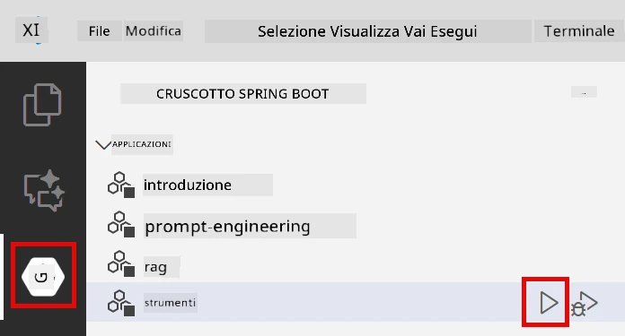
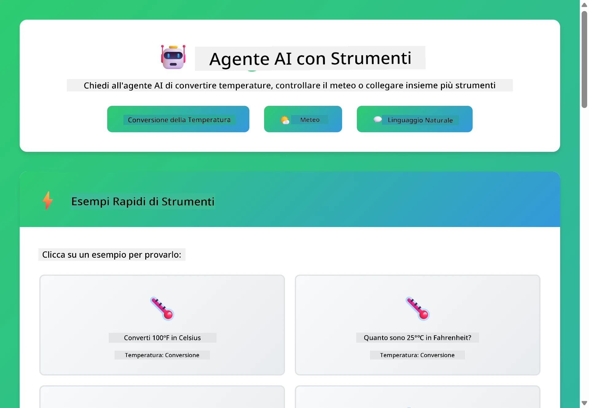
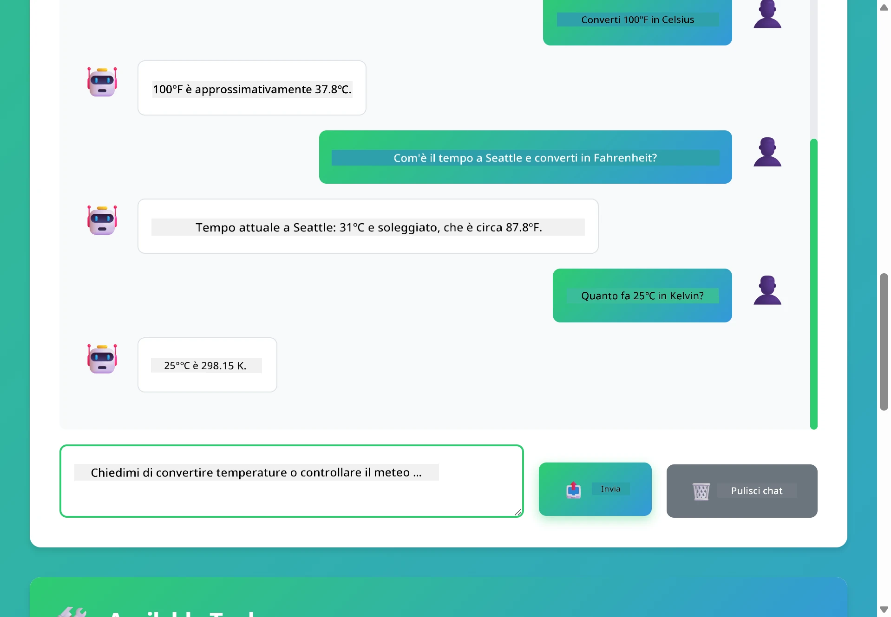

# Modulo 04: Agenti AI con Strumenti

## Indice

- [Video Esplicativo](#video-esplicativo)
- [Cosa Imparerai](#cosa-imparerai)
- [Prerequisiti](#prerequisiti)
- [Comprendere gli Agenti AI con Strumenti](#comprendere-gli-agenti-ai-con-strumenti)
- [Come Funziona la Chiamata agli Strumenti](#come-funziona-la-chiamata-agli-strumenti)
  - [Definizioni degli Strumenti](#definizioni-degli-strumenti)
  - [Processo Decisionale](#processo-decisionale)
  - [Esecuzione](#esecuzione)
  - [Generazione della Risposta](#generazione-della-risposta)
  - [Architettura: Auto-Wiring di Spring Boot](#architettura-auto-wiring-di-spring-boot)
- [Concatenazione degli Strumenti](#concatenazione-degli-strumenti)
- [Esegui l'Applicazione](#esegui-lapplicazione)
- [Utilizzo dell'Applicazione](#uso-dellapplicazione)
  - [Prova l'Uso Semplice di uno Strumento](#prova-un-uso-semplice-degli-strumenti)
  - [Testa la Concatenazione degli Strumenti](#prova-la-catena-di-strumenti)
  - [Visualizza il Flusso della Conversazione](#vedi-il-flusso-di-conversazione)
  - [Sperimenta con Richieste Diverse](#sperimenta-con-diverse-richieste)
- [Concetti Chiave](#concetti-chiave)
  - [Pattern ReAct (Ragionamento e Azione)](#pattern-react-ragionare-e-agire)
  - [Importanza delle Descrizioni degli Strumenti](#le-descrizioni-degli-strumenti-contano)
  - [Gestione della Sessione](#gestione-della-sessione)
  - [Gestione degli Errori](#gestione-degli-errori)
- [Strumenti Disponibili](#strumenti-disponibili)
- [Quando Usare Agenti Basati su Strumenti](#quando-usare-agenti-basati-su-strumenti)
- [Strumenti vs RAG](#strumenti-vs-rag)
- [Passi Successivi](#passi-successivi)

## Video Esplicativo

Guarda questa sessione dal vivo che spiega come iniziare con questo modulo:

<a href="https://www.youtube.com/watch?v=O_J30kZc0rw"></a>

## Cosa Imparerai

Finora, hai imparato come avere conversazioni con l'AI, strutturare efficacemente i prompt e basare le risposte sui tuoi documenti. Ma c'è ancora una limitazione fondamentale: i modelli linguistici possono solo generare testo. Non possono controllare il meteo, eseguire calcoli, interrogare database o interagire con sistemi esterni.

Gli strumenti cambiano questo. Fornendo al modello l'accesso a funzioni che può chiamare, lo trasformi da generatore di testo a un agente che può eseguire azioni. Il modello decide quando ha bisogno di uno strumento, quale usare e quali parametri passare. Il tuo codice esegue la funzione e restituisce il risultato. Il modello incorpora quel risultato nella sua risposta.

## Prerequisiti

- Completato [Modulo 01 - Introduzione](../01-introduction/README.md) (risorse Azure OpenAI distribuite)
- Completati i moduli precedenti consigliati (questo modulo fa riferimento ai [concetti RAG del Modulo 03](../03-rag/README.md) nel confronto Strumenti vs RAG)
- File `.env` nella directory radice con credenziali Azure (creato da `azd up` nel Modulo 01)

> **Nota:** Se non hai completato il Modulo 01, segui prima le istruzioni di distribuzione lì.

## Comprendere gli Agenti AI con Strumenti

> **📝 Nota:** Il termine "agenti" in questo modulo si riferisce ad assistenti AI arricchiti con capacità di chiamata di strumenti. Questo è diverso dai pattern **Agentic AI** (agenti autonomi con pianificazione, memoria e ragionamento multi-step) che tratteremo in [Modulo 05: MCP](../05-mcp/README.md).

Senza strumenti, un modello linguistico può solo generare testo dai suoi dati di addestramento. Chiedigli il meteo attuale e deve indovinare. Dagli strumenti, può chiamare un'API meteo, eseguire calcoli o interrogare un database — poi integra quei risultati reali nella risposta.


*Senza strumenti il modello può solo indovinare — con strumenti può chiamare API, eseguire calcoli e restituire dati in tempo reale.*

Un agente AI con strumenti segue un pattern di **Ragionamento e Azione (ReAct)**. Il modello non si limita a rispondere — pensa a ciò di cui ha bisogno, agisce chiamando uno strumento, osserva il risultato, poi decide se agire nuovamente o fornire la risposta finale:

1. **Ragionare** — L'agente analizza la domanda dell'utente e determina quali informazioni servono
2. **Agire** — L'agente seleziona lo strumento giusto, genera i parametri corretti e lo chiama
3. **Osservare** — L'agente riceve l'output dello strumento e valuta il risultato
4. **Ripetere o Rispondere** — Se servono più dati, l'agente ricomincia; altrimenti compone una risposta in linguaggio naturale


*Il ciclo ReAct — l'agente ragiona su cosa fare, agisce chiamando uno strumento, osserva il risultato e ripete finché può fornire la risposta finale.*

Questo avviene automaticamente. Definisci tu gli strumenti e le loro descrizioni. Il modello si occupa di decidere quando e come usarli.

## Come Funziona la Chiamata agli Strumenti

### Definizioni degli Strumenti

[WeatherTool.java](../../../04-tools/src/main/java/com/example/langchain4j/agents/tools/WeatherTool.java) | [TemperatureTool.java](../../../04-tools/src/main/java/com/example/langchain4j/agents/tools/TemperatureTool.java)

Definisci funzioni con descrizioni chiare e specifiche sui parametri. Il modello vede queste descrizioni nel prompt di sistema e capisce cosa fa ogni strumento.

```java
@Component
public class WeatherTool {
    
    @Tool("Get the current weather for a location")
    public String getCurrentWeather(@P("Location name") String location) {
        // La tua logica di ricerca meteo
        return "Weather in " + location + ": 22°C, cloudy";
    }
}

@AiService
public interface Assistant {
    String chat(@MemoryId String sessionId, @UserMessage String message);
}

// Assistant è automaticamente configurato da Spring Boot con:
// - Bean ChatModel
// - Tutti i metodi @Tool dalle classi @Component
// - ChatMemoryProvider per la gestione della sessione
```

Il diagramma sottostante scompone ogni annotazione e mostra come ciascun elemento aiuti l'AI a capire quando chiamare lo strumento e quali argomenti passare:


*Anatomia di una definizione di strumento — @Tool dice all'AI quando usarlo, @P descrive ogni parametro, e @AiService connette tutto all'avvio.*

> **🤖 Prova con [GitHub Copilot](https://github.com/features/copilot) Chat:** Apri [`WeatherTool.java`](../../../04-tools/src/main/java/com/example/langchain4j/agents/tools/WeatherTool.java) e chiedi:
> - "Come integrerei una vera API meteo come OpenWeatherMap invece dei dati mock?"
> - "Cosa rende una descrizione di uno strumento efficace per permettere all'AI di usarlo correttamente?"
> - "Come gestisco errori API e limiti di chiamata nelle implementazioni degli strumenti?"

### Processo Decisionale

Quando un utente chiede "Com'è il meteo a Seattle?", il modello non sceglie uno strumento a caso. Confronta l'intento dell'utente con ogni descrizione strumento accessibile, assegna un punteggio di pertinenza e seleziona la corrispondenza migliore. Genera quindi una chiamata di funzione strutturata con i parametri corretti — in questo caso, impostando `location` su `"Seattle"`.

Se nessuno strumento corrisponde alla richiesta, il modello risponde dalla sua conoscenza. Se più strumenti corrispondono, sceglie quello più specifico.


*Il modello valuta ogni strumento disponibile rispetto all'intento dell'utente e seleziona la corrispondenza migliore — per questo scrivere descrizioni chiare e specifiche è importante.*

### Esecuzione

[AgentService.java](../../../04-tools/src/main/java/com/example/langchain4j/agents/service/AgentService.java)

Spring Boot auto-collega l'interfaccia dichiarativa `@AiService` con tutti gli strumenti registrati, e LangChain4j esegue automaticamente le chiamate agli strumenti. Dietro le quinte, una chiamata completa passa attraverso sei fasi — dalla domanda in linguaggio naturale dell'utente fino alla risposta in linguaggio naturale:


*Il flusso end-to-end — l'utente chiede, il modello seleziona uno strumento, LangChain4j lo esegue, e il modello integra il risultato in una risposta naturale.*

Dietro le quinte, `AiServices` esegue lo stesso ciclo di chiamata per qualsiasi strumento — qui illustrato con un semplice `Calculator`. Il diagramma di sequenza qui sotto mostra esattamente cosa succede internamente:


*Il ciclo di chiamata dello strumento — `AiServices` invia il tuo messaggio e gli schemi degli strumenti al LLM, il LLM risponde con una chiamata di funzione come `add(42, 58)`, LangChain4j esegue localmente il metodo `Calculator`, e restituisce il risultato per la risposta finale.*

> **🤖 Prova con [GitHub Copilot](https://github.com/features/copilot) Chat:** Apri [`AgentService.java`](../../../04-tools/src/main/java/com/example/langchain4j/agents/service/AgentService.java) e chiedi:
> - "Come funziona il pattern ReAct e perché è efficace per agenti AI?"
> - "Come decide l'agente quale strumento usare e in che ordine?"
> - "Cosa succede se l'esecuzione di uno strumento fallisce - come gestire robustamente gli errori?"

### Generazione della Risposta

Il modello riceve i dati meteo e li formatta in una risposta in linguaggio naturale per l'utente.

### Architettura: Auto-Wiring di Spring Boot

Questo modulo usa l'integrazione Spring Boot di LangChain4j con interfacce dichiarative `@AiService`. All'avvio Spring Boot scopre ogni `@Component` che contiene metodi `@Tool`, il bean `ChatModel`, e il `ChatMemoryProvider` — poi li connette tutti in una singola interfaccia `Assistant` senza alcun boilerplate.


*L'interfaccia @AiService collega ChatModel, componenti degli strumenti e provider di memoria — Spring Boot gestisce automaticamente il wiring.*

Ecco il ciclo completo della richiesta come diagramma di sequenza — dalla richiesta HTTP passando per controller, servizio e proxy auto-collegato, fino all'esecuzione dello strumento e ritorno:


*Il ciclo completo della richiesta Spring Boot — la richiesta HTTP passa per controller e servizio fino al proxy Assistant auto-wired, che orchestra LLM e chiamate agli strumenti automaticamente.*

Vantaggi chiave di questo approccio:

- **Auto-wiring di Spring Boot** — ChatModel e strumenti iniettati automaticamente
- **Pattern @MemoryId** — Gestione automatica della memoria basata sulla sessione
- **Singola istanza** — Assistant creato una volta e riutilizzato per migliori prestazioni
- **Esecuzione type-safe** — Metodi Java chiamati direttamente con conversione tipi
- **Orchestrazione multi-turn** — Gestisce automaticamente concatenazione degli strumenti
- **Zero boilerplate** — Nessuna chiamata manuale a `AiServices.builder()` o mappe di memoria

Approcci alternativi (costruzione manuale con `AiServices.builder()`) richiedono più codice e perdono i vantaggi dell’integrazione con Spring Boot.

## Concatenazione degli Strumenti

**Tool Chaining** — La vera potenza degli agenti basati su strumenti si manifesta quando una singola domanda richiede più strumenti. Chiedi "Com'è il meteo a Seattle in Fahrenheit?" e l'agente concatena automaticamente due strumenti: prima chiama `getCurrentWeather` per ottenere la temperatura in Celsius, poi passa quel valore a `celsiusToFahrenheit` per la conversione — tutto in un solo turno di conversazione.


*Concatenazione degli strumenti in azione — l'agente chiama prima getCurrentWeather, poi passa il risultato Celsius a celsiusToFahrenheit, e fornisce una risposta combinata.*

**Gestione Elegante degli Errori** — Chiedi il meteo in una città non presente nei dati mock. Lo strumento restituisce un messaggio di errore, e l'AI spiega che non può aiutare invece di andare in crash. Gli strumenti falliscono in modo sicuro. Il diagramma seguente confronta i due approcci — con una gestione corretta degli errori, l'agente intercetta l'eccezione e risponde utilmente, mentre senza di essa l'intera applicazione crasha:


*Quando uno strumento fallisce, l'agente cattura l'errore e risponde con una spiegazione utile anziché crashare.*

Questo avviene in un singolo turno di conversazione. L'agente gestisce autonomamente più chiamate di strumenti.

## Esegui l'Applicazione

**Verifica la distribuzione:**

Assicurati che il file `.env` esista nella directory radice con le credenziali Azure (creato durante il Modulo 01). Esegui questo dal direttorio del modulo (`04-tools/`):

**Bash:**  
```bash
cat ../.env  # Dovrebbe mostrare AZURE_OPENAI_ENDPOINT, API_KEY, DEPLOYMENT
```
  
**PowerShell:**  
```powershell
Get-Content ..\.env  # Dovrebbe mostrare AZURE_OPENAI_ENDPOINT, API_KEY, DEPLOYMENT
```
  
**Avvia l'applicazione:**

> **Nota:** Se hai già avviato tutte le applicazioni usando `./start-all.sh` dalla directory radice (come descritto nel Modulo 01), questo modulo è già in esecuzione sulla porta 8084. Puoi saltare i comandi di avvio di seguito e andare direttamente a http://localhost:8084.

**Opzione 1: Usare Spring Boot Dashboard (Consigliato per utenti VS Code)**

Il contenitore di sviluppo include l'estensione Spring Boot Dashboard, che fornisce un'interfaccia visiva per gestire tutte le applicazioni Spring Boot. Puoi trovarla nella Activity Bar a sinistra di VS Code (cerca l'icona Spring Boot).

Dal Spring Boot Dashboard puoi:  
- Vedere tutte le applicazioni Spring Boot disponibili nel workspace  
- Avviare/fermare applicazioni con un clic  
- Visualizzare i log in tempo reale  
- Monitorare lo stato delle applicazioni

Clicca semplicemente il pulsante play accanto a "tools" per avviare questo modulo, o avvia tutti i moduli insieme.

Ecco come appare il Spring Boot Dashboard in VS Code:


*Il Cruscotto Spring Boot in VS Code — avvia, ferma e monitora tutti i moduli da un unico posto*

**Opzione 2: Uso di script shell**

Avvia tutte le applicazioni web (moduli 01-04):

**Bash:**
```bash
cd ..  # Dalla directory radice
./start-all.sh
```

**PowerShell:**
```powershell
cd ..  # Dalla directory root
.\start-all.ps1
```

Oppure avvia solo questo modulo:

**Bash:**
```bash
cd 04-tools
./start.sh
```

**PowerShell:**
```powershell
cd 04-tools
.\start.ps1
```

Entrambi gli script caricano automaticamente le variabili d'ambiente dal file `.env` nella root e compileranno i JAR se non esistono.

> **Nota:** Se preferisci compilare manualmente tutti i moduli prima dell'avvio:
>
> **Bash:**
> ```bash
> cd ..  # Go to root directory
> mvn clean package -DskipTests
> ```
>
> **PowerShell:**
> ```powershell
> cd ..  # Go to root directory
> mvn clean package -DskipTests
> ```

Apri http://localhost:8084 nel tuo browser.

**Per fermare:**

**Bash:**
```bash
./stop.sh  # Solo questo modulo
# O
cd .. && ./stop-all.sh  # Tutti i moduli
```

**PowerShell:**
```powershell
.\stop.ps1  # Solo questo modulo
# O
cd ..; .\stop-all.ps1  # Tutti i moduli
```

## Uso dell'Applicazione

L'applicazione offre un'interfaccia web dove puoi interagire con un agente AI che ha accesso agli strumenti meteo e di conversione della temperatura. Ecco come appare l'interfaccia — include esempi rapidi e un pannello chat per inviare richieste:

<a href="images/tools-homepage.png"></a>

*L'interfaccia Strumenti Agente AI - esempi rapidi e interfaccia chat per interagire con gli strumenti*

### Prova un Uso Semplice degli Strumenti

Inizia con una richiesta semplice: "Converti 100 gradi Fahrenheit in Celsius". L'agente riconosce che deve utilizzare lo strumento di conversione della temperatura, lo chiama con i parametri corretti e restituisce il risultato. Nota quanto sia naturale — non hai specificato quale strumento usare né come chiamarlo.

### Prova la Catena di Strumenti

Ora prova qualcosa di più complesso: "Com'è il tempo a Seattle e converti la temperatura in Fahrenheit?" Guarda l'agente lavorare a tappe. Prima ottiene le condizioni meteo (che ritorna in Celsius), riconosce che deve convertire in Fahrenheit, chiama lo strumento di conversione e combina entrambi i risultati in una risposta unica.

### Vedi il Flusso di Conversazione

L'interfaccia chat mantiene la cronologia della conversazione, permettendoti di avere interazioni multi-turno. Puoi vedere tutte le query e risposte precedenti, rendendo facile tracciare la conversazione e capire come l'agente costruisca il contesto nel corso degli scambi.

<a href="images/tools-conversation-demo.png"></a>

*Conversazione multi-turno che mostra conversioni semplici, ricerche meteo e concatenamento di strumenti*

### Sperimenta con Diverse Richieste

Prova varie combinazioni:
- Ricerche meteo: "Che tempo fa a Tokyo?"
- Conversioni di temperatura: "Quanto sono 25°C in Kelvin?"
- Query combinate: "Controlla il tempo a Parigi e dimmi se è sopra i 20°C"

Nota come l'agente interpreta il linguaggio naturale e lo mappa alle chiamate appropriate degli strumenti.

## Concetti Chiave

### Pattern ReAct (Ragionare e Agire)

L'agente alterna ragionamento (decidere cosa fare) e azione (uso degli strumenti). Questo pattern permette una risoluzione autonoma dei problemi più che una semplice risposta a istruzioni.

### Le Descrizioni degli Strumenti Contano

La qualità delle descrizioni degli strumenti influisce direttamente su quanto bene l'agente li utilizzi. Descrizioni chiare e specifiche aiutano il modello a capire quando e come chiamare ogni strumento.

### Gestione della Sessione

L'annotazione `@MemoryId` abilita la gestione automatica della memoria basata sulla sessione. Ogni ID sessione ottiene una propria istanza di `ChatMemory` gestita dal bean `ChatMemoryProvider`, così più utenti possono interagire con l'agente simultaneamente senza mescolare le conversazioni. Il diagramma seguente mostra come diversi utenti vengano indirizzati a memorie isolate in base ai loro ID sessione:


*Ogni ID sessione mappa a una cronologia conversazionale isolata — gli utenti non vedono mai i messaggi degli altri.*

### Gestione degli Errori

Gli strumenti possono fallire — le API scadono, i parametri possono essere invalidi, i servizi esterni possono non rispondere. Gli agenti di produzione necessitano di gestione errori affinché il modello possa spiegare i problemi o provare alternative anziché far crashare l'intera applicazione. Quando uno strumento lancia un'eccezione, LangChain4j la cattura e passa il messaggio d'errore al modello, che può quindi spiegare il problema in linguaggio naturale.

## Strumenti Disponibili

Il diagramma sotto mostra l'ecosistema ampio degli strumenti che puoi costruire. Questo modulo dimostra strumenti meteo e di temperatura, ma lo stesso pattern `@Tool` funziona per qualsiasi metodo Java — dalle query al database alle elaborazioni di pagamento.


*Qualsiasi metodo Java annotato con @Tool diventa disponibile all'AI — il pattern si estende a database, API, email, operazioni su file e altro.*

## Quando Usare Agenti Basati su Strumenti

Non tutte le richieste necessitano strumenti. La decisione dipende dal fatto che l'AI debba interagire con sistemi esterni o possa rispondere dal proprio sapere. La guida seguente riepiloga quando gli strumenti aggiungono valore e quando sono superflui:


*Una guida rapida — gli strumenti servono per dati in tempo reale, calcoli e azioni; conoscenza generale e compiti creativi non ne hanno bisogno.*

## Strumenti vs RAG

I moduli 03 e 04 estendono entrambi le capacità dell'AI, ma in modi fondamentalmente diversi. RAG dà al modello accesso alla **conoscenza** recuperando documenti. Gli strumenti danno al modello la capacità di compiere **azioni** chiamando funzioni. Il diagramma sotto confronta queste due strategie fianco a fianco — dal modo in cui opera ciascun workflow fino ai compromessi tra loro:


*RAG recupera informazioni da documenti statici — Strumenti eseguono azioni e ottengono dati dinamici e in tempo reale. Molti sistemi di produzione combinano entrambi.*

In pratica, molti sistemi di produzione combinano entrambi gli approcci: RAG per basare le risposte sulla documentazione, e Strumenti per recuperare dati vivi o eseguire operazioni.

## Passi Successivi

**Modulo Successivo:** [05-mcp - Model Context Protocol (MCP)](../05-mcp/README.md)

---

**Navigazione:** [← Precedente: Modulo 03 - RAG](../03-rag/README.md) | [Torna al Principale](../README.md) | [Successivo: Modulo 05 - MCP →](../05-mcp/README.md)

---

<!-- CO-OP TRANSLATOR DISCLAIMER START -->
**Disclaimer**:
Questo documento è stato tradotto utilizzando il servizio di traduzione AI [Co-op Translator](https://github.com/Azure/co-op-translator). Sebbene ci impegniamo per garantire la precisione, si prega di notare che le traduzioni automatizzate possono contenere errori o imprecisioni. Il documento originale nella sua lingua nativa deve essere considerato la fonte autorevole. Per informazioni critiche, si raccomanda una traduzione professionale effettuata da un essere umano. Non siamo responsabili per eventuali malintesi o interpretazioni errate derivanti dall’uso di questa traduzione.
<!-- CO-OP TRANSLATOR DISCLAIMER END -->