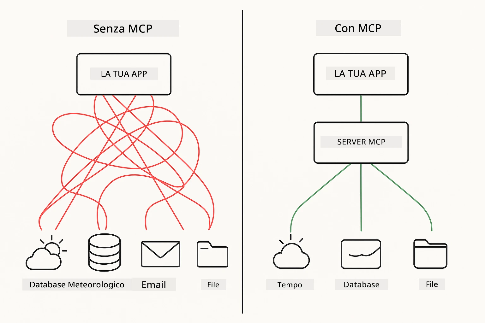
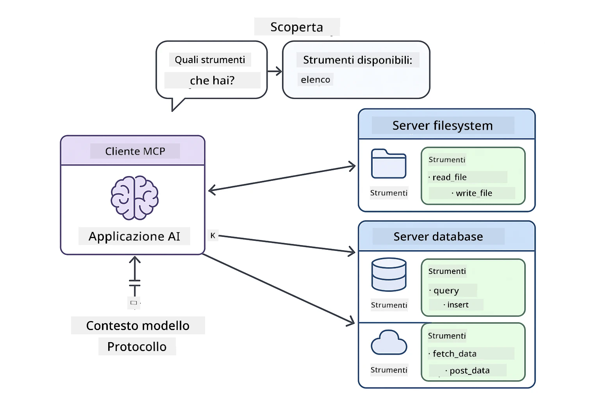
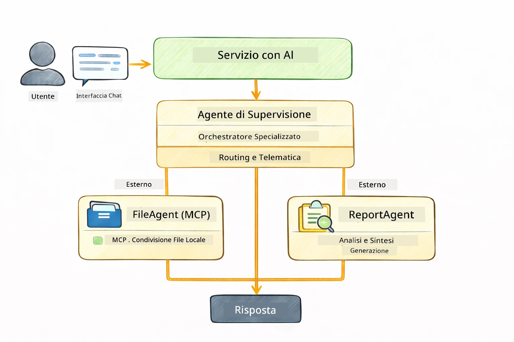

<!--
CO_OP_TRANSLATOR_METADATA:
{
  "original_hash": "6c816d130a1fa47570c11907e72d84ae",
  "translation_date": "2026-01-05T23:08:02+00:00",
  "source_file": "05-mcp/README.md",
  "language_code": "it"
}
-->
# Modulo 05: Protocollo del Contesto del Modello (MCP)

## Indice

- [Cosa Imparerai](../../../05-mcp)
- [Cos'è MCP?](../../../05-mcp)
- [Come Funziona MCP](../../../05-mcp)
- [Il Modulo Agentico](../../../05-mcp)
- [Esecuzione degli Esempi](../../../05-mcp)
  - [Prerequisiti](../../../05-mcp)
- [Avvio Rapido](../../../05-mcp)
  - [Operazioni su File (Stdio)](../../../05-mcp)
  - [Agente Supervisore](../../../05-mcp)
    - [Comprendere l'Uscita](../../../05-mcp)
    - [Strategie di Risposta](../../../05-mcp)
    - [Spiegazione delle Funzionalità del Modulo Agentico](../../../05-mcp)
- [Concetti Chiave](../../../05-mcp)
- [Congratulazioni!](../../../05-mcp)
  - [Cosa Fare Dopo?](../../../05-mcp)

## Cosa Imparerai

Hai costruito AI conversazionali, padroneggiato i prompt, ancorato le risposte nei documenti e creato agenti con strumenti. Ma tutti quegli strumenti erano costruiti su misura per la tua applicazione specifica. E se potessi dare alla tua AI accesso a un ecosistema standardizzato di strumenti che chiunque può creare e condividere? In questo modulo, imparerai proprio questo con il Protocollo del Contesto del Modello (MCP) e il modulo agentico di LangChain4j. Mostriamo prima un semplice lettore di file MCP e poi come si integra facilmente in flussi di lavoro agentici avanzati usando il modello dell’Agente Supervisore.

## Cos'è MCP?

Il Protocollo del Contesto del Modello (MCP) fornisce esattamente questo: un modo standard per le applicazioni AI di scoprire e usare strumenti esterni. Invece di scrivere integrazioni personalizzate per ogni fonte di dati o servizio, ti colleghi a server MCP che espongono le loro capacità in un formato coerente. Il tuo agente AI può quindi scoprire e usare automaticamente questi strumenti.



*Prima di MCP: integrazioni punto a punto complesse. Dopo MCP: un protocollo, possibilità infinite.*

MCP risolve un problema fondamentale nello sviluppo AI: ogni integrazione è personalizzata. Vuoi accedere a GitHub? Codice personalizzato. Vuoi leggere file? Codice personalizzato. Vuoi interrogare un database? Codice personalizzato. E nessuna di queste integrazioni funziona con altre applicazioni AI.

MCP standardizza tutto questo. Un server MCP espone strumenti con descrizioni chiare e schemi. Qualsiasi client MCP può connettersi, scoprire gli strumenti disponibili e usarli. Crea una volta, usa ovunque.



*Architettura del Protocollo del Contesto del Modello - scoperta ed esecuzione degli strumenti standardizzata*

## Come Funziona MCP

**Architettura Server-Client**

MCP usa un modello client-server. I server forniscono strumenti – lettura file, interrogazione database, chiamate API. I client (la tua applicazione AI) si collegano ai server e usano i loro strumenti.

Per usare MCP con LangChain4j, aggiungi questa dipendenza Maven:

```xml
<dependency>
    <groupId>dev.langchain4j</groupId>
    <artifactId>langchain4j-mcp</artifactId>
    <version>${langchain4j.version}</version>
</dependency>
```

**Scoperta degli Strumenti**

Quando il tuo client si connette a un server MCP, chiede "Quali strumenti hai?" Il server risponde con una lista di strumenti disponibili, ciascuno con descrizioni e schemi dei parametri. Il tuo agente AI può quindi decidere quali strumenti usare basandosi sulle richieste dell’utente.

**Meccanismi di Trasporto**

MCP supporta diversi meccanismi di trasporto. Questo modulo dimostra il trasporto Stdio per processi locali:


*Meccanismi di trasporto MCP: HTTP per server remoti, Stdio per processi locali*

**Stdio** - [StdioTransportDemo.java](../../../05-mcp/src/main/java/com/example/langchain4j/mcp/StdioTransportDemo.java)

Per processi locali. La tua applicazione avvia un server come sottoprocesso e comunica tramite input/output standard. Utile per accesso al filesystem o strumenti da linea di comando.

```java
McpTransport stdioTransport = new StdioMcpTransport.Builder()
    .command(List.of(
        npmCmd, "exec",
        "@modelcontextprotocol/server-filesystem@2025.12.18",
        resourcesDir
    ))
    .logEvents(false)
    .build();
```

> **🤖 Prova con la chat di [GitHub Copilot](https://github.com/features/copilot):** Apri [`StdioTransportDemo.java`](../../../05-mcp/src/main/java/com/example/langchain4j/mcp/StdioTransportDemo.java) e chiedi:
> - "Come funziona il trasporto Stdio e quando dovrei usarlo rispetto a HTTP?"
> - "Come gestisce LangChain4j il ciclo di vita dei processi server MCP avviati?"
> - "Quali sono le implicazioni di sicurezza nel dare all’AI accesso al filesystem?"

## Il Modulo Agentico

Mentre MCP fornisce strumenti standardizzati, il modulo **agentico** di LangChain4j offre un modo dichiarativo per costruire agenti che orchestrano questi strumenti. L’annotazione `@Agent` e `AgenticServices` ti permettono di definire il comportamento degli agenti tramite interfacce piuttosto che codice imperativo.

In questo modulo esplorerai il modello **Agente Supervisore** — un approccio agentico AI avanzato in cui un agente "supervisore" decide dinamicamente quali sotto-agenti invocare in base alle richieste dell’utente. Combineremo entrambi i concetti dandogli capacità di accesso file basate su MCP per uno dei nostri sotto-agenti.

Per usare il modulo agentico, aggiungi questa dipendenza Maven:

```xml
<dependency>
    <groupId>dev.langchain4j</groupId>
    <artifactId>langchain4j-agentic</artifactId>
    <version>${langchain4j.mcp.version}</version>
</dependency>
```

> **⚠️ Sperimentale:** il modulo `langchain4j-agentic` è **sperimentale** e soggetto a cambiamenti. Il modo stabile per costruire assistenti AI rimane `langchain4j-core` con strumenti personalizzati (Modulo 04).

## Esecuzione degli Esempi

### Prerequisiti

- Java 21+, Maven 3.9+
- Node.js 16+ e npm (per i server MCP)
- Variabili d’ambiente configurate nel file `.env` (dalla directory radice):
  - `AZURE_OPENAI_ENDPOINT`, `AZURE_OPENAI_API_KEY`, `AZURE_OPENAI_DEPLOYMENT` (come Moduli 01-04)

> **Nota:** Se non hai ancora configurato le variabili d’ambiente, consulta [Modulo 00 - Avvio Rapido](../00-quick-start/README.md) per istruzioni, oppure copia `.env.example` in `.env` nella directory radice e inserisci i tuoi valori.

## Avvio Rapido

**Usando VS Code:** Semplicemente clicca col tasto destro su un file demo nell’Explorer e seleziona **"Run Java"**, oppure usa le configurazioni di avvio dal pannello Run and Debug (assicurati di aver prima aggiunto il tuo token al file `.env`).

**Usando Maven:** In alternativa puoi eseguire da terminale con gli esempi seguenti.

### Operazioni su File (Stdio)

Qui si dimostra l’uso di strumenti basati su processi locali.

**✅ Nessun prerequisito** - il server MCP viene avviato automaticamente.

**Usando gli Script di Avvio (Consigliato):**

Gli script di avvio caricano automaticamente le variabili d’ambiente dal file `.env` radice:

**Bash:**
```bash
cd 05-mcp
chmod +x start-stdio.sh
./start-stdio.sh
```

**PowerShell:**
```powershell
cd 05-mcp
.\start-stdio.ps1
```

**Usando VS Code:** Clicca col destro su `StdioTransportDemo.java` e seleziona **"Run Java"** (assicurati che il tuo file `.env` sia configurato).

L’applicazione avvia automaticamente un server MCP filesystem e legge un file locale. Nota come la gestione del sottoprocesso è automatizzata per te.

**Output previsto:**
```
Assistant response: The file provides an overview of LangChain4j, an open-source Java library
for integrating Large Language Models (LLMs) into Java applications...
```

### Agente Supervisore

Il **modello Agente Supervisore** è una forma **flessibile** di AI agentica. Un Supervisore usa un LLM per decidere autonomamente quali agenti invocare in base alla richiesta dell’utente. Nell’esempio seguente combiniamo l’accesso file MCP con un agente LLM per creare un flusso controllato di lettura file → generazione report.

Nel demo, `FileAgent` legge un file usando gli strumenti MCP filesystem, e `ReportAgent` genera un report strutturato con sintesi esecutiva (1 frase), 3 punti chiave e raccomandazioni. Il Supervisore orchestra il flusso automaticamente:



```
┌─────────────┐      ┌──────────────┐
│  FileAgent  │ ───▶ │ ReportAgent  │
│ (MCP tools) │      │  (pure LLM)  │
└─────────────┘      └──────────────┘
   outputKey:           outputKey:
  'fileContent'         'report'
```

Ogni agente memorizza il proprio output nell’**Agentic Scope** (memoria condivisa), consentendo agli agenti successivi di accedere ai risultati precedenti. Questo dimostra come gli strumenti MCP si integrino senza soluzione di continuità nei flussi agentici — il Supervisore non deve sapere *come* i file vengono letti, ma solo che `FileAgent` può farlo.

#### Esecuzione del Demo

Gli script di avvio caricano automaticamente le variabili d’ambiente dal file `.env` radice:

**Bash:**
```bash
cd 05-mcp
chmod +x start-supervisor.sh
./start-supervisor.sh
```

**PowerShell:**
```powershell
cd 05-mcp
.\start-supervisor.ps1
```

**Usando VS Code:** Clicca col destro su `SupervisorAgentDemo.java` e seleziona **"Run Java"** (assicurati che il file `.env` sia configurato).

#### Come Funziona il Supervisore

```java
// Passo 1: FileAgent legge i file utilizzando gli strumenti MCP
FileAgent fileAgent = AgenticServices.agentBuilder(FileAgent.class)
        .chatModel(model)
        .toolProvider(mcpToolProvider)  // Ha strumenti MCP per le operazioni sui file
        .build();

// Passo 2: ReportAgent genera report strutturati
ReportAgent reportAgent = AgenticServices.agentBuilder(ReportAgent.class)
        .chatModel(model)
        .build();

// Il Supervisore coordina il flusso di lavoro file → report
SupervisorAgent supervisor = AgenticServices.supervisorBuilder()
        .chatModel(model)
        .subAgents(fileAgent, reportAgent)
        .responseStrategy(SupervisorResponseStrategy.LAST)  // Restituisce il report finale
        .build();

// Il Supervisore decide quali agenti invocare in base alla richiesta
String response = supervisor.invoke("Read the file at /path/file.txt and generate a report");
```

#### Strategie di Risposta

Quando configuri un `SupervisorAgent`, specifichi come deve formulare la risposta finale all’utente dopo che i sotto-agenti hanno completato i loro compiti. Le strategie disponibili sono:

| Strategia | Descrizione |
|-----------|-------------|
| **LAST** | Il supervisore restituisce l’output dell’ultimo sotto-agente o strumento chiamato. Utile quando l’ultimo agente nel flusso è specificamente progettato per produrre la risposta completa e finale (es. un "Agente Sintesi" in una pipeline di ricerca). |
| **SUMMARY** | Il supervisore usa il proprio Language Model (LLM) interno per sintetizzare un riassunto dell’intera interazione e degli output di tutti i sotto-agenti e restituisce quel riassunto come risposta finale. Fornisce una risposta aggregata e pulita all’utente. |
| **SCORED** | Il sistema usa un LLM interno per valutare sia l’ultima risposta che il riassunto dell’interazione rispetto alla richiesta originale dell’utente, restituendo l’output con il punteggio più alto. |

Consulta [SupervisorAgentDemo.java](../../../05-mcp/src/main/java/com/example/langchain4j/mcp/SupervisorAgentDemo.java) per l’implementazione completa.

> **🤖 Prova con la chat di [GitHub Copilot](https://github.com/features/copilot):** Apri [`SupervisorAgentDemo.java`](../../../05-mcp/src/main/java/com/example/langchain4j/mcp/SupervisorAgentDemo.java) e chiedi:
> - "Come decide il Supervisore quali agenti invocare?"
> - "Qual è la differenza tra i modelli Supervisore e Sequential?"
> - "Come posso personalizzare il comportamento di pianificazione del Supervisore?"

#### Comprendere l'Uscita

Quando esegui il demo, vedrai un percorso strutturato di come il Supervisore orchestra più agenti. Ecco cosa significa ogni sezione:

```
======================================================================
  FILE → REPORT WORKFLOW DEMO
======================================================================

This demo shows a clear 2-step workflow: read a file, then generate a report.
The Supervisor orchestrates the agents automatically based on the request.
```

**L’intestazione** introduce il concetto di flusso di lavoro: una pipeline mirata dalla lettura file alla generazione del report.

```
--- WORKFLOW ---------------------------------------------------------
  ┌─────────────┐      ┌──────────────┐
  │  FileAgent  │ ───▶ │ ReportAgent  │
  │ (MCP tools) │      │  (pure LLM)  │
  └─────────────┘      └──────────────┘
   outputKey:           outputKey:
   'fileContent'        'report'

--- AVAILABLE AGENTS -------------------------------------------------
  [FILE]   FileAgent   - Reads files via MCP → stores in 'fileContent'
  [REPORT] ReportAgent - Generates structured report → stores in 'report'
```

**Diagramma del flusso di lavoro** mostra il flusso dati tra gli agenti. Ogni agente ha un ruolo specifico:
- **FileAgent** legge file usando strumenti MCP e memorizza il contenuto grezzo in `fileContent`
- **ReportAgent** consuma quel contenuto e produce un report strutturato in `report`

```
--- USER REQUEST -----------------------------------------------------
  "Read the file at .../file.txt and generate a report on its contents"
```

**Richiesta Utente** mostra il compito. Il Supervisore la interpreta e decide di invocare FileAgent → ReportAgent.

```
--- SUPERVISOR ORCHESTRATION -----------------------------------------
  The Supervisor decides which agents to invoke and passes data between them...

  +-- STEP 1: Supervisor chose -> FileAgent (reading file via MCP)
  |
  |   Input: .../file.txt
  |
  |   Result: LangChain4j is an open-source, provider-agnostic Java framework for building LLM...
  +-- [OK] FileAgent (reading file via MCP) completed

  +-- STEP 2: Supervisor chose -> ReportAgent (generating structured report)
  |
  |   Input: LangChain4j is an open-source, provider-agnostic Java framew...
  |
  |   Result: Executive Summary...
  +-- [OK] ReportAgent (generating structured report) completed
```

**Orchestrazione del Supervisore** mostra il flusso in 2 passaggi:
1. **FileAgent** legge il file tramite MCP e memorizza il contenuto
2. **ReportAgent** riceve il contenuto e genera un report strutturato

Il Supervisore ha preso queste decisioni **autonomamente** basandosi sulla richiesta dell’utente.

```
--- FINAL RESPONSE ---------------------------------------------------
Executive Summary
...

Key Points
...

Recommendations
...

--- AGENTIC SCOPE (Data Flow) ----------------------------------------
  Each agent stores its output for downstream agents to consume:
  * fileContent: LangChain4j is an open-source, provider-agnostic Java framework...
  * report: Executive Summary...
```

#### Spiegazione delle Funzionalità del Modulo Agentico

L’esempio mostra diverse funzionalità avanzate del modulo agentico. Diamo uno sguardo più da vicino a Agentic Scope e Agent Listeners.

**Agentic Scope** mostra la memoria condivisa dove gli agenti hanno memorizzato i risultati usando `@Agent(outputKey="...")`. Questo permette di:
- Far accedere agli agenti successivi gli output di quelli precedenti
- Permettere al Supervisore di sintetizzare una risposta finale
- Ispezionare cosa ha prodotto ogni agente

```java
ResultWithAgenticScope<String> result = supervisor.invokeWithAgenticScope(request);
AgenticScope scope = result.agenticScope();
String fileContent = scope.readState("fileContent");  // Dati grezzi del file da FileAgent
String report = scope.readState("report");            // Rapporto strutturato da ReportAgent
```

**Agent Listeners** abilitano il monitoraggio e il debug dell’esecuzione degli agenti. L’output passo-passo che vedi nel demo deriva da un AgentListener che si aggancia a ogni invocazione agente:
- **beforeAgentInvocation** - Chiamato quando il Supervisore seleziona un agente, permette di vedere quale agente è stato scelto e perché
- **afterAgentInvocation** - Chiamato quando un agente termina, mostra il suo risultato
- **inheritedBySubagents** - Se vero, il listener monitora tutti gli agenti nella gerarchia

```java
AgentListener monitor = new AgentListener() {
    private int step = 0;
    
    @Override
    public void beforeAgentInvocation(AgentRequest request) {
        step++;
        System.out.println("  +-- STEP " + step + ": " + request.agentName());
    }
    
    @Override
    public void afterAgentInvocation(AgentResponse response) {
        System.out.println("  +-- [OK] " + response.agentName() + " completed");
    }
    
    @Override
    public boolean inheritedBySubagents() {
        return true; // Propagare a tutti i sotto-agenti
    }
};
```

Oltre al modello Supervisore, il modulo `langchain4j-agentic` fornisce diversi potenti pattern e funzionalità di flusso di lavoro:

| Pattern | Descrizione | Caso d’Uso |
|---------|-------------|------------|
| **Sequentiale** | Esegue agenti in ordine, output passa al successivo | Pipeline: ricerca → analisi → report |
| **Parallelo** | Esegue agenti simultaneamente | Compiti indipendenti: meteo + notizie + azioni |
| **Ciclo** | Itera finché non si soddisfa una condizione | Valutazione qualità: affina finché punteggio ≥ 0.8 |
| **Condizionale** | Instrada basandosi su condizioni | Classifica → indirizza a agente specialista |
| **Human-in-the-Loop** | Aggiunge checkpoint umani | Flussi di approvazione, revisione contenuti |

## Concetti Chiave

Ora che hai esplorato MCP e il modulo agentico in azione, riassumiamo quando usare ciascun approccio.

**MCP** è ideale quando vuoi sfruttare ecosistemi di strumenti esistenti, costruire strumenti che più applicazioni possono condividere, integrare servizi di terze parti con protocolli standard o sostituire implementazioni di strumenti senza cambiare codice.

**Il Modulo Agentico** funziona meglio quando vuoi definizioni di agenti dichiarative con annotazioni `@Agent`, necessiti orchestrazione di flussi di lavoro (sequenziale, ciclo, parallelo), preferisci il design di agenti basato su interfacce rispetto a codice imperativo o combini più agenti che condividono output tramite `outputKey`.

**Il modello Agente Supervisore** è eccellente quando il flusso di lavoro non è prevedibile a priori e vuoi che l’LLM decida, quando hai più agenti specializzati che necessitano di orchestrazione dinamica, quando costruisci sistemi conversazionali che instradano verso capacità diverse o quando vuoi il comportamento agente più flessibile e adattivo.
## Congratulazioni!

Hai completato il corso LangChain4j per Principianti. Hai imparato:

- Come costruire un'IA conversazionale con memoria (Modulo 01)
- Schemi di progettazione dei prompt per diversi compiti (Modulo 02)
- Basare le risposte sui tuoi documenti con RAG (Modulo 03)
- Creare agenti AI di base (assistenti) con strumenti personalizzati (Modulo 04)
- Integrare strumenti standardizzati con i moduli LangChain4j MCP e Agentic (Modulo 05)

### Cosa c'è dopo?

Dopo aver completato i moduli, esplora la [Guida ai Test](../docs/TESTING.md) per vedere i concetti di testing di LangChain4j in azione.

**Risorse Ufficiali:**
- [Documentazione LangChain4j](https://docs.langchain4j.dev/) - Guide complete e riferimento API
- [LangChain4j GitHub](https://github.com/langchain4j/langchain4j) - Codice sorgente ed esempi
- [Tutorial LangChain4j](https://docs.langchain4j.dev/tutorials/) - Tutorial passo-passo per vari casi d'uso

Grazie per aver completato questo corso!

---

**Navigazione:** [← Precedente: Modulo 04 - Strumenti](../04-tools/README.md) | [Torna alla pagina principale](../README.md)

---

<!-- CO-OP TRANSLATOR DISCLAIMER START -->
**Dichiarazione di non responsabilità**:
Questo documento è stato tradotto utilizzando il servizio di traduzione automatica [Co-op Translator](https://github.com/Azure/co-op-translator). Pur impegnandoci per garantire l'accuratezza, si prega di considerare che le traduzioni automatiche possono contenere errori o imprecisioni. Il documento originale nella sua lingua madre deve essere considerato la fonte autorizzata. Per informazioni critiche, si raccomanda una traduzione professionale umana. Non ci assumiamo responsabilità per eventuali malintesi o interpretazioni errate derivanti dall'uso di questa traduzione.
<!-- CO-OP TRANSLATOR DISCLAIMER END -->