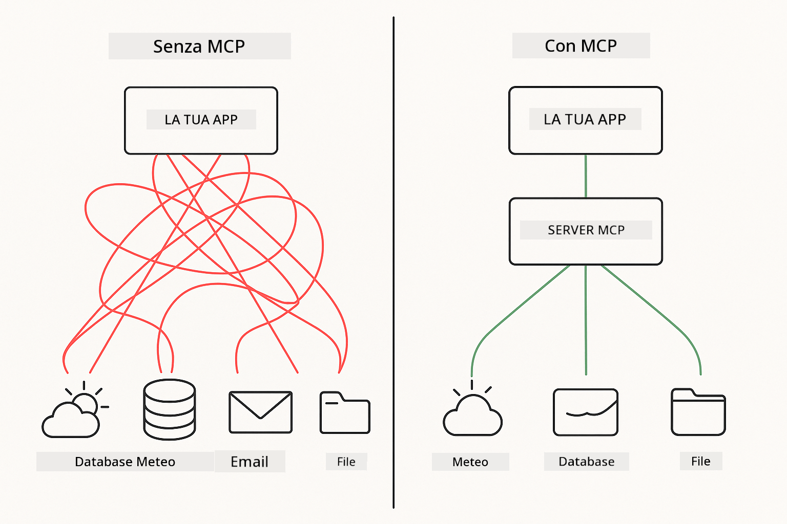

<!--
CO_OP_TRANSLATOR_METADATA:
{
  "original_hash": "c25ec1f10ef156c53e190cdf8b0711ab",
  "translation_date": "2025-12-13T17:50:33+00:00",
  "source_file": "05-mcp/README.md",
  "language_code": "it"
}
-->
# Modulo 05: Model Context Protocol (MCP)

## Indice

- [Cosa Imparerai](../../../05-mcp)
- [Comprendere MCP](../../../05-mcp)
- [Come Funziona MCP](../../../05-mcp)
  - [Architettura Server-Client](../../../05-mcp)
  - [Scoperta degli Strumenti](../../../05-mcp)
  - [Meccanismi di Trasporto](../../../05-mcp)
- [Prerequisiti](../../../05-mcp)
- [Cosa Copre Questo Modulo](../../../05-mcp)
- [Avvio Rapido](../../../05-mcp)
  - [Esempio 1: Calcolatrice Remota (Streamable HTTP)](../../../05-mcp)
  - [Esempio 2: Operazioni su File (Stdio)](../../../05-mcp)
  - [Esempio 3: Analisi Git (Docker)](../../../05-mcp)
- [Concetti Chiave](../../../05-mcp)
  - [Selezione del Trasporto](../../../05-mcp)
  - [Scoperta degli Strumenti](../../../05-mcp)
  - [Gestione della Sessione](../../../05-mcp)
  - [Considerazioni Cross-Platform](../../../05-mcp)
- [Quando Usare MCP](../../../05-mcp)
- [Ecosistema MCP](../../../05-mcp)
- [Congratulazioni!](../../../05-mcp)
  - [Cosa Fare Dopo?](../../../05-mcp)
- [Risoluzione dei Problemi](../../../05-mcp)

## Cosa Imparerai

Hai costruito AI conversazionali, padroneggiato i prompt, ancorato risposte in documenti e creato agenti con strumenti. Ma tutti quegli strumenti erano costruiti su misura per la tua applicazione specifica. E se potessi dare alla tua AI accesso a un ecosistema standardizzato di strumenti che chiunque può creare e condividere?

Il Model Context Protocol (MCP) fornisce esattamente questo: un modo standard per le applicazioni AI di scoprire e usare strumenti esterni. Invece di scrivere integrazioni personalizzate per ogni fonte di dati o servizio, ti connetti a server MCP che espongono le loro capacità in un formato coerente. Il tuo agente AI può quindi scoprire e usare automaticamente questi strumenti.



*Prima di MCP: integrazioni punto-punto complesse. Dopo MCP: un protocollo, infinite possibilità.*

## Comprendere MCP

MCP risolve un problema fondamentale nello sviluppo AI: ogni integrazione è personalizzata. Vuoi accedere a GitHub? Codice personalizzato. Vuoi leggere file? Codice personalizzato. Vuoi interrogare un database? Codice personalizzato. E nessuna di queste integrazioni funziona con altre applicazioni AI.

MCP standardizza questo. Un server MCP espone strumenti con descrizioni chiare e schemi. Qualsiasi client MCP può connettersi, scoprire gli strumenti disponibili e usarli. Costruisci una volta, usa ovunque.


*Architettura Model Context Protocol - scoperta ed esecuzione standardizzata degli strumenti*

## Come Funziona MCP

**Architettura Server-Client**

MCP usa un modello client-server. I server forniscono strumenti - lettura file, interrogazione database, chiamate API. I client (la tua applicazione AI) si connettono ai server e usano i loro strumenti.

**Scoperta degli Strumenti**

Quando il tuo client si connette a un server MCP, chiede "Quali strumenti hai?" Il server risponde con una lista di strumenti disponibili, ciascuno con descrizioni e schemi dei parametri. Il tuo agente AI può quindi decidere quali strumenti usare in base alle richieste dell'utente.

**Meccanismi di Trasporto**

MCP definisce due meccanismi di trasporto: HTTP per server remoti, Stdio per processi locali (inclusi container Docker):


*Meccanismi di trasporto MCP: HTTP per server remoti, Stdio per processi locali (inclusi container Docker)*

**Streamable HTTP** - [StreamableHttpDemo.java](../../../05-mcp/src/main/java/com/example/langchain4j/mcp/StreamableHttpDemo.java)

Per server remoti. La tua applicazione effettua richieste HTTP a un server in rete. Usa Server-Sent Events per comunicazione in tempo reale.

```java
McpTransport httpTransport = new StreamableHttpMcpTransport.Builder()
    .url("http://localhost:3001/mcp")
    .timeout(Duration.ofSeconds(60))
    .logRequests(true)
    .logResponses(true)
    .build();
```

> **🤖 Prova con [GitHub Copilot](https://github.com/features/copilot) Chat:** Apri [`StreamableHttpDemo.java`](../../../05-mcp/src/main/java/com/example/langchain4j/mcp/StreamableHttpDemo.java) e chiedi:
> - "In cosa MCP differisce dall'integrazione diretta degli strumenti come nel Modulo 04?"
> - "Quali sono i vantaggi di usare MCP per la condivisione degli strumenti tra applicazioni?"
> - "Come gestisco i fallimenti di connessione o timeout ai server MCP?"

**Stdio** - [StdioTransportDemo.java](../../../05-mcp/src/main/java/com/example/langchain4j/mcp/StdioTransportDemo.java)

Per processi locali. La tua applicazione avvia un server come sottoprocesso e comunica tramite input/output standard. Utile per accesso al filesystem o strumenti da linea di comando.

```java
McpTransport stdioTransport = new StdioMcpTransport.Builder()
    .command(List.of(
        npmCmd, "exec",
        "@modelcontextprotocol/server-filesystem@0.6.2",
        resourcesDir
    ))
    .logEvents(false)
    .build();
```

> **🤖 Prova con [GitHub Copilot](https://github.com/features/copilot) Chat:** Apri [`StdioTransportDemo.java`](../../../05-mcp/src/main/java/com/example/langchain4j/mcp/StdioTransportDemo.java) e chiedi:
> - "Come funziona il trasporto Stdio e quando dovrei usarlo rispetto a HTTP?"
> - "Come gestisce LangChain4j il ciclo di vita dei processi server MCP avviati?"
> - "Quali sono le implicazioni di sicurezza nel dare accesso AI al filesystem?"

**Docker (usa Stdio)** - [GitRepositoryAnalyzer.java](../../../05-mcp/src/main/java/com/example/langchain4j/mcp/GitRepositoryAnalyzer.java)

Per servizi containerizzati. Usa il trasporto stdio per comunicare con un container Docker tramite `docker run`. Utile per dipendenze complesse o ambienti isolati.

```java
McpTransport dockerTransport = new StdioMcpTransport.Builder()
    .command(List.of(
        "docker", "run",
        "-e", "GITHUB_PERSONAL_ACCESS_TOKEN=" + System.getenv("GITHUB_TOKEN"),
        "-v", volumeMapping,
        "-i", "mcp/git"
    ))
    .logEvents(true)
    .build();
```

> **🤖 Prova con [GitHub Copilot](https://github.com/features/copilot) Chat:** Apri [`GitRepositoryAnalyzer.java`](../../../05-mcp/src/main/java/com/example/langchain4j/mcp/GitRepositoryAnalyzer.java) e chiedi:
> - "Come isola il trasporto Docker i server MCP e quali sono i vantaggi?"
> - "Come configuro i mount dei volumi per condividere dati tra host e container MCP?"
> - "Quali sono le best practice per gestire il ciclo di vita dei server MCP basati su Docker in produzione?"

## Esecuzione degli Esempi

### Prerequisiti

- Java 21+, Maven 3.9+
- Node.js 16+ e npm (per server MCP)
- **Docker Desktop** - Deve essere **IN ESECUZIONE** per l'Esempio 3 (non solo installato)
- Token di Accesso Personale GitHub configurato nel file `.env` (dal Modulo 00)

> **Nota:** Se non hai ancora configurato il token GitHub, consulta [Modulo 00 - Avvio Rapido](../00-quick-start/README.md) per le istruzioni.

> **⚠️ Utenti Docker:** Prima di eseguire l'Esempio 3, verifica che Docker Desktop sia in esecuzione con `docker ps`. Se vedi errori di connessione, avvia Docker Desktop e attendi ~30 secondi per l'inizializzazione.

## Avvio Rapido

**Usando VS Code:** Basta cliccare con il tasto destro su un file demo nell'Explorer e selezionare **"Run Java"**, oppure usare le configurazioni di lancio dal pannello Run and Debug (assicurati di aver prima aggiunto il token nel file `.env`).

**Usando Maven:** In alternativa, puoi eseguire da linea di comando con gli esempi seguenti.

**⚠️ Importante:** Alcuni esempi hanno prerequisiti (come avviare un server MCP o costruire immagini Docker). Controlla i requisiti di ogni esempio prima di eseguire.

### Esempio 1: Calcolatrice Remota (Streamable HTTP)

Dimostra l'integrazione di strumenti basata su rete.

**⚠️ Prerequisito:** Devi prima avviare il server MCP (vedi Terminale 1 sotto).

**Terminale 1 - Avvia il server MCP:**

**Bash:**
```bash
git clone https://github.com/modelcontextprotocol/servers.git
cd servers/src/everything
npm install
node dist/streamableHttp.js
```

**PowerShell:**
```powershell
git clone https://github.com/modelcontextprotocol/servers.git
cd servers/src/everything
npm install
node dist/streamableHttp.js
```

**Terminale 2 - Esegui l'esempio:**

**Usando VS Code:** Clicca con il tasto destro su `StreamableHttpDemo.java` e seleziona **"Run Java"**.

**Usando Maven:**

**Bash:**
```bash
export GITHUB_TOKEN=your_token_here
cd 05-mcp
mvn compile exec:java -Dexec.mainClass=com.example.langchain4j.mcp.StreamableHttpDemo
```

**PowerShell:**
```powershell
$env:GITHUB_TOKEN=your_token_here
cd 05-mcp
mvn --% compile exec:java -Dexec.mainClass=com.example.langchain4j.mcp.StreamableHttpDemo
```

Guarda l'agente scoprire gli strumenti disponibili, poi usa la calcolatrice per eseguire addizioni.

### Esempio 2: Operazioni su File (Stdio)

Dimostra strumenti basati su sottoprocesso locale.

**✅ Nessun prerequisito necessario** - il server MCP viene avviato automaticamente.

**Usando VS Code:** Clicca con il tasto destro su `StdioTransportDemo.java` e seleziona **"Run Java"**.

**Usando Maven:**

**Bash:**
```bash
export GITHUB_TOKEN=your_token_here
cd 05-mcp
mvn compile exec:java -Dexec.mainClass=com.example.langchain4j.mcp.StdioTransportDemo
```

**PowerShell:**
```powershell
$env:GITHUB_TOKEN=your_token_here
cd 05-mcp
mvn --% compile exec:java -Dexec.mainClass=com.example.langchain4j.mcp.StdioTransportDemo
```

L'applicazione avvia automaticamente un server MCP per il filesystem e legge un file locale. Nota come la gestione del sottoprocesso è gestita per te.

**Output previsto:**
```
Assistant response: The content of the file is "Kaboom!".
```

### Esempio 3: Analisi Git (Docker)

Dimostra server di strumenti containerizzati.

**⚠️ Prerequisiti:** 
1. **Docker Desktop deve essere IN ESECUZIONE** (non solo installato)
2. **Utenti Windows:** modalità WSL 2 raccomandata (Impostazioni Docker Desktop → Generale → "Usa il motore basato su WSL 2"). La modalità Hyper-V richiede configurazione manuale della condivisione file.
3. Devi prima costruire l'immagine Docker (vedi Terminale 1 sotto)

**Verifica che Docker sia in esecuzione:**

**Bash:**
```bash
docker ps  # Dovrebbe mostrare la lista dei contenitori, non un errore
```

**PowerShell:**
```powershell
docker ps  # Dovrebbe mostrare la lista dei contenitori, non un errore
```

Se vedi un errore come "Cannot connect to Docker daemon" o "The system cannot find the file specified", avvia Docker Desktop e attendi che si inizializzi (~30 secondi).

**Risoluzione dei problemi:**
- Se l'AI segnala un repository vuoto o nessun file, il mount del volume (`-v`) non funziona.
- **Utenti Windows Hyper-V:** Aggiungi la directory del progetto in Impostazioni Docker Desktop → Risorse → Condivisione file, poi riavvia Docker Desktop.
- **Soluzione raccomandata:** Passa alla modalità WSL 2 per la condivisione file automatica (Impostazioni → Generale → abilita "Usa il motore basato su WSL 2").

**Terminale 1 - Costruisci l'immagine Docker:**

**Bash:**
```bash
cd servers/src/git
docker build -t mcp/git .
```

**PowerShell:**
```powershell
cd servers/src/git
docker build -t mcp/git .
```

**Terminale 2 - Esegui l'analizzatore:**

**Usando VS Code:** Clicca con il tasto destro su `GitRepositoryAnalyzer.java` e seleziona **"Run Java"**.

**Usando Maven:**

**Bash:**
```bash
export GITHUB_TOKEN=your_token_here
cd 05-mcp
mvn compile exec:java -Dexec.mainClass=com.example.langchain4j.mcp.GitRepositoryAnalyzer
```

**PowerShell:**
```powershell
$env:GITHUB_TOKEN=your_token_here
cd 05-mcp
mvn --% compile exec:java -Dexec.mainClass=com.example.langchain4j.mcp.GitRepositoryAnalyzer
```

L'applicazione avvia un container Docker, monta il tuo repository e analizza la struttura e i contenuti del repository tramite l'agente AI.

## Concetti Chiave

**Selezione del Trasporto**

Scegli in base a dove risiedono i tuoi strumenti:
- Servizi remoti → Streamable HTTP
- File system locale → Stdio
- Dipendenze complesse → Docker

**Scoperta degli Strumenti**

I client MCP scoprono automaticamente gli strumenti disponibili al momento della connessione. Il tuo agente AI vede le descrizioni degli strumenti e decide quali usare in base alla richiesta dell'utente.

**Gestione della Sessione**

Il trasporto Streamable HTTP mantiene sessioni, permettendo interazioni con stato con server remoti. I trasporti Stdio e Docker sono tipicamente senza stato.

**Considerazioni Cross-Platform**

Gli esempi gestiscono automaticamente le differenze di piattaforma (differenze di comandi Windows vs Unix, conversioni di percorso per Docker). Questo è importante per distribuzioni in produzione su ambienti diversi.

## Quando Usare MCP

**Usa MCP quando:**
- Vuoi sfruttare ecosistemi di strumenti esistenti
- Costruisci strumenti che più applicazioni useranno
- Integra servizi di terze parti con protocolli standard
- Hai bisogno di cambiare implementazioni di strumenti senza modifiche al codice

**Usa strumenti personalizzati (Modulo 04) quando:**
- Costruisci funzionalità specifiche per l'applicazione
- La performance è critica (MCP aggiunge overhead)
- I tuoi strumenti sono semplici e non verranno riutilizzati
- Hai bisogno di controllo completo sull'esecuzione


## Ecosistema MCP

Il Model Context Protocol è uno standard aperto con un ecosistema in crescita:

- Server MCP ufficiali per compiti comuni (filesystem, Git, database)
- Server contribuiti dalla community per vari servizi
- Descrizioni e schemi degli strumenti standardizzati
- Compatibilità cross-framework (funziona con qualsiasi client MCP)

Questa standardizzazione significa che gli strumenti costruiti per una applicazione AI funzionano con altre, creando un ecosistema condiviso di capacità.

## Congratulazioni!

Hai completato il corso LangChain4j per Principianti. Hai imparato:

- Come costruire AI conversazionali con memoria (Modulo 01)
- Pattern di prompt engineering per diversi compiti (Modulo 02)
- Ancorare risposte nei tuoi documenti con RAG (Modulo 03)
- Creare agenti AI con strumenti personalizzati (Modulo 04)
- Integrare strumenti standardizzati tramite MCP (Modulo 05)

Ora hai le basi per costruire applicazioni AI di produzione. I concetti appresi si applicano indipendentemente da framework o modelli specifici - sono pattern fondamentali nell'ingegneria AI.

### Cosa Fare Dopo?

Dopo aver completato i moduli, esplora la [Guida ai Test](../docs/TESTING.md) per vedere i concetti di testing di LangChain4j in azione.

**Risorse Ufficiali:**
- [Documentazione LangChain4j](https://docs.langchain4j.dev/) - Guide complete e riferimento API
- [LangChain4j GitHub](https://github.com/langchain4j/langchain4j) - Codice sorgente ed esempi
- [Tutorial LangChain4j](https://docs.langchain4j.dev/tutorials/) - Tutorial passo-passo per vari casi d'uso

Grazie per aver completato questo corso!

---

**Navigazione:** [← Precedente: Modulo 04 - Strumenti](../04-tools/README.md) | [Torna al Principale](../README.md)

---

## Risoluzione dei Problemi

### Sintassi Comando Maven PowerShell
**Problema**: I comandi Maven falliscono con l'errore `Unknown lifecycle phase ".mainClass=..."`

**Causa**: PowerShell interpreta `=` come operatore di assegnazione di variabile, interrompendo la sintassi delle proprietà Maven

**Soluzione**: Usa l'operatore di stop-parsing `--%` prima del comando Maven:

**PowerShell:**
```powershell
mvn --% compile exec:java -Dexec.mainClass=com.example.langchain4j.mcp.StreamableHttpDemo
```

**Bash:**
```bash
mvn compile exec:java -Dexec.mainClass=com.example.langchain4j.mcp.StreamableHttpDemo
```

L'operatore `--%` indica a PowerShell di passare tutti gli argomenti rimanenti letteralmente a Maven senza interpretazione.

### Problemi di Connessione Docker

**Problema**: I comandi Docker falliscono con "Cannot connect to Docker daemon" o "The system cannot find the file specified"

**Causa**: Docker Desktop non è in esecuzione o non è completamente inizializzato

**Soluzione**: 
1. Avvia Docker Desktop
2. Attendi ~30 secondi per la completa inizializzazione
3. Verifica con `docker ps` (dovrebbe mostrare la lista dei container, non un errore)
4. Quindi esegui il tuo esempio

### Montaggio Volume Docker su Windows

**Problema**: L'analizzatore del repository Git segnala repository vuoto o nessun file

**Causa**: Il montaggio del volume (`-v`) non funziona a causa della configurazione della condivisione file

**Soluzione**:
- **Consigliato:** Passa alla modalità WSL 2 (Impostazioni Docker Desktop → Generale → "Use the WSL 2 based engine")
- **Alternativa (Hyper-V):** Aggiungi la directory del progetto in Impostazioni Docker Desktop → Risorse → Condivisione file, quindi riavvia Docker Desktop

---

<!-- CO-OP TRANSLATOR DISCLAIMER START -->
**Disclaimer**:  
Questo documento è stato tradotto utilizzando il servizio di traduzione automatica [Co-op Translator](https://github.com/Azure/co-op-translator). Pur impegnandoci per garantire l’accuratezza, si prega di notare che le traduzioni automatiche possono contenere errori o imprecisioni. Il documento originale nella sua lingua nativa deve essere considerato la fonte autorevole. Per informazioni critiche, si raccomanda una traduzione professionale effettuata da un umano. Non ci assumiamo alcuna responsabilità per eventuali malintesi o interpretazioni errate derivanti dall’uso di questa traduzione.
<!-- CO-OP TRANSLATOR DISCLAIMER END -->