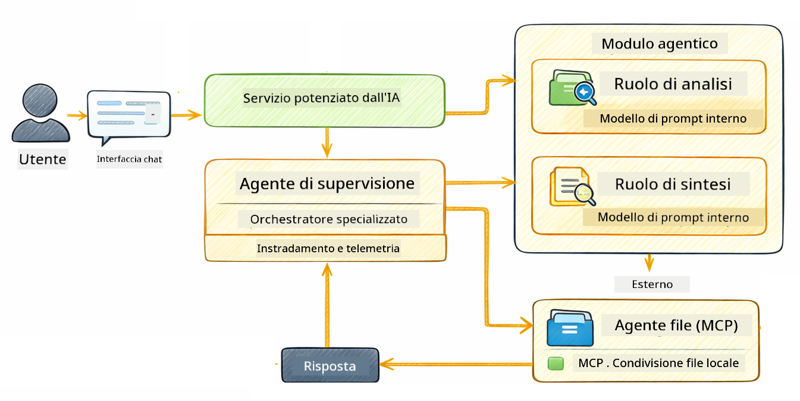

<!--
CO_OP_TRANSLATOR_METADATA:
{
  "original_hash": "f89f4c106d110e4943c055dd1a2f1dff",
  "translation_date": "2025-12-31T00:05:36+00:00",
  "source_file": "05-mcp/README.md",
  "language_code": "it"
}
-->
# Modulo 05: Protocollo del Contesto del Modello (MCP)

## Table of Contents

- [Cosa Imparerai](../../../05-mcp)
- [Cos'è MCP?](../../../05-mcp)
- [Come Funziona MCP](../../../05-mcp)
- [Il Modulo Agentic](../../../05-mcp)
- [Esecuzione degli Esempi](../../../05-mcp)
  - [Prerequisiti](../../../05-mcp)
- [Avvio Rapido](../../../05-mcp)
  - [Operazioni sui File (Stdio)](../../../05-mcp)
  - [Agente Supervisore](../../../05-mcp)
    - [Comprendere l'Output](../../../05-mcp)
    - [Spiegazione delle Funzionalità del Modulo Agentic](../../../05-mcp)
- [Concetti Chiave](../../../05-mcp)
- [Congratulazioni!](../../../05-mcp)
  - [E poi?](../../../05-mcp)

## Cosa Imparerai

Hai costruito AI conversazionale, padroneggiato i prompt, ancorato risposte ai documenti e creato agenti con strumenti. Ma tutti quegli strumenti erano costruiti su misura per la tua applicazione specifica. E se potessi dare alla tua AI accesso a un ecosistema standardizzato di strumenti che chiunque può creare e condividere? In questo modulo imparerai a fare proprio questo con il Model Context Protocol (MCP) e il modulo agentic di LangChain4j. Mostriamo prima un semplice lettore di file MCP e poi come si integra facilmente in workflow agentici avanzati usando il pattern Supervisor Agent.

## Cos'è MCP?

Il Model Context Protocol (MCP) fornisce esattamente questo: un modo standard per le applicazioni AI di scoprire e usare strumenti esterni. Invece di scrivere integrazioni personalizzate per ogni fonte di dati o servizio, ti connetti a server MCP che espongono le loro capacità in un formato coerente. Il tuo agente AI può quindi scoprire e usare questi strumenti automaticamente.


*Prima di MCP: integrazioni punto-a-punto complesse. Dopo MCP: un protocollo, infinite possibilità.*

MCP risolve un problema fondamentale nello sviluppo AI: ogni integrazione è personalizzata. Vuoi accedere a GitHub? Codice personalizzato. Vuoi leggere file? Codice personalizzato. Vuoi interrogare un database? Codice personalizzato. E nessuna di queste integrazioni funziona con altre applicazioni AI.

MCP standardizza tutto questo. Un server MCP espone strumenti con descrizioni chiare e schemi dei parametri. Qualsiasi client MCP può connettersi, scoprire gli strumenti disponibili e usarli. Costruisci una volta, usa ovunque.


*Architettura del Model Context Protocol - scoperta ed esecuzione di strumenti standardizzate*

## Come Funziona MCP

**Architettura Server-Client**

MCP usa un modello client-server. I server forniscono strumenti - lettura di file, interrogazione di database, chiamata di API. I client (la tua applicazione AI) si connettono ai server e usano i loro strumenti.

Per usare MCP con LangChain4j, aggiungi questa dipendenza Maven:

```xml
<dependency>
    <groupId>dev.langchain4j</groupId>
    <artifactId>langchain4j-mcp</artifactId>
    <version>${langchain4j.version}</version>
</dependency>
```

**Scoperta degli Strumenti**

Quando il tuo client si connette a un server MCP, chiede "Quali strumenti avete?" Il server risponde con una lista di strumenti disponibili, ognuno con descrizioni e schemi dei parametri. Il tuo agente AI può quindi decidere quali strumenti usare in base alle richieste dell'utente.

**Meccanismi di Trasporto**

MCP supporta diversi meccanismi di trasporto. Questo modulo dimostra il trasporto Stdio per processi locali:


*MCP meccanismi di trasporto: HTTP per server remoti, Stdio per processi locali*

**Stdio** - [StdioTransportDemo.java](../../../05-mcp/src/main/java/com/example/langchain4j/mcp/StdioTransportDemo.java)

Per processi locali. La tua applicazione avvia un server come sottoprocesso e comunica tramite input/output standard. Utile per l'accesso al filesystem o per strumenti da riga di comando.

```java
McpTransport stdioTransport = new StdioMcpTransport.Builder()
    .command(List.of(
        npmCmd, "exec",
        "@modelcontextprotocol/server-filesystem@2025.12.18",
        resourcesDir
    ))
    .logEvents(false)
    .build();
```

> **🤖 Prova con [GitHub Copilot](https://github.com/features/copilot) Chat:** Apri [`StdioTransportDemo.java`](../../../05-mcp/src/main/java/com/example/langchain4j/mcp/StdioTransportDemo.java) e chiedi:
> - "Come funziona il trasporto Stdio e quando dovrei usarlo rispetto a HTTP?"
> - "Come gestisce LangChain4j il ciclo di vita dei processi server MCP avviati?"
> - "Quali sono le implicazioni di sicurezza nel dare all'AI accesso al file system?"

## Il Modulo Agentic

Mentre MCP fornisce strumenti standardizzati, il modulo **agentic** di LangChain4j offre un modo dichiarativo per costruire agenti che orchestrano quegli strumenti. L'annotazione `@Agent` e `AgenticServices` ti permettono di definire il comportamento dell'agente tramite interfacce anziché codice imperativo.

In questo modulo esplorerai il pattern **Agente Supervisore** — un approccio agentico avanzato in cui un agente "supervisore" decide dinamicamente quali sotto-agenti invocare in base alle richieste dell'utente. Combineremo entrambi i concetti dando a uno dei nostri sotto-agenti capacità di accesso ai file potenziate da MCP.

Per usare il modulo agentic, aggiungi questa dipendenza Maven:

```xml
<dependency>
    <groupId>dev.langchain4j</groupId>
    <artifactId>langchain4j-agentic</artifactId>
    <version>${langchain4j.mcp.version}</version>
</dependency>
```

> **⚠️ Sperimentale:** Il modulo `langchain4j-agentic` è **sperimentale** ed è soggetto a cambiamenti. Il modo stabile per costruire assistenti AI resta `langchain4j-core` con strumenti personalizzati (Modulo 04).

## Esecuzione degli Esempi

### Prerequisiti

- Java 21+, Maven 3.9+
- Node.js 16+ e npm (per i server MCP)
- Variabili d'ambiente configurate nel file `.env` (dalla directory root):
  - **Per StdioTransportDemo:** `GITHUB_TOKEN` (GitHub Personal Access Token)
  - **Per SupervisorAgentDemo:** `AZURE_OPENAI_ENDPOINT`, `AZURE_OPENAI_API_KEY`, `AZURE_OPENAI_DEPLOYMENT` (uguali ai Moduli 01-04)

> **Nota:** Se non hai ancora configurato le variabili d'ambiente, vedi [Module 00 - Quick Start](../00-quick-start/README.md) per le istruzioni, oppure copia `.env.example` in `.env` nella directory root e compila i tuoi valori.

## Avvio Rapido

**Usando VS Code:** Fai semplicemente clic con il tasto destro su qualsiasi file demo nell'Explorer e seleziona **"Run Java"**, oppure usa le configurazioni di avvio dal pannello Run and Debug (assicurati prima di aver aggiunto il tuo token al file `.env`).

**Usando Maven:** In alternativa, puoi eseguire dalla riga di comando con gli esempi qui sotto.

### Operazioni sui File (Stdio)

Questo dimostra strumenti basati su sottoprocessi locali.

**✅ Nessun prerequisito necessario** - il server MCP viene avviato automaticamente.

**Usando VS Code:** Fai clic con il tasto destro su `StdioTransportDemo.java` e seleziona **"Run Java"**.

**Usando Maven:**

**Bash:**
```bash
export GITHUB_TOKEN=your_token_here
cd 05-mcp
mvn compile exec:java -Dexec.mainClass=com.example.langchain4j.mcp.StdioTransportDemo
```

**PowerShell:**
```powershell
$env:GITHUB_TOKEN=your_token_here
cd 05-mcp
mvn --% compile exec:java -Dexec.mainClass=com.example.langchain4j.mcp.StdioTransportDemo
```

L'applicazione avvia automaticamente un server MCP per il filesystem e legge un file locale. Nota come la gestione del sottoprocesso è gestita per te.

**Output previsto:**
```
Assistant response: The file provides an overview of LangChain4j, an open-source Java library
for integrating Large Language Models (LLMs) into Java applications...
```

### Agente Supervisore




Il **pattern Agente Supervisore** è una forma **flessibile** di AI agentica. A differenza dei workflow deterministici (sequenziali, a ciclo, paralleli), un Supervisore usa un LLM per decidere autonomamente quali agenti invocare in base alla richiesta dell'utente.

**Combinare il Supervisore con MCP:** In questo esempio, diamo a `FileAgent` accesso agli strumenti del filesystem MCP tramite `toolProvider(mcpToolProvider)`. Quando un utente chiede di "leggere e analizzare un file", il Supervisore analizza la richiesta e genera un piano di esecuzione. Poi instrada la richiesta a `FileAgent`, che usa lo strumento `read_file` di MCP per recuperare il contenuto. Il Supervisore passa quindi quel contenuto a `AnalysisAgent` per l'interpretazione, e opzionalmente invoca `SummaryAgent` per sintetizzare i risultati.

Questo dimostra come gli strumenti MCP si integrino senza soluzione di continuità nei workflow agentici — il Supervisore non deve sapere *come* i file vengono letti, solo che `FileAgent` può farlo. Il Supervisore si adatta dinamicamente a diversi tipi di richieste e restituisce o l'ultima risposta dell'agente o un sommario di tutte le operazioni.

**Usando gli script di avvio (consigliato):**

Gli script di avvio caricano automaticamente le variabili d'ambiente dal file `.env` della root:

**Bash:**
```bash
cd 05-mcp
chmod +x start.sh
./start.sh
```

**PowerShell:**
```powershell
cd 05-mcp
.\start.ps1
```

**Usando VS Code:** Fai clic con il tasto destro su `SupervisorAgentDemo.java` e seleziona **"Run Java"** (assicurati che il tuo file `.env` sia configurato).

**Come Funziona il Supervisore:**

```java
// Definire più agenti con capacità specifiche
FileAgent fileAgent = AgenticServices.agentBuilder(FileAgent.class)
        .chatModel(model)
        .toolProvider(mcpToolProvider)  // Dispone di strumenti MCP per le operazioni sui file
        .build();

AnalysisAgent analysisAgent = AgenticServices.agentBuilder(AnalysisAgent.class)
        .chatModel(model)
        .build();

SummaryAgent summaryAgent = AgenticServices.agentBuilder(SummaryAgent.class)
        .chatModel(model)
        .build();

// Creare un Supervisore che orchestra questi agenti
SupervisorAgent supervisor = AgenticServices.supervisorBuilder()
        .chatModel(model)  // Il modello "planner"
        .subAgents(fileAgent, analysisAgent, summaryAgent)
        .responseStrategy(SupervisorResponseStrategy.SUMMARY)
        .build();

// Il Supervisore decide autonomamente quali agenti invocare
// Basta fornire una richiesta in linguaggio naturale - l'LLM pianifica l'esecuzione
String response = supervisor.invoke("Read the file at /path/file.txt and analyze it");
```

Vedi [SupervisorAgentDemo.java](../../../05-mcp/src/main/java/com/example/langchain4j/mcp/SupervisorAgentDemo.java) per l'implementazione completa.

> **🤖 Prova con [GitHub Copilot](https://github.com/features/copilot) Chat:** Apri [`SupervisorAgentDemo.java`](../../../05-mcp/src/main/java/com/example/langchain4j/mcp/SupervisorAgentDemo.java) e chiedi:
> - "Come decide il Supervisore quali agenti invocare?"
> - "Qual è la differenza tra il Supervisore e i pattern di workflow Sequenziale?"
> - "Come posso personalizzare il comportamento di pianificazione del Supervisore?"

#### Comprendere l'Output

Quando esegui la demo, vedrai una guida strutturata di come il Supervisore orchestra più agenti. Ecco cosa significa ogni sezione:

```
======================================================================
  SUPERVISOR AGENT DEMO
======================================================================

This demo shows how a Supervisor Agent orchestrates multiple specialized agents.
The Supervisor uses an LLM to decide which agent to call based on the task.
```

**L'intestazione** introduce la demo e spiega il concetto principale: il Supervisore usa un LLM (non regole hardcoded) per decidere quali agenti chiamare.

```
--- AVAILABLE AGENTS -------------------------------------------------
  [FILE]     FileAgent     - Reads files using MCP filesystem tools
  [ANALYZE]  AnalysisAgent - Analyzes content for structure, tone, and themes
  [SUMMARY]  SummaryAgent  - Creates concise summaries of content
```

**Agenti Disponibili** mostra i tre agenti specializzati che il Supervisore può scegliere. Ogni agente ha una capacità specifica:
- **FileAgent** può leggere file usando gli strumenti MCP (capacità esterna)
- **AnalysisAgent** analizza contenuti (capacità puramente LLM)
- **SummaryAgent** crea sommari (capacità puramente LLM)

```
--- USER REQUEST -----------------------------------------------------
  "Read the file at .../file.txt and analyze what it's about"
```

**Richiesta Utente** mostra cosa è stato chiesto. Il Supervisore deve analizzarla e decidere quali agenti invocare.

```
--- SUPERVISOR ORCHESTRATION -----------------------------------------
  The Supervisor will now decide which agents to invoke and in what order...

  +-- STEP 1: Supervisor chose -> FileAgent (reading file via MCP)
  |
  |   Input: .../file.txt
  |
  |   Result: LangChain4j is an open-source Java library designed to simplify...
  +-- [OK] FileAgent (reading file via MCP) completed

  +-- STEP 2: Supervisor chose -> AnalysisAgent (analyzing content)
  |
  |   Input: LangChain4j is an open-source Java library...
  |
  |   Result: Structure: The content is organized into clear paragraphs that int...
  +-- [OK] AnalysisAgent (analyzing content) completed
```

**Orchestrazione del Supervisore** è dove avviene la magia. Guarda come:
1. Il Supervisore **ha scelto prima FileAgent** perché la richiesta menzionava "leggere il file"
2. FileAgent ha usato lo strumento `read_file` di MCP per recuperare il contenuto del file
3. Il Supervisore poi **ha scelto AnalysisAgent** e gli ha passato il contenuto del file
4. AnalysisAgent ha analizzato la struttura, il tono e i temi

Nota che il Supervisore ha preso queste decisioni **in modo autonomo** basandosi sulla richiesta dell'utente — nessun workflow hardcoded!

**Risposta Finale** è la risposta sintetizzata dal Supervisore, che combina gli output di tutti gli agenti invocati. L'esempio stampa lo scope agentico mostrando il sommario e i risultati di analisi memorizzati da ciascun agente.

```
--- FINAL RESPONSE ---------------------------------------------------
I read the contents of the file and analyzed its structure, tone, and key themes.
The file introduces LangChain4j as an open-source Java library for integrating
large language models...

--- AGENTIC SCOPE (Shared Memory) ------------------------------------
  Agents store their results in a shared scope for other agents to use:
  * summary: LangChain4j is an open-source Java library...
  * analysis: Structure: The content is organized into clear paragraphs that in...
```

### Spiegazione delle Funzionalità del Modulo Agentic

L'esempio dimostra diverse funzionalità avanzate del modulo agentic. Diamo un'occhiata più da vicino ad Agentic Scope e Agent Listeners.

**Agentic Scope** mostra la memoria condivisa dove gli agenti hanno memorizzato i loro risultati usando `@Agent(outputKey="...")`. Questo permette di:
- Far accedere agli agenti successivi gli output prodotti da agenti precedenti
- Al Supervisore di sintetizzare una risposta finale
- A te di ispezionare cosa ha prodotto ogni agente

```java
ResultWithAgenticScope<String> result = supervisor.invokeWithAgenticScope(request);
AgenticScope scope = result.agenticScope();
String story = scope.readState("story");
List<AgentInvocation> history = scope.agentInvocations("analysisAgent");
```

**Agent Listeners** permettono il monitoraggio e il debug dell'esecuzione degli agenti. L'output passo-passo che vedi nella demo proviene da un AgentListener che si aggancia a ogni invocazione di agente:
- **beforeAgentInvocation** - Chiamato quando il Supervisore seleziona un agente, permettendoti di vedere quale agente è stato scelto e perché
- **afterAgentInvocation** - Chiamato quando un agente completa, mostrando il suo risultato
- **inheritedBySubagents** - Quando true, il listener monitora tutti gli agenti nella gerarchia

```java
AgentListener monitor = new AgentListener() {
    private int step = 0;
    
    @Override
    public void beforeAgentInvocation(AgentRequest request) {
        step++;
        System.out.println("  +-- STEP " + step + ": " + request.agentName());
    }
    
    @Override
    public void afterAgentInvocation(AgentResponse response) {
        System.out.println("  +-- [OK] " + response.agentName() + " completed");
    }
    
    @Override
    public boolean inheritedBySubagents() {
        return true; // Propagare a tutti i sotto-agenti
    }
};
```

Oltre al pattern Supervisore, il modulo `langchain4j-agentic` fornisce diversi pattern di workflow potenti e funzionalità:

| Pattern | Descrizione | Caso d'Uso |
|---------|-------------|----------|
| **Sequenziale** | Esegui gli agenti in ordine, l'output scorre a quello successivo | Pipeline: ricerca → analisi → report |
| **Parallelo** | Esegui agenti simultaneamente | Attività indipendenti: meteo + notizie + azioni |
| **Ciclo** | Itera finché non si soddisfa una condizione | Valutazione qualità: raffinamento fino a score ≥ 0.8 |
| **Condizionale** | Instrada in base a condizioni | Classificazione → instradamento all'agente specialista |
| **Human-in-the-Loop** | Aggiungi checkpoint umani | Workflow di approvazione, revisione contenuti |

## Concetti Chiave

**MCP** è ideale quando vuoi sfruttare ecosistemi di strumenti esistenti, costruire strumenti che più applicazioni possano condividere, integrare servizi di terze parti con protocolli standard, o sostituire implementazioni di strumenti senza cambiare il codice.

**Il Modulo Agentic** funziona meglio quando vuoi definizioni di agenti dichiarative con annotazioni `@Agent`, hai bisogno di orchestrazione di workflow (sequenziale, ciclo, parallelo), preferisci il design di agenti basato su interfacce piuttosto che codice imperativo, o stai combinando più agenti che condividono output tramite `outputKey`.

**Il pattern Agente Supervisore** eccelle quando il workflow non è prevedibile in anticipo e vuoi che l'LLM decida, quando hai più agenti specializzati che necessitano di orchestrazione dinamica, quando costruisci sistemi conversazionali che instradano verso diverse capacità, o quando vuoi il comportamento agente più flessibile e adattivo.

## Congratulazioni!

Hai completato il corso LangChain4j per Principianti. Hai imparato:

- Come costruire AI conversazionale con memoria (Modulo 01)
- Pattern di prompt engineering per diversi compiti (Modulo 02)
- Ancorare le risposte nei tuoi documenti con RAG (Modulo 03)
- Creare agenti AI di base (assistant) con strumenti personalizzati (Modulo 04)
- Integrazione di strumenti standardizzati con i moduli LangChain4j MCP e Agentic (Modulo 05)

### Cosa c'è dopo?

Dopo aver completato i moduli, esplora la [Guida ai test](../docs/TESTING.md) per vedere i concetti di testing di LangChain4j in azione.

**Risorse ufficiali:**
- [Documentazione di LangChain4j](https://docs.langchain4j.dev/) - Guide complete e riferimento API
- [GitHub di LangChain4j](https://github.com/langchain4j/langchain4j) - Codice sorgente ed esempi
- [Tutorial di LangChain4j](https://docs.langchain4j.dev/tutorials/) - Tutorial passo-passo per vari casi d'uso

Grazie per aver completato questo corso!

---

**Navigazione:** [← Precedente: Modulo 04 - Strumenti](../04-tools/README.md) | [Torna alla pagina principale](../README.md)

---

<!-- CO-OP TRANSLATOR DISCLAIMER START -->
Esclusione di responsabilità:
Questo documento è stato tradotto utilizzando il servizio di traduzione automatica basato su intelligenza artificiale [Co-op Translator](https://github.com/Azure/co-op-translator). Pur impegnandoci per l'accuratezza, si tenga presente che le traduzioni automatiche possono contenere errori o inesattezze. Il documento originale nella sua lingua nativa deve essere considerato la fonte autorevole. Per informazioni critiche si consiglia di ricorrere a una traduzione professionale effettuata da un traduttore umano. Non siamo responsabili per eventuali fraintendimenti o interpretazioni errate derivanti dall'uso di questa traduzione.
<!-- CO-OP TRANSLATOR DISCLAIMER END -->