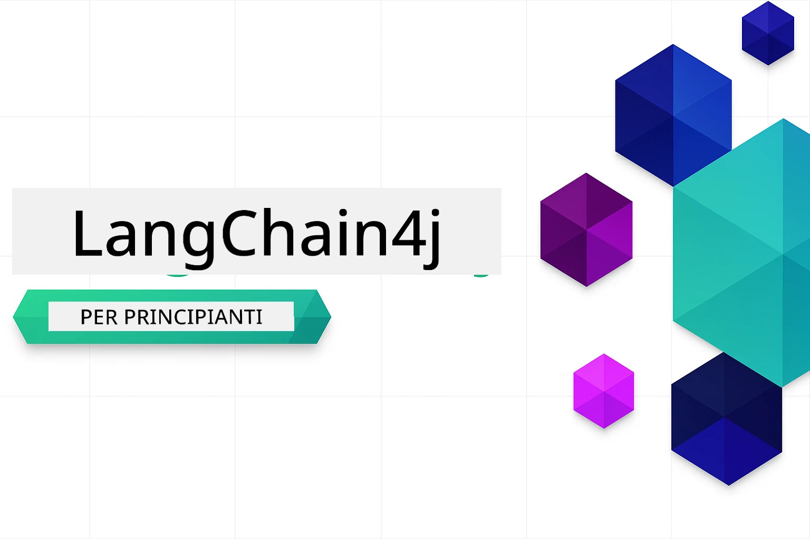

<!--
CO_OP_TRANSLATOR_METADATA:
{
  "original_hash": "7dffae166c7db7dc932a0e3d0217cbb7",
  "translation_date": "2026-01-16T10:04:22+00:00",
  "source_file": "README.md",
  "language_code": "it"
}
-->


### 🌐 Supporto Multilingue

#### Supportato tramite GitHub Action (Automatizzato e Sempre Aggiornato)

<!-- CO-OP TRANSLATOR LANGUAGES TABLE START -->
[Arabic](../ar/README.md) | [Bengali](../bn/README.md) | [Bulgarian](../bg/README.md) | [Burmese (Myanmar)](../my/README.md) | [Chinese (Simplified)](../zh/README.md) | [Chinese (Traditional, Hong Kong)](../hk/README.md) | [Chinese (Traditional, Macau)](../mo/README.md) | [Chinese (Traditional, Taiwan)](../tw/README.md) | [Croatian](../hr/README.md) | [Czech](../cs/README.md) | [Danish](../da/README.md) | [Dutch](../nl/README.md) | [Estonian](../et/README.md) | [Finnish](../fi/README.md) | [French](../fr/README.md) | [German](../de/README.md) | [Greek](../el/README.md) | [Hebrew](../he/README.md) | [Hindi](../hi/README.md) | [Hungarian](../hu/README.md) | [Indonesian](../id/README.md) | [Italian](./README.md) | [Japanese](../ja/README.md) | [Kannada](../kn/README.md) | [Korean](../ko/README.md) | [Lithuanian](../lt/README.md) | [Malay](../ms/README.md) | [Malayalam](../ml/README.md) | [Marathi](../mr/README.md) | [Nepali](../ne/README.md) | [Nigerian Pidgin](../pcm/README.md) | [Norwegian](../no/README.md) | [Persian (Farsi)](../fa/README.md) | [Polish](../pl/README.md) | [Portuguese (Brazil)](../br/README.md) | [Portuguese (Portugal)](../pt/README.md) | [Punjabi (Gurmukhi)](../pa/README.md) | [Romanian](../ro/README.md) | [Russian](../ru/README.md) | [Serbian (Cyrillic)](../sr/README.md) | [Slovak](../sk/README.md) | [Slovenian](../sl/README.md) | [Spanish](../es/README.md) | [Swahili](../sw/README.md) | [Swedish](../sv/README.md) | [Tagalog (Filipino)](../tl/README.md) | [Tamil](../ta/README.md) | [Telugu](../te/README.md) | [Thai](../th/README.md) | [Turkish](../tr/README.md) | [Ukrainian](../uk/README.md) | [Urdu](../ur/README.md) | [Vietnamese](../vi/README.md)

> **Preferisci clonare localmente?**

> Questo repository include traduzioni in oltre 50 lingue, aumentando significativamente la dimensione del download. Per clonare senza traduzioni, usa il sparse checkout:
> ```bash
> git clone --filter=blob:none --sparse https://github.com/microsoft/LangChain4j-for-Beginners.git
> cd LangChain4j-for-Beginners
> git sparse-checkout set --no-cone '/*' '!translations' '!translated_images'
> ```
> Questo ti dà tutto ciò di cui hai bisogno per completare il corso con un download molto più veloce.
<!-- CO-OP TRANSLATOR LANGUAGES TABLE END -->

# LangChain4j per Principianti

Un corso per costruire applicazioni AI con LangChain4j e Azure OpenAI GPT-5, dalla chat di base agli agenti AI.

**Nuovo a LangChain4j?** Dai un’occhiata al [Glossario](docs/GLOSSARY.md) per definizioni di termini e concetti chiave.

## Sommario

1. [Avvio Rapido](00-quick-start/README.md) - Inizia con LangChain4j
2. [Introduzione](01-introduction/README.md) - Impara le basi di LangChain4j
3. [Prompt Engineering](02-prompt-engineering/README.md) - Padroneggia la progettazione efficace dei prompt
4. [RAG (Generazione Incrementata da Recupero)](03-rag/README.md) - Costruisci sistemi intelligenti basati sulla conoscenza
5. [Strumenti](04-tools/README.md) - Integra strumenti esterni e assistenti semplici
6. [MCP (Protocollo Contesto Modello)](05-mcp/README.md) - Lavora con il Protocollo Contesto Modello (MCP) e moduli Agentici
---

## Percorso di Apprendimento

> **Avvio Rapido**

1. Effettua il fork di questo repository sul tuo account GitHub
2. Clicca **Code** → scheda **Codespaces** → **...** → **Nuovo con opzioni...**
3. Usa le impostazioni predefinite – questo selezionerà il contenitore di sviluppo creato per questo corso
4. Clicca **Crea codespace**
5. Attendi 5-10 minuti perché l’ambiente sia pronto
6. Vai direttamente a [Avvio Rapido](./00-quick-start/README.md) per iniziare!

Dopo aver completato i moduli, esplora la [Guida al Testing](docs/TESTING.md) per vedere in azione i concetti di test con LangChain4j.

> **Nota:** Questo corso utilizza sia GitHub Models che Azure OpenAI. Il modulo [Avvio Rapido](00-quick-start/README.md) usa GitHub Models (non è richiesta una sottoscrizione Azure), mentre i moduli da 1 a 5 usano Azure OpenAI.


## Apprendimento con GitHub Copilot

Per iniziare rapidamente a programmare, apri questo progetto in un GitHub Codespace o nel tuo IDE locale con il devcontainer fornito. Il devcontainer usato in questo corso è preconfigurato con GitHub Copilot per il pairing AI nella programmazione.

Ogni esempio di codice include domande suggerite che puoi porre a GitHub Copilot per approfondire la tua comprensione. Cerca i prompt 💡/🤖 in:

- **Intestazioni dei file Java** - Domande specifiche per ogni esempio
- **README dei moduli** - Prompt di esplorazione dopo gli esempi di codice

**Come usarlo:** Apri qualsiasi file di codice e poni a Copilot le domande suggerite. Ha il contesto completo del codice e può spiegare, estendere e suggerire alternative.

Vuoi saperne di più? Dai un’occhiata a [Copilot per il Pair Programming AI](https://aka.ms/GitHubCopilotAI).


## Risorse Aggiuntive

<!-- CO-OP TRANSLATOR OTHER COURSES START -->
### LangChain
[](https://aka.ms/langchain4j-for-beginners)
[](https://aka.ms/langchainjs-for-beginners?WT.mc_id=m365-94501-dwahlin)

---

### Azure / Edge / MCP / Agent
[](https://github.com/microsoft/AZD-for-beginners?WT.mc_id=academic-105485-koreyst)
[](https://github.com/microsoft/edgeai-for-beginners?WT.mc_id=academic-105485-koreyst)
[](https://github.com/microsoft/mcp-for-beginners?WT.mc_id=academic-105485-koreyst)
[](https://github.com/microsoft/ai-agents-for-beginners?WT.mc_id=academic-105485-koreyst)

---

### Serie AI Generativa
[](https://github.com/microsoft/generative-ai-for-beginners?WT.mc_id=academic-105485-koreyst)
[-9333EA?style=for-the-badge&labelColor=E5E7EB&color=9333EA)](https://github.com/microsoft/Generative-AI-for-beginners-dotnet?WT.mc_id=academic-105485-koreyst)
[-C084FC?style=for-the-badge&labelColor=E5E7EB&color=C084FC)](https://github.com/microsoft/generative-ai-for-beginners-java?WT.mc_id=academic-105485-koreyst)
[-E879F9?style=for-the-badge&labelColor=E5E7EB&color=E879F9)](https://github.com/microsoft/generative-ai-with-javascript?WT.mc_id=academic-105485-koreyst)

---

### Apprendimento di Base
[](https://aka.ms/ml-beginners?WT.mc_id=academic-105485-koreyst)
[](https://aka.ms/datascience-beginners?WT.mc_id=academic-105485-koreyst)
[](https://aka.ms/ai-beginners?WT.mc_id=academic-105485-koreyst)
[](https://github.com/microsoft/Security-101?WT.mc_id=academic-96948-sayoung)
[](https://aka.ms/webdev-beginners?WT.mc_id=academic-105485-koreyst)
[](https://aka.ms/iot-beginners?WT.mc_id=academic-105485-koreyst)
[](https://github.com/microsoft/xr-development-for-beginners?WT.mc_id=academic-105485-koreyst)

---

### Serie Copilot

[](https://aka.ms/GitHubCopilotAI?WT.mc_id=academic-105485-koreyst)
[](https://github.com/microsoft/mastering-github-copilot-for-dotnet-csharp-developers?WT.mc_id=academic-105485-koreyst)
[](https://github.com/microsoft/CopilotAdventures?WT.mc_id=academic-105485-koreyst)
<!-- CO-OP TRANSLATOR OTHER COURSES END -->

## Ottenere Aiuto

Se rimani bloccato o hai domande sulla creazione di app AI, unisciti a:

[](https://aka.ms/foundry/discord)

Se hai feedback sul prodotto o errori durante la creazione visita:

[](https://aka.ms/foundry/forum)

## Licenza

Licenza MIT - Vedi il file [LICENSE](../../LICENSE) per i dettagli.

---

<!-- CO-OP TRANSLATOR DISCLAIMER START -->
**Disclaimer**:  
Questo documento è stato tradotto utilizzando il servizio di traduzione automatica [Co-op Translator](https://github.com/Azure/co-op-translator). Pur impegnandoci per garantire accuratezza, si prega di notare che le traduzioni automatiche possono contenere errori o inesattezze. Il documento originale nella sua lingua nativa deve essere considerato la fonte autorevole. Per informazioni critiche si raccomanda la traduzione professionale umana. Non ci assumiamo alcuna responsabilità per fraintendimenti o interpretazioni errate derivanti dall’uso di questa traduzione.
<!-- CO-OP TRANSLATOR DISCLAIMER END -->