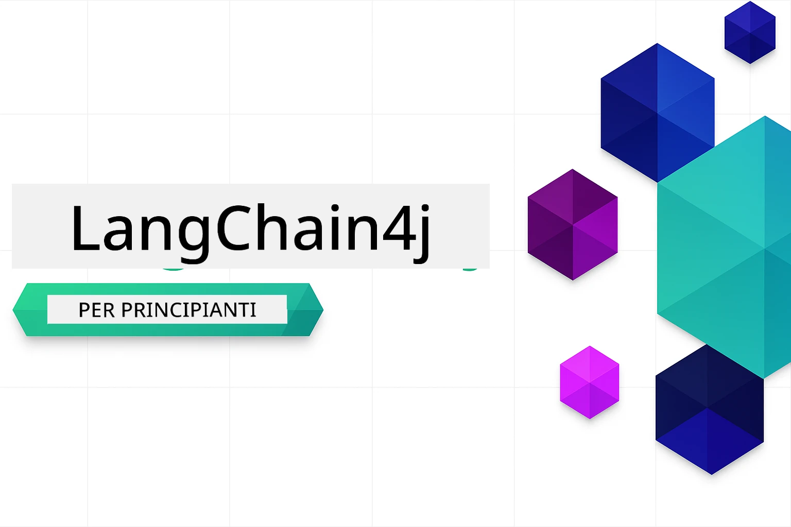

# LangChain4j per Principianti

Un corso per costruire applicazioni AI con LangChain4j e Azure OpenAI GPT-5.2, dal chat di base agli agenti AI.

### 🌐 Supporto Multilingue

#### Supportato tramite GitHub Action (Automatizzato & Sempre Aggiornato)

<!-- CO-OP TRANSLATOR LANGUAGES TABLE START -->
[Arabo](../ar/README.md) | [Bengalese](../bn/README.md) | [Bulgaro](../bg/README.md) | [Birmano (Myanmar)](../my/README.md) | [Cinese (Semplificato)](../zh-CN/README.md) | [Cinese (Tradizionale, Hong Kong)](../zh-HK/README.md) | [Cinese (Tradizionale, Macao)](../zh-MO/README.md) | [Cinese (Tradizionale, Taiwan)](../zh-TW/README.md) | [Croato](../hr/README.md) | [Ceco](../cs/README.md) | [Danese](../da/README.md) | [Olandese](../nl/README.md) | [Estone](../et/README.md) | [Finlandese](../fi/README.md) | [Francese](../fr/README.md) | [Tedesco](../de/README.md) | [Greco](../el/README.md) | [Ebraico](../he/README.md) | [Hindi](../hi/README.md) | [Ungherese](../hu/README.md) | [Indonesiano](../id/README.md) | [Italiano](./README.md) | [Giapponese](../ja/README.md) | [Kannada](../kn/README.md) | [Khmer](../km/README.md) | [Coreano](../ko/README.md) | [Lituano](../lt/README.md) | [Malese](../ms/README.md) | [Malayalam](../ml/README.md) | [Marathi](../mr/README.md) | [Nepalese](../ne/README.md) | [Pidgin Nigeriano](../pcm/README.md) | [Norvegese](../no/README.md) | [Persiano (Farsi)](../fa/README.md) | [Polacco](../pl/README.md) | [Portoghese (Brasile)](../pt-BR/README.md) | [Portoghese (Portogallo)](../pt-PT/README.md) | [Punjabi (Gurmukhi)](../pa/README.md) | [Rumeno](../ro/README.md) | [Russo](../ru/README.md) | [Serbo (Cirillico)](../sr/README.md) | [Slovacco](../sk/README.md) | [Sloveno](../sl/README.md) | [Spagnolo](../es/README.md) | [Swahili](../sw/README.md) | [Svedese](../sv/README.md) | [Tagalog (Filippino)](../tl/README.md) | [Tamil](../ta/README.md) | [Telugu](../te/README.md) | [Thailandese](../th/README.md) | [Turco](../tr/README.md) | [Ucraino](../uk/README.md) | [Urdu](../ur/README.md) | [Vietnamita](../vi/README.md)

> **Preferisci clonare localmente?**
>
> Questo repository include traduzioni in più di 50 lingue, il che aumenta significativamente la dimensione del download. Per clonare senza traduzioni, usa il sparse checkout:
>
> **Bash / macOS / Linux:**
> ```bash
> git clone --filter=blob:none --sparse https://github.com/microsoft/LangChain4j-for-Beginners.git
> cd LangChain4j-for-Beginners
> git sparse-checkout set --no-cone '/*' '!translations' '!translated_images'
> ```
>
> **CMD (Windows):**
> ```cmd
> git clone --filter=blob:none --sparse https://github.com/microsoft/LangChain4j-for-Beginners.git
> cd LangChain4j-for-Beginners
> git sparse-checkout set --no-cone "/*" "!translations" "!translated_images"
> ```
>
> Questo ti dà tutto il necessario per completare il corso con un download molto più veloce.
<!-- CO-OP TRANSLATOR LANGUAGES TABLE END -->

## Indice

1. [Introduzione](01-introduction/README.md) - Impara le basi di LangChain4j
2. [Prompt Engineering](02-prompt-engineering/README.md) - Diventa esperto nel design efficace dei prompt
3. [RAG (Retrieval-Augmented Generation)](03-rag/README.md) - Costruisci sistemi intelligenti basati sulla conoscenza
4. [Strumenti](04-tools/README.md) - Integra strumenti esterni e assistenti semplici
5. [MCP (Model Context Protocol)](05-mcp/README.md) - Lavora con il Model Context Protocol (MCP) e i moduli Agentici

### Video Tutorial

Ogni modulo ha una sessione live associata in cui esaminiamo i concetti e il codice passo dopo passo.

| Modulo | Video |
|--------|-------|
| 01 - Introduzione | [Iniziare con LangChain4j](https://www.youtube.com/live/nl_troDm8rQ) |
| 02 - Prompt Engineering | [Prompt Engineering con LangChain4j](https://www.youtube.com/live/PJ6aBaE6bog) |
| 03 - RAG | [RAG con LangChain4j](https://www.youtube.com/watch?v=_olq75ZH_eY) |
| 04 - Strumenti & 05 - MCP | [Agenti AI con Strumenti e MCP](https://www.youtube.com/watch?v=O_J30kZc0rw) |

---

## Percorso di Apprendimento

**Sei nuovo in LangChain4j?** Dai un’occhiata al [Glossario](docs/GLOSSARY.md) per definizioni di termini chiave e concetti.

> **Avvio Rapido**

1. Fai il fork di questo repository sul tuo account GitHub
2. Clicca **Code** → scheda **Codespaces** → **...** → **Nuovo con opzioni...**
3. Usa i valori predefiniti – questo selezionerà il contenitore di sviluppo creato per questo corso
4. Clicca **Crea codespace**
5. Attendi 5-10 minuti per l’ambiente pronto
6. Vai direttamente a [Introduzione](./01-introduction/README.md) per iniziare!

Dopo aver completato i moduli, esplora la [Guida ai Test](docs/TESTING.md) per vedere in azione i concetti di testing di LangChain4j.

> **Nota:** Questa formazione usa Azure OpenAI. Inizia con un [account Azure GRATUITO](https://aka.ms/azure-free-account) se non ne hai uno.


## Apprendimento con GitHub Copilot

Per iniziare rapidamente a programmare, apri questo progetto in un GitHub Codespace o nel tuo IDE locale con il devcontainer fornito. Il devcontainer usato in questo corso viene preconfigurato con GitHub Copilot per la programmazione in coppia AI.

Ogni esempio di codice include domande suggerite che puoi porre a GitHub Copilot per approfondire la tua comprensione. Cerca i prompt 💡/🤖 in:

- **Intestazioni di file Java** - Domande specifiche per ogni esempio
- **README dei moduli** - Prompt di esplorazione dopo gli esempi di codice

**Come usare:** Apri qualsiasi file di codice e poni a Copilot le domande suggerite. Ha il contesto completo del codice e può spiegare, estendere e suggerire alternative.

Vuoi saperne di più? Dai un’occhiata a [Copilot per programmazione in coppia AI](https://aka.ms/GitHubCopilotAI).


## Risorse Aggiuntive

<!-- CO-OP TRANSLATOR OTHER COURSES START -->
### LangChain
[](https://aka.ms/langchain4j-for-beginners)
[](https://aka.ms/langchainjs-for-beginners?WT.mc_id=m365-94501-dwahlin)
[](https://github.com/microsoft/langchain-for-beginners?WT.mc_id=m365-94501-dwahlin)
---

### Azure / Edge / MCP / Agenti
[](https://github.com/microsoft/AZD-for-beginners?WT.mc_id=academic-105485-koreyst)
[](https://github.com/microsoft/edgeai-for-beginners?WT.mc_id=academic-105485-koreyst)
[](https://github.com/microsoft/mcp-for-beginners?WT.mc_id=academic-105485-koreyst)
[](https://github.com/microsoft/ai-agents-for-beginners?WT.mc_id=academic-105485-koreyst)

---
 
### Serie AI Generativa
[](https://github.com/microsoft/generative-ai-for-beginners?WT.mc_id=academic-105485-koreyst)
[-9333EA?style=for-the-badge&labelColor=E5E7EB&color=9333EA)](https://github.com/microsoft/Generative-AI-for-beginners-dotnet?WT.mc_id=academic-105485-koreyst)
[-C084FC?style=for-the-badge&labelColor=E5E7EB&color=C084FC)](https://github.com/microsoft/generative-ai-for-beginners-java?WT.mc_id=academic-105485-koreyst)
[-E879F9?style=for-the-badge&labelColor=E5E7EB&color=E879F9)](https://github.com/microsoft/generative-ai-with-javascript?WT.mc_id=academic-105485-koreyst)

---
 
### Apprendimento Base
[](https://aka.ms/ml-beginners?WT.mc_id=academic-105485-koreyst)
[](https://aka.ms/datascience-beginners?WT.mc_id=academic-105485-koreyst)
[](https://aka.ms/ai-beginners?WT.mc_id=academic-105485-koreyst)
[](https://github.com/microsoft/Security-101?WT.mc_id=academic-96948-sayoung)
[](https://aka.ms/webdev-beginners?WT.mc_id=academic-105485-koreyst)
[](https://aka.ms/iot-beginners?WT.mc_id=academic-105485-koreyst)
[](https://github.com/microsoft/xr-development-for-beginners?WT.mc_id=academic-105485-koreyst)

---
 
### Serie Copilot
[](https://aka.ms/GitHubCopilotAI?WT.mc_id=academic-105485-koreyst)
[](https://github.com/microsoft/mastering-github-copilot-for-dotnet-csharp-developers?WT.mc_id=academic-105485-koreyst)
[](https://github.com/microsoft/CopilotAdventures?WT.mc_id=academic-105485-koreyst)
<!-- CO-OP TRANSLATOR OTHER COURSES END -->

## Ottenere Aiuto

Se rimani bloccato o hai domande sulla creazione di app AI, unisciti a:

[](https://aka.ms/foundry/discord)

Se hai feedback sul prodotto o errori durante la creazione visita:

[](https://aka.ms/foundry/forum)

## Licenza

Licenza MIT - Vedi il file [LICENSE](../../LICENSE) per i dettagli.

---

<!-- CO-OP TRANSLATOR DISCLAIMER START -->
**Disclaimer**:
Questo documento è stato tradotto utilizzando il servizio di traduzione AI [Co-op Translator](https://github.com/Azure/co-op-translator). Sebbene ci impegniamo per garantire la precisione, si prega di notare che le traduzioni automatizzate possono contenere errori o imprecisioni. Il documento originale nella sua lingua nativa deve essere considerato la fonte autorevole. Per informazioni critiche, si raccomanda una traduzione professionale effettuata da un essere umano. Non siamo responsabili per eventuali malintesi o interpretazioni errate derivanti dall’uso di questa traduzione.
<!-- CO-OP TRANSLATOR DISCLAIMER END -->