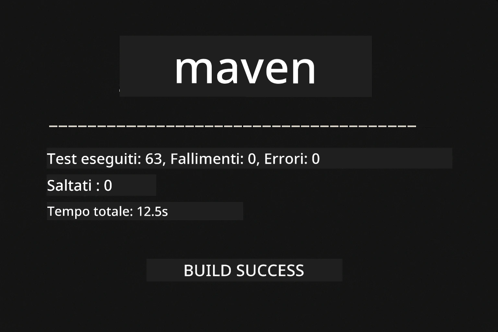
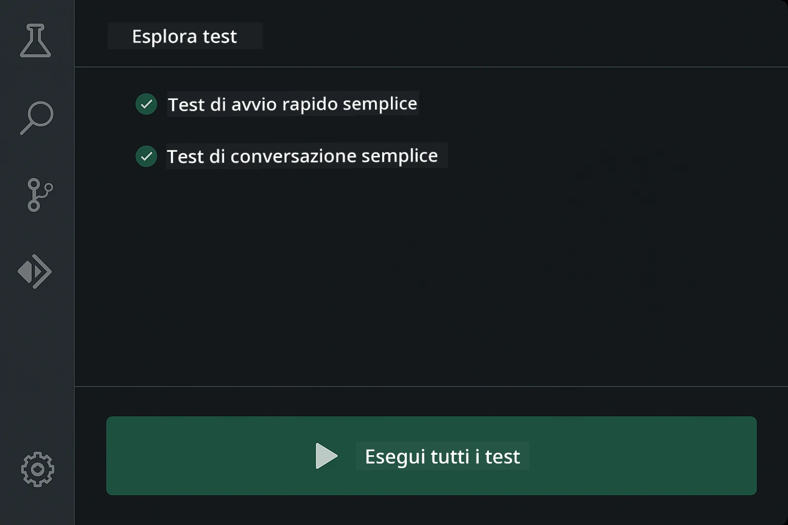
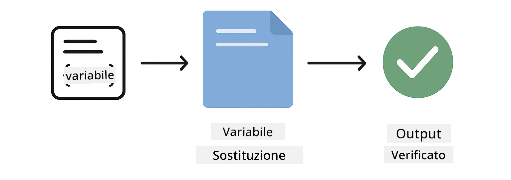
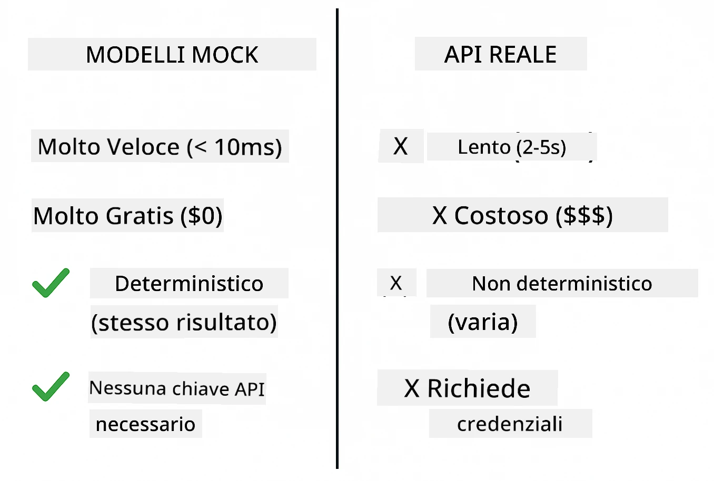
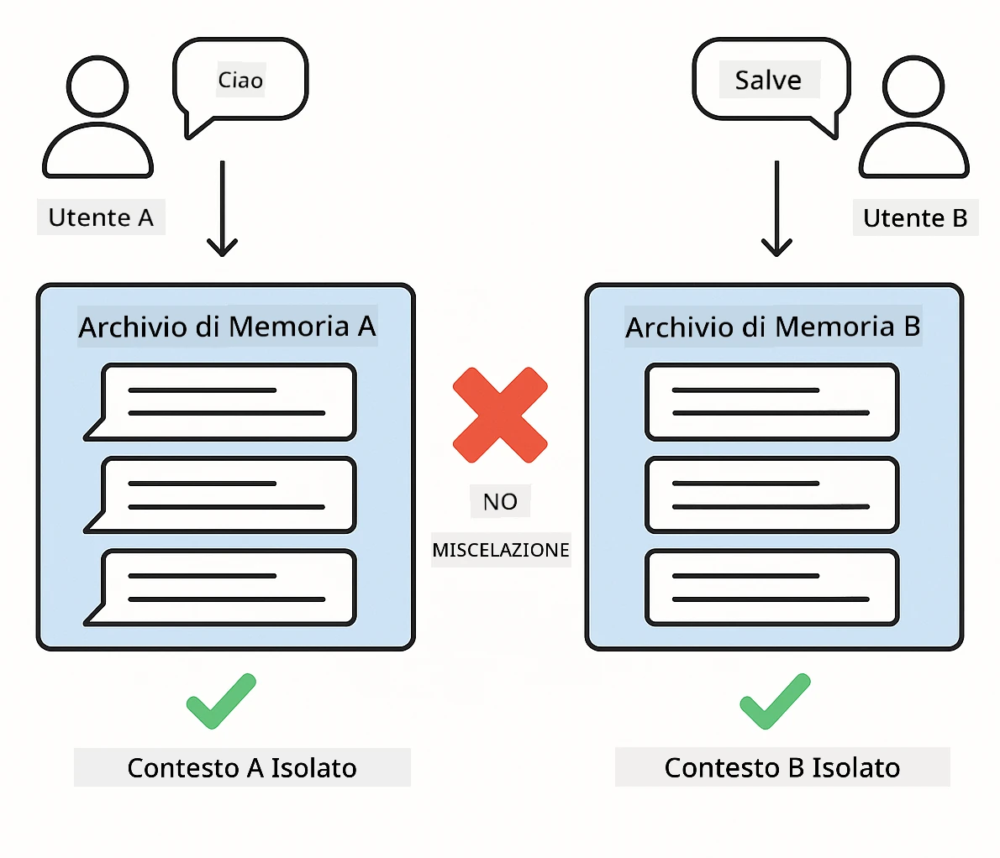
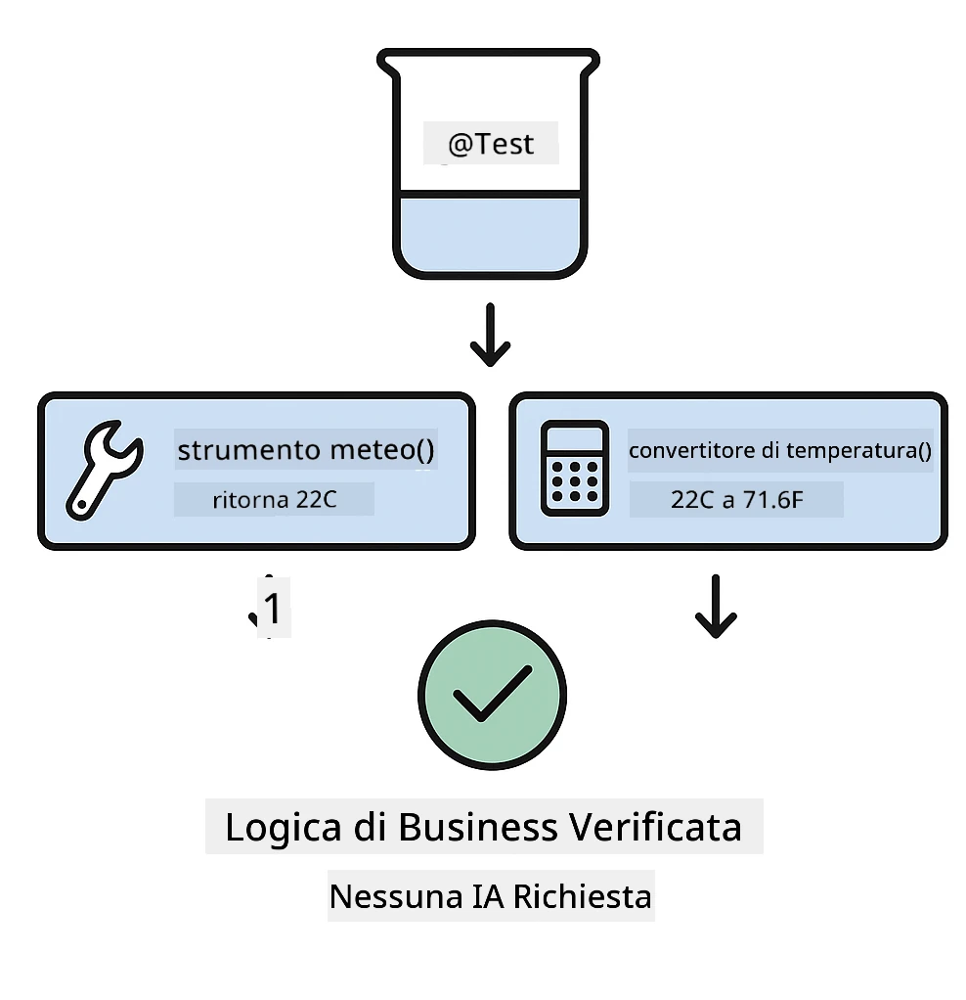
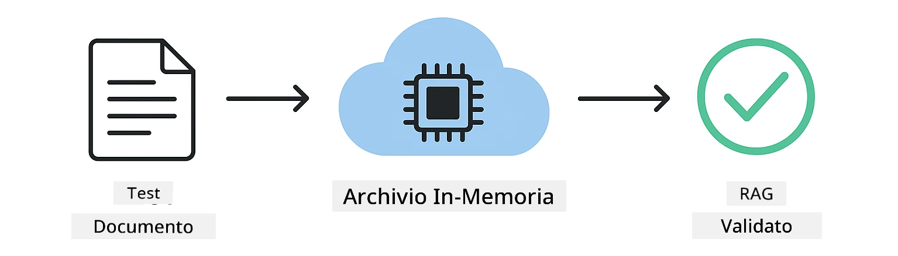

# Test delle applicazioni LangChain4j

## Indice

- [Quick Start](../../../docs)
- [Cosa coprono i test](../../../docs)
- [Esecuzione dei test](../../../docs)
- [Esecuzione dei test in VS Code](../../../docs)
- [Pattern di test](../../../docs)
- [Filosofia dei test](../../../docs)
- [Prossimi passi](../../../docs)

Questa guida ti accompagna attraverso i test che dimostrano come testare applicazioni AI senza richiedere chiavi API o servizi esterni.

## Quick Start

Esegui tutti i test con un unico comando:

**Bash:**
```bash
mvn test
```

**PowerShell:**
```powershell
mvn --% test
```



*Esecuzione dei test riuscita che mostra tutti i test passati senza errori*

## Cosa coprono i test

Questo corso si concentra sui **test unitari** eseguiti localmente. Ogni test dimostra un concetto specifico di LangChain4j in isolamento.


*Piramide dei test che mostra l'equilibrio tra test unitari (veloci, isolati), test di integrazione (componenti reali) e test end-to-end. Questa formazione copre i test unitari.*

| Modulo | Test | Obiettivo | File chiave |
|--------|-------|-------|-----------|
| **00 - Avvio rapido** | 6 | Template di prompt e sostituzione delle variabili | `SimpleQuickStartTest.java` |
| **01 - Introduzione** | 8 | Memoria delle conversazioni e chat con stato | `SimpleConversationTest.java` |
| **02 - Ingegneria dei prompt** | 12 | Pattern GPT-5, livelli di reattività, output strutturato | `SimpleGpt5PromptTest.java` |
| **03 - RAG** | 10 | Ingestione di documenti, embedding, ricerca per similarità | `DocumentServiceTest.java` |
| **04 - Strumenti** | 12 | Chiamata di funzioni e concatenazione di strumenti | `SimpleToolsTest.java` |
| **05 - MCP** | 8 | Model Context Protocol con trasporto stdio | `SimpleMcpTest.java` |

## Esecuzione dei test

**Esegui tutti i test dalla root:**

**Bash:**
```bash
mvn test
```

**PowerShell:**
```powershell
mvn --% test
```

**Esegui i test per un modulo specifico:**

**Bash:**
```bash
cd 01-introduction && mvn test
# Oppure come root
mvn test -pl 01-introduction
```

**PowerShell:**
```powershell
cd 01-introduction; mvn --% test
# O dalla root
mvn --% test -pl 01-introduction
```

**Esegui una singola classe di test:**

**Bash:**
```bash
mvn test -Dtest=SimpleConversationTest
```

**PowerShell:**
```powershell
mvn --% test -Dtest=SimpleConversationTest
```

**Esegui un metodo di test specifico:**

**Bash:**
```bash
mvn test -Dtest=SimpleConversationTest#dovrebbeMantenereLaCronologiaDellaConversazione
```

**PowerShell:**
```powershell
mvn --% test -Dtest=SimpleConversationTest#dovrebbe mantenere la cronologia della conversazione
```

## Esecuzione dei test in VS Code

Se usi Visual Studio Code, il Test Explorer offre un'interfaccia grafica per eseguire e fare il debug dei test.



*VS Code Test Explorer che mostra l'albero dei test con tutte le classi di test Java e i singoli metodi di test*

**Per eseguire i test in VS Code:**

1. Apri il Test Explorer cliccando sull'icona del becher nella Activity Bar
2. Espandi l'albero dei test per vedere tutti i moduli e le classi di test
3. Clicca il pulsante play accanto a un test per eseguirlo singolarmente
4. Clicca "Run All Tests" per eseguire l'intera suite
5. Clicca con il tasto destro su un test e seleziona "Debug Test" per impostare breakpoint e fare step nel codice

Il Test Explorer mostra segni di spunta verdi per i test passati e fornisce messaggi dettagliati in caso di failure.

## Pattern di test

### Pattern 1: Testare i template dei prompt

Il pattern più semplice testa i template dei prompt senza chiamare alcun modello AI. Verifichi che la sostituzione delle variabili funzioni correttamente e che i prompt siano formattati come previsto.



*Test dei template dei prompt che mostra il flusso di sostituzione delle variabili: template con segnaposto → valori applicati → output formattato verificato*

```java
@Test
@DisplayName("Should format prompt template with variables")
void testPromptTemplateFormatting() {
    PromptTemplate template = PromptTemplate.from(
        "Best time to visit {{destination}} for {{activity}}?"
    );
    
    Prompt prompt = template.apply(Map.of(
        "destination", "Paris",
        "activity", "sightseeing"
    ));
    
    assertThat(prompt.text()).isEqualTo("Best time to visit Paris for sightseeing?");
}
```

Questo test si trova in `00-quick-start/src/test/java/com/example/langchain4j/quickstart/SimpleQuickStartTest.java`.

**Eseguilo:**

**Bash:**
```bash
cd 00-quick-start && mvn test -Dtest=SimpleQuickStartTest#formattazione del modello di prompt di test
```

**PowerShell:**
```powershell
cd 00-quick-start; mvn --% test -Dtest=SimpleQuickStartTest#formattazione del modello di prompt di test
```

### Pattern 2: Simulazione dei modelli linguistici

Quando testi la logica di conversazione, usa Mockito per creare modelli finti che restituiscono risposte predefinite. Questo rende i test veloci, gratuiti e deterministici.



*Confronto che mostra perché i mock sono preferiti per i test: sono veloci, gratuiti, deterministici e non richiedono chiavi API*

```java
@ExtendWith(MockitoExtension.class)
class SimpleConversationTest {
    
    private ConversationService conversationService;
    
    @Mock
    private OpenAiOfficialChatModel mockChatModel;
    
    @BeforeEach
    void setUp() {
        ChatResponse mockResponse = ChatResponse.builder()
            .aiMessage(AiMessage.from("This is a test response"))
            .build();
        when(mockChatModel.chat(anyList())).thenReturn(mockResponse);
        
        conversationService = new ConversationService(mockChatModel);
    }
    
    @Test
    void shouldMaintainConversationHistory() {
        String conversationId = conversationService.startConversation();
        
        ChatResponse mockResponse1 = ChatResponse.builder()
            .aiMessage(AiMessage.from("Response 1"))
            .build();
        ChatResponse mockResponse2 = ChatResponse.builder()
            .aiMessage(AiMessage.from("Response 2"))
            .build();
        ChatResponse mockResponse3 = ChatResponse.builder()
            .aiMessage(AiMessage.from("Response 3"))
            .build();
        
        when(mockChatModel.chat(anyList()))
            .thenReturn(mockResponse1)
            .thenReturn(mockResponse2)
            .thenReturn(mockResponse3);

        conversationService.chat(conversationId, "First message");
        conversationService.chat(conversationId, "Second message");
        conversationService.chat(conversationId, "Third message");

        List<ChatMessage> history = conversationService.getHistory(conversationId);
        assertThat(history).hasSize(6); // 3 messaggi utente + 3 messaggi IA
    }
}
```

Questo pattern appare in `01-introduction/src/test/java/com/example/langchain4j/service/SimpleConversationTest.java`. Il mock garantisce un comportamento coerente così da poter verificare correttamente la gestione della memoria.

### Pattern 3: Testare l'isolamento delle conversazioni

La memoria delle conversazioni deve mantenere gli utenti multipli separati. Questo test verifica che le conversazioni non mescolino i contesti.



*Test dell'isolamento delle conversazioni che mostra store di memoria separati per utenti diversi per prevenire la miscelazione di contesti*

```java
@Test
void shouldIsolateConversationsByid() {
    String conv1 = conversationService.startConversation();
    String conv2 = conversationService.startConversation();
    
    ChatResponse mockResponse = ChatResponse.builder()
        .aiMessage(AiMessage.from("Response"))
        .build();
    when(mockChatModel.chat(anyList())).thenReturn(mockResponse);

    conversationService.chat(conv1, "Message for conversation 1");
    conversationService.chat(conv2, "Message for conversation 2");

    List<ChatMessage> history1 = conversationService.getHistory(conv1);
    List<ChatMessage> history2 = conversationService.getHistory(conv2);
    
    assertThat(history1).hasSize(2);
    assertThat(history2).hasSize(2);
}
```

Ogni conversazione mantiene la propria cronologia indipendente. Nei sistemi di produzione, questo isolamento è critico per applicazioni multi-utente.

### Pattern 4: Testare gli strumenti in modo indipendente

Gli strumenti sono funzioni che l'IA può chiamare. Testali direttamente per assicurarti che funzionino correttamente indipendentemente dalle decisioni dell'IA.



*Test degli strumenti in modo indipendente che mostra l'esecuzione di strumenti mock senza chiamate all'IA per verificare la logica di business*

```java
@Test
void shouldConvertCelsiusToFahrenheit() {
    TemperatureTool tempTool = new TemperatureTool();
    String result = tempTool.celsiusToFahrenheit(25.0);
    assertThat(result).containsPattern("77[.,]0°F");
}

@Test
void shouldDemonstrateToolChaining() {
    WeatherTool weatherTool = new WeatherTool();
    TemperatureTool tempTool = new TemperatureTool();

    String weatherResult = weatherTool.getCurrentWeather("Seattle");
    assertThat(weatherResult).containsPattern("\\d+°C");

    String conversionResult = tempTool.celsiusToFahrenheit(22.0);
    assertThat(conversionResult).containsPattern("71[.,]6°F");
}
```

Questi test in `04-tools/src/test/java/com/example/langchain4j/agents/tools/SimpleToolsTest.java` validano la logica degli strumenti senza il coinvolgimento dell'IA. L'esempio di chaining mostra come l'output di uno strumento alimenta l'input di un altro.

### Pattern 5: Test RAG in memoria

I sistemi RAG richiedono tradizionalmente database vettoriali e servizi di embedding. Il pattern in memoria ti permette di testare l'intera pipeline senza dipendenze esterne.



*Workflow di test RAG in memoria che mostra il parsing dei documenti, l'archiviazione degli embedding e la ricerca per similarità senza richiedere un database*

```java
@Test
void testProcessTextDocument() {
    String content = "This is a test document.\nIt has multiple lines.";
    InputStream inputStream = new ByteArrayInputStream(content.getBytes(StandardCharsets.UTF_8));
    
    DocumentService.ProcessedDocument result = 
        documentService.processDocument(inputStream, "test.txt");

    assertNotNull(result);
    assertTrue(result.segments().size() > 0);
    assertEquals("test.txt", result.segments().get(0).metadata().getString("filename"));
}
```

Questo test in `03-rag/src/test/java/com/example/langchain4j/rag/service/DocumentServiceTest.java` crea un documento in memoria e verifica il chunking e la gestione dei metadati.

### Pattern 6: Test di integrazione MCP

Il modulo MCP testa l'integrazione del Model Context Protocol usando il trasporto stdio. Questi test verificano che la tua applicazione possa avviare e comunicare con server MCP come processi secondari.

I test in `05-mcp/src/test/java/com/example/langchain4j/mcp/SimpleMcpTest.java` convalidano il comportamento del client MCP.

**Eseguili:**

**Bash:**
```bash
cd 05-mcp && mvn test
```

**PowerShell:**
```powershell
cd 05-mcp; mvn --% test
```

## Filosofia dei test

Testa il tuo codice, non l'IA. I tuoi test dovrebbero convalidare il codice che scrivi controllando come vengono costruiti i prompt, come viene gestita la memoria e come vengono eseguiti gli strumenti. Le risposte dell'IA variano e non dovrebbero far parte delle asserzioni dei test. Chiediti se il tuo template di prompt sostituisce correttamente le variabili, non se l'IA dà la risposta giusta.

Usa i mock per i modelli linguistici. Sono dipendenze esterne che sono lente, costose e non deterministiche. Il mocking rende i test veloci (millisecondi invece di secondi), gratuiti (nessun costo API) e deterministici (stesso risultato ogni volta).

Mantieni i test indipendenti. Ogni test dovrebbe impostare i propri dati, non fare affidamento su altri test, e pulire dopo sé. I test dovrebbero passare indipendentemente dall'ordine di esecuzione.

Testa i casi limite oltre il percorso felice. Prova input vuoti, input molto grandi, caratteri speciali, parametri non validi e condizioni al contorno. Questi spesso rivelano bug che l'uso normale non espone.

Usa nomi descrittivi. Confronta `shouldMaintainConversationHistoryAcrossMultipleMessages()` con `test1()`. Il primo ti dice esattamente cosa viene testato, rendendo molto più semplice il debug dei fallimenti.

## Prossimi passi

Ora che hai compreso i pattern di test, approfondisci ogni modulo:

- **[00 - Avvio rapido](../00-quick-start/README.md)** - Inizia con le basi dei template dei prompt
- **[01 - Introduzione](../01-introduction/README.md)** - Impara la gestione della memoria delle conversazioni
- **[02 - Ingegneria dei prompt](../02-prompt-engineering/README.md)** - Padroneggia i pattern di prompting per GPT-5
- **[03 - RAG](../03-rag/README.md)** - Costruisci sistemi di retrieval-augmented generation
- **[04 - Strumenti](../04-tools/README.md)** - Implementa chiamate di funzione e catene di strumenti
- **[05 - MCP](../05-mcp/README.md)** - Integra il Model Context Protocol

I README di ciascun modulo forniscono spiegazioni dettagliate dei concetti testati qui.

---

**Navigazione:** [← Torna al principale](../README.md)

---

<!-- CO-OP TRANSLATOR DISCLAIMER START -->
Dichiarazione di non responsabilità:
Questo documento è stato tradotto utilizzando un servizio di traduzione basato su intelligenza artificiale, [Co‑op Translator](https://github.com/Azure/co-op-translator). Pur impegnandoci per l'accuratezza, si prega di notare che le traduzioni automatiche possono contenere errori o inesattezze. Il documento originale nella lingua di partenza deve essere considerato la fonte autorevole. Per informazioni critiche, si consiglia una traduzione professionale effettuata da un traduttore umano. Non ci assumiamo alcuna responsabilità per eventuali incomprensioni o interpretazioni errate derivanti dall'uso di questa traduzione.
<!-- CO-OP TRANSLATOR DISCLAIMER END -->