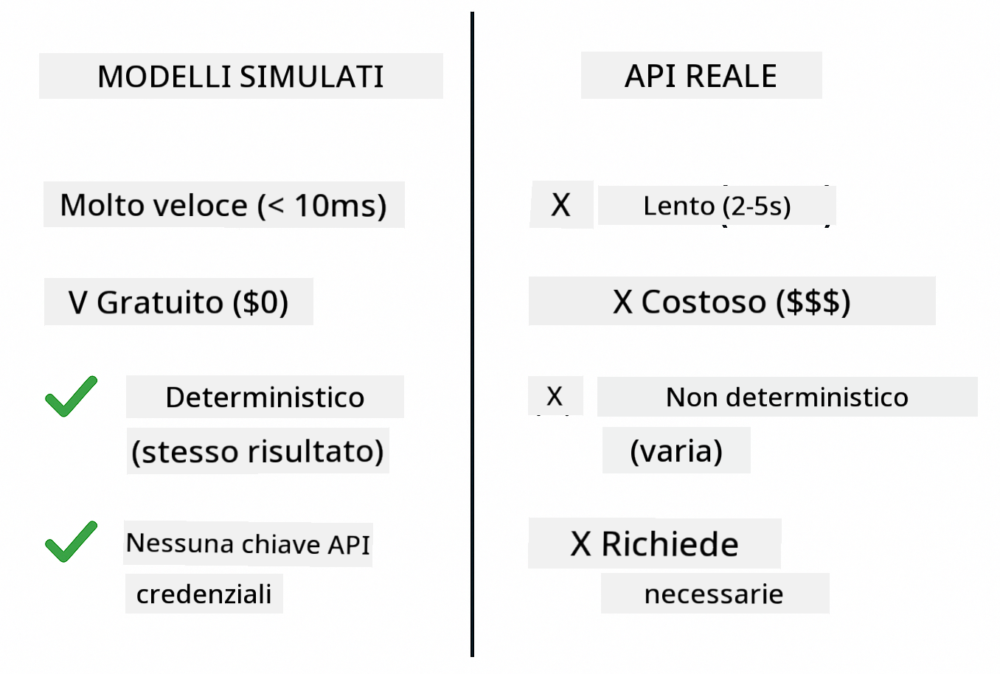
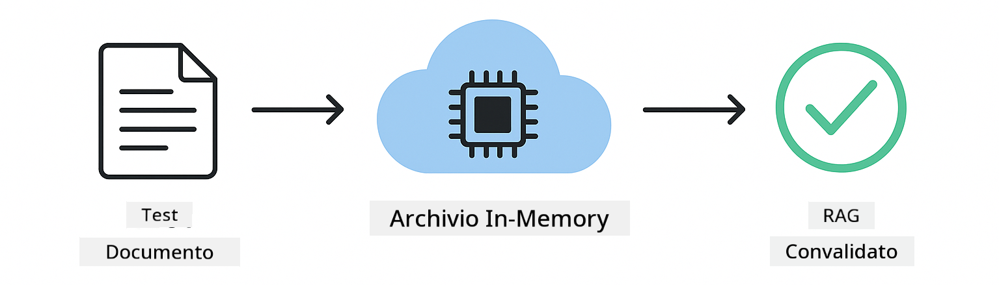
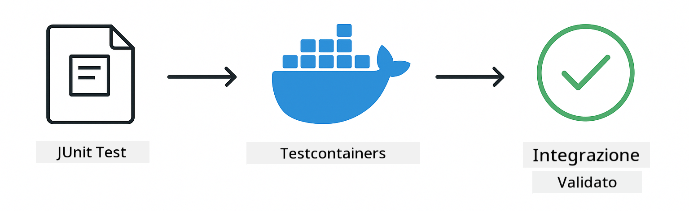

<!--
CO_OP_TRANSLATOR_METADATA:
{
  "original_hash": "b975537560c404d5f254331832811e78",
  "translation_date": "2025-12-13T20:58:57+00:00",
  "source_file": "docs/TESTING.md",
  "language_code": "it"
}
-->
# Testare le Applicazioni LangChain4j

## Indice

- [Avvio Rapido](../../../docs)
- [Cosa Coprono i Test](../../../docs)
- [Esecuzione dei Test](../../../docs)
- [Esecuzione dei Test in VS Code](../../../docs)
- [Modelli di Test](../../../docs)
- [Filosofia del Testing](../../../docs)
- [Passi Successivi](../../../docs)

Questa guida ti accompagna attraverso i test che dimostrano come testare applicazioni AI senza richiedere chiavi API o servizi esterni.

## Avvio Rapido

Esegui tutti i test con un solo comando:

**Bash:**
```bash
mvn test
```

**PowerShell:**
```powershell
mvn --% test
```


*Esecuzione di test riuscita che mostra tutti i test superati senza errori*

## Cosa Coprono i Test

Questo corso si concentra su **test unitari** che vengono eseguiti localmente. Ogni test dimostra un concetto specifico di LangChain4j in isolamento.


*Piramide del testing che mostra l’equilibrio tra test unitari (veloci, isolati), test di integrazione (componenti reali) e test end-to-end (sistema completo con Docker). Questa formazione copre il testing unitario.*

| Modulo | Test | Focus | File Chiave |
|--------|-------|-------|-------------|
| **00 - Avvio Rapido** | 6 | Template di prompt e sostituzione variabili | `SimpleQuickStartTest.java` |
| **01 - Introduzione** | 8 | Memoria della conversazione e chat con stato | `SimpleConversationTest.java` |
| **02 - Prompt Engineering** | 12 | Pattern GPT-5, livelli di prontezza, output strutturato | `SimpleGpt5PromptTest.java` |
| **03 - RAG** | 10 | Ingestione documenti, embedding, ricerca per similarità | `DocumentServiceTest.java` |
| **04 - Strumenti** | 12 | Chiamata di funzioni e concatenamento di strumenti | `SimpleToolsTest.java` |
| **05 - MCP** | 15 | Model Context Protocol con Docker | `SimpleMcpTest.java`, `McpDockerTransportTest.java` |

## Esecuzione dei Test

**Esegui tutti i test dalla root:**

**Bash:**
```bash
mvn test
```

**PowerShell:**
```powershell
mvn --% test
```

**Esegui i test per un modulo specifico:**

**Bash:**
```bash
cd 01-introduction && mvn test
# O dalla radice
mvn test -pl 01-introduction
```

**PowerShell:**
```powershell
cd 01-introduction; mvn --% test
# O dalla radice
mvn --% test -pl 01-introduction
```

**Esegui una singola classe di test:**

**Bash:**
```bash
mvn test -Dtest=SimpleConversationTest
```

**PowerShell:**
```powershell
mvn --% test -Dtest=SimpleConversationTest
```

**Esegui un metodo di test specifico:**

**Bash:**
```bash
mvn test -Dtest=SimpleConversationTest#dovrebbeMantenereLaCronologiaDellaConversazione
```

**PowerShell:**
```powershell
mvn --% test -Dtest=SimpleConversationTest#dovrebbeMantenereLaCronologiaDellaConversazione
```

## Esecuzione dei Test in VS Code

Se usi Visual Studio Code, il Test Explorer fornisce un’interfaccia grafica per eseguire e fare il debug dei test.


*Test Explorer di VS Code che mostra l’albero dei test con tutte le classi di test Java e i singoli metodi di test*

**Per eseguire i test in VS Code:**

1. Apri il Test Explorer cliccando sull’icona del becher nella Activity Bar
2. Espandi l’albero dei test per vedere tutti i moduli e le classi di test
3. Clicca il pulsante play accanto a un test per eseguirlo singolarmente
4. Clicca "Run All Tests" per eseguire l’intera suite
5. Clicca con il tasto destro su un test e seleziona "Debug Test" per impostare breakpoint e fare il passo passo nel codice

Il Test Explorer mostra segni di spunta verdi per i test superati e fornisce messaggi dettagliati in caso di fallimento.

## Modelli di Test


*Sei modelli di testing per applicazioni LangChain4j: template di prompt, mocking dei modelli, isolamento della conversazione, testing degli strumenti, RAG in memoria, e integrazione Docker*

### Modello 1: Testare i Template di Prompt

Il modello più semplice testa i template di prompt senza chiamare alcun modello AI. Verifichi che la sostituzione delle variabili funzioni correttamente e che i prompt siano formattati come previsto.


*Test dei template di prompt che mostra il flusso di sostituzione variabili: template con segnaposto → valori applicati → output formattato verificato*

```java
@Test
@DisplayName("Should format prompt template with variables")
void testPromptTemplateFormatting() {
    PromptTemplate template = PromptTemplate.from(
        "Best time to visit {{destination}} for {{activity}}?"
    );
    
    Prompt prompt = template.apply(Map.of(
        "destination", "Paris",
        "activity", "sightseeing"
    ));
    
    assertThat(prompt.text()).isEqualTo("Best time to visit Paris for sightseeing?");
}
```

Questo test si trova in `00-quick-start/src/test/java/com/example/langchain4j/quickstart/SimpleQuickStartTest.java`.

**Eseguilo:**

**Bash:**
```bash
cd 00-quick-start && mvn test -Dtest=SimpleQuickStartTest#testPromptTemplateFormatting
```

**PowerShell:**
```powershell
cd 00-quick-start; mvn --% test -Dtest=SimpleQuickStartTest#testPromptTemplateFormatting
```

### Modello 2: Mocking dei Modelli Linguistici

Quando testi la logica della conversazione, usa Mockito per creare modelli finti che restituiscono risposte predeterminate. Questo rende i test veloci, gratuiti e deterministici.



*Confronto che mostra perché i mock sono preferiti per il testing: sono veloci, gratuiti, deterministici e non richiedono chiavi API*

```java
@ExtendWith(MockitoExtension.class)
class SimpleConversationTest {
    
    private ConversationService conversationService;
    
    @Mock
    private OpenAiOfficialChatModel mockChatModel;
    
    @BeforeEach
    void setUp() {
        ChatResponse mockResponse = ChatResponse.builder()
            .aiMessage(AiMessage.from("This is a test response"))
            .build();
        when(mockChatModel.chat(anyList())).thenReturn(mockResponse);
        
        conversationService = new ConversationService(mockChatModel);
    }
    
    @Test
    void shouldMaintainConversationHistory() {
        String conversationId = conversationService.startConversation();
        
        ChatResponse mockResponse1 = ChatResponse.builder()
            .aiMessage(AiMessage.from("Response 1"))
            .build();
        ChatResponse mockResponse2 = ChatResponse.builder()
            .aiMessage(AiMessage.from("Response 2"))
            .build();
        ChatResponse mockResponse3 = ChatResponse.builder()
            .aiMessage(AiMessage.from("Response 3"))
            .build();
        
        when(mockChatModel.chat(anyList()))
            .thenReturn(mockResponse1)
            .thenReturn(mockResponse2)
            .thenReturn(mockResponse3);

        conversationService.chat(conversationId, "First message");
        conversationService.chat(conversationId, "Second message");
        conversationService.chat(conversationId, "Third message");

        List<ChatMessage> history = conversationService.getHistory(conversationId);
        assertThat(history).hasSize(6); // 3 messaggi utente + 3 messaggi AI
    }
}
```

Questo modello appare in `01-introduction/src/test/java/com/example/langchain4j/service/SimpleConversationTest.java`. Il mock garantisce un comportamento coerente così puoi verificare che la gestione della memoria funzioni correttamente.

### Modello 3: Testare l’Isolamento della Conversazione

La memoria della conversazione deve mantenere separati più utenti. Questo test verifica che le conversazioni non mescolino i contesti.


*Test dell’isolamento della conversazione che mostra memorie separate per utenti diversi per evitare mescolamenti di contesto*

```java
@Test
void shouldIsolateConversationsByid() {
    String conv1 = conversationService.startConversation();
    String conv2 = conversationService.startConversation();
    
    ChatResponse mockResponse = ChatResponse.builder()
        .aiMessage(AiMessage.from("Response"))
        .build();
    when(mockChatModel.chat(anyList())).thenReturn(mockResponse);

    conversationService.chat(conv1, "Message for conversation 1");
    conversationService.chat(conv2, "Message for conversation 2");

    List<ChatMessage> history1 = conversationService.getHistory(conv1);
    List<ChatMessage> history2 = conversationService.getHistory(conv2);
    
    assertThat(history1).hasSize(2);
    assertThat(history2).hasSize(2);
}
```

Ogni conversazione mantiene la propria storia indipendente. Nei sistemi di produzione, questo isolamento è critico per applicazioni multi-utente.

### Modello 4: Testare gli Strumenti in Modo Indipendente

Gli strumenti sono funzioni che l’AI può chiamare. Testali direttamente per assicurarti che funzionino correttamente indipendentemente dalle decisioni dell’AI.


*Test degli strumenti in modo indipendente che mostra l’esecuzione di strumenti mock senza chiamate AI per verificare la logica di business*

```java
@Test
void shouldConvertCelsiusToFahrenheit() {
    TemperatureTool tempTool = new TemperatureTool();
    String result = tempTool.celsiusToFahrenheit(25.0);
    assertThat(result).containsPattern("77[.,]0°F");
}

@Test
void shouldDemonstrateToolChaining() {
    WeatherTool weatherTool = new WeatherTool();
    TemperatureTool tempTool = new TemperatureTool();

    String weatherResult = weatherTool.getCurrentWeather("Seattle");
    assertThat(weatherResult).containsPattern("\\d+°C");

    String conversionResult = tempTool.celsiusToFahrenheit(22.0);
    assertThat(conversionResult).containsPattern("71[.,]6°F");
}
```

Questi test da `04-tools/src/test/java/com/example/langchain4j/agents/tools/SimpleToolsTest.java` convalidano la logica degli strumenti senza coinvolgimento AI. L’esempio di concatenamento mostra come l’output di uno strumento alimenta l’input di un altro.

### Modello 5: Testare RAG in Memoria

I sistemi RAG tradizionalmente richiedono database vettoriali e servizi di embedding. Il modello in memoria ti permette di testare l’intera pipeline senza dipendenze esterne.



*Flusso di lavoro di test RAG in memoria che mostra parsing di documenti, memorizzazione embedding e ricerca per similarità senza richiedere un database*

```java
@Test
void testProcessTextDocument() {
    String content = "This is a test document.\nIt has multiple lines.";
    InputStream inputStream = new ByteArrayInputStream(content.getBytes(StandardCharsets.UTF_8));
    
    DocumentService.ProcessedDocument result = 
        documentService.processDocument(inputStream, "test.txt");

    assertNotNull(result);
    assertTrue(result.segments().size() > 0);
    assertEquals("test.txt", result.segments().get(0).metadata().getString("filename"));
}
```

Questo test da `03-rag/src/test/java/com/example/langchain4j/rag/service/DocumentServiceTest.java` crea un documento in memoria e verifica il chunking e la gestione dei metadati.

### Modello 6: Test di Integrazione con Docker

Alcune funzionalità necessitano di infrastruttura reale. Il modulo MCP usa Testcontainers per avviare container Docker per test di integrazione. Questi convalidano che il tuo codice funzioni con servizi reali mantenendo l’isolamento dei test.



*Test di integrazione MCP con Testcontainers che mostra il ciclo di vita automatizzato del container: avvio, esecuzione test, arresto e pulizia*

I test in `05-mcp/src/test/java/com/example/langchain4j/mcp/McpDockerTransportTest.java` richiedono che Docker sia in esecuzione.

**Eseguili:**

**Bash:**
```bash
cd 05-mcp && mvn test
```

**PowerShell:**
```powershell
cd 05-mcp; mvn --% test
```

## Filosofia del Testing

Testa il tuo codice, non l’AI. I tuoi test dovrebbero convalidare il codice che scrivi controllando come i prompt sono costruiti, come la memoria è gestita e come gli strumenti vengono eseguiti. Le risposte AI variano e non dovrebbero far parte delle asserzioni di test. Chiediti se il tuo template di prompt sostituisce correttamente le variabili, non se l’AI dà la risposta giusta.

Usa i mock per i modelli linguistici. Sono dipendenze esterne lente, costose e non deterministiche. Il mocking rende i test veloci con millisecondi invece di secondi, gratuiti senza costi API, e deterministici con lo stesso risultato ogni volta.

Mantieni i test indipendenti. Ogni test dovrebbe preparare i propri dati, non dipendere da altri test, e pulire dopo sé stesso. I test dovrebbero passare indipendentemente dall’ordine di esecuzione.

Testa i casi limite oltre il percorso felice. Prova input vuoti, input molto grandi, caratteri speciali, parametri non validi e condizioni al limite. Questi spesso rivelano bug che l’uso normale non espone.

Usa nomi descrittivi. Confronta `shouldMaintainConversationHistoryAcrossMultipleMessages()` con `test1()`. Il primo ti dice esattamente cosa viene testato, rendendo il debug dei fallimenti molto più semplice.

## Passi Successivi

Ora che conosci i modelli di testing, approfondisci ogni modulo:

- **[00 - Avvio Rapido](../00-quick-start/README.md)** - Inizia con le basi dei template di prompt
- **[01 - Introduzione](../01-introduction/README.md)** - Impara la gestione della memoria della conversazione
- **[02 - Prompt Engineering](../02-prompt-engineering/README.md)** - Padroneggia i pattern di prompting GPT-5
- **[03 - RAG](../03-rag/README.md)** - Costruisci sistemi di generazione aumentata da retrieval
- **[04 - Strumenti](../04-tools/README.md)** - Implementa chiamate di funzione e catene di strumenti
- **[05 - MCP](../05-mcp/README.md)** - Integra Model Context Protocol con Docker

Il README di ogni modulo fornisce spiegazioni dettagliate dei concetti testati qui.

---

**Navigazione:** [← Torna al Principale](../README.md)

---

<!-- CO-OP TRANSLATOR DISCLAIMER START -->
**Disclaimer**:  
Questo documento è stato tradotto utilizzando il servizio di traduzione automatica [Co-op Translator](https://github.com/Azure/co-op-translator). Pur impegnandoci per garantire l’accuratezza, si prega di notare che le traduzioni automatiche possono contenere errori o imprecisioni. Il documento originale nella sua lingua nativa deve essere considerato la fonte autorevole. Per informazioni critiche, si raccomanda una traduzione professionale effettuata da un traduttore umano. Non ci assumiamo alcuna responsabilità per eventuali malintesi o interpretazioni errate derivanti dall’uso di questa traduzione.
<!-- CO-OP TRANSLATOR DISCLAIMER END -->