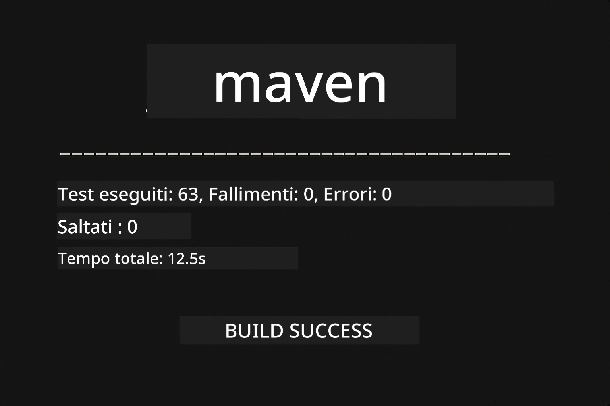
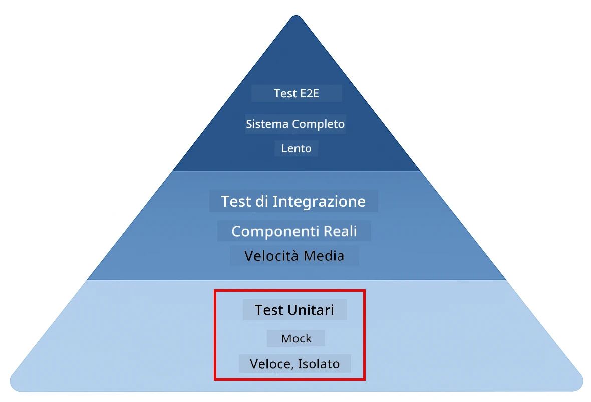
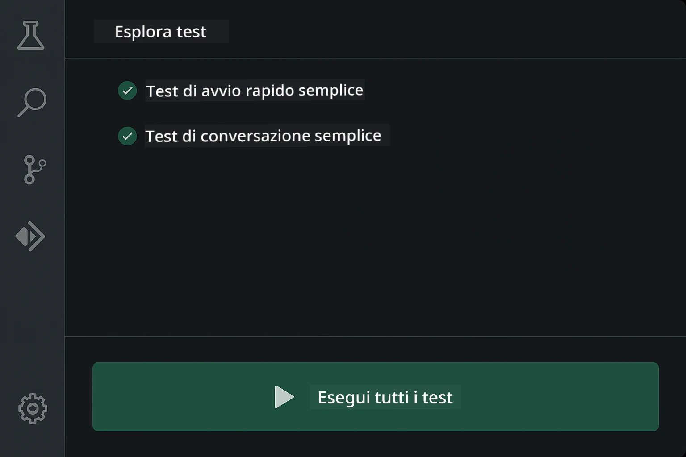
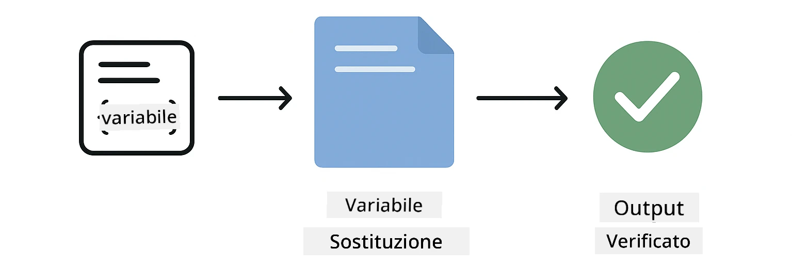
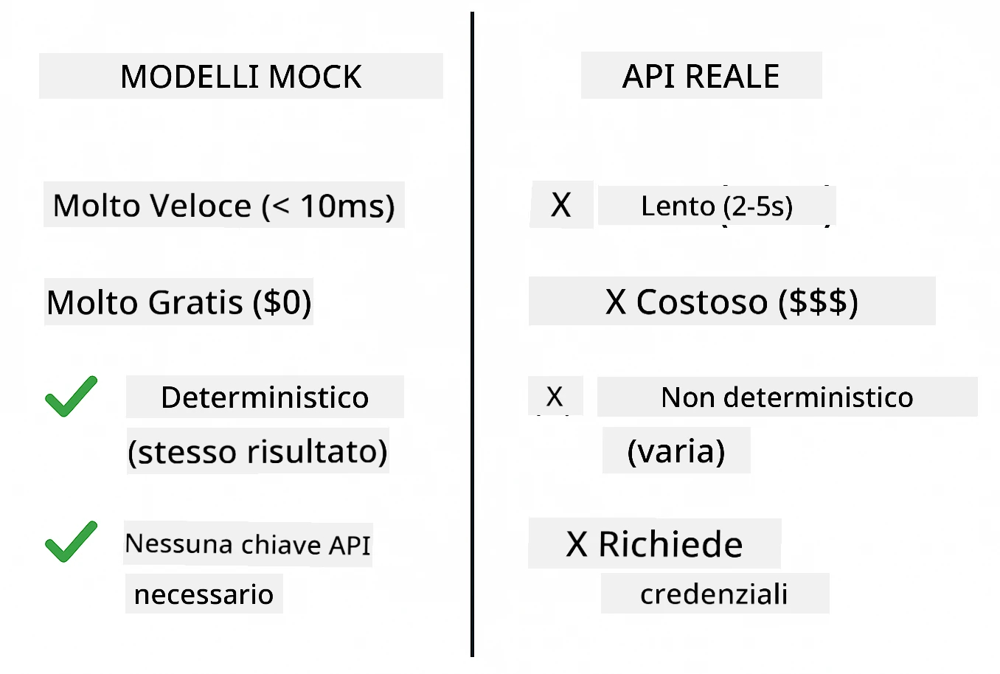
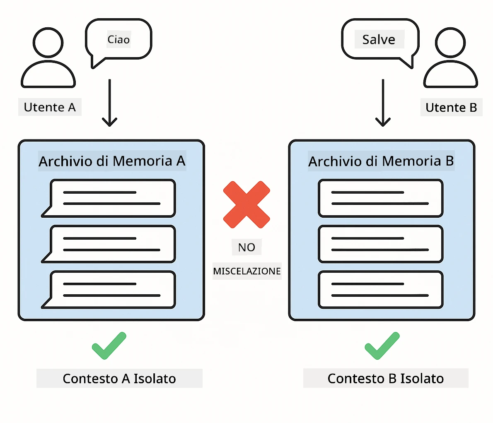
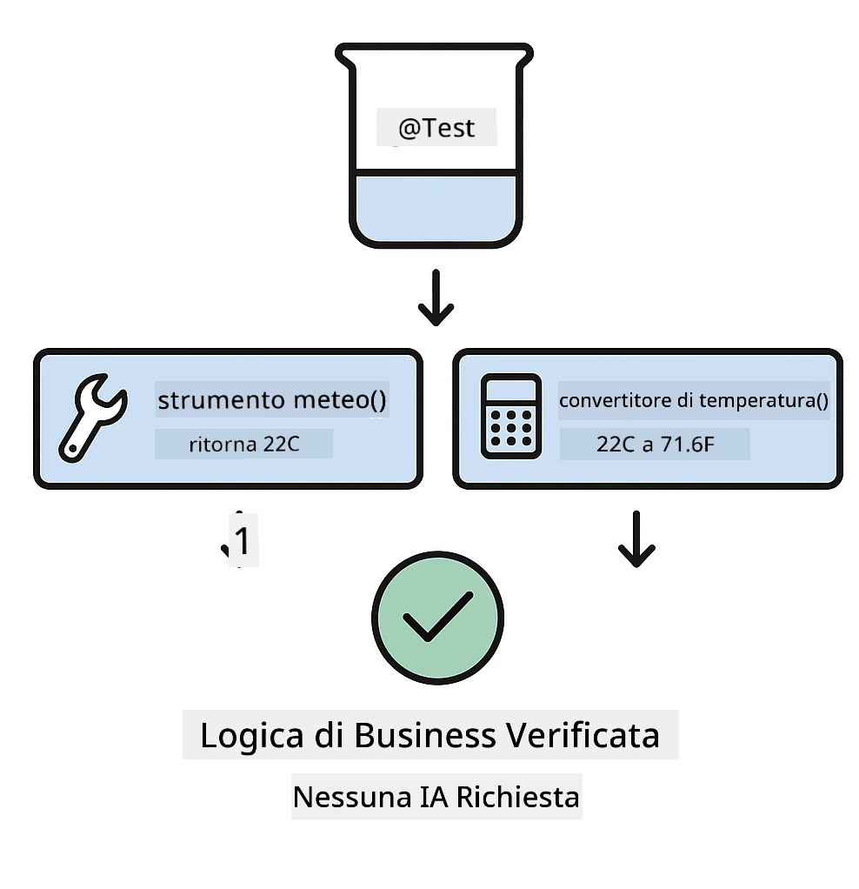
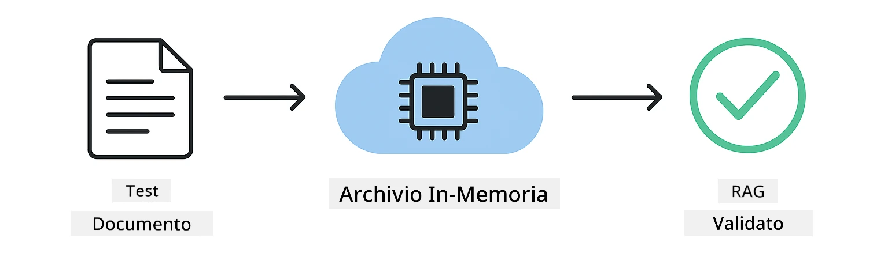

# Testare le applicazioni LangChain4j

## Sommario

- [Avvio rapido](#avvio-rapido)
- [Cosa coprono i test](#cosa-coprono-i-test)
- [Esecuzione dei test](#esecuzione-dei-test)
- [Esecuzione dei test in VS Code](#esecuzione-dei-test-in-vs-code)
- [Modelli di test](#modelli-di-test)
- [Filosofia dei test](#filosofia-dei-test)
- [Passi successivi](#passi-successivi)

Questa guida ti guida attraverso i test che mostrano come testare applicazioni AI senza richiedere chiavi API o servizi esterni.

## Avvio rapido

Esegui tutti i test con un solo comando:

**Bash:**
```bash
mvn test
```

**PowerShell:**
```powershell
mvn --% test
```

Quando tutti i test passano, dovresti vedere un output simile allo screenshot qui sotto — test eseguiti con zero fallimenti.



*Esecuzione riuscita dei test che mostra tutti i test superati con zero fallimenti*

## Cosa coprono i test

Questo corso si concentra sui **test unitari** che vengono eseguiti localmente. Ogni test dimostra un concetto specifico di LangChain4j in isolamento. La piramide dei test qui sotto mostra dove si collocano i test unitari — essi formano la base rapida e affidabile su cui costruisce il resto della tua strategia di test.



*Piramide dei test che mostra l’equilibrio tra test unitari (veloci, isolati), test di integrazione (componenti reali) e test end-to-end. Questa formazione copre il testing unitario.*

| Modulo | Test | Focus | File chiave |
|--------|-------|-------|-----------|
| **01 - Introduzione** | 8 | Memoria della conversazione e chat con stato | `SimpleConversationTest.java` |
| **02 - Prompt Engineering** | 12 | Pattern GPT-5.2, livelli di prontezza, output strutturato | `SimpleGpt5PromptTest.java` |
| **03 - RAG** | 10 | Ingestione documenti, embeddings, ricerca di similarità | `DocumentServiceTest.java` |
| **04 - Tools** | 12 | Chiamata di funzioni e concatenamento di tool | `SimpleToolsTest.java` |
| **05 - MCP** | 8 | Model Context Protocol con trasporto stdio | `SimpleMcpTest.java` |

## Esecuzione dei test

**Esegui tutti i test dalla root:**

**Bash:**
```bash
mvn test
```

**PowerShell:**
```powershell
mvn --% test
```

**Esegui i test per un modulo specifico:**

**Bash:**
```bash
cd 01-introduction && mvn test
# O dalla radice
mvn test -pl 01-introduction
```

**PowerShell:**
```powershell
cd 01-introduction; mvn --% test
# O dalla radice
mvn --% test -pl 01-introduction
```

**Esegui una singola classe di test:**

**Bash:**
```bash
mvn test -Dtest=SimpleConversationTest
```

**PowerShell:**
```powershell
mvn --% test -Dtest=SimpleConversationTest
```

**Esegui un metodo di test specifico:**

**Bash:**
```bash
mvn test -Dtest=SimpleConversationTest#dovrebbeMantenereLaCronologiaDellaConversazione
```

**PowerShell:**
```powershell
mvn --% test -Dtest=SimpleConversationTest#dovrebbeMantenereLaCronologiaDellaConversazione
```

## Esecuzione dei test in VS Code

Se usi Visual Studio Code, il Test Explorer fornisce un’interfaccia grafica per eseguire e fare il debug dei test.



*Test Explorer di VS Code che mostra l’albero dei test con tutte le classi di test Java e i singoli metodi di test*

**Per eseguire i test in VS Code:**

1. Apri il Test Explorer cliccando l’icona del becher nella barra attività
2. Espandi l’albero dei test per vedere tutti i moduli e le classi di test
3. Clicca il pulsante play accanto a qualsiasi test per eseguirlo singolarmente
4. Clicca su "Run All Tests" per eseguire l’intera suite
5. Clicca col tasto destro su un test e seleziona "Debug Test" per impostare breakpoint ed eseguire passo passo

Il Test Explorer mostra segni di spunta verdi per i test superati e fornisce messaggi dettagliati in caso di fallimento.

## Modelli di test

### Modello 1: Testare i template dei prompt

Il modello più semplice testa i template dei prompt senza chiamare alcun modello AI. Verifichi che la sostituzione delle variabili funzioni correttamente e che i prompt siano formattati come previsto.



*Test dei template di prompt che mostra il flusso di sostituzione delle variabili: template con segnaposto → valori applicati → output formattato verificato*

```java
@Test
@DisplayName("Should format prompt template with variables")
void testPromptTemplateFormatting() {
    PromptTemplate template = PromptTemplate.from(
        "Best time to visit {{destination}} for {{activity}}?"
    );
    
    Prompt prompt = template.apply(Map.of(
        "destination", "Paris",
        "activity", "sightseeing"
    ));
    
    assertThat(prompt.text()).isEqualTo("Best time to visit Paris for sightseeing?");
}
```

Questo modello verifica che la sostituzione delle variabili funzioni correttamente e che i prompt siano formattati come previsto — non è richiesta alcuna chiave API o chiamata al modello.

### Modello 2: Mocking dei modelli linguistici

Quando testi la logica della conversazione, usa Mockito per creare modelli falsi che restituiscono risposte predeterminate. Questo rende i test veloci, gratuiti e deterministici.



*Confronto che mostra perché i mock sono preferiti per il testing: sono veloci, gratuiti, deterministici e non richiedono chiavi API*

```java
@ExtendWith(MockitoExtension.class)
class SimpleConversationTest {
    
    private ConversationService conversationService;
    
    @Mock
    private OpenAiOfficialChatModel mockChatModel;
    
    @BeforeEach
    void setUp() {
        ChatResponse mockResponse = ChatResponse.builder()
            .aiMessage(AiMessage.from("This is a test response"))
            .build();
        when(mockChatModel.chat(anyList())).thenReturn(mockResponse);
        
        conversationService = new ConversationService(mockChatModel);
    }
    
    @Test
    void shouldMaintainConversationHistory() {
        String conversationId = conversationService.startConversation();
        
        ChatResponse mockResponse1 = ChatResponse.builder()
            .aiMessage(AiMessage.from("Response 1"))
            .build();
        ChatResponse mockResponse2 = ChatResponse.builder()
            .aiMessage(AiMessage.from("Response 2"))
            .build();
        ChatResponse mockResponse3 = ChatResponse.builder()
            .aiMessage(AiMessage.from("Response 3"))
            .build();
        
        when(mockChatModel.chat(anyList()))
            .thenReturn(mockResponse1)
            .thenReturn(mockResponse2)
            .thenReturn(mockResponse3);

        conversationService.chat(conversationId, "First message");
        conversationService.chat(conversationId, "Second message");
        conversationService.chat(conversationId, "Third message");

        List<ChatMessage> history = conversationService.getHistory(conversationId);
        assertThat(history).hasSize(6); // 3 messaggi utente + 3 messaggi AI
    }
}
```

Questo modello appare in `01-introduction/src/test/java/com/example/langchain4j/service/SimpleConversationTest.java`. Il mock garantisce comportamento consistente così puoi verificare che la gestione della memoria funzioni correttamente.

### Modello 3: Testare l’isolamento della conversazione

La memoria della conversazione deve mantenere gli utenti separati. Questo test verifica che le conversazioni non mescolino i contesti.



*Test dell’isolamento delle conversazioni che mostra archivi di memoria separati per diversi utenti per evitare mescolanze di contesto*

```java
@Test
void shouldIsolateConversationsByid() {
    String conv1 = conversationService.startConversation();
    String conv2 = conversationService.startConversation();
    
    ChatResponse mockResponse = ChatResponse.builder()
        .aiMessage(AiMessage.from("Response"))
        .build();
    when(mockChatModel.chat(anyList())).thenReturn(mockResponse);

    conversationService.chat(conv1, "Message for conversation 1");
    conversationService.chat(conv2, "Message for conversation 2");

    List<ChatMessage> history1 = conversationService.getHistory(conv1);
    List<ChatMessage> history2 = conversationService.getHistory(conv2);
    
    assertThat(history1).hasSize(2);
    assertThat(history2).hasSize(2);
}
```

Ogni conversazione mantiene la propria storia indipendente. Nei sistemi di produzione, questo isolamento è critico per applicazioni multi-utente.

### Modello 4: Testare i tool indipendentemente

I tool sono funzioni che l’AI può chiamare. Testali direttamente per assicurarti che funzionino correttamente indipendentemente dalle decisioni AI.



*Testare i tool in modo indipendente mostrando l’esecuzione di tool mock senza chiamate AI per verificare la logica di business*

```java
@Test
void shouldConvertCelsiusToFahrenheit() {
    TemperatureTool tempTool = new TemperatureTool();
    String result = tempTool.celsiusToFahrenheit(25.0);
    assertThat(result).containsPattern("77[.,]0°F");
}

@Test
void shouldDemonstrateToolChaining() {
    WeatherTool weatherTool = new WeatherTool();
    TemperatureTool tempTool = new TemperatureTool();

    String weatherResult = weatherTool.getCurrentWeather("Seattle");
    assertThat(weatherResult).containsPattern("\\d+°C");

    String conversionResult = tempTool.celsiusToFahrenheit(22.0);
    assertThat(conversionResult).containsPattern("71[.,]6°F");
}
```

Questi test da `04-tools/src/test/java/com/example/langchain4j/agents/tools/SimpleToolsTest.java` convalidano la logica dei tool senza coinvolgimento AI. L’esempio di concatenamento mostra come l’output di un tool alimenta l’input di un altro.

### Modello 5: Test RAG in memoria

I sistemi RAG richiedono tradizionalmente database vettoriali e servizi di embedding. Il modello in memoria ti permette di testare l’intera pipeline senza dipendenze esterne.



*Workflow di test RAG in memoria che mostra parsing documenti, memorizzazione embedding e ricerca di similarità senza richiedere un database*

```java
@Test
void testProcessTextDocument() {
    String content = "This is a test document.\nIt has multiple lines.";
    InputStream inputStream = new ByteArrayInputStream(content.getBytes(StandardCharsets.UTF_8));
    
    DocumentService.ProcessedDocument result = 
        documentService.processDocument(inputStream, "test.txt");

    assertNotNull(result);
    assertTrue(result.segments().size() > 0);
    assertEquals("test.txt", result.segments().get(0).metadata().getString("filename"));
}
```

Questo test da `03-rag/src/test/java/com/example/langchain4j/rag/service/DocumentServiceTest.java` crea un documento in memoria e verifica il chunking e la gestione dei metadata.

### Modello 6: Test d’integrazione MCP

Il modulo MCP testa l’integrazione del Model Context Protocol usando il trasporto stdio. Questi test verificano che la tua applicazione possa avviare e comunicare con server MCP come sottoprocessi.

I test in `05-mcp/src/test/java/com/example/langchain4j/mcp/SimpleMcpTest.java` convalidano il comportamento del client MCP.

**Eseguili:**

**Bash:**
```bash
cd 05-mcp && mvn test
```

**PowerShell:**
```powershell
cd 05-mcp; mvn --% test
```

## Filosofia dei test

Testa il tuo codice, non l’AI. I tuoi test dovrebbero convalidare il codice che scrivi controllando come i prompt sono costruiti, come la memoria è gestita e come i tool vengono eseguiti. Le risposte AI variano e non dovrebbero far parte delle asserzioni dei test. Chiediti se il tuo template di prompt sostituisce correttamente le variabili, non se l’AI fornisce la risposta giusta.

Usa i mock per i modelli linguistici. Sono dipendenze esterne che sono lente, costose e non deterministiche. Il mocking rende i test veloci con millisecondi invece di secondi, gratuiti senza costi API e deterministici con lo stesso risultato ogni volta.

Mantieni i test indipendenti. Ogni test dovrebbe preparare i propri dati, non dipendere da altri test e pulire dopo di sé. I test dovrebbero passare indipendentemente dall’ordine di esecuzione.

Testa casi limite oltre il percorso ottimale. Prova input vuoti, input molto grandi, caratteri speciali, parametri non validi e condizioni di confine. Questi spesso rivelano bug che l’uso normale non espone.

Usa nomi descrittivi. Confronta `shouldMaintainConversationHistoryAcrossMultipleMessages()` con `test1()`. Il primo ti dice esattamente cosa viene testato, facilitando molto il debug in caso di fallimenti.

## Passi successivi

Ora che conosci i modelli di test, approfondisci ogni modulo:

- **[01 - Introduzione](../01-introduction/README.md)** - Impara la gestione della memoria della conversazione
- **[02 - Prompt Engineering](../02/prompt-engineering/README.md)** - Padroneggia i pattern di prompting GPT-5.2
- **[03 - RAG](../03-rag/README.md)** - Costruisci sistemi di generazione arricchita da recupero
- **[04 - Tools](../04-tools/README.md)** - Implementa chiamate di funzione e catene di strumenti
- **[05 - MCP](../05-mcp/README.md)** - Integra il Model Context Protocol

Il README di ogni modulo fornisce spiegazioni dettagliate dei concetti testati qui.

---

**Navigazione:** [← Torna al principale](../README.md)

---

<!-- CO-OP TRANSLATOR DISCLAIMER START -->
**Disclaimer**:
Questo documento è stato tradotto utilizzando il servizio di traduzione AI [Co-op Translator](https://github.com/Azure/co-op-translator). Sebbene ci impegniamo per garantire la precisione, si prega di notare che le traduzioni automatizzate possono contenere errori o imprecisioni. Il documento originale nella sua lingua nativa deve essere considerato la fonte autorevole. Per informazioni critiche, si raccomanda una traduzione professionale effettuata da un essere umano. Non siamo responsabili per eventuali malintesi o interpretazioni errate derivanti dall’uso di questa traduzione.
<!-- CO-OP TRANSLATOR DISCLAIMER END -->