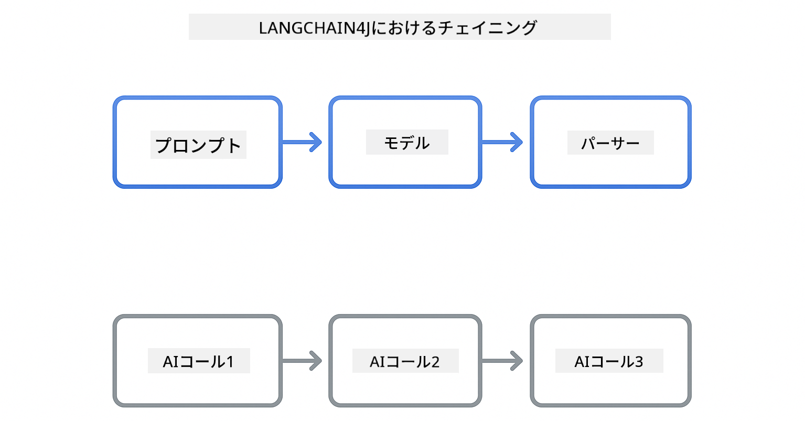

<!--
CO_OP_TRANSLATOR_METADATA:
{
  "original_hash": "377b3e3e6f8d02965bf0fbbc9ccb45c5",
  "translation_date": "2025-12-13T14:40:43+00:00",
  "source_file": "00-quick-start/README.md",
  "language_code": "ja"
}
-->
# Module 00: クイックスタート

## 目次

- [はじめに](../../../00-quick-start)
- [LangChain4jとは？](../../../00-quick-start)
- [LangChain4jの依存関係](../../../00-quick-start)
- [前提条件](../../../00-quick-start)
- [セットアップ](../../../00-quick-start)
  - [1. GitHubトークンの取得](../../../00-quick-start)
  - [2. トークンの設定](../../../00-quick-start)
- [サンプルの実行](../../../00-quick-start)
  - [1. 基本チャット](../../../00-quick-start)
  - [2. プロンプトパターン](../../../00-quick-start)
  - [3. 関数呼び出し](../../../00-quick-start)
  - [4. ドキュメントQ&A（RAG）](../../../00-quick-start)
- [各サンプルの説明](../../../00-quick-start)
- [次のステップ](../../../00-quick-start)
- [トラブルシューティング](../../../00-quick-start)

## はじめに

このクイックスタートは、LangChain4jをできるだけ早く使い始めるためのものです。LangChain4jとGitHub Modelsを使ったAIアプリケーション構築の基本をカバーしています。次のモジュールでは、LangChain4jでAzure OpenAIを使い、より高度なアプリケーションを構築します。

## LangChain4jとは？

LangChain4jは、AI搭載アプリケーションの構築を簡素化するJavaライブラリです。HTTPクライアントやJSON解析を扱う代わりに、クリーンなJava APIで作業します。

LangChainの「チェーン」とは、複数のコンポーネントを連結することを指します。プロンプトをモデルに、モデルをパーサーに繋げたり、複数のAI呼び出しを連鎖させて一つの出力が次の入力になるようにします。このクイックスタートでは、より複雑なチェーンを探求する前に基本を学びます。



*LangChain4jのコンポーネント連結 - ブロックをつなげて強力なAIワークフローを構築*

3つのコアコンポーネントを使います：

**ChatLanguageModel** - AIモデルとの対話インターフェース。`model.chat("prompt")`を呼び出して応答文字列を得ます。OpenAI互換のエンドポイント（GitHub Modelsなど）で動作する`OpenAiOfficialChatModel`を使用します。

**AiServices** - 型安全なAIサービスインターフェースを作成。メソッドを定義し`@Tool`で注釈を付けると、LangChain4jがオーケストレーションを処理。必要に応じてAIが自動的にJavaメソッドを呼び出します。

**MessageWindowChatMemory** - 会話履歴を保持。これがないと各リクエストは独立しますが、これを使うとAIは過去のメッセージを記憶し複数ターンにわたりコンテキストを維持します。


*LangChain4jのアーキテクチャ - コアコンポーネントが連携してAIアプリケーションを支える*

## LangChain4jの依存関係

このクイックスタートでは、[`pom.xml`](../../../00-quick-start/pom.xml)に2つのMaven依存関係を使用します：

```xml
<!-- Core LangChain4j library -->
<dependency>
    <groupId>dev.langchain4j</groupId>
    <artifactId>langchain4j</artifactId> <!-- Inherited from BOM in root pom.xml -->
</dependency>

<!-- OpenAI integration (works with GitHub Models) -->
<dependency>
    <groupId>dev.langchain4j</groupId>
    <artifactId>langchain4j-open-ai-official</artifactId> <!-- Inherited from BOM in root pom.xml -->
</dependency>
```

`langchain4j-open-ai-official`モジュールは、OpenAI互換APIに接続する`OpenAiOfficialChatModel`クラスを提供します。GitHub Modelsは同じAPI形式を使うため、特別なアダプターは不要で、ベースURLを`https://models.github.ai/inference`に指定するだけです。

## 前提条件

**Dev Containerを使う場合？** JavaとMavenはすでにインストール済みです。GitHubパーソナルアクセストークンだけ用意してください。

**ローカル開発の場合：**
- Java 21以上、Maven 3.9以上
- GitHubパーソナルアクセストークン（以下の手順参照）

> **注意:** このモジュールはGitHub Modelsの`gpt-4.1-nano`を使用します。コード内のモデル名は変更しないでください。GitHubの利用可能なモデルに合わせて設定されています。

## セットアップ

### 1. GitHubトークンの取得

1. [GitHub設定 → パーソナルアクセストークン](https://github.com/settings/personal-access-tokens)にアクセス
2. 「新しいトークンを生成」をクリック
3. 説明的な名前を設定（例：「LangChain4j Demo」）
4. 有効期限を設定（7日推奨）
5. 「アカウント権限」から「Models」を見つけ、「読み取り専用」に設定
6. 「トークンを生成」をクリック
7. トークンをコピーして保存（再表示されません）

### 2. トークンの設定

**オプション1: VS Codeを使う場合（推奨）**

VS Codeを使う場合は、プロジェクトルートの`.env`ファイルにトークンを追加します：

`.env`ファイルがなければ、`.env.example`をコピーして`.env`にするか、新規作成してください。

**例 `.env`ファイル:**
```bash
# /workspaces/LangChain4j-for-Beginners/.env にて
GITHUB_TOKEN=your_token_here
```

その後、エクスプローラーで任意のデモファイル（例：`BasicChatDemo.java`）を右クリックし、**「Run Java」**を選択するか、実行とデバッグパネルの起動構成を使えます。

**オプション2: ターミナルを使う場合**

環境変数としてトークンを設定：

**Bash:**
```bash
export GITHUB_TOKEN=your_token_here
```

**PowerShell:**
```powershell
$env:GITHUB_TOKEN=your_token_here
```

## サンプルの実行

**VS Codeを使う場合：** エクスプローラーで任意のデモファイルを右クリックし**「Run Java」**を選択、または実行とデバッグパネルの起動構成を使います（事前に`.env`にトークンを追加してください）。

**Mavenを使う場合：** コマンドラインから実行も可能です：

### 1. 基本チャット

**Bash:**
```bash
mvn compile exec:java -Dexec.mainClass=com.example.langchain4j.quickstart.BasicChatDemo
```

**PowerShell:**
```powershell
mvn --% compile exec:java -Dexec.mainClass=com.example.langchain4j.quickstart.BasicChatDemo
```

### 2. プロンプトパターン

**Bash:**
```bash
mvn compile exec:java -Dexec.mainClass=com.example.langchain4j.quickstart.PromptEngineeringDemo
```

**PowerShell:**
```powershell
mvn --% compile exec:java -Dexec.mainClass=com.example.langchain4j.quickstart.PromptEngineeringDemo
```

ゼロショット、フューショット、チェーン・オブ・ソート、ロールベースのプロンプトを示します。

### 3. 関数呼び出し

**Bash:**
```bash
mvn compile exec:java -Dexec.mainClass=com.example.langchain4j.quickstart.ToolIntegrationDemo
```

**PowerShell:**
```powershell
mvn --% compile exec:java -Dexec.mainClass=com.example.langchain4j.quickstart.ToolIntegrationDemo
```

AIが必要に応じて自動的にJavaメソッドを呼び出します。

### 4. ドキュメントQ&A（RAG）

**Bash:**
```bash
mvn compile exec:java -Dexec.mainClass=com.example.langchain4j.quickstart.SimpleReaderDemo
```

**PowerShell:**
```powershell
mvn --% compile exec:java -Dexec.mainClass=com.example.langchain4j.quickstart.SimpleReaderDemo
```

`document.txt`の内容に関する質問ができます。

## 各サンプルの説明

**基本チャット** - [BasicChatDemo.java](../../../00-quick-start/src/main/java/com/example/langchain4j/quickstart/BasicChatDemo.java)

ここから始めてLangChain4jの最も基本的な使い方を見ます。`OpenAiOfficialChatModel`を作成し、`.chat()`でプロンプトを送り、応答を得ます。これはカスタムエンドポイントとAPIキーでモデルを初期化する基礎を示します。このパターンを理解すれば、他のすべてがこれに基づいて構築されます。

```java
ChatLanguageModel model = OpenAiOfficialChatModel.builder()
    .baseUrl("https://models.github.ai/inference")
    .apiKey(System.getenv("GITHUB_TOKEN"))
    .modelName("gpt-4.1-nano")
    .build();

String response = model.chat("What is LangChain4j?");
System.out.println(response);
```

> **🤖 [GitHub Copilot](https://github.com/features/copilot) Chatで試す:** [`BasicChatDemo.java`](../../../00-quick-start/src/main/java/com/example/langchain4j/quickstart/BasicChatDemo.java)を開き、以下を質問：
> - 「このコードでGitHub ModelsからAzure OpenAIに切り替えるにはどうすればいい？」
> - 「OpenAiOfficialChatModel.builder()で設定できる他のパラメータは？」
> - 「完全な応答を待たずにストリーミング応答を追加するには？」

**プロンプトエンジニアリング** - [PromptEngineeringDemo.java](../../../00-quick-start/src/main/java/com/example/langchain4j/quickstart/PromptEngineeringDemo.java)

モデルとの対話方法がわかったので、次は何を伝えるかを探ります。このデモは同じモデル設定を使いながら、4つの異なるプロンプトパターンを示します。直接指示するゼロショット、例から学ぶフューショット、推論過程を示すチェーン・オブ・ソート、コンテキストを設定するロールベースのプロンプトです。同じモデルでもリクエストの枠組み次第で結果が大きく変わることがわかります。

```java
PromptTemplate template = PromptTemplate.from(
    "What's the best time to visit {{destination}} for {{activity}}?"
);

Prompt prompt = template.apply(Map.of(
    "destination", "Paris",
    "activity", "sightseeing"
));

String response = model.chat(prompt.text());
```

> **🤖 [GitHub Copilot](https://github.com/features/copilot) Chatで試す:** [`PromptEngineeringDemo.java`](../../../00-quick-start/src/main/java/com/example/langchain4j/quickstart/PromptEngineeringDemo.java)を開き、以下を質問：
> - 「ゼロショットとフューショットの違いは？それぞれいつ使うべき？」
> - 「temperatureパラメータはモデルの応答にどう影響する？」
> - 「本番環境でのプロンプトインジェクション攻撃を防ぐ技術は？」
> - 「共通パターン用の再利用可能なPromptTemplateオブジェクトはどう作る？」

**ツール統合** - [ToolIntegrationDemo.java](../../../00-quick-start/src/main/java/com/example/langchain4j/quickstart/ToolIntegrationDemo.java)

ここでLangChain4jの強力さが発揮されます。`AiServices`を使い、Javaメソッドを呼び出せるAIアシスタントを作ります。メソッドに`@Tool("説明")`を付けるだけで、LangChain4jが残りを処理し、ユーザーの質問に応じてAIが自動的にツールを使い分けます。これは関数呼び出しのデモで、質問に答えるだけでなく行動を起こせるAI構築の重要技術です。

```java
@Tool("Performs addition of two numeric values")
public double add(double a, double b) {
    return a + b;
}

MathAssistant assistant = AiServices.create(MathAssistant.class, model);
String response = assistant.chat("What is 25 plus 17?");
```

> **🤖 [GitHub Copilot](https://github.com/features/copilot) Chatで試す:** [`ToolIntegrationDemo.java`](../../../00-quick-start/src/main/java/com/example/langchain4j/quickstart/ToolIntegrationDemo.java)を開き、以下を質問：
> - 「@Tool注釈はどう機能し、LangChain4jは裏で何をしている？」
> - 「AIは複数のツールを連続で呼び出して複雑な問題を解決できる？」
> - 「ツールが例外を投げたらどうなる？エラー処理はどうすべき？」
> - 「この計算機例の代わりに実際のAPIを統合するには？」

**ドキュメントQ&A（RAG）** - [SimpleReaderDemo.java](../../../00-quick-start/src/main/java/com/example/langchain4j/quickstart/SimpleReaderDemo.java)

ここではRAG（検索強化生成）の基礎を示します。モデルの訓練データに頼る代わりに、[`document.txt`](../../../00-quick-start/document.txt)の内容を読み込みプロンプトに含めます。AIは一般知識ではなくドキュメントに基づいて回答します。これは自分のデータで動作するシステム構築の第一歩です。

```java
Document document = FileSystemDocumentLoader.loadDocument("document.txt");
String content = document.text();

String prompt = "Based on this document: " + content + 
                "\nQuestion: What is the main topic?";
String response = model.chat(prompt);
```

> **注意:** この単純な方法はドキュメント全体をプロンプトに読み込みます。大きなファイル（10KB超）ではコンテキスト制限を超えます。モジュール03でチャンク分割とベクトル検索による本格的なRAGシステムを扱います。

> **🤖 [GitHub Copilot](https://github.com/features/copilot) Chatで試す:** [`SimpleReaderDemo.java`](../../../00-quick-start/src/main/java/com/example/langchain4j/quickstart/SimpleReaderDemo.java)を開き、以下を質問：
> - 「RAGはモデルの訓練データを使う場合と比べてAIの幻覚をどう防ぐ？」
> - 「この単純な方法とベクトル埋め込みを使った検索の違いは？」
> - 「複数ドキュメントや大規模ナレッジベースに拡張するには？」
> - 「AIが提供されたコンテキストだけを使うようにプロンプトを構成するベストプラクティスは？」

## デバッグ

サンプルには`.logRequests(true)`と`.logResponses(true)`が含まれ、API呼び出しをコンソールに表示します。認証エラー、レート制限、予期しない応答のトラブルシューティングに役立ちます。本番環境ではログノイズを減らすためこれらのフラグを外してください。

## 次のステップ

**次のモジュール:** [01-introduction - LangChain4jとAzure上のgpt-5の使い方](../01-introduction/README.md)

---

**ナビゲーション:** [← メインに戻る](../README.md) | [次へ: Module 01 - Introduction →](../01-introduction/README.md)

---

## トラブルシューティング

### 初回Mavenビルド

**問題:** 初回の`mvn clean compile`や`mvn package`が長時間（10〜15分）かかる

**原因:** Mavenが初回ビルド時にすべての依存関係（Spring Boot、LangChain4jライブラリ、Azure SDKなど）をダウンロードするため

**解決策:** これは正常な動作です。依存関係はローカルにキャッシュされるため、次回以降のビルドは高速になります。ダウンロード時間はネットワーク速度に依存します。

### PowerShellのMavenコマンド構文

**問題:** Mavenコマンドが`Unknown lifecycle phase ".mainClass=..."`エラーで失敗する

**原因:** PowerShellが`=`を変数代入演算子として解釈し、Mavenのプロパティ構文が壊れるため

**解決策:** Mavenコマンドの前に停止解析演算子`--%`を使う：

**PowerShell:**
```powershell
mvn --% compile exec:java -Dexec.mainClass=com.example.langchain4j.quickstart.BasicChatDemo
```

**Bash:**
```bash
mvn compile exec:java -Dexec.mainClass=com.example.langchain4j.quickstart.BasicChatDemo
```

`--%`演算子はPowerShellに残りの引数を文字通りMavenに渡すよう指示します。

### Windows PowerShellの絵文字表示

**問題:** PowerShellでAI応答の絵文字が文字化け（例：`????`や`â??`）する

**原因:** PowerShellのデフォルトエンコーディングがUTF-8絵文字をサポートしていないため

**解決策:** Javaアプリ実行前に以下のコマンドを実行：
```cmd
chcp 65001
```

これでターミナルのUTF-8エンコーディングが強制されます。あるいはUnicode対応が優れたWindows Terminalを使う方法もあります。

---

<!-- CO-OP TRANSLATOR DISCLAIMER START -->
**免責事項**：  
本書類はAI翻訳サービス「Co-op Translator」（https://github.com/Azure/co-op-translator）を使用して翻訳されました。正確性の向上に努めておりますが、自動翻訳には誤りや不正確な部分が含まれる可能性があります。原文の言語による文書が正式な情報源とみなされるべきです。重要な情報については、専門の人間による翻訳を推奨します。本翻訳の利用により生じたいかなる誤解や誤訳についても、当方は一切責任を負いかねます。
<!-- CO-OP TRANSLATOR DISCLAIMER END -->