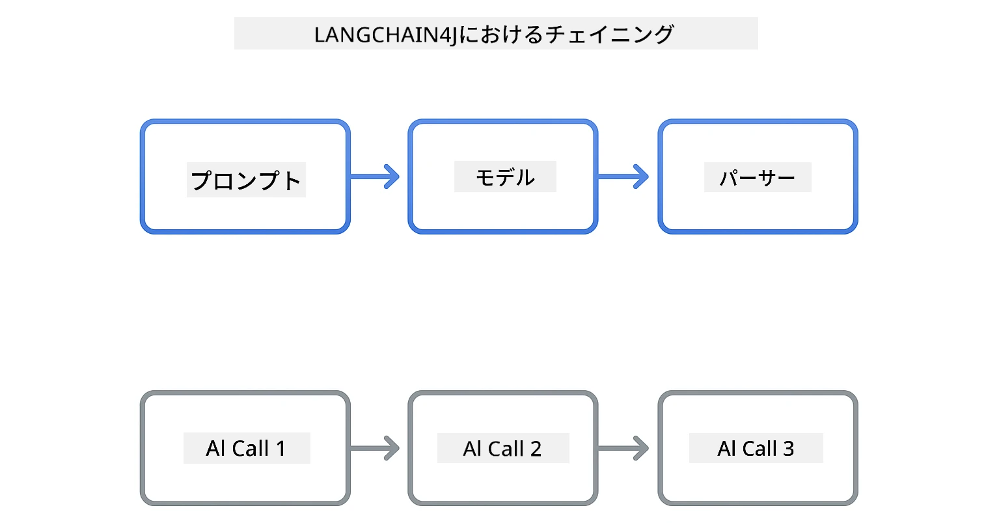
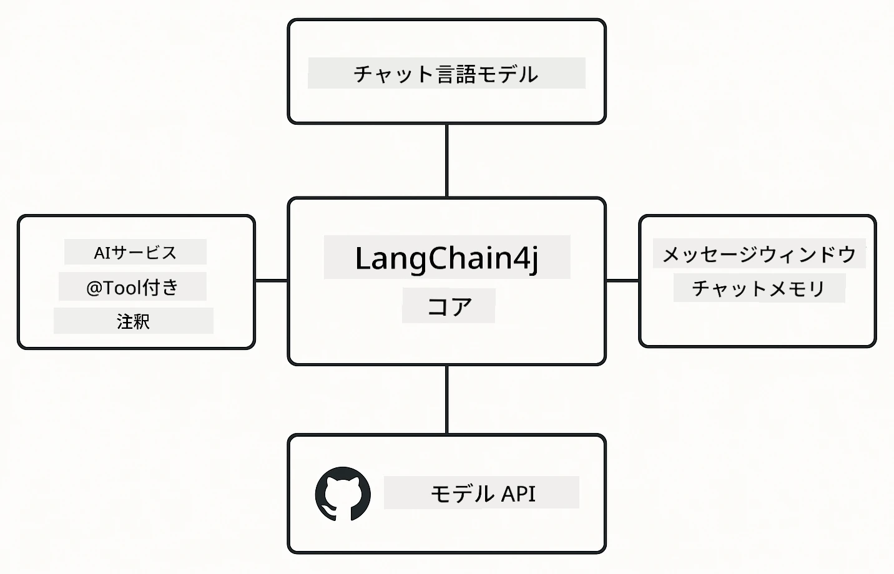

# Module 00: クイックスタート

## 目次

- [はじめに](../../../00-quick-start)
- [LangChain4jとは？](../../../00-quick-start)
- [LangChain4jの依存関係](../../../00-quick-start)
- [前提条件](../../../00-quick-start)
- [セットアップ](../../../00-quick-start)
  - [1. GitHubトークンの取得](../../../00-quick-start)
  - [2. トークンの設定](../../../00-quick-start)
- [例を実行する](../../../00-quick-start)
  - [1. 基本チャット](../../../00-quick-start)
  - [2. プロンプトパターン](../../../00-quick-start)
  - [3. 関数呼び出し](../../../00-quick-start)
  - [4. ドキュメントQ&A（RAG）](../../../00-quick-start)
  - [5. 責任あるAI](../../../00-quick-start)
- [各例の説明](../../../00-quick-start)
- [次のステップ](../../../00-quick-start)
- [トラブルシューティング](../../../00-quick-start)

## はじめに

このクイックスタートは、LangChain4jをできるだけ早く使い始められるように作られています。LangChain4jとGitHubモデルを使ったAIアプリケーション構築の基本をカバーしています。次のモジュールではAzure OpenAIとLangChain4jを使って、より高度なアプリケーションを構築します。

## LangChain4jとは？

LangChain4jは、AI搭載アプリケーションの構築を簡素化するJavaライブラリです。HTTPクライアントやJSON解析を直接扱う代わりに、簡潔なJava APIで操作できます。

LangChainの「チェーン」とは、複数のコンポーネントを連結することを指します。例えば、プロンプトをモデルに、モデルの結果をパーサーにつなげたり、複数のAI呼び出しを連鎖させ、一つの出力が次の入力になるようにします。このクイックスタートでは、より複雑なチェーンに進む前の基本を学びます。



*LangChain4jにおけるコンポーネントの連結―強力なAIワークフローを作り出すビルディングブロック*

以下の3つのコアコンポーネントを使用します：

**ChatLanguageModel** - AIモデルとの対話用インターフェース。`model.chat("prompt")`を呼び出し、応答文字列を取得します。GitHubモデルのようなOpenAI互換エンドポイントに対応した`OpenAiOfficialChatModel`を使います。

**AiServices** - 型安全なAIサービスのインターフェースを作成します。メソッドを定義し、`@Tool`で注釈をつけると、LangChain4jがオーケストレーションを処理します。AIは必要に応じて自動でJavaメソッドを呼び出します。

**MessageWindowChatMemory** - 会話履歴を管理します。これがないと各リクエストは独立しますが、これを使うとAIは過去のメッセージを記憶し、複数ターンにわたって文脈を維持します。



*LangChain4jのアーキテクチャ―コアコンポーネントが連携してAIアプリケーションを強力に支える*

## LangChain4jの依存関係

このクイックスタートは[`pom.xml`](../../../00-quick-start/pom.xml)の中で次の2つのMaven依存関係を使います：

```xml
<!-- Core LangChain4j library -->
<dependency>
    <groupId>dev.langchain4j</groupId>
    <artifactId>langchain4j</artifactId> <!-- Inherited from BOM in root pom.xml -->
</dependency>

<!-- OpenAI integration (works with GitHub Models) -->
<dependency>
    <groupId>dev.langchain4j</groupId>
    <artifactId>langchain4j-open-ai-official</artifactId> <!-- Inherited from BOM in root pom.xml -->
</dependency>
```

`langchain4j-open-ai-official` モジュールは、OpenAI互換APIに接続可能な `OpenAiOfficialChatModel` クラスを提供します。GitHubモデルは同じAPI形式を使っているため、特別なアダプターは不要で、ベースURLを `https://models.github.ai/inference` に設定すれば使えます。

## 前提条件

**Devコンテナを使っていますか？** JavaとMavenはすでにインストール済みです。GitHubのパーソナルアクセストークンだけが必要です。

**ローカル開発の場合：**
- Java 21以上、Maven 3.9以上
- GitHubパーソナルアクセストークン（取得方法は以下）

> **注意:** このモジュールはGitHubモデルの`gpt-4.1-nano`を使用します。コード内のモデル名を変更しないでください。GitHubの利用可能モデルに合わせて設定されています。

## セットアップ

### 1. GitHubトークンの取得

1. [GitHub設定 → パーソナルアクセストークン](https://github.com/settings/personal-access-tokens) にアクセス
2. 「新しいトークンを生成」をクリック
3. 説明的な名前を設定（例：「LangChain4jデモ」）
4. 有効期限を設定（7日間推奨）
5. 「アカウント権限」で「Models」を見つけ、「読み取り専用」に設定
6. 「トークンを生成」クリック
7. トークンをコピーして保存（再表示されません）

### 2. トークンの設定

**オプション1: VS Code使用（推奨）**

VS Codeを使っている場合は、プロジェクトルートの`.env`ファイルにトークンを追加します。

もし `.env` ファイルがなければ、`.env.example`をコピーして`.env`にするか、新規に`.env`ファイルを作成してください。

**例：`.env` ファイル**
```bash
# /workspaces/LangChain4j-for-Beginners/.env 内で
GITHUB_TOKEN=your_token_here
```

そして、エクスプローラーで任意のデモファイル（例：`BasicChatDemo.java`）を右クリックして **「Run Java」** を選ぶか、実行とデバッグパネルのランチ構成を使えます。

**オプション2: ターミナル使用**

環境変数としてトークンを設定します。

**Bash:**
```bash
export GITHUB_TOKEN=your_token_here
```

**PowerShell:**
```powershell
$env:GITHUB_TOKEN=your_token_here
```

## 例を実行する

**VS Codeを使う場合：** 任意のデモファイルをエクスプローラーで右クリックし **「Run Java」** を選ぶか、実行とデバッグパネルのランチ構成を使用します（あらかじめ`.env`にトークンを設定していること）。

**Mavenを使う場合：** コマンドラインから次のように実行できます：

### 1. 基本チャット

**Bash:**
```bash
mvn compile exec:java -Dexec.mainClass=com.example.langchain4j.quickstart.BasicChatDemo
```

**PowerShell:**
```powershell
mvn --% compile exec:java -Dexec.mainClass=com.example.langchain4j.quickstart.BasicChatDemo
```

### 2. プロンプトパターン

**Bash:**
```bash
mvn compile exec:java -Dexec.mainClass=com.example.langchain4j.quickstart.PromptEngineeringDemo
```

**PowerShell:**
```powershell
mvn --% compile exec:java -Dexec.mainClass=com.example.langchain4j.quickstart.PromptEngineeringDemo
```

ゼロショット、フューショット、チェーン・オブ・ソート、役割ベースのプロンプトを表示します。

### 3. 関数呼び出し

**Bash:**
```bash
mvn compile exec:java -Dexec.mainClass=com.example.langchain4j.quickstart.ToolIntegrationDemo
```

**PowerShell:**
```powershell
mvn --% compile exec:java -Dexec.mainClass=com.example.langchain4j.quickstart.ToolIntegrationDemo
```

必要に応じてAIが自動的にJavaメソッドを呼び出します。

### 4. ドキュメントQ&A（RAG）

**Bash:**
```bash
mvn compile exec:java -Dexec.mainClass=com.example.langchain4j.quickstart.SimpleReaderDemo
```

**PowerShell:**
```powershell
mvn --% compile exec:java -Dexec.mainClass=com.example.langchain4j.quickstart.SimpleReaderDemo
```

`document.txt` の内容に関する質問が可能です。

### 5. 責任あるAI

**Bash:**
```bash
mvn compile exec:java -Dexec.mainClass=com.example.langchain4j.quickstart.ResponsibleAIDemo
```

**PowerShell:**
```powershell
mvn --% compile exec:java -Dexec.mainClass=com.example.langchain4j.quickstart.ResponsibleAIDemo
```

AIの安全フィルターが有害なコンテンツをブロックする様子を確認できます。

## 各例の説明

**基本チャット** - [BasicChatDemo.java](../../../00-quick-start/src/main/java/com/example/langchain4j/quickstart/BasicChatDemo.java)

LangChain4jの最も単純な使い方をここで始めます。`OpenAiOfficialChatModel`を作成し、`.chat()`でプロンプトを送り応答を取得します。カスタムエンドポイントとAPIキーでモデルを初期化する基礎を示します。このパターンを理解すると、他のすべてがこの上に構築されます。

```java
ChatLanguageModel model = OpenAiOfficialChatModel.builder()
    .baseUrl("https://models.github.ai/inference")
    .apiKey(System.getenv("GITHUB_TOKEN"))
    .modelName("gpt-4.1-nano")
    .build();

String response = model.chat("What is LangChain4j?");
System.out.println(response);
```

> **🤖 [GitHub Copilot](https://github.com/features/copilot) チャットで試す:** [`BasicChatDemo.java`](../../../00-quick-start/src/main/java/com/example/langchain4j/quickstart/BasicChatDemo.java) を開いて以下を質問してみてください:
> - 「このコードでGitHubモデルからAzure OpenAIに切り替えるにはどうしたらいいですか？」
> - 「OpenAiOfficialChatModel.builder()で設定できる他のパラメータはどんなものがありますか？」
> - 「完全な応答を待たずにストリーミング応答を追加するにはどうすればいいですか？」

**プロンプトエンジニアリング** - [PromptEngineeringDemo.java](../../../00-quick-start/src/main/java/com/example/langchain4j/quickstart/PromptEngineeringDemo.java)

モデルと話す方法が分かったら、次に何を伝えるかを探ります。このデモは同じモデル設定を使いながら、4つの異なるプロンプトパターンを示します。直接指示するゼロショットプロンプト、例から学ぶフューショットプロンプト、推論手順を示すチェーン・オブ・ソート、そして文脈を設定する役割ベースのプロンプトを試してください。リクエストの構成方法で同じモデルでも大きく異なる結果が出ることがわかります。

```java
PromptTemplate template = PromptTemplate.from(
    "What's the best time to visit {{destination}} for {{activity}}?"
);

Prompt prompt = template.apply(Map.of(
    "destination", "Paris",
    "activity", "sightseeing"
));

String response = model.chat(prompt.text());
```

> **🤖 [GitHub Copilot](https://github.com/features/copilot) チャットで試す:** [`PromptEngineeringDemo.java`](../../../00-quick-start/src/main/java/com/example/langchain4j/quickstart/PromptEngineeringDemo.java) を開いて以下を質問してみてください:
> - 「ゼロショットとフューショットのプロンプトの違いは何で、いつどちらを使うべきですか？」
> - 「temperatureパラメータはモデルの応答にどう影響しますか？」
> - 「本番環境でプロンプトインジェクション攻撃を防ぐテクニックはありますか？」
> - 「共通パターン用の再利用可能なPromptTemplateオブジェクトはどう作れますか？」

**ツール統合** - [ToolIntegrationDemo.java](../../../00-quick-start/src/main/java/com/example/langchain4j/quickstart/ToolIntegrationDemo.java)

ここでLangChain4jの本領発揮です。`AiServices`を使って、Javaメソッドを呼び出せるAIアシスタントを作成します。メソッドに`@Tool("説明")`で注釈をつけるだけで、LangChain4jが残りを処理し、AIがユーザーの要求に応じてどのツールを使うか自動で決定します。これは、質問に答えるだけでなく実際に操作できるAIを作るための鍵となる関数呼び出しを示します。

```java
@Tool("Performs addition of two numeric values")
public double add(double a, double b) {
    return a + b;
}

MathAssistant assistant = AiServices.create(MathAssistant.class, model);
String response = assistant.chat("What is 25 plus 17?");
```

> **🤖 [GitHub Copilot](https://github.com/features/copilot) チャットで試す:** [`ToolIntegrationDemo.java`](../../../00-quick-start/src/main/java/com/example/langchain4j/quickstart/ToolIntegrationDemo.java) を開いて以下を質問してみてください:
> - 「@Tool アノテーションはどう機能し、LangChain4jは裏で何をしているのですか？」
> - 「AIは複数のツールを順番に呼び出して複雑な問題を解決できますか？」
> - 「ツールが例外を投げた場合はどうすれば良いですか？エラー処理は？」
> - 「この計算機の例の代わりに実際のAPIを統合するにはどうすればいいですか？」

**ドキュメントQ&A（RAG）** - [SimpleReaderDemo.java](../../../00-quick-start/src/main/java/com/example/langchain4j/quickstart/SimpleReaderDemo.java)

ここではRAG（検索拡張生成）の基礎を示します。モデルの学習データに頼る代わりに、[`document.txt`](../../../00-quick-start/document.txt) の内容を読み込み、プロンプトに含めます。AIは一般的な知識ではなく、あなたのドキュメントに基づいて回答します。これは独自データで動作するシステム構築の第一歩です。

```java
Document document = FileSystemDocumentLoader.loadDocument("document.txt");
String content = document.text();

String prompt = "Based on this document: " + content + 
                "\nQuestion: What is the main topic?";
String response = model.chat(prompt);
```

> **注意:** この単純な方法はドキュメント全文をプロンプトに読み込むため、大きなファイル（10KB超）ではコンテキスト制限を超えます。モジュール03でチャンク分割とベクトル検索による実践的なRAGシステムを紹介します。

> **🤖 [GitHub Copilot](https://github.com/features/copilot) チャットで試す:** [`SimpleReaderDemo.java`](../../../00-quick-start/src/main/java/com/example/langchain4j/quickstart/SimpleReaderDemo.java) を開いて以下を質問してみてください:
> - 「RAGはモデルの学習データ利用と比べてAIの幻覚をどう防ぎますか？」
> - 「この単純な方法とベクトル埋め込みによる検索の違いは何ですか？」
> - 「複数ドキュメントやより大きな知識ベースにどうスケールすればよいですか？」
> - 「AIが提供された文脈のみを使うようにプロンプトを構成するベストプラクティスは？」

**責任あるAI** - [ResponsibleAIDemo.java](../../../00-quick-start/src/main/java/com/example/langchain4j/quickstart/ResponsibleAIDemo.java)

防御層を重ねてAI安全性を構築します。このデモでは2層の保護が連携する様子を示します：

**パート1: LangChain4j入力ガードレール** - 危険なプロンプトをLLMに届く前にブロック。禁止キーワードやパターンをチェックするカスタムガードレールを作れます。コード内で動作するため高速かつ無料。

```java
class DangerousContentGuardrail implements InputGuardrail {
    @Override
    public InputGuardrailResult validate(UserMessage userMessage) {
        String text = userMessage.singleText().toLowerCase();
        if (text.contains("explosives")) {
            return fatal("Blocked: contains prohibited keyword");
        }
        return success();
    }
}
```

**パート2: プロバイダーの安全フィルター** - GitHubモデルにはあなたのガードレールが見逃す可能性のあるものを検出するフィルターがあります。重大な違反はHTTP 400エラーでハードブロックされ、軽度なものはAIが丁寧に拒否するソフトリフューザルとなります。

> **🤖 [GitHub Copilot](https://github.com/features/copilot) チャットで試す:** [`ResponsibleAIDemo.java`](../../../00-quick-start/src/main/java/com/example/langchain4j/quickstart/ResponsibleAIDemo.java) を開いて以下を質問してみてください:
> - 「InputGuardrailとは何で、自分でどう作ればいいですか？」
> - 「ハードブロックとソフトリフューザルの違いは？」
> - 「なぜガードレールとプロバイダーフィルターの両方を使うのですか？」

## 次のステップ

**次のモジュール:** [01-introduction - LangChain4jとAzure上のgpt-5で始める](../01-introduction/README.md)

---

**ナビゲーション:** [← メインに戻る](../README.md) | [次へ: Module 01 - Introduction →](../01-introduction/README.md)

---

## トラブルシューティング

### 初回Mavenビルド

**問題:** 初回の `mvn clean compile` または `mvn package` が長時間（10〜15分）かかる

**原因:** Mavenが最初のビルド時にすべての依存関係（Spring Boot、LangChain4jライブラリ、Azure SDKなど）をダウンロードする必要があるため

**解決策:** これは正常な動作です。依存関係はローカルにキャッシュされ、2回目以降のビルドはずっと速くなります。ダウンロード時間はネットワーク速度に依存します。

### PowerShellでのMavenコマンド構文

**問題:** Mavenコマンドで `Unknown lifecycle phase ".mainClass=..."` エラーが出る

**原因:** PowerShellが `=` を変数代入演算子として解釈し、Mavenのプロパティ構文を壊しているため
**解決策**: Mavenコマンドの前にストップパース演算子 `--%` を使用します：

**PowerShell:**
```powershell
mvn --% compile exec:java -Dexec.mainClass=com.example.langchain4j.quickstart.BasicChatDemo
```

**Bash:**
```bash
mvn compile exec:java -Dexec.mainClass=com.example.langchain4j.quickstart.BasicChatDemo
```

`--%` 演算子はPowerShellに対して、残りのすべての引数を解釈せずにMavenにそのまま渡すことを指示します。

### Windows PowerShellの絵文字表示

**問題**: PowerShellでAIの応答に絵文字の代わりにゴミ文字（例：`????` や `â??`）が表示される

**原因**: PowerShellのデフォルトのエンコーディングがUTF-8の絵文字をサポートしていないため

**解決策**: Javaアプリケーションを実行する前にこのコマンドを実行してください：
```cmd
chcp 65001
```

これによりターミナルのエンコーディングがUTF-8に強制されます。あるいは、Unicodeサポートが優れたWindows Terminalを使用してください。

### APIコールのデバッグ

**問題**: 認証エラー、レート制限、またはAIモデルからの予期しない応答

**解決策**: サンプルにはコンソールにAPIコールを表示するための `.logRequests(true)` と `.logResponses(true)` が含まれています。これにより認証エラー、レート制限、予期しない応答のトラブルシューティングが可能です。本番環境ではログのノイズを減らすためにこれらのフラグを外してください。

---

<!-- CO-OP TRANSLATOR DISCLAIMER START -->
**免責事項**：
本書類はAI翻訳サービス「Co-op Translator」（https://github.com/Azure/co-op-translator）を使用して翻訳されました。正確性の確保に努めておりますが、自動翻訳には誤りや不正確な部分が含まれる可能性があります。原文の言語で記載された文書が正式な情報源とみなされます。重要な情報については、専門の人間による翻訳をお勧めします。本翻訳の使用により生じたいかなる誤解や誤訳についても弊社は責任を負いかねます。
<!-- CO-OP TRANSLATOR DISCLAIMER END -->