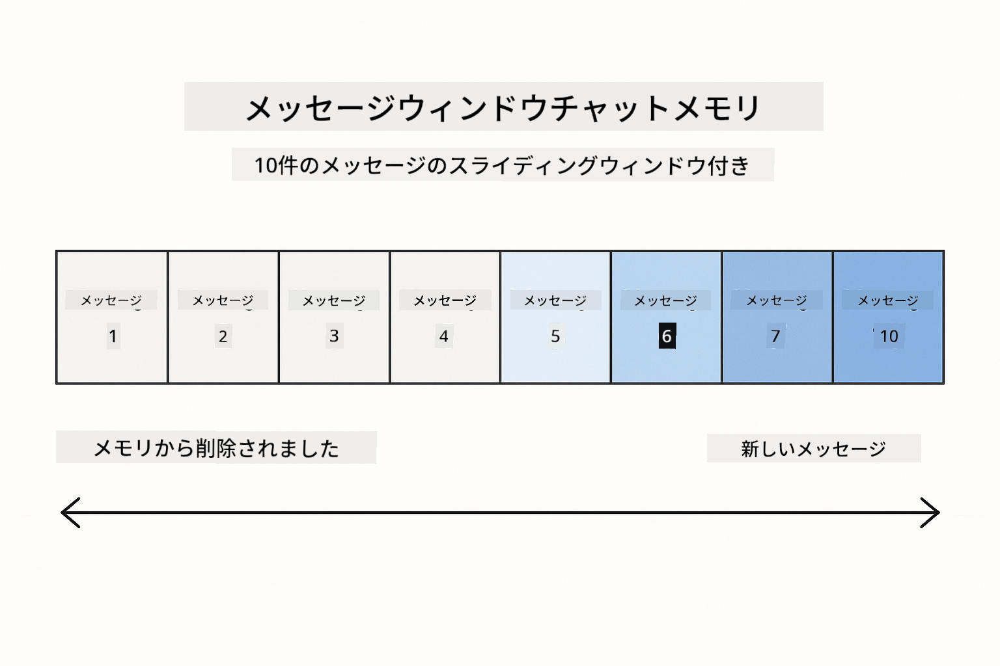
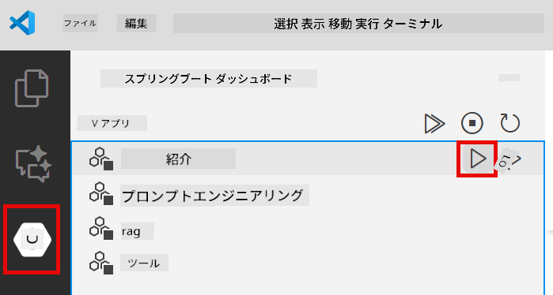
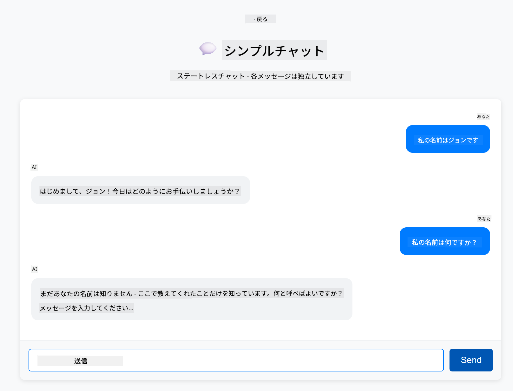
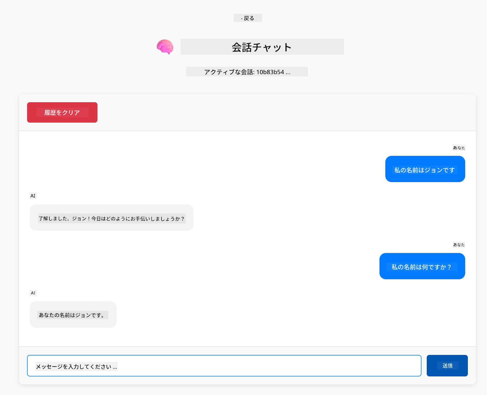

<!--
CO_OP_TRANSLATOR_METADATA:
{
  "original_hash": "c3e07ca58d0b8a3f47d3bf5728541e0a",
  "translation_date": "2025-12-13T13:16:58+00:00",
  "source_file": "01-introduction/README.md",
  "language_code": "ja"
}
-->
# Module 01: LangChain4jのはじめ方

## 目次

- [学習内容](../../../01-introduction)
- [前提条件](../../../01-introduction)
- [コア問題の理解](../../../01-introduction)
- [トークンの理解](../../../01-introduction)
- [メモリの仕組み](../../../01-introduction)
- [LangChain4jの利用方法](../../../01-introduction)
- [Azure OpenAIインフラのデプロイ](../../../01-introduction)
- [ローカルでのアプリケーション実行](../../../01-introduction)
- [アプリケーションの使い方](../../../01-introduction)
  - [ステートレスチャット（左パネル）](../../../01-introduction)
  - [ステートフルチャット（右パネル）](../../../01-introduction)
- [次のステップ](../../../01-introduction)

## 学習内容

クイックスタートを完了した場合、プロンプトを送信して応答を得る方法を見たはずです。これは基礎ですが、本格的なアプリケーションにはそれ以上のものが必要です。このモジュールでは、コンテキストを記憶し状態を維持する会話型AIの構築方法を学びます。これは単発のデモと本番対応アプリケーションの違いです。

このガイド全体でAzure OpenAIのGPT-5を使用します。高度な推論能力により、異なるパターンの挙動がより明確にわかるためです。メモリを追加すると、その違いがはっきり見えます。これにより、各コンポーネントがアプリケーションに何をもたらすか理解しやすくなります。

以下の2つのパターンを示すアプリケーションを構築します：

**ステートレスチャット** - 各リクエストは独立しています。モデルは前のメッセージを記憶しません。これはクイックスタートで使ったパターンです。

**ステートフル会話** - 各リクエストに会話履歴が含まれます。モデルは複数ターンにわたりコンテキストを維持します。これが本番アプリケーションに必要なものです。

## 前提条件

- Azure OpenAIアクセス付きAzureサブスクリプション
- Java 21、Maven 3.9+
- Azure CLI (https://learn.microsoft.com/en-us/cli/azure/install-azure-cli)
- Azure Developer CLI (azd) (https://learn.microsoft.com/en-us/azure/developer/azure-developer-cli/install-azd)

> **注意:** Java、Maven、Azure CLI、Azure Developer CLI (azd) は提供されるdevcontainerに事前インストールされています。

> **注意:** このモジュールはAzure OpenAIのGPT-5を使用します。デプロイは`azd up`で自動設定されるため、コード内のモデル名は変更しないでください。

## コア問題の理解

言語モデルはステートレスです。各API呼び出しは独立しています。「私の名前はジョンです」と送信し、その後「私の名前は何ですか？」と尋ねても、モデルは自己紹介したことを知りません。すべてのリクエストを初めての会話のように扱います。

これは単純なQ&Aには問題ありませんが、本格的なアプリケーションには役に立ちません。カスタマーサービスボットはユーザーが伝えた内容を覚えている必要があります。パーソナルアシスタントはコンテキストが必要です。複数ターンの会話にはメモリが不可欠です。


*ステートレス（独立した呼び出し）とステートフル（コンテキスト認識）会話の違い*

## トークンの理解

会話に入る前に、トークンの理解が重要です。トークンは言語モデルが処理するテキストの基本単位です：


*テキストがどのようにトークンに分割されるかの例 - "I love AI!" は4つの処理単位になる*

トークンはAIモデルがテキストを測定・処理する単位です。単語、句読点、スペースもトークンになり得ます。モデルには一度に処理できるトークン数の上限があります（GPT-5は最大400,000トークン、入力最大272,000トークン、出力最大128,000トークン）。トークンの理解は会話の長さやコスト管理に役立ちます。

## メモリの仕組み

チャットメモリはステートレス問題を解決し、会話履歴を維持します。リクエストをモデルに送る前に、フレームワークが関連する過去のメッセージを先頭に付加します。「私の名前は何ですか？」と尋ねると、実際には会話履歴全体が送信され、モデルは「私の名前はジョンです」と言ったことを認識できます。

LangChain4jはこれを自動で処理するメモリ実装を提供します。保持するメッセージ数を選択し、フレームワークがコンテキストウィンドウを管理します。



*MessageWindowChatMemoryは最近のメッセージのスライディングウィンドウを維持し、古いものを自動的に削除*

## LangChain4jの利用方法

このモジュールはクイックスタートを拡張し、Spring Bootと会話メモリを統合します。構成は以下の通りです：

**依存関係** - 2つのLangChain4jライブラリを追加：

```xml
<dependency>
    <groupId>dev.langchain4j</groupId>
    <artifactId>langchain4j</artifactId> <!-- Inherited from BOM in root pom.xml -->
</dependency>
<dependency>
    <groupId>dev.langchain4j</groupId>
    <artifactId>langchain4j-open-ai-official</artifactId> <!-- Inherited from BOM in root pom.xml -->
</dependency>
```

**チャットモデル** - Azure OpenAIをSpring Beanとして設定 ([LangChainConfig.java](../../../01-introduction/src/main/java/com/example/langchain4j/config/LangChainConfig.java))：

```java
@Bean
public OpenAiOfficialChatModel openAiOfficialChatModel() {
    return OpenAiOfficialChatModel.builder()
            .baseUrl(azureEndpoint)
            .apiKey(azureApiKey)
            .modelName(deploymentName)
            .timeout(Duration.ofMinutes(5))
            .maxRetries(3)
            .build();
}
```

ビルダーは`azd up`で設定された環境変数から認証情報を読み込みます。`baseUrl`をAzureエンドポイントに設定することで、OpenAIクライアントがAzure OpenAIと連携します。

**会話メモリ** - MessageWindowChatMemoryでチャット履歴を追跡 ([ConversationService.java](../../../01-introduction/src/main/java/com/example/langchain4j/service/ConversationService.java))：

```java
ChatMemory memory = MessageWindowChatMemory.withMaxMessages(10);

memory.add(UserMessage.from("My name is John"));
memory.add(AiMessage.from("Nice to meet you, John!"));

memory.add(UserMessage.from("What's my name?"));
AiMessage aiMessage = chatModel.chat(memory.messages()).aiMessage();
memory.add(aiMessage);
```

`withMaxMessages(10)`で直近10メッセージを保持するメモリを作成。ユーザーとAIのメッセージは型付きラッパー`UserMessage.from(text)`、`AiMessage.from(text)`で追加。`memory.messages()`で履歴を取得しモデルに送信。サービスは会話IDごとに別々のメモリインスタンスを保持し、複数ユーザーの同時チャットを可能にします。

> **🤖 GitHub Copilot Chatで試す:** [`ConversationService.java`](../../../01-introduction/src/main/java/com/example/langchain4j/service/ConversationService.java)を開き、以下を質問してみてください：
> - 「MessageWindowChatMemoryはウィンドウが満杯のときどのメッセージを削除するかどう決めているの？」
> - 「インメモリではなくデータベースを使ったカスタムメモリストレージを実装できる？」
> - 「古い会話履歴を圧縮する要約機能をどう追加する？」

ステートレスチャットのエンドポイントはメモリを使わず、クイックスタート同様に`chatModel.chat(prompt)`だけです。ステートフルエンドポイントはメッセージをメモリに追加し履歴を取得、各リクエストにそのコンテキストを含めます。同じモデル設定で異なるパターンを実現しています。

## Azure OpenAIインフラのデプロイ

**Bash:**
```bash
cd 01-introduction
azd up  # サブスクリプションと場所を選択してください（eastus2推奨）
```

**PowerShell:**
```powershell
cd 01-introduction
azd up  # サブスクリプションと場所を選択してください（eastus2推奨）
```

> **注意:** タイムアウトエラー（`RequestConflict: Cannot modify resource ... provisioning state is not terminal`）が発生した場合は、単に`azd up`を再実行してください。Azureリソースはバックグラウンドでまだプロビジョニング中の可能性があり、再試行でリソースが最終状態に達した際にデプロイが完了します。

これにより：
1. GPT-5とtext-embedding-3-smallモデルを含むAzure OpenAIリソースをデプロイ
2. プロジェクトルートに認証情報入りの`.env`ファイルを自動生成
3. 必要な環境変数をすべて設定

**デプロイに問題がある場合**は、[Infrastructure README](infra/README.md)を参照してください。サブドメイン名の競合、Azureポータルでの手動デプロイ手順、モデル設定のガイダンスなど詳細なトラブルシューティングがあります。

**デプロイ成功の確認：**

**Bash:**
```bash
cat ../.env  # AZURE_OPENAI_ENDPOINT、API_KEYなどを表示する必要があります。
```

**PowerShell:**
```powershell
Get-Content ..\.env  # AZURE_OPENAI_ENDPOINT、API_KEYなどを表示する必要があります。
```

> **注意:** `azd up`コマンドは`.env`ファイルを自動生成します。後で更新が必要な場合は、手動で編集するか、以下のコマンドで再生成できます：
>
> **Bash:**
> ```bash
> cd ..
> bash .azd-env.sh
> ```
>
> **PowerShell:**
> ```powershell
> cd ..
> .\.azd-env.ps1
> ```

## ローカルでのアプリケーション実行

**デプロイ確認：**

Azure認証情報が入った`.env`ファイルがルートディレクトリに存在することを確認：

**Bash:**
```bash
cat ../.env  # AZURE_OPENAI_ENDPOINT、API_KEY、DEPLOYMENTを表示する必要があります
```

**PowerShell:**
```powershell
Get-Content ..\.env  # AZURE_OPENAI_ENDPOINT、API_KEY、DEPLOYMENTを表示する必要があります
```

**アプリケーション起動：**

**オプション1: Spring Boot Dashboardを使用（VS Codeユーザー推奨）**

devcontainerにはSpring Boot Dashboard拡張機能が含まれており、すべてのSpring Bootアプリケーションを視覚的に管理できます。VS Codeの左側のアクティビティバーにあるSpring Bootアイコンからアクセス可能です。

Spring Boot Dashboardでは：
- ワークスペース内のすべてのSpring Bootアプリケーションを一覧表示
- ワンクリックでアプリケーションの起動/停止
- リアルタイムでログを表示
- アプリケーションの状態を監視

「introduction」の横にある再生ボタンをクリックしてこのモジュールを起動、またはすべてのモジュールを一括起動できます。



**オプション2: シェルスクリプトを使用**

すべてのWebアプリケーション（モジュール01-04）を起動：

**Bash:**
```bash
cd ..  # ルートディレクトリから
./start-all.sh
```

**PowerShell:**
```powershell
cd ..  # ルートディレクトリから
.\start-all.ps1
```

またはこのモジュールだけ起動：

**Bash:**
```bash
cd 01-introduction
./start.sh
```

**PowerShell:**
```powershell
cd 01-introduction
.\start.ps1
```

両スクリプトはルートの`.env`ファイルから環境変数を自動読み込みし、JARがなければビルドします。

> **注意:** 起動前にすべてのモジュールを手動でビルドしたい場合：
>
> **Bash:**
> ```bash
> cd ..  # Go to root directory
> mvn clean package -DskipTests
> ```
>
> **PowerShell:**
> ```powershell
> cd ..  # Go to root directory
> mvn clean package -DskipTests
> ```

ブラウザで http://localhost:8080 を開いてください。

**停止するには：**

**Bash:**
```bash
./stop.sh  # このモジュールのみ
# または
cd .. && ./stop-all.sh  # すべてのモジュール
```

**PowerShell:**
```powershell
.\stop.ps1  # このモジュールのみ
# または
cd ..; .\stop-all.ps1  # すべてのモジュール
```

## アプリケーションの使い方

アプリケーションは2つのチャット実装を並べて表示するWebインターフェースを提供します。


*シンプルチャット（ステートレス）と会話チャット（ステートフル）の両方を示すダッシュボード*

### ステートレスチャット（左パネル）

まずはこちらを試してください。「私の名前はジョンです」と言い、その直後に「私の名前は何ですか？」と尋ねてみてください。モデルは覚えていません。各メッセージが独立しているためです。これは基本的な言語モデル統合のコア問題を示しています - 会話コンテキストがないこと。



*AIは前のメッセージから名前を覚えていません*

### ステートフルチャット（右パネル）

同じ順序でこちらを試してください。「私の名前はジョンです」と言い、その後「私の名前は何ですか？」と尋ねると、今回は覚えています。違いはMessageWindowChatMemoryです。会話履歴を維持し、各リクエストに含めています。これが本番の会話型AIの動作です。



*AIは会話の初めに言った名前を覚えています*

両パネルは同じGPT-5モデルを使用しています。違いはメモリだけです。これにより、メモリがアプリケーションに何をもたらし、実際のユースケースでなぜ不可欠かが明確になります。

## 次のステップ

**次のモジュール:** [02-prompt-engineering - GPT-5によるプロンプトエンジニアリング](../02-prompt-engineering/README.md)

---

**ナビゲーション:** [← 前へ: Module 00 - クイックスタート](../00-quick-start/README.md) | [メインへ戻る](../README.md) | [次へ: Module 02 - プロンプトエンジニアリング →](../02-prompt-engineering/README.md)

---

<!-- CO-OP TRANSLATOR DISCLAIMER START -->
**免責事項**：  
本書類はAI翻訳サービス「Co-op Translator」（https://github.com/Azure/co-op-translator）を使用して翻訳されました。正確性の向上に努めておりますが、自動翻訳には誤りや不正確な部分が含まれる可能性があります。原文の言語による文書が正式な情報源とみなされるべきです。重要な情報については、専門の人間による翻訳を推奨します。本翻訳の利用により生じたいかなる誤解や誤訳についても、当方は責任を負いかねます。
<!-- CO-OP TRANSLATOR DISCLAIMER END -->