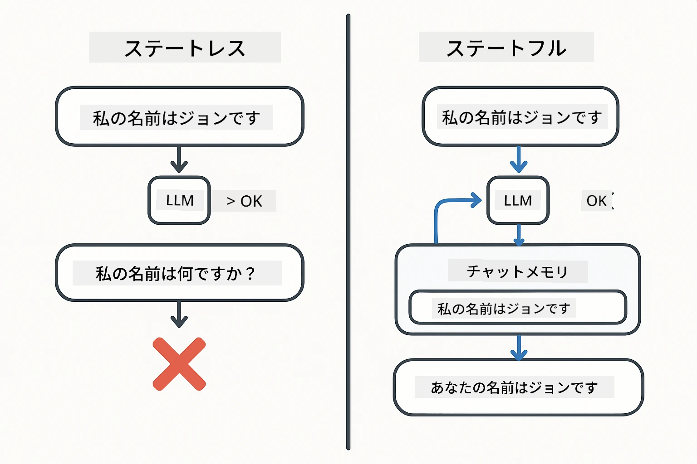
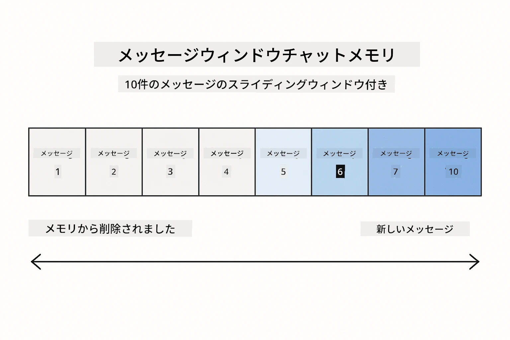
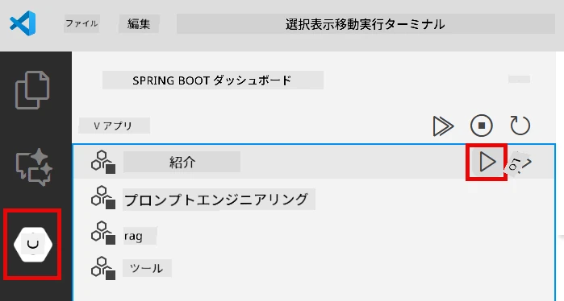
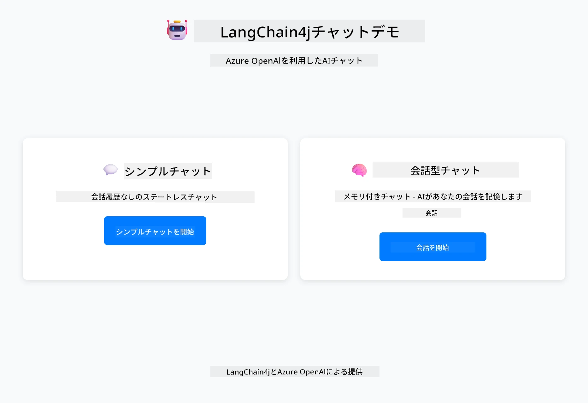
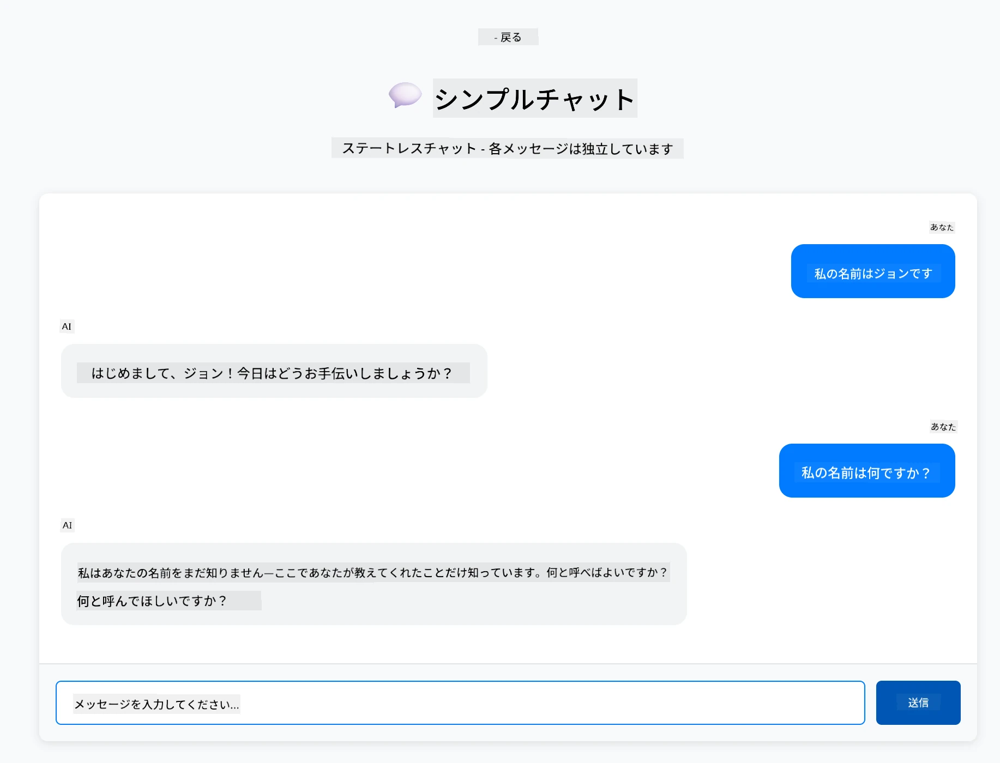
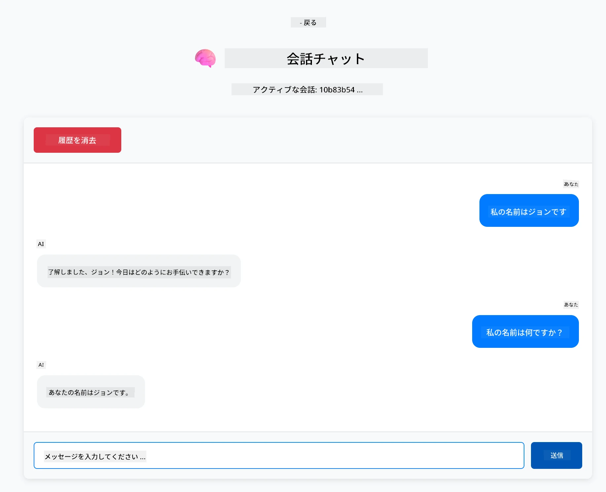

# Module 01: LangChain4j のはじめ方

## 目次

- [動画ウォークスルー](#動画ウォークスルー)
- [学習内容](#学習内容)
- [前提条件](#前提条件)
- [コア問題の理解](#コア問題の理解)
- [トークンの理解](#トークンの理解)
- [メモリの仕組み](#メモリの仕組み)
- [LangChain4j の使用方法](#langchain4j-の使用方法)
- [Azure OpenAI インフラの展開](#azure-openai-インフラの展開)
- [ローカルでアプリケーションを実行する](#ローカルでアプリケーションを実行する)
- [アプリケーションの使用方法](#アプリケーションの使用方法)
  - [ステートレスチャット（左パネル）](#ステートレスチャット（左パネル）)
  - [ステートフルチャット（右パネル）](#ステートフルチャット（右パネル）)
- [次のステップ](#次のステップ)

## 動画ウォークスルー

このモジュールの始め方を説明するライブセッションを見る：

<a href="https://www.youtube.com/live/nl_troDm8rQ?si=6b85S8xGjWnT2fX9"></a>

## 学習内容

これは LangChain4j と Azure OpenAI の出発点です。基本から始めて、本格的なアプリケーションを構築していきます。このモジュールは、会話の文脈を覚え状態を維持する対話型AIに焦点を当てており、後のすべてのモジュールで基盤となる概念です。

このガイド全体で Azure OpenAI の GPT-5.2 を使用します。高度な推論機能により、異なるパターンの挙動の違いが明確になるためです。メモリを追加すると、その違いがはっきり分かります。これにより、それぞれのコンポーネントがアプリケーションにもたらす効果を理解しやすくなります。

両方のパターンを示すアプリケーションを1つ作成します：

<strong>ステートレスチャット</strong> - 各リクエストは独立しています。モデルは前のメッセージを覚えていません。最もシンプルな出発点です。

<strong>ステートフル会話</strong> - 各リクエストに会話履歴が含まれます。モデルは複数ターンにわたって文脈を維持します。これは本番アプリケーションで必須です。

## 前提条件

- Azure OpenAI アクセスがある Azure サブスクリプション
- Java 21、Maven 3.9+
- Azure CLI (https://learn.microsoft.com/en-us/cli/azure/install-azure-cli)
- Azure Developer CLI (azd) (https://learn.microsoft.com/en-us/azure/developer/azure-developer-cli/install-azd)

> **Note:** Java、Maven、Azure CLI、Azure Developer CLI (azd) は提供される devcontainer に事前にインストールされています。

> **Note:** 本モジュールは Azure OpenAI の GPT-5.2 を使用します。展開は `azd up` により自動設定されます。コード内のモデル名を変更しないでください。

## コア問題の理解

言語モデルはステートレス（状態を持たない）です。各API呼び出しは独立しています。「私の名前はジョンです」と送ってから「私の名前は何ですか？」と尋ねても、モデルは自己紹介した直後だとは認識しません。すべてのリクエストを、今までで初めての会話だと扱います。

これは簡単なQ&Aには使えますが、本格的なアプリケーションには役に立ちません。カスタマーサポートのボットはあなたが何を言ったか覚える必要があります。パーソナルアシスタントは文脈を必要とします。複数ターンの対話にはメモリが不可欠です。

下図は両者の対比です — 左は名前を忘れるステートレス呼び出し、右はChatMemoryで名前を覚えているステートフル呼び出しです。



*ステートレス（独立呼び出し）とステートフル（文脈認識）会話の違い*

## トークンの理解

会話に入る前に、トークンを理解することが重要です。トークンは言語モデルが処理するテキストの基本単位です：


*テキストがトークンに分解される例 — 「I love AI!」は4つの別々の処理単位になる*

トークンはAIモデルがテキストを計測・処理する単位です。単語、句読点、スペースもトークンになり得ます。モデルには一度に処理できるトークン数の上限があり（GPT-5.2では40万トークン、入力最大27.2万トークン＋出力最大12.8万トークン）、トークンを理解することは会話の長さとコスト管理に役立ちます。

## メモリの仕組み

チャットメモリは、ステートレス問題を解決し会話履歴を保持します。リクエストをモデルに送る前に、フレームワークは関連する過去のメッセージを先頭に付け加えます。「私の名前は何ですか？」と聞くと、実際には全会話履歴が送られ、モデルは「私の名前はジョンです」と以前に言ったことを見られます。

LangChain4j は、この処理を自動化するメモリ実装を提供します。保持するメッセージ数を選択でき、フレームワークがコンテキストウィンドウを管理します。下図は MessageWindowChatMemory が最近のメッセージのスライディングウィンドウを維持する様子です。



*MessageWindowChatMemory は最近のメッセージのスライドウィンドウを管理し、古いメッセージを自動的に破棄する*

## LangChain4j の使用方法

このモジュールは Spring Boot と会話メモリを統合しています。構成は以下の通りです：

<strong>依存関係</strong> — 2つの LangChain4j ライブラリを追加：

```xml
<dependency>
    <groupId>dev.langchain4j</groupId>
    <artifactId>langchain4j</artifactId> <!-- Inherited from BOM in root pom.xml -->
</dependency>
<dependency>
    <groupId>dev.langchain4j</groupId>
    <artifactId>langchain4j-open-ai-official</artifactId> <!-- Inherited from BOM in root pom.xml -->
</dependency>
```

<strong>チャットモデル</strong> — Azure OpenAI を Spring Bean として設定 ([LangChainConfig.java](../../../01-introduction/src/main/java/com/example/langchain4j/config/LangChainConfig.java))：

```java
@Bean
public OpenAiOfficialChatModel openAiOfficialChatModel() {
    return OpenAiOfficialChatModel.builder()
            .baseUrl(azureEndpoint)
            .apiKey(azureApiKey)
            .modelName(deploymentName)
            .timeout(Duration.ofMinutes(5))
            .maxRetries(3)
            .build();
}
```

ビルダーは `azd up` によって設定された環境変数から認証情報を読み取ります。`baseUrl` に Azure エンドポイントを設定することで、OpenAI クライアントが Azure OpenAI に対応します。

<strong>会話メモリ</strong> — MessageWindowChatMemory でチャット履歴を追跡 ([ConversationService.java](../../../01-introduction/src/main/java/com/example/langchain4j/service/ConversationService.java))：

```java
ChatMemory memory = MessageWindowChatMemory.withMaxMessages(10);

memory.add(UserMessage.from("My name is John"));
memory.add(AiMessage.from("Nice to meet you, John!"));

memory.add(UserMessage.from("What's my name?"));
AiMessage aiMessage = chatModel.chat(memory.messages()).aiMessage();
memory.add(aiMessage);
```

`withMaxMessages(10)` で直近10メッセージを保持するメモリを作成。ユーザー・AIメッセージは型付きラッパーで追加：`UserMessage.from(text)` と `AiMessage.from(text)`。`memory.messages()` で履歴を取得しモデルに渡します。サービスは会話IDごとにメモリを分けて保持するため、複数ユーザーの同時会話が可能です。

> **🤖 [GitHub Copilot](https://github.com/features/copilot) Chat も活用してみましょう：** [`ConversationService.java`](../../../01-introduction/src/main/java/com/example/langchain4j/service/ConversationService.java) を開き、以下を質問：
> - 「MessageWindowChatMemory はウィンドウが満杯の時にどのメッセージを破棄するかどう決めているの？」
> - 「インメモリではなくデータベースを使ったカスタムメモリストレージを実装できる？」
> - 「古い会話履歴を圧縮するために要約を追加するにはどうする？」

ステートレスチャットのエンドポイントはメモリを使わず、`chatModel.chat(prompt)` のみでクイックスタートと同様です。ステートフルはメモリにメッセージを追加し履歴を取得、毎回その文脈をリクエストに含めます。同じモデル設定で異なるパターンを体験できます。

## Azure OpenAI インフラの展開

**Bash:**
```bash
cd 01-introduction
azd up  # サブスクリプションと場所を選択します（eastus2推奨）
```

**PowerShell:**
```powershell
cd 01-introduction
azd up  # サブスクリプションと場所を選択してください（eastus2推奨）
```

> **Note:** タイムアウトエラー (`RequestConflict: Cannot modify resource ... provisioning state is not terminal`) が起きても、`azd up` を再度実行してください。Azure リソースはまだ展開中かもしれず、再試行でリソースが最終状態に到達すれば展開が完了します。

これにより：
1. GPT-5.2 と text-embedding-3-small モデルを持つ Azure OpenAI リソースを展開
2. プロジェクトルートに資格情報入りの `.env` ファイルが自動生成
3. 必要な環境変数がすべて設定される

**展開に問題がありますか？** サブドメイン名の競合、Azure ポータル手動展開手順、モデル構成ガイダンスなど詳しいトラブルシューティングは [Infrastructure README](infra/README.md) を参照してください。

**展開が成功したか確認：**

**Bash:**
```bash
cat ../.env  # AZURE_OPENAI_ENDPOINT、API_KEYなどを表示する必要があります。
```

**PowerShell:**
```powershell
Get-Content ..\.env  # AZURE_OPENAI_ENDPOINT、API_KEY などを表示する必要があります。
```

> **Note:** `azd up` コマンドは `.env` ファイルを自動生成します。後から更新する必要があれば、手動で編集するか以下のコマンドで再生成できます：
>
> **Bash:**
> ```bash
> cd ..
> bash .azd-env.sh
> ```
>
> **PowerShell:**
> ```powershell
> cd ..
> .\.azd-env.ps1
> ```

## ローカルでアプリケーションを実行する

**展開の検証：**

Azure資格情報が入った `.env` ファイルがルートにあることを確認し、モジュールディレクトリ（`01-introduction/`）から以下を実行：

**Bash:**
```bash
cat ../.env  # AZURE_OPENAI_ENDPOINT、API_KEY、DEPLOYMENTを表示する必要があります
```

**PowerShell:**
```powershell
Get-Content ..\.env  # AZURE_OPENAI_ENDPOINT、API_KEY、DEPLOYMENT を表示する必要があります
```

**アプリケーションを起動：**

**オプション1：Spring Boot ダッシュボードを使用（VS Codeユーザー推奨）**

開発コンテナには Spring Boot ダッシュボード拡張機能が含まれており、VS Code 左のアクティビティバーの Spring Boot アイコンから全Spring Bootアプリケーションを視覚的に管理できます。

ダッシュボードからは：
- ワークスペース内のすべてのSpring Bootアプリケーションを一覧表示
- ワンクリックでアプリの起動/停止
- リアルタイムでアプリケーションログを閲覧
- アプリの状態を監視

「introduction」の横の再生ボタンを押せばこのモジュールが起動、またはすべてのモジュールを同時に起動できます。



*VS Code の Spring Boot ダッシュボード — 一箇所から全モジュールを起動・停止・監視*

**オプション2：シェルスクリプトを使う方法**

すべてのウェブアプリ（モジュール01-04）を起動：

**Bash:**
```bash
cd ..  # ルートディレクトリから
./start-all.sh
```

**PowerShell:**
```powershell
cd ..  # ルートディレクトリから
.\start-all.ps1
```

または、このモジュールだけを起動：

**Bash:**
```bash
cd 01-introduction
./start.sh
```

**PowerShell:**
```powershell
cd 01-introduction
.\start.ps1
```

いずれのスクリプトもルートの `.env` ファイルから環境変数を自動で読み込み、JARが無ければビルドします。

> **Note:** もし、起動前にすべてのモジュールを手動でビルドしたい場合：
>
> **Bash:**
> ```bash
> cd ..  # Go to root directory
> mvn clean package -DskipTests
> ```
>
> **PowerShell:**
> ```powershell
> cd ..  # Go to root directory
> mvn clean package -DskipTests
> ```

ブラウザで http://localhost:8080 を開いてください。

**停止するには：**

**Bash:**
```bash
./stop.sh  # このモジュールのみ
# または
cd .. && ./stop-all.sh  # すべてのモジュール
```

**PowerShell:**
```powershell
.\stop.ps1  # このモジュールのみ
# または
cd ..; .\stop-all.ps1  # すべてのモジュール
```

## アプリケーションの使用方法

このアプリには2種類のチャット実装が並んで表示されるウェブインターフェイスがあります。



*シンプルチャット（ステートレス）と会話チャット（ステートフル）を両方表示するダッシュボード*

### ステートレスチャット（左パネル）

まずはこちらを試してください。「私の名前はジョンです」と言い、すぐに「私の名前は何ですか？」と尋ねると、モデルは記憶していません。メッセージは独立しているためです。これは基本的な言語モデル統合におけるコア問題を示しています — 会話文脈が無いこと。



*AIは前のメッセージから名前を覚えません*

### ステートフルチャット（右パネル）

同じ順番をこちらで試してください。「私の名前はジョンです」と言い、そのあと「私の名前は何ですか？」と言うと、今回は覚えています。違いは MessageWindowChatMemory で、会話履歴を保持し、毎回のリクエストに含めています。これが本番用の会話型AIの仕組みです。



*AIは以前の会話から名前を覚えています*

両パネルは同じ GPT-5.2 モデルを使用し、違いはメモリだけです。これによりメモリがアプリケーションに何をもたらすかが明確になり、実際のユースケースで不可欠な理由が理解できます。

## 次のステップ

**次のモジュール:** [02-prompt-engineering - GPT-5.2によるプロンプトエンジニアリング](../02-prompt-engineering/README.md)

---

**ナビゲーション:** [← メインへ戻る](../README.md) | [次へ: Module 02 - Prompt Engineering →](../02-prompt-engineering/README.md)

---

<!-- CO-OP TRANSLATOR DISCLAIMER START -->
**免責事項**：
本書類は AI 翻訳サービス [Co-op Translator](https://github.com/Azure/co-op-translator) を使用して翻訳されています。正確性を期していますが、自動翻訳には誤りや不正確な部分が含まれる可能性があることをご承知おきください。原文の原語版が正式な情報源とみなされるべきです。重要な情報については、専門の人間による翻訳を推奨します。本翻訳の利用により生じたいかなる誤解や解釈違いについても、当方は責任を負いかねます。
<!-- CO-OP TRANSLATOR DISCLAIMER END -->