<!--
CO_OP_TRANSLATOR_METADATA:
{
  "original_hash": "8d787826cad7e92bf5cdbd116b1e6116",
  "translation_date": "2025-12-13T15:55:30+00:00",
  "source_file": "02-prompt-engineering/README.md",
  "language_code": "ja"
}
-->
# Module 02: GPT-5によるプロンプトエンジニアリング

## 目次

- [学習内容](../../../02-prompt-engineering)
- [前提条件](../../../02-prompt-engineering)
- [プロンプトエンジニアリングの理解](../../../02-prompt-engineering)
- [LangChain4jの利用方法](../../../02-prompt-engineering)
- [コアパターン](../../../02-prompt-engineering)
- [既存のAzureリソースの利用](../../../02-prompt-engineering)
- [アプリケーションのスクリーンショット](../../../02-prompt-engineering)
- [パターンの探求](../../../02-prompt-engineering)
  - [低い意欲 vs 高い意欲](../../../02-prompt-engineering)
  - [タスク実行（ツールの前置き）](../../../02-prompt-engineering)
  - [自己反省コード](../../../02-prompt-engineering)
  - [構造化分析](../../../02-prompt-engineering)
  - [マルチターンチャット](../../../02-prompt-engineering)
  - [ステップバイステップ推論](../../../02-prompt-engineering)
  - [制約付き出力](../../../02-prompt-engineering)
- [本当に学んでいること](../../../02-prompt-engineering)
- [次のステップ](../../../02-prompt-engineering)

## 学習内容

前のモジュールでは、メモリが会話型AIを可能にする仕組みを見て、GitHub Modelsを使った基本的な対話を体験しました。今回は、Azure OpenAIのGPT-5を使って質問の仕方、つまりプロンプト自体に焦点を当てます。プロンプトの構造が応答の質に大きく影響します。

GPT-5を使う理由は、推論制御が導入されているためです。モデルに回答前にどれだけ考えるか指示できるので、異なるプロンプト戦略がより明確になり、それぞれの使いどころが理解しやすくなります。また、AzureのGPT-5はGitHub Modelsよりもレート制限が緩い利点もあります。

## 前提条件

- モジュール01を完了していること（Azure OpenAIリソースがデプロイ済み）
- ルートディレクトリにAzure認証情報を含む`.env`ファイルがあること（モジュール01の`azd up`で作成）

> **注意:** モジュール01を完了していない場合は、まずそちらのデプロイ手順に従ってください。

## プロンプトエンジニアリングの理解

プロンプトエンジニアリングとは、必要な結果を一貫して得るための入力テキスト設計のことです。単に質問するだけでなく、モデルが何をどう返すべきか正確に理解できるようにリクエストを構造化することです。

同僚に指示を出すのに例えると、「バグを直して」では曖昧です。「UserService.javaの45行目のヌルポインタ例外をヌルチェックを追加して修正して」と具体的に伝えるのと同じです。言語モデルも同様で、具体性と構造が重要です。

## LangChain4jの利用方法

このモジュールでは、前のモジュールと同じLangChain4jの基盤を使いながら、プロンプト構造と推論制御に焦点を当てた高度なプロンプトパターンを示します。


*LangChain4jがプロンプトをAzure OpenAI GPT-5に接続する仕組み*

**依存関係** - モジュール02では`pom.xml`に定義された以下のlangchain4j依存関係を使用します：
```xml
<dependency>
    <groupId>dev.langchain4j</groupId>
    <artifactId>langchain4j</artifactId> <!-- Inherited from BOM in root pom.xml -->
</dependency>
<dependency>
    <groupId>dev.langchain4j</groupId>
    <artifactId>langchain4j-open-ai-official</artifactId> <!-- Inherited from BOM in root pom.xml -->
</dependency>
```

**OpenAiOfficialChatModelの設定** - [LangChainConfig.java](../../../02-prompt-engineering/src/main/java/com/example/langchain4j/prompts/config/LangChainConfig.java)

チャットモデルはOpenAI公式クライアントを使い、Azure OpenAIエンドポイントに対応したSpring Beanとして手動設定しています。モジュール01との主な違いは、モデル設定ではなく`chatModel.chat()`に渡すプロンプトの構造です。

**SystemMessageとUserMessage** - [Gpt5PromptService.java](../../../02-prompt-engineering/src/main/java/com/example/langchain4j/prompts/service/Gpt5PromptService.java)

LangChain4jはメッセージタイプを分けて明確にしています。`SystemMessage`はAIの振る舞いやコンテキスト（例：「あなたはコードレビュアーです」）を設定し、`UserMessage`は実際のリクエストを含みます。この分離により、異なるユーザーの問い合わせでも一貫したAIの振る舞いを維持できます。

```java
SystemMessage systemMsg = SystemMessage.from(
    "You are a helpful Java programming expert."
);

UserMessage userMsg = UserMessage.from(
    "Explain what a List is in Java"
);

String response = chatModel.chat(systemMsg, userMsg);
```

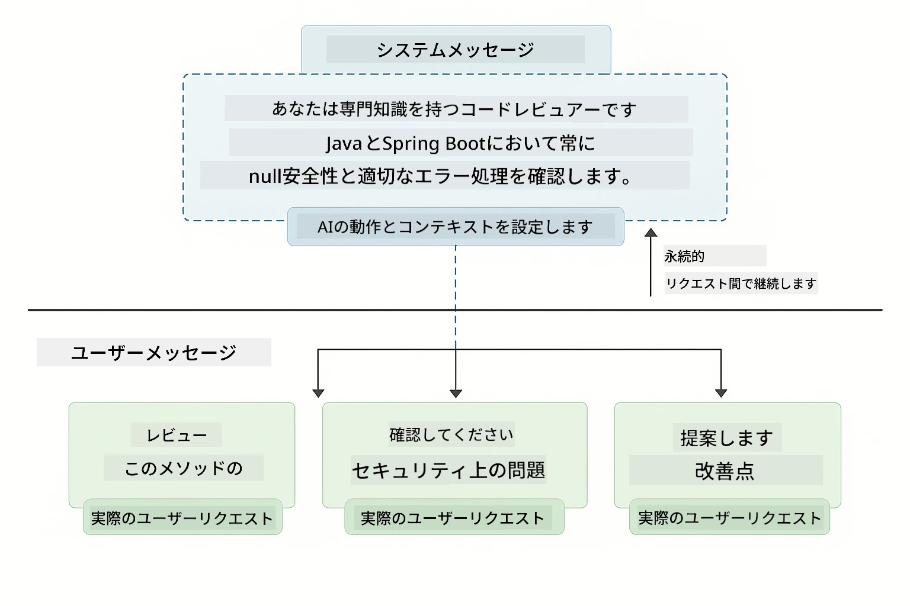

*SystemMessageは永続的なコンテキストを提供し、UserMessageは個別のリクエストを含む*

**マルチターン用MessageWindowChatMemory** - マルチターン会話パターンでは、モジュール01の`MessageWindowChatMemory`を再利用します。各セッションは`Map<String, ChatMemory>`に独自のメモリインスタンスを持ち、複数の会話が混ざらずに同時進行可能です。

**プロンプトテンプレート** - 本モジュールの本質はプロンプトエンジニアリングであり、新しいLangChain4j APIではありません。各パターン（低意欲、高意欲、タスク実行など）は同じ`chatModel.chat(prompt)`メソッドを使い、XMLタグや指示、フォーマットを含むプロンプト文字列を慎重に構築しています。これらはLangChain4jの機能ではなく、プロンプトテキストの一部です。

**推論制御** - GPT-5の推論努力は「最大2ステップ推論」や「徹底的に探る」などのプロンプト指示で制御します。これはLangChain4jの設定ではなく、プロンプトエンジニアリングの技術です。ライブラリは単にプロンプトをモデルに渡す役割を果たします。

重要なポイント：LangChain4jはインフラ（[LangChainConfig.java](../../../02-prompt-engineering/src/main/java/com/example/langchain4j/prompts/config/LangChainConfig.java)によるモデル接続、[Gpt5PromptService.java](../../../02-prompt-engineering/src/main/java/com/example/langchain4j/prompts/service/Gpt5PromptService.java)によるメモリ・メッセージ処理）を提供し、このモジュールはその中で効果的なプロンプトの作り方を教えます。

## コアパターン

すべての問題に同じアプローチが必要なわけではありません。簡単な質問には素早い回答が必要で、複雑な問題には深い思考が求められます。可視化された推論が必要な場合もあれば、結果だけでよい場合もあります。本モジュールでは8つのプロンプトパターンを扱い、それぞれ異なるシナリオに最適化されています。すべて試して、どのアプローチがいつ効果的か学びましょう。

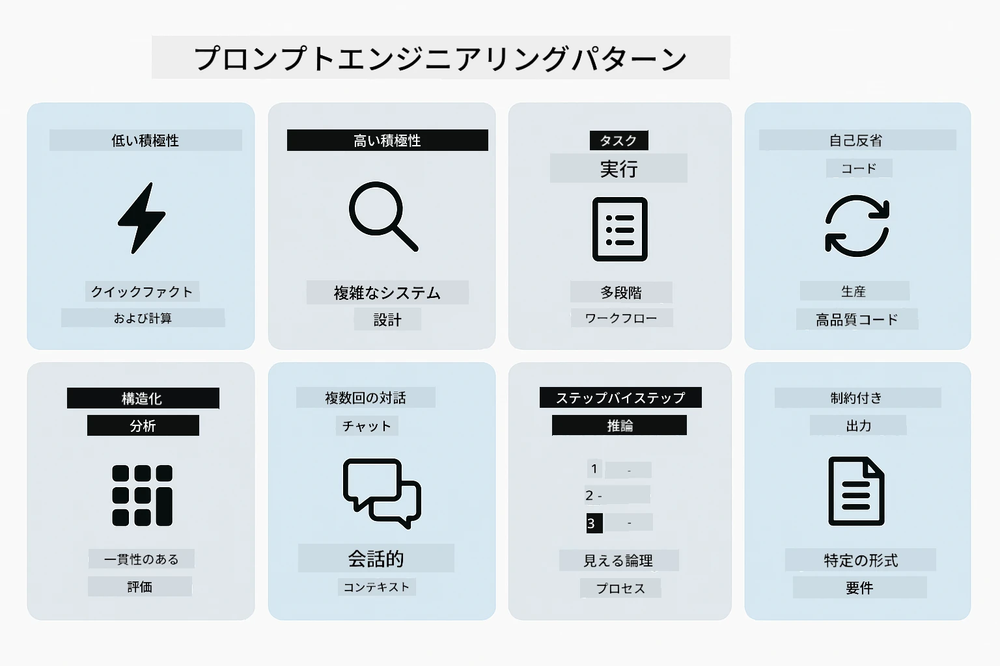

*8つのプロンプトエンジニアリングパターンとそのユースケースの概要*

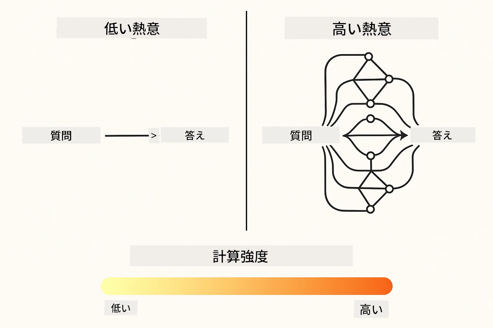

*低意欲（速く直接的）vs 高意欲（徹底的で探求的）な推論アプローチの比較*

**低意欲（迅速かつ焦点を絞った）** - 簡単な質問で速く直接的な回答が欲しい場合。モデルは最小限の推論（最大2ステップ）を行います。計算や検索、単純な質問に適しています。

```java
String prompt = """
    <reasoning_effort>low</reasoning_effort>
    <instruction>maximum 2 reasoning steps</instruction>
    
    What is 15% of 200?
    """;

String response = chatModel.chat(prompt);
```

> 💡 **GitHub Copilotで探求:** [`Gpt5PromptService.java`](../../../02-prompt-engineering/src/main/java/com/example/langchain4j/prompts/service/Gpt5PromptService.java)を開いて以下を質問してみましょう：
> - 「低意欲と高意欲のプロンプトパターンの違いは何ですか？」
> - 「プロンプト内のXMLタグはAIの応答構造にどう役立っていますか？」
> - 「自己反省パターンと直接指示はいつ使い分けるべきですか？」

**高意欲（深く徹底的）** - 複雑な問題で包括的な分析が欲しい場合。モデルは徹底的に探求し詳細な推論を示します。システム設計やアーキテクチャの意思決定、複雑な調査に適しています。

```java
String prompt = """
    <reasoning_effort>high</reasoning_effort>
    <instruction>explore thoroughly, show detailed reasoning</instruction>
    
    Design a caching strategy for a high-traffic REST API.
    """;

String response = chatModel.chat(prompt);
```

**タスク実行（ステップバイステップ進行）** - 複数ステップのワークフロー向け。モデルは最初に計画を示し、作業中に各ステップを説明し、最後に要約を提供します。移行作業や実装、複数ステップのプロセスに適用します。

```java
String prompt = """
    <task>Create a REST endpoint for user registration</task>
    <preamble>Provide an upfront plan</preamble>
    <narration>Narrate each step as you work</narration>
    <summary>Summarize what was accomplished</summary>
    """;

String response = chatModel.chat(prompt);
```

Chain-of-Thoughtプロンプトはモデルに推論過程を明示的に示させ、複雑なタスクの精度を向上させます。ステップごとの分解は人間とAI双方の理解を助けます。

> **🤖 [GitHub Copilot](https://github.com/features/copilot) Chatで試す:** このパターンについて質問してみましょう：
> - 「長時間実行される操作にタスク実行パターンをどう適用しますか？」
> - 「本番アプリケーションでのツール前置きの構造化のベストプラクティスは？」
> - 「UIで中間進捗をキャプチャして表示する方法は？」

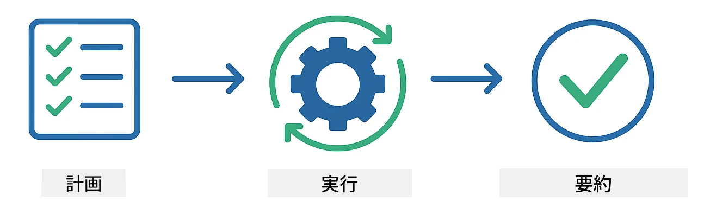

*計画 → 実行 → 要約のワークフローによる複数ステップタスク*

**自己反省コード** - 本番品質のコード生成向け。モデルがコードを生成し、品質基準に照らしてチェックし、反復的に改善します。新機能やサービス構築時に使います。

```java
String prompt = """
    <task>Create an email validation service</task>
    <quality_criteria>
    - Correct logic and error handling
    - Best practices (clean code, proper naming)
    - Performance optimization
    - Security considerations
    </quality_criteria>
    <instruction>Generate code, evaluate against criteria, improve iteratively</instruction>
    """;

String response = chatModel.chat(prompt);
```

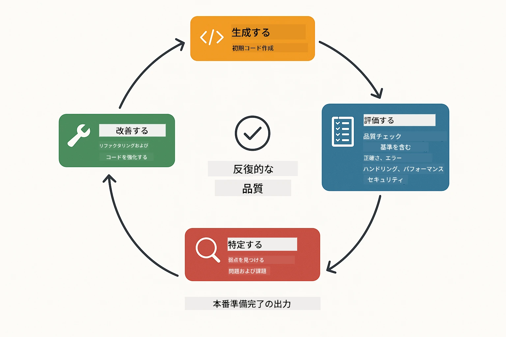

*反復的改善ループ - 生成、評価、問題特定、改善、繰り返し*

**構造化分析** - 一貫した評価向け。モデルは固定のフレームワーク（正確性、プラクティス、パフォーマンス、セキュリティ）でコードをレビューします。コードレビューや品質評価に適用。

```java
String prompt = """
    <code>
    public List getUsers() {
        return database.query("SELECT * FROM users");
    }
    </code>
    
    <framework>
    Evaluate using these categories:
    1. Correctness - Logic and functionality
    2. Best Practices - Code quality
    3. Performance - Efficiency concerns
    4. Security - Vulnerabilities
    </framework>
    """;

String response = chatModel.chat(prompt);
```

> **🤖 [GitHub Copilot](https://github.com/features/copilot) Chatで試す:** 構造化分析について質問してみましょう：
> - 「異なる種類のコードレビューに合わせて分析フレームワークをカスタマイズするには？」
> - 「構造化出力をプログラム的に解析し活用する最良の方法は？」
> - 「異なるレビューセッション間で一貫した重大度レベルを保つには？」

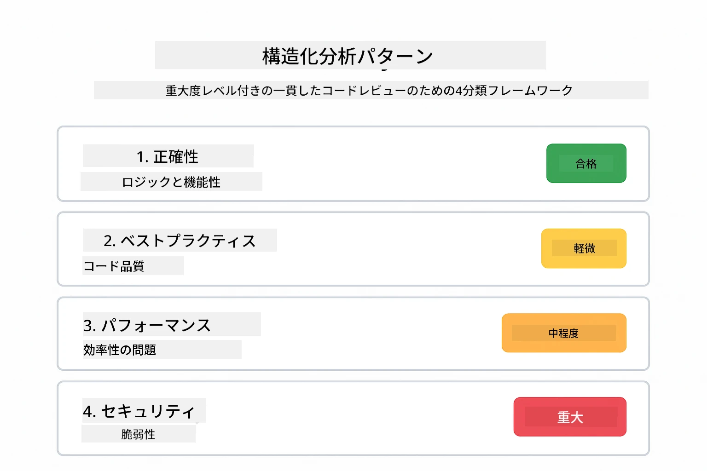

*重大度レベル付きの4カテゴリフレームワークによる一貫したコードレビュー*

**マルチターンチャット** - コンテキストが必要な会話向け。モデルは過去のメッセージを記憶し、それを踏まえて応答を構築します。インタラクティブなヘルプや複雑なQ&Aに適用。

```java
ChatMemory memory = MessageWindowChatMemory.withMaxMessages(10);

memory.add(UserMessage.from("What is Spring Boot?"));
AiMessage aiMessage1 = chatModel.chat(memory.messages()).aiMessage();
memory.add(aiMessage1);

memory.add(UserMessage.from("Show me an example"));
AiMessage aiMessage2 = chatModel.chat(memory.messages()).aiMessage();
memory.add(aiMessage2);
```

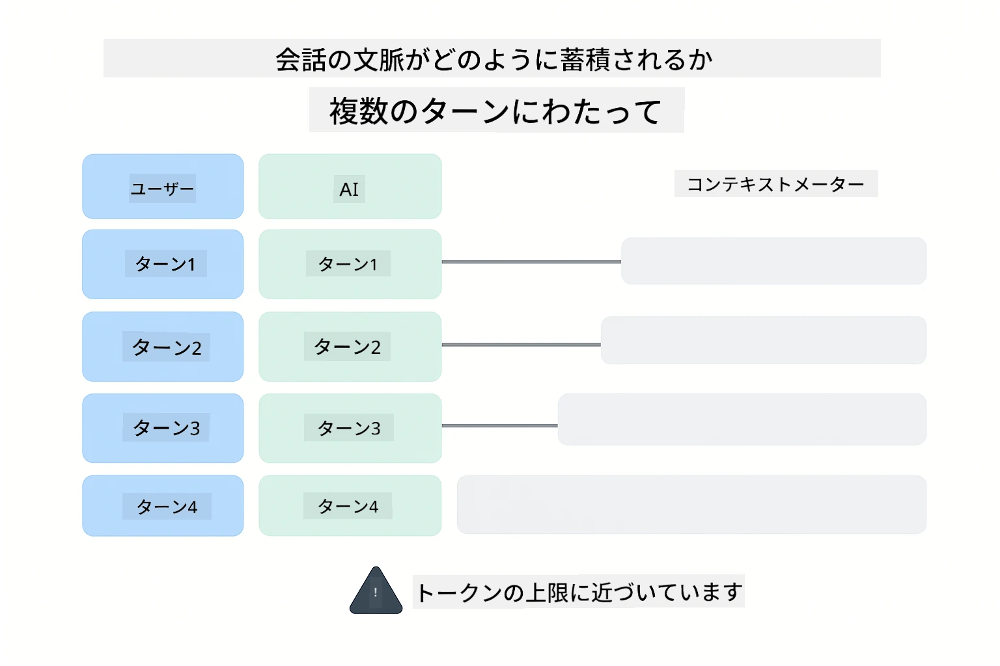

*複数ターンにわたる会話コンテキストの蓄積とトークン制限までの流れ*

**ステップバイステップ推論** - 論理を可視化したい問題向け。モデルは各ステップの明示的な推論を示します。数学問題や論理パズル、思考過程の理解に適用。

```java
String prompt = """
    <instruction>Show your reasoning step-by-step</instruction>
    
    If a train travels 120 km in 2 hours, then stops for 30 minutes,
    then travels another 90 km in 1.5 hours, what is the average speed
    for the entire journey including the stop?
    """;

String response = chatModel.chat(prompt);
```

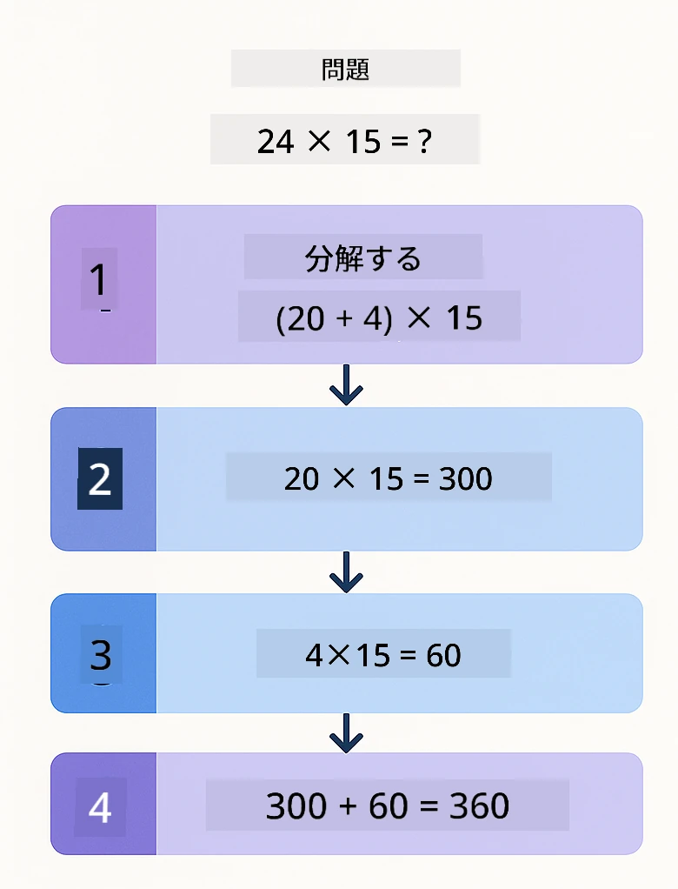

*問題を明示的な論理ステップに分解*

**制約付き出力** - 特定のフォーマット要件がある応答向け。モデルはフォーマットや長さのルールを厳守します。要約や正確な出力構造が必要な場合に使用。

```java
String prompt = """
    <constraints>
    - Exactly 100 words
    - Bullet point format
    - Technical terms only
    </constraints>
    
    Summarize the key concepts of machine learning.
    """;

String response = chatModel.chat(prompt);
```

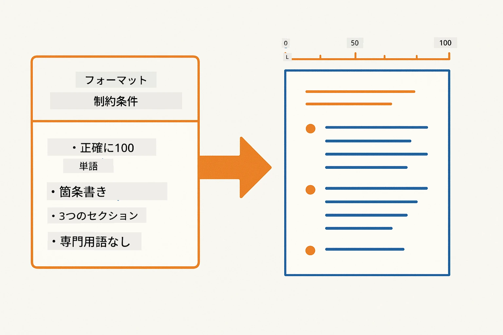

*特定のフォーマット、長さ、構造要件の強制*

## 既存のAzureリソースの利用

**デプロイ確認：**

ルートディレクトリにAzure認証情報を含む`.env`ファイルが存在することを確認（モジュール01で作成）：
```bash
cat ../.env  # AZURE_OPENAI_ENDPOINT、API_KEY、DEPLOYMENTを表示する必要があります
```

**アプリケーション起動：**

> **注意:** もしモジュール01の`./start-all.sh`で全アプリを起動済みなら、このモジュールはすでにポート8083で動作中です。以下の起動コマンドはスキップして http://localhost:8083 に直接アクセスできます。

**オプション1: Spring Boot Dashboardの利用（VS Codeユーザー推奨）**

開発コンテナにはSpring Boot Dashboard拡張機能が含まれており、すべてのSpring Bootアプリを視覚的に管理できます。VS Codeの左側アクティビティバーにあるSpring Bootアイコンからアクセス可能です。

Spring Boot Dashboardからは：
- ワークスペース内のすべてのSpring Bootアプリを一覧表示
- ワンクリックでアプリの起動・停止
- リアルタイムのログ表示
- アプリの状態監視

「prompt-engineering」の横の再生ボタンをクリックしてこのモジュールを起動、またはすべてのモジュールを一括起動できます。

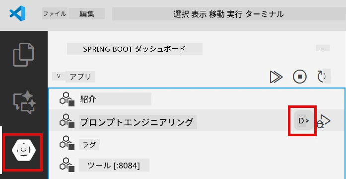

**オプション2: シェルスクリプトの利用**

すべてのWebアプリ（モジュール01-04）を起動：

**Bash:**
```bash
cd ..  # ルートディレクトリから
./start-all.sh
```

**PowerShell:**
```powershell
cd ..  # ルートディレクトリから
.\start-all.ps1
```

またはこのモジュールだけ起動：

**Bash:**
```bash
cd 02-prompt-engineering
./start.sh
```

**PowerShell:**
```powershell
cd 02-prompt-engineering
.\start.ps1
```

どちらのスクリプトもルートの`.env`ファイルから環境変数を自動読み込みし、JARがなければビルドします。

> **注意:** すべてのモジュールを手動でビルドしてから起動したい場合：
>
> **Bash:**
> ```bash
> cd ..  # Go to root directory
> mvn clean package -DskipTests
> ```
>
> **PowerShell:**
> ```powershell
> cd ..  # Go to root directory
> mvn clean package -DskipTests
> ```

ブラウザで http://localhost:8083 を開いてください。

**停止方法：**

**Bash:**
```bash
./stop.sh  # このモジュールのみ
# または
cd .. && ./stop-all.sh  # すべてのモジュール
```

**PowerShell:**
```powershell
.\stop.ps1  # このモジュールのみ
# または
cd ..; .\stop-all.ps1  # すべてのモジュール
```

## アプリケーションのスクリーンショット

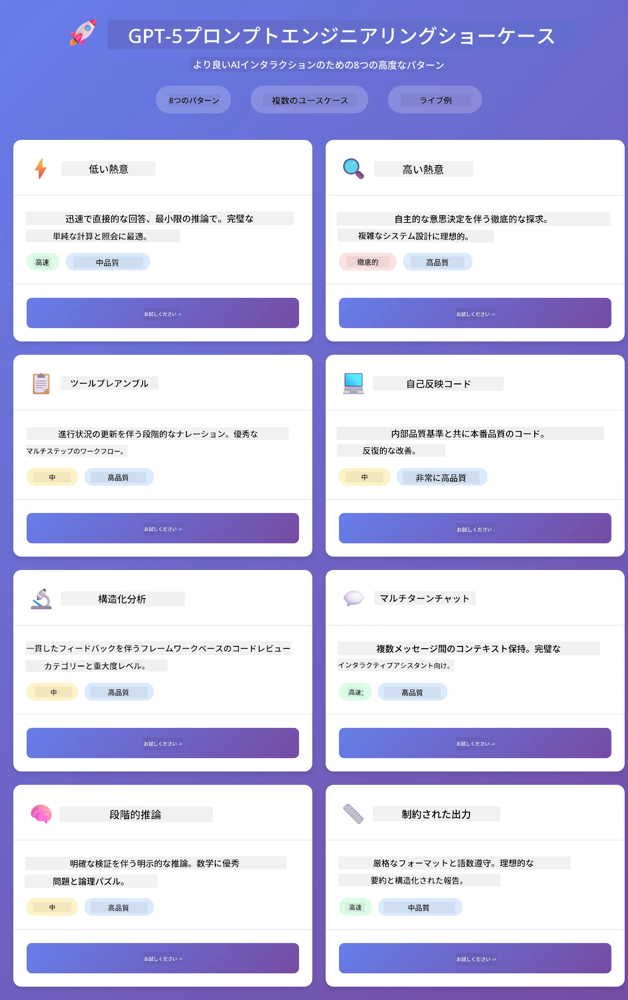

*8つのプロンプトエンジニアリングパターンとその特徴・ユースケースを示すメインダッシュボード*

## パターンの探求

Webインターフェースで異なるプロンプト戦略を試せます。各パターンは異なる問題を解決するので、どのアプローチが効果的か体験してみましょう。

### 低い意欲 vs 高い意欲

「200の15%は？」のような簡単な質問を低意欲で聞くと、即座に直接的な回答が得られます。次に「高トラフィックAPIのキャッシュ戦略を設計してください」のような複雑な質問を高意欲で聞くと、モデルはゆっくり考え詳細な推論を示します。同じモデル、同じ質問構造でも、プロンプトが思考量を指示しているのです。

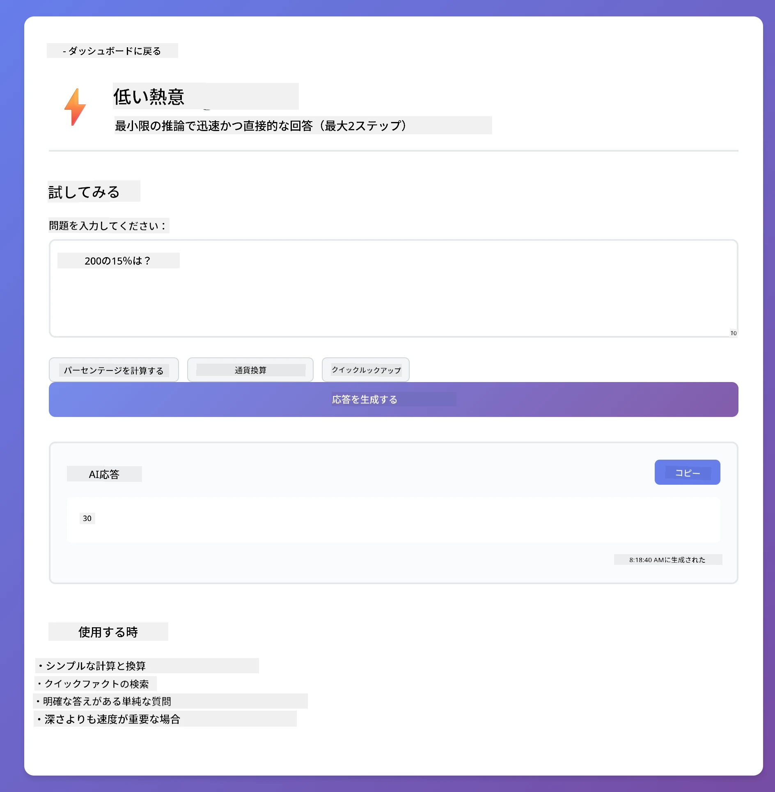
*最小限の推論での迅速な計算*

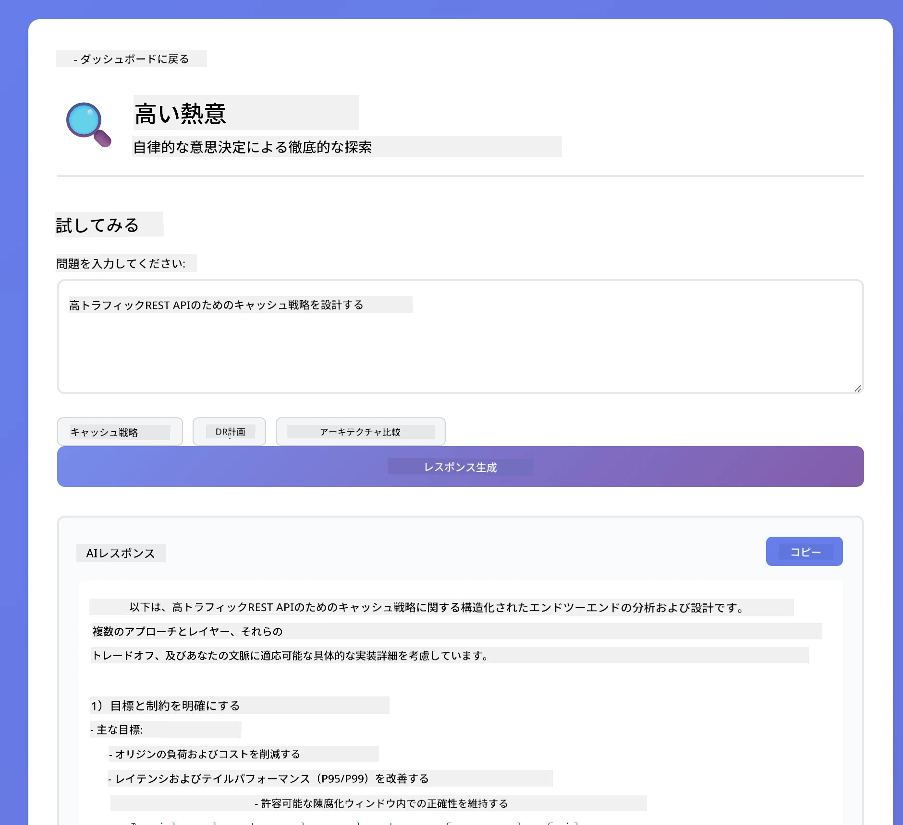

*包括的なキャッシュ戦略（2.8MB）*

### タスク実行（ツールの前置き）

複数ステップのワークフローは、事前計画と進行のナレーションが有効です。モデルは何をするかを概説し、各ステップを説明し、結果をまとめます。


*ステップごとのナレーション付きRESTエンドポイントの作成（3.9MB）*

### 自己反省型コード

「メール検証サービスを作成する」を試してください。単にコードを生成して終わるのではなく、モデルは生成し、品質基準に照らして評価し、弱点を特定し、改善します。コードが本番基準を満たすまで繰り返す様子が見られます。

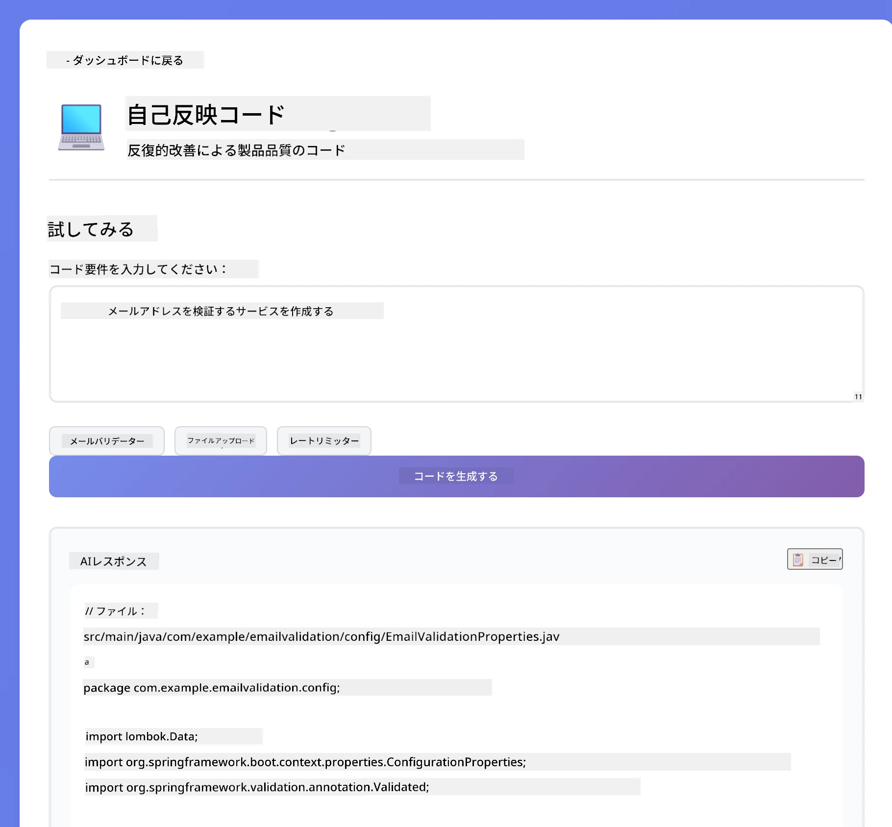

*完全なメール検証サービス（5.2MB）*

### 構造化分析

コードレビューには一貫した評価フレームワークが必要です。モデルは固定されたカテゴリ（正確性、プラクティス、パフォーマンス、セキュリティ）と重大度レベルを用いてコードを分析します。


*フレームワークに基づくコードレビュー*

### マルチターンチャット

「Spring Bootとは何ですか？」と尋ね、その直後に「例を見せて」と続けてください。モデルは最初の質問を覚えており、特定のSpring Bootの例を示します。メモリがなければ、2つ目の質問はあいまいすぎます。

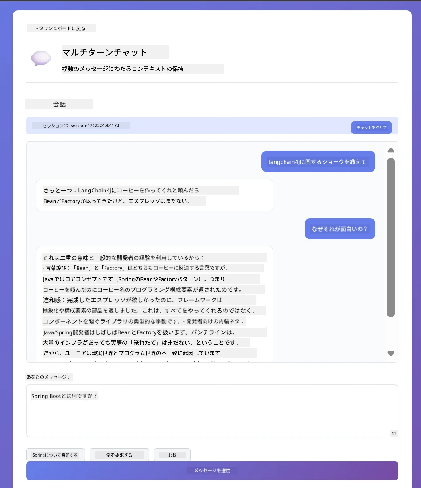

*質問間のコンテキスト保持*

### ステップバイステップ推論

数学の問題を選び、ステップバイステップ推論と低熱意の両方で試してください。低熱意は答えだけを素早く返しますが不透明です。ステップバイステップはすべての計算と判断を示します。

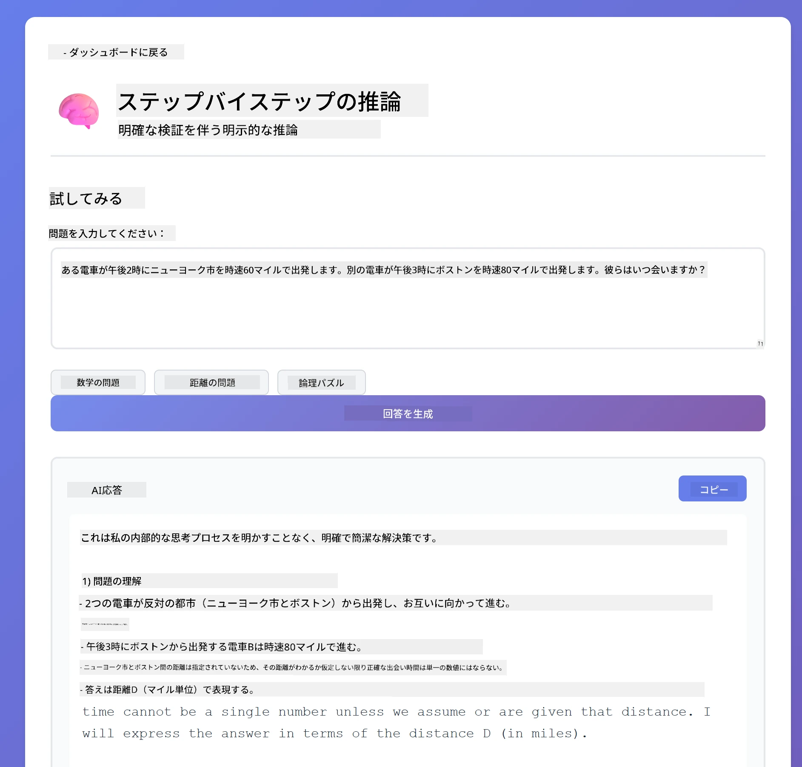

*明示的なステップを伴う数学問題*

### 制約付き出力

特定のフォーマットや語数が必要な場合、このパターンは厳密な遵守を強制します。100語ちょうどの箇条書き形式で要約を生成してみてください。

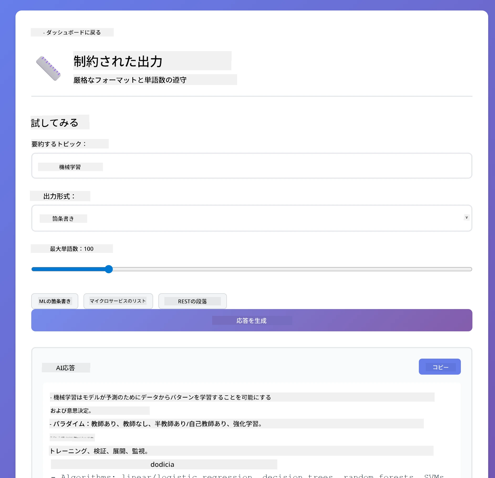

*フォーマット制御付き機械学習要約*

## 本当に学んでいること

**推論の努力がすべてを変える**

GPT-5はプロンプトを通じて計算努力を制御できます。低努力は最小限の探索で高速応答を意味します。高努力はモデルが深く考える時間を取ります。タスクの複雑さに応じて努力を合わせることを学んでいます。単純な質問に時間を無駄にせず、複雑な判断を急がないようにしましょう。

**構造が行動を導く**

プロンプト内のXMLタグに気づきましたか？装飾ではありません。モデルは自由形式のテキストよりも構造化された指示に従いやすいです。複数ステップのプロセスや複雑なロジックが必要な場合、構造はモデルが現在地と次に何をするかを追跡するのに役立ちます。

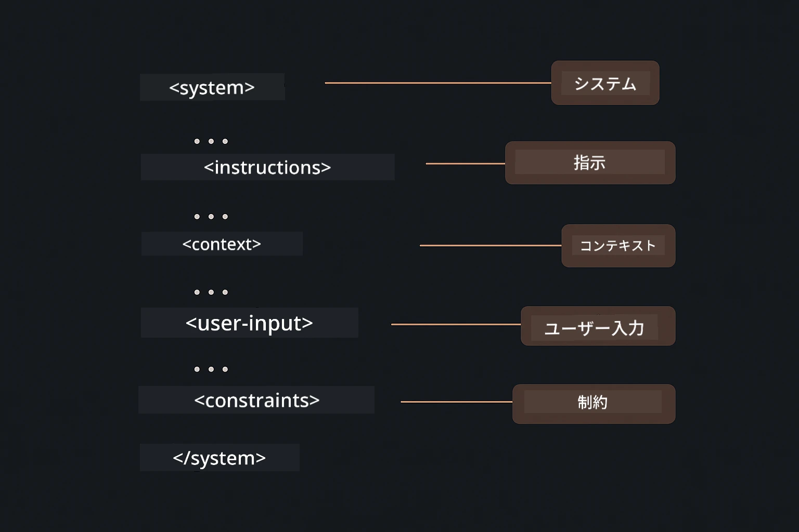

*明確なセクションとXMLスタイルの構成を持つよく構造化されたプロンプトの解剖*

**自己評価による品質**

自己反省パターンは品質基準を明示することで機能します。モデルが「正しくやる」ことを期待する代わりに、「正しい」とは何か（正確なロジック、エラーハンドリング、パフォーマンス、セキュリティ）を正確に伝えます。モデルは自身の出力を評価し改善できます。これによりコード生成は宝くじからプロセスへと変わります。

**コンテキストは有限**

マルチターン会話は各リクエストにメッセージ履歴を含めることで機能します。しかし制限があります—すべてのモデルには最大トークン数があります。会話が長くなると、その上限に達しないように関連コンテキストを保持する戦略が必要です。このモジュールではメモリの仕組みを示し、後でいつ要約し、いつ忘れ、いつ取り出すかを学びます。

## 次のステップ

**次のモジュール:** [03-rag - RAG (Retrieval-Augmented Generation)](../03-rag/README.md)

---

**ナビゲーション:** [← 前へ: モジュール 01 - はじめに](../01-introduction/README.md) | [メインへ戻る](../README.md) | [次へ: モジュール 03 - RAG →](../03-rag/README.md)

---

<!-- CO-OP TRANSLATOR DISCLAIMER START -->
**免責事項**：  
本書類はAI翻訳サービス「Co-op Translator」（https://github.com/Azure/co-op-translator）を使用して翻訳されました。正確性の向上に努めておりますが、自動翻訳には誤りや不正確な部分が含まれる可能性があります。原文の言語による文書が正式な情報源とみなされるべきです。重要な情報については、専門の人間による翻訳を推奨します。本翻訳の利用により生じたいかなる誤解や誤訳についても、当方は責任を負いかねます。
<!-- CO-OP TRANSLATOR DISCLAIMER END -->