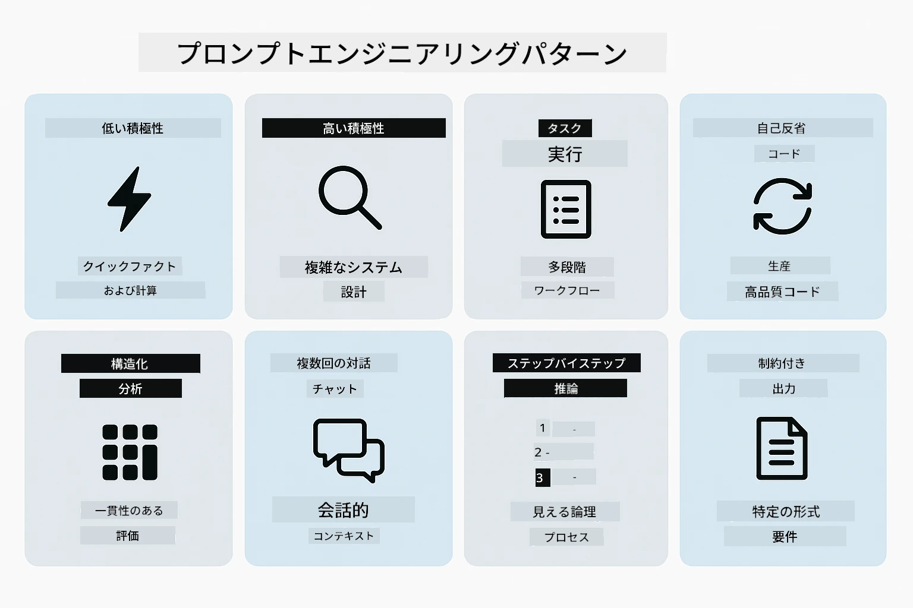
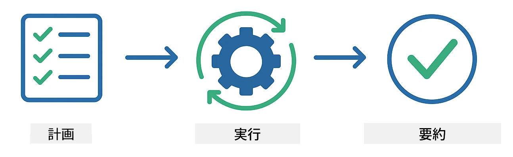
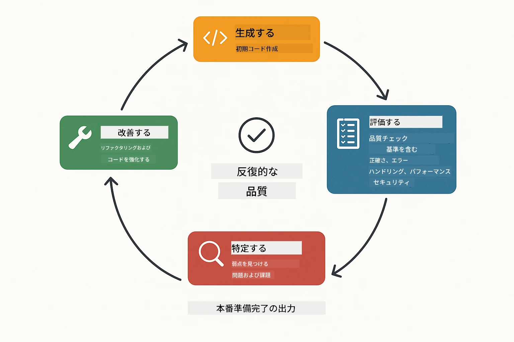
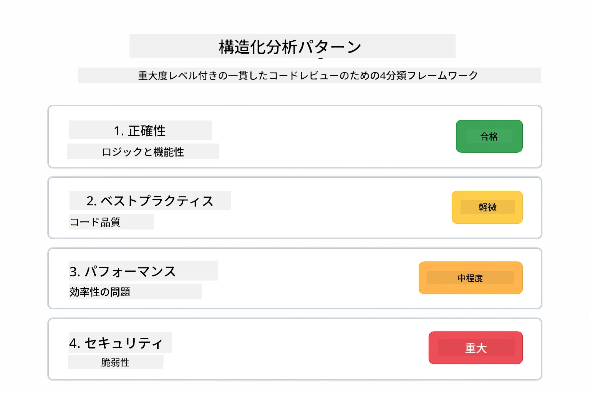
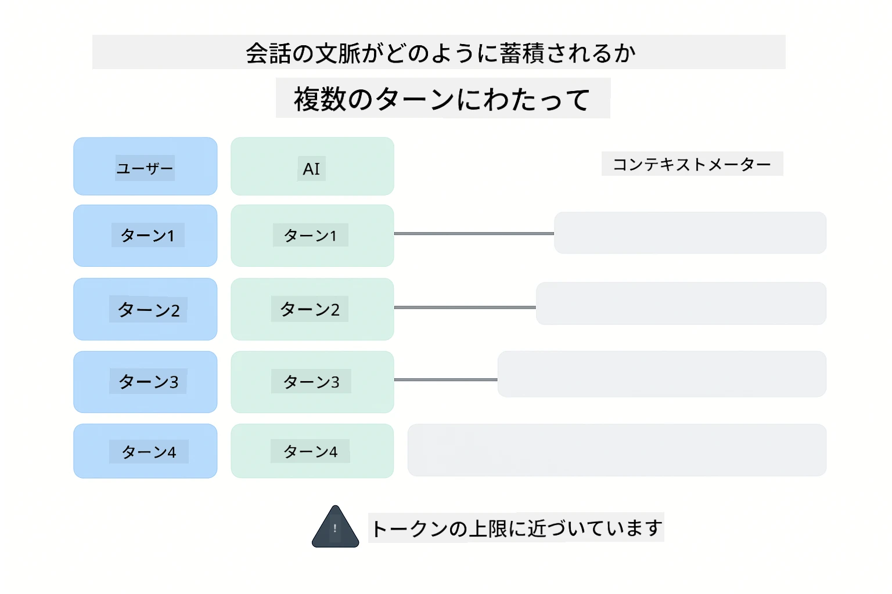
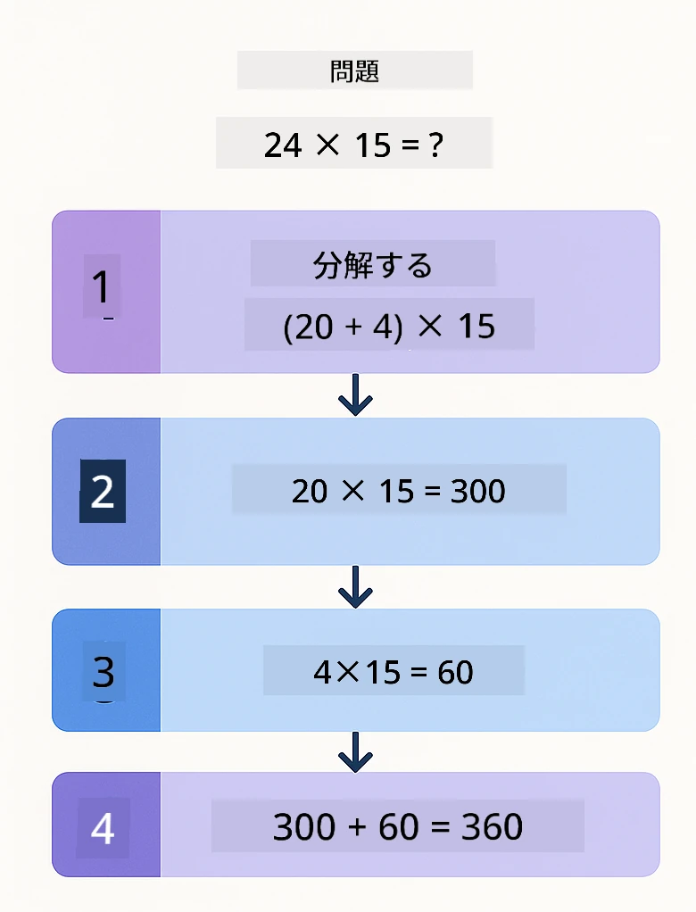
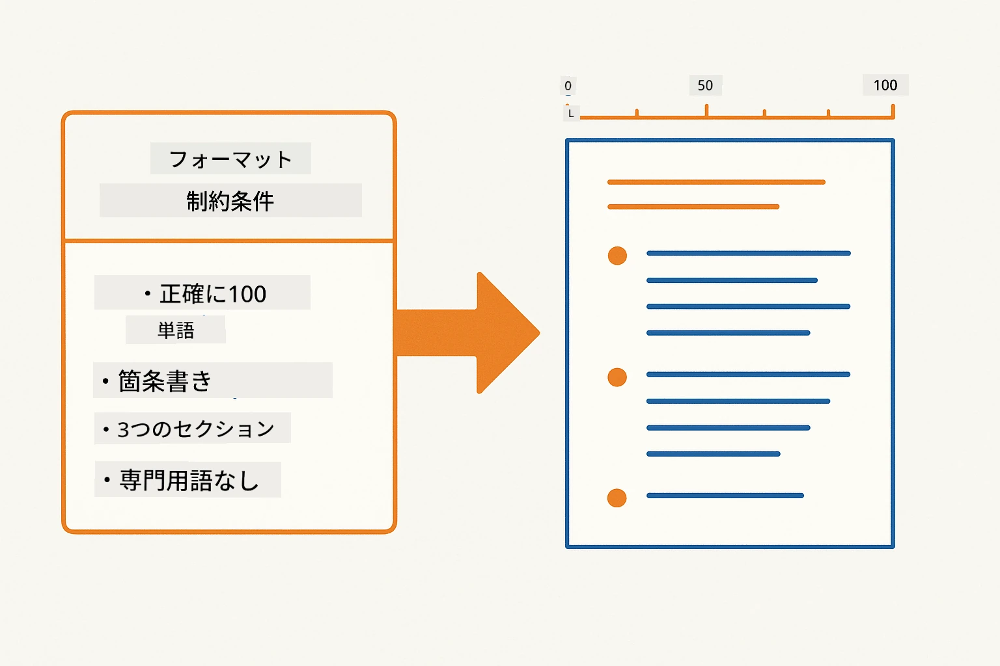
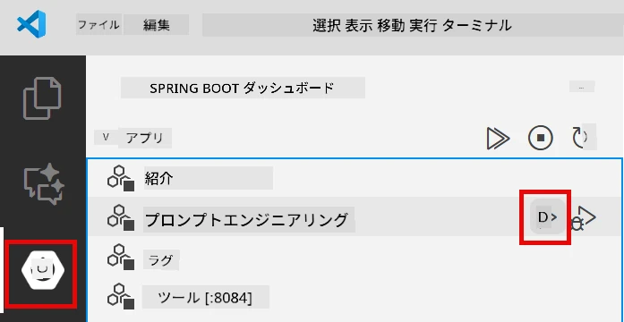
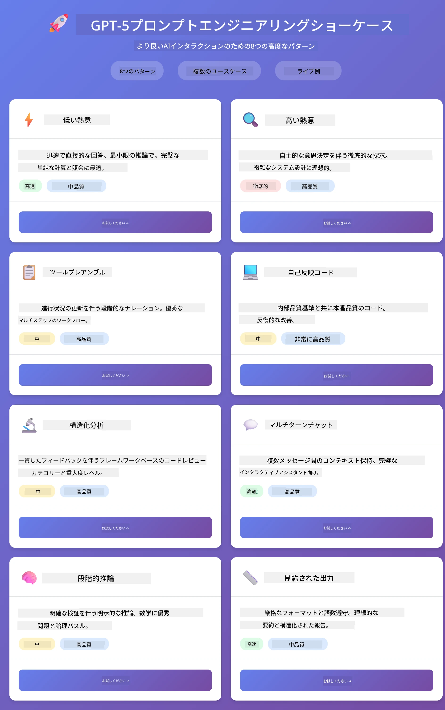
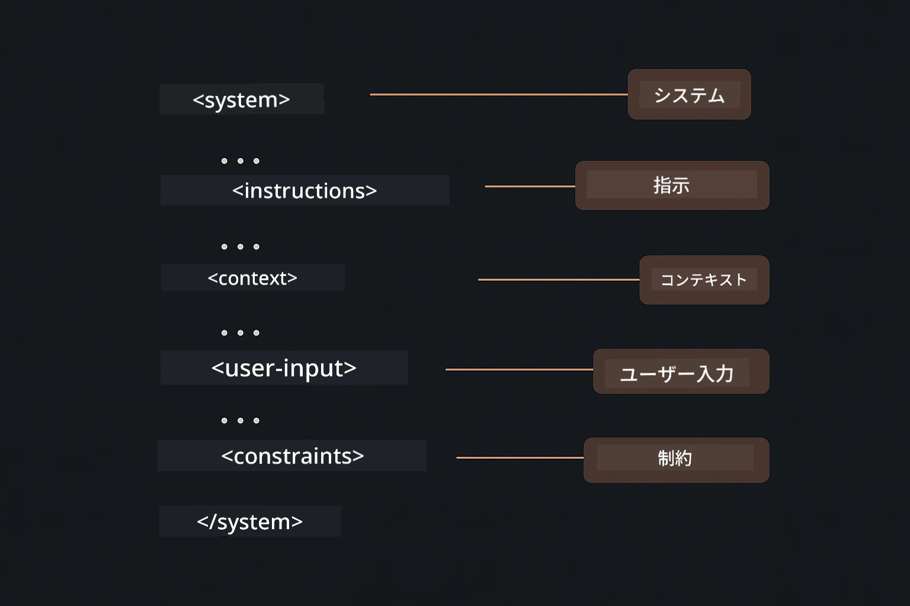

# Module 02: GPT-5.2によるプロンプトエンジニアリング

## 目次

- [動画ウォークスルー](#動画ウォークスルー)
- [学習内容](#学習内容)
- [前提条件](#前提条件)
- [プロンプトエンジニアリングの理解](#プロンプトエンジニアリングの理解)
- [プロンプトエンジニアリングの基本](#プロンプトエンジニアリングの基本)
  - [ゼロショットプロンプト](#ゼロショットプロンプト)
  - [フューショットプロンプト](#フューショットプロンプト)
  - [チェーン・オブ・ソート](#チェーン・オブ・ソート)
  - [ロールベースプロンプト](#ロールベースプロンプト)
  - [プロンプトテンプレート](#プロンプトテンプレート)
- [高度なパターン](#高度なパターン)
- [アプリケーションの実行](#アプリケーションを実行する)
- [アプリケーションのスクリーンショット](#アプリケーションのスクリーンショット)
- [パターンの探求](#パターンを探る)
  - [低い熱意 vs 高い熱意](#low-vs-high-eagerness)
  - [タスク実行（ツールプレアンブル）](#タスク実行（ツールのプレアンブル）)
  - [自己反省コード](#自己反省コード)
  - [構造化分析](#構造化分析)
  - [マルチターンチャット](#マルチターンチャット)
  - [ステップバイステップ推論](#ステップバイステップ推論)
  - [制約付き出力](#制約付き出力)
- [本当に学んでいること](#本当に学んでいること)
- [次のステップ](#次のステップ)

## 動画ウォークスルー

このモジュールの始め方を解説するライブセッションをご覧ください:

<a href="https://www.youtube.com/live/PJ6aBaE6bog?si=LDshyBrTRodP-wke"></a>

## 学習内容

以下の図は、このモジュールで習得する主要なトピックとスキルの概要を示しています — プロンプト精緻化技術から、順を追ったワークフローまで。


前のモジュールでは、Azure OpenAIと会話型AIのメモリ機能について見ました。今回は質問の投げ方、つまりAzure OpenAIのGPT-5.2を使った「プロンプトそのもの」に焦点を当てます。プロンプトの構造が回答の質に大きく影響します。基本的なプロンプティング技術の復習から始め、次にGPT-5.2の能力をフル活用した8つの高度なパターンへ進みます。

GPT-5.2を使う理由は、推論制御機能が導入されたためです — モデルにどれだけ考えさせるか指示できます。これにより異なるプロンプト戦略が明確になり、どの方法を使うべきか理解しやすくなります。

## 前提条件

- モジュール01を完了していること（Azure OpenAIリソースが展開済み）
- ルートディレクトリにAzure認証情報を含む`.env`ファイルがあること（モジュール01の`azd up`で作成）

> **注意:** モジュール01を完了していない場合は、そちらの展開手順を最初に行ってください。

## プロンプトエンジニアリングの理解

本質的に、プロンプトエンジニアリングは「曖昧な指示」と「正確な指示」の違いです。以下の比較図がそれを示しています。


プロンプトエンジニアリングとは、一貫して必要な結果を得るための入力テキストを設計することです。単に質問するだけではなく、モデルが何をどう届けるべきか正確に理解させるためのリクエストの構造化です。

これは同僚に指示を出すようなものです。「バグを直して」のような曖昧な指示より、「UserService.javaの45行目のNullPointerExceptionを防ぐためにnullチェックを追加して」のように具体的です。言語モデルも同様で、具体性と構造が重要です。

下図はLangChain4jがこの仕組みにどう関わるかを示しています — プロンプトパターンをSystemMessageやUserMessageの構成要素を通じてモデルに接続します。


LangChain4jはインフラを提供します — モデル接続、メモリ、メッセージ種別 — プロンプトパターンはそのインフラを通じて送る注意深く構造化されたテキストです。重要な構成要素は`SystemMessage`（AIの振る舞い・役割を設定）と`UserMessage`（実際のリクエストを伝達）です。

## プロンプトエンジニアリングの基本

以下の5つのコアテクニックが効果的なプロンプトエンジニアリングの基盤を形成します。各技術は言語モデルとのコミュニケーションの異なる側面に対応しています。


このモジュールの高度なパターンに入る前に、5つの基本的なプロンプティング技術を振り返りましょう。これはすべてのプロンプトエンジニアが知るべき基礎です。

### ゼロショットプロンプト

最もシンプルなアプローチ：例なしでモデルに直接指示を与えます。モデルはトレーニングのみを頼りにタスクを理解し実行します。この方法は期待される動作が明白な単純なリクエストに適しています。


*例なしの直接指示 — モデルは指示だけからタスクを推測*

```java
String prompt = "Classify this sentiment: 'I absolutely loved the movie!'";
String response = model.chat(prompt);
// 反応：「ポジティブ」
```

**使用タイミング:** 単純な分類、直接の質問、翻訳、または追加指示なしでモデルが処理可能なタスク。

### フューショットプロンプト

モデルに従ってほしいパターンを示す例を提供します。モデルは例から期待される入出力形式を学び、新しい入力に適用します。望ましいフォーマットや振る舞いが明白でないタスクにおける一貫性が大幅に向上します。


*例から学習 — モデルはパターンを認識し新しい入力に適用*

```java
String prompt = """
    Classify the sentiment as positive, negative, or neutral.
    
    Examples:
    Text: "This product exceeded my expectations!" → Positive
    Text: "It's okay, nothing special." → Neutral
    Text: "Waste of money, very disappointed." → Negative
    
    Now classify this:
    Text: "Best purchase I've made all year!"
    """;
String response = model.chat(prompt);
```

**使用タイミング:** カスタム分類、一貫したフォーマット、ドメイン特化タスク、またはゼロショットの結果が不安定な場合。

### チェーン・オブ・ソート

モデルに推論プロセスを段階的に示させます。直接答えを出すのではなく、問題を分解し明示的に各部分を検証します。数学、論理、多段階推論における正確性を向上します。


*段階的推論 — 複雑な問題を論理的な段階に細分化*

```java
String prompt = """
    Problem: A store has 15 apples. They sell 8 apples and then 
    receive a shipment of 12 more apples. How many apples do they have now?
    
    Let's solve this step-by-step:
    """;
String response = model.chat(prompt);
// このモデルは示しています：15 - 8 = 7、次に7 + 12 = 19個のりんご
```

**使用タイミング:** 数学問題、論理パズル、デバッグ、または推論プロセスを示すことで精度と信頼性が向上するタスク。

### ロールベースプロンプト

質問の前にAIに役割やペルソナを設定します。これが応答のトーンや深さ、焦点を形成します。「ソフトウェアアーキテクト」と「ジュニア開発者」や「セキュリティ監査人」では異なるアドバイスが得られます。


*文脈とペルソナの設定 — 同じ質問でも割り当てた役割によって応答が変わる*

```java
String prompt = """
    You are an experienced software architect reviewing code.
    Provide a brief code review for this function:
    
    def calculate_total(items):
        total = 0
        for item in items:
            total = total + item['price']
        return total
    """;
String response = model.chat(prompt);
```

**使用タイミング:** コードレビュー、指導、ドメイン特化分析、または特定の専門レベルや視点に合わせた応答が必要な場合。

### プロンプトテンプレート

変数プレースホルダーを使った再利用可能なプロンプトを作成します。毎回新しいプロンプトを作る代わりに、一度テンプレート定義し異なる値を埋め込みます。LangChain4jの`PromptTemplate`クラスは`{{variable}}`構文でこれを簡単にします。


*変数プレースホルダー付き再利用プロンプト — 1つのテンプレートで多数の使い方*

```java
PromptTemplate template = PromptTemplate.from(
    "What's the best time to visit {{destination}} for {{activity}}?"
);

Prompt prompt = template.apply(Map.of(
    "destination", "Paris",
    "activity", "sightseeing"
));

String response = model.chat(prompt.text());
```

**使用タイミング:** 異なる入力を使う繰り返しクエリ、バッチ処理、再利用可能なAIワークフロー構築、またはプロンプト構造は変わらずデータのみ変わる場合。

---

これら5つの基本技術はほとんどのプロンプト作業に対して堅実なツールキットを提供します。このモジュールの残りは、GPT-5.2の推論制御、自己評価、構造化出力機能を活用した<strong>8つの高度なパターン</strong>に発展します。

## 高度なパターン

基本技術を押さえたら、このモジュール特有の8つの高度なパターンに進みます。すべての問題に同じアプローチは不要です。質問によってはすばやい回答が必要なものから、深い考察が求められるものまであります。見える推論が必要な場合もあれば、結果だけが重要な場合も。以下の各パターンは異なるシナリオに最適化されており、GPT-5.2の推論制御によって違いがさらに際立ちます。



<em>八つのプロンプトエンジニアリングパターンとそのユースケースの概要</em>

GPT-5.2はこれらのパターンにもう一つの次元を追加します：<em>推論制御</em>。下のスライダーはモデルの思考の深さを調整する様子を示しています — 素早い直接回答から深く徹底した分析まで。


*GPT-5.2の推論制御により、モデルがどれだけ考えるか指定可能 — 速く直接的な回答から深い探求まで*

**低い熱意（素早く・集中）** - 速く直接回答が欲しい単純な質問向け。モデルは最小限の推論のみ — 最大2ステップ。計算、検索、または簡単な質問に最適。

```java
String prompt = """
    <context_gathering>
    - Search depth: very low
    - Bias strongly towards providing a correct answer as quickly as possible
    - Usually, this means an absolute maximum of 2 reasoning steps
    - If you think you need more time, state what you know and what's uncertain
    </context_gathering>
    
    Problem: What is 15% of 200?
    
    Provide your answer:
    """;

String response = chatModel.chat(prompt);
```

> 💡 **GitHub Copilotで探る:** [`Gpt5PromptService.java`](../../../02-prompt-engineering/src/main/java/com/example/langchain4j/prompts/service/Gpt5PromptService.java) を開き、以下の質問をしてみましょう：
> - 「低い熱意と高い熱意のプロンプトパターンの違いは何ですか？」
> - 「プロンプト内のXMLタグはAIの応答構造化にどう役立っていますか？」
> - 「自己反省パターンと直接指示はいつ使い分けるべきですか？」

**高い熱意（深く・徹底的）** - より複雑な問題で包括的な分析が必要なとき。モデルは徹底的に探求し詳細な推論を示します。システム設計、アーキテクチャの意思決定、複雑な調査に適します。

```java
String prompt = """
    Analyze this problem thoroughly and provide a comprehensive solution.
    Consider multiple approaches, trade-offs, and important details.
    Show your analysis and reasoning in your response.
    
    Problem: Design a caching strategy for a high-traffic REST API.
    """;

String response = chatModel.chat(prompt);
```

**タスク実行（ステップバイステップ進行）** - 多段階ワークフローで使用。モデルは最初に計画を示し、作業の各ステップを説明し、最後に要約します。移行作業や実装など複雑なプロセスに最適。

```java
String prompt = """
    <task_execution>
    1. First, briefly restate the user's goal in a friendly way
    
    2. Create a step-by-step plan:
       - List all steps needed
       - Identify potential challenges
       - Outline success criteria
    
    3. Execute each step:
       - Narrate what you're doing
       - Show progress clearly
       - Handle any issues that arise
    
    4. Summarize:
       - What was completed
       - Any important notes
       - Next steps if applicable
    </task_execution>
    
    <tool_preambles>
    - Always begin by rephrasing the user's goal clearly
    - Outline your plan before executing
    - Narrate each step as you go
    - Finish with a distinct summary
    </tool_preambles>
    
    Task: Create a REST endpoint for user registration
    
    Begin execution:
    """;

String response = chatModel.chat(prompt);
```

チェーン・オブ・ソートプロンプトは明示的に推論プロセスを示すことで精度を上げます。ステップごとの分解により人間とAIの双方が論理を理解しやすくなります。

> **🤖 [GitHub Copilot](https://github.com/features/copilot) Chatで試そう:** このパターンについて質問してみてください：
> - 「長時間実行する操作にタスク実行パターンをどう適用しますか？」
> - 「本番環境アプリでのツールプレアンブル構造のベストプラクティスは？」
> - 「UIで途中進捗のキャプチャと表示をどう行いますか？」

以下の図はこの計画 → 実行 → 要約のワークフローを示します。



*多段階タスクの計画 → 実行 → 要約ワークフロー*

<strong>自己反省コード</strong> - 本番品質のコード生成に向けて。モデルは本番標準に従ったコードを適切なエラーハンドリング付きで生成します。新機能やサービス構築に最適。

```java
String prompt = """
    Generate Java code with production-quality standards: Create an email validation service
    Keep it simple and include basic error handling.
    """;

String response = chatModel.chat(prompt);
```

以下の図は、この反復改善ループ — 生成、評価、弱点の特定、改善を繰り返しながら本番基準に達するまでの過程です。



*反復的改善ループ — 生成、評価、課題検出、改善、繰り返し*

<strong>構造化分析</strong> - 一貫した評価のため。モデルは固定フレームワーク（正確性、プラクティス、パフォーマンス、セキュリティ、保守性）を用いてコードをレビューします。コードレビューや品質評価に適用。

```java
String prompt = """
    <analysis_framework>
    You are an expert code reviewer. Analyze the code for:
    
    1. Correctness
       - Does it work as intended?
       - Are there logical errors?
    
    2. Best Practices
       - Follows language conventions?
       - Appropriate design patterns?
    
    3. Performance
       - Any inefficiencies?
       - Scalability concerns?
    
    4. Security
       - Potential vulnerabilities?
       - Input validation?
    
    5. Maintainability
       - Code clarity?
       - Documentation?
    
    <output_format>
    Provide your analysis in this structure:
    - Summary: One-sentence overall assessment
    - Strengths: 2-3 positive points
    - Issues: List any problems found with severity (High/Medium/Low)
    - Recommendations: Specific improvements
    </output_format>
    </analysis_framework>
    
    Code to analyze:
    ```
    public List getUsers() {
        return database.query("SELECT * FROM users");
    }
    ```
    Provide your structured analysis:
    """;

String response = chatModel.chat(prompt);
```

> **🤖 [GitHub Copilot](https://github.com/features/copilot) Chatで試そう:** 構造化分析について質問してください：
> - 「異なる種類のコードレビューに合わせフレームワークをカスタマイズするには？」
> - 「構造化出力をプログラム的に解析し活用するベストな方法は？」
> - 「異なるレビューセッション間で一貫した重大度レベルをどう保つか？」

以下の図は、この構造化フレームワークがコードレビューを一貫したカテゴリと重大度レベルに整理する様子を示します。



<em>一貫した重大度レベル付きコードレビューのためのフレームワーク</em>

<strong>マルチターンチャット</strong> - コンテキストが必要な会話用。モデルは過去のメッセージを記憶し積み重ねます。インタラクティブなヘルプや複雑なQ&Aに利用。

```java
ChatMemory memory = MessageWindowChatMemory.withMaxMessages(10);

memory.add(UserMessage.from("What is Spring Boot?"));
AiMessage aiMessage1 = chatModel.chat(memory.messages()).aiMessage();
memory.add(aiMessage1);

memory.add(UserMessage.from("Show me an example"));
AiMessage aiMessage2 = chatModel.chat(memory.messages()).aiMessage();
memory.add(aiMessage2);
```

以下の図は、会話コンテキストが複数ターンにわたって蓄積し、モデルのトークン制限にどう関係するかを視覚化しています。



<em>複数ターンの会話でコンテキストが蓄積されトークン制限に達する仕組み</em>

<strong>ステップバイステップ推論</strong> - 見える論理が必要な問題向け。モデルは各ステップの明示的な推論を示します。数学問題、論理パズル、思考プロセスを理解したい場合に適用。

```java
String prompt = """
    <instruction>Show your reasoning step-by-step</instruction>
    
    If a train travels 120 km in 2 hours, then stops for 30 minutes,
    then travels another 90 km in 1.5 hours, what is the average speed
    for the entire journey including the stop?
    """;

String response = chatModel.chat(prompt);
```

以下の図は、モデルが問題を明示的で番号付きの論理的ステップに分解する様子を示します。



<em>問題を明確な論理ステップに分解する</em>

<strong>制約付き出力</strong> - 特定のフォーマット要件がある応答向け。モデルはフォーマットおよび長さのルールを厳密に遵守します。要約や正確な出力構造が必要な場合に使用してください。

```java
String prompt = """
    <constraints>
    - Exactly 100 words
    - Bullet point format
    - Technical terms only
    </constraints>
    
    Summarize the key concepts of machine learning.
    """;

String response = chatModel.chat(prompt);
```

以下の図は、制約がどのようにモデルを導いてフォーマットと長さの要件を厳守した出力を生成するかを示しています。



*特定のフォーマット、長さ、構造要件の強制*

## アプリケーションを実行する

**デプロイの確認:**

ルートディレクトリにAzure認証情報が含まれる `.env` ファイルが存在することを確認してください（モジュール01で作成済み）。モジュールディレクトリ（`02-prompt-engineering/`）から次を実行します：

**Bash:**
```bash
cat ../.env  # AZURE_OPENAI_ENDPOINT、API_KEY、DEPLOYMENT を表示する必要があります
```

**PowerShell:**
```powershell
Get-Content ..\.env  # AZURE_OPENAI_ENDPOINT、API_KEY、DEPLOYMENT を表示する必要があります
```

**アプリケーションを起動する:**

> **注意:** すでにルートディレクトリから `./start-all.sh` を使ってすべてのアプリケーションを起動している場合（モジュール01の説明参照）、このモジュールはすでにポート8083で動作しています。以下の起動コマンドはスキップし、直接 http://localhost:8083 にアクセスしてください。

**オプション1: Spring Boot Dashboardの使用（VS Codeユーザーに推奨）**

開発コンテナにはSpring Boot Dashboard拡張機能が含まれており、すべてのSpring Bootアプリケーションを管理するビジュアルインターフェイスを提供します。VS Codeの左側のアクティビティバーにあるSpring Bootアイコンからアクセスできます。

Spring Boot Dashboardからは：
- ワークスペース内のすべてのSpring Bootアプリケーションを確認できます
- アプリケーションの起動/停止をワンクリックで行えます
- アプリケーションのログをリアルタイムで表示できます
- アプリケーションの状態を監視できます

「prompt-engineering」横の再生ボタンをクリックするだけでこのモジュールを開始するか、すべてのモジュールを一度に起動できます。



*VS CodeのSpring Boot Dashboard — 一か所から全モジュールの起動、停止、監視が可能*

**オプション2: シェルスクリプトの使用**

すべてのWebアプリケーション（モジュール01～04）を起動：

**Bash:**
```bash
cd ..  # ルートディレクトリから
./start-all.sh
```

**PowerShell:**
```powershell
cd ..  # ルートディレクトリから
.\start-all.ps1
```

またはこのモジュールだけを起動：

**Bash:**
```bash
cd 02-prompt-engineering
./start.sh
```

**PowerShell:**
```powershell
cd 02-prompt-engineering
.\start.ps1
```

両方のスクリプトはルートの `.env` ファイルから環境変数を自動読み込みし、JARファイルがなければビルドします。

> **注意:** 起動前にすべてのモジュールを手動でビルドしたい場合：
>
> **Bash:**
> ```bash
> cd ..  # Go to root directory
> mvn clean package -DskipTests
> ```
>
> **PowerShell:**
> ```powershell
> cd ..  # Go to root directory
> mvn clean package -DskipTests
> ```

ブラウザで http://localhost:8083 を開いてください。

**停止するには:**

**Bash:**
```bash
./stop.sh  # このモジュールのみ
# または
cd .. && ./stop-all.sh  # すべてのモジュール
```

**PowerShell:**
```powershell
.\stop.ps1  # このモジュールのみ
# または
cd ..; .\stop-all.ps1  # すべてのモジュール
```

## アプリケーションのスクリーンショット

こちらがプロンプトエンジニアリングモジュールのメインインターフェイスで、8つのパターンを並べて試せます。



*8つのプロンプトエンジニアリングパターンとその特長、ユースケースを示すメインダッシュボード*

## パターンを探る

Webインターフェイスでは異なるプロンプト戦略を試せます。各パターンは異なる課題を解決します—それぞれのアプローチがどんな場面で効果的か試してください。

> **注意: ストリーミング vs 非ストリーミング** — すべてのパターンページには2つのボタンがあります：**🔴 ストリームレスポンス（ライブ）** と <strong>非ストリーミング</strong> オプション。ストリーミングはServer-Sent Events（SSE）を使い、モデルが生成するトークンをリアルタイムで表示するので進捗がすぐ見えます。非ストリーミングは応答全体を待ってから表示します。高い思考を要するプロンプト（例：High Eagerness、Self-Reflecting Code）では非ストリーミング呼び出しは長時間かかり、数分におよぶこともあり、進捗が見えません。**複雑なプロンプトを試す際はストリーミングを使い、モデルが動いている様子を見て、タイムアウトと誤解されるのを防いでください。**
>
> **注意: ブラウザ要件** — ストリーミング機能はFetch Streams API（`response.body.getReader()`）を使用し、完全なブラウザ（Chrome、Edge、Firefox、Safari）が必要です。VS Code内蔵のSimple Browserでは機能しません。Simple BrowserはReadableStream APIをサポートしないためです。Simple Browser利用時は非ストリーミングボタンは通常通り動作し、影響があるのはストリーミングボタンだけです。フル機能を使うには外部ブラウザで http://localhost:8083 を開いてください。

### Low vs High Eagerness

「200の15%は？」のような単純な質問はLow Eagernessで尋ねてください。即座に直球の回答が返ってきます。次に「高トラフィックAPIのキャッシュ戦略を設計してください」と複雑な質問をHigh Eagernessで試してください。**🔴 ストリームレスポンス（ライブ）** をクリックすると、モデルの詳細な推論がトークン単位で表示されます。同じモデル、同じ質問構造ですが、プロンプトが思考の深さを指示します。

### タスク実行（ツールのプレアンブル）

複数ステップのワークフローは事前計画と進行状況のナレーションが有効です。モデルは実行することを示し、各ステップを説明し、結果を要約します。

### 自己反省コード

「メール検証サービスを作成してください」を試してみてください。単にコードを生成して止まるのではなく、モデルが生成、品質基準による評価、弱点の特定、改善を行います。コードが本番基準に達するまで繰り返し改善する過程が見えます。

### 構造化分析

コードレビューには一貫した評価フレームワークが必要です。モデルは正確性、プラクティス、パフォーマンス、セキュリティの固定カテゴリでコードを分析し、重要度を付けます。

### マルチターンチャット

「Spring Bootとは？」と尋ねてから、「例を見せて」と続けてください。モデルは最初の質問を覚えており、具体的なSpring Bootの例を返します。記憶がなければ2つ目の質問は曖昧すぎます。

### ステップバイステップ推論

数学の問題を選び、Step-by-Step ReasoningとLow Eagernessの両方で試してください。Low Eagernessは答えだけをすばやく返しますが過程は見えません。Step-by-stepはすべての計算と判断を詳細に示します。

### 制約付き出力

特定のフォーマットや語数を必要とする場合、このパターンは厳密な遵守を強制します。100語の要約を箇条書き形式で生成してみてください。

## 本当に学んでいること

<strong>推論努力がすべてを変える</strong>

GPT-5.2はプロンプトを通じて計算努力を制御できます。努力が少ないと素早い応答で探求は最小限。努力が大きいと深くじっくり考えます。課題の複雑さに応じて努力を調整することを学びます—単純な質問に時間を無駄にせず、複雑な判断は急がない。

<strong>構造が振る舞いを導く</strong>

プロンプトにXMLタグがあるのに気づきましたか？装飾ではありません。モデルは自由文より構造化された指示により確実に従います。複数ステップや複雑な論理が必要な場合、構造がモデルの現在位置と次の処理を追跡する助けになります。下図はよく構造化されたプロンプトを分解し、`<system>`, `<instructions>`, `<context>`, `<user-input>`, `<constraints>` といったタグが指示を明確なセクションに整理する様子を示しています。



*明確なセクションとXML風の構造で整理されたよく構造化されたプロンプト*

<strong>自己評価による品質向上</strong>

自己反省パターンは品質基準を明示することで機能します。モデルが「正しくやる」ことを期待するかわりに、「正しい」とは何か（正確な論理、エラーハンドリング、パフォーマンス、安全性）を正確に伝えます。モデルは自身の出力を評価し改善できるため、コード生成は宝くじでなく計画的なプロセスになります。

<strong>コンテキストは有限</strong>

マルチターン会話は各リクエストにメッセージ履歴を含めることで成り立ちますが、トークン制限があります。会話が長くなると上限に達するため、関連コンテキストを維持しつつ制限を回避する戦略が必要です。本モジュールではメモリの仕組みを示し、後で要約、忘却、取得のタイミングを学びます。

## 次のステップ

**次のモジュール:** [03-rag - RAG (Retrieval-Augmented Generation)](../03-rag/README.md)

---

**ナビゲーション:** [← 前へ: モジュール 01 - はじめに](../01-introduction/README.md) | [メインへ戻る](../README.md) | [次へ: モジュール 03 - RAG →](../03-rag/README.md)

---

<!-- CO-OP TRANSLATOR DISCLAIMER START -->
**免責事項**：
本書類は AI 翻訳サービス [Co-op Translator](https://github.com/Azure/co-op-translator) を使用して翻訳されています。正確性を期していますが、自動翻訳には誤りや不正確な部分が含まれる可能性があることをご承知おきください。原文の原語版が正式な情報源とみなされるべきです。重要な情報については、専門の人間による翻訳を推奨します。本翻訳の利用により生じたいかなる誤解や解釈違いについても、当方は責任を負いかねます。
<!-- CO-OP TRANSLATOR DISCLAIMER END -->