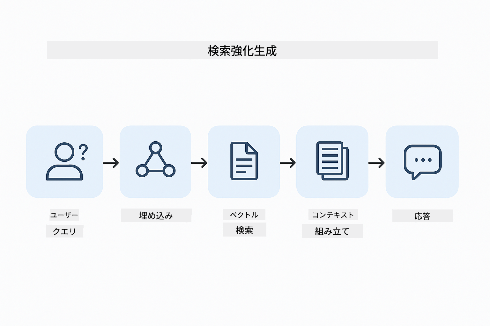
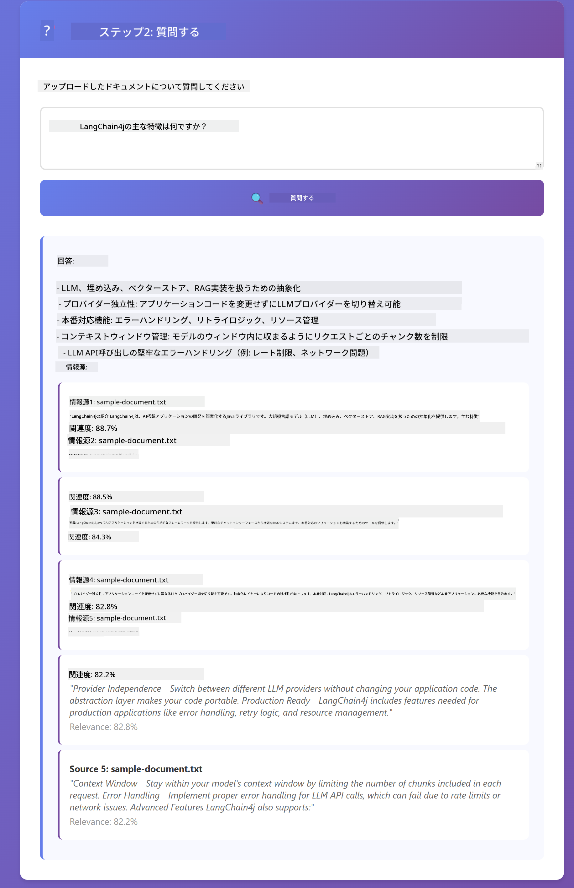

<!--
CO_OP_TRANSLATOR_METADATA:
{
  "original_hash": "f538a51cfd13147d40d84e936a0f485c",
  "translation_date": "2025-12-13T16:51:39+00:00",
  "source_file": "03-rag/README.md",
  "language_code": "ja"
}
-->
# Module 03: RAG (Retrieval-Augmented Generation)

## Table of Contents

- [What You'll Learn](../../../03-rag)
- [Prerequisites](../../../03-rag)
- [Understanding RAG](../../../03-rag)
- [How It Works](../../../03-rag)
  - [Document Processing](../../../03-rag)
  - [Creating Embeddings](../../../03-rag)
  - [Semantic Search](../../../03-rag)
  - [Answer Generation](../../../03-rag)
- [Run the Application](../../../03-rag)
- [Using the Application](../../../03-rag)
  - [Upload a Document](../../../03-rag)
  - [Ask Questions](../../../03-rag)
  - [Check Source References](../../../03-rag)
  - [Experiment with Questions](../../../03-rag)
- [Key Concepts](../../../03-rag)
  - [Chunking Strategy](../../../03-rag)
  - [Similarity Scores](../../../03-rag)
  - [In-Memory Storage](../../../03-rag)
  - [Context Window Management](../../../03-rag)
- [When RAG Matters](../../../03-rag)
- [Next Steps](../../../03-rag)

## What You'll Learn

前のモジュールでは、AIとの会話方法や効果的なプロンプトの構造化方法を学びました。しかし、根本的な制限があります。言語モデルはトレーニング時に学習したことしか知りません。会社の方針やプロジェクトのドキュメント、トレーニングされていない情報については答えられません。

RAG（Retrieval-Augmented Generation）はこの問題を解決します。モデルに情報を教え込むのではなく（これはコストが高く非現実的です）、ドキュメントを検索する能力を与えます。質問が来ると、システムは関連情報を見つけてプロンプトに含めます。モデルはその取得したコンテキストに基づいて回答します。

RAGはモデルに参考図書館を与えるようなものです。質問すると、システムは：

1. **ユーザークエリ** - 質問をする
2. **埋め込み** - 質問をベクトルに変換
3. **ベクトル検索** - 類似するドキュメントチャンクを検索
4. **コンテキスト組み立て** - 関連チャンクをプロンプトに追加
5. **応答** - LLMがコンテキストに基づいて回答を生成

これにより、モデルの回答はトレーニング知識や作り話に頼るのではなく、実際のデータに根ざしたものになります。



*RAGのワークフロー - ユーザークエリからセマンティック検索、コンテキストに基づく回答生成まで*

## Prerequisites

- Module 01を完了していること（Azure OpenAIリソースがデプロイ済み）
- ルートディレクトリにAzure認証情報を含む`.env`ファイルがあること（Module 01の`azd up`で作成）

> **Note:** Module 01を完了していない場合は、まずそちらのデプロイ手順に従ってください。

## How It Works

**Document Processing** - [DocumentService.java](../../../03-rag/src/main/java/com/example/langchain4j/rag/service/DocumentService.java)

ドキュメントをアップロードすると、システムはそれをチャンク（小さな断片）に分割します。これらのチャンクはモデルのコンテキストウィンドウに収まるサイズで、境界でのコンテキスト損失を防ぐために少し重複しています。

```java
Document document = FileSystemDocumentLoader.loadDocument("sample-document.txt");

DocumentSplitter splitter = DocumentSplitters
    .recursive(300, 30, new OpenAiTokenizer());

List<TextSegment> segments = splitter.split(document);
```

> **🤖 GitHub Copilot Chatで試す:** [`DocumentService.java`](../../../03-rag/src/main/java/com/example/langchain4j/rag/service/DocumentService.java)を開いて以下を質問してください：
> - 「LangChain4jはドキュメントをどのようにチャンクに分割し、なぜ重複が重要なのか？」
> - 「異なるドキュメントタイプに最適なチャンクサイズは何で、なぜか？」
> - 「多言語や特殊なフォーマットのドキュメントはどう扱うのか？」

**Creating Embeddings** - [LangChainRagConfig.java](../../../03-rag/src/main/java/com/example/langchain4j/rag/config/LangChainRagConfig.java)

各チャンクは埋め込みと呼ばれる数値表現に変換されます。これはテキストの意味を捉えた数学的な指紋のようなものです。類似したテキストは類似した埋め込みを生成します。

```java
@Bean
public EmbeddingModel embeddingModel() {
    return OpenAiOfficialEmbeddingModel.builder()
        .baseUrl(azureOpenAiEndpoint)
        .apiKey(azureOpenAiKey)
        .modelName(azureEmbeddingDeploymentName)
        .build();
}

EmbeddingStore<TextSegment> embeddingStore = 
    new InMemoryEmbeddingStore<>();
```


*埋め込み空間におけるベクトルで表現されたドキュメント - 類似内容はクラスター化される*

**Semantic Search** - [RagService.java](../../../03-rag/src/main/java/com/example/langchain4j/rag/service/RagService.java)

質問をすると、その質問も埋め込みに変換されます。システムは質問の埋め込みとすべてのドキュメントチャンクの埋め込みを比較し、意味的に最も類似したチャンクを見つけます。単なるキーワードの一致ではなく、実際の意味の類似性に基づきます。

```java
Embedding queryEmbedding = embeddingModel.embed(question).content();

List<EmbeddingMatch<TextSegment>> matches = 
    embeddingStore.findRelevant(queryEmbedding, 5, 0.7);

for (EmbeddingMatch<TextSegment> match : matches) {
    String relevantText = match.embedded().text();
    double score = match.score();
}
```

> **🤖 GitHub Copilot Chatで試す:** [`RagService.java`](../../../03-rag/src/main/java/com/example/langchain4j/rag/service/RagService.java)を開いて以下を質問してください：
> - 「埋め込みを使った類似度検索はどう機能し、スコアは何で決まるのか？」
> - 「どの類似度閾値を使うべきで、それが結果にどう影響するのか？」
> - 「関連ドキュメントが見つからない場合はどう対処するのか？」

**Answer Generation** - [RagService.java](../../../03-rag/src/main/java/com/example/langchain4j/rag/service/RagService.java)

最も関連性の高いチャンクがモデルへのプロンプトに含まれます。モデルはそれらのチャンクを読み、その情報に基づいて質問に答えます。これにより幻覚（hallucination）を防ぎ、モデルは目の前の情報からのみ回答します。

## Run the Application

**デプロイの確認：**

ルートディレクトリにAzure認証情報を含む`.env`ファイルが存在することを確認してください（Module 01で作成）：
```bash
cat ../.env  # AZURE_OPENAI_ENDPOINT、API_KEY、DEPLOYMENTを表示する必要があります
```

**アプリケーションの起動：**

> **Note:** Module 01の`./start-all.sh`で既にすべてのアプリケーションを起動している場合、このモジュールはポート8081で既に動作しています。以下の起動コマンドはスキップして http://localhost:8081 に直接アクセスできます。

**オプション1: Spring Boot Dashboardを使う（VS Codeユーザーに推奨）**

開発コンテナにはSpring Boot Dashboard拡張機能が含まれており、すべてのSpring Bootアプリケーションを視覚的に管理できます。VS Codeの左側のアクティビティバーにあるSpring Bootアイコンからアクセス可能です。

Spring Boot Dashboardからは：
- ワークスペース内のすべてのSpring Bootアプリケーションを一覧表示
- ワンクリックでアプリケーションの起動/停止
- リアルタイムでログを表示
- アプリケーションの状態を監視

「rag」の横にある再生ボタンをクリックしてこのモジュールを起動するか、すべてのモジュールを一括で起動できます。


**オプション2: シェルスクリプトを使う**

すべてのWebアプリケーション（モジュール01-04）を起動：

**Bash:**
```bash
cd ..  # ルートディレクトリから
./start-all.sh
```

**PowerShell:**
```powershell
cd ..  # ルートディレクトリから
.\start-all.ps1
```

またはこのモジュールだけ起動：

**Bash:**
```bash
cd 03-rag
./start.sh
```

**PowerShell:**
```powershell
cd 03-rag
.\start.ps1
```

どちらのスクリプトもルートの`.env`ファイルから環境変数を自動で読み込み、JARがなければビルドします。

> **Note:** すべてのモジュールを手動でビルドしてから起動したい場合：
>
> **Bash:**
> ```bash
> cd ..  # Go to root directory
> mvn clean package -DskipTests
> ```
>
> **PowerShell:**
> ```powershell
> cd ..  # Go to root directory
> mvn clean package -DskipTests
> ```

ブラウザで http://localhost:8081 を開いてください。

**停止するには：**

**Bash:**
```bash
./stop.sh  # このモジュールのみ
# または
cd .. && ./stop-all.sh  # すべてのモジュール
```

**PowerShell:**
```powershell
.\stop.ps1  # このモジュールのみ
# または
cd ..; .\stop-all.ps1  # すべてのモジュール
```

## Using the Application

このアプリケーションはドキュメントのアップロードと質問のためのWebインターフェースを提供します。

<a href="images/rag-homepage.png"></a>

*RAGアプリケーションのインターフェース - ドキュメントをアップロードして質問する*

**ドキュメントのアップロード**

まずドキュメントをアップロードしてください。テストにはTXTファイルが最適です。このディレクトリにはLangChain4jの機能、RAGの実装、ベストプラクティスに関する情報を含む`sample-document.txt`が用意されています。システムはアップロード時に自動でドキュメントを処理し、チャンクに分割し、それぞれのチャンクの埋め込みを作成します。

**質問する**

ドキュメントの内容に関して具体的な質問をしてください。ドキュメントに明確に記載されている事実的な質問が良いでしょう。システムは関連チャンクを検索し、プロンプトに含めて回答を生成します。

**ソース参照の確認**

各回答には類似度スコア付きのソース参照が含まれています。これらのスコア（0から1）は質問に対するチャンクの関連度を示します。スコアが高いほどマッチ度が良いことを意味します。これにより回答を元の資料と照合できます。

<a href="images/rag-query-results.png"></a>

*回答とソース参照、関連度スコアを表示したクエリ結果*

**質問を試してみる**

様々なタイプの質問を試してください：
- 具体的な事実：「主なトピックは何ですか？」
- 比較：「XとYの違いは何ですか？」
- 要約：「Zについての重要ポイントをまとめてください」

質問とドキュメント内容のマッチ度に応じて関連度スコアがどのように変わるか観察してください。

## Key Concepts

**Chunking Strategy**

ドキュメントは300トークンのチャンクに分割され、30トークンの重複があります。このバランスにより、各チャンクは意味を持つ十分なコンテキストを持ちつつ、複数チャンクをプロンプトに含められるサイズに収まります。

**Similarity Scores**

スコアは0から1の範囲：
- 0.7-1.0: 非常に関連性が高く、完全一致に近い
- 0.5-0.7: 関連性があり、良いコンテキスト
- 0.5未満: フィルタリングされ、関連性が低い

システムは最低閾値以上のチャンクのみを取得し、品質を確保します。

**In-Memory Storage**

このモジュールは簡単のためインメモリストレージを使用しています。アプリケーションを再起動するとアップロードしたドキュメントは失われます。実運用ではQdrantやAzure AI Searchのような永続的なベクターデータベースを使用します。

**Context Window Management**

各モデルには最大コンテキストウィンドウがあります。大きなドキュメントのすべてのチャンクを含めることはできません。システムは最も関連性の高い上位Nチャンク（デフォルト5）を取得し、制限内で十分なコンテキストを提供して正確な回答を可能にします。

## When RAG Matters

**RAGを使うべき場合：**
- 独自ドキュメントに関する質問に答えるとき
- 情報が頻繁に変わる場合（方針、価格、仕様など）
- 正確さにソースの明示が必要な場合
- コンテンツが大きすぎて単一プロンプトに収まらない場合
- 検証可能で根拠のある回答が必要な場合

**RAGを使わない方が良い場合：**
- モデルが既に持っている一般知識に関する質問
- リアルタイムデータが必要な場合（RAGはアップロード済みドキュメントに基づく）
- コンテンツが小さく直接プロンプトに含められる場合

## Next Steps

**次のモジュール:** [04-tools - AI Agents with Tools](../04-tools/README.md)

---

**ナビゲーション:** [← 前へ: Module 02 - Prompt Engineering](../02-prompt-engineering/README.md) | [メインへ戻る](../README.md) | [次へ: Module 04 - Tools →](../04-tools/README.md)

---

<!-- CO-OP TRANSLATOR DISCLAIMER START -->
**免責事項**：  
本書類はAI翻訳サービス「Co-op Translator」（https://github.com/Azure/co-op-translator）を使用して翻訳されました。正確性の向上に努めておりますが、自動翻訳には誤りや不正確な部分が含まれる可能性があります。原文の言語による文書が正式な情報源とみなされるべきです。重要な情報については、専門の人間による翻訳を推奨します。本翻訳の利用により生じたいかなる誤解や誤訳についても、当方は責任を負いかねます。
<!-- CO-OP TRANSLATOR DISCLAIMER END -->