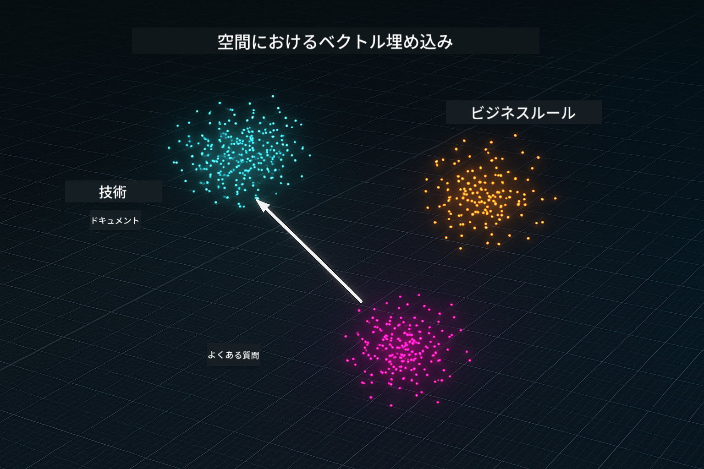
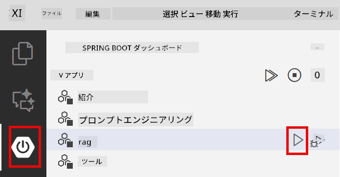
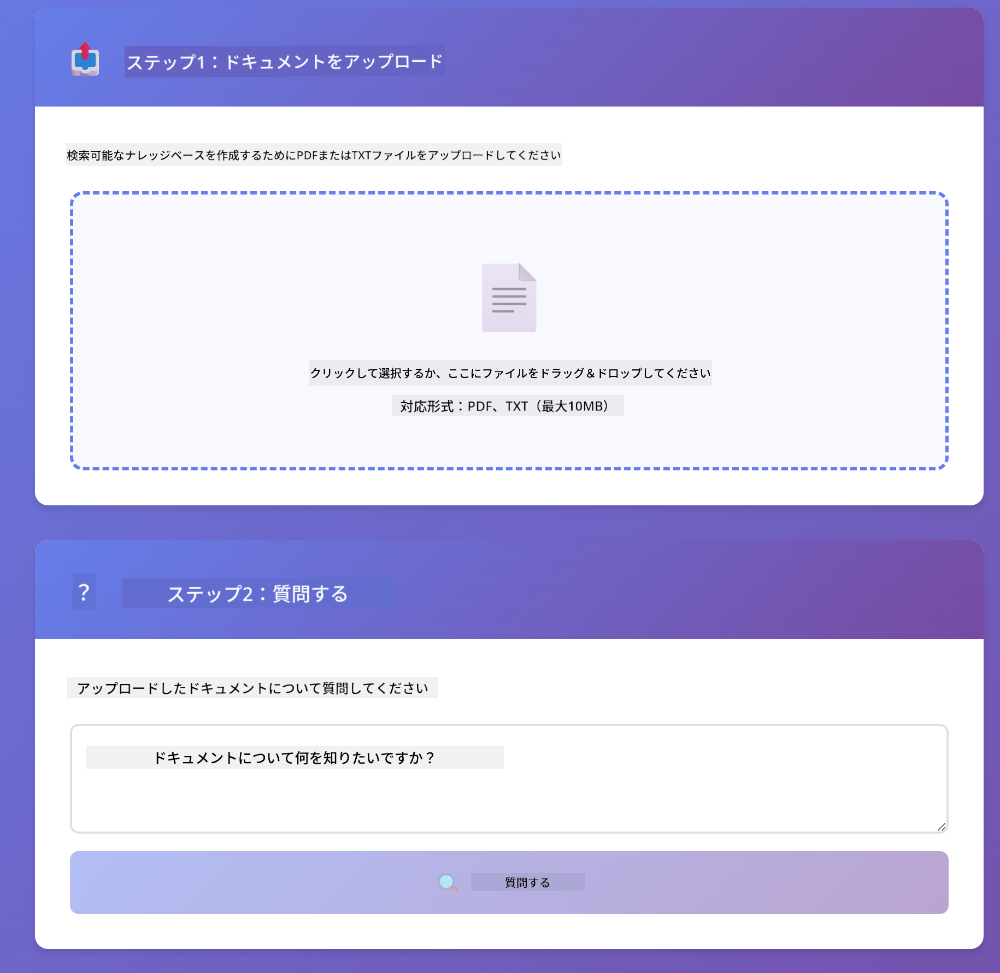

<!--
CO_OP_TRANSLATOR_METADATA:
{
  "original_hash": "81d087662fb3dd7b7124bce1a9c9ec86",
  "translation_date": "2026-01-05T22:14:04+00:00",
  "source_file": "03-rag/README.md",
  "language_code": "ja"
}
-->
# モジュール03: RAG（情報検索強化生成）

## 目次

- [学習内容](../../../03-rag)
- [前提条件](../../../03-rag)
- [RAGの理解](../../../03-rag)
- [仕組み](../../../03-rag)
  - [ドキュメント処理](../../../03-rag)
  - [埋め込みの作成](../../../03-rag)
  - [意味検索](../../../03-rag)
  - [回答生成](../../../03-rag)
- [アプリケーションの実行](../../../03-rag)
- [アプリケーションの使用](../../../03-rag)
  - [ドキュメントのアップロード](../../../03-rag)
  - [質問をする](../../../03-rag)
  - [ソース参照を確認](../../../03-rag)
  - [質問で試す](../../../03-rag)
- [重要な概念](../../../03-rag)
  - [チャンク分割戦略](../../../03-rag)
  - [類似度スコア](../../../03-rag)
  - [インメモリストレージ](../../../03-rag)
  - [コンテキストウィンドウ管理](../../../03-rag)
- [RAGが重要になる時](../../../03-rag)
- [次のステップ](../../../03-rag)

## 学習内容

前のモジュールでは、AIとの会話方法と効果的なプロンプト構造の作り方を学びました。しかし、根本的な制限があります。言語モデルは学習した内容しか知らないため、あなたの会社の方針、プロジェクトのドキュメント、トレーニングされていない情報には答えられません。

RAG（情報検索強化生成）はこの問題を解決します。モデルにあなたの情報を教え込むのではなく（これはコストが高く実用的ではありません）、ドキュメントを検索する能力を与えます。誰かが質問したときに、システムが関連情報を見つけてプロンプトに含めます。モデルはその検索されたコンテキストに基づいて回答します。

RAGはモデルに参照図書館を持たせるようなものです。質問すると、システムは：

1. **ユーザークエリ** - 質問をする
2. **埋め込み** - 質問をベクトルに変換
3. **ベクトル検索** - 類似した文書チャンクを探す
4. **コンテキスト組み立て** - 関連チャンクをプロンプトに追加
5. **回答** - LLMがコンテキストに基づいて回答生成

これにより、モデルの回答はトレーニング済みの知識や架空の回答に頼るのではなく、実際のデータに基づくものになります。


*RAGのワークフロー - ユーザークエリから意味検索、文脈に沿った回答生成まで*

## 前提条件

- モジュール01を完了している（Azure OpenAIリソースがデプロイ済み）
- ルートディレクトリにAzure認証情報を含む `.env` ファイルがある（モジュール01の `azd up` コマンドで作成）

> **注意:** モジュール01を完了していない場合は、まずそちらの展開手順に従ってください。

## 仕組み

### ドキュメント処理

[DocumentService.java](../../../03-rag/src/main/java/com/example/langchain4j/rag/service/DocumentService.java)

ドキュメントをアップロードすると、システムはそれをチャンク単位に分割します。チャンクとはモデルのコンテキストウィンドウに収まる小さい部分です。チャンクは境界でコンテキストが失われないように少し重複しています。

```java
Document document = FileSystemDocumentLoader.loadDocument("sample-document.txt");

DocumentSplitter splitter = DocumentSplitters
    .recursive(300, 30, new OpenAiTokenizer());

List<TextSegment> segments = splitter.split(document);
```

> **🤖 [GitHub Copilot](https://github.com/features/copilot) チャットで試す:** [`DocumentService.java`](../../../03-rag/src/main/java/com/example/langchain4j/rag/service/DocumentService.java) を開いて以下を質問:
> - 「LangChain4jはドキュメントをどのようにチャンクに分割し、重複が重要なのはなぜ？」
> - 「異なるドキュメントタイプに最適なチャンクサイズは何で、その理由は？」
> - 「複数言語や特殊フォーマットドキュメントの扱いはどうする？」

### 埋め込みの作成

[LangChainRagConfig.java](../../../03-rag/src/main/java/com/example/langchain4j/rag/config/LangChainRagConfig.java)

各チャンクは埋め込みと呼ばれる数値表現に変換されます。これはテキストの意味を捉えた数学的な指紋のようなものです。類似したテキストは類似した埋め込みになります。

```java
@Bean
public EmbeddingModel embeddingModel() {
    return OpenAiOfficialEmbeddingModel.builder()
        .baseUrl(azureOpenAiEndpoint)
        .apiKey(azureOpenAiKey)
        .modelName(azureEmbeddingDeploymentName)
        .build();
}

EmbeddingStore<TextSegment> embeddingStore = 
    new InMemoryEmbeddingStore<>();
```



*埋め込み空間でベクトルとして表現されたドキュメント - 類似コンテンツがクラスタを形成*

### 意味検索

[RagService.java](../../../03-rag/src/main/java/com/example/langchain4j/rag/service/RagService.java)

質問をすると、その質問も埋め込みに変換されます。システムは質問の埋め込みと全ての文書チャンクの埋め込みを比較します。キーワードだけでなく、意味的に最も類似したチャンクを見つけ出します。

```java
Embedding queryEmbedding = embeddingModel.embed(question).content();

List<EmbeddingMatch<TextSegment>> matches = 
    embeddingStore.findRelevant(queryEmbedding, 5, 0.7);

for (EmbeddingMatch<TextSegment> match : matches) {
    String relevantText = match.embedded().text();
    double score = match.score();
}
```

> **🤖 [GitHub Copilot](https://github.com/features/copilot) チャットで試す:** [`RagService.java`](../../../03-rag/src/main/java/com/example/langchain4j/rag/service/RagService.java) を開いて以下を質問:
> - 「埋め込みによる類似検索はどのように機能し、スコアはどう決まる？」
> - 「類似度閾値はどのくらいが適切で、結果にどう影響する？」
> - 「関連ドキュメントが見つからない場合はどう処理する？」

### 回答生成

[RagService.java](../../../03-rag/src/main/java/com/example/langchain4j/rag/service/RagService.java)

最も関連性の高いチャンクがモデルへのプロンプトに含まれます。モデルはそれらのチャンクを読み、その情報に基づいて質問に回答します。これにより幻覚（事実と異なる生成）を防止します。

## アプリケーションの実行

**デプロイ確認：**

ルートディレクトリにAzure認証情報入りの `.env` ファイルが存在することを確認（モジュール01実行時に作成）：
```bash
cat ../.env  # AZURE_OPENAI_ENDPOINT、API_KEY、DEPLOYMENT を表示する必要があります
```

**アプリケーションの起動：**

> **注意:** もしモジュール01で `./start-all.sh` を使用してすでに全アプリケーションを起動していれば、このモジュールはポート8081で起動中です。以下の起動コマンドはスキップして http://localhost:8081 に直接アクセスしてください。

**オプション1：Spring Boot Dashboardの使用（VS Codeユーザー推奨）**

開発コンテナにSpring Boot Dashboard拡張機能が含まれており、すべてのSpring Bootアプリケーションを視覚的に管理可能です。VS Codeの左側のアクティビティバーにあるSpring Bootアイコンを探してください。

Spring Boot Dashboardでは：
- ワークスペース内の全Spring Bootアプリを確認可能
- ワンクリックで起動・停止が可能
- リアルタイムにログを表示
- アプリケーションの状態を監視

「rag」の横にある再生ボタンをクリックするとこのモジュールが起動します。全モジュールを一度に起動することも可能です。



**オプション2：シェルスクリプトの使用**

すべてのウェブアプリケーション（モジュール01-04）を起動：

**Bash:**
```bash
cd ..  # ルートディレクトリから
./start-all.sh
```

**PowerShell:**
```powershell
cd ..  # ルートディレクトリから
.\start-all.ps1
```

このモジュールだけを起動：

**Bash:**
```bash
cd 03-rag
./start.sh
```

**PowerShell:**
```powershell
cd 03-rag
.\start.ps1
```

どちらのスクリプトもルートの `.env` ファイルから環境変数を自動読み込みし、JARがなければビルドします。

> **注意:** 起動前にすべてのモジュールを手動でビルドしたい場合：
>
> **Bash:**
> ```bash
> cd ..  # Go to root directory
> mvn clean package -DskipTests
> ```

> **PowerShell:**
> ```powershell
> cd ..  # Go to root directory
> mvn clean package -DskipTests
> ```

ブラウザで http://localhost:8081 を開いてください。

**停止コマンド：**

**Bash:**
```bash
./stop.sh  # このモジュールのみ
# または
cd .. && ./stop-all.sh  # すべてのモジュール
```

**PowerShell:**
```powershell
.\stop.ps1  # このモジュールのみ
# または
cd ..; .\stop-all.ps1  # すべてのモジュール
```


## アプリケーションの使用

このアプリケーションはドキュメントのアップロードと質問のためのウェブインターフェースを提供します。

<a href="images/rag-homepage.png"></a>

*RAGアプリケーションインターフェース - ドキュメントをアップロードして質問可能*

### ドキュメントのアップロード

まずドキュメントをアップロードしてください。テストにはTXTファイルが最適です。このディレクトリにはLangChain4jの機能、RAGの実装、ベストプラクティス情報が記載された `sample-document.txt` が提供されています。システムはアップロード時に自動でドキュメントを処理し、チャンク分割し、各チャンクの埋め込みを作成します。

### 質問をする

ドキュメントの内容に関する具体的な質問をしてください。文書内で明確に述べられている事実を尋ねるのが良いでしょう。システムは関連チャンクを検索し、それをプロンプトに含めて回答を生成します。

### ソース参照を確認

回答には似ているチャンクのソース参照と類似度スコアが含まれます。スコアは0から1で、質問に対してチャンクがどれだけ関連しているかを示します。スコアが高いほどマッチ度が良いです。これにより回答を元資料と比較して検証できます。

<a href="images/rag-query-results.png"></a>

*質問結果に回答とソース参照、関連度スコアを表示*

### 質問で試す

さまざまなタイプの質問を試してください：
- 具体的な事実：「主なトピックは何ですか？」
- 比較：「XとYの違いは何ですか？」
- 要約：「Zの重要ポイントをまとめて」

質問内容によって関連度スコアがどのように変化するか観察してください。

## 重要な概念

### チャンク分割戦略

ドキュメントは300トークンのチャンクに分割され、30トークンの重複があります。このバランスにより、十分な文脈を保ちつつ、複数チャンクをプロンプトに含められる大きさに抑えられます。

### 類似度スコア

スコアは0から1の範囲です：
- 0.7〜1.0：非常に関連性が高く、完全なマッチ
- 0.5〜0.7：関連性あり、良好な文脈
- 0.5未満：除外、関連性低い

システムは最低閾値以上のチャンクのみを検索結果として返し、品質を確保します。

### インメモリストレージ

このモジュールではシンプルにインメモリストレージを使用しています。アプリを再起動するとアップロードしたドキュメントは失われます。実運用ではQdrantやAzure AI Searchのような永続的ベクトルデータベースを使います。

### コンテキストウィンドウ管理

モデルには最大のコンテキストウィンドウ容量があり、大きなドキュメントのすべてのチャンクを含めることはできません。システムは最も関連性の高い上位Nチャンク（デフォルトは5）を取得し、制限内で十分な文脈を提供し正確な回答を実現します。

## RAGが重要になる時

**RAGを使うと効果的なケース：**
- 独自のドキュメントに関する質問に答える必要がある場合
- 情報が頻繁に変わる（方針、価格、仕様等）
- 正確性がソースの明示を要求する場合
- コンテンツが大きくて単一プロンプトに収まらない場合
- 検証可能で根拠のある回答が必要な場合

**RAGを使わなくて良いケース：**
- モデルが既に持つ一般知識が質問対象の場合
- リアルタイムデータが必要な場合（RAGはアップロード済みドキュメントで動作）
- コンテンツが小さくプロンプトに直接含められる場合

## 次のステップ

**次のモジュール:** [04-tools - AIエージェントとツール](../04-tools/README.md)

---

**ナビゲーション:** [← 前へ：モジュール02 - プロンプトエンジニアリング](../02-prompt-engineering/README.md) | [メインへ戻る](../README.md) | [次へ：モジュール04 - ツール →](../04-tools/README.md)

---

<!-- CO-OP TRANSLATOR DISCLAIMER START -->
**免責事項**：  
本書類はAI翻訳サービス「Co-op Translator」（https://github.com/Azure/co-op-translator）を使用して翻訳されています。正確性には努めておりますが、自動翻訳には誤りや不正確な部分が含まれる可能性があることをご理解ください。原文の日本語版（または原言語版）が正式な情報源とみなされます。重要な情報については、専門の人間による翻訳をご利用いただくことを推奨します。本翻訳の利用により生じた誤解や誤訳について、一切の責任を負いかねます。
<!-- CO-OP TRANSLATOR DISCLAIMER END -->