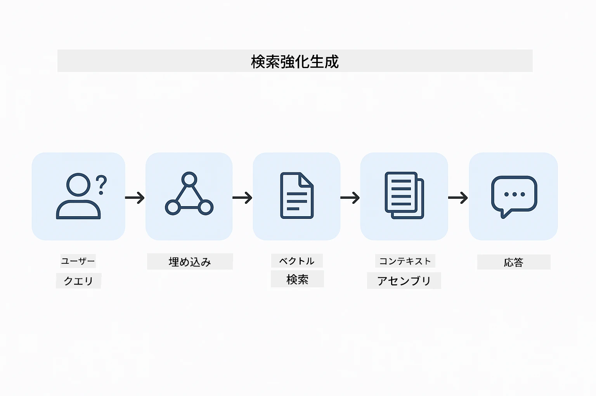
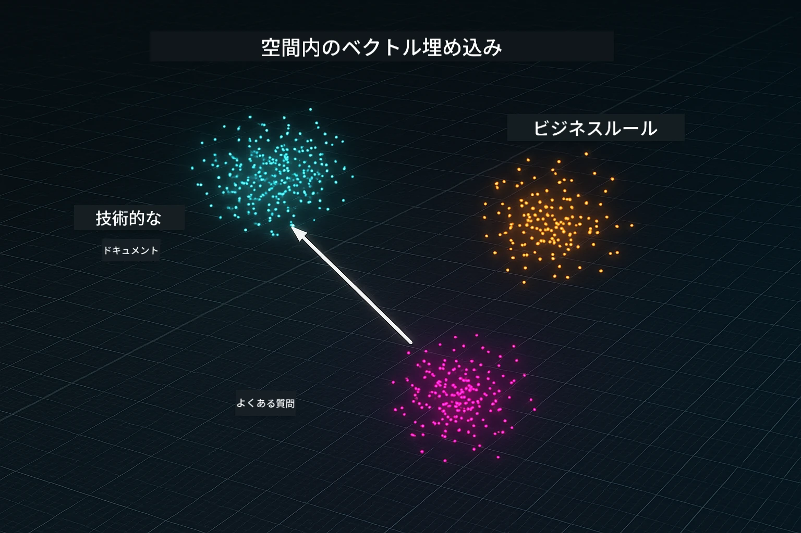
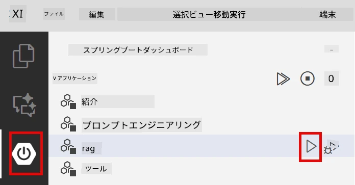
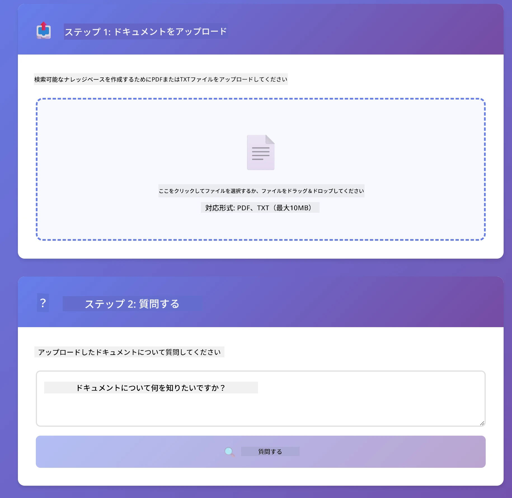
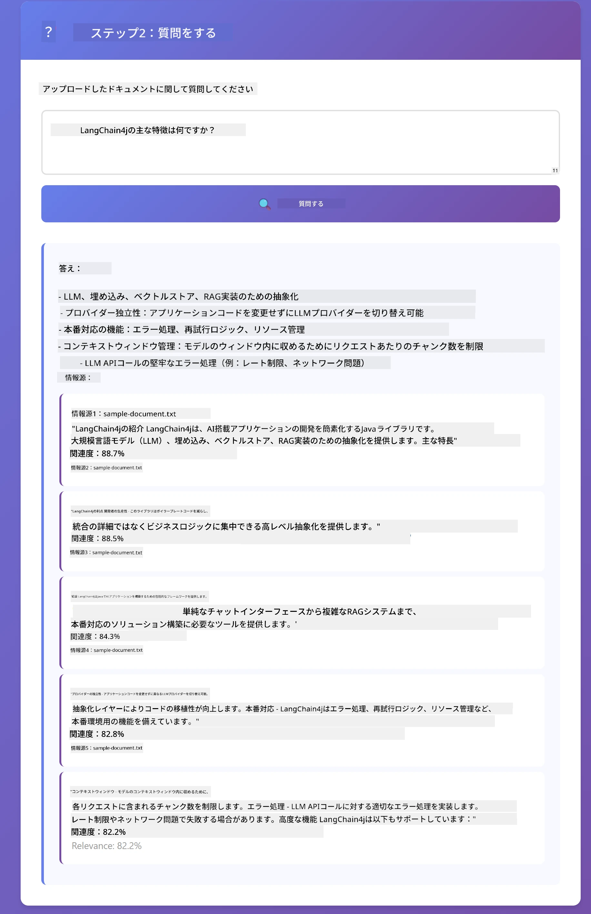

# Module 03: RAG (Retrieval-Augmented Generation)

## Table of Contents

- [Video Walkthrough](#video-walkthrough)
- [What You'll Learn](#what-youll-learn)
- [Prerequisites](#prerequisites)
- [Understanding RAG](#understanding-rag)
  - [Which RAG Approach Does This Tutorial Use?](#which-rag-approach-does-this-tutorial-use)
- [How It Works](#how-it-works)
  - [Document Processing](#document-processing)
  - [Creating Embeddings](#creating-embeddings)
  - [Semantic Search](#semantic-search)
  - [Answer Generation](#答えの生成)
- [Run the Application](#アプリケーションを実行する)
- [Using the Application](#アプリケーションの使用方法)
  - [Upload a Document](#ドキュメントをアップロードする)
  - [Ask Questions](#質問をする)
  - [Check Source References](#ソース参照を確認する)
  - [Experiment with Questions](#質問を変えて試す)
- [Key Concepts](#主要な概念)
  - [Chunking Strategy](#チャンク化戦略)
  - [Similarity Scores](#類似度スコア)
  - [In-Memory Storage](#インメモリストレージ)
  - [Context Window Management](#コンテキストウィンドウ管理)
- [When RAG Matters](#rag-が重要な場合)
- [Next Steps](#次のステップ)

## Video Walkthrough

このモジュールの開始方法を説明するライブセッションをご覧ください：

<a href="https://www.youtube.com/watch?v=_olq75ZH_eY"></a>

## What You'll Learn

前のモジュールでは、AIとの会話方法や効果的なプロンプトの構造化方法を学びました。しかし、根本的な制約があります。言語モデルはトレーニング時に学んだことしか知りません。会社の方針、プロジェクトのドキュメント、あるいはトレーニングされていない情報に関する質問には答えられないのです。

RAG（Retrieval-Augmented Generation）はこの問題を解決します。モデルに情報を教えるのではなく（これは費用がかかり非現実的です）、ドキュメントを検索する能力を与えます。質問が来ると、システムは関連する情報を見つけてプロンプトに組み込みます。モデルはその取得されたコンテキストに基づいて回答します。

RAGはモデルに参考図書館を与えるようなものです。質問をすると、システムは：

1. <strong>ユーザークエリ</strong> - あなたが質問する
2. <strong>埋め込み</strong> - 質問をベクトルに変換
3. <strong>ベクトル検索</strong> - 類似のドキュメントチャンクを検索
4. <strong>コンテキスト組み立て</strong> - 関連チャンクをプロンプトに追加
5. <strong>応答</strong> - LLMがそのコンテキストに基づいて回答

これにより、モデルの回答がトレーニング知識に依存したり、架空の回答をするのではなく、実際のデータに根ざしたものになります。

## Prerequisites

- [Module 01 - Introduction](../01-introduction/README.md) の完了（Azure OpenAI リソース展開済み、`text-embedding-3-small` 埋め込みモデル含む）
- ルートディレクトリに Azure 資格情報が記載された `.env` ファイル（Module 01 の `azd up` コマンドで作成）

> **Note:** Module 01 を完了していなければ、まずそこで展開手順を実行してください。`azd up` コマンドは GPT チャットモデルとこのモジュールで使う埋め込みモデルの両方を展開します。

## Understanding RAG

以下の図はコアコンセプトを示しています：モデルのトレーニングデータのみに頼るのではなく、RAGは回答を生成する前に参照できるドキュメントのライブラリをモデルに与えます。


*この図は標準的なLLM（トレーニングデータから推測）と、RAG強化LLM（まずドキュメントを参照）の違いを示しています。*

ユーザーの質問が次の4段階で処理される様子が接続されます — 埋め込み、ベクトル検索、コンテキスト組み立て、回答生成 — 各段階が前の段階の上に成り立っています：



*この図はユーザークエリが埋め込み、ベクトル検索、コンテキスト組み立て、回答生成を経るエンドツーエンドのRAGパイプラインを示しています。*

このモジュールの残りの部分で各段階を詳細にコードと共に説明します。

### Which RAG Approach Does This Tutorial Use?

LangChain4jは3つのRAG実装方法を提供しており、それぞれ抽象化のレベルが異なります。以下の図はそれらを比較しています：


*この図はLangChain4jの3つのRAGアプローチ（Easy、Native、Advanced）を比較し、主要なコンポーネントと利用シーンを示しています。*

| アプローチ | 内容 | トレードオフ |
|---|---|---|
| **Easy RAG** | `AiServices` と `ContentRetriever` を通じてすべてを自動的に接続。インターフェースに注釈を付けてリトリーバを追加すると、埋め込み、検索、プロンプト組み立てをLangChain4jが裏で処理。 | コードは最小限だが、各段階の処理内容が見えない。 |
| **Native RAG** | 埋め込みモデルを呼び出し、ストアを検索し、プロンプトを構築し、回答を生成する各ステップを明示的に記述。 | コード量は増えるが、各段階が見える＆変更可能。 |
| **Advanced RAG** | `RetrievalAugmentor` フレームワークを使い、クエリ変換器、ルーター、再ランキング、コンテンツ注入をプラグインで構成する本格的なパイプライン。 | 最大の柔軟性。ただし複雑度が大幅に増す。 |

**本チュートリアルは Native アプローチを使用します。** RAGパイプラインの各ステップ— クエリの埋め込み、ベクターストアの検索、コンテキストの組み立て、回答の生成 — は[`RagService.java`](../../../03-rag/src/main/java/com/example/langchain4j/rag/service/RagService.java)に明示的に書かれています。これは学習リソースとして、コードの最適化よりもすべての段階を見て理解することが重要だからです。仕組みがわかれば、簡単な試作には Easy RAG、実運用には Advanced RAG に段階的に移行可能です。

> **💡 Easy RAGが気になる方へ:** LangChain4jは `AiServices` と `ContentRetriever` が埋め込み、検索、プロンプト組み立てを自動的に扱う *Easy RAG* も提供しています。このモジュールは明示的なルートを取り、各段階を分解して制御できるようにしています。

以下の図は Easy RAG パイプラインを示しています。`AiServices` と `EmbeddingStoreContentRetriever` が複雑さを隠し、ドキュメントを読み込みリトリーバを接続して回答を得るだけです。モジュールで使う Native アプローチはそれらを分解します：


*この図は Easy RAG のパイプラインを示しています。モジュールで使う Native アプローチは埋め込み、検索、コンテキスト組み立てを自分で呼び出せるように分解し、完全に見える化と制御を可能にします。*

## How It Works

このモジュールのRAGパイプラインは、ユーザーが質問するたびに順番に実行される4つの段階に分かれています。まずアップロードされた文書が<strong>解析・分割</strong>されて扱いやすい断片になります。これらの断片は<strong>ベクトル埋め込み</strong>に変換され保存され、数学的に比較可能になります。クエリが来ると、<strong>意味検索</strong>で最も関連性のある断片を探し、最後にそれらをコンテキストとしてLLMに渡し<strong>回答生成</strong>します。以下に実際のコードと図で各段階を解説します。まず最初の段階から見ていきましょう。

### Document Processing

[DocumentService.java](../../../03-rag/src/main/java/com/example/langchain4j/rag/service/DocumentService.java)

ドキュメントをアップロードすると、システムはそれを（PDFまたはプレーンテキストとして）解析し、ファイル名などのメタデータを付け、モデルのコンテキストウィンドウに収まるサイズのチャンク（断片）に分割します。チャンクは少し重なりがあって、境界でのコンテキスト損失を防ぎます。

```java
// アップロードされたファイルを解析し、LangChain4jのDocumentにラップします
Document document = Document.from(content, metadata);

// 300トークンごとに分割し、30トークンの重複を持たせます
DocumentSplitter splitter = DocumentSplitters
    .recursive(300, 30);

List<TextSegment> segments = splitter.split(document);
```
  
以下の図は視覚的にその様子を示しています。隣接するチャンクは同じトークンをいくつか共有しており、30トークンの重複によって重要なコンテキストが失われません：


*この図は300トークンチャンクを30トークン重複で分割し、チャンク境界でコンテキストを維持する様子を示しています。*

> **🤖 [GitHub Copilot](https://github.com/features/copilot) Chatで試す:** [`DocumentService.java`](../../../03-rag/src/main/java/com/example/langchain4j/rag/service/DocumentService.java) を開き、次の質問をどうぞ：
> - 「LangChain4j はどのように文書をチャンク化し、なぜ重複が重要か？」
> - 「異なる文書タイプに最適なチャンクサイズは何でその理由は？」
> - 「多言語または特殊書式の文書はどう扱う？」

### Creating Embeddings

[LangChainRagConfig.java](../../../03-rag/src/main/java/com/example/langchain4j/rag/config/LangChainRagConfig.java)

各チャンクは「埋め込み」と呼ばれる数値表現に変換されます — これは「意味を数字に変換する装置」のようなものです。埋め込みモデルはチャットモデルのように「賢い」わけではなく、指示に従ったり推論したり質問に答えたりはできません。できるのはテキストを数学空間にマッピングし、意味が似ているものを近くに置くことだけです — 「car（車）」は「automobile（自動車）」の近くに、「refund policy（返金規定）」は「return my money（返金）」の近くに配置されるイメージです。チャットモデルは会話できる人のようなもの、埋め込みモデルは超優秀なファイリングシステムです。

以下の図はこの概念を視覚化しています — テキストが入って数値ベクトルが出力され、意味が似ているものはベクトル空間で近くに位置します：


*この図は埋め込みモデルがテキストを数値ベクトルに変換し、「car」と「automobile」のような類似した意味をベクトル空間で近接させることを示しています。*

```java
@Bean
public EmbeddingModel embeddingModel() {
    return OpenAiOfficialEmbeddingModel.builder()
        .baseUrl(azureOpenAiEndpoint)
        .apiKey(azureOpenAiKey)
        .modelName(azureEmbeddingDeploymentName)
        .build();
}

EmbeddingStore<TextSegment> embeddingStore = 
    new InMemoryEmbeddingStore<>();
```
  
以下のクラス図はRAGパイプラインの2つの別々の流れと、それを実装するLangChain4jのクラスを示しています。<strong>取り込みフロー</strong>（アップロード時に一度実行）は文書を分割しチャンクを埋め込み、`.addAll()` 経由で保存します。<strong>クエリフロー</strong>（ユーザー毎の質問時に実行）は質問を埋め込み、`.search()` でストアを検索し該当コンテキストをチャットモデルに渡します。両フローは共通の `EmbeddingStore<TextSegment>` インターフェースでつながっています：


*この図はRAGパイプラインにおける二つのフロー（取り込み＆クエリ）とそれらを共有のEmbeddingStoreを通じて接続している様子を示しています。*

埋め込みが保存されると、類似コンテンツは自動的にベクトル空間で近接してクラスタを形成します。以下の視覚化は関連トピックの文書が近接ポイントとして配置され、意味検索を可能にする様子を示しています：



*この視覚化はテクニカルドキュメント、ビジネスルール、FAQなどの関連文書が3Dベクトル空間で別々のクラスタを形成する様子を示しています。*

検索時は4ステップで進みます：文書に一度埋め込み、検索毎にクエリを埋め込み、コサイン類似度で全ベクトルと比較し、上位K件を返す。以下の図は各ステップと関わるLangChain4jクラスを示しています：


*この図は文書の埋め込み、クエリの埋め込み、コサイン類似度によるベクトル比較、トップK件の返却という4ステップの埋め込み検索プロセスを示しています。*

### Semantic Search

[RagService.java](../../../03-rag/src/main/java/com/example/langchain4j/rag/service/RagService.java)

質問をすると、その質問も埋め込みに変換されます。システムは質問の埋め込みとすべての文書チャンクの埋め込みを比較します。単なるキーワードの一致ではなく、真の意味的類似を持つチャンクを特定します。

```java
Embedding queryEmbedding = embeddingModel.embed(question).content();

EmbeddingSearchRequest searchRequest = EmbeddingSearchRequest.builder()
    .queryEmbedding(queryEmbedding)
    .maxResults(5)
    .minScore(0.5)
    .build();

EmbeddingSearchResult<TextSegment> searchResult = embeddingStore.search(searchRequest);
List<EmbeddingMatch<TextSegment>> matches = searchResult.matches();

for (EmbeddingMatch<TextSegment> match : matches) {
    String relevantText = match.embedded().text();
    double score = match.score();
}
```
  
以下の図は意味検索と従来のキーワード検索の違いを比較しています。「vehicle」というキーワード検索は「cars and trucks」についてのチャンクを見逃してしまいますが、意味検索は同義であることを理解し高スコアで返します：


*この図はキーワード検索と意味検索の比較を示しており、意味検索が正確なキーワードが異なっていても意味的に関連するコンテンツを返す様子を示しています。*

内部的には類似度はコサイン類似度で測定されます — 「これら2つの矢印は同じ方向を向いているか？」を問うようなものです。全く違う言葉でも意味が同じなら、ベクトルは同じ方向を示しスコアは1.0に近くなります：


*この図は、埋め込みベクトル間の角度としてのコサイン類似度を示しています — より整列したベクトルはスコアが1.0に近くなり、より高い意味的類似度を示します。*

> **🤖 [GitHub Copilot](https://github.com/features/copilot) チャットで試す:** [`RagService.java`](../../../03-rag/src/main/java/com/example/langchain4j/rag/service/RagService.java) を開いて次のように尋ねてください:
> - 「埋め込みを使った類似検索はどのように機能し、スコアは何によって決まるのか？」
> - 「どの類似度閾値を使うべきで、それが結果にどう影響するのか？」
> - 「関連するドキュメントが見つからなかった場合はどう対応すべきか？」

### 答えの生成

[RagService.java](../../../03-rag/src/main/java/com/example/langchain4j/rag/service/RagService.java)

最も関連性の高いチャンクが、明示的な指示や取得したコンテキスト、ユーザーの質問を含む構造化されたプロンプトに組み立てられます。モデルはその特定のチャンクのみを読み、それに基づいて回答を生成します — 使用できるのは目の前の情報のみであるため、幻覚を防げます。

```java
String context = matches.stream()
    .map(match -> match.embedded().text())
    .collect(Collectors.joining("\n\n"));

String prompt = String.format("""
    Answer the question based on the following context.
    If the answer cannot be found in the context, say so.

    Context:
    %s

    Question: %s

    Answer:""", context, request.question());

String answer = chatModel.chat(prompt);
```

下の図はこの組み立ての動作を示しています — 検索ステップで上位のスコアを得たチャンクがプロンプトテンプレートに注入され、`OpenAiOfficialChatModel` が根拠のある回答を生成します:


*この図は、上位スコアのチャンクが構造化されたプロンプトに組み込まれ、モデルがあなたのデータから根拠のある回答を生成できる様子を示しています。*

## アプリケーションを実行する

**デプロイを確認する:**

ルートディレクトリに Azure の資格情報を含む `.env` ファイルが存在することを確認してください（モジュール01で作成）。モジュールディレクトリ（`03-rag/`）からこれを実行します:

**Bash:**
```bash
cat ../.env  # AZURE_OPENAI_ENDPOINT、API_KEY、DEPLOYMENT を表示する必要があります
```

**PowerShell:**
```powershell
Get-Content ..\.env  # AZURE_OPENAI_ENDPOINT、API_KEY、DEPLOYMENT を表示する必要があります
```

**アプリケーションを起動する:**

> **注意:** ルートディレクトリから `./start-all.sh` を使ってすでにすべてのアプリケーションを起動している場合（モジュール01で説明）、このモジュールはすでにポート8081で動作しています。以下の起動コマンドはスキップして http://localhost:8081 に直接アクセスできます。

**オプション1: Spring Boot ダッシュボードを使用する（VS Codeユーザーに推奨）**

開発コンテナには Spring Boot ダッシュボード拡張機能が含まれており、すべての Spring Boot アプリを視覚的に管理できます。VS Code 左側のアクティビティバーで Spring Boot アイコンを探してください。

Spring Boot ダッシュボードからは:
- ワークスペース内のすべてのSpring Bootアプリを確認可能
- ワンクリックでアプリの起動/停止
- リアルタイムでアプリケーションログを表示
- アプリの状態を監視可能

「rag」の横の再生ボタンをクリックすればこのモジュールを起動、またはすべてのモジュールをまとめて起動できます。



*このスクリーンショットは、VS Code の Spring Boot ダッシュボードの様子で、アプリの起動、停止、監視を視覚的に行えます。*

**オプション2: シェルスクリプトを使用する**

すべてのウェブアプリケーション（モジュール01-04）を起動:

**Bash:**
```bash
cd ..  # ルートディレクトリから
./start-all.sh
```

**PowerShell:**
```powershell
cd ..  # ルートディレクトリから
.\start-all.ps1
```

またはこのモジュールのみを起動:

**Bash:**
```bash
cd 03-rag
./start.sh
```

**PowerShell:**
```powershell
cd 03-rag
.\start.ps1
```

どちらのスクリプトもルートの `.env` ファイルから環境変数を自動的に読み込み、JARファイルがなければビルドします。

> **注意:** 起動前に手動で全モジュールをビルドしたい場合:
>
> **Bash:**
> ```bash
> cd ..  # Go to root directory
> mvn clean package -DskipTests
> ```
>
> **PowerShell:**
> ```powershell
> cd ..  # Go to root directory
> mvn clean package -DskipTests
> ```

ブラウザで http://localhost:8081 を開いてください。

**停止するには:**

**Bash:**
```bash
./stop.sh  # このモジュールのみ
# または
cd .. && ./stop-all.sh  # すべてのモジュール
```

**PowerShell:**
```powershell
.\stop.ps1  # このモジュールのみ
# または
cd ..; .\stop-all.ps1  # すべてのモジュール
```

## アプリケーションの使用方法

このアプリはドキュメントのアップロードと質問用のウェブインターフェースを提供します。

<a href="images/rag-homepage.png"></a>

*このスクリーンショットは、ドキュメントをアップロードして質問を行うRAGアプリケーションのインターフェースを示しています。*

### ドキュメントをアップロードする

まずドキュメントをアップロードしてください — テストにはTXTファイルが最適です。このディレクトリには LangChain4j の機能、RAG 実装、ベストプラクティスに関する情報を含む `sample-document.txt` が用意されており、システムのテストに最適です。

システムはアップロードされたドキュメントを処理し、チャンクに分割して各チャンクの埋め込みを作成します。これはアップロード時に自動的に行われます。

### 質問をする

次に、ドキュメントの内容に関して具体的な質問をしてください。ドキュメントに明確に記載された事実を尋ねてみましょう。システムは関連性の高いチャンクを検索し、それをプロンプトに含めて回答を生成します。

### ソース参照を確認する

各回答には類似度スコア付きのソース参照が含まれていることに注意してください。これらのスコア（0から1）は、どれだけそのチャンクが質問に関連しているかを示します。高いスコアはよりマッチしていることを意味し、回答の根拠をソースで確認できます。

<a href="images/rag-query-results.png"></a>

*このスクリーンショットは、生成された回答、ソースの参照、および取得された各チャンクの関連度スコアを示したクエリ結果です。*

### 質問を変えて試す

様々なタイプの質問を試してみてください:
- 具体的な事実: 「主なトピックは何ですか？」
- 比較: 「XとYの違いは何ですか？」
- 要約: 「Zについての重要ポイントをまとめてください」

質問がドキュメント内容にどれだけマッチしているかで関連度スコアがどう変化するか観察してください。

## 主要な概念

### チャンク化戦略

ドキュメントは300トークンのチャンクに分割され、30トークンの重なりがあります。このバランスにより、それぞれのチャンクが意味のある文脈を十分に持ちながら、複数チャンクをプロンプトに含めやすいサイズに保たれています。

### 類似度スコア

取得された各チャンクには、質問にどれだけ密接にマッチしているかを示す0から1の類似度スコアが付与されます。下の図はスコアの範囲とシステムの結果フィルタリングの方法を可視化しています:


*この図は、スコアが0から1の範囲で、0.5の最低閾値を設定して関連の薄いチャンクを除外している様子を示しています。*

スコアの範囲は次の通り:
- 0.7〜1.0: 非常に関連性が高く、正確にマッチ
- 0.5〜0.7: 関連性があり良い文脈
- 0.5未満: 除外される、類似性が低すぎる

システムは品質を保証するため、最低閾値以上のチャンクのみを取得します。

埋め込みは意味のクラスタリングが明確な場合によく機能しますが、盲点もあります。下の図はよくある失敗モードを示しています — チャンクが大きすぎるとベクトルが不鮮明に、チャンクが小さすぎると文脈が不足、曖昧な用語は複数クラスタを指し、IDや部品番号の正確一致は埋め込みでは機能しません:


*この図は一般的な埋め込み失敗モードを示しています: 大きすぎるチャンク、小さすぎるチャンク、複数クラスタを指す曖昧な用語、IDのような正確一致検索。*

### インメモリストレージ

このモジュールは簡単さのためインメモリストレージを使用しています。アプリを再起動するとアップロードしたドキュメントは消えてしまいます。商用システムでは Qdrant や Azure AI Search のような永続的なベクターデータベースを使用します。

### コンテキストウィンドウ管理

各モデルには最大コンテキストウィンドウがあります。大きなドキュメントのすべてのチャンクを含めることはできません。システムは最も関連性の高い上位Nチャンク（デフォルト5）だけを取得して制限内に収めつつ、正確な回答に十分な文脈を提供します。

## RAG が重要な場合

RAGは常に最適なアプローチではありません。下の意思決定ガイドは、RAGが価値を追加する場合と、コンテンツをプロンプトに直接含めたりモデルの内蔵知識に頼ったりする簡単な方法で十分な場合の判断に役立ちます:


*この図は、RAGが価値を持つ場合と、より簡単な方法で十分な場合の意思決定ガイドを示しています。*

## 次のステップ

**次のモジュール:** [04-tools - AI Agents with Tools](../04-tools/README.md)

---

**ナビゲーション:** [← 前: モジュール02 - プロンプトエンジニアリング](../02-prompt-engineering/README.md) | [メインに戻る](../README.md) | [次: モジュール04 - ツール →](../04-tools/README.md)

---

<!-- CO-OP TRANSLATOR DISCLAIMER START -->
**免責事項**：
本書類は AI 翻訳サービス [Co-op Translator](https://github.com/Azure/co-op-translator) を使用して翻訳されています。正確性を期していますが、自動翻訳には誤りや不正確な部分が含まれる可能性があることをご承知おきください。原文の原語版が正式な情報源とみなされるべきです。重要な情報については、専門の人間による翻訳を推奨します。本翻訳の利用により生じたいかなる誤解や解釈違いについても、当方は責任を負いかねます。
<!-- CO-OP TRANSLATOR DISCLAIMER END -->