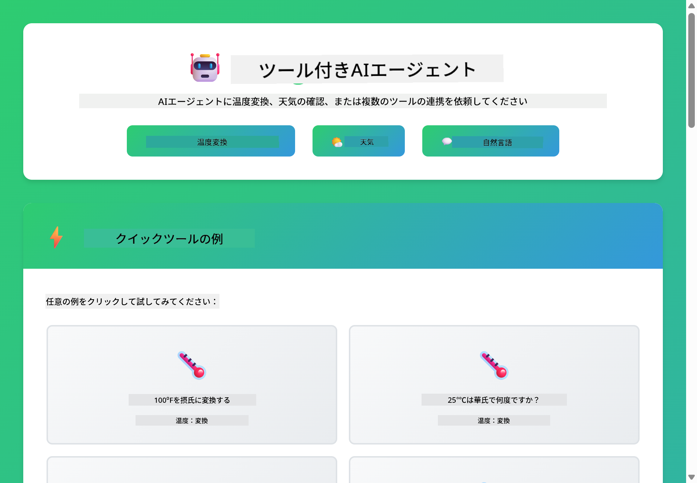
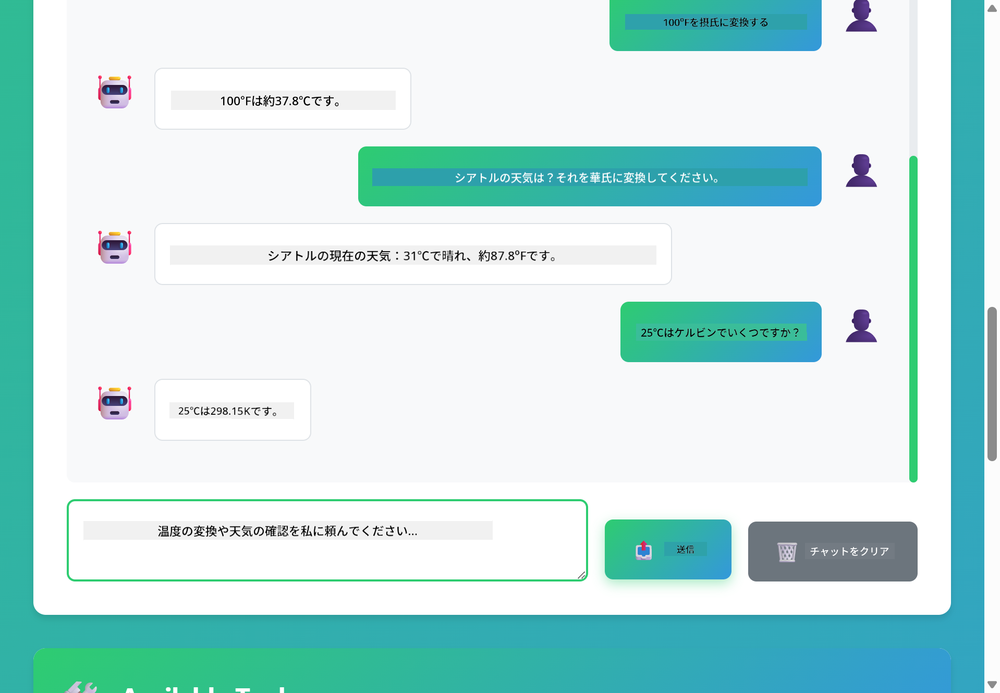

<!--
CO_OP_TRANSLATOR_METADATA:
{
  "original_hash": "13ec450c12cdd1a863baa2b778f27cd7",
  "translation_date": "2025-12-30T22:00:57+00:00",
  "source_file": "04-tools/README.md",
  "language_code": "ja"
}
-->
# Module 04: AI Agents with Tools

## Table of Contents

- [何を学ぶか](../../../04-tools)
- [前提条件](../../../04-tools)
- [ツールを持つAIエージェントの理解](../../../04-tools)
- [ツール呼び出しの仕組み](../../../04-tools)
  - [ツール定義](../../../04-tools)
  - [意思決定](../../../04-tools)
  - [実行](../../../04-tools)
  - [応答生成](../../../04-tools)
- [ツールチェイニング](../../../04-tools)
- [アプリケーションの実行](../../../04-tools)
- [アプリケーションの使用方法](../../../04-tools)
  - [簡単なツール使用を試す](../../../04-tools)
  - [ツールチェイニングをテストする](../../../04-tools)
  - [会話の流れを見る](../../../04-tools)
  - [推論を観察する](../../../04-tools)
  - [異なるリクエストを試す](../../../04-tools)
- [重要な概念](../../../04-tools)
  - [ReActパターン（Reasoning and Acting）](../../../04-tools)
  - [ツールの説明は重要](../../../04-tools)
  - [セッション管理](../../../04-tools)
  - [エラーハンドリング](../../../04-tools)
- [利用可能なツール](../../../04-tools)
- [ツールベースのエージェントを使うべきとき](../../../04-tools)
- [次のステップ](../../../04-tools)

## What You'll Learn

これまで、AIとの会話、プロンプトの効果的な構成、ドキュメントに基づいた応答の根拠付けについて学んできました。しかし、言語モデルには根本的な制約があります：テキストしか生成できないということです。天気を確認したり、計算を行ったり、データベースを問合せしたり、外部システムと対話したりすることはできません。

ツールがこれを変えます。モデルに呼び出せる関数へのアクセスを与えることで、単なるテキスト生成器から行動を取れるエージェントに変えられます。モデルはツールが必要か、どのツールを使うか、どのパラメータを渡すかを判断します。あなたのコードが関数を実行して結果を返し、モデルはその結果を応答に組み込みます。

## Prerequisites

- Module 01 を完了していること（Azure OpenAI リソースをデプロイ済み）
- ルートディレクトリに Azure 資格情報を含む `.env` ファイルがあること（Module 01 の `azd up` によって作成）

> **Note:** まだ Module 01 を完了していない場合は、まずそちらのデプロイ手順に従ってください。

## Understanding AI Agents with Tools

> **📝 注:** 本モジュールでの「エージェント」という用語は、ツール呼び出し機能を備えた AI アシスタントを指します。これは、後述する [Module 05: MCP](../05-mcp/README.md) で扱う **Agentic AI** パターン（計画、メモリ、複数ステップの推論を持つ自律的エージェント）とは異なります。

ツールを持つ AI エージェントは、推論と行動（ReAct）のパターンに従います:

1. ユーザーが質問する
2. エージェントが必要な情報について推論する
3. エージェントが回答にツールが必要かどうか判断する
4. 必要なら、適切なツールを適切なパラメータで呼び出す
5. ツールが実行されデータを返す
6. エージェントが結果を組み込み最終回答を提供する


*ReActパターン - AIエージェントが問題解決のために推論と行動を交互に行う方法*

これは自動的に発生します。あなたはツールとその説明を定義します。モデルがいつ、どのようにそれらを使うかの判断を行います。

## How Tool Calling Works

**Tool Definitions** - [WeatherTool.java](../../../04-tools/src/main/java/com/example/langchain4j/agents/tools/WeatherTool.java) | [TemperatureTool.java](../../../04-tools/src/main/java/com/example/langchain4j/agents/tools/TemperatureTool.java)

関数を明確な説明とパラメータ仕様で定義します。モデルはこれらの説明をシステムプロンプトで見て、それぞれのツールが何をするかを理解します。

```java
@Component
public class WeatherTool {
    
    @Tool("Get the current weather for a location")
    public String getCurrentWeather(@P("Location name") String location) {
        // 天気検索のロジック
        return "Weather in " + location + ": 22°C, cloudy";
    }
}

@AiService
public interface Assistant {
    String chat(@MemoryId String sessionId, @UserMessage String message);
}

// Assistant は Spring Boot によって次のものが自動的に注入されます:
// - ChatModel の Bean
// - @Component クラス内のすべての @Tool メソッド
// - セッション管理用の ChatMemoryProvider
```

> **🤖 GitHub Copilot Chat で試す:** [`WeatherTool.java`](../../../04-tools/src/main/java/com/example/langchain4j/agents/tools/WeatherTool.java) を開いて次を尋ねてみてください：
> - "How would I integrate a real weather API like OpenWeatherMap instead of mock data?"
> - "What makes a good tool description that helps the AI use it correctly?"
> - "How do I handle API errors and rate limits in tool implementations?"

**Decision Making**

ユーザーが「シアトルの天気は？」と尋ねると、モデルは天気ツールが必要だと認識します。モデルは location パラメータを "Seattle" に設定した関数呼び出しを生成します。

**Execution** - [AgentService.java](../../../04-tools/src/main/java/com/example/langchain4j/agents/service/AgentService.java)

Spring Boot は登録されたすべてのツールを持つ宣言的な `@AiService` インターフェースを自動でワイヤリングし、LangChain4j がツール呼び出しを自動的に実行します。

> **🤖 GitHub Copilot Chat で試す:** [`AgentService.java`](../../../04-tools/src/main/java/com/example/langchain4j/agents/service/AgentService.java) を開いて次を尋ねてみてください：
> - "How does the ReAct pattern work and why is it effective for AI agents?"
> - "How does the agent decide which tool to use and in what order?"
> - "What happens if a tool execution fails - how should I handle errors robustly?"

**Response Generation**

モデルは天気データを受け取り、それを自然言語の応答に整形してユーザーに提供します。

### なぜ宣言的AIサービスを使うのか？

このモジュールでは、宣言的な `@AiService` インターフェースを使った LangChain4j の Spring Boot 統合を使用しています:

- **Spring Boot の自動ワイヤリング** - ChatModel とツールが自動注入される
- **@MemoryId パターン** - セッションベースのメモリ管理が自動
- **単一インスタンス** - アシスタントは一度作成され再利用されるためパフォーマンスが向上
- **型安全な実行** - Java メソッドが型変換とともに直接呼び出される
- **マルチターンオーケストレーション** - ツールチェイニングを自動的に処理
- **ボイラープレートゼロ** - 手動で AiServices.builder() を呼ぶ必要やメモリ用 HashMap が不要

代替アプローチ（手動の `AiServices.builder()`）はコードが増え、Spring Boot 統合の利点を活かせません。

## Tool Chaining

**ツールチェイニング** - AI は複数のツールを順番に呼び出すことがあります。例えば「シアトルの天気は？傘を持っていくべき？」と尋ねると、`getCurrentWeather` を呼び出し、雨具についての推論を連鎖させるのを見ることができます。

<a href="images/tool-chaining.png"></a>

*連続したツール呼び出し - あるツールの出力が次の判断に入力される様子*

**優雅な失敗処理** - モックデータにない都市の天気を尋ねてみてください。ツールはエラーメッセージを返し、AIは対応できないことを説明します。ツールは安全に失敗します。

これは単一の会話ターンで発生します。エージェントは複数のツール呼び出しを自律的に調整します。

## Run the Application

**デプロイの確認:**

ルートディレクトリに Azure 資格情報を含む `.env` ファイルが存在することを確認してください（Module 01 の実行中に作成）:
```bash
cat ../.env  # AZURE_OPENAI_ENDPOINT、API_KEY、DEPLOYMENT を表示する必要があります
```

**アプリケーションを起動する:**

> **Note:** すでに Module 01 で `./start-all.sh` を使ってすべてのアプリケーションを起動している場合、このモジュールはポート 8084 で既に実行中です。以下の起動コマンドはスキップして http://localhost:8084 に直接アクセスできます。

**オプション 1: Spring Boot ダッシュボードを使う（VS Code ユーザーに推奨）**

開発コンテナには Spring Boot Dashboard 拡張機能が含まれており、すべての Spring Boot アプリケーションを管理するビジュアルインターフェースを提供します。VS Code の左側のアクティビティバーで Spring Boot アイコンを探してください。

Spring Boot Dashboard からは次ができます:
- ワークスペース内のすべての Spring Boot アプリケーションを確認
- ワンクリックでアプリケーションを開始/停止
- アプリケーションログをリアルタイムで表示
- アプリケーションの状態を監視

"tools" の横にある再生ボタンをクリックしてこのモジュールを開始するか、すべてのモジュールを一度に開始してください。


**オプション 2: シェルスクリプトを使う**

すべての Web アプリケーション（モジュール 01-04）を起動:

**Bash:**
```bash
cd ..  # ルートディレクトリから
./start-all.sh
```

**PowerShell:**
```powershell
cd ..  # ルートディレクトリから
.\start-all.ps1
```

またはこのモジュールだけを起動:

**Bash:**
```bash
cd 04-tools
./start.sh
```

**PowerShell:**
```powershell
cd 04-tools
.\start.ps1
```

両方のスクリプトはルートの `.env` ファイルから環境変数を自動で読み込み、JAR が存在しない場合はビルドします。

> **Note:** 事前にすべてのモジュールを手動でビルドしたい場合:
>
> **Bash:**
> ```bash
> cd ..  # Go to root directory
> mvn clean package -DskipTests
> ```
>
> **PowerShell:**
> ```powershell
> cd ..  # Go to root directory
> mvn clean package -DskipTests
> ```

ブラウザで http://localhost:8084 を開いてください。

**停止するには:**

**Bash:**
```bash
./stop.sh  # このモジュールのみ
# または
cd .. && ./stop-all.sh  # すべてのモジュール
```

**PowerShell:**
```powershell
.\stop.ps1  # このモジュールのみ
# または
cd ..; .\stop-all.ps1  # すべてのモジュール
```

## Using the Application

アプリケーションは、天気と温度変換ツールにアクセスできる AI エージェントと対話できる Web インターフェースを提供します。

<a href="images/tools-homepage.png"></a>

*AIエージェントツールのインターフェース - クイック例とツールと対話するチャットインターフェース*

**簡単なツール使用を試す**

まずは簡単なリクエストから： "Convert 100 degrees Fahrenheit to Celsius"。エージェントは温度変換ツールが必要だと認識し、適切なパラメータで呼び出して結果を返します。どのツールを使うかや呼び出し方法を指定しなくても、非常に自然に感じられるはずです。

**ツールチェイニングをテストする**

次にもう少し複雑なことを試してください：「What's the weather in Seattle and convert it to Fahrenheit?」 エージェントが段階を踏んで動作するのを観察しましょう。まず天気を取得（結果は摂氏で返されます）、それを華氏に変換する必要があると判断し、変換ツールを呼び出して両方の結果を組み合わせて返します。

**会話の流れを見る**

チャットインターフェースは会話履歴を保持し、マルチターンの対話が可能です。以前のすべてのクエリと応答を確認でき、会話の追跡やエージェントがどのように文脈を構築しているかを理解しやすくなります。

<a href="images/tools-conversation-demo.png"></a>

*単純な変換、天気検索、ツールチェイニングを示すマルチターン会話*

**異なるリクエストを試す**

さまざまな組み合わせを試してください:
- 天気検索: "What's the weather in Tokyo?"
- 温度変換: "What is 25°C in Kelvin?"
- 複合クエリ: "Check the weather in Paris and tell me if it's above 20°C"

エージェントが自然言語をどのように解釈して適切なツール呼び出しにマッピングするかに注目してください。

## Key Concepts

**ReAct Pattern (Reasoning and Acting)**

エージェントは推論（何をするか決める）と行動（ツールを使う）を交互に行います。このパターンは、単に指示に応答するだけでなく、自律的な問題解決を可能にします。

**ツールの説明は重要**

ツールの説明の品質は、エージェントがそれらをどれだけうまく使えるかに直接影響します。明確で具体的な説明は、モデルがいつどのように各ツールを呼び出すかを理解するのに役立ちます。

**セッション管理**

`@MemoryId` アノテーションにより、自動のセッションベースのメモリ管理が有効になります。各セッションIDは `ChatMemory` のインスタンスを `ChatMemoryProvider` ビーンによって管理され、手動でメモリを追跡する必要がなくなります。

**エラーハンドリング**

ツールは失敗する可能性があります — API がタイムアウトする、パラメータが無効である、外部サービスがダウンする等。実運用のエージェントには、モデルが問題を説明したり代替案を試せるようにするエラーハンドリングが必要です。

## Available Tools

**天気ツール**（デモ用のモックデータ）:
- 指定場所の現在の天気を取得
- 複数日予報を取得

**温度変換ツール**:
- 摂氏 → 華氏
- 華氏 → 摂氏
- 摂氏 → ケルビン
- ケルビン → 摂氏
- 華氏 → ケルビン
- ケルビン → 華氏

これらはシンプルな例ですが、このパターンはデータベースクエリ、API 呼び出し、計算、ファイル操作、システムコマンドなど、あらゆる関数に拡張できます。

## When to Use Tool-Based Agents

**ツールを使うべき場合:**
- リアルタイムデータ（天気、株価、在庫）が必要な回答
- 単純な算数を超える計算を行う必要がある場合
- データベースや API にアクセスする場合
- アクションを起こす場合（メール送信、チケット作成、レコード更新）
- 複数のデータソースを組み合わせる場合

**ツールを使わない方が良い場合:**
- 一般知識で回答できる質問
- 応答が純粋に会話的である場合
- ツールのレイテンシが体験を遅くしてしまう場合

## Next Steps

**次のモジュール:** [05-mcp - Model Context Protocol (MCP)](../05-mcp/README.md)

---

**ナビゲーション:** [← 前へ: Module 03 - RAG](../03-rag/README.md) | [メインへ戻る](../README.md) | [次へ: Module 05 - MCP →](../05-mcp/README.md)

---

<!-- CO-OP TRANSLATOR DISCLAIMER START -->
免責事項：
本書はAI翻訳サービス[Co-op Translator](https://github.com/Azure/co-op-translator)を使用して翻訳されました。正確性には努めていますが、自動翻訳には誤りや不正確な表現が含まれる可能性があることをご留意ください。原文（原語の文書）を正式な情報源とみなしてください。重要な情報については、専門の人間の翻訳を推奨します。本翻訳の使用に起因する誤解や解釈の相違について、当方は一切の責任を負いません。
<!-- CO-OP TRANSLATOR DISCLAIMER END -->