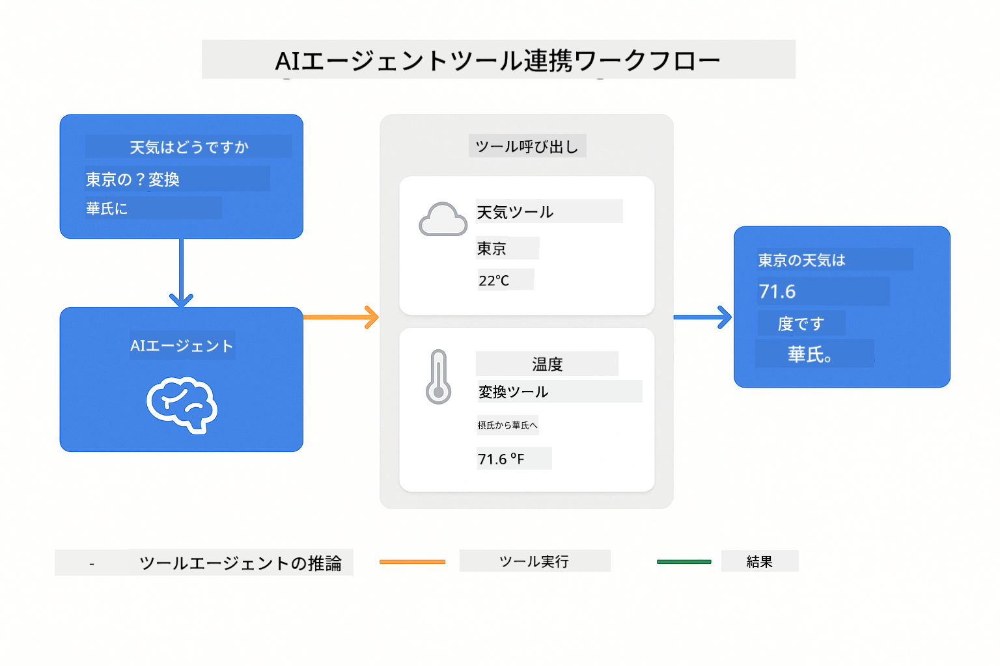
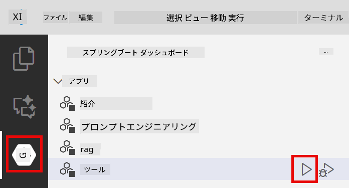

<!--
CO_OP_TRANSLATOR_METADATA:
{
  "original_hash": "aa23f106e7f53270924c9dd39c629004",
  "translation_date": "2025-12-13T18:34:45+00:00",
  "source_file": "04-tools/README.md",
  "language_code": "ja"
}
-->
# Module 04: ツールを使ったAIエージェント

## 目次

- [学習内容](../../../04-tools)
- [前提条件](../../../04-tools)
- [ツールを使ったAIエージェントの理解](../../../04-tools)
- [ツール呼び出しの仕組み](../../../04-tools)
  - [ツール定義](../../../04-tools)
  - [意思決定](../../../04-tools)
  - [実行](../../../04-tools)
  - [応答生成](../../../04-tools)
- [ツールチェイニング](../../../04-tools)
- [アプリケーションの実行](../../../04-tools)
- [アプリケーションの使用方法](../../../04-tools)
  - [シンプルなツール使用を試す](../../../04-tools)
  - [ツールチェイニングをテスト](../../../04-tools)
  - [会話の流れを見る](../../../04-tools)
  - [推論を観察する](../../../04-tools)
  - [さまざまなリクエストを試す](../../../04-tools)
- [重要な概念](../../../04-tools)
  - [ReActパターン（推論と行動）](../../../04-tools)
  - [ツールの説明が重要](../../../04-tools)
  - [セッション管理](../../../04-tools)
  - [エラー処理](../../../04-tools)
- [利用可能なツール](../../../04-tools)
- [ツールベースのエージェントを使うべき時](../../../04-tools)
- [次のステップ](../../../04-tools)

## 学習内容

これまで、AIとの会話方法、効果的なプロンプトの構造化、ドキュメントに基づく応答の基盤作りを学びました。しかし、根本的な制限があります。言語モデルはテキストを生成するだけで、天気を確認したり、計算を行ったり、データベースを照会したり、外部システムと連携したりできません。

ツールがこれを変えます。モデルに呼び出せる関数を与えることで、単なるテキスト生成器から行動を起こせるエージェントに変わります。モデルはいつツールが必要か、どのツールを使うか、どんなパラメータを渡すかを決定します。コードが関数を実行し結果を返します。モデルはその結果を応答に組み込みます。

## 前提条件

- Module 01を完了している（Azure OpenAIリソースがデプロイ済み）
- ルートディレクトリにAzure認証情報を含む`.env`ファイルがある（Module 01の`azd up`で作成）

> **注意:** Module 01を完了していない場合は、まずそちらのデプロイ手順に従ってください。

## ツールを使ったAIエージェントの理解

ツールを使うAIエージェントは推論と行動のパターン（ReAct）に従います：

1. ユーザーが質問する
2. エージェントが必要な情報を推論する
3. エージェントが回答にツールが必要か判断する
4. 必要なら適切なツールを正しいパラメータで呼び出す
5. ツールが実行されデータを返す
6. エージェントが結果を取り込み最終回答を提供する


*ReActパターン - AIエージェントが推論と行動を交互に行い問題を解決する仕組み*

これは自動的に行われます。あなたはツールとその説明を定義します。モデルがいつどのように使うかの意思決定を行います。

## ツール呼び出しの仕組み

**ツール定義** - [WeatherTool.java](../../../04-tools/src/main/java/com/example/langchain4j/agents/tools/WeatherTool.java) | [TemperatureTool.java](../../../04-tools/src/main/java/com/example/langchain4j/agents/tools/TemperatureTool.java)

明確な説明とパラメータ仕様を持つ関数を定義します。モデルはこれらの説明をシステムプロンプトで見て、各ツールの役割を理解します。

```java
@Component
public class WeatherTool {
    
    @Tool("Get the current weather for a location")
    public String getCurrentWeather(@P("Location name") String location) {
        // あなたの天気検索ロジック
        return "Weather in " + location + ": 22°C, cloudy";
    }
}

@AiService
public interface Assistant {
    String chat(@MemoryId String sessionId, @UserMessage String message);
}

// アシスタントはSpring Bootによって自動的に接続されています：
// - ChatModelビーン
// - @Componentクラスのすべての@Toolメソッド
// - セッション管理のためのChatMemoryProvider
```

> **🤖 [GitHub Copilot](https://github.com/features/copilot) Chatで試す:** [`WeatherTool.java`](../../../04-tools/src/main/java/com/example/langchain4j/agents/tools/WeatherTool.java)を開き、以下を質問してみてください：
> - 「モックデータの代わりにOpenWeatherMapのような実際の天気APIを統合するにはどうすればいいですか？」
> - 「AIが正しく使うために役立つ良いツール説明とは何ですか？」
> - 「ツール実装でAPIエラーやレート制限をどう扱いますか？」

**意思決定**

ユーザーが「シアトルの天気は？」と聞くと、モデルは天気ツールが必要と認識し、locationパラメータに「Seattle」をセットした関数呼び出しを生成します。

**実行** - [AgentService.java](../../../04-tools/src/main/java/com/example/langchain4j/agents/service/AgentService.java)

Spring Bootは宣言的な`@AiService`インターフェースを登録済みツールと自動でワイヤリングし、LangChain4jがツール呼び出しを自動実行します。

> **🤖 [GitHub Copilot](https://github.com/features/copilot) Chatで試す:** [`AgentService.java`](../../../04-tools/src/main/java/com/example/langchain4j/agents/service/AgentService.java)を開き、以下を質問してみてください：
> - 「ReActパターンはどう機能し、なぜAIエージェントに効果的なのですか？」
> - 「エージェントはどのツールを使うか、どの順番で使うかをどう決めますか？」
> - 「ツール実行が失敗したらどうなる？堅牢なエラー処理はどうすべきですか？」

**応答生成**

モデルは天気データを受け取り、ユーザー向けに自然言語で応答を整形します。

### なぜ宣言的AIサービスを使うのか？

このモジュールではLangChain4jのSpring Boot統合を使い、宣言的な`@AiService`インターフェースを利用しています：

- **Spring Bootの自動ワイヤリング** - ChatModelとツールが自動注入される
- **@MemoryIdパターン** - セッションベースのメモリ管理が自動化
- **シングルインスタンス** - アシスタントは一度作成され再利用されるため性能向上
- **型安全な実行** - Javaメソッドを型変換付きで直接呼び出し
- **マルチターンオーケストレーション** - ツールチェイニングを自動処理
- **ボイラープレートゼロ** - 手動のAiServices.builder()呼び出しやメモリHashMap不要

手動の`AiServices.builder()`を使う代替手法はコード量が増え、Spring Boot統合の利点を活かせません。

## ツールチェイニング

**ツールチェイニング** - AIは複数のツールを連続で呼び出すことがあります。「シアトルの天気は？傘を持つべき？」と聞くと、`getCurrentWeather`を呼び出し、雨具の必要性を推論しながらチェインします。

<a href="images/tool-chaining.png"></a>

*連続したツール呼び出し - あるツールの出力が次の意思決定に使われる*

**優雅な失敗** - モックデータにない都市の天気を尋ねると、ツールはエラーメッセージを返し、AIは助けられないことを説明します。ツールは安全に失敗します。

これは単一の会話ターンで起こり、エージェントが複数のツール呼び出しを自律的にオーケストレーションします。

## アプリケーションの実行

**デプロイ確認：**

ルートディレクトリにAzure認証情報を含む`.env`ファイルが存在することを確認（Module 01で作成）：
```bash
cat ../.env  # AZURE_OPENAI_ENDPOINT、API_KEY、DEPLOYMENTを表示する必要があります
```

**アプリケーション起動：**

> **注意:** Module 01の`./start-all.sh`で既に全アプリを起動済みなら、このモジュールはポート8084で動作中です。以下の起動コマンドはスキップして http://localhost:8084 に直接アクセスできます。

**オプション1: Spring Boot Dashboardを使う（VS Codeユーザー推奨）**

開発コンテナにはSpring Boot Dashboard拡張機能が含まれており、すべてのSpring Bootアプリを視覚的に管理できます。VS Codeの左側アクティビティバーにあるSpring Bootアイコンからアクセス可能です。

Dashboardからは：
- ワークスペース内のすべてのSpring Bootアプリを一覧表示
- ワンクリックでアプリの起動/停止
- リアルタイムのログ表示
- アプリの状態監視

「tools」の横の再生ボタンをクリックしてこのモジュールを起動、または全モジュールを一括起動できます。



**オプション2: シェルスクリプトを使う**

すべてのWebアプリ（モジュール01-04）を起動：

**Bash:**
```bash
cd ..  # ルートディレクトリから
./start-all.sh
```

**PowerShell:**
```powershell
cd ..  # ルートディレクトリから
.\start-all.ps1
```

またはこのモジュールだけ起動：

**Bash:**
```bash
cd 04-tools
./start.sh
```

**PowerShell:**
```powershell
cd 04-tools
.\start.ps1
```

両スクリプトはルートの`.env`ファイルから環境変数を自動読み込みし、JARがなければビルドします。

> **注意:** 起動前にすべてのモジュールを手動ビルドしたい場合：
>
> **Bash:**
> ```bash
> cd ..  # Go to root directory
> mvn clean package -DskipTests
> ```
>
> **PowerShell:**
> ```powershell
> cd ..  # Go to root directory
> mvn clean package -DskipTests
> ```

ブラウザで http://localhost:8084 を開いてください。

**停止方法：**

**Bash:**
```bash
./stop.sh  # このモジュールのみ
# または
cd .. && ./stop-all.sh  # すべてのモジュール
```

**PowerShell:**
```powershell
.\stop.ps1  # このモジュールのみ
# または
cd ..; .\stop-all.ps1  # すべてのモジュール
```

## アプリケーションの使用方法

このアプリは天気と温度変換ツールにアクセスできるAIエージェントと対話できるWebインターフェースを提供します。

<a href="images/tools-homepage.png"></a>

*AIエージェントツールインターフェース - ツールとの対話用チャットとクイック例*

**シンプルなツール使用を試す**

「100度華氏を摂氏に変換して」といった単純なリクエストから始めましょう。エージェントは温度変換ツールが必要と認識し、正しいパラメータで呼び出し結果を返します。どのツールを使うかや呼び出し方法を指定しなくても自然に感じられます。

**ツールチェイニングをテスト**

次に複雑な例を試します：「シアトルの天気は？それを華氏に変換して」と。エージェントは段階的に処理します。まず天気（摂氏）を取得し、華氏に変換する必要があると認識し、変換ツールを呼び出し、両方の結果をまとめて応答します。

**会話の流れを見る**

チャットインターフェースは会話履歴を保持し、マルチターンの対話が可能です。過去の質問と応答をすべて確認でき、複数回のやり取りでエージェントがどのように文脈を構築しているか理解しやすくなっています。

<a href="images/tools-conversation-demo.png"></a>

*シンプルな変換、天気検索、ツールチェイニングを含むマルチターン会話*

**さまざまなリクエストを試す**

以下のような組み合わせを試してください：
- 天気検索：「東京の天気は？」
- 温度変換：「25°Cはケルビンでいくつ？」
- 複合クエリ：「パリの天気を調べて20°C以上か教えて」

エージェントが自然言語を解釈し適切なツール呼び出しにマッピングする様子がわかります。

## 重要な概念

**ReActパターン（推論と行動）**

エージェントは推論（何をすべきか決める）と行動（ツールを使う）を交互に行います。このパターンにより指示に応答するだけでなく自律的に問題解決が可能になります。

**ツールの説明が重要**

ツールの説明の質がエージェントの利用精度に直結します。明確で具体的な説明がモデルにいつどのようにツールを呼び出すか理解させます。

**セッション管理**

`@MemoryId`アノテーションによりセッションベースのメモリ管理が自動化されます。各セッションIDに対して`ChatMemory`インスタンスが`ChatMemoryProvider`ビーンで管理され、手動でメモリを追跡する必要がなくなります。

**エラー処理**

ツールは失敗することがあります - APIタイムアウト、無効なパラメータ、外部サービス停止など。実運用のエージェントはエラー処理が必要で、モデルが問題を説明したり代替手段を試したりできるようにします。

## 利用可能なツール

**天気ツール**（デモ用モックデータ）：
- 指定場所の現在の天気取得
- 複数日間の天気予報取得

**温度変換ツール**：
- 摂氏から華氏
- 華氏から摂氏
- 摂氏からケルビン
- ケルビンから摂氏
- 華氏からケルビン
- ケルビンから華氏

これらは単純な例ですが、このパターンはデータベース照会、API呼び出し、計算、ファイル操作、システムコマンドなどあらゆる関数に拡張可能です。

## ツールベースのエージェントを使うべき時

**ツールを使うべき場合：**
- リアルタイムデータが必要な回答（天気、株価、在庫など）
- 単純な数学を超えた計算が必要な場合
- データベースやAPIにアクセスする場合
- 行動を起こす場合（メール送信、チケット作成、レコード更新など）
- 複数のデータソースを組み合わせる場合

**ツールを使わない方が良い場合：**
- 一般知識から回答できる質問
- 応答が純粋に会話的な場合
- ツールの遅延が体験を遅くする場合

## 次のステップ

**次のモジュール:** [05-mcp - モデルコンテキストプロトコル (MCP)](../05-mcp/README.md)

---

**ナビゲーション:** [← 前へ: Module 03 - RAG](../03-rag/README.md) | [メインへ戻る](../README.md) | [次へ: Module 05 - MCP →](../05-mcp/README.md)

---

<!-- CO-OP TRANSLATOR DISCLAIMER START -->
**免責事項**：  
本書類はAI翻訳サービス「Co-op Translator」（https://github.com/Azure/co-op-translator）を使用して翻訳されました。正確性の向上に努めておりますが、自動翻訳には誤りや不正確な部分が含まれる可能性があります。原文の言語による文書が正式な情報源とみなされるべきです。重要な情報については、専門の人間による翻訳を推奨します。本翻訳の利用により生じた誤解や誤訳について、当方は一切の責任を負いかねます。
<!-- CO-OP TRANSLATOR DISCLAIMER END -->