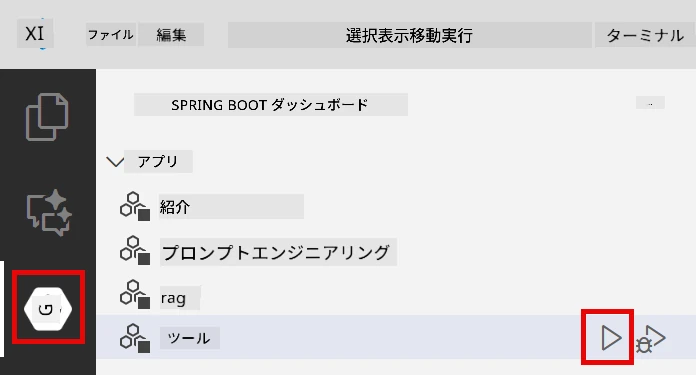
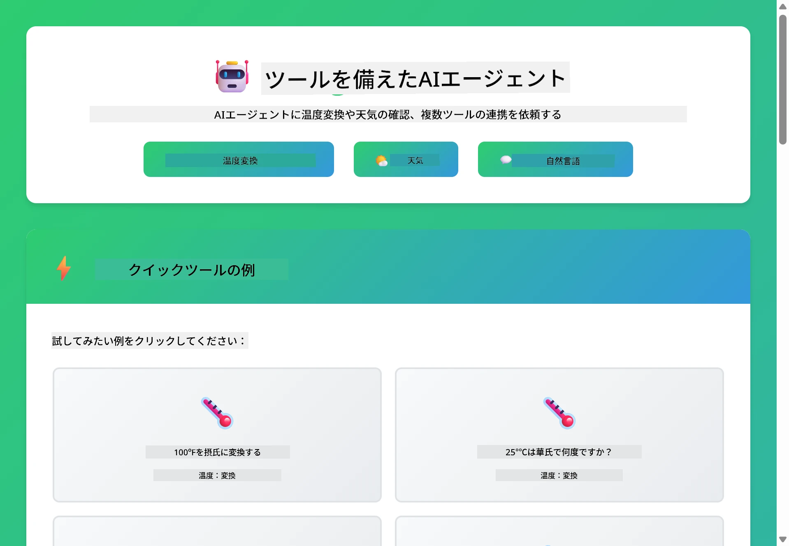
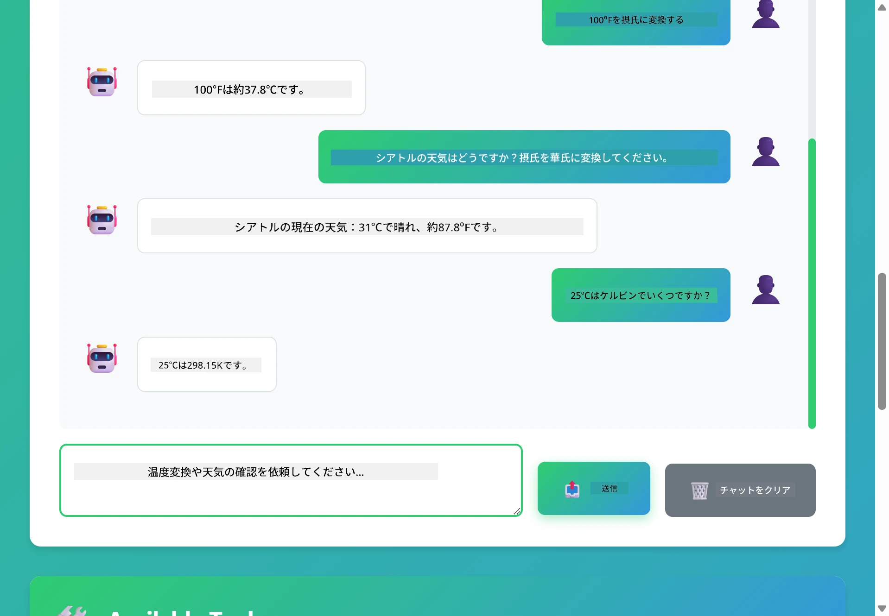

# Module 04: ツールを使用したAIエージェント

## 目次

- [ビデオウォークスルー](#ビデオウォークスルー)
- [学習内容](#学習内容)
- [前提条件](#前提条件)
- [ツールを使用したAIエージェントの理解](#ツールを使用したaiエージェントの理解)
- [ツール呼び出しの仕組み](#ツール呼び出しの仕組み)
  - [ツール定義](#ツール定義)
  - [意思決定](#意思決定)
  - [実行](#実行)
  - [レスポンス生成](#レスポンス生成)
  - [アーキテクチャ：Spring Bootの自動ワイヤリング](#アーキテクチャ：spring-bootの自動ワイヤリング)
- [ツールチェイニング](#ツールチェイニング)
- [アプリケーションを実行する](#アプリケーションを実行する)
- [アプリケーションの使用方法](#アプリケーションの使用)
  - [シンプルなツール使用を試す](#シンプルなツール使用を試す)
  - [ツールチェイニングをテストする](#ツールチェーンを試す)
  - [会話の流れを見る](#会話フローを見る)
  - [さまざまなリクエストを試す](#さまざまなリクエストを試す)
- [重要な概念](#重要なコンセプト)
  - [ReActパターン（Reasoning and Acting）](#reactパターン（推論と行動）)
  - [ツールの説明が重要](#ツールの説明が重要)
  - [セッション管理](#セッション管理)
  - [エラーハンドリング](#エラーハンドリング)
- [利用可能なツール](#利用可能なツール)
- [ツールベースのエージェントを使うべき場合](#ツールベースエージェントを使うべき場合)
- [ツールとRAGの比較](#ツール-vs-rag)
- [次のステップ](#次のステップ)

## ビデオウォークスルー

このモジュールの開始方法を説明するライブセッションをご覧ください：

<a href="https://www.youtube.com/watch?v=O_J30kZc0rw"></a>

## 学習内容

これまでに、AIとの会話方法、効果的なプロンプトの構造化、ドキュメントに基づく応答方法を学びました。しかし、根本的な制約がまだあります：言語モデルはテキストしか生成できません。天気を確認したり、計算をしたり、データベースを照会したり、外部システムと連携したりはできません。

ツールがこれを変えます。モデルに呼び出せる関数へのアクセス権を与えることで、単なるテキスト生成器から、行動できるエージェントへと変わります。モデルはいつツールが必要か、どのツールを使うか、どのパラメーターを渡すかを決定します。コードは関数を実行し結果を返却します。モデルはその結果を応答に組み込みます。

## 前提条件

- [Module 01 - Introduction](../01-introduction/README.md) を完了していること（Azure OpenAIリソースがデプロイ済み）
- これまでのモジュールを推奨（本モジュールでは [Module 03のRAGコンセプト](../03-rag/README.md) をツールとRAGの比較で参照）
- ルートディレクトリにAzure認証情報を含む `.env` ファイルがあること（Module 01の `azd up` により作成）

> **注意:** Module 01を完了していない場合は、まずそこでのデプロイ手順に従ってください。

## ツールを使用したAIエージェントの理解

> **📝 注記:** 本モジュールの「エージェント」とは、ツール呼び出し機能が強化されたAIアシスタントを指します。これは [Module 05: MCP](../05-mcp/README.md) で扱う **Agentic AI**（計画、記憶、多段推論を持つ自律的エージェント）とは異なります。

ツール無しでは、言語モデルは訓練データからテキストを生成するだけです。現在の天気を聞かれても推測して答えます。ツールを与えると、天気APIを呼び出したり、計算したり、データベースを照会したりでき、実際の結果を応答に織り込めます。


*ツールなしではモデルは推測のみ。ツールがあればAPI呼び出し、計算実行、リアルタイムデータの返却が可能。*

ツールを持つAIエージェントは **Reasoning and Acting (ReAct)** パターンをたどります。モデルはただ返答するのではなく、必要なものを考え、ツールを呼び出して行動し、結果を観察し、再度行動するか最終回答を出すかを決めます：

1. **Reason** — エージェントはユーザーの質問を分析し必要な情報を判断
2. **Act** — 適切なツールを選び、正しいパラメーターを生成して呼び出す
3. **Observe** — ツールの出力を受け取り結果を評価
4. **Repeat or Respond** — さらに情報が必要ならループし、そうでなければ自然言語の答えを作成


*ReActサイクル — エージェントは何をすべきか推論し、ツールを呼び出して行動し、結果を観察し、最終回答を返すまで繰り返す。*

これは自動的に行われます。ツールと説明を定義すれば、モデルがいつどのように使うかの意思決定を自動で行います。

## ツール呼び出しの仕組み

### ツール定義

[WeatherTool.java](../../../04-tools/src/main/java/com/example/langchain4j/agents/tools/WeatherTool.java) | [TemperatureTool.java](../../../04-tools/src/main/java/com/example/langchain4j/agents/tools/TemperatureTool.java)

関数を明確な説明とパラメーター仕様で定義します。モデルはこれらの説明をシステムプロンプトで確認し、各ツールの役割を理解します。

```java
@Component
public class WeatherTool {
    
    @Tool("Get the current weather for a location")
    public String getCurrentWeather(@P("Location name") String location) {
        // あなたの天気検索ロジック
        return "Weather in " + location + ": 22°C, cloudy";
    }
}

@AiService
public interface Assistant {
    String chat(@MemoryId String sessionId, @UserMessage String message);
}

// アシスタントはSpring Bootによって自動的に接続されています:
// - ChatModelビーン
// - @Componentクラスのすべての@Toolメソッド
// - セッション管理用のChatMemoryProvider
```

以下の図は全てのアノテーションを分解し、AIがツールをいつ呼び出すべきかや渡す引数を理解する仕組みを示しています：


*ツール定義の構造 — @ToolはAIに使用タイミングを示し、@Pは各パラメーターを説明。@AiServiceは起動時に全てをワイヤリング。*

> **🤖 [GitHub Copilot](https://github.com/features/copilot) Chatで試す:** [`WeatherTool.java`](../../../04-tools/src/main/java/com/example/langchain4j/agents/tools/WeatherTool.java) を開き、以下を質問：
> - 「モックデータの代わりにOpenWeatherMapのような実際の天気APIを統合するには？」
> - 「AIが正しく使うための良いツール説明は何か？」
> - 「ツール実装でAPIエラーやレート制限をどう扱う？」

### 意思決定

ユーザーが「シアトルの天気は？」と尋ねたら、モデルはツールを無作為に選びません。ユーザーの意図を全ツールの説明ごとに比較し、関連度をスコア付けし、最適なものを選択します。そして適切なパラメーター（例：`location`に`"Seattle"`）を設定した構造化関数呼び出しを生成します。

どのツールも合致しなければ、モデルは自身の知識から回答します。複数候補があれば最も具体的なものを選びます。


*モデルはユーザーの意図と全ツールを評価し最適なものを選択。だから明確で具体的な説明が重要。*

### 実行

[AgentService.java](../../../04-tools/src/main/java/com/example/langchain4j/agents/service/AgentService.java)

Spring Bootは宣言的な`@AiService`インターフェイスを全ツールと自動でワイヤリングし、LangChain4jはツール呼び出しを自動実行します。内部的には、ユーザーの自然言語から最終応答まで6段階のフローがあります：


*エンドツーエンドの流れ — ユーザーの質問からモデルがツール選択し、LangChain4jが実行し、結果を自然言語応答に織り込む。*

内部では`AiServices`が単純な`Calculator`でもツール呼び出しループを走らせます。以下のシーケンス図は詳細を示します：


*ツール呼び出しループ — `AiServices`はメッセージとスキーマをLLMに送り、LLMは`add(42, 58)`のような関数呼び出しを返し、LangChain4jがローカル実行し結果をLLMへ返す。*

> **🤖 [GitHub Copilot](https://github.com/features/copilot) Chatで試す:** [`AgentService.java`](../../../04-tools/src/main/java/com/example/langchain4j/agents/service/AgentService.java) で以下を質問：
> - 「ReActパターンはどう動作しなぜAIエージェントに有効か？」
> - 「エージェントはどのツールをどの順序で使うかどうやって決める？」
> - 「ツール実行が失敗した場合どうなる？堅牢なエラーハンドリングは？」

### レスポンス生成

モデルは天気データを受け取り、ユーザー向けに自然言語でフォーマットします。

### アーキテクチャ：Spring Bootの自動ワイヤリング

本モジュールはLangChain4jのSpring Boot統合を使い、宣言的な`@AiService`インターフェイスを利用。起動時にSpring Bootは`@Tool`を含む全`@Component`、あなたの`ChatModel`ビーン、`ChatMemoryProvider`を検知し、単一の`Assistant`インターフェイスにワイヤリングします。ボイラープレートは不要です。


*@AiServiceインターフェイスはChatModel、ツールコンポーネント、メモリプロバイダーを結合し、Spring Bootが全てのワイヤリングを自動処理。*

以下はHTTPリクエストからコントローラー、サービス、自動ワイヤリングプロキシ経由でツール実行までの完全なリクエストライフサイクルを示すシーケンス図です：


*完全なSpring Bootリクエストライフサイクル — HTTPリクエストがコントローラーとサービスを通り、自動ワイヤリングされたAssistantプロキシがLLMとツール呼び出しをオーケストレーション。*

この方式の主な利点：

- **Spring Boot自動ワイヤリング** — ChatModelとツールを自動注入
- **@MemoryIdパターン** — セッションベースのメモリ管理を自動化
- <strong>シングルインスタンス</strong> — Assistantを一度作成し性能向上のため再利用
- <strong>型安全な実行</strong> — Javaメソッドを型変換して直接呼び出し
- <strong>マルチターンオーケストレーション</strong> — ツールチェイニングを自動処理
- <strong>ボイラープレートゼロ</strong> — 手動での `AiServices.builder()` やメモリのHashMapは不要

手動の `AiServices.builder()` のような代替手法はコード量が増え、Spring Bootの統合メリットを享受できません。

## ツールチェイニング

<strong>ツールチェイニング</strong> — ツールベースエージェントの真骨頂は、単一の質問に複数ツールを連携して使う場合に発揮されます。「シアトルの華氏での天気は？」と尋ねると、エージェントは自動的に2つのツールを連結します：まず`getCurrentWeather`で摂氏温度を得て、それを`celsiusToFahrenheit`に渡し変換し、一度の会話ターンで答えを返します。


*ツールチェイニングの実例 — まずgetCurrentWeatherを呼び、摂氏結果をcelsiusToFahrenheitに渡し連結した答えを返す。*

<strong>優雅な失敗処理</strong> — モックデータにない都市の天気を聞くと、ツールはエラーメッセージを返し、AIはクラッシュする代わりに助けられない旨を説明します。ツールは安全に失敗します。以下の図は2つのアプローチを比較：適切なエラーハンドリングありの場合はエージェントが例外を捕捉し親切に応答、一方で無しの場合はアプリ全体がクラッシュ：


*ツールが失敗するとエージェントはエラーを捕捉し、クラッシュせずに役立つ説明で応答。*

これは一つの会話ターンで発生します。エージェントは複数ツール呼び出しを自律的にオーケストレーションします。

## アプリケーションを実行する

**デプロイの確認：**

ルートディレクトリにAzure認証情報入りの`.env`ファイルがあることを確認してください（Module 01で作成済み）。モジュールディレクトリ(`04-tools/`)から以下を実行：

**Bash:**
```bash
cat ../.env  # AZURE_OPENAI_ENDPOINT、API_KEY、DEPLOYMENT を表示する必要があります
```

**PowerShell:**
```powershell
Get-Content ..\.env  # AZURE_OPENAI_ENDPOINT、API_KEY、DEPLOYMENTを表示する必要があります
```

**アプリケーションの起動：**

> **注意:** 既にルートディレクトリの `./start-all.sh` から全アプリを起動済みなら（Module 01で説明）、このモジュールはポート8084で動作中です。以下の起動コマンドはスキップして http://localhost:8084 に直接アクセス可能です。

**オプション1: Spring Bootダッシュボードの使用（VS Codeユーザー推奨）**

DevコンテナにはSpring Bootダッシュボード拡張機能が含まれており、全Spring Bootアプリを視覚的に管理可能です。VS Codeの左側アクティビティバーにSpring Bootアイコンがあります。

Spring Bootダッシュボードからは：
- ワークスペース内の全Spring Bootアプリを確認
- クリック一つでアプリ起動／停止
- アプリログをリアルタイム表示
- アプリ状態を監視

"tools" の横の再生ボタンをクリックすればこのモジュールが起動します。全モジュールを一括起動も可能です。

以下はVS CodeでのSpring Bootダッシュボードの様子です：


*VS CodeのSpring Bootダッシュボード — すべてのモジュールを一箇所で起動、停止、監視*

**オプション2: シェルスクリプトの使用**

すべてのウェブアプリケーション（モジュール01-04）を起動：

**Bash:**
```bash
cd ..  # ルートディレクトリから
./start-all.sh
```

**PowerShell:**
```powershell
cd ..  # ルートディレクトリから
.\start-all.ps1
```

またはこのモジュールだけ起動：

**Bash:**
```bash
cd 04-tools
./start.sh
```

**PowerShell:**
```powershell
cd 04-tools
.\start.ps1
```

両方のスクリプトはルートの`.env`ファイルから環境変数を自動的に読み込み、JARが存在しない場合はビルドします。

> **注意:** 起動前にすべてのモジュールを手動でビルドしたい場合：
>
> **Bash:**
> ```bash
> cd ..  # Go to root directory
> mvn clean package -DskipTests
> ```

> **PowerShell:**
> ```powershell
> cd ..  # Go to root directory
> mvn clean package -DskipTests
> ```

ブラウザで http://localhost:8084 を開いてください。

**停止するには：**

**Bash:**
```bash
./stop.sh  # このモジュールのみ
# または
cd .. && ./stop-all.sh  # すべてのモジュール
```

**PowerShell:**
```powershell
.\stop.ps1  # このモジュールのみ
# または
cd ..; .\stop-all.ps1  # すべてのモジュール
```

## アプリケーションの使用

このアプリケーションは、天気や温度変換ツールにアクセス可能なAIエージェントと対話できるウェブインターフェースを提供します。インターフェースは以下のようなもので、クイックスタート例やリクエストを送るためのチャットパネルが含まれています：

<a href="images/tools-homepage.png"></a>

*AIエージェントツールのインターフェース - クイック例とツールとの対話用チャットインターフェース*

### シンプルなツール使用を試す

単純なリクエスト「100度華氏を摂氏に変換してください」から始めてみましょう。エージェントは温度変換ツールを使う必要があることを認識し、正しいパラメータで呼び出して結果を返します。どのツールを使うかや呼び出し方を指定しなくても自然に機能するのが分かります。

### ツールチェーンを試す

次により複雑な例：「シアトルの天気はどうですか？そしてそれを華氏に変換してください」を試してみましょう。エージェントが段階的に処理する様子が見られます。まず天気情報（摂氏で返される）を取得し、次に華氏に変換する必要があると判断し変換ツールを呼び、両方の結果を組み合わせて応答します。

### 会話フローを見る

チャットインターフェースは会話履歴を維持し、複数ターンの対話を可能にします。すべての前回の質問と回答を確認できるため、会話の流れを追いやすく、複数のやり取りによるコンテキスト構築が理解しやすくなっています。

<a href="images/tools-conversation-demo.png"></a>

*シンプルな変換、天気確認、ツールチェーンを示す複数ターン会話例*

### さまざまなリクエストを試す

以下のような組み合わせを試してみてください：
- 天気確認：「東京の天気は？」
- 温度変換：「25°Cはケルビンでいくつ？」
- 複合クエリ：「パリの天気を調べて、20°Cを超えているか教えて」

エージェントが自然言語を解釈し、適切なツール呼び出しにマッピングする様子がわかります。

## 重要なコンセプト

### ReActパターン（推論と行動）

エージェントは推論（何をすべきか決定）と行動（ツールの使用）を交互に行います。このパターンにより、単なる指示への応答ではなく自律的な問題解決が可能になります。

### ツールの説明が重要

ツールの説明の質が高いと、エージェントがそれらを使う精度が向上します。分かりやすく具体的な説明はモデルがいつどのようにツールを呼び出すか理解するのに役立ちます。

### セッション管理

`@MemoryId`アノテーションにより自動的なセッションベースのメモリ管理が可能です。各セッションIDに`ChatMemory`インスタンスが割り当てられ、`ChatMemoryProvider`ビーンが管理するため、複数ユーザーが同時にエージェントと対話しても会話が混ざりません。以下の図はセッションIDごとに別々のメモリストアにルーティングされる様子を示しています：


*各セッションIDは独立した会話履歴に対応—ユーザーは互いのメッセージを決して見ません。*

### エラーハンドリング

ツールは失敗することがあります — APIのタイムアウト、パラメータの不正、外部サービス障害など。実運用エージェントはエラーハンドリングを備え、モデルが問題を説明したり代替手段を試すことでアプリケーション全体のクラッシュを防ぎます。ツールが例外を投げた場合、LangChain4jはそれをキャッチしてエラーメッセージをモデルに返し、モデルは自然言語で問題を説明できます。

## 利用可能なツール

以下の図は構築可能なツールの広範なエコシステムを示しています。このモジュールでは天気と温度のツールを示しましたが、同じ`@Tool`パターンは任意のJavaメソッドに適用可能です—データベースクエリから決済処理まで幅広く使えます。


*@Toolアノテーション付きのJavaメソッドはAIに利用可能になり、このパターンはデータベース、API、メール、ファイル操作などにも拡張可能です。*

## ツールベースエージェントを使うべき場合

すべてのリクエストにツールが必要なわけではありません。外部システムとやり取りが必要か、またはAI自身の知識だけで答えられるかで決まります。以下のガイドはツールが価値を発揮する場合と不要な場合の目安を示しています：


*簡単な判断ガイド — ツールはリアルタイムデータ、計算、アクション時に使い、一般知識や創造的なタスクには不要です。*

## ツール vs RAG

モジュール03と04はどちらもAIの能力を拡張しますが、基本的に異なる方法です。RAGはドキュメントの<strong>知識</strong>にアクセスさせます。ツールは関数を呼び出して<strong>行動</strong>を取らせます。以下の図はこれら両者の比較で、ワークフローの違いからトレードオフまで示しています：


*RAGは静的ドキュメントから情報を取得—ツールはアクションを実行し動的なリアルタイムデータを取得。多くの本番システムは両者を併用しています。*

実際、多くの本番システムではRAGでドキュメントに基づいた回答を行い、ツールでライブデータ取得や操作を行う両アプローチの組み合わせを採用しています。

## 次のステップ

**次のモジュール:** [05-mcp - Model Context Protocol (MCP)](../05-mcp/README.md)

---

**ナビゲーション:** [← 前へ: Module 03 - RAG](../03-rag/README.md) | [メインへ戻る](../README.md) | [次へ: Module 05 - MCP →](../05-mcp/README.md)

---

<!-- CO-OP TRANSLATOR DISCLAIMER START -->
**免責事項**：
本書類は AI 翻訳サービス [Co-op Translator](https://github.com/Azure/co-op-translator) を使用して翻訳されています。正確性を期していますが、自動翻訳には誤りや不正確な部分が含まれる可能性があることをご承知おきください。原文の原語版が正式な情報源とみなされるべきです。重要な情報については、専門の人間による翻訳を推奨します。本翻訳の利用により生じたいかなる誤解や解釈違いについても、当方は責任を負いかねます。
<!-- CO-OP TRANSLATOR DISCLAIMER END -->