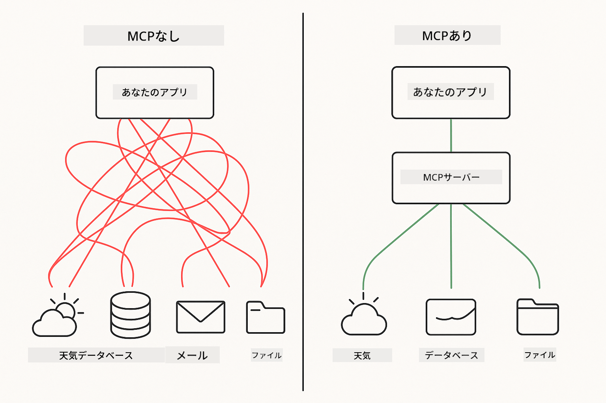
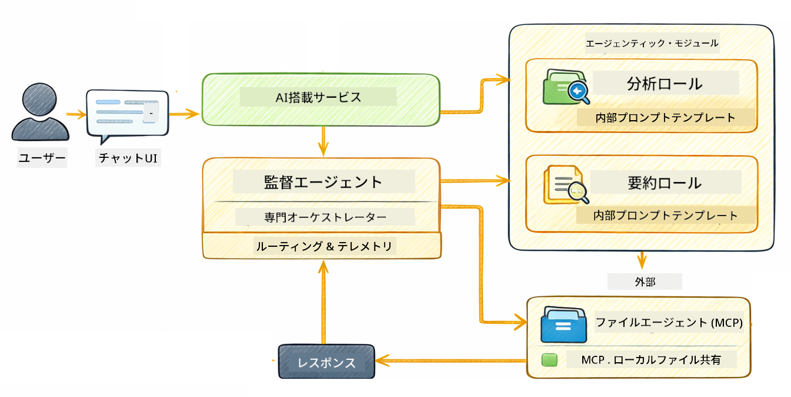

<!--
CO_OP_TRANSLATOR_METADATA:
{
  "original_hash": "f89f4c106d110e4943c055dd1a2f1dff",
  "translation_date": "2025-12-30T21:58:04+00:00",
  "source_file": "05-mcp/README.md",
  "language_code": "ja"
}
-->
# モジュール 05: モデルコンテキストプロトコル (MCP)

## 目次

- [このモジュールで学ぶこと](../../../05-mcp)
- [MCPとは？](../../../05-mcp)
- [MCPの仕組み](../../../05-mcp)
- [エージェニックモジュール](../../../05-mcp)
- [サンプルの実行](../../../05-mcp)
  - [前提条件](../../../05-mcp)
- [クイックスタート](../../../05-mcp)
  - [ファイル操作（Stdio）](../../../05-mcp)
  - [スーパーバイザーエージェント](../../../05-mcp)
    - [出力の理解](../../../05-mcp)
    - [エージェニックモジュール機能の説明](../../../05-mcp)
- [重要な概念](../../../05-mcp)
- [おめでとうございます！](../../../05-mcp)
  - [次に進むことは？](../../../05-mcp)

## このモジュールで学ぶこと

会話型AIを構築し、プロンプトを習得し、ドキュメントに基づいた応答を実現し、ツールを備えたエージェントを作成しました。しかしそれらのツールはすべて特定のアプリケーション向けにカスタム構築されたものでした。AI に誰でも作成・共有できる標準化されたツールのエコシステムへのアクセスを与えられるとしたらどうでしょうか？このモジュールでは、Model Context Protocol (MCP) と LangChain4j のエージェニックモジュールを使ってそれを実現する方法を学びます。まずシンプルな MCP ファイルリーダーを紹介し、次に Supervisor Agent パターンを使った高度なエージェニックワークフローへの統合方法を示します。

## MCPとは？

Model Context Protocol (MCP) はまさにそのための標準的な方法を提供します — AI アプリケーションが外部ツールを発見して利用するための標準的な手段です。各データソースやサービスごとにカスタム統合を書く代わりに、機能を一貫した形式で公開する MCP サーバーに接続します。AI エージェントはこれらのツールを自動的に発見して使用できます。



*MCP導入前: 複雑なポイント対ポイントの統合。MCP導入後: 1つのプロトコルで無限の可能性。*

MCP は AI 開発における根本的な問題を解決します: すべての統合がカスタムであること。GitHub にアクセスしたい？カスタムコード。ファイルを読みたい？カスタムコード。データベースを照会したい？カスタムコード。そしてこれらの統合は他の AI アプリケーションと互換性がありません。

MCP はこれを標準化します。MCP サーバーは明確な説明とスキーマを持つツールを公開します。任意の MCP クライアントは接続して利用可能なツールを発見し、使用できます。一度構築すれば、どこでも再利用できます。


*モデルコンテキストプロトコルのアーキテクチャ - 標準化されたツールの発見と実行*

## MCPの仕組み

**サーバー–クライアントアーキテクチャ**

MCP はクライアント–サーバーモデルを使用します。サーバーはファイルの読み取り、データベースの照会、API 呼び出しなどのツールを提供します。クライアント（あなたの AI アプリケーション）はサーバーに接続してそのツールを使用します。

LangChain4j で MCP を使うには、この Maven 依存関係を追加します:

```xml
<dependency>
    <groupId>dev.langchain4j</groupId>
    <artifactId>langchain4j-mcp</artifactId>
    <version>${langchain4j.version}</version>
</dependency>
```

**ツールの発見**

クライアントが MCP サーバーに接続すると、「どんなツールがありますか？」と問い合わせます。サーバーは利用可能なツールの一覧を返し、それぞれに説明とパラメータスキーマがあります。AI エージェントはユーザーの要求に基づいてどのツールを使うかを判断できます。

**トランスポート機構**

MCP はさまざまなトランスポート機構をサポートします。このモジュールではローカルプロセス向けの Stdio トランスポートを示します:


*MCP トランスポート機構: リモートサーバー向けの HTTP、ローカルプロセス向けの Stdio*

**Stdio** - [StdioTransportDemo.java](../../../05-mcp/src/main/java/com/example/langchain4j/mcp/StdioTransportDemo.java)

ローカルプロセス向けです。アプリケーションはサーバーをサブプロセスとして起動し、標準入力/出力を介して通信します。ファイルシステムアクセスやコマンドラインツールに便利です。

```java
McpTransport stdioTransport = new StdioMcpTransport.Builder()
    .command(List.of(
        npmCmd, "exec",
        "@modelcontextprotocol/server-filesystem@2025.12.18",
        resourcesDir
    ))
    .logEvents(false)
    .build();
```

> **🤖 [GitHub Copilot](https://github.com/features/copilot) Chat で試す:** [`StdioTransportDemo.java`](../../../05-mcp/src/main/java/com/example/langchain4j/mcp/StdioTransportDemo.java) を開いて、以下を尋ねてみてください:
> - "Stdio トランスポートはどのように動作し、HTTP と比べていつ使うべきですか？"
> - "LangChain4j は起動した MCP サーバープロセスのライフサイクルをどのように管理しますか？"
> - "AI にファイルシステムへのアクセスを許可することのセキュリティ上の影響は何ですか？"

## エージェニックモジュール

MCP が標準化されたツールを提供する一方で、LangChain4j の **エージェニックモジュール** はそれらのツールをオーケストレーションするエージェントを宣言的に構築する方法を提供します。`@Agent` アノテーションと `AgenticServices` を使うことで、手続き的なコードではなくインターフェースを通じてエージェントの挙動を定義できます。

このモジュールでは、ユーザーの要求に応じてどのサブエージェントを呼び出すかを動的に決定する「スーパーバイザー」エージェントという高度なエージェニックAI手法である **Supervisor Agent** パターンを探索します。ここではサブエージェントの一つに MCP 駆動のファイルアクセス機能を与えることで、両方の概念を組み合わせます。

エージェニックモジュールを使用するには、次の Maven 依存関係を追加してください:

```xml
<dependency>
    <groupId>dev.langchain4j</groupId>
    <artifactId>langchain4j-agentic</artifactId>
    <version>${langchain4j.mcp.version}</version>
</dependency>
```

> **⚠️ 実験的:** `langchain4j-agentic` モジュールは **実験的** であり変更される可能性があります。安定した方法で AI アシスタントを構築するには、カスタムツールを用いた `langchain4j-core`（モジュール 04）を使用するのが確実です。

## サンプルの実行

### 前提条件

- Java 21+, Maven 3.9+
- Node.js 16+ と npm（MCP サーバー用）
- ルートディレクトリの `.env` ファイルに設定された環境変数:
  - **For StdioTransportDemo:** `GITHUB_TOKEN` （GitHub の個人アクセストークン）
  - **For SupervisorAgentDemo:** `AZURE_OPENAI_ENDPOINT`, `AZURE_OPENAI_API_KEY`, `AZURE_OPENAI_DEPLOYMENT`（モジュール 01-04 と同じ）
> **注:** まだ環境変数を設定していない場合は、手順については [Module 00 - Quick Start](../00-quick-start/README.md) を参照するか、ルートディレクトリで `.env.example` を `.env` にコピーして値を入力してください。

## クイックスタート

**VS Code を使う場合:** エクスプローラーで任意のデモファイルを右クリックして **"Run Java"** を選択するか、実行とデバッグパネルのランチ構成を使用してください（事前に `.env` ファイルにトークンを追加していることを確認してください）。

**Maven を使う場合:** 代わりに以下の例のようにコマンドラインから実行できます。

### ファイル操作（Stdio）

これはローカルサブプロセスベースのツールを示しています。

**✅ 前提条件不要** - MCP サーバーは自動的に起動されます。

**VS Code を使う場合:** `StdioTransportDemo.java` を右クリックして **"Run Java"** を選択します。

**Maven を使う場合:**

**Bash:**
```bash
export GITHUB_TOKEN=your_token_here
cd 05-mcp
mvn compile exec:java -Dexec.mainClass=com.example.langchain4j.mcp.StdioTransportDemo
```

**PowerShell:**
```powershell
$env:GITHUB_TOKEN=your_token_here
cd 05-mcp
mvn --% compile exec:java -Dexec.mainClass=com.example.langchain4j.mcp.StdioTransportDemo
```

アプリケーションはファイルシステム用の MCP サーバーを自動的に起動し、ローカルファイルを読み取ります。サブプロセス管理がどのように扱われるかに注目してください。

**期待される出力:**
```
Assistant response: The file provides an overview of LangChain4j, an open-source Java library
for integrating Large Language Models (LLMs) into Java applications...
```

### スーパーバイザーエージェント




**Supervisor Agent パターン** は **柔軟な** エージェニックAIの形式です。決定論的なワークフロー（順次、ループ、並列）とは異なり、スーパーバイザーはユーザーの要求に基づいてどのエージェントを呼び出すかを LLM によって自律的に決定します。

**Supervisor と MCP の組み合わせ:** この例では、`FileAgent` に `toolProvider(mcpToolProvider)` を介して MCP のファイルシステムツールへのアクセスを与えます。ユーザーが「ファイルを読み取って分析してほしい」と要求すると、スーパーバイザーはリクエストを解析して実行計画を生成します。そしてリクエストを `FileAgent` にルーティングし、`FileAgent` は MCP の `read_file` ツールで内容を取得します。スーパーバイザーはその内容を `AnalysisAgent` に渡して解釈させ、必要に応じて `SummaryAgent` を呼び出して結果を要約します。

これは MCP ツールがエージェニックワークフローにシームレスに統合される様子を示しています — スーパーバイザーはファイルが「どのように」読まれるかを知る必要はなく、単に `FileAgent` がそれを実行できることを知っていれば良いのです。スーパーバイザーはさまざまなタイプのリクエストに動的に適応し、最後のエージェントの応答か、すべての操作の要約を返します。

**スタートスクリプトの使用（推奨）:**

スタートスクリプトはルートの `.env` ファイルから自動的に環境変数を読み込みます:

**Bash:**
```bash
cd 05-mcp
chmod +x start.sh
./start.sh
```

**PowerShell:**
```powershell
cd 05-mcp
.\start.ps1
```

**VS Code を使う場合:** `SupervisorAgentDemo.java` を右クリックして **"Run Java"** を選択します（`.env` ファイルが設定されていることを確認してください）。

**スーパーバイザーの動作:**

```java
// 特定の能力を持つ複数のエージェントを定義する
FileAgent fileAgent = AgenticServices.agentBuilder(FileAgent.class)
        .chatModel(model)
        .toolProvider(mcpToolProvider)  // ファイル操作のためのMCPツールを持つ
        .build();

AnalysisAgent analysisAgent = AgenticServices.agentBuilder(AnalysisAgent.class)
        .chatModel(model)
        .build();

SummaryAgent summaryAgent = AgenticServices.agentBuilder(SummaryAgent.class)
        .chatModel(model)
        .build();

// これらのエージェントを統括するスーパーバイザーを作成する
SupervisorAgent supervisor = AgenticServices.supervisorBuilder()
        .chatModel(model)  // 「planner」モデル
        .subAgents(fileAgent, analysisAgent, summaryAgent)
        .responseStrategy(SupervisorResponseStrategy.SUMMARY)
        .build();

// スーパーバイザーはどのエージェントを呼び出すかを自律的に決定する
// 自然言語のリクエストを渡すだけで、LLMが実行計画を立てる
String response = supervisor.invoke("Read the file at /path/file.txt and analyze it");
```

完全な実装は [SupervisorAgentDemo.java](../../../05-mcp/src/main/java/com/example/langchain4j/mcp/SupervisorAgentDemo.java) を参照してください。

> **🤖 [GitHub Copilot](https://github.com/features/copilot) Chat で試す:** [`SupervisorAgentDemo.java`](../../../05-mcp/src/main/java/com/example/langchain4j/mcp/SupervisorAgentDemo.java) を開いて、以下を尋ねてみてください:
> - "スーパーバイザーはどのようにしてどのエージェントを呼び出すかを決定しますか？"
> - "スーパーバイザーと順次ワークフローパターンの違いは何ですか？"
> - "スーパーバイザーの計画動作をどのようにカスタマイズできますか？"

#### 出力の理解

デモを実行すると、スーパーバイザーが複数のエージェントをどのようにオーケストレーションするかの構造化されたウォークスルーが表示されます。各セクションが意味するところは次の通りです:

```
======================================================================
  SUPERVISOR AGENT DEMO
======================================================================

This demo shows how a Supervisor Agent orchestrates multiple specialized agents.
The Supervisor uses an LLM to decide which agent to call based on the task.
```

**ヘッダー** はデモを紹介し、コアコンセプトを説明します: スーパーバイザーは（ハードコードされたルールではなく）LLM を使って呼び出すエージェントを決定します。

```
--- AVAILABLE AGENTS -------------------------------------------------
  [FILE]     FileAgent     - Reads files using MCP filesystem tools
  [ANALYZE]  AnalysisAgent - Analyzes content for structure, tone, and themes
  [SUMMARY]  SummaryAgent  - Creates concise summaries of content
```

**利用可能なエージェント** は、スーパーバイザーが選択できる 3 つの専門エージェントを示します。各エージェントには特定の能力があります:
- **FileAgent** は MCP ツールを使ってファイルを読み取れます（外部機能）
- **AnalysisAgent** はコンテンツを分析します（純粋な LLM 機能）
- **SummaryAgent** は要約を作成します（純粋な LLM 機能）

```
--- USER REQUEST -----------------------------------------------------
  "Read the file at .../file.txt and analyze what it's about"
```

**ユーザーのリクエスト** は何が要求されたかを示します。スーパーバイザーはこれを解析してどのエージェントを呼び出すかを決定しなければなりません。

```
--- SUPERVISOR ORCHESTRATION -----------------------------------------
  The Supervisor will now decide which agents to invoke and in what order...

  +-- STEP 1: Supervisor chose -> FileAgent (reading file via MCP)
  |
  |   Input: .../file.txt
  |
  |   Result: LangChain4j is an open-source Java library designed to simplify...
  +-- [OK] FileAgent (reading file via MCP) completed

  +-- STEP 2: Supervisor chose -> AnalysisAgent (analyzing content)
  |
  |   Input: LangChain4j is an open-source Java library...
  |
  |   Result: Structure: The content is organized into clear paragraphs that int...
  +-- [OK] AnalysisAgent (analyzing content) completed
```

**スーパーバイザーのオーケストレーション** が魔法の起こる場所です。以下の点に注目してください:
1. スーパーバイザーはリクエストに「ファイルを読む」という言及があったため **最初に FileAgent を選択した**
2. FileAgent は MCP の `read_file` ツールを使ってファイル内容を取得した
3. スーパーバイザーはその後 **AnalysisAgent を選択し** ファイル内容を渡した
4. AnalysisAgent は構成、トーン、テーマを分析した

スーパーバイザーがユーザーのリクエストに基づいてこれらの決定を **自律的に** 下したことに注目してください — ワークフローはハードコードされていません！

**最終応答** はスーパーバイザーが合成した回答で、呼び出したすべてのエージェントの出力を組み合わせたものです。例では各エージェントが保存した要約と分析結果を示すエージェニックスコープのダンプを出力します。

```
--- FINAL RESPONSE ---------------------------------------------------
I read the contents of the file and analyzed its structure, tone, and key themes.
The file introduces LangChain4j as an open-source Java library for integrating
large language models...

--- AGENTIC SCOPE (Shared Memory) ------------------------------------
  Agents store their results in a shared scope for other agents to use:
  * summary: LangChain4j is an open-source Java library...
  * analysis: Structure: The content is organized into clear paragraphs that in...
```

### エージェニックモジュール機能の説明

この例ではエージェニックモジュールのいくつかの高度な機能を示しています。Agentic Scope と Agent Listeners を詳しく見てみましょう。

**Agentic Scope** はエージェントが `@Agent(outputKey="...")` を使って結果を保存した共有メモリを示します。これにより:
- あとから呼ばれるエージェントが先のエージェントの出力にアクセスできる
- スーパーバイザーが最終応答を合成できる
- 各エージェントが何を生成したかを検査できる

```java
ResultWithAgenticScope<String> result = supervisor.invokeWithAgenticScope(request);
AgenticScope scope = result.agenticScope();
String story = scope.readState("story");
List<AgentInvocation> history = scope.agentInvocations("analysisAgent");
```

**Agent Listeners** はエージェント実行の監視とデバッグを可能にします。デモで見るステップごとの出力は、各エージェント呼び出しにフックする AgentListener から来ています:
- **beforeAgentInvocation** - スーパーバイザーがエージェントを選択したときに呼ばれ、どのエージェントが選ばれ、なぜかを確認できます
- **afterAgentInvocation** - エージェントが完了したときに呼ばれ、その結果を表示します
- **inheritedBySubagents** - true の場合、リスナーは階層内のすべてのエージェントを監視します

```java
AgentListener monitor = new AgentListener() {
    private int step = 0;
    
    @Override
    public void beforeAgentInvocation(AgentRequest request) {
        step++;
        System.out.println("  +-- STEP " + step + ": " + request.agentName());
    }
    
    @Override
    public void afterAgentInvocation(AgentResponse response) {
        System.out.println("  +-- [OK] " + response.agentName() + " completed");
    }
    
    @Override
    public boolean inheritedBySubagents() {
        return true; // すべてのサブエージェントに伝播する
    }
};
```

スーパーバイザーパターン以外にも、`langchain4j-agentic` モジュールは強力なワークフローパターンや機能をいくつか提供します:

| パターン | 説明 | ユースケース |
|---------|-------------|----------|
| **Sequential** | エージェントを順番に実行し、出力が次に流れる | パイプライン: 調査 → 分析 → 報告 |
| **Parallel** | エージェントを同時に実行する | 独立タスク: 天気 + ニュース + 株価 |
| **Loop** | 条件が満たされるまで反復する | 品質スコアリング: スコア ≥ 0.8 まで改善 |
| **Conditional** | 条件に基づいてルーティングする | 分類 → 専門エージェントへルーティング |
| **Human-in-the-Loop** | 人間のチェックポイントを追加する | 承認ワークフロー、コンテンツレビュー |

## 重要な概念

**MCP** は既存のツールエコシステムを活用したい場合、複数のアプリケーションで共有できるツールを構築したい場合、標準プロトコルでサードパーティサービスを統合したい場合、またはコードを変更せずにツール実装を差し替えたい場合に最適です。

**エージェニックモジュール** は `@Agent` アノテーションによる宣言的エージェント定義が必要な場合、ワークフローオーケストレーション（順次、ループ、並列）が必要な場合、命令型コードよりインターフェースベースのエージェント設計を好む場合、または `outputKey` を介して出力を共有する複数のエージェントを組み合わせる場合に最適です。

**Supervisor Agent パターン** はワークフローが事前に予測できない場合や、複数の専門エージェントを動的にオーケストレーションしたい場合、異なる機能へルーティングする会話システムを構築する場合、または最も柔軟で適応性の高いエージェント挙動が欲しい場合に適しています。

## おめでとうございます！

LangChain4j for Beginners コースを修了しました。あなたは以下を学びました:

- メモリを備えた会話型AI の構築方法（モジュール 01）
- 様々なタスク向けのプロンプトエンジニアリングパターン（モジュール 02）
- RAG を使ったドキュメントに基づく応答の方法（モジュール 03）
- カスタムツールを持つ基本的な AI エージェント（アシスタント）の作成（モジュール 04）
- LangChain4j MCP と Agentic モジュールを使用した標準化されたツールの統合 (モジュール 05)

### 次は?

モジュールを完了したら、[テストガイド](../docs/TESTING.md)を参照して、LangChain4j のテスト概念が実際にどのように機能するかを確認してください。

**公式リソース:**
- [LangChain4j ドキュメント](https://docs.langchain4j.dev/) - 包括的なガイドと API リファレンス
- [LangChain4j GitHub](https://github.com/langchain4j/langchain4j) - ソースコードと例
- [LangChain4j チュートリアル](https://docs.langchain4j.dev/tutorials/) - 様々なユースケース向けのステップバイステップチュートリアル

このコースを修了していただき、ありがとうございます！

---

**ナビゲーション:** [← 前へ: モジュール 04 - ツール](../04-tools/README.md) | [メインへ戻る](../README.md)

---

<!-- CO-OP TRANSLATOR DISCLAIMER START -->
免責事項：
本書はAI翻訳サービス Co-op Translator（https://github.com/Azure/co-op-translator）を使用して翻訳されました。正確性には努めておりますが、自動翻訳には誤りや不正確な表現が含まれる場合があります。原文（原語版）を正式な出典（権威ある版）としてご確認ください。重要な情報については、専門の人間による翻訳を推奨します。本翻訳の利用により生じたいかなる誤解や誤訳についても、当方は責任を負いません。
<!-- CO-OP TRANSLATOR DISCLAIMER END -->