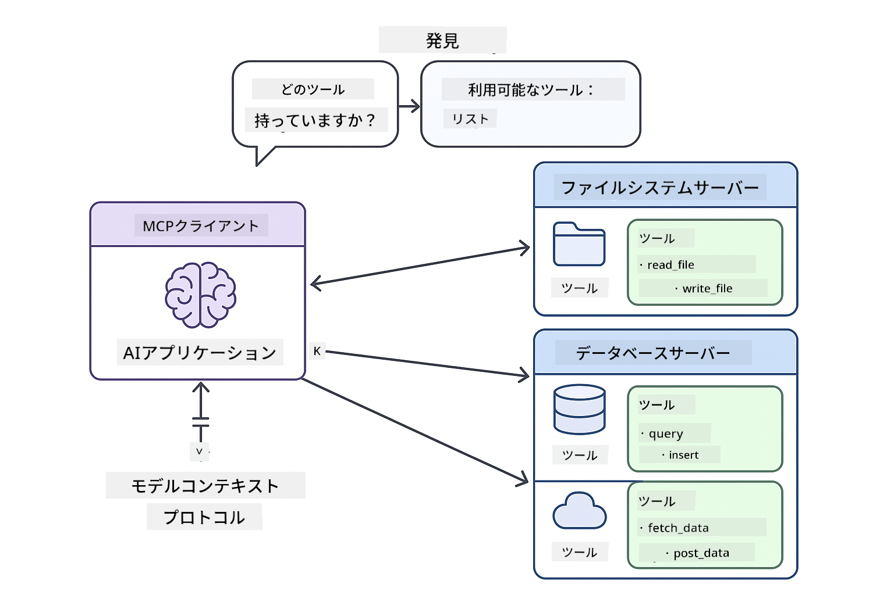
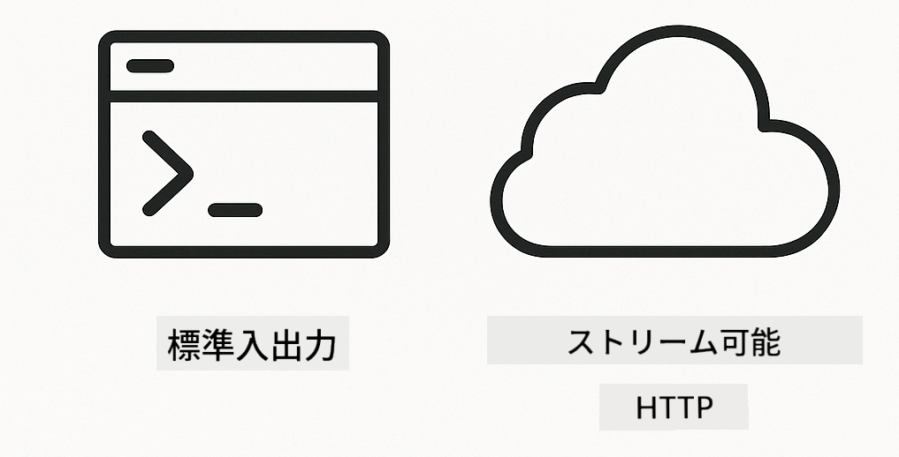

<!--
CO_OP_TRANSLATOR_METADATA:
{
  "original_hash": "c25ec1f10ef156c53e190cdf8b0711ab",
  "translation_date": "2025-12-13T17:42:49+00:00",
  "source_file": "05-mcp/README.md",
  "language_code": "ja"
}
-->
# Module 05: モデルコンテキストプロトコル (MCP)

## 目次

- [学習内容](../../../05-mcp)
- [MCPの理解](../../../05-mcp)
- [MCPの仕組み](../../../05-mcp)
  - [サーバークライアントアーキテクチャ](../../../05-mcp)
  - [ツールの発見](../../../05-mcp)
  - [トランスポートメカニズム](../../../05-mcp)
- [前提条件](../../../05-mcp)
- [このモジュールの内容](../../../05-mcp)
- [クイックスタート](../../../05-mcp)
  - [例1: リモート計算機（ストリーム可能なHTTP）](../../../05-mcp)
  - [例2: ファイル操作（Stdio）](../../../05-mcp)
  - [例3: Git解析（Docker）](../../../05-mcp)
- [重要な概念](../../../05-mcp)
  - [トランスポートの選択](../../../05-mcp)
  - [ツールの発見](../../../05-mcp)
  - [セッション管理](../../../05-mcp)
  - [クロスプラットフォームの考慮事項](../../../05-mcp)
- [MCPを使うべき時](../../../05-mcp)
- [MCPエコシステム](../../../05-mcp)
- [おめでとうございます！](../../../05-mcp)
  - [次に何をする？](../../../05-mcp)
- [トラブルシューティング](../../../05-mcp)

## 学習内容

あなたは会話型AIを構築し、プロンプトをマスターし、ドキュメントに基づいた応答を作成し、ツールを使ったエージェントを作成しました。しかし、それらのツールはすべて特定のアプリケーション向けにカスタム構築されたものでした。もし誰でも作成・共有できる標準化されたツールのエコシステムにAIがアクセスできたらどうでしょうか？

モデルコンテキストプロトコル（MCP）はまさにそれを提供します。AIアプリケーションが外部ツールを発見し利用するための標準的な方法です。各データソースやサービスごとにカスタム統合を書く代わりに、一貫した形式で機能を公開するMCPサーバーに接続します。AIエージェントはこれらのツールを自動的に発見し利用できます。


*MCP以前：複雑なポイントツーポイント統合。MCP以降：1つのプロトコルで無限の可能性。*

## MCPの理解

MCPはAI開発における根本的な問題を解決します：すべての統合がカスタムであること。GitHubにアクセスしたい？カスタムコード。ファイルを読みたい？カスタムコード。データベースをクエリしたい？カスタムコード。そしてこれらの統合は他のAIアプリケーションでは使えません。

MCPはこれを標準化します。MCPサーバーは明確な説明とスキーマを持つツールを公開します。どのMCPクライアントも接続し、利用可能なツールを発見し、使用できます。一度作ればどこでも使えます。



*モデルコンテキストプロトコルのアーキテクチャ - 標準化されたツールの発見と実行*

## MCPの仕組み

**サーバークライアントアーキテクチャ**

MCPはクライアントサーバーモデルを使用します。サーバーはファイル読み取り、データベースクエリ、API呼び出しなどのツールを提供します。クライアント（あなたのAIアプリケーション）はサーバーに接続し、そのツールを使用します。

**ツールの発見**

クライアントがMCPサーバーに接続すると、「どんなツールがありますか？」と尋ねます。サーバーは利用可能なツールのリストを説明とパラメータスキーマ付きで返します。AIエージェントはユーザーの要求に基づいてどのツールを使うか決定できます。

**トランスポートメカニズム**

MCPは2つのトランスポートメカニズムを定義します：リモートサーバー用のHTTP、ローカルプロセス（Dockerコンテナ含む）用のStdio：



*MCPトランスポートメカニズム：リモートサーバー用HTTP、ローカルプロセス用Stdio（Dockerコンテナ含む）*

**Streamable HTTP** - [StreamableHttpDemo.java](../../../05-mcp/src/main/java/com/example/langchain4j/mcp/StreamableHttpDemo.java)

リモートサーバー向け。アプリケーションはネットワーク上のサーバーにHTTPリクエストを送ります。リアルタイム通信にはサーバー送信イベントを使用します。

```java
McpTransport httpTransport = new StreamableHttpMcpTransport.Builder()
    .url("http://localhost:3001/mcp")
    .timeout(Duration.ofSeconds(60))
    .logRequests(true)
    .logResponses(true)
    .build();
```

> **🤖 [GitHub Copilot](https://github.com/features/copilot) Chatで試す:** [`StreamableHttpDemo.java`](../../../05-mcp/src/main/java/com/example/langchain4j/mcp/StreamableHttpDemo.java)を開き、以下を質問してください：
> - 「MCPはモジュール04の直接ツール統合とどう違うの？」
> - 「MCPを使ったツール共有の利点は何？」
> - 「MCPサーバーへの接続失敗やタイムアウトはどう扱う？」

**Stdio** - [StdioTransportDemo.java](../../../05-mcp/src/main/java/com/example/langchain4j/mcp/StdioTransportDemo.java)

ローカルプロセス向け。アプリケーションはサブプロセスとしてサーバーを起動し、標準入出力で通信します。ファイルシステムアクセスやコマンドラインツールに便利です。

```java
McpTransport stdioTransport = new StdioMcpTransport.Builder()
    .command(List.of(
        npmCmd, "exec",
        "@modelcontextprotocol/server-filesystem@0.6.2",
        resourcesDir
    ))
    .logEvents(false)
    .build();
```

> **🤖 [GitHub Copilot](https://github.com/features/copilot) Chatで試す:** [`StdioTransportDemo.java`](../../../05-mcp/src/main/java/com/example/langchain4j/mcp/StdioTransportDemo.java)を開き、以下を質問してください：
> - 「Stdioトランスポートはどう動作し、HTTPといつ使い分けるべき？」
> - 「LangChain4jは起動したMCPサーバープロセスのライフサイクルをどう管理している？」
> - 「AIにファイルシステムアクセスを許可するセキュリティ上の懸念は？」

**Docker（Stdioを使用）** - [GitRepositoryAnalyzer.java](../../../05-mcp/src/main/java/com/example/langchain4j/mcp/GitRepositoryAnalyzer.java)

コンテナ化サービス向け。`docker run`経由でDockerコンテナとstdioトランスポートで通信します。複雑な依存関係や隔離環境に適しています。

```java
McpTransport dockerTransport = new StdioMcpTransport.Builder()
    .command(List.of(
        "docker", "run",
        "-e", "GITHUB_PERSONAL_ACCESS_TOKEN=" + System.getenv("GITHUB_TOKEN"),
        "-v", volumeMapping,
        "-i", "mcp/git"
    ))
    .logEvents(true)
    .build();
```

> **🤖 [GitHub Copilot](https://github.com/features/copilot) Chatで試す:** [`GitRepositoryAnalyzer.java`](../../../05-mcp/src/main/java/com/example/langchain4j/mcp/GitRepositoryAnalyzer.java)を開き、以下を質問してください：
> - 「DockerトランスポートはMCPサーバーをどう隔離し、利点は何？」
> - 「ホストとMCPコンテナ間でデータ共有するためのボリュームマウント設定は？」
> - 「本番環境でのDockerベースMCPサーバーのライフサイクル管理のベストプラクティスは？」

## 実例の実行

### 前提条件

- Java 21以上、Maven 3.9以上
- Node.js 16以上とnpm（MCPサーバー用）
- **Docker Desktop** - 例3で使用、**起動中であることが必須**（インストールだけでは不可）
- `.env`ファイルにGitHubパーソナルアクセストークンを設定済み（モジュール00参照）

> **注意:** GitHubトークンをまだ設定していない場合は、[モジュール00 - クイックスタート](../00-quick-start/README.md)の手順を参照してください。

> **⚠️ Dockerユーザーへ:** 例3を実行する前に、`docker ps`でDocker Desktopが起動中か確認してください。接続エラーが出る場合はDocker Desktopを起動し、約30秒待って初期化してください。

## クイックスタート

**VS Codeを使う場合:** エクスプローラーで任意のデモファイルを右クリックし「Run Java」を選択、または実行とデバッグパネルの起動構成を使います（事前に`.env`にトークンを追加してください）。

**Mavenを使う場合:** コマンドラインから以下の例を実行できます。

**⚠️ 重要:** 一部の例はMCPサーバー起動やDockerイメージビルドなどの前提条件があります。各例の要件を確認してから実行してください。

### 例1: リモート計算機（ストリーム可能なHTTP）

ネットワークベースのツール統合を示します。

**⚠️ 前提条件:** まずMCPサーバーを起動する必要があります（以下のターミナル1参照）。

**ターミナル1 - MCPサーバー起動:**

**Bash:**
```bash
git clone https://github.com/modelcontextprotocol/servers.git
cd servers/src/everything
npm install
node dist/streamableHttp.js
```

**PowerShell:**
```powershell
git clone https://github.com/modelcontextprotocol/servers.git
cd servers/src/everything
npm install
node dist/streamableHttp.js
```

**ターミナル2 - 例を実行:**

**VS Codeを使う場合:** `StreamableHttpDemo.java`を右クリックし「Run Java」を選択。

**Mavenを使う場合:**

**Bash:**
```bash
export GITHUB_TOKEN=your_token_here
cd 05-mcp
mvn compile exec:java -Dexec.mainClass=com.example.langchain4j.mcp.StreamableHttpDemo
```

**PowerShell:**
```powershell
$env:GITHUB_TOKEN=your_token_here
cd 05-mcp
mvn --% compile exec:java -Dexec.mainClass=com.example.langchain4j.mcp.StreamableHttpDemo
```

エージェントが利用可能なツールを発見し、計算機を使って加算を実行する様子を確認してください。

### 例2: ファイル操作（Stdio）

ローカルのサブプロセスベースのツールを示します。

**✅ 前提条件なし** - MCPサーバーは自動的に起動されます。

**VS Codeを使う場合:** `StdioTransportDemo.java`を右クリックし「Run Java」を選択。

**Mavenを使う場合:**

**Bash:**
```bash
export GITHUB_TOKEN=your_token_here
cd 05-mcp
mvn compile exec:java -Dexec.mainClass=com.example.langchain4j.mcp.StdioTransportDemo
```

**PowerShell:**
```powershell
$env:GITHUB_TOKEN=your_token_here
cd 05-mcp
mvn --% compile exec:java -Dexec.mainClass=com.example.langchain4j.mcp.StdioTransportDemo
```

アプリケーションは自動的にファイルシステムMCPサーバーを起動し、ローカルファイルを読み取ります。サブプロセスマネジメントが自動で行われる様子に注目してください。

**期待される出力:**
```
Assistant response: The content of the file is "Kaboom!".
```

### 例3: Git解析（Docker）

コンテナ化されたツールサーバーを示します。

**⚠️ 前提条件:** 
1. **Docker Desktopが起動中であること**（インストールだけでは不可）
2. **Windowsユーザー:** WSL 2モード推奨（Docker Desktop設定 → 一般 → 「WSL 2ベースのエンジンを使用」）。Hyper-Vモードは手動でファイル共有設定が必要。
3. まずDockerイメージをビルドする必要があります（以下のターミナル1参照）

**Dockerが起動中か確認:**

**Bash:**
```bash
docker ps  # エラーではなくコンテナリストを表示する必要があります
```

**PowerShell:**
```powershell
docker ps  # エラーではなくコンテナリストを表示する必要があります
```

「Dockerデーモンに接続できません」や「指定されたファイルが見つかりません」などのエラーが出た場合は、Docker Desktopを起動し、初期化が完了するまで約30秒待ってください。

**トラブルシューティング:**
- AIが空のリポジトリやファイルなしと報告する場合、ボリュームマウント（`-v`）が機能していません。
- **Windows Hyper-Vユーザー:** プロジェクトディレクトリをDocker Desktop設定 → リソース → ファイル共有に追加し、Docker Desktopを再起動してください。
- **推奨:** 自動ファイル共有のためWSL 2モードに切り替えてください（設定 → 一般 → 「WSL 2ベースのエンジンを使用」を有効化）。

**ターミナル1 - Dockerイメージビルド:**

**Bash:**
```bash
cd servers/src/git
docker build -t mcp/git .
```

**PowerShell:**
```powershell
cd servers/src/git
docker build -t mcp/git .
```

**ターミナル2 - 解析実行:**

**VS Codeを使う場合:** `GitRepositoryAnalyzer.java`を右クリックし「Run Java」を選択。

**Mavenを使う場合:**

**Bash:**
```bash
export GITHUB_TOKEN=your_token_here
cd 05-mcp
mvn compile exec:java -Dexec.mainClass=com.example.langchain4j.mcp.GitRepositoryAnalyzer
```

**PowerShell:**
```powershell
$env:GITHUB_TOKEN=your_token_here
cd 05-mcp
mvn --% compile exec:java -Dexec.mainClass=com.example.langchain4j.mcp.GitRepositoryAnalyzer
```

アプリケーションはDockerコンテナを起動し、リポジトリをマウントして、AIエージェントを通じてリポジトリの構造と内容を解析します。

## 重要な概念

**トランスポートの選択**

ツールの所在に応じて選択：
- リモートサービス → ストリーム可能HTTP
- ローカルファイルシステム → Stdio
- 複雑な依存関係 → Docker

**ツールの発見**

MCPクライアントは接続時に利用可能なツールを自動的に発見します。AIエージェントはツールの説明を見て、ユーザーの要求に基づき使用するツールを決定します。

**セッション管理**

ストリーム可能HTTPトランスポートはセッションを維持し、リモートサーバーとの状態を持つ対話を可能にします。StdioとDockerトランスポートは通常ステートレスです。

**クロスプラットフォームの考慮事項**

例はプラットフォームの違い（WindowsとUnixのコマンド差異、Docker用パス変換）を自動処理します。これは異なる環境での本番展開に重要です。

## MCPを使うべき時

**MCPを使う場合:**
- 既存のツールエコシステムを活用したいとき
- 複数のアプリケーションで使われるツールを構築するとき
- 標準プロトコルでサードパーティサービスと統合するとき
- コード変更なしでツール実装を切り替えたいとき

**カスタムツール（モジュール04）を使う場合:**
- アプリケーション固有の機能を構築するとき
- パフォーマンスが重要でMCPのオーバーヘッドを避けたいとき
- ツールが単純で再利用されないとき
- 実行を完全に制御したいとき

## MCPエコシステム

モデルコンテキストプロトコルは成長中のオープン標準エコシステムです：

- 一般的なタスク向けの公式MCPサーバー（ファイルシステム、Git、データベース）
- 多様なサービス向けのコミュニティ提供サーバー
- 標準化されたツール説明とスキーマ
- クロスフレームワーク互換性（どのMCPクライアントでも動作）

この標準化により、あるAIアプリケーション向けに作られたツールが他でも使え、共有可能な能力のエコシステムが形成されます。

## おめでとうございます！

LangChain4j for Beginnersコースを修了しました。学んだこと：

- メモリを持つ会話型AIの構築（モジュール01）
- さまざまなタスク向けのプロンプトエンジニアリングパターン（モジュール02）
- ドキュメントに基づく応答のグラウンディング（RAG）（モジュール03）
- カスタムツールを使ったAIエージェントの作成（モジュール04）
- MCPを通じた標準化ツールの統合（モジュール05）

これで本番環境のAIアプリケーションを構築する基盤ができました。学んだ概念は特定のフレームワークやモデルに依存せず、AIエンジニアリングの基本パターンです。

### 次に何をする？

モジュールを終えたら、[テストガイド](../docs/TESTING.md)を参照し、LangChain4jのテスト概念を実践で確認してください。

**公式リソース:**
- [LangChain4jドキュメント](https://docs.langchain4j.dev/) - 包括的なガイドとAPIリファレンス
- [LangChain4j GitHub](https://github.com/langchain4j/langchain4j) - ソースコードと例
- [LangChain4jチュートリアル](https://docs.langchain4j.dev/tutorials/) - さまざまなユースケースのステップバイステップチュートリアル

このコースの修了、おめでとうございます！

---

**ナビゲーション:** [← 前へ: モジュール04 - ツール](../04-tools/README.md) | [メインへ戻る](../README.md)

---

## トラブルシューティング

### PowerShell Mavenコマンド構文
**問題**: Mavenコマンドが `Unknown lifecycle phase ".mainClass=..."` エラーで失敗する

**原因**: PowerShellが `=` を変数代入演算子として解釈し、Mavenのプロパティ構文が壊れるため

**解決策**: Mavenコマンドの前に停止解析演算子 `--%` を使用する：

**PowerShell:**
```powershell
mvn --% compile exec:java -Dexec.mainClass=com.example.langchain4j.mcp.StreamableHttpDemo
```

**Bash:**
```bash
mvn compile exec:java -Dexec.mainClass=com.example.langchain4j.mcp.StreamableHttpDemo
```

`--%` 演算子は、PowerShellに残りの引数を解釈せずにそのままMavenに渡すよう指示します。

### Docker接続の問題

**問題**: Dockerコマンドが「Cannot connect to Docker daemon」または「The system cannot find the file specified」で失敗する

**原因**: Docker Desktopが起動していないか、完全に初期化されていない

**解決策**: 
1. Docker Desktopを起動する
2. 完全に初期化されるまで約30秒待つ
3. `docker ps` で確認（コンテナ一覧が表示され、エラーでないこと）
4. その後、例を実行する

### WindowsのDockerボリュームマウント

**問題**: Gitリポジトリアナライザーが空のリポジトリまたはファイルなしと報告する

**原因**: ファイル共有設定のため、ボリュームマウント（`-v`）が機能していない

**解決策**:
- **推奨:** WSL 2モードに切り替える（Docker Desktop設定 → 一般 → 「WSL 2ベースのエンジンを使用する」）
- **代替（Hyper-V）:** プロジェクトディレクトリをDocker Desktop設定 → リソース → ファイル共有に追加し、Docker Desktopを再起動する

---

<!-- CO-OP TRANSLATOR DISCLAIMER START -->
**免責事項**：  
本書類はAI翻訳サービス「Co-op Translator」（https://github.com/Azure/co-op-translator）を使用して翻訳されました。正確性の向上に努めておりますが、自動翻訳には誤りや不正確な部分が含まれる可能性があります。原文の言語によるオリジナル文書が正式な情報源とみなされるべきです。重要な情報については、専門の人間による翻訳を推奨します。本翻訳の利用により生じたいかなる誤解や誤訳についても、当方は一切の責任を負いかねます。
<!-- CO-OP TRANSLATOR DISCLAIMER END -->