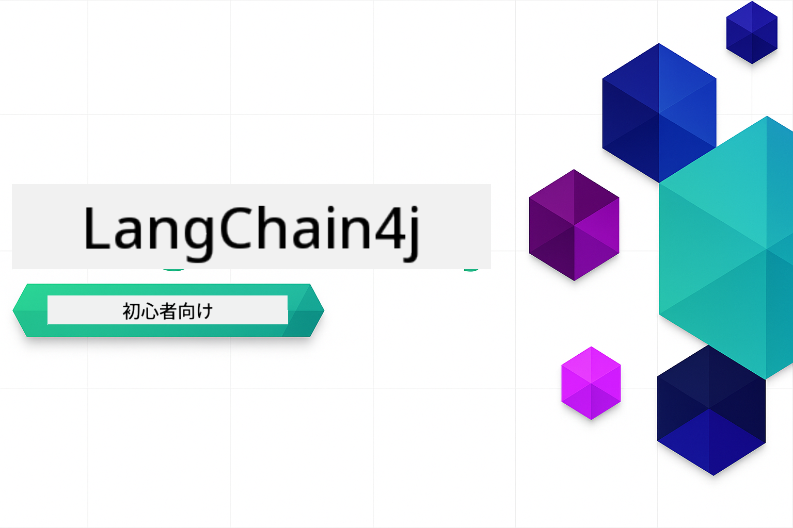

<!--
CO_OP_TRANSLATOR_METADATA:
{
  "original_hash": "69c7e2616c66df6cc296492fbfcad9ec",
  "translation_date": "2025-12-13T12:20:19+00:00",
  "source_file": "README.md",
  "language_code": "ja"
}
-->

# LangChain4j 入門者向け

LangChain4j と Azure OpenAI GPT-5 を使った AI アプリケーション構築のコース。基本的なチャットから AI エージェントまで。

**LangChain4j は初めてですか？** 重要な用語や概念の定義については [用語集](docs/GLOSSARY.md) をご覧ください。

## 目次

1. [クイックスタート](00-quick-start/README.md) - LangChain4j の始め方
2. [イントロダクション](01-introduction/README.md) - LangChain4j の基本を学ぶ
3. [プロンプトエンジニアリング](02-prompt-engineering/README.md) - 効果的なプロンプト設計を習得
4. [RAG（検索強化生成）](03-rag/README.md) - インテリジェントな知識ベースシステムを構築
5. [ツール](04-tools/README.md) - AI エージェントと外部ツールや API を統合
6. [MCP（モデルコンテキストプロトコル）](05-mcp/README.md) - モデルコンテキストプロトコルを扱う
---

## 学習パス

[クイックスタート](00-quick-start/README.md) モジュールから始めて、各モジュールを順に進めてスキルを段階的に構築しましょう。基本的な例を試して基礎を理解した後、GPT-5 を使ったより深い内容の [イントロダクション](01-introduction/README.md) モジュールに進みます。

モジュールを修了したら、[テストガイド](docs/TESTING.md) を参照して LangChain4j のテスト概念を実際に体験してください。

> **注意:** このトレーニングでは GitHub モデルと Azure OpenAI の両方を使用します。[クイックスタート](00-quick-start/README.md) と [MCP](05-mcp/README.md) モジュールは GitHub モデルを使用（Azure サブスクリプション不要）、モジュール 1～4 は Azure OpenAI GPT-5 を使用します。

## GitHub Copilot で学ぶ

すぐにコーディングを始めるには、このプロジェクトを GitHub Codespace または提供された devcontainer を使ってローカル IDE で開いてください。このコースで使う devcontainer は AI ペアプログラミング用の GitHub Copilot が事前設定されています。

各コード例には、GitHub Copilot に質問して理解を深めるための推奨質問が含まれています。💡/🤖 のプロンプトを探してください：

- **Java ファイルのヘッダー** - 各例に特化した質問
- **モジュールの README** - コード例の後の探求用プロンプト

**使い方:** 任意のコードファイルを開き、推奨質問を Copilot に尋ねてください。コードベースの全体コンテキストを把握しており、説明、拡張、代替案の提案が可能です。

もっと知りたいですか？[AI ペアプログラミング用 Copilot](https://aka.ms/GitHubCopilotAI) をご覧ください。

## 追加リソース

### LangChain

---

### Azure / Edge / MCP / エージェント

---
 
### 生成AIシリーズ

[-9333EA?style=for-the-badge&labelColor=E5E7EB&color=9333EA)](https://github.com/microsoft/Generative-AI-for-beginners-dotnet?WT.mc_id=academic-105485-koreyst)
[-C084FC?style=for-the-badge&labelColor=E5E7EB&color=C084FC)](https://github.com/microsoft/generative-ai-for-beginners-java?WT.mc_id=academic-105485-koreyst)
[-E879F9?style=for-the-badge&labelColor=E5E7EB&color=E879F9)](https://github.com/microsoft/generative-ai-with-javascript?WT.mc_id=academic-105485-koreyst)

---
 
### コア学習

---
 
### Copilot シリーズ

## ヘルプを得るには

AI アプリ構築で行き詰まったり質問がある場合は、以下に参加してください：

製品のフィードバックや構築中のエラーについては、こちらへ：

## ライセンス

MIT ライセンス - 詳細は [LICENSE](../../LICENSE) ファイルをご覧ください。

---

<!-- CO-OP TRANSLATOR DISCLAIMER START -->
**免責事項**：  
本書類はAI翻訳サービス「Co-op Translator」（https://github.com/Azure/co-op-translator）を使用して翻訳されました。正確性の向上に努めておりますが、自動翻訳には誤りや不正確な部分が含まれる可能性があります。原文の言語によるオリジナル文書が正式な情報源とみなされるべきです。重要な情報については、専門の人間による翻訳を推奨します。本翻訳の利用により生じた誤解や誤訳について、当方は一切の責任を負いかねます。
<!-- CO-OP TRANSLATOR DISCLAIMER END -->