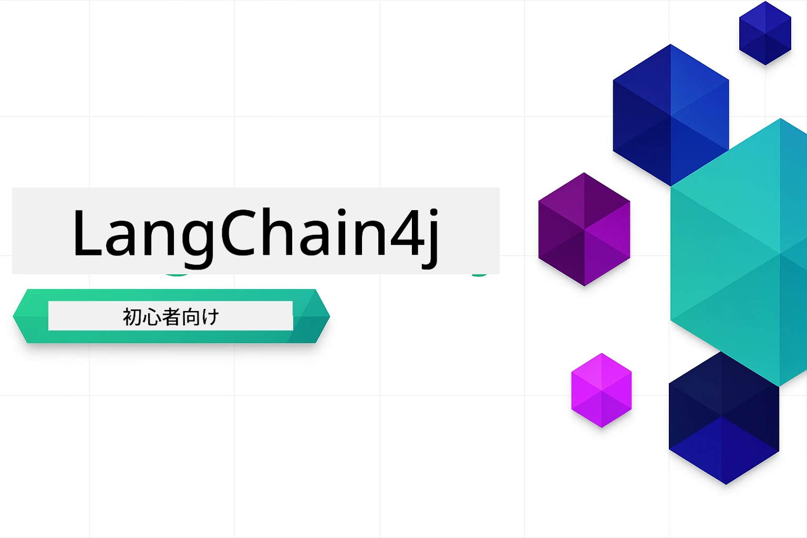

# LangChain4j 初心者向け

LangChain4j と Azure OpenAI GPT-5.2 を使って、基本的なチャットからAIエージェントまでのAIアプリケーションを構築するコース。

### 🌐 マルチ言語対応

#### GitHub Action 経由でサポート（自動＆常に最新）

<!-- CO-OP TRANSLATOR LANGUAGES TABLE START -->
[アラビア語](../ar/README.md) | [ベンガル語](../bn/README.md) | [ブルガリア語](../bg/README.md) | [ビルマ語 (ミャンマー)](../my/README.md) | [中国語（簡体字）](../zh-CN/README.md) | [中国語（繁体字、香港）](../zh-HK/README.md) | [中国語（繁体字、マカオ）](../zh-MO/README.md) | [中国語（繁体字、台湾）](../zh-TW/README.md) | [クロアチア語](../hr/README.md) | [チェコ語](../cs/README.md) | [デンマーク語](../da/README.md) | [オランダ語](../nl/README.md) | [エストニア語](../et/README.md) | [フィンランド語](../fi/README.md) | [フランス語](../fr/README.md) | [ドイツ語](../de/README.md) | [ギリシャ語](../el/README.md) | [ヘブライ語](../he/README.md) | [ヒンディー語](../hi/README.md) | [ハンガリー語](../hu/README.md) | [インドネシア語](../id/README.md) | [イタリア語](../it/README.md) | [日本語](./README.md) | [カンナダ語](../kn/README.md) | [クメール語](../km/README.md) | [韓国語](../ko/README.md) | [リトアニア語](../lt/README.md) | [マレー語](../ms/README.md) | [マラヤーラム語](../ml/README.md) | [マラーティー語](../mr/README.md) | [ネパール語](../ne/README.md) | [ナイジェリア・ピジン語](../pcm/README.md) | [ノルウェー語](../no/README.md) | [ペルシャ語（ファルシ）](../fa/README.md) | [ポーランド語](../pl/README.md) | [ポルトガル語（ブラジル）](../pt-BR/README.md) | [ポルトガル語（ポルトガル）](../pt-PT/README.md) | [パンジャブ語（グルムキー）](../pa/README.md) | [ルーマニア語](../ro/README.md) | [ロシア語](../ru/README.md) | [セルビア語（キリル文字）](../sr/README.md) | [スロバキア語](../sk/README.md) | [スロベニア語](../sl/README.md) | [スペイン語](../es/README.md) | [スワヒリ語](../sw/README.md) | [スウェーデン語](../sv/README.md) | [タガログ語（フィリピン語）](../tl/README.md) | [タミル語](../ta/README.md) | [テルグ語](../te/README.md) | [タイ語](../th/README.md) | [トルコ語](../tr/README.md) | [ウクライナ語](../uk/README.md) | [ウルドゥー語](../ur/README.md) | [ベトナム語](../vi/README.md)

> **ローカルでクローンする方が良いですか？**
>
> このリポジトリには50以上の言語翻訳が含まれているため、ダウンロードサイズが大きくなります。翻訳なしでクローンする場合は、スパースチェックアウトを使用してください：
>
> **Bash / macOS / Linux:**
> ```bash
> git clone --filter=blob:none --sparse https://github.com/microsoft/LangChain4j-for-Beginners.git
> cd LangChain4j-for-Beginners
> git sparse-checkout set --no-cone '/*' '!translations' '!translated_images'
> ```
>
> **CMD (Windows):**
> ```cmd
> git clone --filter=blob:none --sparse https://github.com/microsoft/LangChain4j-for-Beginners.git
> cd LangChain4j-for-Beginners
> git sparse-checkout set --no-cone "/*" "!translations" "!translated_images"
> ```
>
> これにより、コースを完了するために必要なすべてが、はるかに速いダウンロードで手に入ります。
<!-- CO-OP TRANSLATOR LANGUAGES TABLE END -->

## 目次

1. [イントロダクション](01-introduction/README.md) - LangChain4j の基本を学ぶ
2. [プロンプトエンジニアリング](02-prompt-engineering/README.md) - 効果的なプロンプト設計を習得
3. [RAG（検索強化生成）](03-rag/README.md) - インテリジェントな知識ベースシステムを構築
4. [ツール](04-tools/README.md) - 外部ツールとシンプルなアシスタントを統合
5. [MCP（モデルコンテキストプロトコル）](05-mcp/README.md) - MCPとエージェントモジュールで作業

### ビデオウォークスルー

各モジュールには伴走ライブセッションがあり、コンセプトとコードをステップごとに解説します。

| モジュール | ビデオ |
|--------|-------|
| 01 - イントロダクション | [LangChain4j を使った入門](https://www.youtube.com/live/nl_troDm8rQ) |
| 02 - プロンプトエンジニアリング | [LangChain4j でのプロンプトエンジニアリング](https://www.youtube.com/live/PJ6aBaE6bog) |
| 03 - RAG | [LangChain4j のRAG](https://www.youtube.com/watch?v=_olq75ZH_eY) |
| 04 - ツール & 05 - MCP | [ツールとMCPを使ったAIエージェント](https://www.youtube.com/watch?v=O_J30kZc0rw) |

---

## 学習パス

**LangChain4j初心者ですか？** 重要用語や概念の定義は [Glossary](docs/GLOSSARY.md) をご覧ください。

> <strong>クイックスタート</strong>

1. このリポジトリをあなたのGitHubアカウントにフォークする
2. **Code** → **Codespaces** タブ → **...** → **New with options...** をクリック
3. デフォルトのまま – これにより、このコース用に作成された開発コンテナが選択されます
4. **Create codespace** をクリック
5. 環境が準備されるまで5〜10分待つ
6. すぐに [イントロダクション](./01-introduction/README.md) にジャンプして開始！

モジュールを修了したら、[テストガイド](docs/TESTING.md) を参照して LangChain4j のテスト概念を実践で確認しましょう。

> **注意:** 本トレーニングは Azure OpenAI を使用します。まだお持ちでない場合は、[無料の Azure アカウント](https://aka.ms/azure-free-account) をご利用ください。


## GitHub Copilot で学ぶ

すぐにコーディングを始めたい場合は、このプロジェクトを GitHub Codespace または提供された devcontainer を使ってローカル IDE で開いてください。本コースで使う devcontainer は AIペアプログラミング用に GitHub Copilot が事前設定されています。

各コード例には、GitHub Copilot に質問して理解を深めるための質問例があります。以下で 💡/🤖 のプロンプトを探してください：

- **Java ファイルのヘッダー** - 各例に特化した質問
- **モジュールの README** - コード例後の探求用プロンプト

**使い方:** どのコードファイルでも開いて、提案された質問をCopilotに尋ねてください。コードベース全体のコンテキストが把握されており、説明や拡張、代替案の提案が可能です。

もっと学びたいですか？ [AI ペアプログラミングのための Copilot](https://aka.ms/GitHubCopilotAI) をご覧ください。


## 追加リソース

<!-- CO-OP TRANSLATOR OTHER COURSES START -->
### LangChain
[](https://aka.ms/langchain4j-for-beginners)
[](https://aka.ms/langchainjs-for-beginners?WT.mc_id=m365-94501-dwahlin)
[](https://github.com/microsoft/langchain-for-beginners?WT.mc_id=m365-94501-dwahlin)
---

### Azure / Edge / MCP / エージェント
[](https://github.com/microsoft/AZD-for-beginners?WT.mc_id=academic-105485-koreyst)
[](https://github.com/microsoft/edgeai-for-beginners?WT.mc_id=academic-105485-koreyst)
[](https://github.com/microsoft/mcp-for-beginners?WT.mc_id=academic-105485-koreyst)
[](https://github.com/microsoft/ai-agents-for-beginners?WT.mc_id=academic-105485-koreyst)

---
 
### ジェネレーティブAIシリーズ
[](https://github.com/microsoft/generative-ai-for-beginners?WT.mc_id=academic-105485-koreyst)
[-9333EA?style=for-the-badge&labelColor=E5E7EB&color=9333EA)](https://github.com/microsoft/Generative-AI-for-beginners-dotnet?WT.mc_id=academic-105485-koreyst)
[-C084FC?style=for-the-badge&labelColor=E5E7EB&color=C084FC)](https://github.com/microsoft/generative-ai-for-beginners-java?WT.mc_id=academic-105485-koreyst)
[-E879F9?style=for-the-badge&labelColor=E5E7EB&color=E879F9)](https://github.com/microsoft/generative-ai-with-javascript?WT.mc_id=academic-105485-koreyst)

---
 
### コア学習
[](https://aka.ms/ml-beginners?WT.mc_id=academic-105485-koreyst)
[](https://aka.ms/datascience-beginners?WT.mc_id=academic-105485-koreyst)
[](https://aka.ms/ai-beginners?WT.mc_id=academic-105485-koreyst)
[](https://github.com/microsoft/Security-101?WT.mc_id=academic-96948-sayoung)

[](https://aka.ms/webdev-beginners?WT.mc_id=academic-105485-koreyst)
[](https://aka.ms/iot-beginners?WT.mc_id=academic-105485-koreyst)
[](https://github.com/microsoft/xr-development-for-beginners?WT.mc_id=academic-105485-koreyst)

---
 
### Copilot シリーズ
[](https://aka.ms/GitHubCopilotAI?WT.mc_id=academic-105485-koreyst)
[](https://github.com/microsoft/mastering-github-copilot-for-dotnet-csharp-developers?WT.mc_id=academic-105485-koreyst)
[](https://github.com/microsoft/CopilotAdventures?WT.mc_id=academic-105485-koreyst)
<!-- CO-OP TRANSLATOR OTHER COURSES END -->

## ヘルプを得るには

AI アプリの構築で困ったり質問がある場合は、次に参加してください:

[](https://aka.ms/foundry/discord)

製品のフィードバックや構築中にエラーがあった場合は、次を参照してください:

[](https://aka.ms/foundry/forum)

## ライセンス

MIT ライセンス - 詳細は [LICENSE](../../LICENSE) ファイルを参照してください。

---

<!-- CO-OP TRANSLATOR DISCLAIMER START -->
**免責事項**：
本書類は AI 翻訳サービス [Co-op Translator](https://github.com/Azure/co-op-translator) を使用して翻訳されています。正確性を期していますが、自動翻訳には誤りや不正確な部分が含まれる可能性があることをご承知おきください。原文の原語版が正式な情報源とみなされるべきです。重要な情報については、専門の人間による翻訳を推奨します。本翻訳の利用により生じたいかなる誤解や解釈違いについても、当方は責任を負いかねます。
<!-- CO-OP TRANSLATOR DISCLAIMER END -->