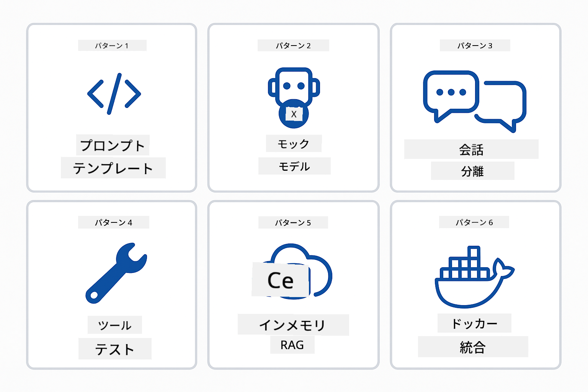
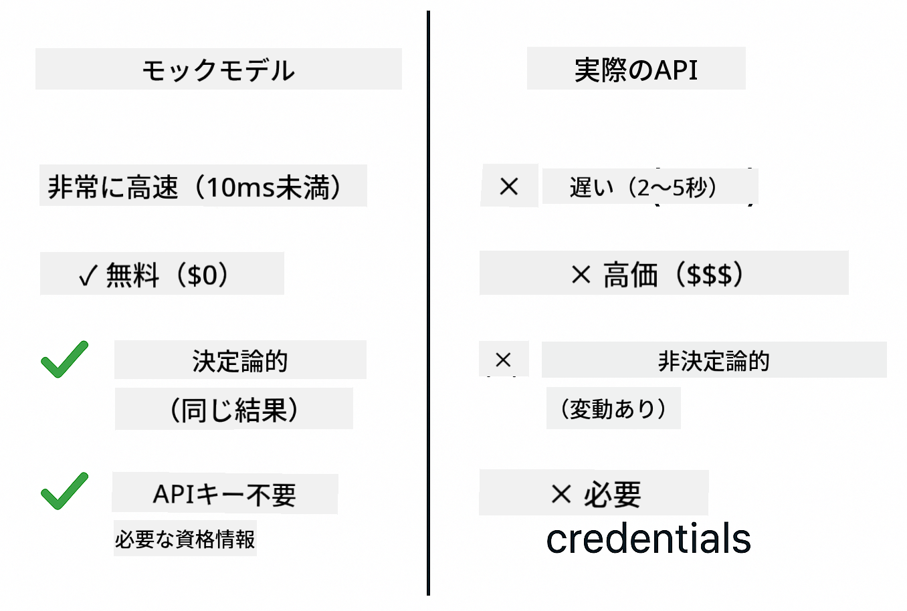
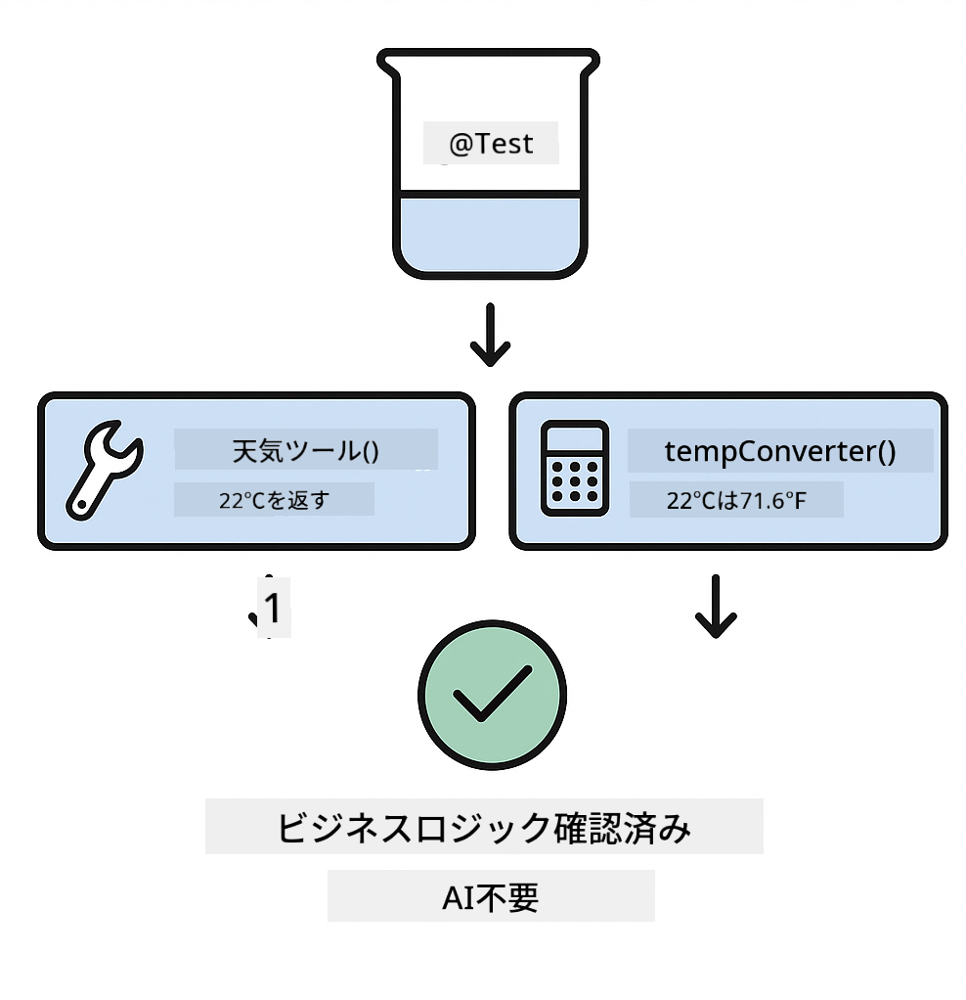
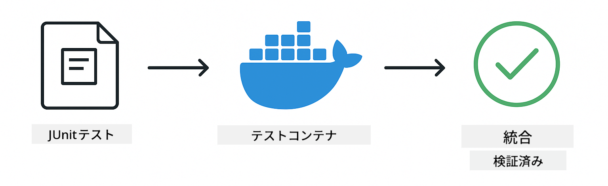

<!--
CO_OP_TRANSLATOR_METADATA:
{
  "original_hash": "b975537560c404d5f254331832811e78",
  "translation_date": "2025-12-13T20:45:53+00:00",
  "source_file": "docs/TESTING.md",
  "language_code": "ja"
}
-->
# LangChain4jアプリケーションのテスト

## 目次

- [クイックスタート](../../../docs)
- [テストの対象範囲](../../../docs)
- [テストの実行](../../../docs)
- [VS Codeでのテスト実行](../../../docs)
- [テストパターン](../../../docs)
- [テストの哲学](../../../docs)
- [次のステップ](../../../docs)

このガイドでは、APIキーや外部サービスを必要とせずにAIアプリケーションをテストする方法を示すテストについて説明します。

## クイックスタート

すべてのテストを一つのコマンドで実行します：

**Bash:**
```bash
mvn test
```

**PowerShell:**
```powershell
mvn --% test
```


*すべてのテストが失敗ゼロで成功したテスト実行の例*

## テストの対象範囲

このコースはローカルで実行される**ユニットテスト**に焦点を当てています。各テストはLangChain4jの特定の概念を単独で示します。


*ユニットテスト（高速で独立）、統合テスト（実際のコンポーネント）、エンドツーエンドテスト（Dockerを使った完全なシステム）のバランスを示すテストピラミッド。このトレーニングはユニットテストをカバーしています。*

| モジュール | テスト数 | フォーカス | 主要ファイル |
|--------|-------|-------|-----------|
| **00 - クイックスタート** | 6 | プロンプトテンプレートと変数置換 | `SimpleQuickStartTest.java` |
| **01 - はじめに** | 8 | 会話メモリと状態を持つチャット | `SimpleConversationTest.java` |
| **02 - プロンプトエンジニアリング** | 12 | GPT-5パターン、熱意レベル、構造化出力 | `SimpleGpt5PromptTest.java` |
| **03 - RAG** | 10 | ドキュメント取り込み、埋め込み、類似検索 | `DocumentServiceTest.java` |
| **04 - ツール** | 12 | 関数呼び出しとツールの連鎖 | `SimpleToolsTest.java` |
| **05 - MCP** | 15 | Dockerを使ったモデルコンテキストプロトコル | `SimpleMcpTest.java`, `McpDockerTransportTest.java` |

## テストの実行

**ルートからすべてのテストを実行：**

**Bash:**
```bash
mvn test
```

**PowerShell:**
```powershell
mvn --% test
```

**特定のモジュールのテストを実行：**

**Bash:**
```bash
cd 01-introduction && mvn test
# またはルートから
mvn test -pl 01-introduction
```

**PowerShell:**
```powershell
cd 01-introduction; mvn --% test
# またはルートから
mvn --% test -pl 01-introduction
```

**単一のテストクラスを実行：**

**Bash:**
```bash
mvn test -Dtest=SimpleConversationTest
```

**PowerShell:**
```powershell
mvn --% test -Dtest=SimpleConversationTest
```

**特定のテストメソッドを実行：**

**Bash:**
```bash
mvn test -Dtest=SimpleConversationTest#会話履歴を維持する必要があります
```

**PowerShell:**
```powershell
mvn --% test -Dtest=SimpleConversationTest#会話履歴を維持する必要があります
```

## VS Codeでのテスト実行

Visual Studio Codeを使用している場合、Test Explorerはテストの実行とデバッグのためのグラフィカルインターフェースを提供します。


*すべてのJavaテストクラスと個別のテストメソッドを表示するVS CodeのTest Explorerのテストツリー*

**VS Codeでテストを実行するには：**

1. アクティビティバーのビーカーアイコンをクリックしてTest Explorerを開く
2. テストツリーを展開してすべてのモジュールとテストクラスを表示
3. 任意のテストの横にある再生ボタンをクリックして個別に実行
4. 「すべてのテストを実行」をクリックして全スイートを実行
5. 任意のテストを右クリックし「テストのデバッグ」を選択してブレークポイントを設定しコードをステップ実行

Test Explorerは合格したテストに緑のチェックマークを表示し、失敗した場合は詳細な失敗メッセージを提供します。

## テストパターン



*LangChain4jアプリケーションの6つのテストパターン：プロンプトテンプレート、モデルのモック、会話の分離、ツールのテスト、インメモリRAG、Docker統合*

### パターン1：プロンプトテンプレートのテスト

最も単純なパターンはAIモデルを呼び出さずにプロンプトテンプレートをテストします。変数置換が正しく機能し、プロンプトが期待通りにフォーマットされていることを検証します。


*変数置換の流れを示すプロンプトテンプレートのテスト：プレースホルダー付きテンプレート → 値の適用 → フォーマット済み出力の検証*

```java
@Test
@DisplayName("Should format prompt template with variables")
void testPromptTemplateFormatting() {
    PromptTemplate template = PromptTemplate.from(
        "Best time to visit {{destination}} for {{activity}}?"
    );
    
    Prompt prompt = template.apply(Map.of(
        "destination", "Paris",
        "activity", "sightseeing"
    ));
    
    assertThat(prompt.text()).isEqualTo("Best time to visit Paris for sightseeing?");
}
```

このテストは`00-quick-start/src/test/java/com/example/langchain4j/quickstart/SimpleQuickStartTest.java`にあります。

**実行方法：**

**Bash:**
```bash
cd 00-quick-start && mvn test -Dtest=SimpleQuickStartTest#テストプロンプトテンプレートのフォーマット
```

**PowerShell:**
```powershell
cd 00-quick-start; mvn --% test -Dtest=SimpleQuickStartTest#テストプロンプトテンプレートのフォーマット
```

### パターン2：言語モデルのモック

会話ロジックをテストする際は、Mockitoを使って事前に決められた応答を返す偽モデルを作成します。これによりテストは高速で無料、かつ決定論的になります。



*テストにモックが好まれる理由の比較：高速、無料、決定論的でAPIキー不要*

```java
@ExtendWith(MockitoExtension.class)
class SimpleConversationTest {
    
    private ConversationService conversationService;
    
    @Mock
    private OpenAiOfficialChatModel mockChatModel;
    
    @BeforeEach
    void setUp() {
        ChatResponse mockResponse = ChatResponse.builder()
            .aiMessage(AiMessage.from("This is a test response"))
            .build();
        when(mockChatModel.chat(anyList())).thenReturn(mockResponse);
        
        conversationService = new ConversationService(mockChatModel);
    }
    
    @Test
    void shouldMaintainConversationHistory() {
        String conversationId = conversationService.startConversation();
        
        ChatResponse mockResponse1 = ChatResponse.builder()
            .aiMessage(AiMessage.from("Response 1"))
            .build();
        ChatResponse mockResponse2 = ChatResponse.builder()
            .aiMessage(AiMessage.from("Response 2"))
            .build();
        ChatResponse mockResponse3 = ChatResponse.builder()
            .aiMessage(AiMessage.from("Response 3"))
            .build();
        
        when(mockChatModel.chat(anyList()))
            .thenReturn(mockResponse1)
            .thenReturn(mockResponse2)
            .thenReturn(mockResponse3);

        conversationService.chat(conversationId, "First message");
        conversationService.chat(conversationId, "Second message");
        conversationService.chat(conversationId, "Third message");

        List<ChatMessage> history = conversationService.getHistory(conversationId);
        assertThat(history).hasSize(6); // 3つのユーザーと3つのAIメッセージ
    }
}
```

このパターンは`01-introduction/src/test/java/com/example/langchain4j/service/SimpleConversationTest.java`にあります。モックは一貫した動作を保証し、メモリ管理が正しく機能することを検証できます。

### パターン3：会話の分離テスト

会話メモリは複数ユーザーを分離して保持する必要があります。このテストは会話がコンテキストを混ぜないことを検証します。


*異なるユーザーのために別々のメモリストアを保持し、コンテキストの混在を防ぐ会話分離のテスト*

```java
@Test
void shouldIsolateConversationsByid() {
    String conv1 = conversationService.startConversation();
    String conv2 = conversationService.startConversation();
    
    ChatResponse mockResponse = ChatResponse.builder()
        .aiMessage(AiMessage.from("Response"))
        .build();
    when(mockChatModel.chat(anyList())).thenReturn(mockResponse);

    conversationService.chat(conv1, "Message for conversation 1");
    conversationService.chat(conv2, "Message for conversation 2");

    List<ChatMessage> history1 = conversationService.getHistory(conv1);
    List<ChatMessage> history2 = conversationService.getHistory(conv2);
    
    assertThat(history1).hasSize(2);
    assertThat(history2).hasSize(2);
}
```

各会話は独立した履歴を保持します。実運用システムでは、この分離がマルチユーザーアプリケーションにとって重要です。

### パターン4：ツールの独立テスト

ツールはAIが呼び出せる関数です。AIの判断に関係なく正しく動作することを直接テストします。



*AI呼び出しなしでモックツールを実行し、ビジネスロジックを検証するツールの独立テスト*

```java
@Test
void shouldConvertCelsiusToFahrenheit() {
    TemperatureTool tempTool = new TemperatureTool();
    String result = tempTool.celsiusToFahrenheit(25.0);
    assertThat(result).containsPattern("77[.,]0°F");
}

@Test
void shouldDemonstrateToolChaining() {
    WeatherTool weatherTool = new WeatherTool();
    TemperatureTool tempTool = new TemperatureTool();

    String weatherResult = weatherTool.getCurrentWeather("Seattle");
    assertThat(weatherResult).containsPattern("\\d+°C");

    String conversionResult = tempTool.celsiusToFahrenheit(22.0);
    assertThat(conversionResult).containsPattern("71[.,]6°F");
}
```

これらのテストは`04-tools/src/test/java/com/example/langchain4j/agents/tools/SimpleToolsTest.java`にあり、AIを介さずにツールロジックを検証します。連鎖の例は一つのツールの出力が別のツールの入力になる様子を示します。

### パターン5：インメモリRAGテスト

RAGシステムは通常ベクターデータベースや埋め込みサービスを必要とします。インメモリパターンは外部依存なしにパイプライン全体をテスト可能にします。


*データベース不要でドキュメント解析、埋め込み保存、類似検索を行うインメモリRAGテストのワークフロー*

```java
@Test
void testProcessTextDocument() {
    String content = "This is a test document.\nIt has multiple lines.";
    InputStream inputStream = new ByteArrayInputStream(content.getBytes(StandardCharsets.UTF_8));
    
    DocumentService.ProcessedDocument result = 
        documentService.processDocument(inputStream, "test.txt");

    assertNotNull(result);
    assertTrue(result.segments().size() > 0);
    assertEquals("test.txt", result.segments().get(0).metadata().getString("filename"));
}
```

このテストは`03-rag/src/test/java/com/example/langchain4j/rag/service/DocumentServiceTest.java`にあり、メモリ内でドキュメントを作成しチャンク分割やメタデータ処理を検証します。

### パターン6：Dockerを使った統合テスト

一部の機能は実際のインフラが必要です。MCPモジュールはTestcontainersを使いDockerコンテナを起動して統合テストを行います。これにより実サービスとの連携を検証しつつテストの分離も保ちます。



*Testcontainersを使ったMCP統合テストの自動コンテナライフサイクル：起動、テスト実行、停止、クリーンアップ*

`05-mcp/src/test/java/com/example/langchain4j/mcp/McpDockerTransportTest.java`のテストはDockerが起動している必要があります。

**実行方法：**

**Bash:**
```bash
cd 05-mcp && mvn test
```

**PowerShell:**
```powershell
cd 05-mcp; mvn --% test
```

## テストの哲学

AIではなくコードをテストしましょう。テストはプロンプトの構築方法、メモリ管理、ツールの実行を検証するべきです。AIの応答は変動するためテストのアサーションに含めるべきではありません。プロンプトテンプレートが正しく変数を置換しているかを問うべきで、AIが正しい答えを出すかどうかではありません。

言語モデルにはモックを使いましょう。外部依存で遅く、高価で、非決定論的だからです。モックを使うことでテストはミリ秒単位で高速、APIコストなしで無料、毎回同じ結果で決定論的になります。

テストは独立させましょう。各テストは自身のデータをセットアップし、他のテストに依存せず、実行後にクリーンアップします。実行順序に関わらずテストは合格すべきです。

ハッピーパス以外の境界ケースもテストしましょう。空入力、非常に大きな入力、特殊文字、無効なパラメータ、境界条件などです。これらは通常の使用では見つからないバグを明らかにします。

説明的な名前を使いましょう。`shouldMaintainConversationHistoryAcrossMultipleMessages()`と`test1()`を比べてください。前者は何をテストしているか正確に示し、失敗時のデバッグを容易にします。

## 次のステップ

テストパターンを理解したら、各モジュールをさらに深く学びましょう：

- **[00 - クイックスタート](../00-quick-start/README.md)** - プロンプトテンプレートの基本から始める
- **[01 - はじめに](../01-introduction/README.md)** - 会話メモリ管理を学ぶ
- **[02 - プロンプトエンジニアリング](../02-prompt-engineering/README.md)** - GPT-5のプロンプトパターンを習得
- **[03 - RAG](../03-rag/README.md)** - 検索強化生成システムを構築
- **[04 - ツール](../04-tools/README.md)** - 関数呼び出しとツールチェーンを実装
- **[05 - MCP](../05-mcp/README.md)** - Dockerとモデルコンテキストプロトコルを統合

各モジュールのREADMEにはここでテストされている概念の詳細な説明があります。

---

**ナビゲーション：** [← メインに戻る](../README.md)

---

<!-- CO-OP TRANSLATOR DISCLAIMER START -->
**免責事項**：  
本書類はAI翻訳サービス「Co-op Translator」（https://github.com/Azure/co-op-translator）を使用して翻訳されました。正確性を期しておりますが、自動翻訳には誤りや不正確な部分が含まれる可能性があります。原文の言語による文書が正式な情報源とみなされるべきです。重要な情報については、専門の人間による翻訳を推奨します。本翻訳の利用により生じたいかなる誤解や誤訳についても、当方は責任を負いかねます。
<!-- CO-OP TRANSLATOR DISCLAIMER END -->